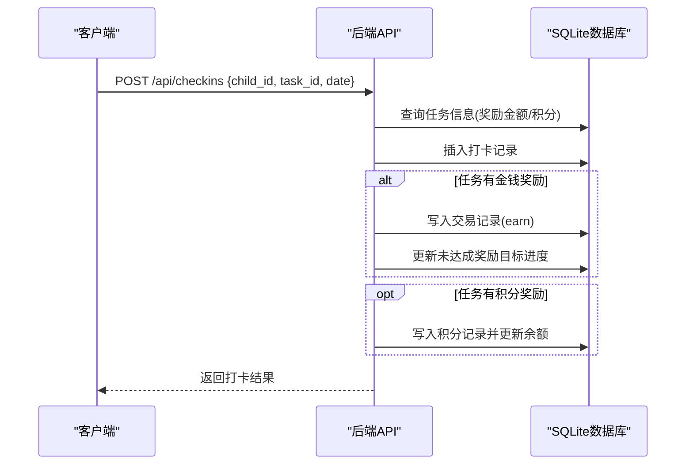
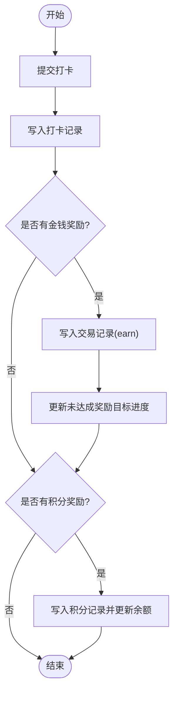
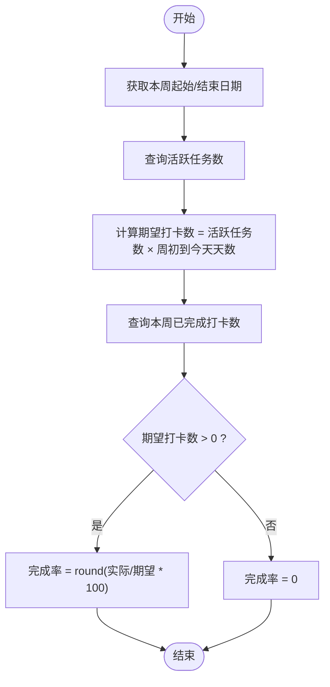

# 业务规则与术语表

<cite>
**本文引用的文件**
- [checkins.js](file://star-park/server/src/routes/checkins.js)
- [points.js](file://star-park/server/src/routes/points.js)
- [tasks.js](file://star-park/server/src/routes/tasks.js)
- [stats.js](file://star-park/server/src/routes/stats.js)
- [database.js](file://star-park/server/src/database.js)
- [api.md](file://docs/api.md)
- [ARCHITECTURE.md](file://docs/ARCHITECTURE.md)
</cite>

## 产品概述
星星乐园是面向多孩家庭的激励管理系统，核心机制为“任务打卡 + 双货币激励（金钱余额 + 积分）”，围绕“孩子”维度独立管理。家长可创建任务、设置奖励目标与积分规则；孩子通过每日打卡完成任务，获得金钱奖励与积分，并推进奖励目标的达成。系统提供小程序端与管理后台，后端以 Express + SQLite 提供服务。

- 目标用户：家长（管理与统计）、孩子（打卡与激励）
- 核心价值：用可量化的打卡行为驱动习惯养成，结合即时反馈（余额与积分）提升内驱力
- 适用场景：日常习惯培养、学习任务完成、家庭激励计划

**章节来源**
- [ARCHITECTURE.md:6-15](file://docs/ARCHITECTURE.md#L6-L15)
- [api.md:6-14](file://docs/api.md#L6-L14)

## 核心业务流程
- 任务创建与配置：家长为孩子创建任务，设置金钱奖励金额与单位、是否活跃、计划日期以及每次完成奖励的积分数量。
- 打卡与奖励发放：孩子或家长完成打卡后，系统写入打卡记录，若任务有金钱奖励则生成交易记录并更新奖励目标进度；若任务有积分奖励，则自动增加该孩子的积分余额。
- 一键全部打卡：为当日所有活跃任务批量打卡，已打卡的任务跳过，避免重复。
- 统计与可视化：计算连续打卡天数、本周完成率、近30天每日完成情况、余额等，供仪表盘展示。
- 积分管理：支持手动添加积分（家长操作），并维护积分明细与余额。
- 任务删除：删除任务时，同时清理其历史打卡记录，保证数据一致性。

**图表来源**
- [checkins.js:40-92](file://star-park/server/src/routes/checkins.js#L40-L92)
- [database.js:71-88](file://star-park/server/src/database.js#L71-L88)

**章节来源**
- [checkins.js:40-92](file://star-park/server/src/routes/checkins.js#L40-L92)
- [checkins.js:108-199](file://star-park/server/src/routes/checkins.js#L108-L199)
- [stats.js:7-100](file://star-park/server/src/routes/stats.js#L7-L100)
- [points.js:30-70](file://star-park/server/src/routes/points.js#L30-L70)
- [tasks.js:74-92](file://star-park/server/src/routes/tasks.js#L74-L92)

## 功能模块清单
- 打卡模块
  - 职责：记录每日任务完成情况，触发奖励与积分发放，支持一键全部打卡
  - 验收要点：同一孩子同任务同日不可重复打卡；未完成不发放奖励；自动打卡跳过已打卡项
- 统计模块
  - 职责：计算连续打卡天数、本周完成率、近30天每日打卡数、余额等
  - 验收要点：连续打卡从今日或昨日倒推；周完成率基于活跃任务数与周初至今的天数
- 积分模块
  - 职责：记录积分流水，维护孩子积分余额，支持手动添加积分
  - 验收要点：积分必须为非零整数；余额随积分增减实时更新
- 任务模块
  - 职责：创建、更新、删除任务；支持计划日期与积分奖励字段
  - 验收要点：删除任务需级联删除其打卡记录；更新时区分“未传”和“显式置空/置零”
- 奖励目标模块（关联）
  - 职责：跟踪累计奖励金额，达到目标后标记达成并可兑换
  - 验收要点：打卡产生金钱奖励时同步更新未达成目标进度

**章节来源**
- [checkins.js:16-106](file://star-park/server/src/routes/checkins.js#L16-L106)
- [stats.js:7-100](file://star-park/server/src/routes/stats.js#L7-L100)
- [points.js:5-70](file://star-park/server/src/routes/points.js#L5-L70)
- [tasks.js:5-92](file://star-park/server/src/routes/tasks.js#L5-L92)

## 数据与状态
- 核心实体
  - 孩子：拥有余额与积分余额
  - 任务：归属孩子，包含标题、描述、金钱奖励金额与单位、是否活跃、计划日期、每次完成奖励的积分数量
  - 打卡记录：记录某孩子在某日对某任务的完成情况及获得的金钱奖励
  - 交易记录：记录金钱收入/支出/兑换
  - 奖励目标：按孩子维度累计达成金额，达到目标后标记达成
  - 积分记录：记录每次积分变动原因与数量，维护孩子积分余额
- 关键状态流转
  - 打卡完成：写入打卡记录 → 若有金钱奖励则写入交易并更新奖励目标 → 若有积分奖励则写入积分并更新余额
  - 一键全部打卡：遍历活跃任务，去重后批量打卡，重复项标记跳过
  - 任务删除：事务内先删打卡记录再删任务，保证一致性
- 数据所有权边界
  - 所有数据按 child_id 隔离，统计与打卡均限定到具体孩子
  - 奖励目标与交易记录仅影响对应孩子的余额与进度

**图表来源**
- [checkins.js:40-92](file://star-park/server/src/routes/checkins.js#L40-L92)
- [points.js:30-70](file://star-park/server/src/routes/points.js#L30-L70)
- [database.js:71-88](file://star-park/server/src/database.js#L71-L88)

**章节来源**
- [database.js:27-116](file://star-park/server/src/database.js#L27-L116)
- [checkins.js:40-92](file://star-park/server/src/routes/checkins.js#L40-L92)
- [tasks.js:74-92](file://star-park/server/src/routes/tasks.js#L74-L92)

## 关键约束与边界
- 打卡规则
  - 必填字段：child_id、task_id、checkin_date；completed 默认完成
  - 同一孩子同任务同日不可重复打卡（自动打卡会去重）
  - 未完成打卡不发放金钱奖励与积分
  - 自动打卡仅针对 is_active=1 的活跃任务
- 连续打卡计算
  - 从今天开始倒推，若今天无打卡则从昨天开始
  - 连续定义为存在打卡记录的连续日期序列
  - 计算依据：取该孩子所有 distinct checkin_date，构建集合后向前计数
- 周完成率计算
  - 周范围：本周起始日到结束日
  - 期望打卡数：活跃任务数 ×（本周起始日到今天的天数）
  - 实际完成打卡数：本周内 completed=1 的打卡记录总数
  - 完成率 = 实际完成打卡数 / 期望打卡数（四舍五入取整百分比）
  - 若无活跃任务或期望打卡数为0，完成率为0
- 积分规则
  - 来源：任务完成自动奖励积分（优先使用请求传入的 points_reward，否则使用任务预设 points_reward）；家长手动添加积分
  - 约束：手动添加积分必须为非零整数；余额实时累加
  - 记录：每次积分变动写入 points 表，children.points_balance 同步更新
- 任务删除规则
  - 删除任务前校验存在性
  - 在事务内先删除该任务的所有打卡记录，再删除任务本身
  - 删除后不再参与打卡、统计与奖励计算
- 异常与错误处理
  - 参数缺失返回400；资源不存在返回404；服务器错误返回500
  - 自动打卡无活跃任务时返回成功但 created=0

**图表来源**
- [stats.js:38-57](file://star-park/server/src/routes/stats.js#L38-L57)

**章节来源**
- [checkins.js:40-106](file://star-park/server/src/routes/checkins.js#L40-L106)
- [checkins.js:108-199](file://star-park/server/src/routes/checkins.js#L108-L199)
- [stats.js:17-57](file://star-park/server/src/routes/stats.js#L17-L57)
- [points.js:30-70](file://star-park/server/src/routes/points.js#L30-L70)
- [tasks.js:74-92](file://star-park/server/src/routes/tasks.js#L74-L92)
- [api.md:232-365](file://docs/api.md#L232-L365)

## 统一术语表
- 孩子：被激励的对象，拥有独立的任务、打卡、奖励与积分
- 任务：可打卡的行为项，可设置金钱奖励与积分奖励，支持计划日期与活跃状态
- 打卡：对某任务在某日的完成记录，可标记完成与否
- 连续打卡：从今天或昨日倒推的连续有打卡记录的日期天数
- 周完成率：本周已完成打卡数占期望打卡数的百分比
- 期望打卡数：活跃任务数 × 本周起始日到今天的总天数
- 奖励目标：按孩子维度的累计目标，达到后标记达成并可兑换
- 余额：金钱账户，由交易记录（收入、支出、兑换）决定
- 积分：行为激励账户，用于非金钱激励，可手动添加
- 交易记录：记录金钱的 earn/spend/redeem 变动
- 活跃任务：is_active=1 的任务，参与打卡与统计
- 一键全部打卡：为当日所有活跃任务批量打卡，已打卡项跳过