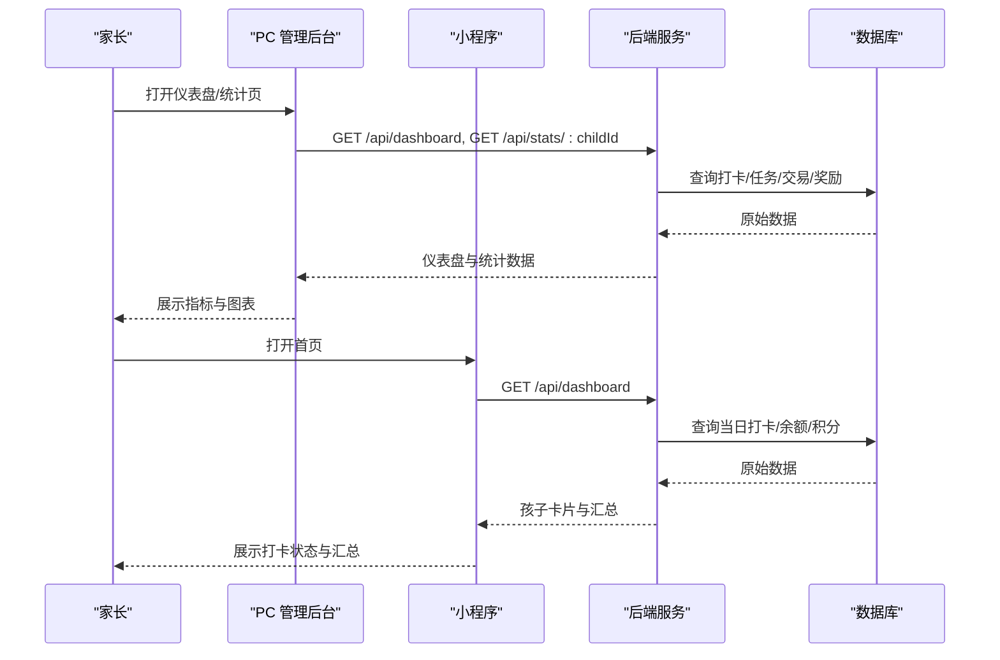
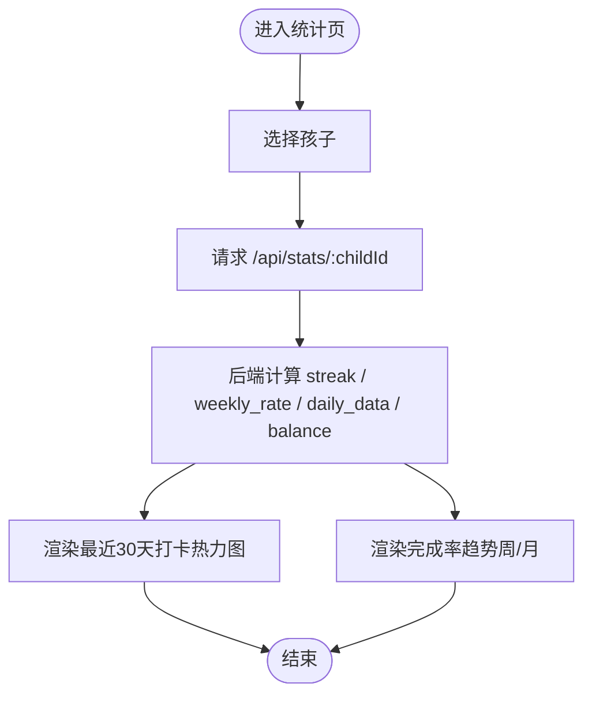

# 产品数据看板

<cite>
**本文引用的文件**
- [star-park/pc-admin/src/views/Dashboard.vue](file://star-park/pc-admin/src/views/Dashboard.vue)
- [star-park/pc-admin/src/views/Stats.vue](file://star-park/pc-admin/src/views/Stats.vue)
- [star-park/miniprogram/src/pages/index/index.vue](file://star-park/miniprogram/src/pages/index/index.vue)
- [star-park/miniprogram/src/components/ChildCard.vue](file://star-park/miniprogram/src/components/ChildCard.vue)
- [star-park/server/src/routes/stats.js](file://star-park/server/src/routes/stats.js)
- [star-park/server/src/routes/checkins.js](file://star-park/server/src/routes/checkins.js)
- [docs/api.md](file://docs/api.md)
- [docs/design-docs/pc-admin.md](file://docs/design-docs/pc-admin.md)
- [docs/design-docs/miniprogram.md](file://docs/design-docs/miniprogram.md)
</cite>

## 产品概述
本看板面向多孩家庭的激励管理，围绕“任务打卡 + 双货币激励（金钱+积分）”机制，为家长提供可量化的过程指标与结果指标，帮助家长理解每个孩子的坚持度、完成率与奖励进度，并据此调整目标与激励策略。PC 管理后台侧重家庭视角的总览与趋势分析；小程序端侧重孩子与家长日常打卡时的即时反馈与汇总。

## 核心业务流程
- 家长在 PC 管理后台查看仪表盘：加载所有孩子当日打卡情况、活跃任务、连续打卡天数、本周完成率、余额与积分、未达成奖励目标等，快速掌握家庭整体执行状态。
- 家长在 PC 管理后台进入统计页：选择具体孩子，查看最近30天打卡热力图与完成率趋势（按周/按月），用于评估长期习惯养成效果。
- 孩子在小程序首页看到自己的卡片：显示是否已打卡、连续打卡天数、累计余额，以及家庭维度的汇总（最长连续、本周完成、总积累）。
- 打卡完成后，后端自动写入交易记录、更新奖励进度、发放积分，并在下一轮刷新时体现到各端指标中。

**章节来源**
- [docs/design-docs/pc-admin.md:45-64](file://docs/design-docs/pc-admin.md#L45-L64)
- [docs/design-docs/miniprogram.md:45-62](file://docs/design-docs/miniprogram.md#L45-L62)
- [star-park/server/src/routes/stats.js:103-179](file://star-park/server/src/routes/stats.js#L103-L179)
- [star-park/server/src/routes/stats.js:6-101](file://star-park/server/src/routes/stats.js#L6-L101)

## 功能模块清单
- PC 仪表盘
  - 职责：聚合家庭维度关键指标，快速识别每个孩子今日执行情况、连续打卡、本周完成率、余额与积分、未达成奖励目标。
  - 用户价值：家长一屏掌握家庭执行全貌，便于及时干预与鼓励。
  - 验收要点：能正确展示孩子列表、今日打卡明细、活跃任务、连续打卡天数、本周完成率、余额与积分、未达成奖励目标。
- PC 统计页
  - 职责：按孩子维度输出最近30天打卡热力图与完成率趋势（周/月）。
  - 用户价值：观察长期行为变化，评估激励策略有效性。
  - 验收要点：切换孩子后图表刷新；热力图显示近30天每日打卡次数；趋势图支持周/月切换并正确计算完成率。
- 小程序首页
  - 职责：展示每个孩子打卡状态、连续打卡、累计余额，并提供家庭汇总（最长连续、本周完成、总积累）。
  - 用户价值：让孩子与家长获得即时正向反馈，增强坚持动力。
  - 验收要点：卡片显示“已打卡/待打卡”、连续打卡、余额；底部汇总数值合理且可点击跳转打卡。
- 打卡与奖励联动
  - 职责：打卡成功后写入交易记录、更新奖励进度、发放积分，并影响后续指标。
  - 用户价值：确保指标与业务事实一致，避免“打了卡却没奖励”的体验问题。
  - 验收要点：打卡后余额与奖励进度同步更新；积分增加；重复打卡被跳过或幂等处理。

**章节来源**
- [star-park/pc-admin/src/views/Dashboard.vue:8-17](file://star-park/pc-admin/src/views/Dashboard.vue#L8-L17)
- [star-park/pc-admin/src/views/Stats.vue:17-35](file://star-park/pc-admin/src/views/Stats.vue#L17-L35)
- [star-park/miniprogram/src/pages/index/index.vue:9-39](file://star-park/miniprogram/src/pages/index/index.vue#L9-L39)
- [star-park/server/src/routes/checkins.js:40-106](file://star-park/server/src/routes/checkins.js#L40-L106)

## 数据与状态
- 核心指标定义与解读
  - 连续打卡天数（streak）
    - 含义：从今天往前连续有打卡记录的天数；若今天未打卡则从昨天开始计算。
    - 业务解读：衡量坚持度与习惯稳定性，是正向激励的关键信号。
    - 数据来源：后端根据打卡日期集合自近及远计数。
  - 本周完成率（weekly_rate）
    - 含义：本周已完成打卡数 ÷ 本周应打卡数（活跃任务数 × 从周初到今天的天数）。
    - 业务解读：反映短期执行效率，低于预期时需关注任务难度或时间安排。
    - 数据来源：后端基于本周起止区间统计 completed=1 的打卡。
  - 最近30天打卡次数（daily_data/heatmap）
    - 含义：过去30天每天的打卡次数，缺失日补零。
    - 业务解读：观察波动与规律，识别易懈怠时段。
  - 余额（balance）
    - 含义：总收入 − 总支出 − 已兑换金额。
    - 业务解读：衡量金钱激励的累积效果，可用于兑换奖励目标。
  - 总积分（points_balance）
    - 含义：孩子当前持有的积分余额。
    - 业务解读：作为第二货币，用于额外激励或兑换。
  - 未达成奖励目标（rewards）
    - 含义：尚未达到目标金额/积分的奖励项。
    - 业务解读：明确下一步努力方向，有助于目标导向激励。
  - 小程序汇总指标
    - 最长连续（maxStreak）：家庭内所有孩子中的最大连续打卡天数。
    - 本周完成（weeklyRate）：家庭维度本周完成率（前端占位展示，建议由后端统一计算）。
    - 总积累（totalBalance）：家庭内所有孩子余额之和。

- 数据流向与计算位置
  - 后端 stats.js
    - 计算 streak、weekly_rate、weekly_checkins、active_tasks、balance、daily_data。
    - 仪表盘聚合 children 的今日打卡、活跃任务、streak、weekly_rate、balance、points_balance、rewards。
  - 前端展示
    - PC 仪表盘：渲染孩子卡片与汇总信息。
    - PC 统计页：将 daily_data 渲染为热力图，将 trend.weekly/monthly 渲染为折线趋势。
    - 小程序首页：读取 dashboard 返回的孩子数据，计算 maxStreak、weeklyRate、totalBalance。

**图表来源**
- [star-park/server/src/routes/stats.js:6-101](file://star-park/server/src/routes/stats.js#L6-L101)
- [star-park/pc-admin/src/views/Stats.vue:68-82](file://star-park/pc-admin/src/views/Stats.vue#L68-L82)
- [star-park/pc-admin/src/views/Stats.vue:84-151](file://star-park/pc-admin/src/views/Stats.vue#L84-L151)
- [star-park/pc-admin/src/views/Stats.vue:153-242](file://star-park/pc-admin/src/views/Stats.vue#L153-L242)

**章节来源**
- [star-park/server/src/routes/stats.js:6-101](file://star-park/server/src/routes/stats.js#L6-L101)
- [star-park/server/src/routes/stats.js:103-179](file://star-park/server/src/routes/stats.js#L103-L179)
- [star-park/pc-admin/src/views/Dashboard.vue:21-68](file://star-park/pc-admin/src/views/Dashboard.vue#L21-L68)
- [star-park/pc-admin/src/views/Stats.vue:68-242](file://star-park/pc-admin/src/views/Stats.vue#L68-L242)
- [star-park/miniprogram/src/pages/index/index.vue:49-90](file://star-park/miniprogram/src/pages/index/index.vue#L49-L90)
- [star-park/miniprogram/src/components/ChildCard.vue:17-26](file://star-park/miniprogram/src/components/ChildCard.vue#L17-L26)
- [docs/api.md:312-332](file://docs/api.md#L312-L332)

## 关键约束与边界
- 指标口径一致性
  - 连续打卡以“连续有打卡记录”的天数为准，若今天未打卡则从昨天起算。
  - 本周完成率的分母为“活跃任务数 × 从周初到今天的天数”，分子为期间 completed=1 的打卡数。
- 数据完整性
  - 最近30天热力图会填充缺失日为0，避免误判为无数据。
  - 余额计算需考虑收入、支出与已兑换，确保与交易记录一致。
- 权限与范围
  - 统计接口按 childId 隔离，仅返回对应孩子的数据。
  - 小程序首页汇总为家庭维度，但卡片级指标仍按孩子维度展示。
- 性能与可用性
  - 统计页图表在窗口尺寸变化时重绘，避免布局错乱。
  - 仪表盘加载失败时回退到本地缓存的孩子列表，保证基本可用。

**章节来源**
- [star-park/server/src/routes/stats.js:17-36](file://star-park/server/src/routes/stats.js#L17-L36)
- [star-park/server/src/routes/stats.js:38-57](file://star-park/server/src/routes/stats.js#L38-L57)
- [star-park/server/src/routes/stats.js:58-77](file://star-park/server/src/routes/stats.js#L58-L77)
- [star-park/server/src/routes/stats.js:79-87](file://star-park/server/src/routes/stats.js#L79-L87)
- [star-park/pc-admin/src/views/Stats.vue:244-263](file://star-park/pc-admin/src/views/Stats.vue#L244-L263)
- [star-park/pc-admin/src/views/Dashboard.vue:53-68](file://star-park/pc-admin/src/views/Dashboard.vue#L53-L68)