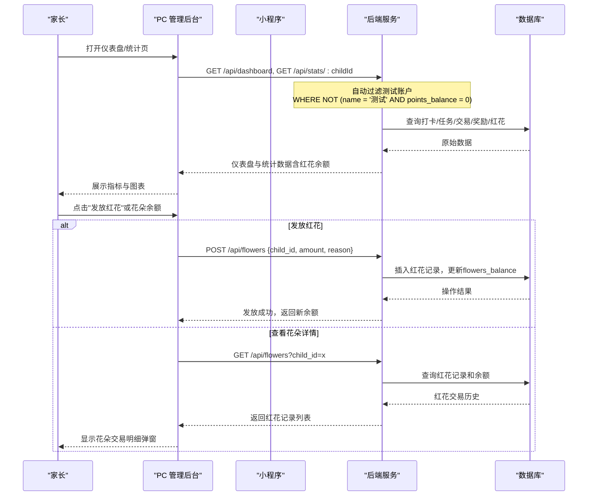
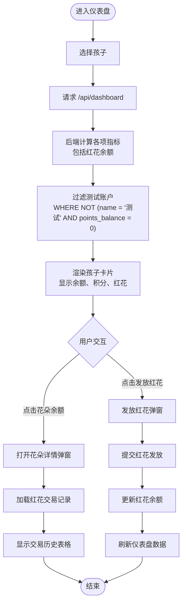
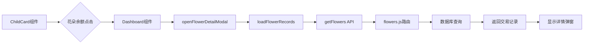

# 产品数据看板

<cite>
**本文引用的文件**
- [star-park/pc-admin/src/views/Dashboard.vue](file://star-park/pc-admin/src/views/Dashboard.vue)
- [star-park/pc-admin/src/components/ChildCard.vue](file://star-park/pc-admin/src/components/ChildCard.vue)
- [star-park/miniprogram/src/pages/index/index.vue](file://star-park/miniprogram/src/pages/index/index.vue)
- [star-park/miniprogram/src/components/ChildCard.vue](file://star-park/miniprogram/src/components/ChildCard.vue)
- [star-park/server/src/routes/stats.js](file://star-park/server/src/routes/stats.js)
- [star-park/server/src/routes/flowers.js](file://star-park/server/src/routes/flowers.js)
- [star-park/server/src/database.js](file://star-park/server/src/database.js)
- [star-park/server/tests/stats.test.js](file://star-park/server/tests/stats.test.js)
- [star-park/server/tests/flowers.test.js](file://star-park/server/tests/flowers.test.js)
- [star-park/pc-admin/src/api/index.js](file://star-park/pc-admin/src/api/index.js)
- [star-park/pc-admin/src/components/SideNav.vue](file://star-park/pc-admin/src/components/SideNav.vue)
- [star-park/server/src/app.js](file://star-park/server/src/app.js)
- [docs/api.md](file://docs/api.md)
- [docs/design-docs/pc-admin.md](file://docs/design-docs/pc-admin.md)
- [docs/design-docs/miniprogram.md](file://docs/design-docs/miniprogram.md)
</cite>

## 更新摘要
**所做更改**
- 新增了花朵授予功能，支持在仪表盘中手动发放红花奖励
- ChildCard组件新增显示花朵余额，与余额和积分并列展示
- 统计数据接口返回包含花朵余额信息
- 导航菜单进行了清理，移除了测试目标管理入口
- 数据库新增flowers表和flowers_balance字段，支持第三种货币体系
- **新增**：花朵详情模态框功能，支持点击花朵余额查看详细交易记录
- **新增**：花朵交易历史的可视化展示和错误处理机制

## 产品概述
本看板面向多孩家庭的激励管理，围绕"任务打卡 + 三货币激励（金钱+积分+红花）"机制，为家长提供可量化的过程指标与结果指标，帮助家长理解每个孩子的坚持度、完成率与奖励进度，并据此调整目标与激励策略。PC 管理后台侧重家庭视角的总览与趋势分析；小程序端侧重孩子与家长日常打卡时的即时反馈与汇总。

**更新** 系统现在支持三种货币体系：金钱（元）、积分（星星）和红花（特殊奖励）。仪表盘会自动过滤名称为"测试"且积分为0的测试账户，确保只显示真实有效的用户数据，同时保留有积分或红花余额的测试账户用于功能验证。**新增**：花朵余额现在支持点击交互，可查看详细的红花交易历史记录。

## 核心业务流程
- 家长在 PC 管理后台查看仪表盘：加载所有孩子当日打卡情况、活跃任务、连续打卡天数、本周完成率、余额与积分、红花余额、未达成奖励目标等，快速掌握家庭整体执行状态。**新增**：可通过"发放红花"按钮直接给指定孩子发放红花奖励，并可点击花朵余额查看详细交易记录。
- 家长在 PC 管理后台进入统计页：选择具体孩子，查看最近30天打卡热力图与完成率趋势（按周/按月），用于评估长期习惯养成效果。
- 孩子在小程序首页看到自己的卡片：显示是否已打卡、连续打卡天数、累计余额，以及家庭维度的汇总（最长连续、本周完成、总积累）。
- 打卡完成后，后端自动写入交易记录、更新奖励进度、发放积分和红花，并在下一轮刷新时体现到各端指标中。

**章节来源**
- [docs/design-docs/pc-admin.md:45-64](file://docs/design-docs/pc-admin.md#L45-L64)
- [docs/design-docs/miniprogram.md:45-62](file://docs/design-docs/miniprogram.md#L45-L62)
- [star-park/server/src/routes/stats.js:103-183](file://star-park/server/src/routes/stats.js#L103-L183)
- [star-park/server/src/routes/stats.js:6-101](file://star-park/server/src/routes/stats.js#L6-L101)
- [star-park/server/src/routes/flowers.js:30-72](file://star-park/server/src/routes/flowers.js#L30-L72)

## 功能模块清单
- PC 仪表盘
  - 职责：聚合家庭维度关键指标，快速识别每个孩子今日执行情况、连续打卡、本周完成率、余额与积分、红花余额、未达成奖励目标。
  - 用户价值：家长一屏掌握家庭执行全貌，便于及时干预与鼓励。
  - 验收要点：能正确展示孩子列表、今日打卡明细、活跃任务、连续打卡天数、本周完成率、余额与积分、红花余额、未达成奖励目标。**新增**：支持通过"发放红花"按钮进行红花奖励发放，点击花朵余额可查看详细交易记录，自动过滤名称为"测试"且积分为0的测试账户。
- PC 统计页
  - 职责：按孩子维度输出最近30天打卡热力图与完成率趋势（周/月）。
  - 用户价值：观察长期行为变化，评估激励策略有效性。
  - 验收要点：切换孩子后图表刷新；热力图显示近30天每日打卡次数；趋势图支持周/月切换并正确计算完成率。
- 小程序首页
  - 职责：展示每个孩子打卡状态、连续打卡、累计余额，并提供家庭汇总（最长连续、本周完成、总积累）。
  - 用户价值：让孩子与家长获得即时正向反馈，增强坚持动力。
  - 验收要点：卡片显示"已打卡/待打卡"、连续打卡、余额；底部汇总数值合理且可点击跳转打卡。
- 红花奖励系统
  - 职责：支持家长手动发放红花奖励，记录红花流水，更新孩子红花余额。
  - 用户价值：提供灵活的非物质激励手段，增强教育效果。
  - 验收要点：红花发放成功后实时更新余额；红花记录可查询；支持批量发放和理由记录。**新增**：支持花朵余额点击交互，查看详细交易历史和错误处理。

**章节来源**
- [star-park/pc-admin/src/views/Dashboard.vue:1-95](file://star-park/pc-admin/src/views/Dashboard.vue#L1-L95)
- [star-park/pc-admin/src/components/ChildCard.vue:1-32](file://star-park/pc-admin/src/components/ChildCard.vue#L1-L32)
- [star-park/miniprogram/src/pages/index/index.vue:9-39](file://star-park/miniprogram/src/pages/index/index.vue#L9-L39)
- [star-park/server/src/routes/checkins.js:40-106](file://star-park/server/src/routes/checkins.js#L40-L106)
- [star-park/server/src/routes/flowers.js:30-72](file://star-park/server/src/routes/flowers.js#L30-L72)

## 数据与状态
- 核心指标定义与解读
  - 连续打卡天数（streak）
    - 含义：从今天往前连续有打卡记录的天数；若今天未打卡则从昨天开始计算。
    - 业务解读：衡量坚持度与习惯稳定性，是正向激励的关键信号。
    - 数据来源：后端根据打卡日期集合自近及远计数。
  - 本周完成率（weekly_rate）
    - 含义：本周已完成打卡数 ÷ 本周应打卡数（活跃任务数 × 从周初到今天的天数）。
    - 业务解读：反映短期执行效率，低于预期时需关注任务难度或时间安排。
    - 数据来源：后端基于本周起止区间统计 completed=1 的打卡。
  - 最近30天打卡次数（daily_data/heatmap）
    - 含义：过去30天每天的打卡次数，缺失日补零。
    - 业务解读：观察波动与规律，识别易懈怠时段。
  - 余额（balance）
    - 含义：总收入 − 总支出 − 已兑换金额。
    - 业务解读：衡量金钱激励的累积效果，可用于兑换奖励目标。
  - 总积分（points_balance）
    - 含义：孩子当前持有的积分余额。
    - 业务解读：作为第二货币，用于额外激励或兑换。
  - **新增** 红花余额（flowers_balance）
    - 含义：孩子当前持有的红花数量，用于特殊奖励。
    - 业务解读：作为第三货币，提供非物质激励手段，增强教育效果。
    - 数据来源：flowers表记录和children.flowers_balance缓存。
  - 未达成奖励目标（rewards）
    - 含义：尚未达到目标金额/积分/红花的奖励项。
    - 业务解读：明确下一步努力方向，有助于目标导向激励。
  - 小程序汇总指标
    - 最长连续（maxStreak）：家庭内所有孩子中的最大连续打卡天数。
    - 本周完成（weeklyRate）：家庭维度本周完成率（前端占位展示，建议由后端统一计算）。
    - 总积累（totalBalance）：家庭内所有孩子余额之和。

- 测试账户过滤规则
  - 过滤条件：名称为"测试"且积分为0的账户会被自动过滤
  - 保留条件：名称为"测试"但积分或红花不为0的账户仍会显示
  - 实现位置：后端仪表盘接口 SQL 查询条件
  - 业务目的：清理开发测试数据，保持生产环境数据整洁

- 数据流向与计算位置
  - 后端 stats.js
    - 计算 streak、weekly_rate、weekly_checkins、active_tasks、balance、daily_data。
    - 仪表盘聚合 children 的今日打卡、活跃任务、streak、weekly_rate、balance、points_balance、flowers_balance、rewards。
    - **新增**：在查询 children 时添加过滤条件 `WHERE NOT (name = '测试' AND COALESCE(points_balance, 0) = 0)`，并返回 flowers_balance 字段。
  - 后端 flowers.js
    - 提供红花记录的查询和发放功能。
    - 支持事务处理，确保红花记录插入和余额更新的原子性。
  - 前端展示
    - PC 仪表盘：渲染孩子卡片与汇总信息，新增"发放红花"按钮和弹窗。
    - **新增**：花朵详情模态框：点击花朵余额弹出详细交易记录，展示时间、数量、说明等信息。
    - PC 统计页：将 daily_data 渲染为热力图，将 trend.weekly/monthly 渲染为折线趋势。
    - 小程序首页：读取 dashboard 返回的孩子数据，计算 maxStreak、weeklyRate、totalBalance。

**图表来源**
- [star-park/server/src/routes/stats.js:6-101](file://star-park/server/src/routes/stats.js#L6-L101)
- [star-park/server/src/routes/stats.js:103-183](file://star-park/server/src/routes/stats.js#L103-L183)
- [star-park/server/src/routes/flowers.js:30-72](file://star-park/server/src/routes/flowers.js#L30-L72)
- [star-park/pc-admin/src/views/Dashboard.vue:184-211](file://star-park/pc-admin/src/views/Dashboard.vue#L184-L211)

**章节来源**
- [star-park/server/src/routes/stats.js:6-101](file://star-park/server/src/routes/stats.js#L6-L101)
- [star-park/server/src/routes/stats.js:103-183](file://star-park/server/src/routes/stats.js#L103-L183)
- [star-park/pc-admin/src/views/Dashboard.vue:21-68](file://star-park/pc-admin/src/views/Dashboard.vue#L21-L68)
- [star-park/pc-admin/src/components/ChildCard.vue:18-30](file://star-park/pc-admin/src/components/ChildCard.vue#L18-L30)
- [star-park/miniprogram/src/pages/index/index.vue:49-90](file://star-park/miniprogram/src/pages/index/index.vue#L49-L90)
- [star-park/miniprogram/src/components/ChildCard.vue:17-26](file://star-park/miniprogram/src/components/ChildCard.vue#L17-L26)
- [docs/api.md:312-332](file://docs/api.md#L312-L332)

## 关键约束与边界
- 指标口径一致性
  - 连续打卡以"连续有打卡记录"的天数为准，若今天未打卡则从昨天起算。
  - 本周完成率的分母为"活跃任务数 × 从周初到今天的天数"，分子为期间 completed=1 的打卡数。
- 数据完整性
  - 最近30天热力图会填充缺失日为0，避免误判为无数据。
  - 余额计算需考虑收入、支出与已兑换，确保与交易记录一致。
  - **新增** 红花余额计算需考虑红花记录总和，确保与flowers表数据一致。
- 权限与范围
  - 统计接口按 childId 隔离，仅返回对应孩子的数据。
  - 小程序首页汇总为家庭维度，但卡片级指标仍按孩子维度展示。
  - **新增**：仪表盘接口自动过滤测试账户，确保生产环境数据质量。
  - **新增**：红花发放需要有效的child_id和amount参数，支持事务处理保证数据一致性。
- 性能与可用性
  - 统计页图表在窗口尺寸变化时重绘，避免布局错乱。
  - 仪表盘加载失败时回退到本地缓存的孩子列表，保证基本可用。
  - **新增**：红花发放采用事务处理，确保记录插入和余额更新的原子性。
  - **新增**：花朵详情弹窗支持加载状态和错误处理，提升用户体验。

**章节来源**
- [star-park/server/src/routes/stats.js:17-36](file://star-park/server/src/routes/stats.js#L17-L36)
- [star-park/server/src/routes/stats.js:38-57](file://star-park/server/src/routes/stats.js#L38-L57)
- [star-park/server/src/routes/stats.js:58-77](file://star-park/server/src/routes/stats.js#L58-L77)
- [star-park/server/src/routes/stats.js:79-87](file://star-park/server/src/routes/stats.js#L79-L87)
- [star-park/server/src/routes/stats.js:110](file://star-park/server/src/routes/stats.js#L110)
- [star-park/server/src/routes/flowers.js:43-55](file://star-park/server/src/routes/flowers.js#L43-L55)
- [star-park/pc-admin/src/components/SideNav.vue:66-83](file://star-park/pc-admin/src/components/SideNav.vue#L66-L83)

## 新增功能：花朵详情模态框

### 功能描述
系统增强了花朵详情模态框功能，允许家长在仪表盘中点击花朵余额查看详细的花红花交易历史记录。该功能提供了完整的UI/UX改进，包括可点击的花朵余额显示、详细交易记录查看、以及相关的错误处理机制。

### 实现细节
- **交互设计**：
  - ChildCard组件中的花朵余额行变为可点击状态，鼠标悬停时显示指针光标
  - 点击后触发`show-flowers`事件，向父组件传递当前孩子对象
- **详情弹窗**：
  - 使用Element Plus的Dialog组件创建花朵详情弹窗
  - 弹窗标题动态显示当前孩子的名字："XXX 的红花记录"
  - 表格展示三列信息：时间、数量、说明
  - 支持正负金额的颜色区分（绿色表示增加，红色表示减少）
- **数据加载**：
  - 调用`getFlowers` API获取红花交易记录
  - 支持加载状态显示，防止重复请求
  - 完善的错误处理机制，包括网络异常和数据解析错误
- **样式优化**：
  - 花朵余额使用醒目的粉色主题色（#E9165D）
  - 交易记录表格支持斑马纹显示，提升可读性
  - 响应式设计，适配不同屏幕尺寸

### 技术架构

### 业务价值
- 提供透明的红花交易追踪，增强家长对奖励系统的信任
- 支持审计和追溯，便于了解红花发放的具体原因和时间
- 改善用户体验，提供直观的红花管理界面
- 支持教育场景下的正向反馈记录和分析

### 测试验证
系统包含完整的测试用例来验证花朵详情功能的正确性：
- 验证花朵余额点击交互正常工作
- 验证花朵详情弹窗的数据加载和显示
- 验证交易记录的正确排序和格式化
- 验证错误处理和异常情况处理
- 验证UI样式的正确性和响应式适配

**章节来源**
- [star-park/pc-admin/src/components/ChildCard.vue:24-29](file://star-park/pc-admin/src/components/ChildCard.vue#L24-L29)
- [star-park/pc-admin/src/views/Dashboard.vue:97-122](file://star-park/pc-admin/src/views/Dashboard.vue#L97-L122)
- [star-park/pc-admin/src/views/Dashboard.vue:251-279](file://star-park/pc-admin/src/views/Dashboard.vue#L251-L279)
- [star-park/server/src/routes/flowers.js:5-28](file://star-park/server/src/routes/flowers.js#L5-L28)

## 导航菜单清理

### 功能描述
对PC管理后台的导航菜单进行了清理，移除了测试目标管理的入口，确保生产环境的导航简洁性和专业性。

### 实现细节
- **过滤逻辑**：在生成目标管理子菜单时，过滤掉名称为"测试"的孩子
- **应用位置**：SideNav组件的目标管理子菜单生成逻辑
- **显示效果**：测试孩子的目标管理入口不会出现在导航菜单中

### 业务价值
- 提升生产环境的专业性和用户体验
- 避免测试数据干扰正常业务流程
- 保持导航菜单的简洁性和实用性

**章节来源**
- [star-park/pc-admin/src/components/SideNav.vue:66-83](file://star-park/pc-admin/src/components/SideNav.vue#L66-L83)