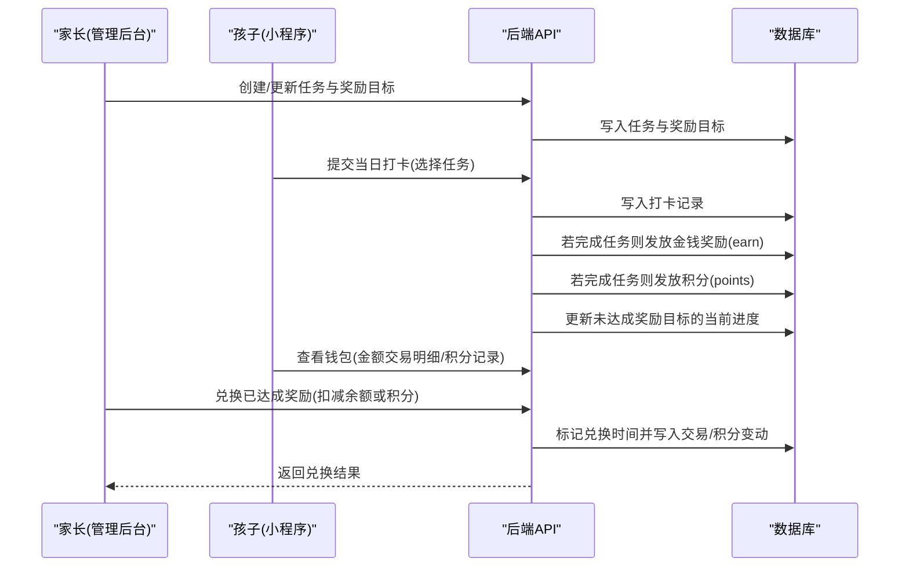
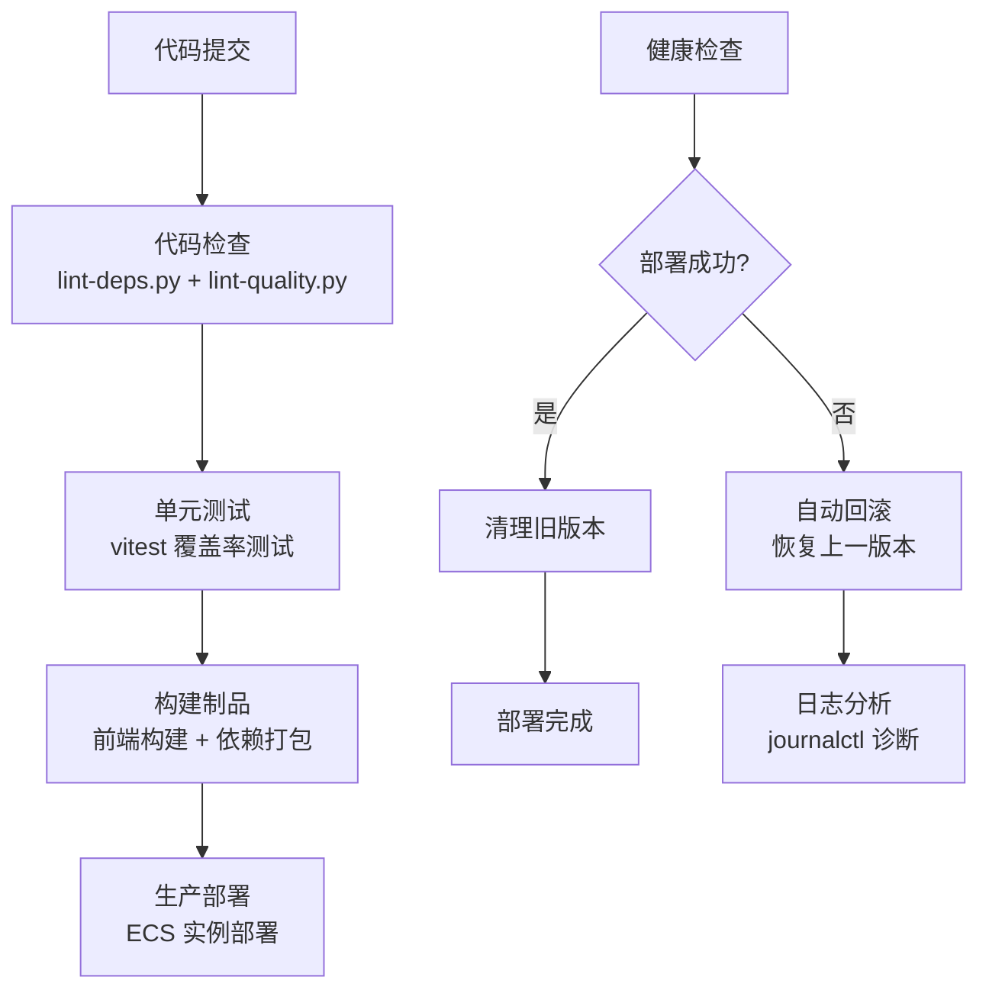
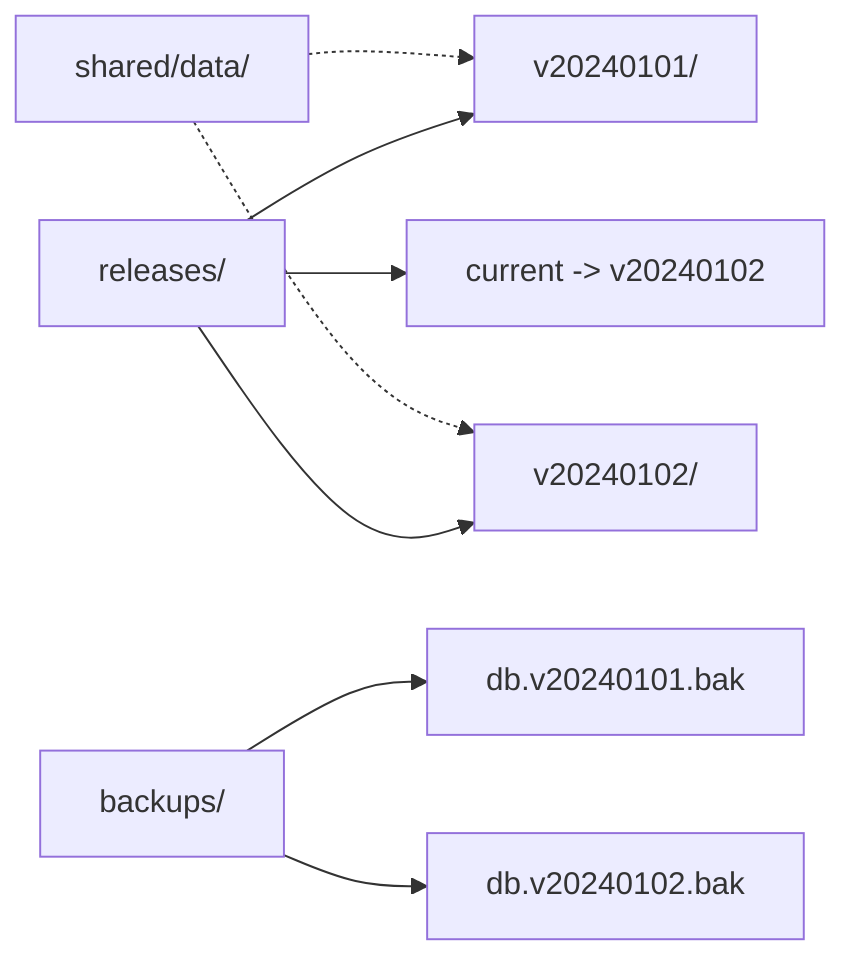
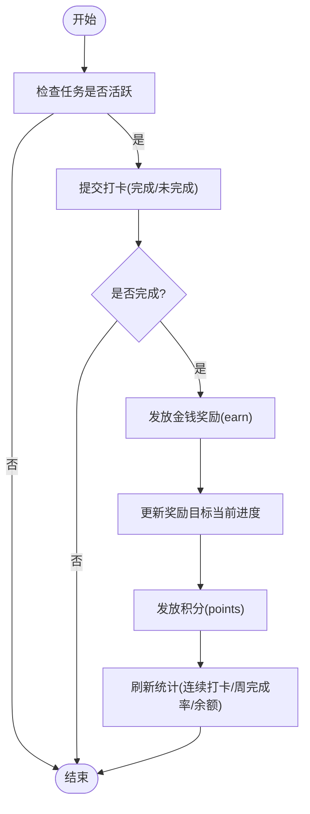

# 产品概览与价值主张

<cite>
**本文引用的文件**
- [star-park/server/src/routes/checkins.js](file://star-park/server/src/routes/checkins.js)
- [star-park/server/src/routes/tasks.js](file://star-park/server/src/routes/tasks.js)
- [star-park/server/src/routes/rewards.js](file://star-park/server/src/routes/rewards.js)
- [star-park/server/src/routes/points.js](file://star-park/server/src/routes/points.js)
- [star-park/server/src/routes/stats.js](file://star-park/server/src/routes/stats.js)
- [star-park/server/src/database.js](file://star-park/server/src/database.js)
- [docs/exec-specs/miniprogram-checkin-wallet/spec.md](file://docs/exec-specs/miniprogram-checkin-wallet/spec.md)
- [docs/exec-specs/completed/reward-management/acceptance.md](file://docs/exec-specs/completed/reward-management/acceptance.md)
- [star-park/package.json](file://star-park/package.json)
- [.flow/star-park-nodejs-cicd.yml](file://.flow/star-park-nodejs-cicd.yml)
- [deploy/deploy.sh](file://deploy/deploy.sh)
- [deploy/health-check.sh](file://deploy/health-check.sh)
- [deploy/rollback.sh](file://deploy/rollback.sh)
- [deploy/star-park-server.service](file://deploy/star-park-server.service)
- [docs/CICD-PLAYBOOK.md](file://docs/CICD-PLAYBOOK.md)
</cite>

## 更新摘要
**变更内容**
- 新增生产环境部署能力章节，涵盖阿里云云效CI/CD流水线
- 添加企业级发布特性：原子发布、自动回滚、健康检查
- 增强安全性配置和运维保障机制
- 完善部署架构和运维流程说明

## 产品概述
星星乐园是面向多孩家庭的激励管理系统，围绕"孩子"维度提供任务打卡、奖励目标、积分与余额（金钱）双货币激励以及数据驱动的进度追踪。家长通过管理后台进行任务与奖励目标的配置和查看；孩子通过小程序完成每日打卡并查看钱包与记录。系统以"任务打卡 + 双货币激励（金钱+积分）"为核心机制，帮助家庭建立可量化的正向行为循环，提升孩子的自律性与成就感。

- 项目定位：家庭激励与习惯养成工具，聚焦"可执行的任务—可见的奖励—可追踪的进步"。
- 目标用户：家长（管理者）、孩子（执行者）。
- 核心价值主张：
  - 游戏化激励：将日常任务转化为可累积的奖励目标，增强持续动力。
  - 双货币体系：金钱用于真实奖励，积分用于行为激励，二者相互补充。
  - 数据驱动：连续打卡天数、周完成率、30天趋势等指标帮助家长科学评估效果。
  - 多孩管理：按孩子独立维护任务、奖励、积分与余额，互不干扰。
  - **企业级可靠性**：支持生产环境部署，具备原子发布、自动回滚和健康检查等企业级特性。
- 适用场景：作业与阅读打卡、家务劳动、运动计划、兴趣培养等需要长期坚持的家庭场景。

**Section sources**
- [star-park/package.json:1-13](file://star-park/package.json#L1-L13)

## 核心业务流程
以下流程从业务视角描述"任务—打卡—奖励—兑换—统计"的关键链路，强调家长与孩子的交互节点。

- 关键交互节点：
  - 家长：创建任务、设置奖励金额/单位、设定奖励目标（如攒够一定金额兑换某物品）。
  - 孩子：每日打卡已完成任务，查看钱包余额与积分、查看交易与积分明细。
  - 自动能力：一键自动打卡为所有活跃任务生成当日打卡记录，减少家长操作成本。
  - 统计反馈：连续打卡天数、周完成率、最近30天完成情况，帮助家长调整策略。

**Section sources**
- [star-park/server/src/routes/checkins.js:40-106](file://star-park/server/src/routes/checkins.js#L40-L106)
- [star-park/server/src/routes/checkins.js:108-200](file://star-park/server/src/routes/checkins.js#L108-L200)
- [star-park/server/src/routes/rewards.js:115-189](file://star-park/server/src/routes/rewards.js#L115-L189)
- [star-park/server/src/routes/stats.js:7-101](file://star-park/server/src/routes/stats.js#L7-L101)
- [docs/exec-specs/miniprogram-checkin-wallet/spec.md:12-47](file://docs/exec-specs/miniprogram-checkin-wallet/spec.md#L12-L47)

## 功能模块清单
- 任务管理（家长）
  - 职责：创建、编辑、删除任务；设置奖励金额与单位；支持计划日期与积分奖励。
  - 用户价值：明确"做什么、得什么"，让激励规则透明且可预期。
  - 验收要点：任务列表可按孩子筛选；新增/更新/删除均成功；计划日期与积分奖励字段生效。
  - 参考实现路径：[star-park/server/src/routes/tasks.js:5-95](file://star-park/server/src/routes/tasks.js#L5-L95)

- 打卡管理（孩子/家长）
  - 职责：提交当日打卡；防重复打卡；一键自动打卡（批量完成活跃任务）。
  - 用户价值：降低打卡门槛，提升完成率与持续性。
  - 验收要点：当日已打卡任务不可重复提交；自动打卡跳过已打卡任务；完成后正确发放奖励与积分。
  - 参考实现路径：[star-park/server/src/routes/checkins.js:16-106](file://star-park/server/src/routes/checkins.js#L16-L106), [star-park/server/src/routes/checkins.js:108-200](file://star-park/server/src/routes/checkins.js#L108-L200)

- 奖励目标（家长/孩子）
  - 职责：创建奖励目标（金额或积分），跟踪当前进度，支持兑换。
  - 用户价值：将抽象努力具象化为"攒够即换"的目标，增强动机。
  - 验收要点：进度与余额对齐；已达成方可兑换；兑换后标记时间并扣减相应余额/积分。
  - 参考实现路径：[star-park/server/src/routes/rewards.js:36-113](file://star-park/server/src/routes/rewards.js#L36-L113), [star-park/server/src/routes/rewards.js:115-189](file://star-park/server/src/routes/rewards.js#L115-L189)

- 钱包与明细（孩子/家长）
  - 职责：集中展示金额余额与积分余额；查看交易明细与积分变动历史。
  - 用户价值：透明可见的"收入/支出/兑换"记录，便于复盘与教育。
  - 验收要点：余额计算口径一致（earn − spend − redeem）；交易与积分记录可查；小程序钱包页面可用。
  - 参考实现路径：[star-park/server/src/routes/rewards.js:5-34](file://star-park/server/src/routes/rewards.js#L5-L34), [star-park/server/src/routes/points.js:5-72](file://star-park/server/src/routes/points.js#L5-L72), [docs/exec-specs/miniprogram-checkin-wallet/spec.md:12-47](file://docs/exec-specs/miniprogram-checkin-wallet/spec.md#L12-L47)

- 统计与仪表盘（家长）
  - 职责：连续打卡天数、周完成率、近30天每日完成情况、余额汇总。
  - 用户价值：用数据衡量习惯养成效果，指导家长优化任务难度与奖励策略。
  - 验收要点：连续打卡从今日或昨日倒推；周完成率基于活跃任务数与应打卡天数；余额口径与钱包一致。
  - 参考实现路径：[star-park/server/src/routes/stats.js:7-101](file://star-park/server/src/routes/stats.js#L7-L101), [star-park/server/src/routes/stats.js:103-179](file://star-park/server/src/routes/stats.js#L103-L179)

**Section sources**
- [star-park/server/src/routes/tasks.js:5-95](file://star-park/server/src/routes/tasks.js#L5-L95)
- [star-park/server/src/routes/checkins.js:16-200](file://star-park/server/src/routes/checkins.js#L16-L200)
- [star-park/server/src/routes/rewards.js:36-189](file://star-park/server/src/routes/rewards.js#L36-L189)
- [star-park/server/src/routes/points.js:5-72](file://star-park/server/src/routes/points.js#L5-L72)
- [star-park/server/src/routes/stats.js:7-179](file://star-park/server/src/routes/stats.js#L7-L179)
- [docs/exec-specs/miniprogram-checkin-wallet/spec.md:12-47](file://docs/exec-specs/miniprogram-checkin-wallet/spec.md#L12-L47)

## 生产环境部署能力

### CI/CD 自动化流水线
系统已集成阿里云云效 Flow 流水线，实现从代码提交到生产部署的全自动化流程。流水线包含四个核心阶段：

**流水线特性：**
- **代码质量门禁**：集成架构约束检查和代码质量扫描
- **自动化测试**：Node.js 后端单元测试，覆盖率要求严格
- **制品管理**：统一的前端构建产物和后端依赖包
- **安全构建**：使用预编译原生模块，避免编译环境问题

**Section sources**
- [.flow/star-park-nodejs-cicd.yml:20-153](file://.flow/star-park-nodejs-cicd.yml#L20-L153)
- [docs/CICD-PLAYBOOK.md:134-193](file://docs/CICD-PLAYBOOK.md#L134-L193)

### 原子发布与版本管理
采用蓝绿部署策略，确保零停机发布和快速回滚能力：

**版本管理特性：**
- **原子切换**：通过符号链接 `current` 指向当前版本，切换即上线
- **数据持久化**：共享数据目录 `shared/data/` 跨版本保留
- **自动备份**：每次部署前自动备份数据库，保留10份历史备份
- **版本清理**：自动清理超过保留数量的旧版本（默认保留5个）

**Section sources**
- [deploy/deploy.sh:19-26](file://deploy/deploy.sh#L19-L26)
- [deploy/deploy.sh:73-86](file://deploy/deploy.sh#L73-L86)
- [deploy/deploy.sh:108-110](file://deploy/deploy.sh#L108-L110)

### 健康检查与自动回滚
内置多层健康检查机制，确保服务质量和故障自愈：

**健康检查流程：**
1. **端口守卫**：部署前检查端口占用，防止冲突
2. **应用健康检查**：轮询 `/api/health` 接口直到响应正常
3. **自动回滚**：健康检查失败时自动恢复到上一个稳定版本
4. **故障隔离**：首次部署失败时停止服务，避免半上线状态

**回滚机制：**
- **智能回滚**：自动识别上一个可用版本并恢复
- **手动回滚**：支持指定版本号的精确回滚
- **健康验证**：回滚后再次进行健康检查确认
- **日志追踪**：完整的部署和回滚日志记录

**Section sources**
- [deploy/deploy.sh:54-65](file://deploy/deploy.sh#L54-L65)
- [deploy/deploy.sh:34-52](file://deploy/deploy.sh#L34-L52)
- [deploy/health-check.sh:1-26](file://deploy/health-check.sh#L1-L26)
- [deploy/rollback.sh:1-45](file://deploy/rollback.sh#L1-L45)

### 安全加固与服务管理
采用 systemd 管理服务，具备企业级安全特性和运维能力：

**安全配置：**
- **最小权限原则**：`NoNewPrivileges=true` 禁止提权
- **文件系统保护**：`ProtectSystem=full` 保护系统文件
- **临时目录隔离**：`PrivateTmp=true` 隔离临时文件
- **网络访问控制**：仅开放必要端口（3002）

**服务管理：**
- **自动重启**：服务异常时自动重启，最多5次
- **优雅关闭**：SIGTERM 信号处理，超时20秒
- **日志管理**：标准输出和错误输出分离记录
- **开机自启**：systemd 服务随系统启动

**Section sources**
- [deploy/star-park-server.service:1-27](file://deploy/star-park-server.service#L1-L27)
- [docs/CICD-PLAYBOOK.md:220-258](file://docs/CICD-PLAYBOOK.md#L220-L258)

## 数据与状态
- 核心数据模型（业务视角）
  - 孩子：基本信息与积分余额。
  - 任务：标题、描述、奖励金额与单位、是否活跃、计划日期、积分奖励。
  - 打卡：关联孩子与任务、打卡日期、是否完成、获得奖励金额。
  - 奖励目标：标题、目标金额/积分、当前累计、是否达成、兑换时间。
  - 交易记录：类型（赚/花/兑换）、金额、描述、时间。
  - 积分记录：增减原因与金额、时间。
  - 目标与待办：目标状态、进度、子任务优先级与计划日期等。

- 关键状态流转
  - 任务完成 → 发放金钱奖励（earn）→ 更新奖励目标当前进度 → 可能达成目标。
  - 任务完成 → 发放积分（points）→ 更新孩子积分余额。
  - 家长兑换已达成奖励 → 扣减余额或积分 → 标记兑换时间 → 写入交易/积分变动。
  - 统计口径：余额 = 总收入 − 总支出 − 已兑换；连续打卡从今日或昨日倒推；周完成率基于活跃任务与应打卡天数。

- 数据所有权边界
  - 按孩子维度隔离数据：任务、打卡、奖励、积分、交易均归属特定孩子。
  - 家长拥有管理与兑换权限；孩子主要使用打卡与查看钱包功能。

**Section sources**
- [star-park/server/src/database.js:27-116](file://star-park/server/src/database.js#L27-L116)
- [star-park/server/src/routes/checkins.js:40-106](file://star-park/server/src/routes/checkins.js#L40-L106)
- [star-park/server/src/routes/rewards.js:5-34](file://star-park/server/src/routes/rewards.js#L5-L34)
- [star-park/server/src/routes/stats.js:7-101](file://star-park/server/src/routes/stats.js#L7-L101)

## 关键约束与边界
- 非功能性需求
  - 轻量部署：采用嵌入式数据库，适合小型家庭应用，零外部依赖。
  - 前后端分离：前端（管理后台与小程序）仅通过 HTTP API 与后端通信。
  - 层边界严格：后端路由不得互相导入；前端不得直接导入后端模块；同一子项目的页面/视图不得互相导入。
  - 性能考虑：WAL 模式提升并发；交易与积分变动使用事务保证一致性。
  - **生产就绪**：支持企业级部署，具备高可用性和灾难恢复能力。

- 依赖与集成边界
  - 技术栈：Express + SQLite（后端）；Vue 3 + Element Plus（管理后台）；uni-app（小程序）。
  - 外部库：HTTP 服务、数据库驱动、跨域、日期处理、图表等。
  - **云平台集成**：阿里云云效 CI/CD、ECS 部署、云助手远程管理。

- 业务约束
  - 双货币区分：金钱用于真实奖励，积分用于行为激励，二者不可混用。
  - 兑换限制：仅已达成且未兑换的奖励可兑换；余额/积分不足时拒绝兑换。
  - 打卡防重：前端禁用已完成任务的勾选；后端在自动打卡中跳过已打卡任务。
  - 统计口径：余额=earn−spend−redeem；连续打卡从今日或昨日倒推；周完成率基于活跃任务与应打卡天数。

- **生产安全约束**
  - 端口守卫：防止端口冲突，保护现有线上服务
  - 网络安全：双层防火墙（安全组 + firewalld）白名单访问
  - 数据安全：部署前自动备份，支持完整数据恢复
  - 权限控制：最小权限原则，服务运行在受限环境中

**Section sources**
- [star-park/server/src/database.js:21-24](file://star-park/server/src/database.js#L21-L24)
- [star-park/server/src/routes/rewards.js:115-189](file://star-park/server/src/routes/rewards.js#L115-L189)
- [star-park/server/src/routes/checkins.js:108-200](file://star-park/server/src/routes/checkins.js#L108-L200)
- [star-park/server/src/routes/stats.js:7-101](file://star-park/server/src/routes/stats.js#L7-L101)
- [docs/exec-specs/miniprogram-checkin-wallet/spec.md:39-57](file://docs/exec-specs/miniprogram-checkin-wallet/spec.md#L39-L57)
- [docs/exec-specs/completed/reward-management/acceptance.md:25-37](file://docs/exec-specs/completed/reward-management/acceptance.md#L25-L37)
- [docs/CICD-PLAYBOOK.md:293-299](file://docs/CICD-PLAYBOOK.md#L293-L299)