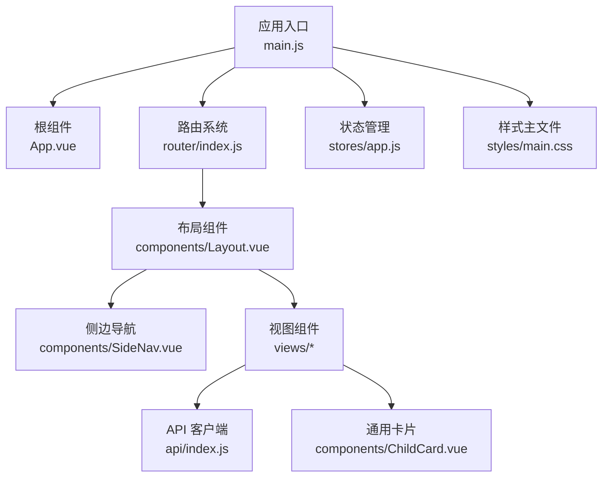
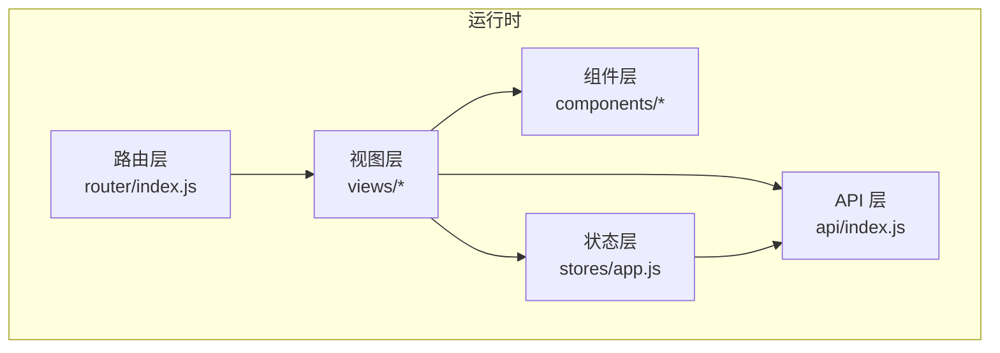
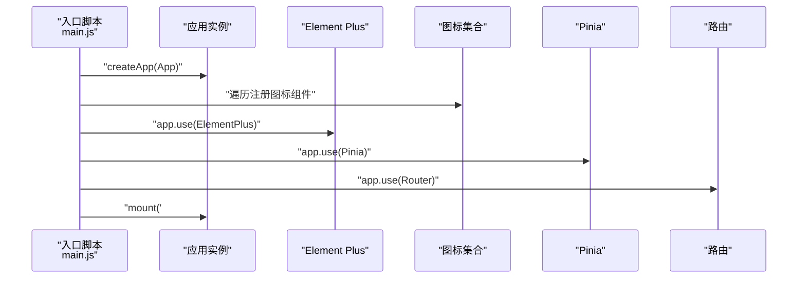
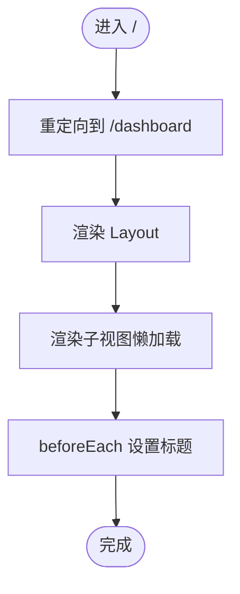
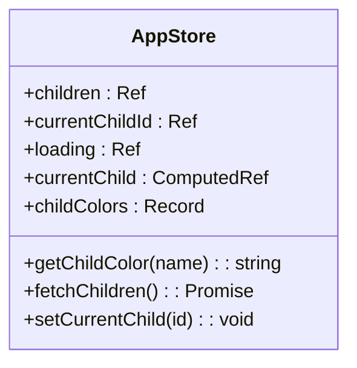
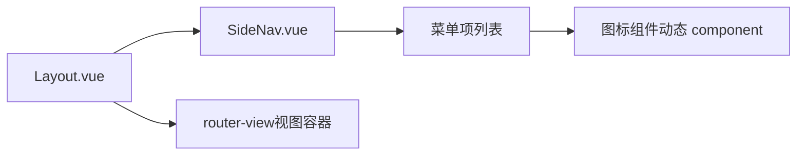
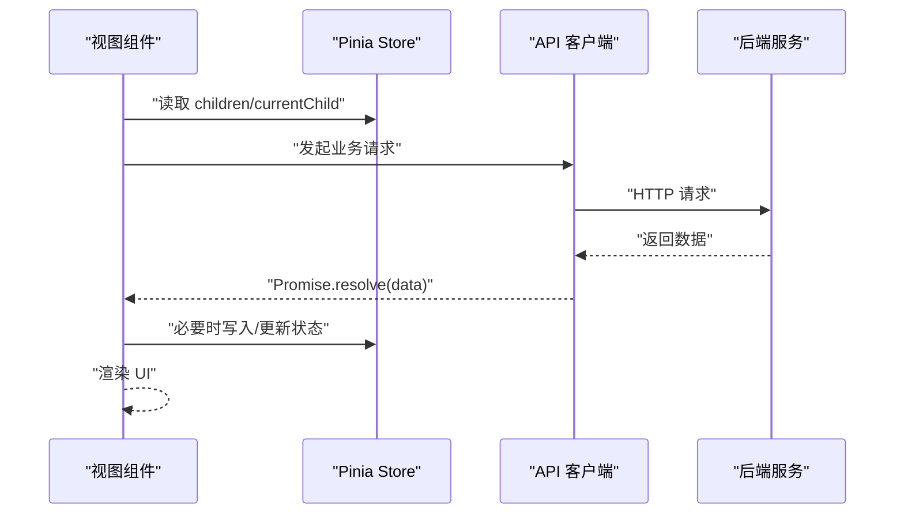
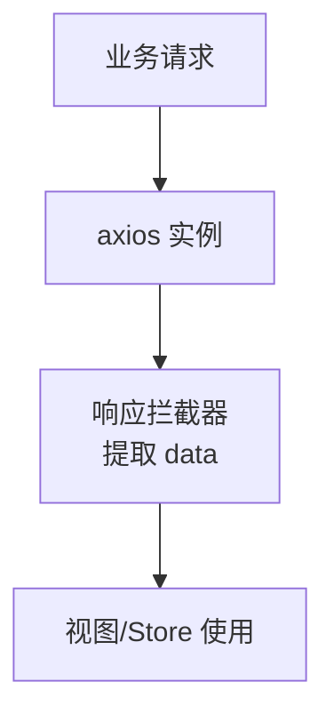
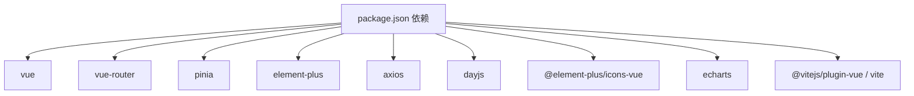

# PC管理后台

<cite>
**本文引用的文件**
- [main.js](file://star-park/pc-admin/src/main.js)
- [App.vue](file://star-park/pc-admin/src/App.vue)
- [router/index.js](file://star-park/pc-admin/src/router/index.js)
- [stores/app.js](file://star-park/pc-admin/src/stores/app.js)
- [components/Layout.vue](file://star-park/pc-admin/src/components/Layout.vue)
- [components/SideNav.vue](file://star-park/pc-admin/src/components/SideNav.vue)
- [components/ChildCard.vue](file://star-park/pc-admin/src/components/ChildCard.vue)
- [views/Dashboard.vue](file://star-park/pc-admin/src/views/Dashboard.vue)
- [views/Balance.vue](file://star-park/pc-admin/src/views/Balance.vue)
- [views/Rewards.vue](file://star-park/pc-admin/src/views/Rewards.vue)
- [views/Stats.vue](file://star-park/pc-admin/src/views/Stats.vue)
- [views/Goals.vue](file://star-park/pc-admin/src/views/Goals.vue)
- [views/Tasks.vue](file://star-park/pc-admin/src/views/Tasks.vue)
- [views/Checkin.vue](file://star-park/pc-admin/src/views/Checkin.vue)
- [api/index.js](file://star-park/pc-admin/src/api/index.js)
- [styles/main.css](file://star-park/pc-admin/src/styles/main.css)
- [package.json](file://star-park/pc-admin/package.json)
- [vite.config.js](file://star-park/pc-admin/vite.config.js)
</cite>

## 更新摘要
**变更内容**
- 新增积分记录（Balance）视图，支持余额展示和交易流水查看
- 新增数据统计（Stats）视图，集成ECharts图表展示打卡热力图和完成率趋势
- 完善奖励管理（Rewards）视图，增强进度条展示和兑换功能
- 优化每日打卡（Checkin）视图，增加特殊积分奖励功能
- 扩展任务管理（Tasks）视图，支持按孩子分组管理
- 增强目标管理（Goals）视图，完善待办任务筛选功能
- 改进仪表盘（Dashboard）视图，集成QoderWake自动化触发

## 目录
1. [简介](#简介)
2. [项目结构](#项目结构)
3. [核心组件](#核心组件)
4. [架构总览](#架构总览)
5. [详细组件分析](#详细组件分析)
6. [依赖关系分析](#依赖关系分析)
7. [性能考量](#性能考量)
8. [故障排查指南](#故障排查指南)
9. [结论](#结论)
10. [附录](#附录)

## 简介
本文件为 StarParadise PC 管理后台的前端架构文档，基于 Vue 3 + Element Plus + Pinia 技术栈，覆盖应用初始化配置、路由系统设计、状态管理策略、组件层次结构与布局实现；同时详解 API 客户端封装、Element Plus 集成与主题定制、图标系统、响应式设计、组件通信与数据流、错误处理机制以及性能优化策略，并提供最佳实践指导与参考路径。

## 项目结构
该 PC 管理后台采用典型的单页应用（SPA）结构，按功能域划分目录：
- 应用入口与全局配置：main.js、App.vue、styles/main.css
- 路由与视图：router/index.js、views/*
- 状态管理：stores/app.js
- 布局与通用组件：components/Layout.vue、components/SideNav.vue、components/ChildCard.vue
- API 封装：api/index.js
- 构建与开发服务器：vite.config.js、package.json

**图表来源**
- [main.js:1-22](file://star-park/pc-admin/src/main.js#L1-L22)
- [App.vue:1-10](file://star-park/pc-admin/src/App.vue#L1-L10)
- [router/index.js:1-67](file://star-park/pc-admin/src/router/index.js#L1-L67)
- [stores/app.js:1-62](file://star-park/pc-admin/src/stores/app.js#L1-L62)
- [components/Layout.vue:1-29](file://star-park/pc-admin/src/components/Layout.vue#L1-L29)
- [components/SideNav.vue:1-132](file://star-park/pc-admin/src/components/SideNav.vue#L1-L132)
- [api/index.js:1-79](file://star-park/pc-admin/src/api/index.js#L1-L79)
- [styles/main.css:1-164](file://star-park/pc-admin/src/styles/main.css#L1-L164)

**章节来源**
- [main.js:1-22](file://star-park/pc-admin/src/main.js#L1-L22)
- [package.json:1-26](file://star-park/pc-admin/package.json#L1-26)

## 核心组件
- 应用初始化与插件注册：在入口文件中创建应用实例，注册 Element Plus、图标、Pinia、路由，并挂载根组件。
- 根组件：最外层容器，仅承载路由出口，便于统一处理页面切换与动画。
- 路由系统：采用 history 模式，定义嵌套路由与懒加载视图，设置页面标题。
- 状态管理：Pinia Store 管理"孩子列表/当前孩子/加载状态"等跨组件共享数据。
- 布局与导航：Layout 负责整体布局与主内容区滚动；SideNav 提供固定侧栏菜单与激活态样式。
- 视图组件：Dashboard、Goals、Tasks、Checkin、Rewards、Balance、Stats 等，分别承担不同业务域的数据展示与交互。
- API 客户端：基于 axios 创建带超时与响应拦截的实例，集中导出各业务接口，包含 QoderWake 自动化触发。
- 主题与样式：CSS 变量统一主题色、尺寸与阴影；覆盖 Element Plus 组件默认样式；提供通用卡片与动画类。

**章节来源**
- [main.js:1-22](file://star-park/pc-admin/src/main.js#L1-L22)
- [App.vue:1-10](file://star-park/pc-admin/src/App.vue#L1-L10)
- [router/index.js:1-67](file://star-park/pc-admin/src/router/index.js#L1-L67)
- [stores/app.js:1-62](file://star-park/pc-admin/src/stores/app.js#L1-L62)
- [components/Layout.vue:1-29](file://star-park/pc-admin/src/components/Layout.vue#L1-L29)
- [components/SideNav.vue:1-132](file://star-park/pc-admin/src/components/SideNav.vue#L1-L132)
- [api/index.js:1-79](file://star-park/pc-admin/src/api/index.js#L1-L79)
- [styles/main.css:1-164](file://star-park/pc-admin/src/styles/main.css#L1-L164)

## 架构总览
应用采用"路由驱动 + 组件化 + 状态管理"的三层架构：
- 路由层：负责页面级导航与参数传递，支持面包屑与标题动态更新。
- 视图层：每个视图独立管理自身数据与交互，通过 API 客户端与服务端通信。
- 状态层：Pinia Store 统一管理跨视图共享数据（如孩子列表与当前选中孩子），避免重复请求与状态分散。
- 组件层：布局与通用组件复用性强，降低重复开发成本。

**图表来源**
- [router/index.js:1-67](file://star-park/pc-admin/src/router/index.js#L1-L67)
- [stores/app.js:1-62](file://star-park/pc-admin/src/stores/app.js#L1-L62)
- [api/index.js:1-79](file://star-park/pc-admin/src/api/index.js#L1-L79)

## 详细组件分析

### 应用初始化与插件注册
- 初始化流程：创建 Vue 应用 → 注册 Element Plus（含图标）→ 注册 Pinia → 注册路由 → 挂载根组件。
- 图标注册：遍历 Element Plus 图标集合，全局注册以便在模板中直接使用。
- Element Plus：按需引入样式，避免全量引入导致体积膨胀。

**图表来源**
- [main.js:1-22](file://star-park/pc-admin/src/main.js#L1-L22)

**章节来源**
- [main.js:1-22](file://star-park/pc-admin/src/main.js#L1-L22)

### 路由系统设计
- 嵌套路由：根路径 '/' 下包含 Layout，Layout 内部为多个子视图的 children 路由。
- 懒加载：子视图通过动态导入实现按需加载，提升首屏性能。
- 导航守卫：前置守卫统一设置页面标题，确保浏览器标签显示友好文案。
- 新增路由：支持 Dashboard、Goals、Checkin、Tasks、Balance、Rewards、Stats 七个主要功能模块。

**图表来源**
- [router/index.js:1-67](file://star-park/pc-admin/src/router/index.js#L1-L67)

**章节来源**
- [router/index.js:1-67](file://star-park/pc-admin/src/router/index.js#L1-L67)

### 状态管理策略（Pinia）
- Store 设计：集中存储"孩子列表、当前孩子 ID、计算属性 currentChild、加载状态、颜色映射、获取/设置方法"。
- 数据来源：首次访问时调用 API 获取孩子列表，若为空则自动选择第一个；后续可通过 setCurrentChild 切换。
- 使用方式：在视图中通过组合式 API 使用 store，减少重复请求与跨组件同步成本。

**图表来源**
- [stores/app.js:1-62](file://star-park/pc-admin/src/stores/app.js#L1-L62)

**章节来源**
- [stores/app.js:1-62](file://star-park/pc-admin/src/stores/app.js#L1-L62)

### 布局与侧边导航
- Layout：固定侧栏宽度，主内容区自适应；通过 CSS 变量控制 sidebar 宽度与背景色。
- SideNav：固定定位，包含 Logo、菜单项、底部信息；菜单项来自路由 meta 或本地数组，支持激活态样式与图标渲染。
- 菜单项可见性：通过隐藏字段控制部分菜单（如积分记录）在侧栏中不显示。

**图表来源**
- [components/Layout.vue:1-29](file://star-park/pc-admin/src/components/Layout.vue#L1-L29)
- [components/SideNav.vue:1-132](file://star-park/pc-admin/src/components/SideNav.vue#L1-L132)

**章节来源**
- [components/Layout.vue:1-29](file://star-park/pc-admin/src/components/Layout.vue#L1-L29)
- [components/SideNav.vue:1-132](file://star-park/pc-admin/src/components/SideNav.vue#L1-L132)

### 视图组件组织与数据流

#### 仪表盘（Dashboard）
- 展示欢迎语、孩子卡片、快捷操作；优先使用仪表盘接口数据，失败时回退到 store 的孩子列表。
- 集成 QoderWake 自动化触发功能，支持一键执行今日打卡任务。
- 提供快速导航按钮，方便跳转到任务管理、奖励管理和数据统计页面。

#### 积分记录（Balance）
- 支持多孩子切换，实时显示当前余额和交易流水。
- 使用渐变背景和彩色边框突出显示余额信息。
- 交易表格支持收入支出分类显示，金额用颜色区分。

#### 奖励管理（Rewards）
- 网格布局展示奖励卡片，支持进度条可视化。
- 提供新增、编辑、删除、兑换等完整 CRUD 操作。
- 支持按孩子筛选，已达成和已兑换状态有视觉标识。

#### 数据统计（Stats）
- 集成 ECharts 图表库，展示打卡热力图和完成率趋势。
- 支持按周/按月切换统计维度。
- 响应式图表，窗口大小变化时自动重绘。

#### 每日打卡（Checkin）
- 日期选择器支持历史日期查看，防止修改已完成日期的打卡。
- 按孩子分组显示任务列表，支持一键全部打卡。
- 集成特殊积分奖励功能，支持手动发放额外积分。

#### 任务管理（Tasks）
- 使用 Tabs 组件按孩子分组管理任务。
- 支持任务的增删改查和启用/停用状态切换。
- 表单验证确保必填字段完整性。

#### 目标管理（Goals）
- 年度目标卡片展示，支持进度可视化。
- 待办任务表格支持筛选（全部/进行中/已完成）。
- 本地存储持久化数据，无需后端支持。

**图表来源**
- [views/Dashboard.vue:1-163](file://star-park/pc-admin/src/views/Dashboard.vue#L1-L163)
- [views/Balance.vue:1-173](file://star-park/pc-admin/src/views/Balance.vue#L1-L173)
- [views/Rewards.vue:1-471](file://star-park/pc-admin/src/views/Rewards.vue#L1-L471)
- [views/Stats.vue:1-291](file://star-park/pc-admin/src/views/Stats.vue#L1-L291)
- [views/Goals.vue:1-686](file://star-park/pc-admin/src/views/Goals.vue#L1-686)
- [views/Tasks.vue:1-265](file://star-park/pc-admin/src/views/Tasks.vue#L1-265)
- [views/Checkin.vue:1-451](file://star-park/pc-admin/src/views/Checkin.vue#L1-451)
- [stores/app.js:1-62](file://star-park/pc-admin/src/stores/app.js#L1-L62)
- [api/index.js:1-79](file://star-park/pc-admin/src/api/index.js#L1-L79)

**章节来源**
- [views/Dashboard.vue:1-163](file://star-park/pc-admin/src/views/Dashboard.vue#L1-L163)
- [views/Balance.vue:1-173](file://star-park/pc-admin/src/views/Balance.vue#L1-L173)
- [views/Rewards.vue:1-471](file://star-park/pc-admin/src/views/Rewards.vue#L1-L471)
- [views/Stats.vue:1-291](file://star-park/pc-admin/src/views/Stats.vue#L1-L291)
- [views/Goals.vue:1-686](file://star-park/pc-admin/src/views/Goals.vue#L1-686)
- [views/Tasks.vue:1-265](file://star-park/pc-admin/src/views/Tasks.vue#L1-265)
- [views/Checkin.vue:1-451](file://star-park/pc-admin/src/views/Checkin.vue#L1-451)

### API 客户端封装
- 基础配置：baseURL 为 /api，超时 10s，JSON 默认头。
- 响应拦截：统一提取 data 字段，简化调用方逻辑。
- 接口分类：按业务域导出方法（孩子、任务、打卡、奖励、统计、积分等），便于按需引入与测试。
- 新增功能：集成 QoderWake 自动化触发接口，支持环境变量配置。

**图表来源**
- [api/index.js:1-79](file://star-park/pc-admin/src/api/index.js#L1-L79)

**章节来源**
- [api/index.js:1-79](file://star-park/pc-admin/src/api/index.js#L1-L79)

### Element Plus 集成与主题定制
- 图标系统：全局注册 Element Plus 图标，模板中以 component 动态渲染。
- 主题定制：通过 CSS 变量统一主色、背景、阴影、圆角等；覆盖 Element Plus 按钮、标签页、开关、进度条、输入框等组件的样式。
- 响应式设计：在样式中使用媒体查询适配不同屏幕宽度，保证移动端体验。

**章节来源**
- [main.js:1-22](file://star-park/pc-admin/src/main.js#L1-L22)
- [styles/main.css:1-164](file://star-park/pc-admin/src/styles/main.css#L1-L164)

### 组件通信模式与数据流
- 父子通信：通过 props 传递数据（如 ChildCard 的 child/color），通过事件回调触发父组件行为（如点击跳转）。
- 跨视图共享：通过 Pinia Store 在多个视图间共享"孩子列表/当前孩子"，避免重复请求与状态不一致。
- 视图内状态：使用 ref/computed 管理本地状态（如弹窗显隐、表单数据、加载状态）。

**章节来源**
- [components/ChildCard.vue:1-161](file://star-park/pc-admin/src/components/ChildCard.vue#L1-L161)
- [stores/app.js:1-62](file://star-park/pc-admin/src/stores/app.js#L1-L62)

### 错误处理机制
- API 层：统一错误日志输出，调用方通过 try/catch 处理异常。
- 视图层：对关键操作（如获取数据、提交表单）进行错误捕获与用户提示（Element Plus Message/MessageBox）。
- 回退策略：当仪表盘接口失败时，回退到从 store 获取孩子列表，保障首页可用性。
- 环境检查：QoderWake 调用前检查环境变量配置，提供友好的错误提示。

**章节来源**
- [api/index.js:1-79](file://star-park/pc-admin/src/api/index.js#L1-L79)
- [views/Dashboard.vue:1-163](file://star-park/pc-admin/src/views/Dashboard.vue#L1-L163)
- [views/Balance.vue:1-173](file://star-park/pc-admin/src/views/Balance.vue#L1-L173)
- [views/Rewards.vue:1-471](file://star-park/pc-admin/src/views/Rewards.vue#L1-L471)
- [views/Stats.vue:1-291](file://star-park/pc-admin/src/views/Stats.vue#L1-L291)
- [views/Goals.vue:1-686](file://star-park/pc-admin/src/views/Goals.vue#L1-686)
- [views/Tasks.vue:1-265](file://star-park/pc-admin/src/views/Tasks.vue#L1-265)
- [views/Checkin.vue:1-451](file://star-park/pc-admin/src/views/Checkin.vue#L1-451)

## 依赖关系分析
- 运行时依赖：vue、vue-router、pinia、element-plus、axios、dayjs、@element-plus/icons-vue、echarts。
- 开发依赖：@vitejs/plugin-vue、vite。
- 构建与代理：Vite 插件、本地开发服务器端口与 /api 代理至后端服务。

**图表来源**
- [package.json:1-26](file://star-park/pc-admin/package.json#L1-26)

**章节来源**
- [package.json:1-26](file://star-park/pc-admin/package.json#L1-26)
- [vite.config.js:1-19](file://star-park/pc-admin/vite.config.js#L1-L19)

## 性能考量
- 代码分割与懒加载：路由子视图采用动态导入，减少首屏包体。
- 组件复用：通用组件（如 ChildCard、SideNav）减少重复渲染与样式体积。
- 状态缓存：Pinia Store 缓存孩子列表，避免重复请求。
- 图标按需：仅注册所需图标组件，避免全量引入。
- 样式优化：统一变量与覆盖，减少重复样式声明；合理使用 CSS 变量与媒体查询。
- 本地存储：Goals 视图使用 localStorage 持久化，降低网络依赖。
- 图表优化：ECharts 实例在组件卸载时正确销毁，避免内存泄漏。
- 并行请求：使用 Promise.all 并发获取多个接口数据，提升加载速度。

**章节来源**
- [router/index.js:1-67](file://star-park/pc-admin/src/router/index.js#L1-L67)
- [components/ChildCard.vue:1-161](file://star-park/pc-admin/src/components/ChildCard.vue#L1-L161)
- [stores/app.js:1-62](file://star-park/pc-admin/src/stores/app.js#L1-L62)
- [views/Goals.vue:1-686](file://star-park/pc-admin/src/views/Goals.vue#L1-686)
- [views/Stats.vue:1-291](file://star-park/pc-admin/src/views/Stats.vue#L1-L291)
- [views/Balance.vue:1-173](file://star-park/pc-admin/src/views/Balance.vue#L1-L173)

## 故障排查指南
- 页面空白或路由不生效
  - 检查路由配置与 history 模式是否正确；确认入口已注册 router。
  - 参考：[router/index.js:1-67](file://star-park/pc-admin/src/router/index.js#L1-L67)
- 图标不显示
  - 确认已在入口注册 Element Plus 图标；检查图标名称与导入是否匹配。
  - 参考：[main.js:1-22](file://star-park/pc-admin/src/main.js#L1-L22)
- API 请求失败
  - 查看响应拦截器是否正确提取 data；检查代理配置与后端服务连通性。
  - 参考：[api/index.js:1-79](file://star-park/pc-admin/src/api/index.js#L1-L79)，[vite.config.js:1-19](file://star-park/pc-admin/vite.config.js#L1-L19)
- 子视图数据为空
  - 确认 store 中 children 是否已加载；检查接口返回格式与字段映射。
  - 参考：[stores/app.js:1-62](file://star-park/pc-admin/src/stores/app.js#L1-L62)，[views/Tasks.vue:1-265](file://star-park/pc-admin/src/views/Tasks.vue#L1-265)
- 图表不显示
  - 检查 ECharts 实例是否正确初始化；确认 DOM 元素存在后再渲染。
  - 参考：[views/Stats.vue:1-291](file://star-park/pc-admin/src/views/Stats.vue#L1-L291)
- QoderWake 调用失败
  - 检查环境变量配置；确认 URL 和 PAT 令牌正确设置。
  - 参考：[api/index.js:57-76](file://star-park/pc-admin/src/api/index.js#L57-L76)

**章节来源**
- [router/index.js:1-67](file://star-park/pc-admin/src/router/index.js#L1-L67)
- [main.js:1-22](file://star-park/pc-admin/src/main.js#L1-L22)
- [api/index.js:1-79](file://star-park/pc-admin/src/api/index.js#L1-L79)
- [vite.config.js:1-19](file://star-park/pc-admin/vite.config.js#L1-L19)
- [stores/app.js:1-62](file://star-park/pc-admin/src/stores/app.js#L1-L62)
- [views/Tasks.vue:1-265](file://star-park/pc-admin/src/views/Tasks.vue#L1-265)
- [views/Stats.vue:1-291](file://star-park/pc-admin/src/views/Stats.vue#L1-L291)

## 结论
该 PC 管理后台以清晰的分层架构与模块化设计实现了稳定的业务能力。通过 Pinia 统一状态、Element Plus 丰富的 UI 能力与良好的主题定制、路由懒加载与组件复用，兼顾了开发效率与用户体验。新增的积分记录、数据统计、奖励管理等功能模块进一步完善了系统的业务覆盖范围。建议持续关注 API 稳定性、本地存储迁移策略与响应式适配，以进一步提升系统的健壮性与可维护性。

## 附录
- 最佳实践
  - 保持路由懒加载与按需引入，控制首屏体积。
  - 统一错误处理与用户提示，增强可感知性。
  - 使用 CSS 变量集中管理主题，避免硬编码颜色与尺寸。
  - 对复杂视图（如 Goals、Stats）考虑引入分页或虚拟滚动，优化大数据量场景。
  - 为关键接口增加重试与降级策略，提升稳定性。
  - 合理管理第三方库实例（如 ECharts），避免内存泄漏。
  - 使用环境变量管理敏感配置，提高部署灵活性。