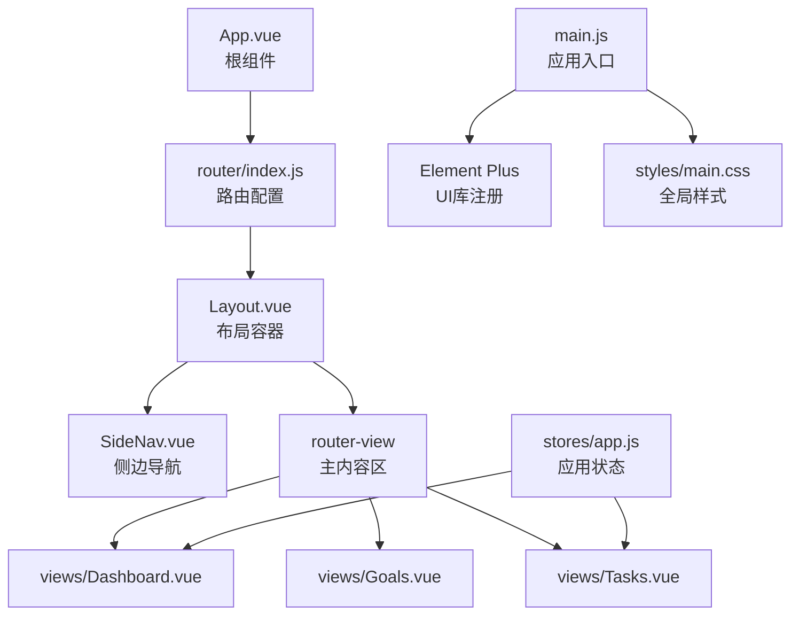
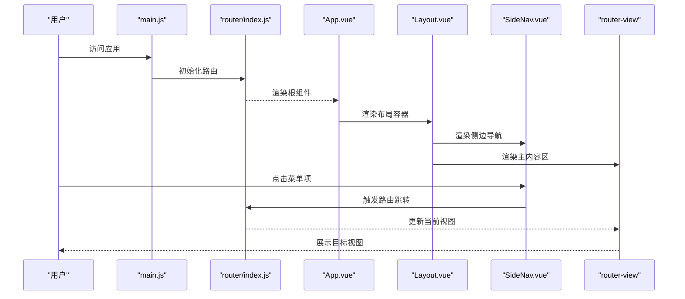
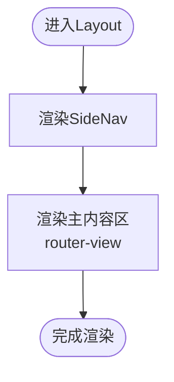
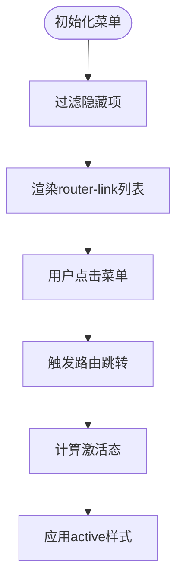
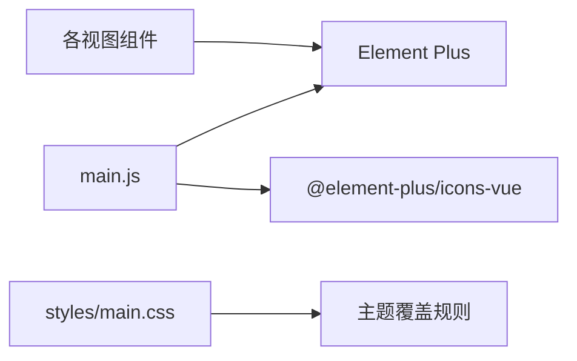
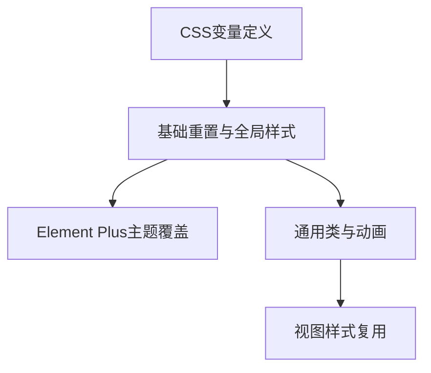
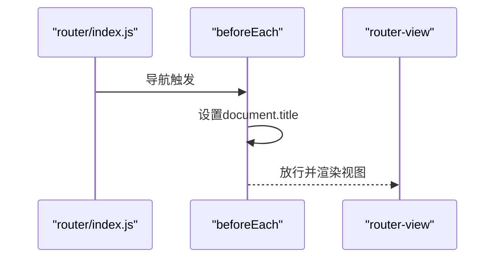
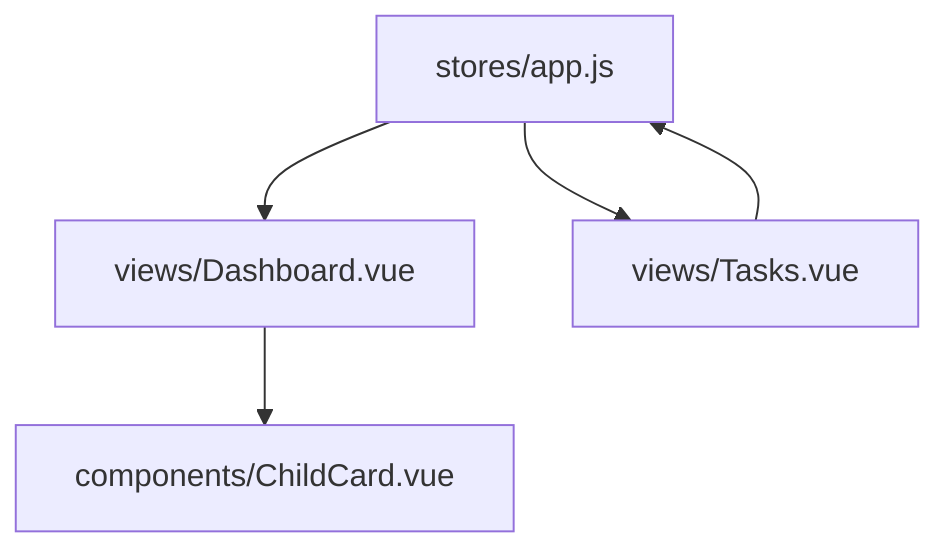
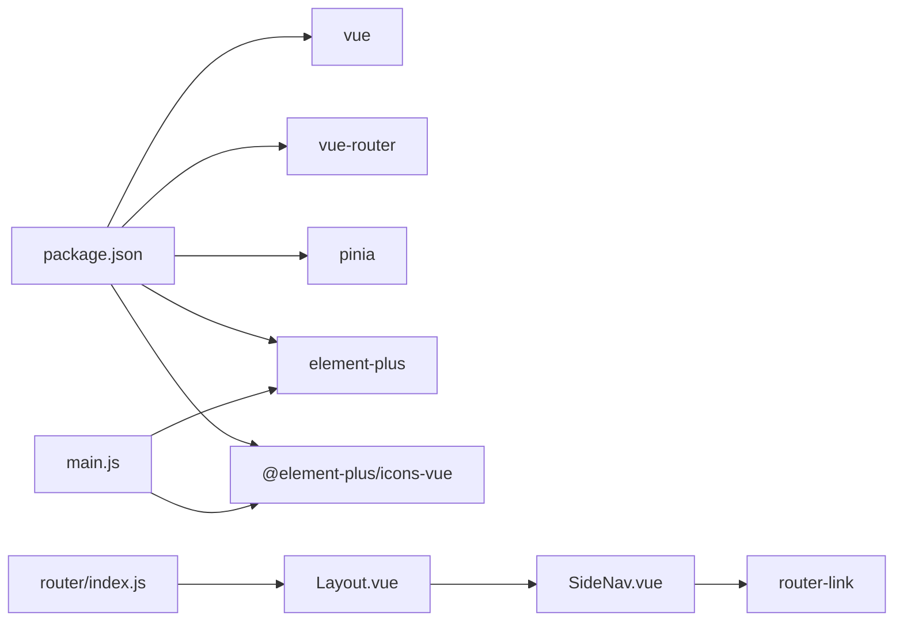

# 布局系统

<cite>
**本文引用的文件**
- [Layout.vue](file://star-park/pc-admin/src/components/Layout.vue)
- [SideNav.vue](file://star-park/pc-admin/src/components/SideNav.vue)
- [App.vue](file://star-park/pc-admin/src/App.vue)
- [router/index.js](file://star-park/pc-admin/src/router/index.js)
- [main.js](file://star-park/pc-admin/src/main.js)
- [styles/main.css](file://star-park/pc-admin/src/styles/main.css)
- [stores/app.js](file://star-park/pc-admin/src/stores/app.js)
- [views/Dashboard.vue](file://star-park/pc-admin/src/views/Dashboard.vue)
- [views/Goals.vue](file://star-park/pc-admin/src/views/Goals.vue)
- [views/Tasks.vue](file://star-park/pc-admin/src/views/Tasks.vue)
- [components/ChildCard.vue](file://star-park/pc-admin/src/components/ChildCard.vue)
- [package.json](file://star-park/pc-admin/package.json)
</cite>

## 目录
1. [简介](#简介)
2. [项目结构](#项目结构)
3. [核心组件](#核心组件)
4. [架构总览](#架构总览)
5. [组件详解](#组件详解)
6. [依赖关系分析](#依赖关系分析)
7. [性能考量](#性能考量)
8. [故障排查指南](#故障排查指南)
9. [结论](#结论)
10. [附录](#附录)

## 简介
本文件面向StarParadise PC管理后台的布局系统，围绕Layout与SideNav两大核心组件，系统性阐述其整体架构设计、头部区域、侧边栏、主内容区的布局结构；深入解析SideNav侧边导航的菜单项配置、路由跳转、激活状态管理与响应式折叠能力；说明Element Plus在本项目中的使用方式与主题覆盖策略；梳理CSS样式体系（全局样式、主题变量、响应式断点）；并给出布局组件的props、事件与插槽使用建议及最佳实践。

## 项目结构
本布局系统位于PC管理后台前端工程中，采用Vue 3 + Vue Router + Pinia + Element Plus技术栈。布局由根组件App.vue承载，通过路由将Layout作为容器组件，内部嵌套SideNav与router-view，形成“侧边导航 + 主内容区”的经典PC后台布局。

**图表来源**
- [App.vue:1-10](file://star-park/pc-admin/src/App.vue#L1-L10)
- [router/index.js:1-67](file://star-park/pc-admin/src/router/index.js#L1-L67)
- [Layout.vue:1-29](file://star-park/pc-admin/src/components/Layout.vue#L1-L29)
- [SideNav.vue:1-132](file://star-park/pc-admin/src/components/SideNav.vue#L1-L132)
- [main.js:1-22](file://star-park/pc-admin/src/main.js#L1-L22)
- [styles/main.css:1-164](file://star-park/pc-admin/src/styles/main.css#L1-L164)
- [stores/app.js:1-62](file://star-park/pc-admin/src/stores/app.js#L1-L62)

**章节来源**
- [App.vue:1-10](file://star-park/pc-admin/src/App.vue#L1-L10)
- [router/index.js:1-67](file://star-park/pc-admin/src/router/index.js#L1-L67)
- [main.js:1-22](file://star-park/pc-admin/src/main.js#L1-L22)
- [styles/main.css:1-164](file://star-park/pc-admin/src/styles/main.css#L1-L164)

## 核心组件
- Layout组件：负责整体布局容器，内含SideNav与router-view，通过CSS变量控制侧边栏宽度与背景色，主内容区自动占据剩余空间。
- SideNav组件：固定定位的侧边导航，包含Logo区、菜单区、底部信息区；基于路由路径计算激活态，支持隐藏菜单项。
- 路由系统：以Layout为父级容器，子路由对应各业务视图，统一设置页面标题。
- Element Plus：全局注册图标组件，按需在视图中使用表格、对话框、标签页等组件，并通过CSS覆盖主题色。
- 全局样式：集中定义CSS变量、重置、滚动条、通用卡片与动画等，支撑统一视觉风格。

**章节来源**
- [Layout.vue:1-29](file://star-park/pc-admin/src/components/Layout.vue#L1-L29)
- [SideNav.vue:1-132](file://star-park/pc-admin/src/components/SideNav.vue#L1-L132)
- [router/index.js:1-67](file://star-park/pc-admin/src/router/index.js#L1-L67)
- [main.js:1-22](file://star-park/pc-admin/src/main.js#L1-L22)
- [styles/main.css:1-164](file://star-park/pc-admin/src/styles/main.css#L1-L164)

## 架构总览
下图展示从应用入口到布局容器、侧边导航与主内容区的数据流与交互关系。

**图表来源**
- [main.js:1-22](file://star-park/pc-admin/src/main.js#L1-L22)
- [router/index.js:1-67](file://star-park/pc-admin/src/router/index.js#L1-L67)
- [App.vue:1-10](file://star-park/pc-admin/src/App.vue#L1-L10)
- [Layout.vue:1-29](file://star-park/pc-admin/src/components/Layout.vue#L1-L29)
- [SideNav.vue:1-132](file://star-park/pc-admin/src/components/SideNav.vue#L1-L132)

## 组件详解

### Layout组件
- 结构组成
  - 侧边导航：通过组件引入，固定在左侧。
  - 主内容区：使用router-view渲染当前路由对应的视图，配合key确保路径变化时重新渲染。
- 样式要点
  - 使用flex布局，最小高度为视口高度。
  - 主内容区通过CSS变量设置左侧边距，保证与侧边栏宽度一致；溢出滚动以适配长内容。
- 设计意图
  - 将布局与业务视图解耦，便于后续扩展头部区域与面包屑等。

**图表来源**
- [Layout.vue:1-29](file://star-park/pc-admin/src/components/Layout.vue#L1-L29)

**章节来源**
- [Layout.vue:1-29](file://star-park/pc-admin/src/components/Layout.vue#L1-L29)

### SideNav侧边导航
- 菜单配置
  - 内置菜单数组，包含路径、标题、图标与隐藏标记。
  - 通过计算属性过滤隐藏项，动态生成可见菜单列表。
- 路由跳转与激活态
  - 使用router-link包裹菜单项，绑定to属性指向path。
  - 激活态通过isActive函数比较当前路由路径与菜单path，命中则添加active类。
- 响应式折叠
  - 侧边栏宽度由CSS变量控制，主内容区通过相同变量保持间距一致，实现“等宽折叠”效果。
  - 可在媒体查询中调整变量值以实现不同屏幕下的布局优化。
- 视觉与交互
  - Logo区包含品牌图标与文字；菜单项支持悬停与激活态高亮；底部包含版本信息。

**图表来源**
- [SideNav.vue:1-132](file://star-park/pc-admin/src/components/SideNav.vue#L1-L132)

**章节来源**
- [SideNav.vue:1-132](file://star-park/pc-admin/src/components/SideNav.vue#L1-L132)

### Element Plus布局与主题
- 应用入口集成
  - 在main.js中注册ElementPlus并批量注册图标组件，确保全局可用。
- 主题覆盖
  - 在全局样式中对Element Plus常用组件（按钮、标签页、开关、进度条、输入框等）进行主题色覆盖，统一与项目主色一致。
- 视图中使用
  - 视图中广泛使用表格、对话框、标签页、按钮、进度条等组件，均受全局主题影响。

**图表来源**
- [main.js:1-22](file://star-park/pc-admin/src/main.js#L1-L22)
- [styles/main.css:44-92](file://star-park/pc-admin/src/styles/main.css#L44-L92)

**章节来源**
- [main.js:1-22](file://star-park/pc-admin/src/main.js#L1-L22)
- [styles/main.css:44-92](file://star-park/pc-admin/src/styles/main.css#L44-L92)

### CSS样式系统
- 全局变量
  - 定义主色、文本色、背景、卡片背景、孩子主题色、侧边栏宽度、圆角、阴影、字体族等变量，集中管理视觉规范。
- 重置与基础
  - 统一盒模型、最小宽度、字体与抗锯齿，保证跨浏览器一致性。
- 组件主题覆盖
  - 针对Element Plus组件的关键状态（如hover、active、focus）进行颜色覆盖，确保与项目主色一致。
- 通用类
  - page-container、card、fade-in-up等通用样式，提升开发效率与一致性。
- 动画
  - 提供入场动画与勾选动画，增强交互体验。

**图表来源**
- [styles/main.css:1-164](file://star-park/pc-admin/src/styles/main.css#L1-L164)

**章节来源**
- [styles/main.css:1-164](file://star-park/pc-admin/src/styles/main.css#L1-L164)

### 路由与页面标题
- 路由配置
  - 以Layout为父级容器，子路由对应各业务视图，统一设置meta.title用于页面标题。
- 导航守卫
  - beforeEach中根据meta.title动态设置document.title，确保浏览器标签显示友好标题。
- 页面切换
  - router-view根据当前路由渲染对应视图，结合Layout的key实现路径变化时的强制刷新。

**图表来源**
- [router/index.js:61-64](file://star-park/pc-admin/src/router/index.js#L61-L64)

**章节来源**
- [router/index.js:1-67](file://star-park/pc-admin/src/router/index.js#L1-L67)

### 视图与状态联动
- 应用状态
  - stores/app.js提供孩子列表、当前选中孩子、加载状态与颜色映射等，被多个视图共享。
- 视图示例
  - Dashboard通过store获取数据并渲染卡片与快捷操作。
  - Tasks使用Element Plus标签页与表格展示任务列表，并通过对话框进行增删改。
  - Goals使用表格、标签与进度条等组件构建复杂交互界面。

**图表来源**
- [stores/app.js:1-62](file://star-park/pc-admin/src/stores/app.js#L1-L62)
- [views/Dashboard.vue:1-146](file://star-park/pc-admin/src/views/Dashboard.vue#L1-L146)
- [views/Tasks.vue:1-265](file://star-park/pc-admin/src/views/Tasks.vue#L1-L265)
- [components/ChildCard.vue:1-161](file://star-park/pc-admin/src/components/ChildCard.vue#L1-L161)

**章节来源**
- [stores/app.js:1-62](file://star-park/pc-admin/src/stores/app.js#L1-L62)
- [views/Dashboard.vue:1-146](file://star-park/pc-admin/src/views/Dashboard.vue#L1-L146)
- [views/Tasks.vue:1-265](file://star-park/pc-admin/src/views/Tasks.vue#L1-L265)
- [components/ChildCard.vue:1-161](file://star-park/pc-admin/src/components/ChildCard.vue#L1-L161)

## 依赖关系分析
- 组件依赖
  - Layout依赖SideNav与router-view。
  - SideNav依赖vue-router的useRoute与router-link，以及Element Plus图标组件。
  - 视图依赖Element Plus组件与Pinia状态。
- 外部依赖
  - Element Plus与图标库由package.json声明并在main.js中注册。
  - Vue与Vue Router由package.json声明。

**图表来源**
- [package.json:1-26](file://star-park/pc-admin/package.json#L1-L26)
- [main.js:1-22](file://star-park/pc-admin/src/main.js#L1-L22)
- [router/index.js:1-67](file://star-park/pc-admin/src/router/index.js#L1-L67)
- [Layout.vue:1-29](file://star-park/pc-admin/src/components/Layout.vue#L1-L29)
- [SideNav.vue:1-132](file://star-park/pc-admin/src/components/SideNav.vue#L1-L132)

**章节来源**
- [package.json:1-26](file://star-park/pc-admin/package.json#L1-L26)
- [main.js:1-22](file://star-park/pc-admin/src/main.js#L1-L22)
- [router/index.js:1-67](file://star-park/pc-admin/src/router/index.js#L1-L67)

## 性能考量
- 路由切换性能
  - router-view通过key绑定$route.fullPath，确保路径变化时强制重建视图，避免缓存导致的状态错乱。
- 样式性能
  - 使用CSS变量集中管理主题，减少重复样式与重绘。
  - 侧边栏与主内容区通过固定宽度与flex布局，降低布局抖动。
- 组件渲染
  - SideNav的菜单项通过计算属性过滤隐藏项，避免不必要的DOM节点。
  - Element Plus组件按需使用，减少全局样式污染。

**章节来源**
- [Layout.vue:5](file://star-park/pc-admin/src/components/Layout.vue#L5)
- [SideNav.vue:41-43](file://star-park/pc-admin/src/components/SideNav.vue#L41-L43)
- [styles/main.css:13](file://star-park/pc-admin/src/styles/main.css#L13)

## 故障排查指南
- 侧边导航不生效
  - 检查main.js是否正确注册Element Plus与图标组件。
  - 确认router/index.js中Layout与子路由配置正确。
- 激活态不显示
  - 确认SideNav中isActive函数比较的是精确路径匹配，且router-link的to属性与菜单path一致。
- 样式异常
  - 检查styles/main.css中CSS变量是否正确，特别是--sidebar-width与--primary。
  - 确认Element Plus主题覆盖规则未被局部样式覆盖。
- 页面标题未更新
  - 确认router/index.js的beforeEach中meta.title存在且有效。

**章节来源**
- [main.js:13-16](file://star-park/pc-admin/src/main.js#L13-L16)
- [router/index.js:61-64](file://star-park/pc-admin/src/router/index.js#L61-L64)
- [SideNav.vue:45-47](file://star-park/pc-admin/src/components/SideNav.vue#L45-L47)
- [styles/main.css:1-164](file://star-park/pc-admin/src/styles/main.css#L1-L164)

## 结论
本布局系统以简洁清晰的方式实现了PC管理后台的标准布局：固定侧边导航 + 自适应主内容区。通过CSS变量统一主题、通过Element Plus覆盖关键组件样式、通过Pinia共享状态，形成高内聚、低耦合的前端架构。SideNav的菜单配置与激活态逻辑直观易维护，具备良好的扩展性与可定制性。

## 附录

### 布局组件实现要点与最佳实践
- 布局容器
  - 使用flex布局与CSS变量控制侧边栏宽度，确保主内容区自适应。
  - 通过router-view的key绑定实现路径变化时的强制刷新，避免缓存问题。
- 侧边导航
  - 菜单配置集中管理，支持隐藏字段；通过计算属性过滤隐藏项。
  - 激活态使用精确路径匹配，避免模糊匹配导致的误判。
  - 响应式折叠可通过媒体查询调整CSS变量实现，保持布局一致性。
- Element Plus使用
  - 在入口注册图标组件，按需在视图中使用表格、对话框、标签页等组件。
  - 通过全局CSS覆盖主题色，确保组件风格统一。
- 样式组织
  - CSS变量集中定义，便于主题切换与维护。
  - 通用类与动画提升开发效率与用户体验。
- 状态管理
  - Pinia用于共享全局状态，视图间通过store解耦数据流转。

**章节来源**
- [Layout.vue:1-29](file://star-park/pc-admin/src/components/Layout.vue#L1-L29)
- [SideNav.vue:1-132](file://star-park/pc-admin/src/components/SideNav.vue#L1-L132)
- [main.js:1-22](file://star-park/pc-admin/src/main.js#L1-L22)
- [styles/main.css:1-164](file://star-park/pc-admin/src/styles/main.css#L1-L164)
- [stores/app.js:1-62](file://star-park/pc-admin/src/stores/app.js#L1-L62)