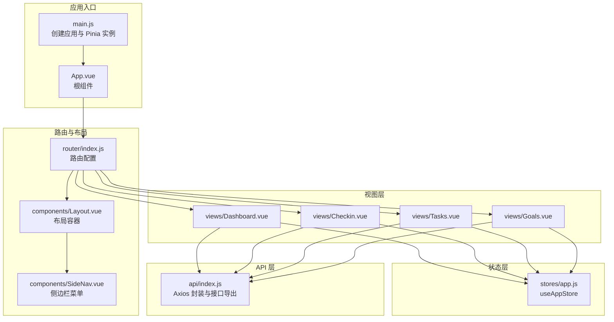
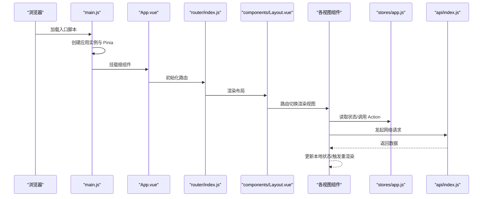
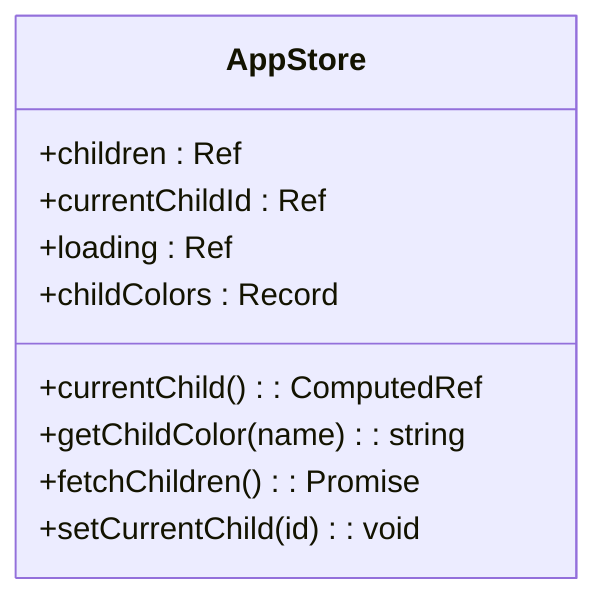
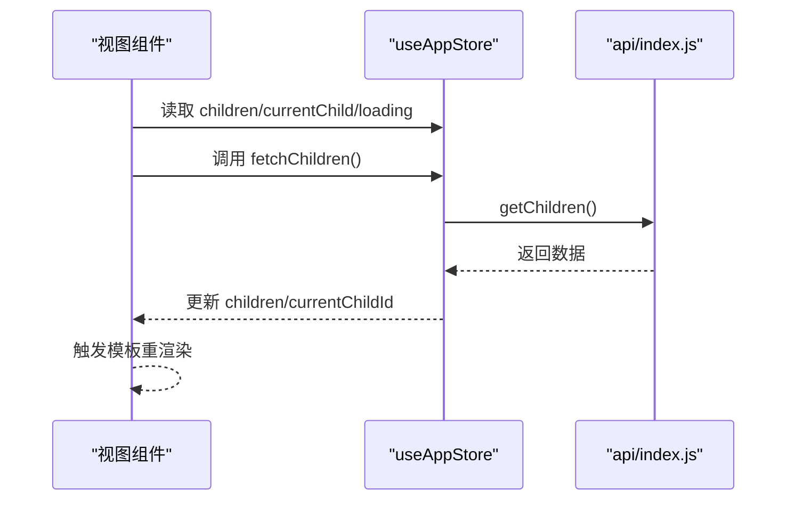
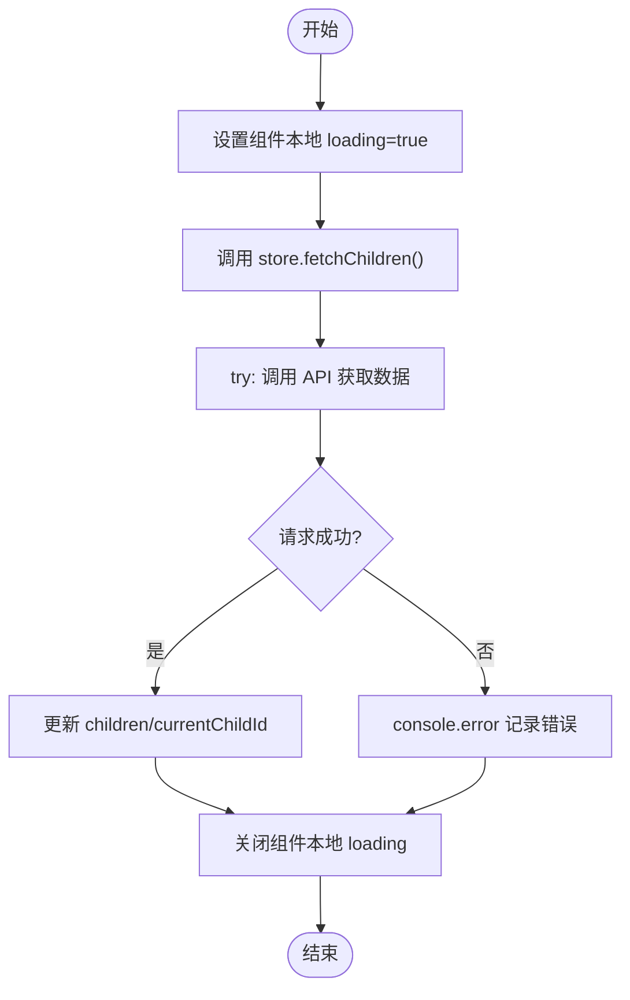
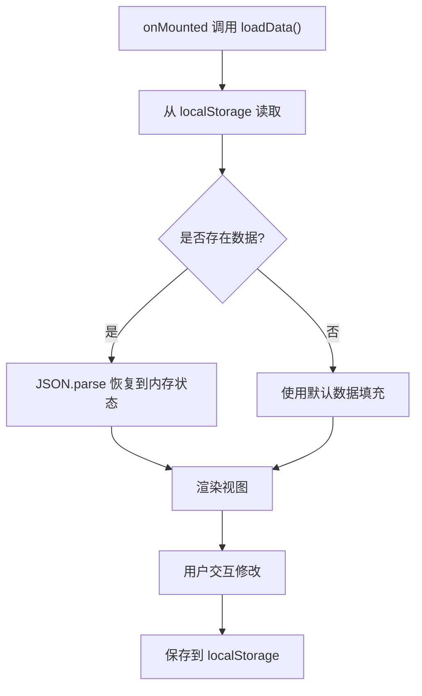
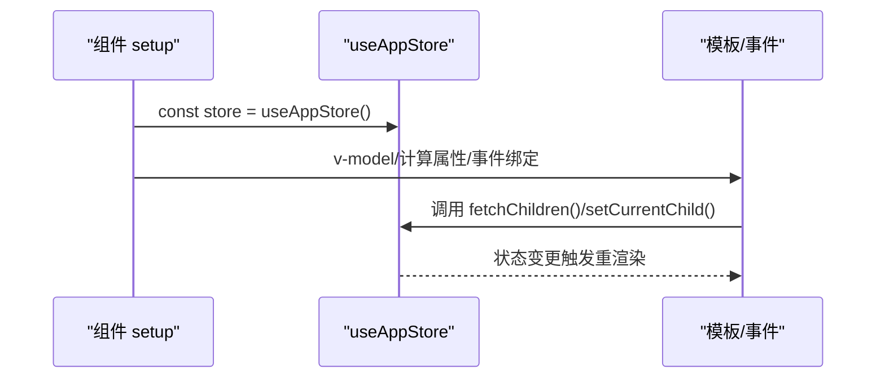
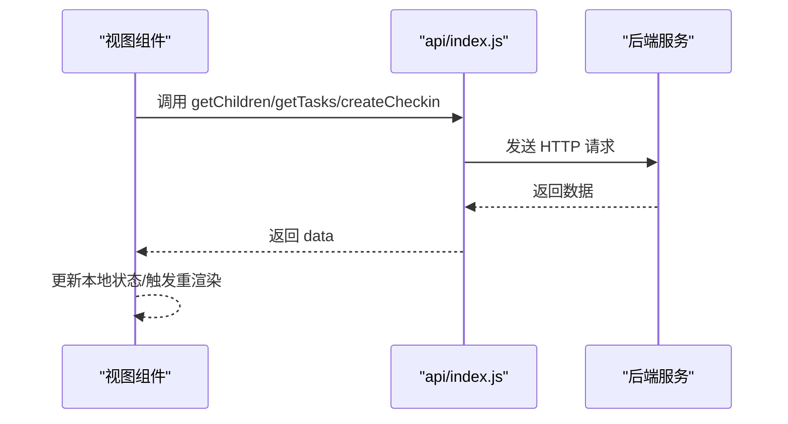
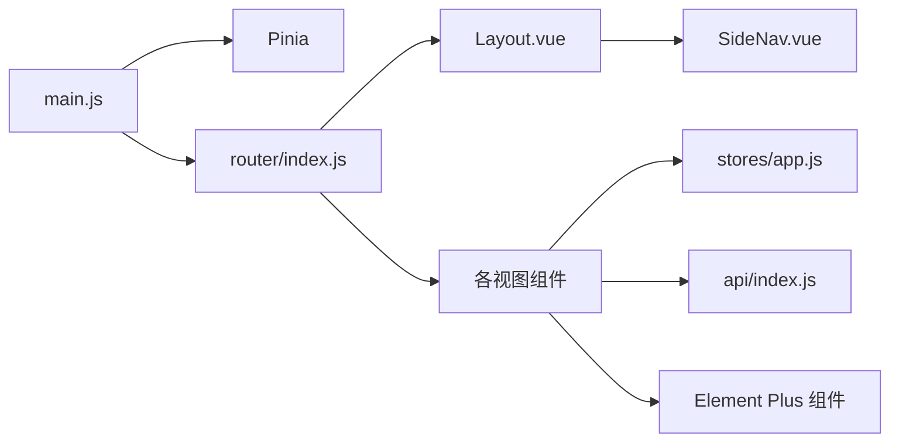

# 状态管理

<cite>
**本文引用的文件**
- [app.js](file://star-park/pc-admin/src/stores/app.js)
- [main.js](file://star-park/pc-admin/src/main.js)
- [App.vue](file://star-park/pc-admin/src/App.vue)
- [Layout.vue](file://star-park/pc-admin/src/components/Layout.vue)
- [SideNav.vue](file://star-park/pc-admin/src/components/SideNav.vue)
- [index.js](file://star-park/pc-admin/src/router/index.js)
- [index.js](file://star-park/pc-admin/src/api/index.js)
- [Dashboard.vue](file://star-park/pc-admin/src/views/Dashboard.vue)
- [Checkin.vue](file://star-park/pc-admin/src/views/Checkin.vue)
- [Tasks.vue](file://star-park/pc-admin/src/views/Tasks.vue)
- [Goals.vue](file://star-park/pc-admin/src/views/Goals.vue)
- [ChildCard.vue](file://star-park/pc-admin/src/components/ChildCard.vue)
</cite>

## 目录
1. [简介](#简介)
2. [项目结构](#项目结构)
3. [核心组件](#核心组件)
4. [架构总览](#架构总览)
5. [详细组件分析](#详细组件分析)
6. [依赖分析](#依赖分析)
7. [性能考虑](#性能考虑)
8. [故障排查指南](#故障排查指南)
9. [结论](#结论)
10. [附录](#附录)

## 简介
本文件面向 StarParadise PC 管理后台的状态管理系统，聚焦于 Pinia 状态管理在该应用中的实现与使用。内容涵盖：
- Store 定义、状态声明、Action 方法、Getter 计算属性
- 应用级状态设计模式：用户认证状态、全局配置、loading 状态管理
- 状态持久化策略：localStorage 的使用与状态恢复机制
- 状态与组件的绑定方式：组合式 API 中如何使用 store 实例
- 最佳实践：状态设计原则、Action 异步处理、状态调试技巧
- 冲突解决与性能优化策略

## 项目结构
PC 管理后台采用 Vue 3 + Pinia + Element Plus 技术栈，状态集中在单文件 store 中统一管理；路由负责页面导航，API 层封装请求；多个视图组件通过组合式 API 使用 store 实例。

**图表来源**
- [main.js:1-22](file://star-park/pc-admin/src/main.js#L1-L22)
- [App.vue:1-10](file://star-park/pc-admin/src/App.vue#L1-L10)
- [index.js:1-67](file://star-park/pc-admin/src/router/index.js#L1-L67)
- [Layout.vue:1-29](file://star-park/pc-admin/src/components/Layout.vue#L1-L29)
- [SideNav.vue:1-132](file://star-park/pc-admin/src/components/SideNav.vue#L1-L132)
- [app.js:1-62](file://star-park/pc-admin/src/stores/app.js#L1-L62)
- [Dashboard.vue:1-146](file://star-park/pc-admin/src/views/Dashboard.vue#L1-L146)
- [Checkin.vue:1-417](file://star-park/pc-admin/src/views/Checkin.vue#L1-L417)
- [Tasks.vue:1-265](file://star-park/pc-admin/src/views/Tasks.vue#L1-L265)
- [Goals.vue:1-686](file://star-park/pc-admin/src/views/Goals.vue#L1-L686)
- [index.js:1-56](file://star-park/pc-admin/src/api/index.js#L1-L56)

**章节来源**
- [main.js:1-22](file://star-park/pc-admin/src/main.js#L1-L22)
- [index.js:1-67](file://star-park/pc-admin/src/router/index.js#L1-L67)

## 核心组件
本项目的核心状态位于单文件 store，采用组合式 API 风格定义，集中管理“孩子列表”、“当前选中孩子”、“加载状态”等关键状态，并提供获取颜色、拉取数据、设置当前孩子等 Action。

- 状态声明
  - 孩子列表：用于展示与筛选
  - 当前选中孩子 ID：用于切换上下文
  - 当前选中孩子对象：基于 ID 的计算属性
  - 加载状态：控制界面 loading
  - 孩子颜色映射：用于主题色
- Getter
  - currentChild：根据 currentChildId 计算当前孩子
  - getChildColor：根据名字返回颜色
- Action
  - fetchChildren：异步拉取孩子列表，失败时记录错误，成功后设置 currentChildId
  - setCurrentChild：设置当前选中孩子 ID

这些能力被多个视图共享使用，如 Dashboard、Checkin、Tasks 等。

**章节来源**
- [app.js:5-61](file://star-park/pc-admin/src/stores/app.js#L5-L61)

## 架构总览
下图展示了应用启动、路由导航、状态访问与 API 请求的整体流程。

**图表来源**
- [main.js:10-21](file://star-park/pc-admin/src/main.js#L10-L21)
- [App.vue:1-3](file://star-park/pc-admin/src/App.vue#L1-L3)
- [index.js:1-67](file://star-park/pc-admin/src/router/index.js#L1-L67)
- [Layout.vue:1-7](file://star-park/pc-admin/src/components/Layout.vue#L1-L7)
- [Dashboard.vue:43-91](file://star-park/pc-admin/src/views/Dashboard.vue#L43-L91)
- [Checkin.vue:113-221](file://star-park/pc-admin/src/views/Checkin.vue#L113-L221)
- [Tasks.vue:98-230](file://star-park/pc-admin/src/views/Tasks.vue#L98-L230)
- [Goals.vue:194-479](file://star-park/pc-admin/src/views/Goals.vue#L194-L479)
- [index.js:1-56](file://star-park/pc-admin/src/api/index.js#L1-L56)

## 详细组件分析

### 状态 Store 设计与实现
- 定义方式：使用组合式风格的 defineStore，返回响应式状态与方法
- 状态字段：children、currentChildId、loading、childColors
- 计算属性：currentChild 基于 currentChildId 查找 children
- 方法：getChildColor、fetchChildren、setCurrentChild
- 异步处理：fetchChildren 包裹 try/catch/finally，确保 loading 状态正确收尾

**图表来源**
- [app.js:5-61](file://star-park/pc-admin/src/stores/app.js#L5-L61)

**章节来源**
- [app.js:5-61](file://star-park/pc-admin/src/stores/app.js#L5-L61)

### 视图组件与状态绑定
- Dashboard
  - 通过 useAppStore 获取 children、loading、currentChild 等
  - 在 mounted 生命周期中调用 fetchChildren
  - 使用 v-loading 控制加载态
- Checkin
  - 同样使用 useAppStore 获取 children
  - 自身维护任务与打卡数据的本地状态，并在成功后重新拉取
- Tasks
  - 使用 useAppStore 获取 children，按 Tab 切换过滤任务
  - 本地维护表单与提交状态
- Goals
  - 本地状态管理目标与待办，使用 localStorage 持久化

**图表来源**
- [Dashboard.vue:43-91](file://star-park/pc-admin/src/views/Dashboard.vue#L43-L91)
- [Checkin.vue:113-221](file://star-park/pc-admin/src/views/Checkin.vue#L113-L221)
- [Tasks.vue:98-230](file://star-park/pc-admin/src/views/Tasks.vue#L98-L230)
- [app.js:30-44](file://star-park/pc-admin/src/stores/app.js#L30-L44)
- [index.js:21-22](file://star-park/pc-admin/src/api/index.js#L21-L22)

**章节来源**
- [Dashboard.vue:43-91](file://star-park/pc-admin/src/views/Dashboard.vue#L43-L91)
- [Checkin.vue:113-221](file://star-park/pc-admin/src/views/Checkin.vue#L113-L221)
- [Tasks.vue:98-230](file://star-park/pc-admin/src/views/Tasks.vue#L98-L230)

### 加载状态管理与错误处理
- 组件内局部 loading：如 Dashboard、Checkin、Tasks 对各自数据拉取进行 loading 控制
- Store 内部 loading：fetchChildren 统一管理拉取孩子列表时的 loading
- 错误处理：统一在 try/catch 中记录错误，finally 中关闭 loading
- UI 反馈：Element Plus 的 ElMessage 用于用户提示

**图表来源**
- [app.js:30-44](file://star-park/pc-admin/src/stores/app.js#L30-L44)
- [Dashboard.vue:76-91](file://star-park/pc-admin/src/views/Dashboard.vue#L76-L91)
- [Checkin.vue:160-195](file://star-park/pc-admin/src/views/Checkin.vue#L160-L195)
- [Tasks.vue:203-222](file://star-park/pc-admin/src/views/Tasks.vue#L203-L222)

**章节来源**
- [app.js:30-44](file://star-park/pc-admin/src/stores/app.js#L30-L44)
- [Dashboard.vue:76-91](file://star-park/pc-admin/src/views/Dashboard.vue#L76-L91)
- [Checkin.vue:160-195](file://star-park/pc-admin/src/views/Checkin.vue#L160-L195)
- [Tasks.vue:203-222](file://star-park/pc-admin/src/views/Tasks.vue#L203-L222)

### 状态持久化策略
- 应用级状态（孩子列表、当前选中）：在 store 中作为响应式状态存在，仅驻留内存，刷新即丢失
- 业务级状态（目标与待办）：在 Goals 视图中使用 localStorage 进行持久化，提供默认数据与恢复逻辑

**图表来源**
- [Goals.vue:469-479](file://star-park/pc-admin/src/views/Goals.vue#L469-L479)

**章节来源**
- [Goals.vue:461-479](file://star-park/pc-admin/src/views/Goals.vue#L461-L479)

### 状态与组件绑定方式
- 组合式 API：在 setup 中通过 useAppStore 获取 store 实例，直接读写其响应式状态与调用方法
- 模板绑定：通过计算属性与响应式 ref/buffer 将 store 状态映射到模板
- 事件处理：在事件回调中调用 store 的 Action 或更新本地状态

**图表来源**
- [Dashboard.vue:43-61](file://star-park/pc-admin/src/views/Dashboard.vue#L43-L61)
- [Checkin.vue:113-132](file://star-park/pc-admin/src/views/Checkin.vue#L113-L132)
- [Tasks.vue:98-113](file://star-park/pc-admin/src/views/Tasks.vue#L98-L113)
- [app.js:30-59](file://star-park/pc-admin/src/stores/app.js#L30-L59)

**章节来源**
- [Dashboard.vue:43-61](file://star-park/pc-admin/src/views/Dashboard.vue#L43-L61)
- [Checkin.vue:113-132](file://star-park/pc-admin/src/views/Checkin.vue#L113-L132)
- [Tasks.vue:98-113](file://star-park/pc-admin/src/views/Tasks.vue#L98-L113)

### API 层与状态的关系
- Axios 实例统一配置 baseURL、超时、拦截器
- 接口导出：getChildren、getTasks、createCheckin 等
- 视图组件在需要时调用 store 的 Action 或直接调用 API，然后自行更新本地状态

**图表来源**
- [index.js:1-56](file://star-park/pc-admin/src/api/index.js#L1-L56)
- [Dashboard.vue:76-87](file://star-park/pc-admin/src/views/Dashboard.vue#L76-L87)
- [Checkin.vue:160-195](file://star-park/pc-admin/src/views/Checkin.vue#L160-L195)
- [Tasks.vue:203-222](file://star-park/pc-admin/src/views/Tasks.vue#L203-L222)

**章节来源**
- [index.js:1-56](file://star-park/pc-admin/src/api/index.js#L1-L56)
- [Dashboard.vue:76-87](file://star-park/pc-admin/src/views/Dashboard.vue#L76-L87)
- [Checkin.vue:160-195](file://star-park/pc-admin/src/views/Checkin.vue#L160-L195)
- [Tasks.vue:203-222](file://star-park/pc-admin/src/views/Tasks.vue#L203-L222)

## 依赖分析
- 入口依赖：main.js 依赖 Pinia 与路由，注册 Element Plus
- 路由依赖：router/index.js 依赖 Layout 与各视图组件
- 视图依赖：各视图依赖 store 与 api，部分视图还依赖 Element Plus 组件库
- 组件依赖：Layout 依赖 SideNav；ChildCard 为通用展示组件

**图表来源**
- [main.js:10-21](file://star-park/pc-admin/src/main.js#L10-L21)
- [index.js:1-67](file://star-park/pc-admin/src/router/index.js#L1-L67)
- [Layout.vue:1-7](file://star-park/pc-admin/src/components/Layout.vue#L1-L7)
- [SideNav.vue:1-132](file://star-park/pc-admin/src/components/SideNav.vue#L1-L132)
- [Dashboard.vue:43-91](file://star-park/pc-admin/src/views/Dashboard.vue#L43-L91)
- [Checkin.vue:113-221](file://star-park/pc-admin/src/views/Checkin.vue#L113-L221)
- [Tasks.vue:98-230](file://star-park/pc-admin/src/views/Tasks.vue#L98-L230)
- [Goals.vue:194-479](file://star-park/pc-admin/src/views/Goals.vue#L194-L479)
- [app.js:1-62](file://star-park/pc-admin/src/stores/app.js#L1-L62)
- [index.js:1-56](file://star-park/pc-admin/src/api/index.js#L1-L56)

**章节来源**
- [main.js:10-21](file://star-park/pc-admin/src/main.js#L10-L21)
- [index.js:1-67](file://star-park/pc-admin/src/router/index.js#L1-L67)

## 性能考虑
- 避免不必要的重渲染
  - 使用 computed 缓存派生结果，减少模板中重复计算
  - 将复杂过滤/排序逻辑放入计算属性，避免在模板中直接调用函数
- 异步请求合并与节流
  - 对频繁触发的请求（如日期选择）可考虑防抖/节流
  - 合理使用 Promise.all 并行请求，缩短等待时间
- 状态粒度控制
  - 将高频更新的 UI 状态与业务状态分离，降低无关状态对渲染的影响
- 组件懒加载
  - 路由级别的组件懒加载有助于首屏性能
- 本地持久化
  - 对轻量业务状态使用 localStorage，减少服务器压力；注意序列化/反序列化成本

## 故障排查指南
- 网络请求失败
  - 检查 baseURL 与接口路径是否正确
  - 查看响应拦截器是否抛出错误
  - 组件中捕获异常并显示提示
- 加载状态异常
  - 确保 finally 分支正确关闭 loading
  - 避免在多个分支中遗漏关闭逻辑
- 状态不同步
  - 确认组件在关键操作后重新拉取数据或更新本地状态
  - 对于跨组件共享的状态，优先通过 store 维护一致性
- 本地持久化问题
  - 检查 key 是否一致，JSON 解析是否成功
  - 首次加载时提供默认数据兜底

**章节来源**
- [index.js:13-19](file://star-park/pc-admin/src/api/index.js#L13-L19)
- [Dashboard.vue:76-91](file://star-park/pc-admin/src/views/Dashboard.vue#L76-L91)
- [Checkin.vue:160-195](file://star-park/pc-admin/src/views/Checkin.vue#L160-L195)
- [Tasks.vue:203-222](file://star-park/pc-admin/src/views/Tasks.vue#L203-L222)
- [Goals.vue:469-479](file://star-park/pc-admin/src/views/Goals.vue#L469-L479)

## 结论
本项目采用 Pinia 组合式 Store 管理应用级状态，结合路由与组件实现清晰的数据流。通过统一的 API 层与合理的 loading 管理，保证了良好的用户体验。对于需要长期保留的业务状态，采用 localStorage 进行持久化。建议在后续迭代中进一步细化状态粒度、引入调试工具与缓存策略，以提升性能与可维护性。

## 附录
- 状态设计原则
  - 单一职责：每个 store 聚焦一类业务域
  - 响应式优先：优先使用 ref/computed，避免手动订阅
  - 行为内聚：Action 封装副作用，保持模板简洁
- Action 异步处理
  - 统一 try/catch/finally 结构
  - 明确 loading 生命周期
  - 错误时提供用户反馈
- 状态调试技巧
  - 使用浏览器开发工具观察响应式状态变化
  - 对关键状态打印日志，定位异常来源
  - 对复杂计算属性拆分为多个小的计算属性，便于调试