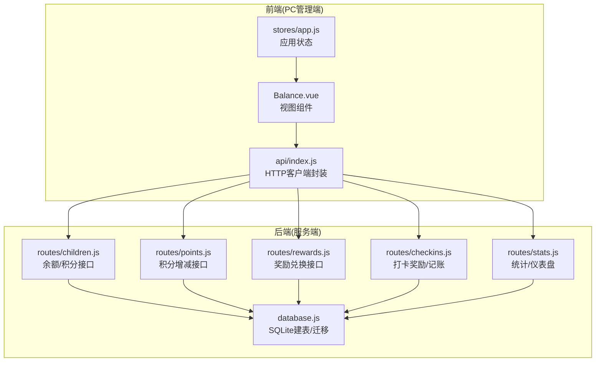
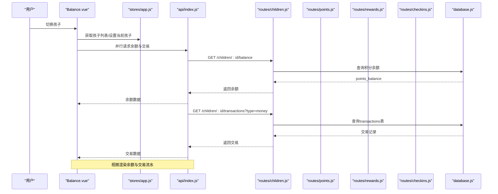
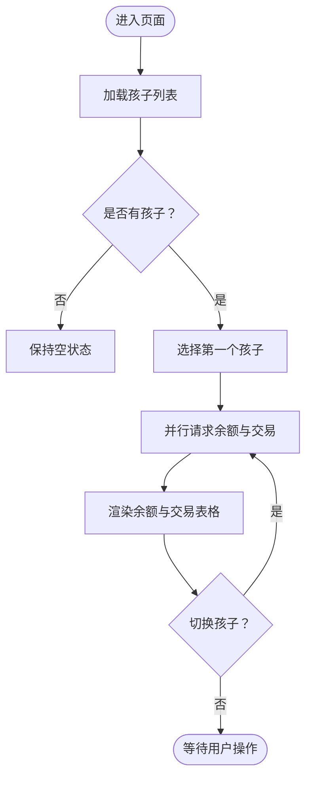
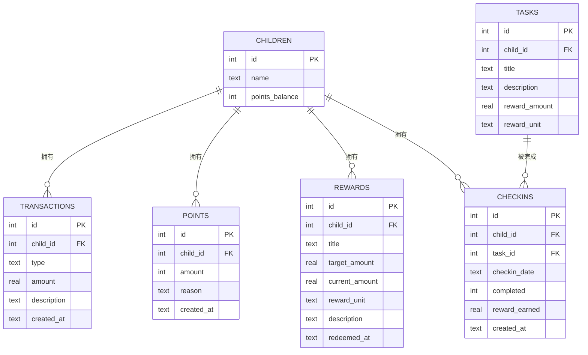
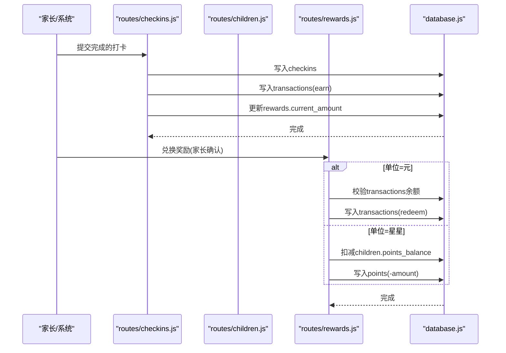
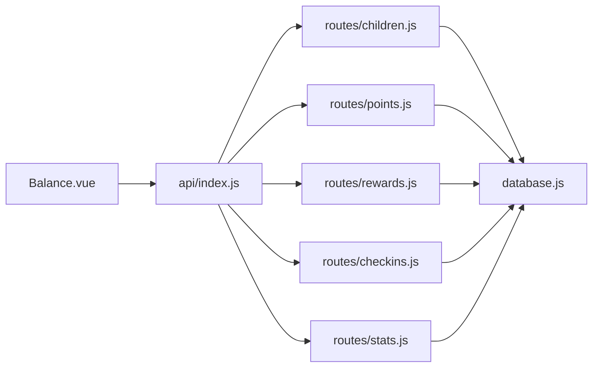

# Balance余额管理

<cite>
**本文引用的文件**
- [Balance.vue](file://star-park/pc-admin/src/views/Balance.vue)
- [index.js](file://star-park/pc-admin/src/api/index.js)
- [children.js](file://star-park/server/src/routes/children.js)
- [points.js](file://star-park/server/src/routes/points.js)
- [rewards.js](file://star-park/server/src/routes/rewards.js)
- [stats.js](file://star-park/server/src/routes/stats.js)
- [database.js](file://star-park/server/src/database.js)
- [checkins.js](file://star-park/server/src/routes/checkins.js)
- [app.js](file://star-park/pc-admin/src/stores/app.js)
</cite>

## 目录
1. [简介](#简介)
2. [项目结构](#项目结构)
3. [核心组件](#核心组件)
4. [架构总览](#架构总览)
5. [详细组件分析](#详细组件分析)
6. [依赖关系分析](#依赖关系分析)
7. [性能考量](#性能考量)
8. [故障排查指南](#故障排查指南)
9. [结论](#结论)
10. [附录](#附录)

## 简介
本文件面向StarParadise“Balance余额管理”视图组件，系统性阐述积分与余额双系统的设计理念与实现路径，覆盖积分获取、消费、转账、余额统计的完整流程；详细说明界面设计（余额展示、交易记录列表、收支明细查看）；解释财务数据模型（transactions表、points表、余额计算逻辑）；文档化交易功能（收入记录、支出记录、转账操作、退款处理）；提供财务报表能力（收支统计、余额趋势、消费分析）；明确权限控制（管理员操作、家长确认、系统自动记账）；并解释与奖励系统的集成（奖励兑换、积分抵扣、余额调整）。

## 项目结构
Balance余额管理由前端PC管理端Vue组件驱动，通过统一API封装调用后端Express路由，后端基于SQLite数据库持久化，采用事务保证关键业务一致性。

图表来源
- [Balance.vue:1-173](file://star-park/pc-admin/src/views/Balance.vue#L1-L173)
- [index.js:1-56](file://star-park/pc-admin/src/api/index.js#L1-L56)
- [children.js:1-96](file://star-park/server/src/routes/children.js#L1-L96)
- [points.js:1-74](file://star-park/server/src/routes/points.js#L1-L74)
- [rewards.js:1-167](file://star-park/server/src/routes/rewards.js#L1-L167)
- [checkins.js:1-90](file://star-park/server/src/routes/checkins.js#L1-L90)
- [stats.js:1-182](file://star-park/server/src/routes/stats.js#L1-L182)
- [database.js:1-111](file://star-park/server/src/database.js#L1-L111)

章节来源
- [Balance.vue:1-173](file://star-park/pc-admin/src/views/Balance.vue#L1-L173)
- [index.js:1-56](file://star-park/pc-admin/src/api/index.js#L1-L56)
- [database.js:1-111](file://star-park/server/src/database.js#L1-L111)

## 核心组件
- Balance视图组件：负责选择孩子、加载余额与交易流水，并以卡片与表格形式呈现。
- API封装：统一基地址、响应拦截、导出各业务API方法（余额、交易、积分、奖励等）。
- 应用状态：维护孩子列表、当前选中孩子、颜色映射等全局状态。
- 路由层：提供余额查询、交易查询、积分增减、奖励兑换、统计等接口。
- 数据库：定义children、transactions、points、rewards、tasks、checkins等表及迁移。

章节来源
- [Balance.vue:56-114](file://star-park/pc-admin/src/views/Balance.vue#L56-L114)
- [index.js:47-54](file://star-park/pc-admin/src/api/index.js#L47-L54)
- [app.js:30-61](file://star-park/pc-admin/src/stores/app.js#L30-L61)
- [children.js:56-93](file://star-park/server/src/routes/children.js#L56-L93)
- [points.js:5-28](file://star-park/server/src/routes/points.js#L5-L28)
- [rewards.js:89-164](file://star-park/server/src/routes/rewards.js#L89-L164)
- [stats.js:6-101](file://star-park/server/src/routes/stats.js#L6-L101)
- [database.js:17-80](file://star-park/server/src/database.js#L17-L80)

## 架构总览
Balance余额管理遵循“前端视图—API封装—后端路由—数据库”的分层架构。前端通过Promise并行请求获取余额与交易，后端路由根据查询参数决定返回积分或金钱流水，数据库通过事务保障关键写入的一致性。

图表来源
- [Balance.vue:88-105](file://star-park/pc-admin/src/views/Balance.vue#L88-L105)
- [index.js:47-49](file://star-park/pc-admin/src/api/index.js#L47-L49)
- [children.js:56-93](file://star-park/server/src/routes/children.js#L56-L93)
- [database.js:62-79](file://star-park/server/src/database.js#L62-L79)

## 详细组件分析

### Balance视图组件（Balance.vue）
- 功能要点
  - 孩子选择器：使用单选按钮组切换不同孩子，触发余额与交易重新加载。
  - 余额展示：卡片样式展示当前余额，按孩子名称动态设置主题色。
  - 交易流水：表格展示时间、类型（收入/支出）、金额（正负）、说明。
  - 并行加载：余额与交易通过Promise.all并发请求，提升首屏速度。
  - 时间格式化：使用dayjs格式化createdAt时间显示。
- 界面设计
  - 余额区域：居中大号数字展示，带单位“元”，配色随孩子变化。
  - 表格列：时间、类型标签、金额正负展示、描述列。
  - 加载态：v-loading包裹整体，避免空数据闪烁。
- 交互流程
  - 首次挂载：拉取孩子列表，自动选择第一个孩子并加载数据。
  - 孩子切换：触发fetchBalanceData，重新并行请求余额与交易。

图表来源
- [Balance.vue:107-113](file://star-park/pc-admin/src/views/Balance.vue#L107-L113)
- [Balance.vue:88-105](file://star-park/pc-admin/src/views/Balance.vue#L88-L105)

章节来源
- [Balance.vue:1-173](file://star-park/pc-admin/src/views/Balance.vue#L1-L173)

### API封装（api/index.js）
- 设计要点
  - 统一基地址：/api，超时与内容类型配置。
  - 响应拦截：自动提取response.data，简化调用侧逻辑。
  - 导出方法：余额、交易、积分、奖励、统计等。
- 关键接口
  - getBalance(childId)：获取积分余额。
  - getTransactions(childId, params)：获取交易记录，默认返回points表（兼容管理后台），传入type=money返回transactions表。
  - getPoints(params)、addPoints(data)：积分查询与手动加减。
  - redeemReward(id)：奖励兑换。

章节来源
- [index.js:1-56](file://star-park/pc-admin/src/api/index.js#L1-L56)

### 数据模型与余额计算（database.js + 路由）
- 表结构概览
  - children：基础信息与points_balance（积分余额）。
  - transactions：金钱收支流水（earn/spend/redeem）。
  - points：积分流水（正负值）。
  - rewards：奖励目标（含target_amount、current_amount、reward_unit等）。
  - tasks、checkins：打卡与奖励关联。
- 余额计算
  - 余额 = 收入总和 - 支出总和（基于transactions表）。
  - 积分余额 = children.points_balance（手动积分增减同步更新）。
- 迁移与兼容
  - 自动迁移：为children增加points_balance；为rewards增加description、reward_unit、redeemed_at等字段。

图表来源
- [database.js:17-80](file://star-park/server/src/database.js#L17-L80)

章节来源
- [database.js:17-111](file://star-park/server/src/database.js#L17-L111)
- [stats.js:79-87](file://star-park/server/src/routes/stats.js#L79-L87)
- [children.js:14-22](file://star-park/server/src/routes/children.js#L14-L22)

### 交易功能与权限控制
- 收入记录（打卡奖励）
  - 触发点：checkins路由在completed=true时创建earn记录，并更新rewards的current_amount与is_achieved。
  - 权限：系统自动记账，无需家长确认。
- 支出记录（消费/扣款）
  - 触发点：rewards路由在unit='元'时，检查transactions余额后创建spend记录。
  - 权限：家长确认兑换（redeem）。
- 转账/积分抵扣
  - 积分抵扣：unit='星星'时，rewards路由扣减children.points_balance并写入points记录。
  - 权限：家长确认兑换。
- 退款处理
  - 当前路由未提供直接退款接口；若需退款，建议通过新增spend记录或扩展rewards的撤销机制。

图表来源
- [checkins.js:48-76](file://star-park/server/src/routes/checkins.js#L48-L76)
- [rewards.js:107-154](file://star-park/server/src/routes/rewards.js#L107-L154)
- [children.js:56-93](file://star-park/server/src/routes/children.js#L56-L93)

章节来源
- [checkins.js:30-87](file://star-park/server/src/routes/checkins.js#L30-L87)
- [rewards.js:89-164](file://star-park/server/src/routes/rewards.js#L89-L164)
- [children.js:70-93](file://star-park/server/src/routes/children.js#L70-L93)

### 财务报表与统计
- 收支统计：基于transactions表按类型求和，计算余额。
- 余额趋势：仪表盘聚合多孩子余额与完成率。
- 消费分析：结合checkins与rewards，评估完成度与目标达成情况。

章节来源
- [stats.js:6-101](file://star-park/server/src/routes/stats.js#L6-L101)
- [stats.js:103-182](file://star-park/server/src/routes/stats.js#L103-L182)

## 依赖关系分析
- 前端依赖
  - Balance.vue依赖Pinia状态（children、currentChildId）、dayjs格式化、Element Plus表格与标签。
  - API封装集中管理HTTP请求，路由方法清晰分离。
- 后端依赖
  - 各路由依赖database.js建表与迁移结果，使用事务保证一致性。
  - checkins与rewards路由相互影响（打卡奖励影响rewards进度，兑换影响余额/积分）。

图表来源
- [Balance.vue:59-60](file://star-park/pc-admin/src/views/Balance.vue#L59-L60)
- [index.js:47-54](file://star-park/pc-admin/src/api/index.js#L47-L54)
- [children.js:1-96](file://star-park/server/src/routes/children.js#L1-L96)
- [points.js:1-74](file://star-park/server/src/routes/points.js#L1-L74)
- [rewards.js:1-167](file://star-park/server/src/routes/rewards.js#L1-L167)
- [checkins.js:1-90](file://star-park/server/src/routes/checkins.js#L1-L90)
- [stats.js:1-182](file://star-park/server/src/routes/stats.js#L1-L182)
- [database.js:1-111](file://star-park/server/src/database.js#L1-L111)

## 性能考量
- 前端
  - 并行请求：余额与交易使用Promise.all减少等待时间。
  - 按需加载：仅在切换孩子或首次进入时发起请求。
- 后端
  - WAL模式与外键约束：提升并发与数据一致性。
  - 事务：积分增减、奖励兑换、打卡奖励均使用事务，避免部分写入。
- 数据库
  - 建表与迁移：统一初始化，避免运行时DDL开销。

## 故障排查指南
- 常见错误与定位
  - 子查询/连接异常：检查children与transactions/points的外键是否正确。
  - 余额不足：兑换时校验transactions余额或points余额，返回400并提示。
  - 不支持的奖励单位：unit非“元/星星”时拒绝兑换。
  - 参数缺失：各路由对必填参数进行校验，返回400。
- 建议排查步骤
  - 前端：确认selectedChildId有效，网络面板查看/api请求状态码与响应体。
  - 后端：查看对应路由日志，核对SQL执行与事务提交。
  - 数据库：确认表结构与迁移是否成功，必要时重建数据库。

章节来源
- [rewards.js:158-163](file://star-park/server/src/routes/rewards.js#L158-L163)
- [points.js:33-41](file://star-park/server/src/routes/points.js#L33-L41)
- [children.js:56-68](file://star-park/server/src/routes/children.js#L56-L68)

## 结论
Balance余额管理通过“积分+余额”双系统实现行为激励与财务透明：积分用于家长手动增减与奖励抵扣，余额用于系统自动记账（收入/支出/兑换）。前端以卡片与表格直观展示，后端以事务保障一致性，并提供统计与仪表盘能力。权限上明确区分系统自动记账与家长确认兑换，满足家庭财务治理需求。

## 附录
- 术语
  - 积分：家长可增减的虚拟分数，常用于奖励抵扣。
  - 余额：以“元”为单位的真实货币账户，由系统自动记账。
- 最佳实践
  - 兑换前务必校验余额/积分充足。
  - 对外暴露的接口尽量幂等，避免重复记账。
  - 增量迁移时保留向后兼容字段，逐步替换旧逻辑。