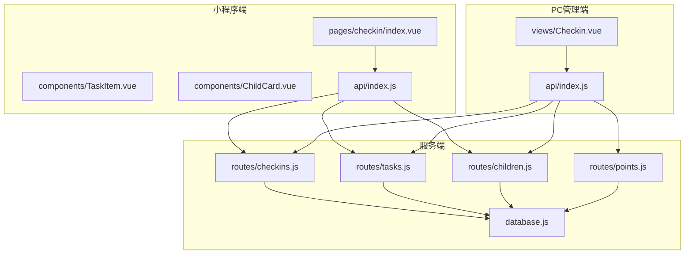
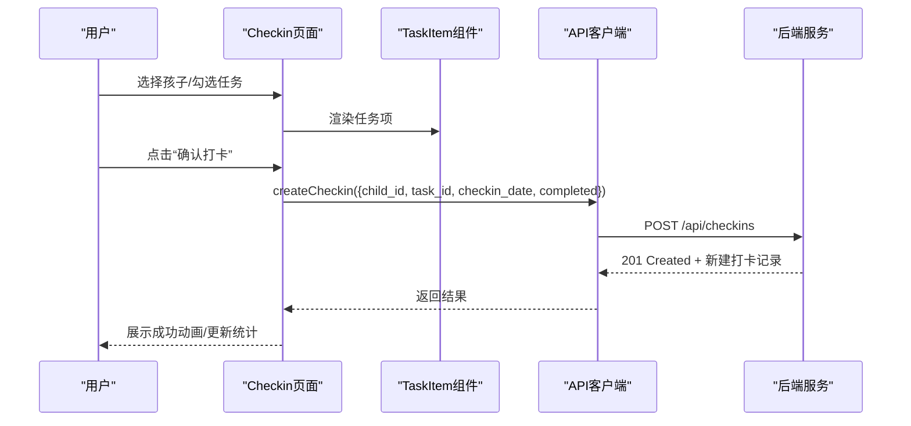
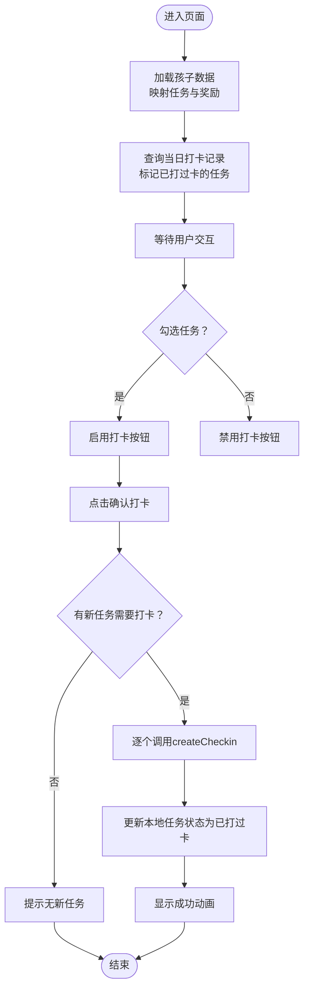
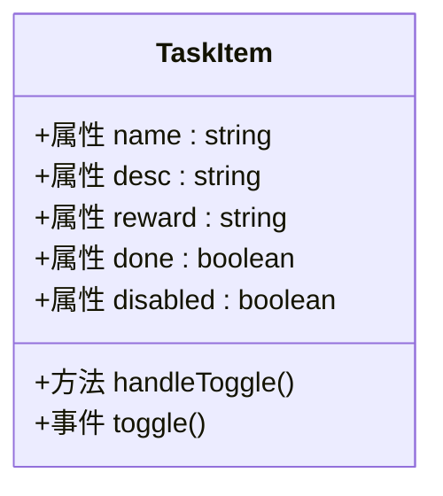
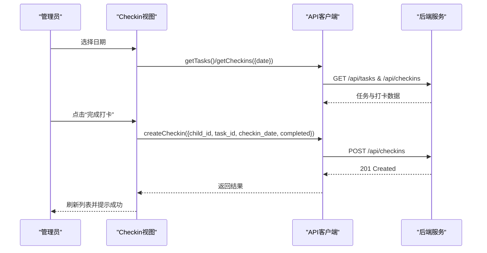
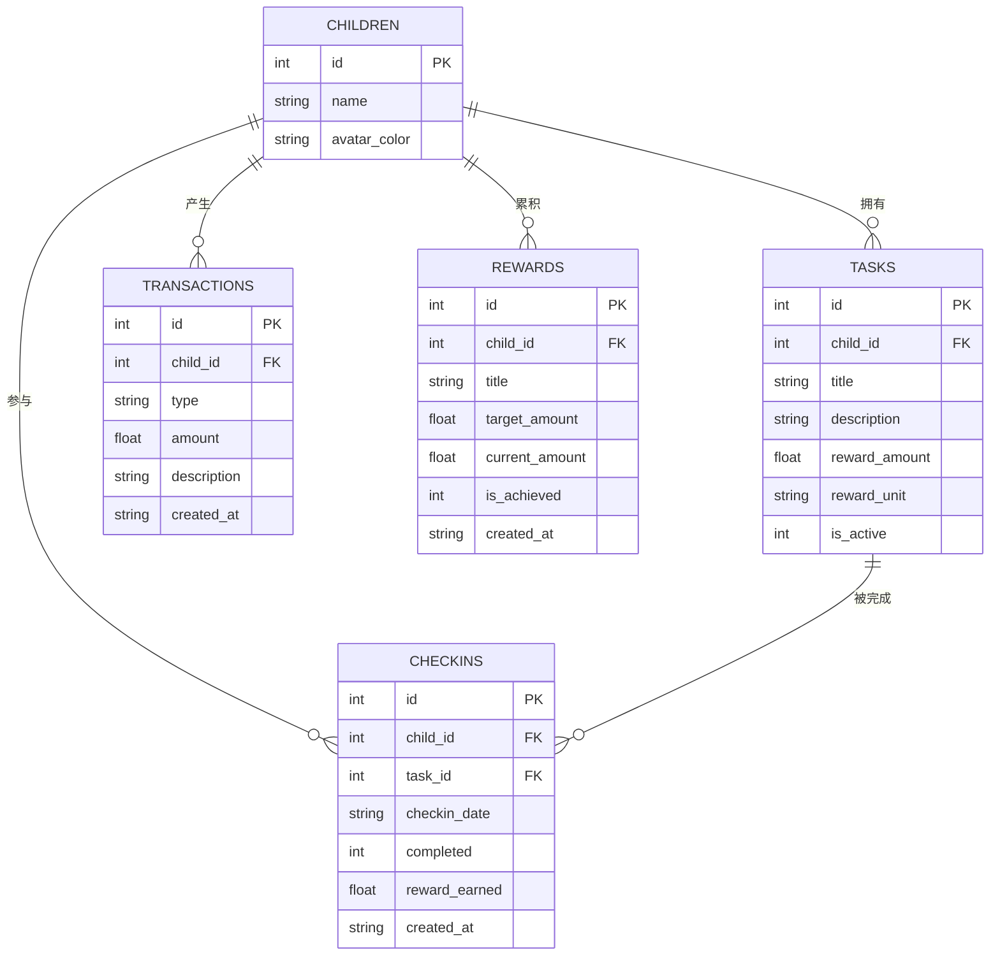
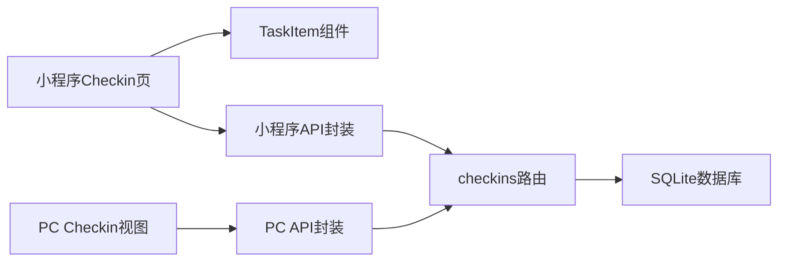

# Checkin打卡管理

<cite>
**本文引用的文件**
- [miniprogram/src/pages/checkin/index.vue](file://star-park/miniprogram/src/pages/checkin/index.vue)
- [miniprogram/src/components/TaskItem.vue](file://star-park/miniprogram/src/components/TaskItem.vue)
- [miniprogram/src/components/ChildCard.vue](file://star-park/miniprogram/src/components/ChildCard.vue)
- [miniprogram/src/api/index.js](file://star-park/miniprogram/src/api/index.js)
- [pc-admin/src/views/Checkin.vue](file://star-park/pc-admin/src/views/Checkin.vue)
- [pc-admin/src/api/index.js](file://star-park/pc-admin/src/api/index.js)
- [server/src/routes/checkins.js](file://star-park/server/src/routes/checkins.js)
- [server/src/routes/tasks.js](file://star-park/server/src/routes/tasks.js)
- [server/src/routes/children.js](file://star-park/server/src/routes/children.js)
- [server/src/routes/points.js](file://star-park/server/src/routes/points.js)
- [server/src/database.js](file://star-park/server/src/database.js)
- [docs/design-docs/miniprogram.md](file://docs/design-docs/miniprogram.md)
- [docs/design-docs/pc-admin.md](file://docs/design-docs/pc-admin.md)
- [docs/api.md](file://docs/api.md)
</cite>

## 目录
1. [简介](#简介)
2. [项目结构](#项目结构)
3. [核心组件](#核心组件)
4. [架构总览](#架构总览)
5. [详细组件分析](#详细组件分析)
6. [依赖关系分析](#依赖关系分析)
7. [性能考量](#性能考量)
8. [故障排查指南](#故障排查指南)
9. [结论](#结论)
10. [附录](#附录)

## 简介
本文件面向“Checkin打卡管理”视图组件，系统性阐述其业务逻辑与实现细节，覆盖以下主题：
- 孩子任务完成状态管理：勾选任务、标记当日已完成、计算今日奖励
- 打卡记录创建与更新流程：单个任务打卡、批量打卡、状态回显
- 界面设计与交互：任务列表展示、打卡按钮、状态指示器、祝贺动画
- 数据绑定机制：父子组件通信、本地状态计算、实时更新
- API集成：checkin接口调用、参数传递、响应处理
- 错误处理策略：网络异常、数据冲突、权限校验
- 用户体验优化：批量打卡、撤销操作建议、历史记录查看

## 项目结构
本项目采用多端分离架构：
- 小程序端（Vue 3 + uni-app）：提供移动端打卡入口与任务列表
- PC管理端（Vue 3 + Element Plus）：提供管理员视角的每日打卡面板
- 服务端（Express + SQLite）：提供REST API与数据持久化

图表来源
- [miniprogram/src/pages/checkin/index.vue:1-322](file://star-park/miniprogram/src/pages/checkin/index.vue#L1-L322)
- [miniprogram/src/components/TaskItem.vue:1-133](file://star-park/miniprogram/src/components/TaskItem.vue#L1-L133)
- [miniprogram/src/components/ChildCard.vue:1-162](file://star-park/miniprogram/src/components/ChildCard.vue#L1-L162)
- [miniprogram/src/api/index.js:1-75](file://star-park/miniprogram/src/api/index.js#L1-L75)
- [pc-admin/src/views/Checkin.vue:1-417](file://star-park/pc-admin/src/views/Checkin.vue#L1-L417)
- [pc-admin/src/api/index.js:1-56](file://star-park/pc-admin/src/api/index.js#L1-L56)
- [server/src/routes/checkins.js:1-90](file://star-park/server/src/routes/checkins.js#L1-L90)
- [server/src/routes/tasks.js:1-91](file://star-park/server/src/routes/tasks.js#L1-L91)
- [server/src/routes/children.js:1-96](file://star-park/server/src/routes/children.js#L1-L96)
- [server/src/routes/points.js:1-74](file://star-park/server/src/routes/points.js#L1-L74)
- [server/src/database.js:1-111](file://star-park/server/src/database.js#L1-L111)

章节来源
- [docs/design-docs/miniprogram.md:1-81](file://docs/design-docs/miniprogram.md#L1-L81)
- [docs/design-docs/pc-admin.md:1-85](file://docs/design-docs/pc-admin.md#L1-L85)

## 核心组件
- 小程序端打卡页：负责孩子选择、任务列表渲染、打卡按钮交互、祝贺动画与统计信息展示
- 任务项组件：封装单个任务的勾选交互与视觉反馈
- 孩子卡片组件：用于其他场景下的孩子信息展示（与打卡页互补）
- API客户端：统一封装请求与错误处理
- PC管理端打卡视图：提供日期选择、批量任务状态查看与单任务打卡

章节来源
- [miniprogram/src/pages/checkin/index.vue:1-322](file://star-park/miniprogram/src/pages/checkin/index.vue#L1-L322)
- [miniprogram/src/components/TaskItem.vue:1-133](file://star-park/miniprogram/src/components/TaskItem.vue#L1-L133)
- [miniprogram/src/components/ChildCard.vue:1-162](file://star-park/miniprogram/src/components/ChildCard.vue#L1-L162)
- [miniprogram/src/api/index.js:1-75](file://star-park/miniprogram/src/api/index.js#L1-L75)
- [pc-admin/src/views/Checkin.vue:1-417](file://star-park/pc-admin/src/views/Checkin.vue#L1-L417)
- [pc-admin/src/api/index.js:1-56](file://star-park/pc-admin/src/api/index.js#L1-L56)

## 架构总览
下图展示了从用户交互到服务端处理的端到端流程，涵盖小程序端与PC管理端的checkin流程。

图表来源
- [miniprogram/src/pages/checkin/index.vue:165-192](file://star-park/miniprogram/src/pages/checkin/index.vue#L165-L192)
- [miniprogram/src/components/TaskItem.vue:32-35](file://star-park/miniprogram/src/components/TaskItem.vue#L32-L35)
- [miniprogram/src/api/index.js:45-46](file://star-park/miniprogram/src/api/index.js#L45-L46)
- [server/src/routes/checkins.js:30-87](file://star-park/server/src/routes/checkins.js#L30-L87)

## 详细组件分析

### 小程序端 Checkin 页面
- 孩子选择器：通过标签页切换当前活跃孩子，高亮显示颜色
- 任务列表：基于活跃孩子渲染任务项，支持勾选与禁用态
- 打卡按钮：仅在有任务被勾选且未当日已打过卡时可用
- 成功动画：展示本次获得奖励与鼓励语
- 统计信息：连续打卡天数、月累计收益、累计余额、积分余额
- 数据加载：首次进入与每次显示时拉取孩子列表，并标记当日已打卡的任务

图表来源
- [miniprogram/src/pages/checkin/index.vue:165-192](file://star-park/miniprogram/src/pages/checkin/index.vue#L165-L192)
- [miniprogram/src/pages/checkin/index.vue:243-263](file://star-park/miniprogram/src/pages/checkin/index.vue#L243-L263)

章节来源
- [miniprogram/src/pages/checkin/index.vue:1-322](file://star-park/miniprogram/src/pages/checkin/index.vue#L1-L322)

### 任务项组件（TaskItem）
- 属性：任务名称、描述、奖励、完成状态、禁用态
- 事件：toggle（仅当未禁用时触发）
- 视觉反馈：勾选态样式、禁用态样式、完成态文字样式

图表来源
- [miniprogram/src/components/TaskItem.vue:21-36](file://star-park/miniprogram/src/components/TaskItem.vue#L21-L36)

章节来源
- [miniprogram/src/components/TaskItem.vue:1-133](file://star-park/miniprogram/src/components/TaskItem.vue#L1-L133)

### 孩子卡片组件（ChildCard）
- 用途：展示孩子头像色条、名称、任务描述、打卡状态徽章、连续打卡与余额等统计
- 适用场景：首页、记录页等其他视图

章节来源
- [miniprogram/src/components/ChildCard.vue:1-162](file://star-park/miniprogram/src/components/ChildCard.vue#L1-L162)

### PC管理端 Checkin 视图
- 日期选择：通过日期选择器切换查看日期
- 任务列表：按孩子分组展示任务，已打过卡的任务显示“已打卡”状态
- 单任务打卡：点击“完成打卡”按钮调用createCheckin，成功后刷新数据
- 特殊积分奖励：打开弹窗，填写孩子、积分数值与原因，提交后刷新

图表来源
- [pc-admin/src/views/Checkin.vue:197-216](file://star-park/pc-admin/src/views/Checkin.vue#L197-L216)
- [pc-admin/src/api/index.js:30-32](file://star-park/pc-admin/src/api/index.js#L30-L32)
- [server/src/routes/checkins.js:30-87](file://star-park/server/src/routes/checkins.js#L30-L87)

章节来源
- [pc-admin/src/views/Checkin.vue:1-417](file://star-park/pc-admin/src/views/Checkin.vue#L1-L417)
- [pc-admin/src/api/index.js:1-56](file://star-park/pc-admin/src/api/index.js#L1-L56)

### API集成与数据流
- 小程序端API封装：自动区分H5与小程序环境的BASE_URL，统一处理HTTP状态与网络错误
- PC端API封装：基于axios，设置baseURL与超时，响应拦截器统一提取data
- checkin接口：POST /api/checkins，参数包含child_id、task_id、checkin_date、completed；服务端事务插入checkins记录并联动创建transactions与更新rewards

图表来源
- [server/src/database.js:18-80](file://star-park/server/src/database.js#L18-L80)
- [server/src/routes/checkins.js:30-87](file://star-park/server/src/routes/checkins.js#L30-L87)

章节来源
- [miniprogram/src/api/index.js:1-75](file://star-park/miniprogram/src/api/index.js#L1-L75)
- [pc-admin/src/api/index.js:1-56](file://star-park/pc-admin/src/api/index.js#L1-L56)
- [server/src/routes/checkins.js:1-90](file://star-park/server/src/routes/checkins.js#L1-L90)
- [server/src/routes/tasks.js:1-91](file://star-park/server/src/routes/tasks.js#L1-L91)
- [server/src/routes/children.js:1-96](file://star-park/server/src/routes/children.js#L1-L96)
- [server/src/routes/points.js:1-74](file://star-park/server/src/routes/points.js#L1-L74)
- [server/src/database.js:1-111](file://star-park/server/src/database.js#L1-L111)

## 依赖关系分析
- 组件耦合
  - 小程序端Checkin页面依赖TaskItem组件进行任务勾选
  - 两者通过props与emit建立松耦合的数据与事件传递
- 数据流
  - 页面通过API客户端发起请求，服务端路由处理并访问SQLite数据库
  - 服务端对checkins写入采用事务，保证数据一致性
- 外部依赖
  - 小程序端使用uni.request，PC端使用axios
  - 服务端使用better-sqlite3与WAL模式提升并发

图表来源
- [miniprogram/src/pages/checkin/index.vue:112-114](file://star-park/miniprogram/src/pages/checkin/index.vue#L112-L114)
- [miniprogram/src/components/TaskItem.vue:30-35](file://star-park/miniprogram/src/components/TaskItem.vue#L30-L35)
- [miniprogram/src/api/index.js:35-74](file://star-park/miniprogram/src/api/index.js#L35-L74)
- [pc-admin/src/views/Checkin.vue](file://star-park/pc-admin/src/views/Checkin.vue#L118)
- [pc-admin/src/api/index.js:1-56](file://star-park/pc-admin/src/api/index.js#L1-L56)
- [server/src/routes/checkins.js:1-90](file://star-park/server/src/routes/checkins.js#L1-L90)
- [server/src/database.js:1-111](file://star-park/server/src/database.js#L1-L111)

章节来源
- [docs/design-docs/miniprogram.md:14-30](file://docs/design-docs/miniprogram.md#L14-L30)
- [docs/design-docs/pc-admin.md:14-32](file://docs/design-docs/pc-admin.md#L14-L32)

## 性能考量
- 本地计算与缓存
  - 今日奖励与按钮可用性通过computed本地计算，避免重复请求
  - 当日已打过卡的任务在本地标记，减少重复提交
- 批量操作
  - 小程序端逐个调用createCheckin，若需更高吞吐可考虑合并请求或服务端批量接口
- 网络与并发
  - 服务端开启WAL模式与外键约束，提升并发与数据一致性
- UI渲染
  - 使用scoped样式与轻量动画，避免过度重排

## 故障排查指南
- 网络异常
  - 小程序端：请求失败时显示Toast并reject，调用方需捕获错误
  - PC端：响应拦截器统一输出错误，建议补充全局消息提示
- 参数校验
  - 服务端对必填字段进行校验，缺失时返回400；调用方需确保传参正确
- 数据冲突
  - 服务端通过事务插入checkins并联动更新rewards，避免不一致
- 权限验证
  - API文档未包含认证机制，部署时需结合实际安全策略

章节来源
- [miniprogram/src/api/index.js:24-29](file://star-park/miniprogram/src/api/index.js#L24-L29)
- [pc-admin/src/api/index.js:12-19](file://star-park/pc-admin/src/api/index.js#L12-L19)
- [server/src/routes/checkins.js:33-46](file://star-park/server/src/routes/checkins.js#L33-L46)
- [docs/api.md:120-145](file://docs/api.md#L120-L145)

## 结论
Checkin打卡管理视图组件在小程序端与PC管理端实现了统一的业务闭环：从任务勾选到打卡提交、从数据更新到状态反馈。通过本地计算与事务处理，系统在易用性与数据一致性之间取得平衡。后续可在批量操作、全局错误提示与权限控制方面进一步完善。

## 附录
- API参考：详见[API接口文档:1-253](file://docs/api.md#L1-L253)
- 设计文档：小程序端[设计文档:1-81](file://docs/design-docs/miniprogram.md#L1-L81)、PC管理端[设计文档:1-85](file://docs/design-docs/pc-admin.md#L1-L85)