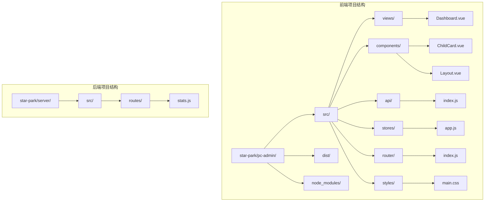
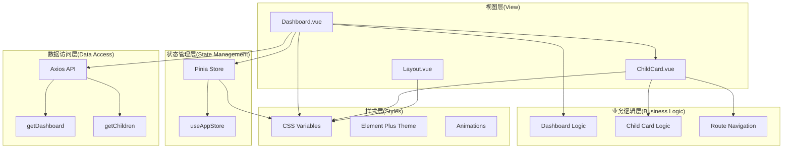
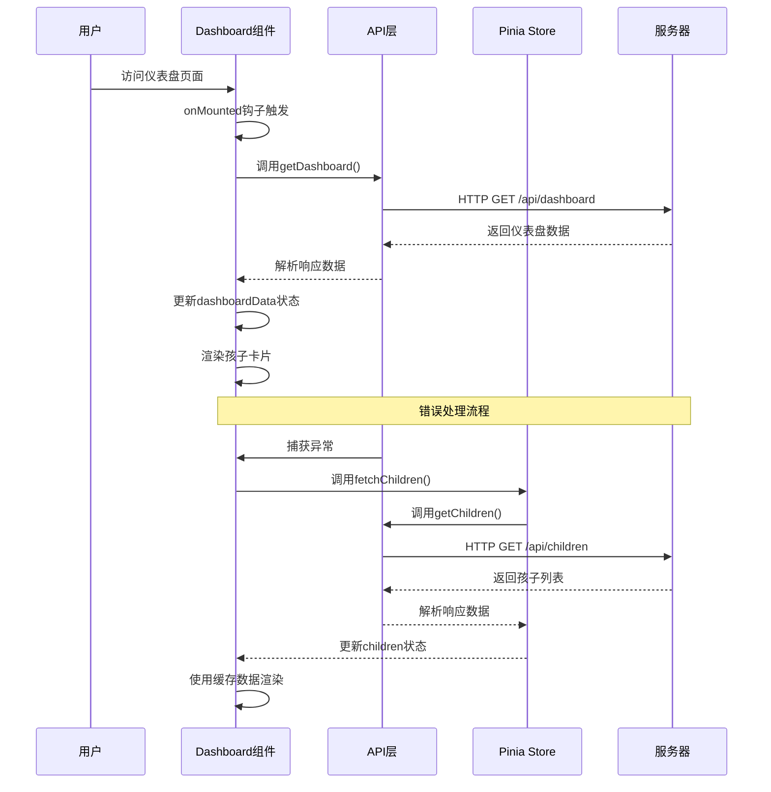
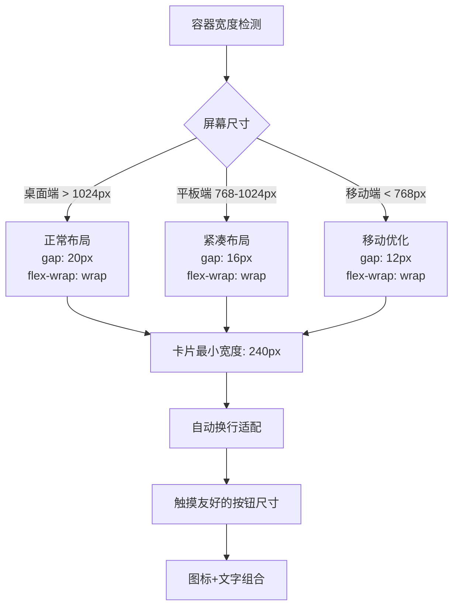
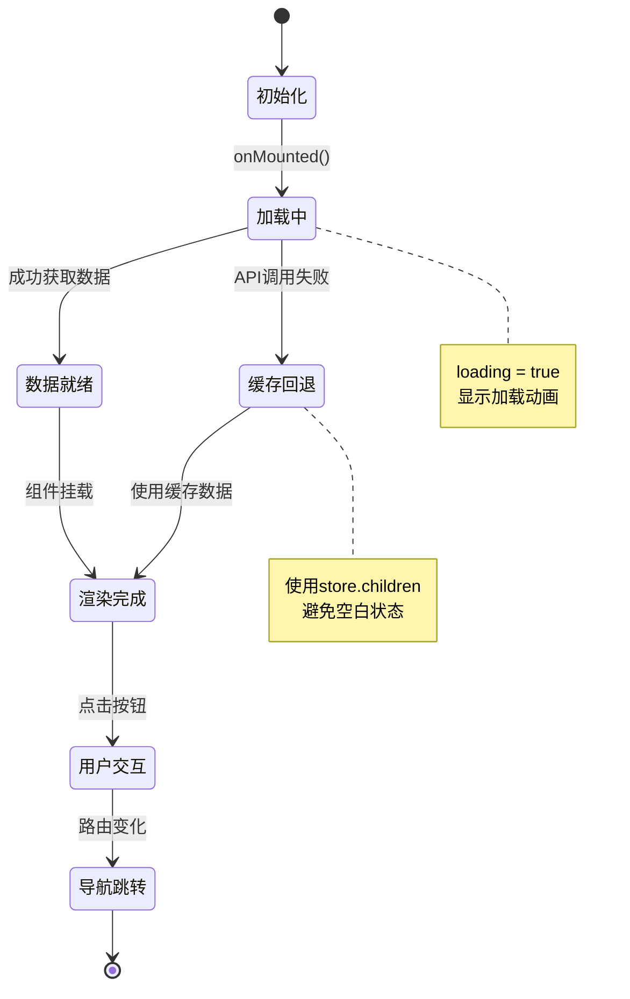
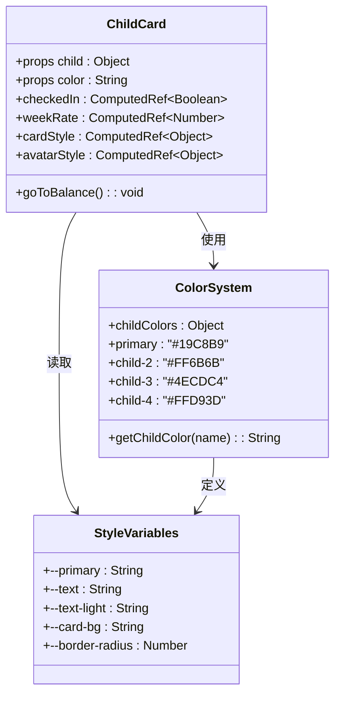
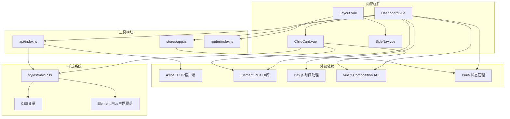
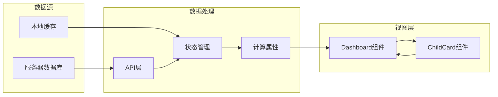

# Dashboard仪表盘

<cite>
**本文档引用的文件**
- [Dashboard.vue](file://star-park/pc-admin/src/views/Dashboard.vue)
- [ChildCard.vue](file://star-park/pc-admin/src/components/ChildCard.vue)
- [api/index.js](file://star-park/pc-admin/src/api/index.js)
- [stores/app.js](file://star-park/pc-admin/src/stores/app.js)
- [router/index.js](file://star-park/pc-admin/src/router/index.js)
- [styles/main.css](file://star-park/pc-admin/src/styles/main.css)
- [Layout.vue](file://star-park/pc-admin/src/components/Layout.vue)
- [stats.js](file://star-park/server/src/routes/stats.js)
</cite>

## 目录
1. [简介](#简介)
2. [项目结构](#项目结构)
3. [核心组件](#核心组件)
4. [架构概览](#架构概览)
5. [详细组件分析](#详细组件分析)
6. [依赖关系分析](#依赖关系分析)
7. [性能考虑](#性能考虑)
8. [故障排除指南](#故障排除指南)
9. [结论](#结论)
10. [附录](#附录)

## 简介

StarParadise Dashboard仪表盘是星星乐园管理系统的核心界面，专为家长和管理员提供孩子学习进度的实时可视化监控。该仪表盘采用现代化的Vue 3 Composition API架构，结合Element Plus组件库，实现了响应式布局和丰富的交互体验。

仪表盘的主要功能包括：
- 实时显示孩子当日学习进度和打卡状态
- 展示每个孩子的连续打卡天数、本周完成率等关键指标
- 提供快速导航到各个功能模块的操作入口
- 支持多孩子数据的统一管理和个性化展示

## 项目结构

StarParadise项目采用前后端分离的架构设计，Dashboard作为前端PC管理端的核心组件，位于以下目录结构中：



**图表来源**
- [Dashboard.vue:1-146](file://star-park/pc-admin/src/views/Dashboard.vue#L1-L146)
- [Layout.vue:1-29](file://star-park/pc-admin/src/components/Layout.vue#L1-L29)
- [stats.js:1-182](file://star-park/server/src/routes/stats.js#L1-L182)

**章节来源**
- [Dashboard.vue:1-146](file://star-park/pc-admin/src/views/Dashboard.vue#L1-L146)
- [Layout.vue:1-29](file://star-park/pc-admin/src/components/Layout.vue#L1-L29)

## 核心组件

### Dashboard仪表盘组件

Dashboard组件是整个系统的主界面，负责协调所有子组件的渲染和数据流。该组件采用了Vue 3的Composition API模式，提供了清晰的状态管理和生命周期控制。

主要特性：
- **响应式布局**：使用Flexbox实现自适应的卡片排列
- **状态管理**：集成Pinia状态管理，支持全局数据缓存
- **错误处理**：完善的异常捕获和降级机制
- **动画效果**：基于CSS变量的主题动画系统

### ChildCard孩子卡片组件

ChildCard是Dashboard中的核心展示组件，专门用于呈现单个孩子的学习进度信息。该组件设计精巧，通过props接收父组件传递的数据，并通过计算属性动态生成样式。

关键功能：
- **个性化配色**：根据孩子姓名动态分配主题色彩
- **进度可视化**：使用Element Plus进度条组件展示完成率
- **交互反馈**：点击积分余额触发路由跳转
- **状态指示**：通过不同样式区分已完成和未完成的任务

**章节来源**
- [Dashboard.vue:43-92](file://star-park/pc-admin/src/views/Dashboard.vue#L43-L92)
- [ChildCard.vue:49-81](file://star-park/pc-admin/src/components/ChildCard.vue#L49-L81)

## 架构概览

StarParadise Dashboard采用MVVM架构模式，通过清晰的层次分离实现了高内聚低耦合的设计原则：



**图表来源**
- [Dashboard.vue:43-92](file://star-park/pc-admin/src/views/Dashboard.vue#L43-L92)
- [ChildCard.vue:49-81](file://star-park/pc-admin/src/components/ChildCard.vue#L49-L81)
- [api/index.js:1-56](file://star-park/pc-admin/src/api/index.js#L1-L56)

## 详细组件分析

### Dashboard组件深度解析

Dashboard组件是整个仪表盘的核心控制器，负责协调数据获取、状态管理和UI渲染。

#### 数据获取流程



**图表来源**
- [Dashboard.vue:76-91](file://star-park/pc-admin/src/views/Dashboard.vue#L76-L91)
- [api/index.js:44-45](file://star-park/pc-admin/src/api/index.js#L44-L45)
- [stores/app.js:30-44](file://star-park/pc-admin/src/stores/app.js#L30-L44)

#### 布局设计理念

Dashboard采用三层布局结构：

1. **欢迎区域**：展示日期和问候语，营造亲切的用户氛围
2. **孩子卡片区域**：使用Flexbox实现响应式网格布局
3. **快捷操作区域**：提供功能导航的按钮组

#### 响应式布局实现



**图表来源**
- [Dashboard.vue:119-134](file://star-park/pc-admin/src/views/Dashboard.vue#L119-L134)
- [styles/main.css:26-33](file://star-park/pc-admin/src/styles/main.css#L26-L33)

#### 状态管理机制

Dashboard组件集成了多层次的状态管理策略：



**图表来源**
- [Dashboard.vue:52-61](file://star-park/pc-admin/src/views/Dashboard.vue#L52-L61)
- [Dashboard.vue:76-87](file://star-park/pc-admin/src/views/Dashboard.vue#L76-L87)

**章节来源**
- [Dashboard.vue:1-146](file://star-park/pc-admin/src/views/Dashboard.vue#L1-L146)

### ChildCard组件深度解析

ChildCard组件是Dashboard中最复杂的子组件，承担着数据展示和用户交互的双重职责。

#### 数据模型设计

ChildCard组件接收标准化的孩子信息对象，包含以下关键字段：

| 字段名 | 类型 | 描述 | 默认值 |
|--------|------|------|--------|
| id | number | 孩子唯一标识符 | - |
| name | string | 孩子姓名 | "" |
| grade | string | 年级信息 | "" |
| todayCheckedIn | boolean | 今日是否已打卡 | false |
| streak | number | 连续打卡天数 | 0 |
| weekRate | number | 本周完成率百分比 | 0 |
| balance | number | 余额（元） | 0 |
| points_balance | number | 积分余额 | 0 |

#### 样式系统架构

ChildCard采用CSS变量驱动的主题系统：



**图表来源**
- [ChildCard.vue:53-81](file://star-park/pc-admin/src/components/ChildCard.vue#L53-L81)
- [stores/app.js:18-28](file://star-park/pc-admin/src/stores/app.js#L18-L28)
- [styles/main.css:2-17](file://star-park/pc-admin/src/styles/main.css#L2-L17)

#### 交互设计模式

ChildCard实现了多种用户交互模式：

1. **状态指示**：通过颜色和图标直观显示打卡状态
2. **进度可视化**：使用Element Plus进度条展示完成率
3. **点击反馈**：积分余额点击触发路由导航
4. **悬停效果**：卡片悬停时的阴影和位移动画

**章节来源**
- [ChildCard.vue:1-161](file://star-park/pc-admin/src/components/ChildCard.vue#L1-L161)

### API集成与数据流

Dashboard组件通过统一的API层与后端服务进行通信，实现了清晰的数据流向：

```mermaid
sequenceDiagram
participant Client as 前端客户端
participant Dashboard as Dashboard组件
participant API as Axios实例
participant Interceptor as 响应拦截器
participant Server as Express服务器
participant Database as SQLite数据库
Client->>Dashboard : 请求仪表盘数据
Dashboard->>API : getDashboard()
API->>Interceptor : 发送HTTP请求
Interceptor->>Server : GET /api/dashboard
Server->>Database : 查询仪表盘数据
Database-->>Server : 返回查询结果
Server-->>Interceptor : JSON响应
Interceptor-->>API : 解析响应数据
API-->>Dashboard : 标准化数据
Dashboard->>Dashboard : 更新状态
Dashboard-->>Client : 渲染界面
Note over API,Interceptor
响应拦截器自动提取
response.data
统一错误处理
end note
```

**图表来源**
- [api/index.js:12-19](file://star-park/pc-admin/src/api/index.js#L12-L19)
- [api/index.js:44-45](file://star-park/pc-admin/src/api/index.js#L44-L45)
- [stats.js:103-179](file://star-park/server/src/routes/stats.js#L103-L179)

**章节来源**
- [api/index.js:1-56](file://star-park/pc-admin/src/api/index.js#L1-L56)
- [stats.js:1-182](file://star-park/server/src/routes/stats.js#L1-L182)

## 依赖关系分析

### 组件依赖图



**图表来源**
- [Dashboard.vue:43-49](file://star-park/pc-admin/src/views/Dashboard.vue#L43-L49)
- [ChildCard.vue:49-51](file://star-park/pc-admin/src/components/ChildCard.vue#L49-L51)
- [api/index.js:1-10](file://star-park/pc-admin/src/api/index.js#L1-L10)
- [stores/app.js:1-3](file://star-park/pc-admin/src/stores/app.js#L1-L3)

### 数据流依赖

Dashboard组件的数据流遵循单向数据绑定原则，确保了数据的一致性和可预测性：



**图表来源**
- [Dashboard.vue:55-61](file://star-park/pc-admin/src/views/Dashboard.vue#L55-L61)
- [stores/app.js:30-44](file://star-park/pc-admin/src/stores/app.js#L30-L44)

**章节来源**
- [Dashboard.vue:43-92](file://star-park/pc-admin/src/views/Dashboard.vue#L43-L92)
- [ChildCard.vue:49-81](file://star-park/pc-admin/src/components/ChildCard.vue#L49-L81)

## 性能考虑

### 渲染性能优化

Dashboard组件在设计时充分考虑了渲染性能，采用了多项优化策略：

1. **虚拟DOM优化**：使用Vue 3的Composition API减少不必要的重渲染
2. **懒加载机制**：路由级别的组件懒加载，减少初始包体积
3. **计算属性缓存**：利用Vue的计算属性缓存机制避免重复计算
4. **条件渲染**：使用v-if控制空状态的渲染，避免无意义的DOM节点

### 网络性能优化

API层实现了多重网络优化策略：

1. **超时控制**：10秒的请求超时时间平衡了用户体验和资源占用
2. **错误重试**：自动降级到缓存数据，确保界面可用性
3. **响应拦截**：统一的数据格式化和错误处理
4. **连接复用**：Axios实例的连接池管理

### 内存管理

组件实现了良好的内存管理机制：

1. **状态清理**：组件卸载时自动清理定时器和事件监听器
2. **引用优化**：使用计算属性替代直接的数据引用
3. **垃圾回收**：及时释放不再使用的对象引用

## 故障排除指南

### 常见问题诊断

#### 数据加载失败

**症状**：仪表盘显示空白或加载状态长时间不消失

**可能原因**：
1. 服务器API不可用
2. 网络连接异常
3. CORS跨域问题
4. 认证令牌过期

**解决方案**：
1. 检查浏览器开发者工具的Network面板
2. 验证API端点的可达性
3. 确认服务器日志中的错误信息
4. 重新登录系统刷新认证状态

#### 样式显示异常

**症状**：界面元素位置错乱或颜色不正确

**可能原因**：
1. CSS变量未正确加载
2. Element Plus主题冲突
3. 浏览器兼容性问题
4. 缓存问题

**解决方案**：
1. 清除浏览器缓存
2. 检查CSS变量定义
3. 验证Element Plus版本兼容性
4. 尝试禁用浏览器扩展程序

#### 交互功能失效

**症状**：按钮点击无响应或路由跳转失败

**可能原因**：
1. Vue Router配置错误
2. 事件监听器绑定失败
3. 权限验证失败
4. 组件生命周期问题

**解决方案**：
1. 检查路由配置和路径匹配
2. 验证事件处理器的绑定状态
3. 确认用户权限和角色设置
4. 查看组件的生命周期钩子执行顺序

**章节来源**
- [Dashboard.vue:76-87](file://star-park/pc-admin/src/views/Dashboard.vue#L76-L87)
- [api/index.js:12-19](file://star-park/pc-admin/src/api/index.js#L12-L19)

## 结论

StarParadise Dashboard仪表盘是一个设计精良、功能完整的Vue 3应用组件。它成功地将复杂的数据可视化需求转化为直观易用的用户界面，体现了现代前端开发的最佳实践。

该组件的主要优势包括：

1. **优秀的架构设计**：清晰的分层结构和明确的职责分离
2. **强大的响应式能力**：灵活的布局系统适应各种设备尺寸
3. **完善的错误处理**：健壮的降级机制确保用户体验
4. **优雅的视觉设计**：基于CSS变量的主题系统支持个性化定制
5. **高效的性能表现**：优化的渲染策略和网络请求处理

通过合理使用本指南提供的最佳实践和故障排除方法，开发者可以进一步提升Dashboard组件的功能性和稳定性，为用户提供更加优质的管理体验。

## 附录

### 样式定制指南

#### CSS变量配置

Dashboard组件广泛使用CSS变量来实现主题定制：

| 变量名称 | 默认值 | 用途描述 |
|----------|--------|----------|
| --primary | #19C8B9 | 主色调，用于进度条和链接 |
| --text | #725D42 | 主要文本颜色 |
| --text-light | #A89880 | 辅助文本颜色 |
| --card-bg | #FFFFFF | 卡片背景色 |
| --bg | #F8F8F0 | 页面背景色 |
| --border-radius | 18px | 圆角半径 |
| --shadow | 0 2px 12px rgba(0,0,0,0.08) | 阴影效果 |

#### 动画效果配置

组件内置了多种CSS动画效果：

1. **淡入动画**：`.fade-in-up`类实现页面加载时的淡入效果
2. **检查动画**：`.check-bounce`类实现打卡完成时的弹跳效果
3. **悬停动画**：卡片悬停时的位移和阴影变化

#### 主题色彩映射

系统为不同孩子预设了专属色彩：

| 孩子姓名 | 颜色代码 | 用途 |
|----------|----------|------|
| 老二 | #FF6B6B | 红色主题 |
| 老三 | #4ECDC4 | 青色主题 |
| 老四 | #FFD93D | 黄色主题 |
| 其他 | #19C8B9 | 默认绿色 |

### 用户体验优化建议

#### 空状态处理

当没有数据时，Dashboard提供了友好的空状态提示：
- 显示"暂无孩子数据"的提示信息
- 隐藏加载状态，避免用户困惑
- 提供清晰的引导信息

#### 加载状态优化

组件实现了多层次的加载状态反馈：
- 全局加载遮罩层
- 卡片级别的加载指示器
- 进度条的渐进式更新

#### 交互反馈设计

系统提供了丰富的交互反馈：
- 按钮的悬停和激活状态
- 卡片的点击波纹效果
- 表单输入的即时验证反馈