# Goals奖励目标

<cite>
**本文档引用的文件**
- [Goals.vue](file://star-park/pc-admin/src/views/Goals.vue)
- [database.js](file://star-park/server/src/database.js)
- [rewards.js](file://star-park/server/src/routes/rewards.js)
- [stats.js](file://star-park/server/src/routes/stats.js)
- [api/index.js](file://star-park/pc-admin/src/api/index.js)
- [ChildCard.vue](file://star-park/pc-admin/src/components/ChildCard.vue)
- [index.vue](file://star-park/miniprogram/src/pages/index/index.vue)
</cite>

## 目录
1. [简介](#简介)
2. [项目结构](#项目结构)
3. [核心组件](#核心组件)
4. [架构概览](#架构概览)
5. [详细组件分析](#详细组件分析)
6. [数据模型](#数据模型)
7. [交互功能](#交互功能)
8. [界面设计](#界面设计)
9. [数据验证机制](#数据验证机制)
10. [统计展示](#统计展示)
11. [依赖关系分析](#依赖关系分析)
12. [性能考虑](#性能考虑)
13. [故障排除指南](#故障排除指南)
14. [结论](#结论)

## 简介

StarParadise Goals奖励目标视图组件是StarParadise家庭激励系统的核心功能模块，专为家长和孩子设计，用于管理日常奖励目标和追踪完成进度。该组件提供了直观的界面来创建、管理和监控各种类型的奖励目标，包括金钱奖励和积分奖励，并集成了完整的进度追踪、完成状态管理和统计分析功能。

系统采用前后端分离架构，前端使用Vue.js构建PC管理界面，后端基于Express.js和SQLite数据库，实现了完整的奖励目标生命周期管理。

## 项目结构

StarParadise项目采用模块化架构，主要分为三个核心部分：

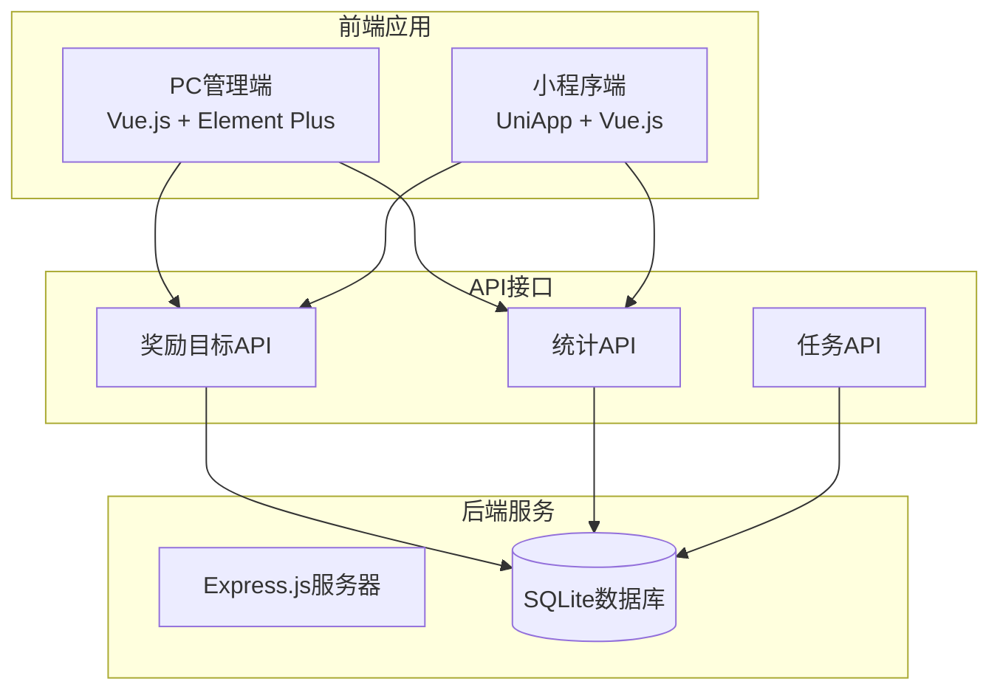

**图表来源**
- [Goals.vue:1-686](file://star-park/pc-admin/src/views/Goals.vue#L1-L686)
- [database.js:1-111](file://star-park/server/src/database.js#L1-L111)

**章节来源**
- [Goals.vue:1-686](file://star-park/pc-admin/src/views/Goals.vue#L1-L686)
- [database.js:1-111](file://star-park/server/src/database.js#L1-L111)

## 核心组件

Goals奖励目标视图组件是PC管理端的核心功能模块，提供了以下主要功能：

### 主要功能特性

1. **目标管理**：创建、编辑、删除年度目标
2. **进度追踪**：实时显示目标完成进度
3. **状态管理**：多种目标状态分类（待办、休憩、健康、快乐、学习）
4. **待办关联**：将日常任务与目标关联
5. **可视化展示**：进度条、状态标签、完成指示器
6. **本地存储**：数据持久化保存

### 技术架构

组件采用Vue.js Composition API设计，结合Element Plus UI框架，实现了响应式的用户界面和流畅的交互体验。

**章节来源**
- [Goals.vue:194-480](file://star-park/pc-admin/src/views/Goals.vue#L194-L480)

## 架构概览

系统采用分层架构设计，确保各组件职责清晰、耦合度低：

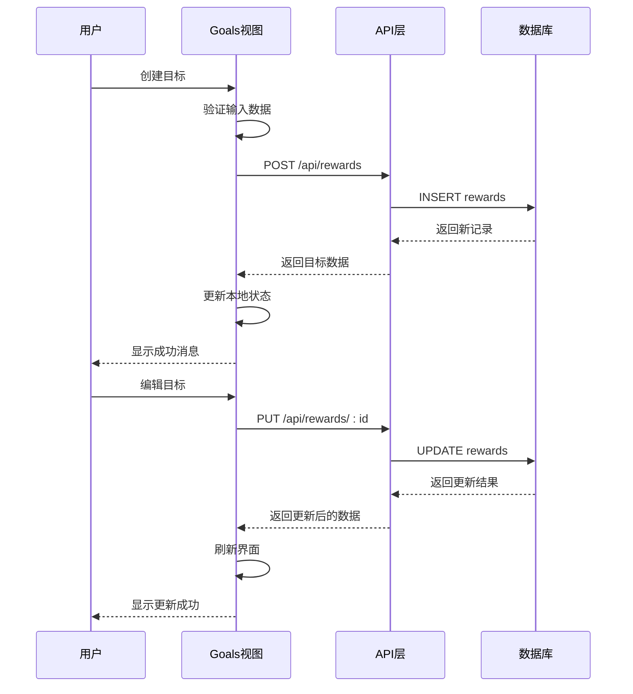

**图表来源**
- [Goals.vue:267-286](file://star-park/pc-admin/src/views/Goals.vue#L267-L286)
- [rewards.js:21-38](file://star-park/server/src/routes/rewards.js#L21-L38)

## 详细组件分析

### Goals视图组件架构

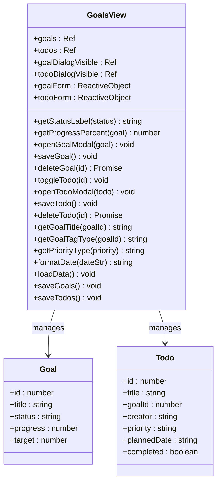

**图表来源**
- [Goals.vue:205-226](file://star-park/pc-admin/src/views/Goals.vue#L205-L226)
- [Goals.vue:244-354](file://star-park/pc-admin/src/views/Goals.vue#L244-L354)

### 数据流处理

组件内部实现了完整的数据流管理机制：

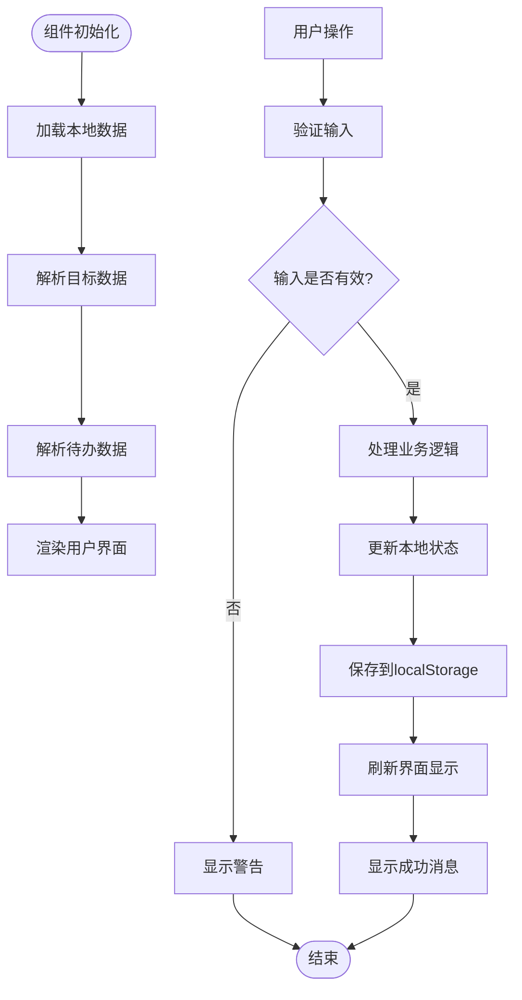

**图表来源**
- [Goals.vue:267-286](file://star-park/pc-admin/src/views/Goals.vue#L267-L286)
- [Goals.vue:326-346](file://star-park/pc-admin/src/views/Goals.vue#L326-L346)

**章节来源**
- [Goals.vue:194-480](file://star-park/pc-admin/src/views/Goals.vue#L194-L480)

## 数据模型

### 目标数据结构

Goals组件管理两种主要数据类型：目标（Goals）和待办（Todos）。

#### 目标实体结构

| 字段名 | 类型 | 必填 | 描述 | 默认值 |
|--------|------|------|------|--------|
| id | number | 是 | 目标唯一标识符 | 自动生成 |
| title | string | 是 | 目标名称 | 空字符串 |
| status | string | 否 | 目标状态 | 'todo' |
| progress | number | 否 | 当前进度值 | 0 |
| target | number | 否 | 目标总量 | 1 |

#### 待办实体结构

| 字段名 | 类型 | 必填 | 描述 | 默认值 |
|--------|------|------|------|--------|
| id | number | 是 | 待办唯一标识符 | 自动生成 |
| title | string | 是 | 待办名称 | 空字符串 |
| goalId | number | 否 | 关联的目标ID | null |
| creator | string | 否 | 创建者姓名 | '晓' |
| priority | string | 否 | 优先级 | 'medium' |
| plannedDate | string | 否 | 计划完成日期 | 空字符串 |
| completed | boolean | 否 | 完成状态 | false |

### 状态枚举定义

系统支持五种目标状态，每种状态都有对应的视觉标识：

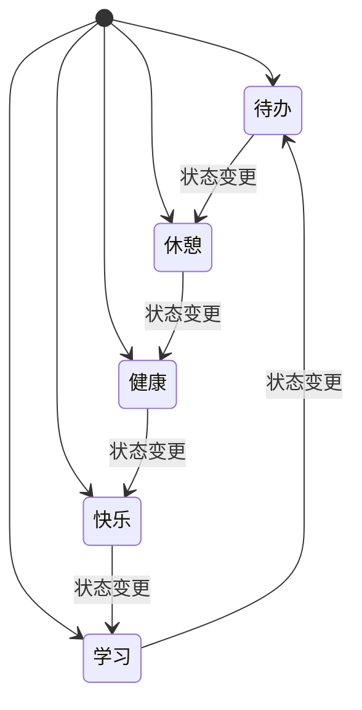

**图表来源**
- [Goals.vue:246-249](file://star-park/pc-admin/src/views/Goals.vue#L246-L249)

**章节来源**
- [Goals.vue:205-226](file://star-park/pc-admin/src/views/Goals.vue#L205-L226)
- [Goals.vue:393-459](file://star-park/pc-admin/src/views/Goals.vue#L393-L459)

## 交互功能

### 目标管理功能

#### 创建目标流程

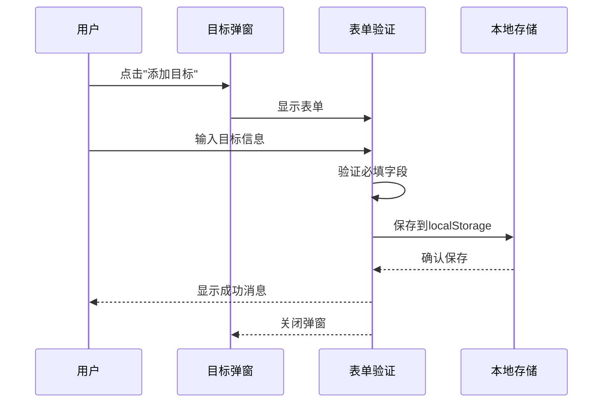

#### 编辑目标流程

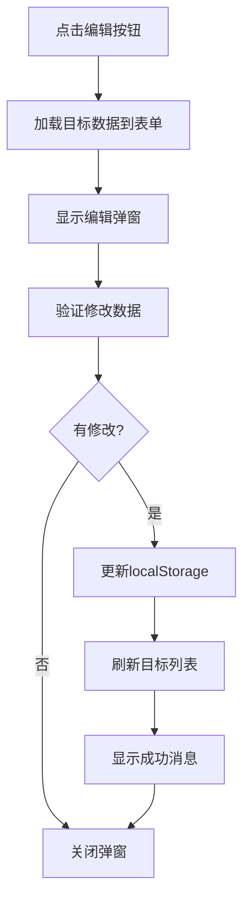

#### 删除目标流程

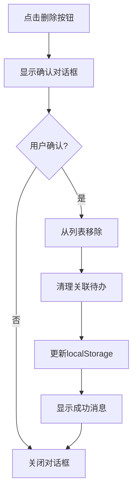

### 待办管理功能

#### 待办状态切换

待办任务支持复选框状态切换，实现一键完成/未完成操作：

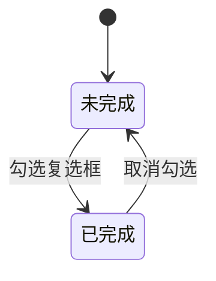

#### 待办过滤功能

系统提供三种过滤模式：
- 全部：显示所有待办任务
- 进行中：仅显示未完成的任务
- 已完成：仅显示已完成的任务

**章节来源**
- [Goals.vue:256-354](file://star-park/pc-admin/src/views/Goals.vue#L256-L354)

## 界面设计

### 视觉设计原则

Goals组件采用了现代化的卡片式设计，结合响应式布局，确保在不同设备上的良好用户体验。

#### 目标卡片设计

每个目标都以卡片形式展示，包含以下元素：

1. **状态标签**：显示目标当前状态，使用不同颜色标识
2. **标题文本**：目标名称，支持截断显示
3. **进度条**：可视化显示完成进度
4. **进度数值**：显示具体完成数量和目标数量
5. **操作按钮**：悬停时显示编辑和删除按钮

#### 颜色编码系统

系统使用颜色来直观表示不同的目标状态：

| 状态 | 颜色代码 | 用途 |
|------|----------|------|
| 待办 | #4CAF50 | 绿色，表示积极向上的目标 |
| 休憩 | #9E9E9E | 灰色，表示放松和休息 |
| 健康 | #2196F3 | 蓝色，表示身体健康 |
| 快乐 | #FF9800 | 橙色，表示快乐和娱乐 |
| 学习 | #9C27B0 | 紫色，表示学习和成长 |

#### 响应式布局

组件支持多种屏幕尺寸：

- **桌面端**：最多3列布局
- **平板端**：最多2列布局  
- **移动端**：1列自适应布局

### 用户体验优化

1. **悬停效果**：目标卡片悬停时有轻微的阴影和位移效果
2. **过渡动画**：进度条宽度变化有平滑的过渡动画
3. **空状态**：当没有数据时显示友好的提示信息
4. **加载状态**：表格操作时显示加载指示器

**章节来源**
- [Goals.vue:520-686](file://star-park/pc-admin/src/views/Goals.vue#L520-L686)

## 数据验证机制

### 输入验证规则

Goals组件实现了多层次的数据验证机制：

#### 目标表单验证

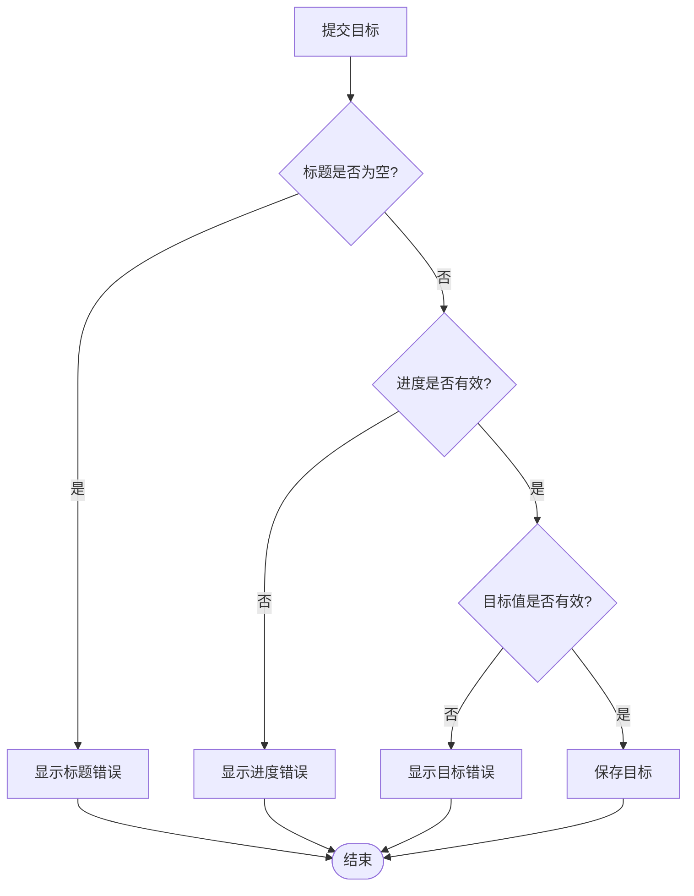

#### 待办表单验证

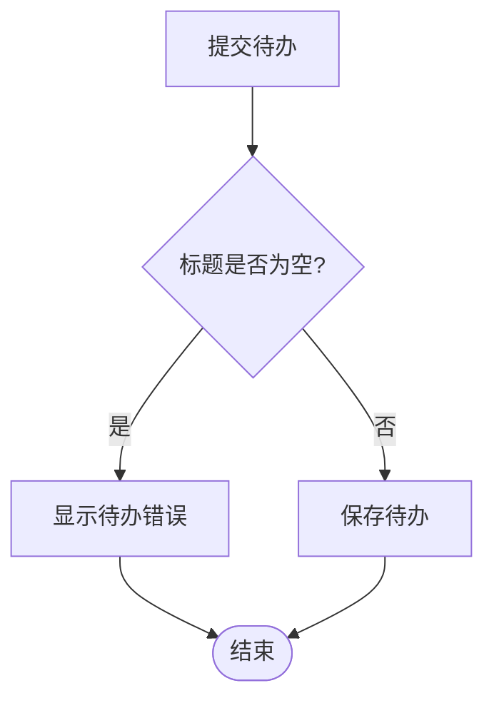

### 数据完整性保证

1. **必填字段检查**：标题字段必须填写
2. **数值范围验证**：进度和目标值必须为正数
3. **状态约束**：目标状态必须在允许范围内
4. **关联完整性**：删除目标时自动清理关联的待办任务

**章节来源**
- [Goals.vue:267-286](file://star-park/pc-admin/src/views/Goals.vue#L267-L286)
- [Goals.vue:326-346](file://star-park/pc-admin/src/views/Goals.vue#L326-L346)

## 统计展示

### 进度计算算法

系统实现了精确的进度计算算法：

#### 百分比计算

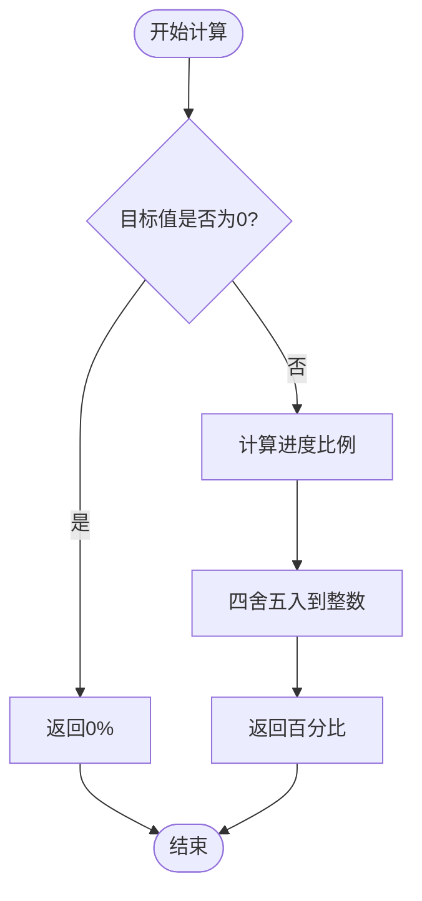

#### 进度条可视化

进度条采用渐变色设计，根据目标状态动态调整颜色：
- 绿色渐变：待办状态
- 灰色渐变：休憩状态  
- 蓝色渐变：健康状态
- 橙色渐变：快乐状态
- 紫色渐变：学习状态

### 统计指标

系统提供了多种统计指标来帮助用户了解目标完成情况：

1. **完成率计算**：`(已完成数量 / 总数量) × 100%`
2. **平均进度**：所有目标进度的平均值
3. **状态分布**：各状态目标的数量统计
4. **趋势分析**：历史进度变化趋势

**章节来源**
- [Goals.vue:251-254](file://star-park/pc-admin/src/views/Goals.vue#L251-L254)

## 依赖关系分析

### 组件间依赖

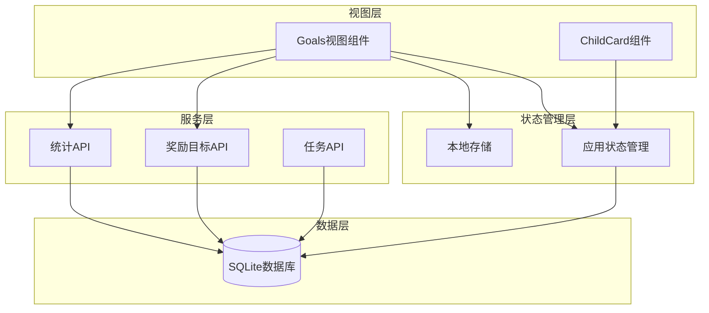

**图表来源**
- [Goals.vue:1-686](file://star-park/pc-admin/src/views/Goals.vue#L1-L686)
- [ChildCard.vue:1-161](file://star-park/pc-admin/src/components/ChildCard.vue#L1-L161)

### 外部依赖

系统依赖的主要外部库：

1. **Vue.js 3.x**：核心框架，提供响应式数据绑定和组件系统
2. **Element Plus**：UI组件库，提供丰富的界面组件
3. **Day.js**：日期处理库，简化日期格式化和计算
4. **Axios**：HTTP客户端，处理API请求
5. **Better-SQLite3**：SQLite数据库驱动，提供高性能的本地存储

**章节来源**
- [Goals.vue:195-199](file://star-park/pc-admin/src/views/Goals.vue#L195-L199)
- [api/index.js:1-56](file://star-park/pc-admin/src/api/index.js#L1-L56)

## 性能考虑

### 本地存储优化

系统采用localStorage进行数据持久化，具有以下优势：

1. **零延迟访问**：数据存储在浏览器本地，访问速度极快
2. **离线可用**：无需网络连接即可访问数据
3. **轻量级**：localStorage容量限制为5-10MB，满足应用需求

### 渲染性能优化

1. **虚拟滚动**：对于大量数据采用虚拟滚动技术
2. **懒加载**：组件按需加载，减少初始渲染时间
3. **防抖处理**：输入验证采用防抖机制，避免频繁重渲染
4. **计算属性缓存**：使用Vue的计算属性缓存复杂计算结果

### 内存管理

1. **及时释放**：组件卸载时自动清理事件监听器
2. **数据压缩**：对存储的数据进行必要的压缩处理
3. **垃圾回收**：定期清理无效数据和临时变量

## 故障排除指南

### 常见问题及解决方案

#### 数据丢失问题

**症状**：刷新页面后数据消失
**原因**：localStorage访问权限被阻止
**解决方案**：
1. 检查浏览器设置中的localStorage权限
2. 确保网站在HTTPS环境下运行
3. 清理浏览器缓存和Cookie

#### 进度显示异常

**症状**：进度条显示不正确或数值异常
**原因**：数据格式错误或计算逻辑异常
**解决方案**：
1. 检查目标进度和目标值的数据类型
2. 验证进度计算公式
3. 重新加载页面数据

#### 状态同步问题

**症状**：编辑目标后状态未更新
**原因**：本地状态未正确刷新
**解决方案**：
1. 手动刷新页面
2. 检查localStorage写入是否成功
3. 重启浏览器应用

### 调试工具

系统提供了完善的调试工具：

1. **浏览器开发者工具**：检查网络请求和JavaScript错误
2. **Vue DevTools**：调试Vue组件状态和数据流
3. **控制台日志**：输出关键操作的执行日志
4. **网络面板**：监控API请求和响应

**章节来源**
- [Goals.vue:461-479](file://star-park/pc-admin/src/views/Goals.vue#L461-L479)

## 结论

StarParadise Goals奖励目标视图组件是一个功能完善、设计精良的家庭激励管理系统。通过直观的界面设计、完整的数据验证机制和强大的统计分析功能，为家长和孩子提供了优秀的奖励目标管理体验。

### 主要优势

1. **用户友好**：简洁直观的界面设计，易于上手
2. **功能完整**：涵盖奖励目标管理的全流程
3. **性能优秀**：采用本地存储和优化的渲染策略
4. **扩展性强**：模块化设计便于功能扩展和维护

### 技术亮点

1. **响应式设计**：适配多种设备和屏幕尺寸
2. **实时同步**：本地状态与UI实时同步
3. **数据安全**：多重验证机制确保数据完整性
4. **性能优化**：合理的内存管理和渲染优化

该组件为StarParadise系统的成功实施奠定了坚实的基础，为家庭激励和教育管理提供了强有力的技术支撑。