# Stats统计分析

<cite>
**本文档引用的文件**
- [Stats.vue](file://star-park/pc-admin/src/views/Stats.vue)
- [stats.js](file://star-park/server/src/routes/stats.js)
- [index.js](file://star-park/pc-admin/src/api/index.js)
- [app.js](file://star-park/pc-admin/src/stores/app.js)
- [database.js](file://star-park/server/src/database.js)
- [package.json](file://star-park/pc-admin/package.json)
- [package.json](file://star-park/server/package.json)
- [index.js](file://star-park/pc-admin/src/router/index.js)
</cite>

## 目录
1. [简介](#简介)
2. [项目结构](#项目结构)
3. [核心组件](#核心组件)
4. [架构概览](#架构概览)
5. [详细组件分析](#详细组件分析)
6. [依赖关系分析](#依赖关系分析)
7. [性能考虑](#性能考虑)
8. [故障排除指南](#故障排除指南)
9. [结论](#结论)

## 简介

StarParadise Stats统计分析视图组件是一个基于Vue 3和ECharts的现代化数据分析界面，专为家长和管理员提供儿童日常行为追踪和统计分析功能。该组件集成了多种图表类型，包括日历热力图、完成率趋势图等，提供了直观的数据可视化体验。

系统采用前后端分离架构，前端使用Vue 3 Composition API和Element Plus组件库，后端基于Express.js和SQLite数据库。通过ECharts实现丰富的数据可视化效果，支持响应式设计和实时数据更新。

## 项目结构

Stats组件位于PC管理后台的视图层，与整个StarParadise系统的架构保持一致：

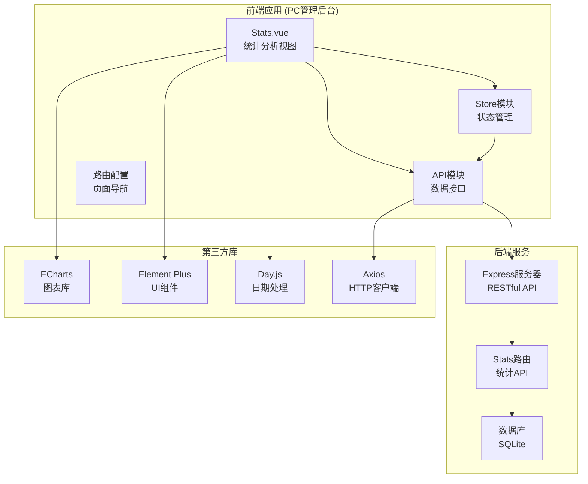

**图表来源**
- [Stats.vue:1-291](file://star-park/pc-admin/src/views/Stats.vue#L1-L291)
- [stats.js:1-182](file://star-park/server/src/routes/stats.js#L1-L182)
- [index.js:1-56](file://star-park/pc-admin/src/api/index.js#L1-L56)

**章节来源**
- [Stats.vue:1-291](file://star-park/pc-admin/src/views/Stats.vue#L1-L291)
- [index.js:1-67](file://star-park/pc-admin/src/router/index.js#L1-L67)

## 核心组件

### Stats视图组件

Stats视图组件是整个统计分析功能的核心，采用了现代化的Vue 3 Composition API设计模式。组件主要包含以下核心功能：

#### 主要特性
- **实时数据加载**：自动获取并显示统计数据
- **多图表展示**：支持热力图和趋势图两种可视化方式
- **动态筛选**：支持按孩子进行数据筛选
- **响应式设计**：适配不同屏幕尺寸
- **错误处理**：完善的异常处理机制

#### 关键数据结构
组件使用响应式数据管理统计信息：

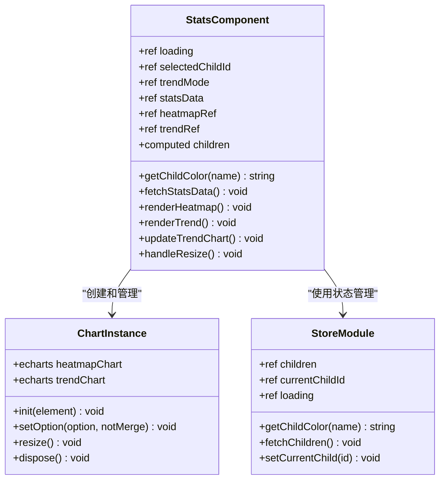

**图表来源**
- [Stats.vue:39-264](file://star-park/pc-admin/src/views/Stats.vue#L39-L264)
- [app.js:1-62](file://star-park/pc-admin/src/stores/app.js#L1-L62)

**章节来源**
- [Stats.vue:39-264](file://star-park/pc-admin/src/views/Stats.vue#L39-L264)

## 架构概览

### 前后端通信架构

系统采用RESTful API设计，前后端通过HTTP协议进行通信：

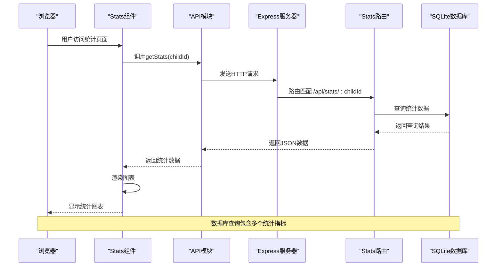

**图表来源**
- [Stats.vue:68-82](file://star-park/pc-admin/src/views/Stats.vue#L68-L82)
- [index.js:42-42](file://star-park/pc-admin/src/api/index.js#L42-L42)
- [stats.js:6-101](file://star-park/server/src/routes/stats.js#L6-L101)

### 数据流架构

统计分析的数据流从数据库查询到前端渲染形成了完整的技术链路：

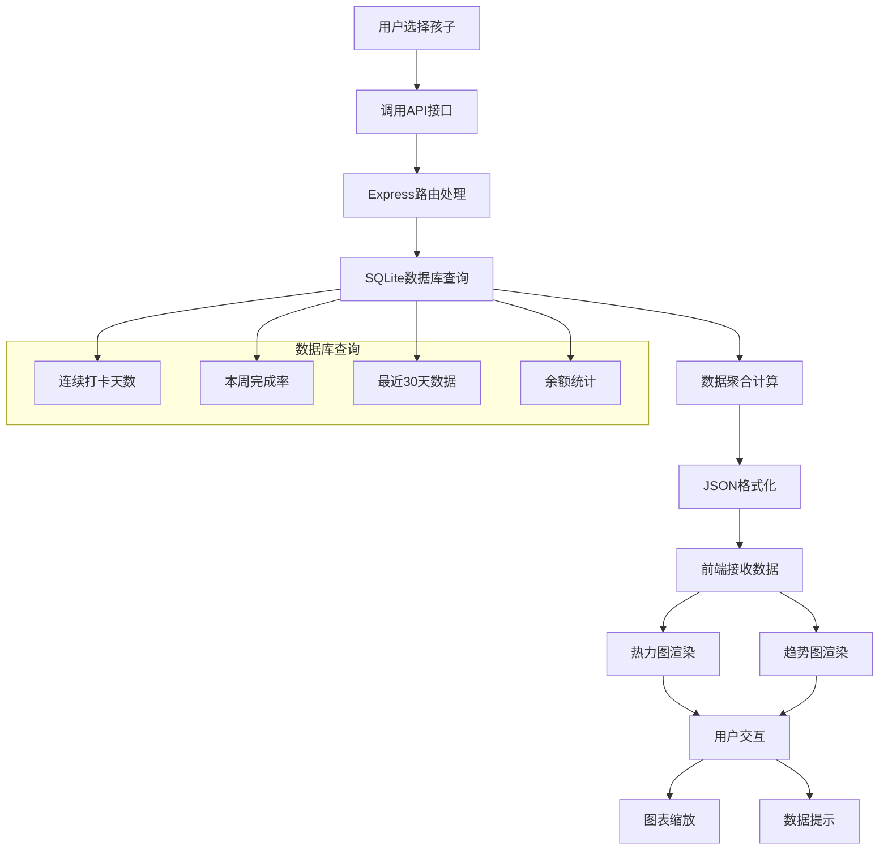

**图表来源**
- [stats.js:17-97](file://star-park/server/src/routes/stats.js#L17-L97)
- [Stats.vue:85-242](file://star-park/pc-admin/src/views/Stats.vue#L85-L242)

**章节来源**
- [stats.js:1-182](file://star-park/server/src/routes/stats.js#L1-L182)

## 详细组件分析

### ECharts集成与配置

#### 热力图实现

热力图是Stats组件的核心可视化元素，用于展示最近30天的打卡情况：

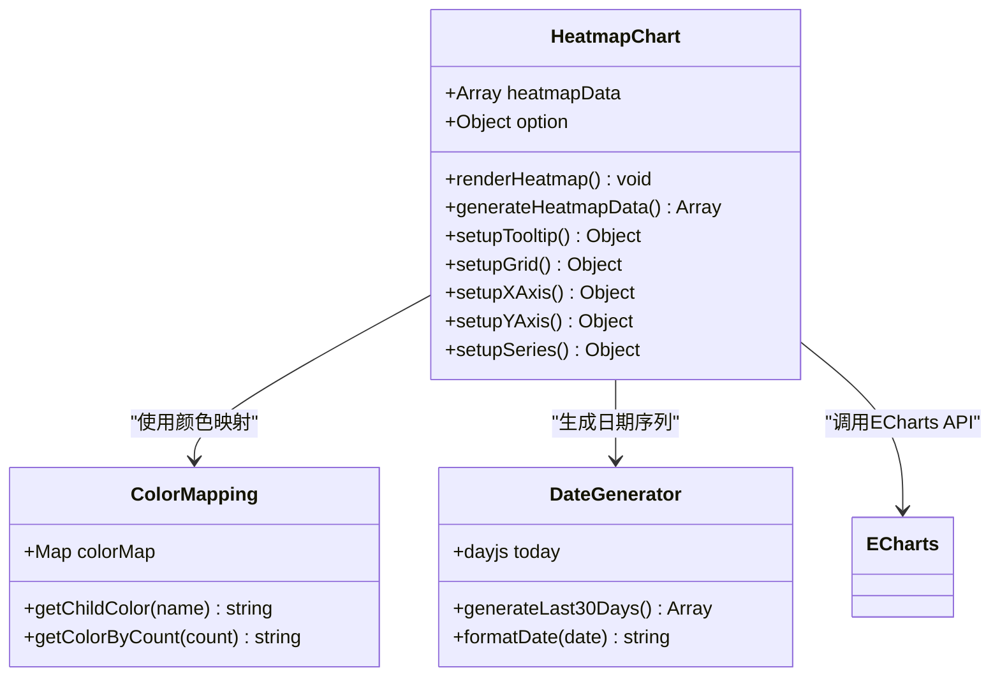

**图表来源**
- [Stats.vue:85-151](file://star-park/pc-admin/src/views/Stats.vue#L85-L151)

热力图的关键配置包括：
- **数据格式**：二维数组，包含日期和对应的打卡次数
- **颜色方案**：根据打卡次数动态调整颜色深浅
- **交互功能**：鼠标悬停显示详细信息
- **响应式布局**：自适应容器尺寸变化

#### 完成率趋势图

完成率趋势图展示了特定时间段内的完成率变化情况：

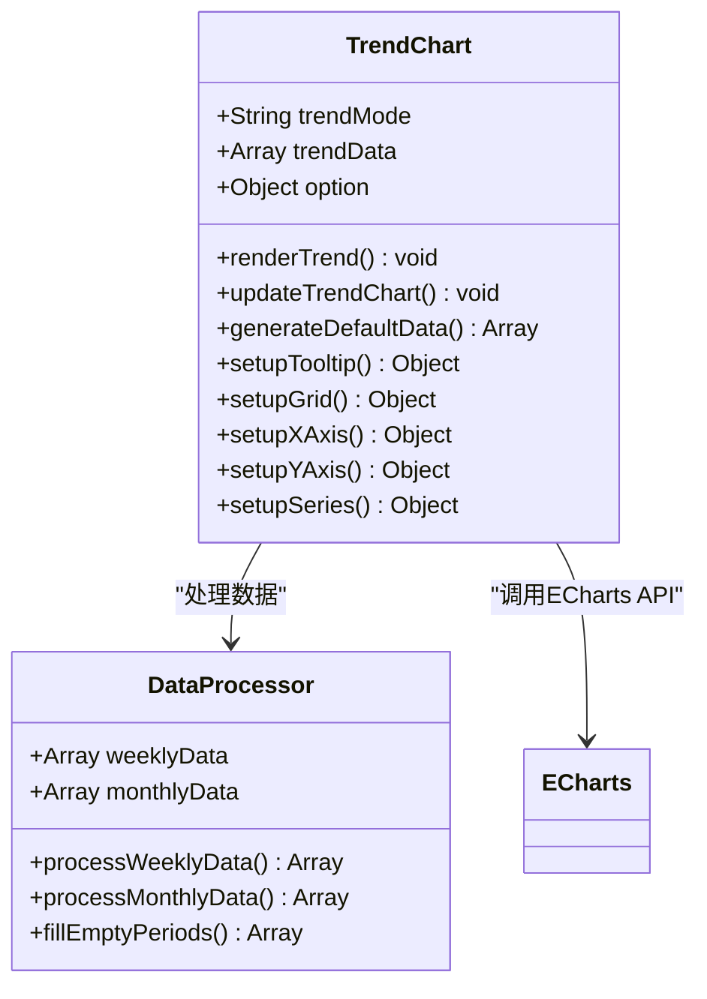

**图表来源**
- [Stats.vue:154-242](file://star-park/pc-admin/src/views/Stats.vue#L154-L242)

趋势图的主要特性：
- **双模式切换**：支持按周和按月两种时间粒度
- **平滑曲线**：使用贝塞尔曲线连接数据点
- **渐变填充**：面积图的半透明渐变效果
- **动态标签**：根据时间粒度自动调整坐标轴标签

**章节来源**
- [Stats.vue:85-242](file://star-park/pc-admin/src/views/Stats.vue#L85-L242)

### 数据聚合算法

#### 连续打卡统计算法

连续打卡天数的计算是统计系统的核心算法之一：

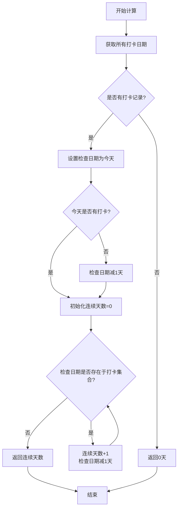

**图表来源**
- [stats.js:17-36](file://star-park/server/src/routes/stats.js#L17-L36)

算法特点：
- **时间复杂度**：O(n)，其中n为历史记录数量
- **空间复杂度**：O(n)，用于存储日期集合
- **边界处理**：正确处理今天无打卡的情况
- **性能优化**：使用Set数据结构提高查找效率

#### 本周完成率计算

本周完成率是衡量孩子行为习惯的重要指标：

```mermaid
flowchart TD
A[开始计算] --> B[计算本周起止日期]
B --> C[获取活跃任务数量]
C --> D[计算应打卡天数]
D --> E[查询本周完成的打卡数量]
E --> F{应打卡天数>0?}
F --> |否| G[返回0%]
F --> |是| H[计算完成率=(完成数/应打卡数)*100]
H --> I[四舍五入到整数]
I --> J[返回完成率]
G --> J
```

**图表来源**
- [stats.js:38-56](file://star-park/server/src/routes/stats.js#L38-L56)

计算逻辑：
- **应打卡天数**：活跃任务数 × 本周已过的天数
- **完成数**：本周内已完成的打卡记录
- **完成率**：完成数占应打卡数的比例

#### 最近30天数据聚合

最近30天的数据聚合确保了图表的完整性：

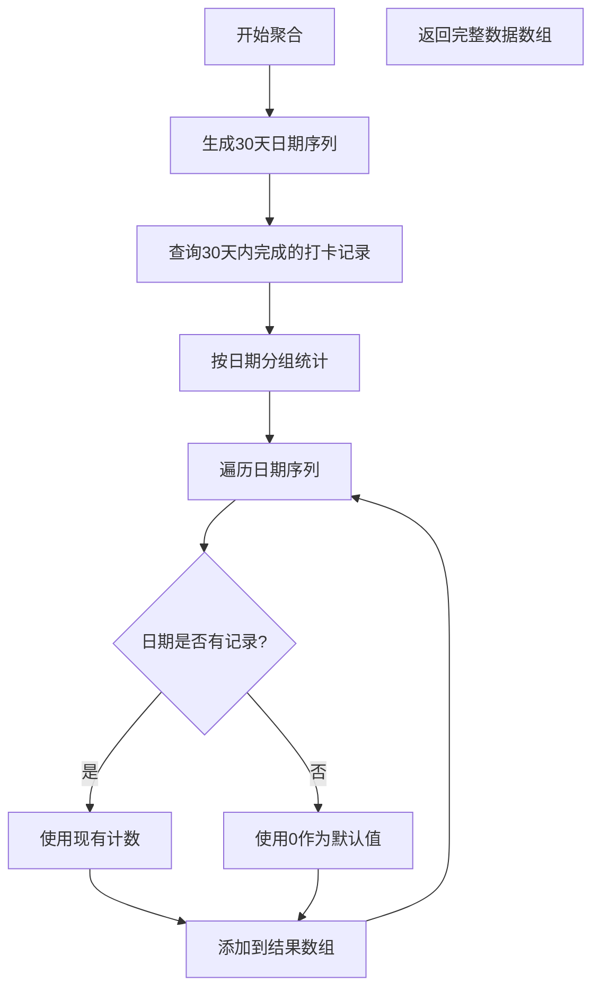

**图表来源**
- [stats.js:58-77](file://star-park/server/src/routes/stats.js#L58-L77)

**章节来源**
- [stats.js:17-97](file://star-park/server/src/routes/stats.js#L17-L97)

### 图表渲染机制

#### ECharts实例管理

组件对ECharts实例进行了封装和管理：

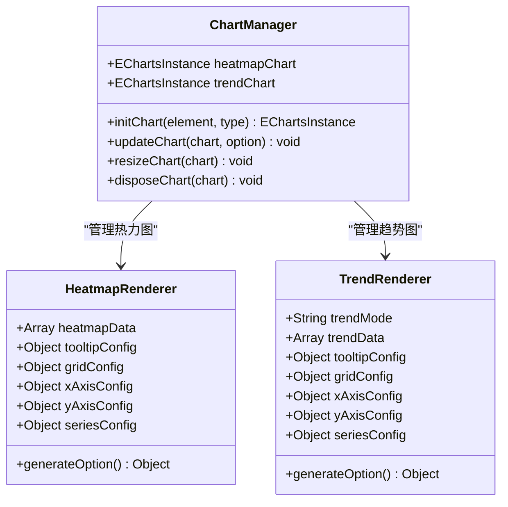

**图表来源**
- [Stats.vue:85-242](file://star-park/pc-admin/src/views/Stats.vue#L85-L242)

渲染流程：
1. **初始化**：创建ECharts实例并绑定DOM元素
2. **配置**：设置图表选项和样式
3. **渲染**：调用setOption方法绘制图表
4. **更新**：数据变化时重新渲染
5. **销毁**：组件卸载时释放资源

#### 响应式适配

组件实现了完整的响应式适配机制：

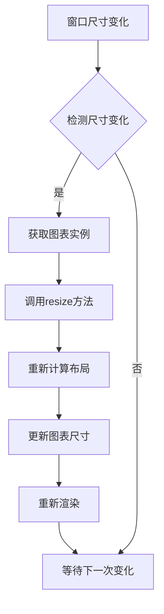

**图表来源**
- [Stats.vue:244-248](file://star-park/pc-admin/src/views/Stats.vue#L244-L248)

**章节来源**
- [Stats.vue:85-248](file://star-park/pc-admin/src/views/Stats.vue#L85-L248)

### 数据可视化配置

#### 折线图配置

完成率趋势图使用折线图展示数据变化：

| 配置项 | 值 | 说明 |
|--------|-----|------|
| 图表类型 | line | 折线图 |
| 平滑曲线 | true | 使用贝塞尔曲线 |
| 数据点 | circle | 圆形标记点 |
| 线条宽度 | 3px | 线条粗细 |
| 填充颜色 | 渐变色 | 半透明渐变效果 |
| 坐标轴 | category/value | 时间轴和数值轴 |

#### 柱状图配置

热力图使用柱状图展示每日数据：

| 配置项 | 值 | 说明 |
|--------|-----|------|
| 图表类型 | bar | 柱状图 |
| 数据点 | 30个 | 最近30天 |
| 颜色映射 | 动态 | 根据打卡次数着色 |
| 圆角 | 4px | 柱子顶部圆角 |
| 宽度 | 60% | 柱子宽度比例 |

#### 颜色系统

组件实现了统一的颜色管理系统：

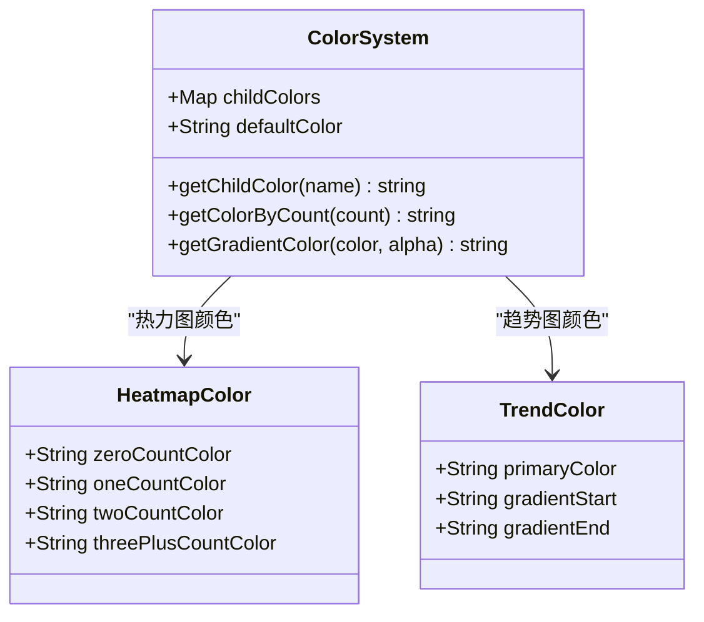

**图表来源**
- [Stats.vue:59-66](file://star-park/pc-admin/src/views/Stats.vue#L59-L66)

**章节来源**
- [Stats.vue:59-66](file://star-park/pc-admin/src/views/Stats.vue#L59-L66)

## 依赖关系分析

### 前端依赖

Stats组件依赖于多个关键的前端库：

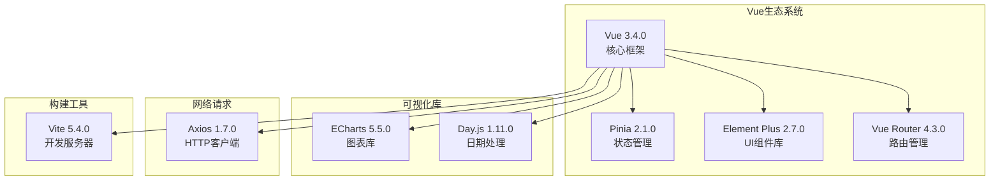

**图表来源**
- [package.json:11-24](file://star-park/pc-admin/package.json#L11-L24)

### 后端依赖

后端服务同样依赖于精简而高效的库组合：

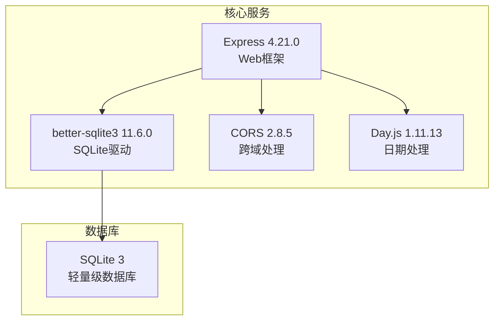

**图表来源**
- [package.json:8-13](file://star-park/server/package.json#L8-L13)

### 数据库设计

系统采用SQLite作为数据存储，设计简洁高效：

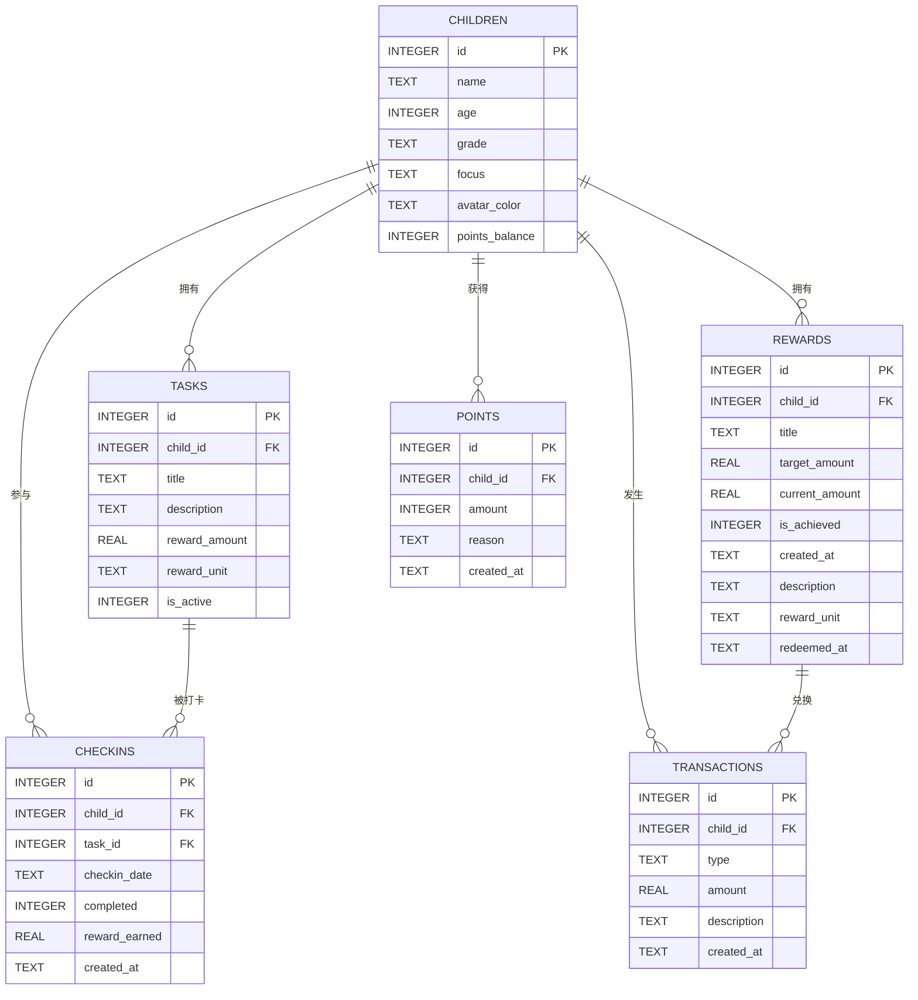

**图表来源**
- [database.js:18-80](file://star-park/server/src/database.js#L18-L80)

**章节来源**
- [package.json:11-24](file://star-park/pc-admin/package.json#L11-L24)
- [package.json:8-13](file://star-park/server/package.json#L8-L13)
- [database.js:18-80](file://star-park/server/src/database.js#L18-L80)

## 性能考虑

### 前端性能优化

#### 内存管理
- **图表实例复用**：避免频繁创建和销毁ECharts实例
- **事件监听器清理**：组件卸载时移除窗口resize事件
- **数据缓存策略**：合理使用nextTick确保DOM更新完成

#### 渲染优化
- **懒加载**：图表在需要时才进行渲染
- **防抖处理**：窗口resize事件的节流处理
- **虚拟滚动**：对于大量数据的场景可考虑虚拟滚动

### 后端性能优化

#### 数据库优化
- **索引设计**：为常用查询字段建立索引
- **查询优化**：使用预编译语句减少SQL解析开销
- **连接池**：SQLite的WAL模式提升并发性能

#### 缓存策略
- **查询结果缓存**：对于不频繁变化的数据可考虑缓存
- **API响应缓存**：合理设置缓存头信息

## 故障排除指南

### 常见问题及解决方案

#### 图表不显示问题
1. **检查DOM元素是否存在**
   - 确保ref绑定的DOM元素已正确渲染
   - 验证容器的width和height属性

2. **验证ECharts初始化**
   - 确认ECharts库已正确引入
   - 检查图表实例是否成功创建

#### 数据加载失败
1. **API请求检查**
   - 验证API端点URL格式
   - 检查网络请求状态码

2. **错误处理机制**
   - 查看控制台错误日志
   - 实现重试机制和降级策略

#### 性能问题
1. **内存泄漏排查**
   - 检查事件监听器是否正确清理
   - 验证图表实例是否正确销毁

2. **渲染性能优化**
   - 考虑数据分页加载
   - 实现虚拟滚动技术

**章节来源**
- [Stats.vue:77-81](file://star-park/pc-admin/src/views/Stats.vue#L77-L81)
- [Stats.vue:259-263](file://star-park/pc-admin/src/views/Stats.vue#L259-L263)

## 结论

StarParadise Stats统计分析视图组件是一个功能完善、架构清晰的数据可视化解决方案。通过合理的前后端分离设计、高效的ECharts集成和严谨的数据聚合算法，为用户提供了直观、实时的统计分析体验。

### 主要优势

1. **用户体验优秀**：响应式设计适配各种设备，交互流畅自然
2. **技术栈先进**：采用Vue 3最新特性和最佳实践
3. **性能表现优异**：合理的内存管理和渲染优化
4. **扩展性强**：模块化设计便于功能扩展和维护

### 技术亮点

- **ECharts深度集成**：充分利用图表库的强大功能
- **数据聚合算法**：精确计算各项统计指标
- **状态管理**：使用Pinia实现高效的状态管理
- **错误处理**：完善的异常处理和用户反馈机制

该组件为StarParadise项目提供了坚实的数据分析基础，为后续的功能扩展和业务发展奠定了良好的技术基础。