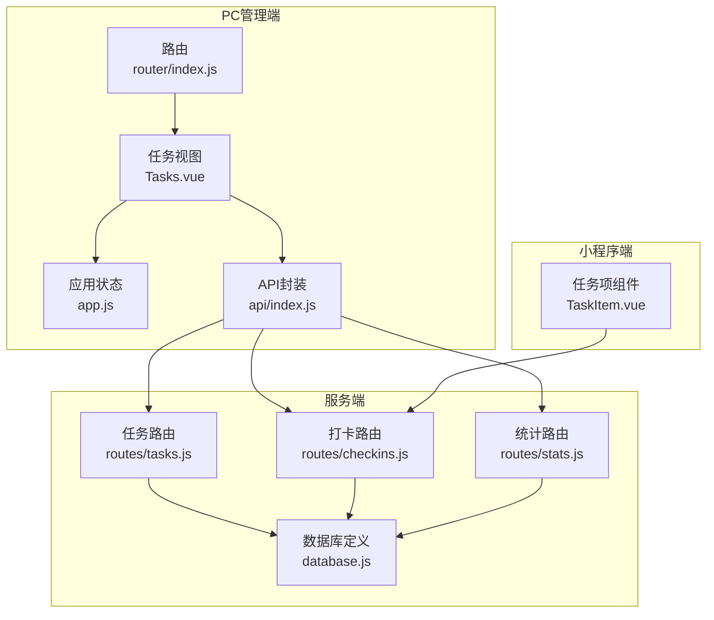
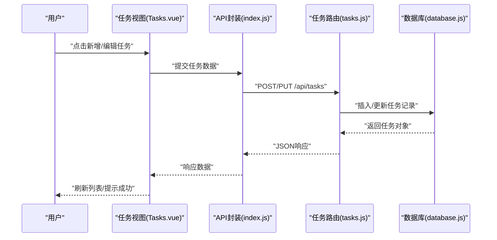
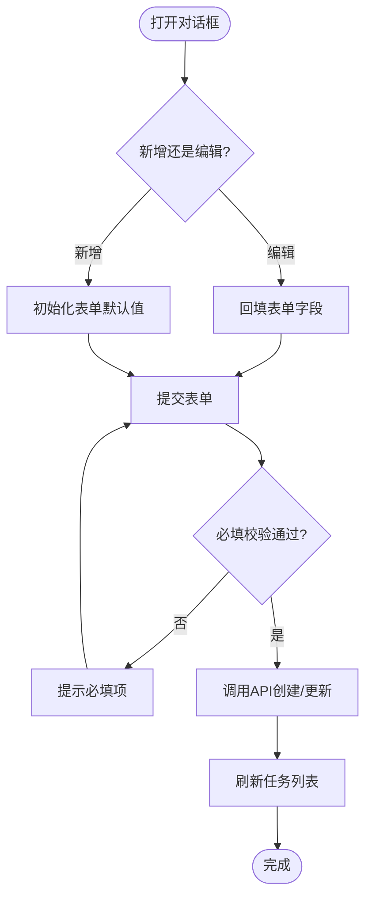
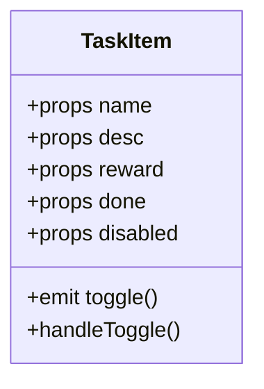
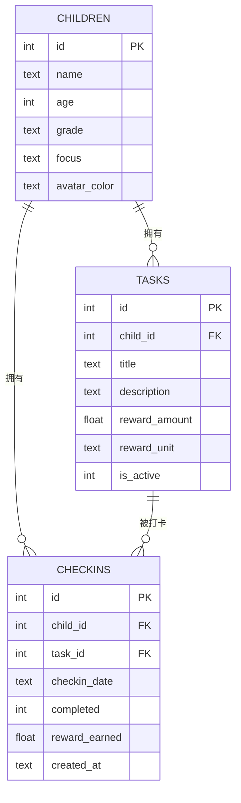
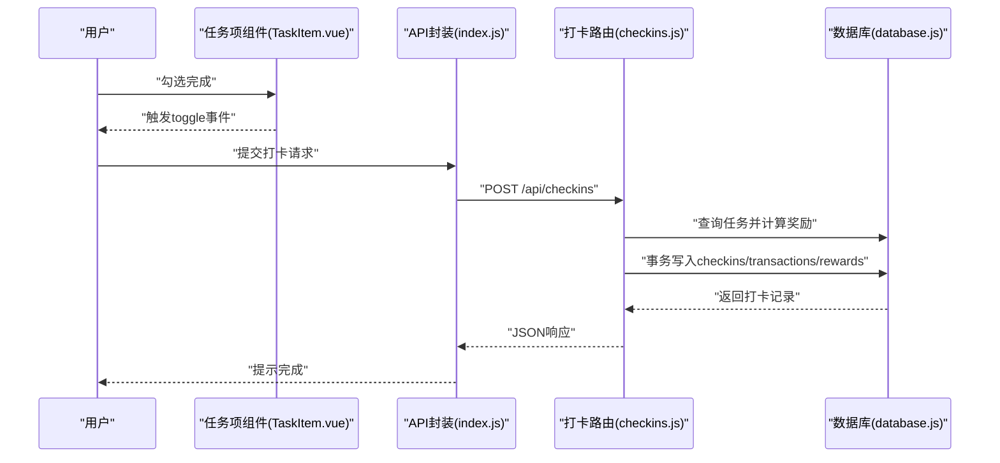
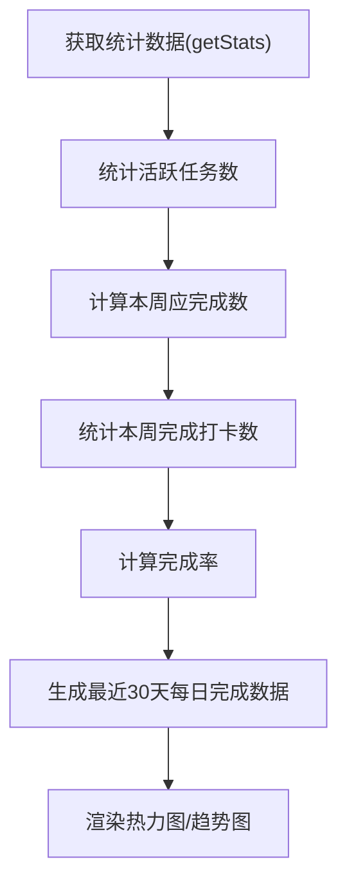
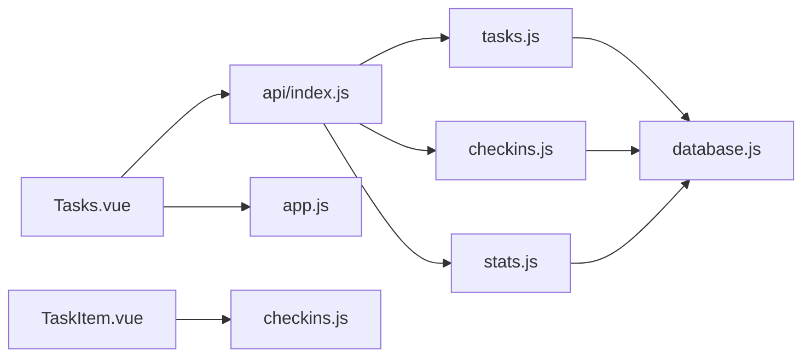

# 任务管理

<cite>
**本文引用的文件**
- [Tasks.vue](file://star-park/pc-admin/src/views/Tasks.vue)
- [TaskItem.vue](file://star-park/miniprogram/src/components/TaskItem.vue)
- [index.js（PC端API）](file://star-park/pc-admin/src/api/index.js)
- [tasks.js（服务端路由）](file://star-park/server/src/routes/tasks.js)
- [database.js（数据库定义）](file://star-park/server/src/database.js)
- [checkins.js（服务端路由）](file://star-park/server/src/routes/checkins.js)
- [stats.js（服务端路由）](file://star-park/server/src/routes/stats.js)
- [Stats.vue](file://star-park/pc-admin/src/views/Stats.vue)
- [router/index.js（PC端路由）](file://star-park/pc-admin/src/router/index.js)
- [app.js（Pinia应用状态）](file://star-park/pc-admin/src/stores/app.js)
</cite>

## 目录
1. [简介](#简介)
2. [项目结构](#项目结构)
3. [核心组件](#核心组件)
4. [架构总览](#架构总览)
5. [详细组件分析](#详细组件分析)
6. [依赖关系分析](#依赖关系分析)
7. [性能考虑](#性能考虑)
8. [故障排查指南](#故障排查指南)
9. [结论](#结论)
10. [附录](#附录)

## 简介
本文件面向“任务管理”视图组件，系统性阐述任务管理的完整生命周期：创建、分配、编辑、删除、状态跟踪；界面设计：任务列表展示、任务详情查看、批量操作支持；任务状态管理：启用/停用切换逻辑；任务分配机制：孩子选择、奖励金额与单位；任务搜索与过滤：按孩子筛选；统计功能：完成率、热力图、趋势；以及与“打卡系统”的集成：任务完成如何影响打卡与奖励累计。

## 项目结构
- PC管理端采用Vue 3 + Element Plus，任务管理位于“任务管理”页面，使用表格展示任务列表，支持按孩子分页签筛选。
- 小程序端提供任务项组件，用于展示单个任务条目，支持勾选完成与禁用态。
- 服务端基于Express + better-sqlite3，提供任务、打卡、统计等接口。
- 统计页面提供完成率与热力图可视化，便于家长观察孩子完成趋势。

图表来源
- [router/index.js:1-67](file://star-park/pc-admin/src/router/index.js#L1-L67)
- [Tasks.vue:1-265](file://star-park/pc-admin/src/views/Tasks.vue#L1-L265)
- [app.js:1-62](file://star-park/pc-admin/src/stores/app.js#L1-L62)
- [index.js（PC端API）:1-56](file://star-park/pc-admin/src/api/index.js#L1-L56)
- [tasks.js（服务端路由）:1-91](file://star-park/server/src/routes/tasks.js#L1-L91)
- [checkins.js（服务端路由）:1-90](file://star-park/server/src/routes/checkins.js#L1-L90)
- [stats.js（服务端路由）:1-182](file://star-park/server/src/routes/stats.js#L1-L182)
- [database.js:1-111](file://star-park/server/src/database.js#L1-L111)

章节来源
- [router/index.js:1-67](file://star-park/pc-admin/src/router/index.js#L1-L67)
- [Tasks.vue:1-265](file://star-park/pc-admin/src/views/Tasks.vue#L1-L265)
- [app.js:1-62](file://star-park/pc-admin/src/stores/app.js#L1-L62)
- [index.js（PC端API）:1-56](file://star-park/pc-admin/src/api/index.js#L1-L56)
- [tasks.js（服务端路由）:1-91](file://star-park/server/src/routes/tasks.js#L1-L91)
- [checkins.js（服务端路由）:1-90](file://star-park/server/src/routes/checkins.js#L1-L90)
- [stats.js（服务端路由）:1-182](file://star-park/server/src/routes/stats.js#L1-L182)
- [database.js:1-111](file://star-park/server/src/database.js#L1-L111)

## 核心组件
- 任务管理视图（PC端）：负责任务的增删改查、按孩子筛选、启用/停用切换、对话框表单提交。
- 任务项组件（小程序端）：负责单个任务的勾选完成、禁用态显示、奖励展示。
- 应用状态（Pinia）：维护孩子列表与当前选中孩子，供任务视图与统计视图共享。
- API封装：统一请求基础路径、响应拦截、任务/打卡/统计等接口方法。
- 服务端路由：提供任务、打卡、统计接口，含数据库事务与约束校验。
- 数据库定义：定义children、tasks、checkins、rewards、transactions、points等表及迁移。

章节来源
- [Tasks.vue:1-265](file://star-park/pc-admin/src/views/Tasks.vue#L1-L265)
- [TaskItem.vue:1-133](file://star-park/miniprogram/src/components/TaskItem.vue#L1-L133)
- [app.js:1-62](file://star-park/pc-admin/src/stores/app.js#L1-L62)
- [index.js（PC端API）:1-56](file://star-park/pc-admin/src/api/index.js#L1-L56)
- [tasks.js（服务端路由）:1-91](file://star-park/server/src/routes/tasks.js#L1-L91)
- [database.js:1-111](file://star-park/server/src/database.js#L1-L111)

## 架构总览
任务管理贯穿“前端视图—API封装—服务端路由—数据库”的链路，并与“打卡系统”和“统计系统”形成闭环：任务创建后进入“打卡系统”，完成打卡触发奖励累计与统计更新。

图表来源
- [Tasks.vue:160-190](file://star-park/pc-admin/src/views/Tasks.vue#L160-L190)
- [index.js（PC端API）:25-28](file://star-park/pc-admin/src/api/index.js#L25-L28)
- [tasks.js（服务端路由）:21-36](file://star-park/server/src/routes/tasks.js#L21-L36)
- [database.js:28-37](file://star-park/server/src/database.js#L28-L37)

## 详细组件分析

### 任务管理视图（PC端）
- 视图职责
  - 展示任务列表：任务名、描述、奖励金额与单位、启用/停用状态、操作列（编辑、删除）。
  - 孩子分页签：按不同孩子筛选任务。
  - 对话框表单：新增/编辑任务，包含所属孩子、任务名、描述、奖励金额、奖励单位、是否启用。
- 关键交互
  - 打开对话框：区分新增与编辑，编辑时回填表单。
  - 提交表单：校验必填项，调用API创建或更新任务，成功后刷新列表。
  - 删除任务：二次确认，调用API删除，删除时执行事务清理关联打卡记录。
- 状态与数据流
  - 使用Pinia应用状态存储孩子列表，初始化时加载并设置默认选中。
  - 过滤逻辑：通过计算属性按当前选中的孩子ID过滤任务列表。
- 错误处理
  - 表单校验失败给出提示；API错误统一捕获并输出日志。

图表来源
- [Tasks.vue:133-190](file://star-park/pc-admin/src/views/Tasks.vue#L133-L190)
- [Tasks.vue:203-230](file://star-park/pc-admin/src/views/Tasks.vue#L203-L230)

章节来源
- [Tasks.vue:1-265](file://star-park/pc-admin/src/views/Tasks.vue#L1-L265)
- [app.js:30-44](file://star-park/pc-admin/src/stores/app.js#L30-L44)

### 任务项组件（小程序端）
- 组件职责
  - 展示任务名称、描述、奖励，支持勾选完成与禁用态样式。
  - 通过事件向上抛出勾选动作，由父组件决定后续处理（如调用打卡接口）。
- 样式与交互
  - 勾选框：选中态变色、禁用态半透明。
  - 文字样式：完成态带删除线，奖励文字在完成态变浅色。
- 适用场景
  - 家长辅助孩子完成任务时，直接在小程序端勾选完成，触发打卡流程。

图表来源
- [TaskItem.vue:21-36](file://star-park/miniprogram/src/components/TaskItem.vue#L21-L36)

章节来源
- [TaskItem.vue:1-133](file://star-park/miniprogram/src/components/TaskItem.vue#L1-L133)

### 服务端任务路由与数据库
- 路由能力
  - 查询任务：支持按child_id筛选；未提供按状态筛选参数。
  - 创建任务：校验必填字段，写入奖励金额与单位，默认启用。
  - 更新任务：支持部分字段更新，含启用状态字段。
  - 删除任务：事务删除任务及其关联打卡记录。
- 数据模型
  - 任务表包含：child_id、title、description、reward_amount、reward_unit、is_active。
  - 外键约束：child_id 引用 children 表。

图表来源
- [database.js:18-80](file://star-park/server/src/database.js#L18-L80)
- [tasks.js（服务端路由）:5-88](file://star-park/server/src/routes/tasks.js#L5-L88)

章节来源
- [tasks.js（服务端路由）:1-91](file://star-park/server/src/routes/tasks.js#L1-L91)
- [database.js:1-111](file://star-park/server/src/database.js#L1-L111)

### 打卡系统与任务完成联动
- 打卡接口
  - 创建打卡：校验必填字段，读取任务奖励金额，若完成则向交易表写入收入记录，并更新所有未达成奖励目标的累计金额与达成状态。
  - 查询打卡：支持按日期与孩子筛选。
- 与任务的关系
  - 任务完成后产生打卡记录，进而影响余额与奖励目标进度。
- 事务保证
  - 打卡写入、交易记录、奖励目标更新在同一事务内完成，确保一致性。

图表来源
- [TaskItem.vue:32-35](file://star-park/miniprogram/src/components/TaskItem.vue#L32-L35)
- [index.js（PC端API）:31-32](file://star-park/pc-admin/src/api/index.js#L31-L32)
- [checkins.js（服务端路由）:30-87](file://star-park/server/src/routes/checkins.js#L30-L87)
- [database.js:39-79](file://star-park/server/src/database.js#L39-L79)

章节来源
- [checkins.js（服务端路由）:1-90](file://star-park/server/src/routes/checkins.js#L1-L90)
- [database.js:1-111](file://star-park/server/src/database.js#L1-L111)

### 统计系统与任务完成率
- 统计接口
  - 按孩子统计：连续打卡天数、本周完成率、活跃任务数、余额、最近30天每日完成情况。
  - 仪表盘接口：汇总所有孩子当日打卡、活跃任务、连续打卡、完成率、余额、奖励目标等。
- 与任务的关系
  - 完成率 = 实际完成打卡数 / 本周应完成数（活跃任务数 × 本周已过天数），用于衡量任务完成效果。
  - 最近30天每日完成情况用于生成热力图与趋势图。

图表来源
- [stats.js（服务端路由）:6-101](file://star-park/server/src/routes/stats.js#L6-L101)
- [Stats.vue:68-82](file://star-park/pc-admin/src/views/Stats.vue#L68-L82)

章节来源
- [stats.js（服务端路由）:1-182](file://star-park/server/src/routes/stats.js#L1-L182)
- [Stats.vue:1-291](file://star-park/pc-admin/src/views/Stats.vue#L1-L291)

## 依赖关系分析
- 前端依赖
  - Tasks.vue 依赖 Pinia 应用状态（获取孩子列表）、API封装（任务/打卡/统计接口）、Element Plus UI组件。
  - TaskItem.vue 依赖父组件传递的属性与事件，独立于后端实现。
- 后端依赖
  - 任务路由依赖数据库定义，提供任务的CRUD与删除事务。
  - 打卡路由依赖任务表与交易表，更新奖励目标。
  - 统计路由依赖打卡与任务表，计算完成率与热力图数据。
- 路由与页面
  - 路由配置将“任务管理”页面挂载到固定路径，便于导航访问。

图表来源
- [Tasks.vue:98-102](file://star-park/pc-admin/src/views/Tasks.vue#L98-L102)
- [TaskItem.vue:30-35](file://star-park/miniprogram/src/components/TaskItem.vue#L30-L35)
- [index.js（PC端API）:25-42](file://star-park/pc-admin/src/api/index.js#L25-L42)
- [tasks.js（服务端路由）:1-91](file://star-park/server/src/routes/tasks.js#L1-L91)
- [checkins.js（服务端路由）:1-90](file://star-park/server/src/routes/checkins.js#L1-L90)
- [stats.js（服务端路由）:1-182](file://star-park/server/src/routes/stats.js#L1-L182)
- [database.js:1-111](file://star-park/server/src/database.js#L1-L111)

章节来源
- [router/index.js:28-33](file://star-park/pc-admin/src/router/index.js#L28-L33)
- [Tasks.vue:98-102](file://star-park/pc-admin/src/views/Tasks.vue#L98-L102)
- [TaskItem.vue:30-35](file://star-park/miniprogram/src/components/TaskItem.vue#L30-L35)
- [index.js（PC端API）:25-42](file://star-park/pc-admin/src/api/index.js#L25-L42)

## 性能考虑
- 前端
  - 使用计算属性过滤任务，避免重复渲染；在大量任务时建议增加分页或虚拟滚动。
  - 表格加载状态与按钮防抖，减少重复提交。
- 后端
  - SQLite启用WAL模式与外键约束，提升并发与一致性。
  - 删除任务使用事务，确保数据一致性。
  - 统计接口按需聚合，避免全表扫描；可考虑索引优化（如按child_id、checkin_date）。

## 故障排查指南
- 任务创建/更新失败
  - 检查必填字段是否为空；查看服务端返回的错误信息。
  - 确认API封装的请求体字段与服务端期望一致。
- 任务删除异常
  - 确认任务是否存在；检查删除事务是否成功清理关联打卡记录。
- 打卡失败
  - 检查任务是否存在且有效；确认请求体包含必要字段。
  - 查看交易与奖励目标更新是否在同一事务内完成。
- 统计不准确
  - 检查活跃任务数统计逻辑与本周起止日期计算。
  - 确认最近30天数据填充逻辑与日期格式一致。

章节来源
- [tasks.js（服务端路由）:24-27](file://star-park/server/src/routes/tasks.js#L24-L27)
- [tasks.js（服务端路由）:40-46](file://star-park/server/src/routes/tasks.js#L40-L46)
- [tasks.js（服务端路由）:78-84](file://star-park/server/src/routes/tasks.js#L78-L84)
- [checkins.js（服务端路由）:33-44](file://star-park/server/src/routes/checkins.js#L33-L44)
- [checkins.js（服务端路由）:48-76](file://star-park/server/src/routes/checkins.js#L48-L76)
- [stats.js（服务端路由）:42-56](file://star-park/server/src/routes/stats.js#L42-L56)

## 结论
任务管理视图提供了完整的任务生命周期管理能力：创建、分配（按孩子）、编辑、删除与状态控制；界面简洁直观，支持按孩子筛选；与打卡系统紧密耦合，完成任务即产生打卡记录并影响奖励与统计。建议后续扩展：任务状态筛选、批量操作、截止日期管理、超期提醒与任务分布分析等，以进一步完善任务管理体验。

## 附录
- 任务状态
  - 启用/停用：通过布尔字段控制任务可见与参与统计。
- 分配机制
  - 所属孩子：创建/编辑时选择，作为任务与孩子之间的关联标识。
- 奖励设置
  - 奖励金额与单位：支持数值与单位选择，用于打卡奖励与统计展示。
- 搜索与过滤
  - 当前支持按孩子筛选；可扩展按状态、截止日期等条件。
- 统计与可视化
  - 完成率、热力图、趋势图：帮助家长评估任务完成情况与持续性。