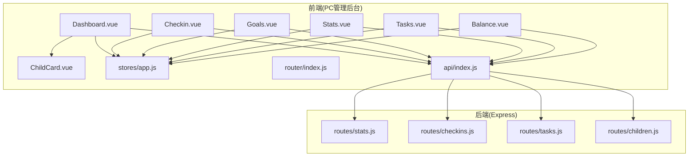
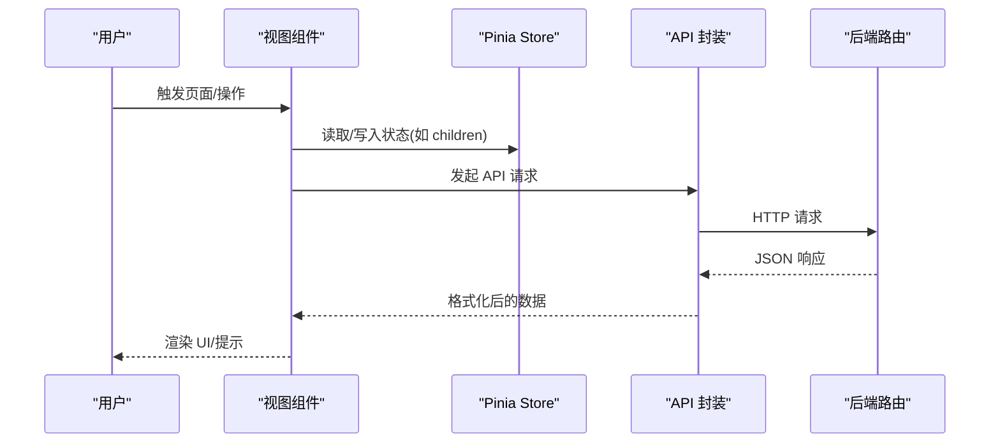
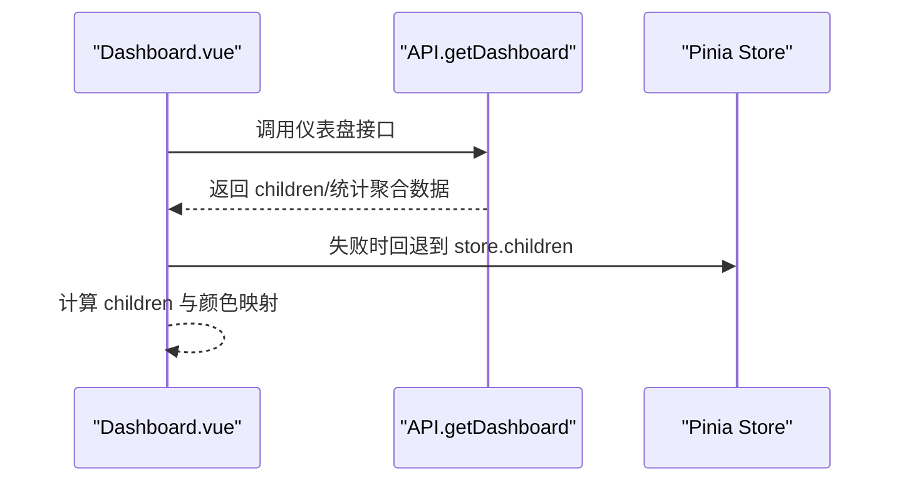
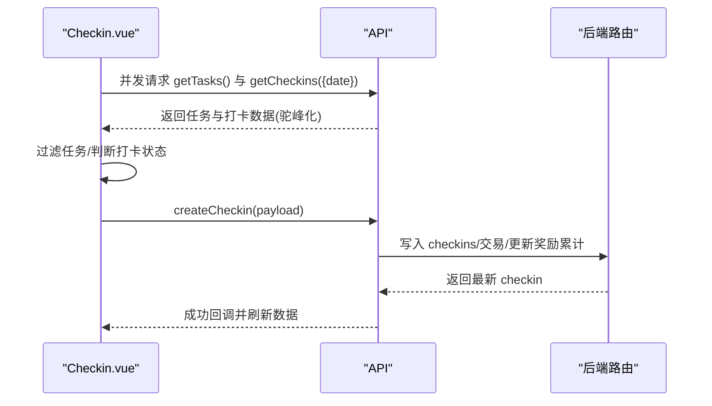
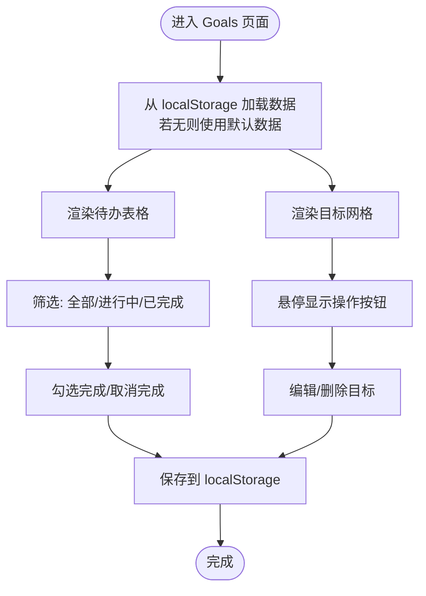
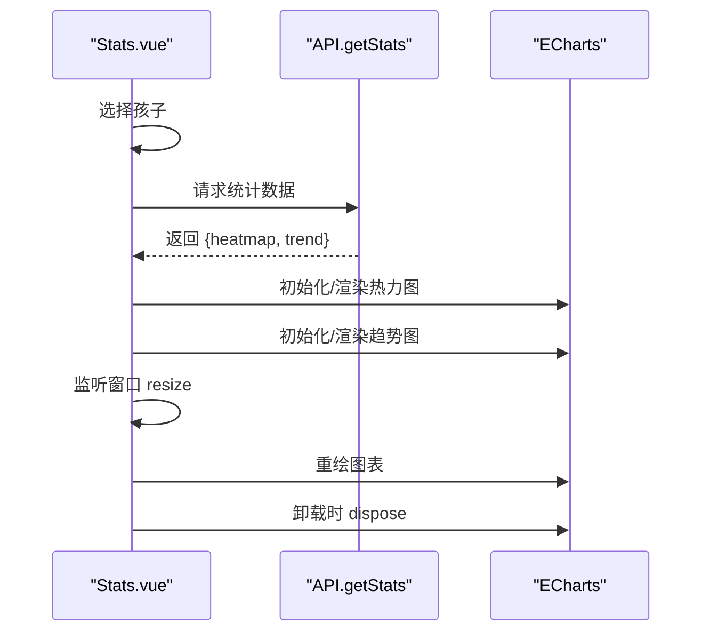
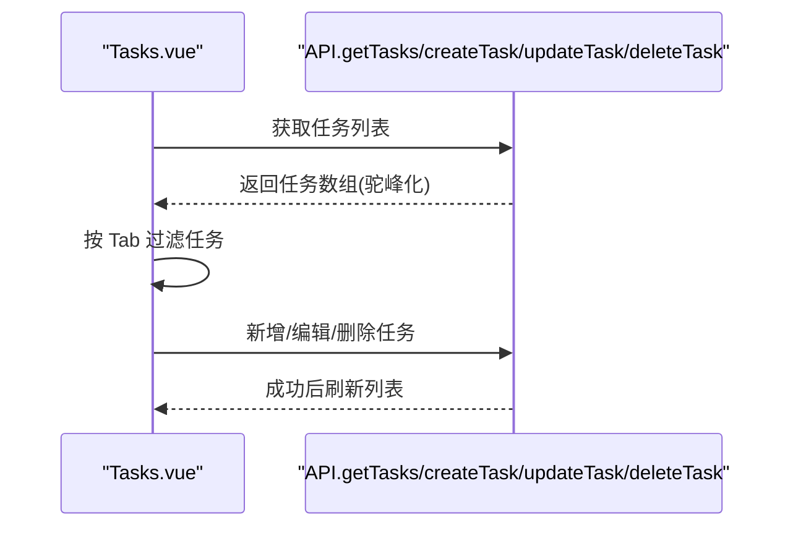
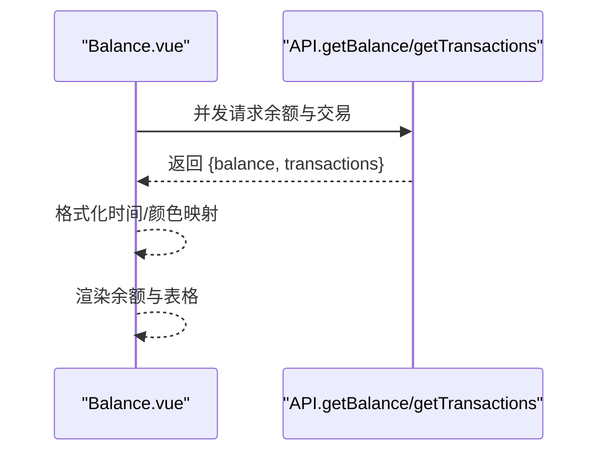
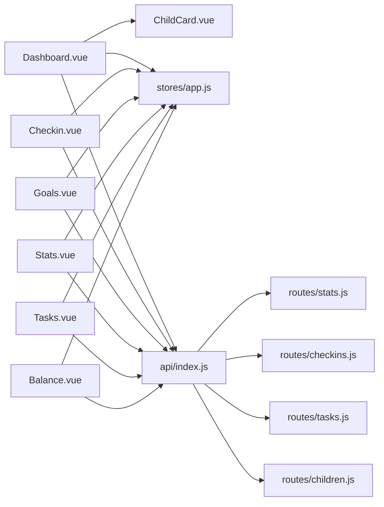
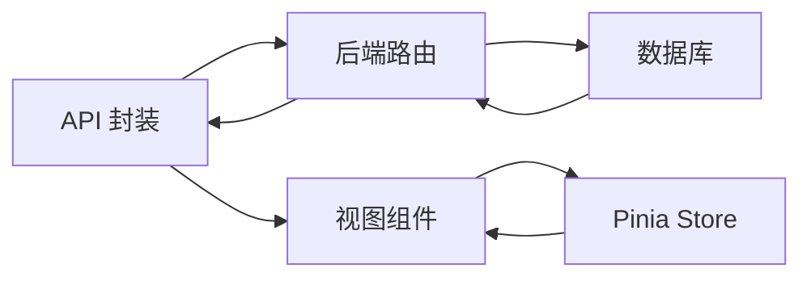

# 视图组件

<cite>
**本文引用的文件**
- [Dashboard.vue](file://star-park/pc-admin/src/views/Dashboard.vue)
- [Checkin.vue](file://star-park/pc-admin/src/views/Checkin.vue)
- [Goals.vue](file://star-park/pc-admin/src/views/Goals.vue)
- [Stats.vue](file://star-park/pc-admin/src/views/Stats.vue)
- [Tasks.vue](file://star-park/pc-admin/src/views/Tasks.vue)
- [Balance.vue](file://star-park/pc-admin/src/views/Balance.vue)
- [ChildCard.vue](file://star-park/pc-admin/src/components/ChildCard.vue)
- [api/index.js](file://star-park/pc-admin/src/api/index.js)
- [stores/app.js](file://star-park/pc-admin/src/stores/app.js)
- [router/index.js](file://star-park/pc-admin/src/router/index.js)
- [server/src/routes/stats.js](file://star-park/server/src/routes/stats.js)
- [server/src/routes/checkins.js](file://star-park/server/src/routes/checkins.js)
- [server/src/routes/tasks.js](file://star-park/server/src/routes/tasks.js)
- [server/src/routes/children.js](file://star-park/server/src/routes/children.js)
</cite>

## 目录
1. [简介](#简介)
2. [项目结构](#项目结构)
3. [核心组件](#核心组件)
4. [架构总览](#架构总览)
5. [详细组件分析](#详细组件分析)
6. [依赖关系分析](#依赖关系分析)
7. [性能考量](#性能考量)
8. [故障排查指南](#故障排查指南)
9. [结论](#结论)
10. [附录](#附录)

## 简介
本文件面向 StarParadise PC 管理后台的视图组件，系统性梳理仪表盘、每日打卡、目标与待办、统计分析、任务管理、积分与余额等视图的实现与交互。内容涵盖：
- 数据来源与处理流程（API 调用、数据格式化、图表渲染）
- 组件间通信模式（父子、兄弟、跨层级）
- 生命周期管理、错误处理与加载状态
- 复用策略、性能优化与用户体验建议
- 各视图的业务逻辑与交互设计

## 项目结构
PC 管理后台采用 Vue 3 + Pinia + Element Plus + ECharts 的前端技术栈，后端基于 Express + SQLite。视图组件位于 pc-admin/src/views，通用子组件在 components，状态管理在 stores，路由在 router，API 封装在 api。

**图表来源**
- [Dashboard.vue:1-146](file://star-park/pc-admin/src/views/Dashboard.vue#L1-L146)
- [Checkin.vue:1-417](file://star-park/pc-admin/src/views/Checkin.vue#L1-L417)
- [Goals.vue:1-686](file://star-park/pc-admin/src/views/Goals.vue#L1-L686)
- [Stats.vue:1-291](file://star-park/pc-admin/src/views/Stats.vue#L1-L291)
- [Tasks.vue:1-265](file://star-park/pc-admin/src/views/Tasks.vue#L1-L265)
- [Balance.vue:1-173](file://star-park/pc-admin/src/views/Balance.vue#L1-L173)
- [ChildCard.vue:1-161](file://star-park/pc-admin/src/components/ChildCard.vue#L1-L161)
- [stores/app.js:1-62](file://star-park/pc-admin/src/stores/app.js#L1-L62)
- [router/index.js:1-67](file://star-park/pc-admin/src/router/index.js#L1-L67)
- [api/index.js:1-56](file://star-park/pc-admin/src/api/index.js#L1-L56)
- [server/src/routes/stats.js:1-182](file://star-park/server/src/routes/stats.js#L1-L182)
- [server/src/routes/checkins.js:1-90](file://star-park/server/src/routes/checkins.js#L1-L90)
- [server/src/routes/tasks.js:1-91](file://star-park/server/src/routes/tasks.js#L1-L91)
- [server/src/routes/children.js:1-96](file://star-park/server/src/routes/children.js#L1-L96)

**章节来源**
- [router/index.js:1-67](file://star-park/pc-admin/src/router/index.js#L1-L67)
- [api/index.js:1-56](file://star-park/pc-admin/src/api/index.js#L1-L56)

## 核心组件
- Dashboard 仪表盘：聚合今日学习进度、孩子卡片、快捷入口；从后端仪表盘接口拉取数据，回退到全局状态中的孩子列表。
- Checkin 每日打卡：按日期筛选任务与打卡记录，支持完成打卡、特殊积分奖励；异步并发获取任务与打卡数据。
- Goals 目标与待办：本地持久化的目标与待办列表，支持筛选、编辑、删除、切换完成状态；目标进度可视化。
- Stats 统计分析：按孩子切换，渲染热力图与完成率趋势图；使用 ECharts，响应窗口尺寸变化。
- Tasks 任务管理：按孩子 Tab 分区展示任务，支持增删改；与后端任务接口对接。
- Balance 积分记录：按孩子切换，展示余额与交易流水；支持按 type=money 切换金钱收支表。

**章节来源**
- [Dashboard.vue:1-146](file://star-park/pc-admin/src/views/Dashboard.vue#L1-L146)
- [Checkin.vue:1-417](file://star-park/pc-admin/src/views/Checkin.vue#L1-L417)
- [Goals.vue:1-686](file://star-park/pc-admin/src/views/Goals.vue#L1-L686)
- [Stats.vue:1-291](file://star-park/pc-admin/src/views/Stats.vue#L1-L291)
- [Tasks.vue:1-265](file://star-park/pc-admin/src/views/Tasks.vue#L1-L265)
- [Balance.vue:1-173](file://star-park/pc-admin/src/views/Balance.vue#L1-L173)

## 架构总览
前后端通过统一的 API 层进行交互，前端使用 Axios 封装请求，后端提供 REST 接口。状态管理集中于 Pinia Store，路由负责页面导航与标题设置。

**图表来源**
- [api/index.js:1-56](file://star-park/pc-admin/src/api/index.js#L1-L56)
- [stores/app.js:1-62](file://star-park/pc-admin/src/stores/app.js#L1-L62)
- [router/index.js:1-67](file://star-park/pc-admin/src/router/index.js#L1-L67)

## 详细组件分析

### Dashboard 仪表盘
- 功能要点
  - 顶部欢迎信息与日期展示
  - 孩子卡片区域：ChildCard 子组件按颜色区分不同孩子
  - 快捷操作按钮跳转至打卡、任务、奖励、统计
- 数据获取与处理
  - 首次挂载调用仪表盘接口；失败时回退到全局状态中的 children
  - 支持多种数据形态（数组或带 data 字段的对象）
  - 孩子颜色映射：根据名字映射固定色值
- 生命周期与错误处理
  - onMounted 中触发数据拉取
  - try/catch 包裹请求，finally 关闭 loading
- 交互设计
  - 空态：当 loading=false 且 children 为空时显示空状态
  - 快捷按钮使用 Element Plus 图标与按钮

**图表来源**
- [Dashboard.vue:76-91](file://star-park/pc-admin/src/views/Dashboard.vue#L76-L91)
- [api/index.js:44-45](file://star-park/pc-admin/src/api/index.js#L44-L45)
- [stores/app.js:30-44](file://star-park/pc-admin/src/stores/app.js#L30-L44)

**章节来源**
- [Dashboard.vue:1-146](file://star-park/pc-admin/src/views/Dashboard.vue#L1-L146)
- [ChildCard.vue:1-161](file://star-park/pc-admin/src/components/ChildCard.vue#L1-L161)

### Checkin 每日打卡
- 功能要点
  - 日期选择器：按所选日期获取任务与打卡数据
  - 孩子分组展示任务列表，支持“完成打卡”
  - 特殊积分奖励入口：弹窗提交 child_id、amount、reason
- 数据获取与处理
  - 并发请求任务与打卡接口，统一字段命名（snake_case → camelCase）
  - 任务过滤：仅展示启用的任务
  - 打卡状态判断：根据是否存在 checkins 记录
- 交互与错误处理
  - 完成打卡后提示成功并刷新数据
  - 弹窗校验必填项，失败给出提示
  - 日期不可早于当前日期时禁用按钮
- 业务逻辑
  - 打卡成功会创建 checkins，并在完成后写入交易记录与更新奖励目标累计值

**图表来源**
- [Checkin.vue:160-221](file://star-park/pc-admin/src/views/Checkin.vue#L160-L221)
- [api/index.js:25-32](file://star-park/pc-admin/src/api/index.js#L25-L32)
- [server/src/routes/checkins.js:30-87](file://star-park/server/src/routes/checkins.js#L30-L87)

**章节来源**
- [Checkin.vue:1-417](file://star-park/pc-admin/src/views/Checkin.vue#L1-L417)
- [server/src/routes/checkins.js:1-90](file://star-park/server/src/routes/checkins.js#L1-L90)

### Goals 目标与待办
- 功能要点
  - 年度目标网格：展示状态、进度条与百分比
  - 待办表格：支持筛选（全部/进行中/已完成）、勾选完成、编辑/删除
  - 本地持久化：localStorage 存储目标与待办，提供默认数据
- 数据与状态
  - 目标：标题、状态、进度/目标
  - 待办：标题、关联目标、创建人、优先级、计划日期、完成状态
- 交互设计
  - 鼠标悬停显示编辑/删除按钮
  - 筛选标签统计数量
  - 表头加粗与圆角表格提升可读性

**图表来源**
- [Goals.vue:469-479](file://star-park/pc-admin/src/views/Goals.vue#L469-L479)
- [Goals.vue:244-354](file://star-park/pc-admin/src/views/Goals.vue#L244-L354)

**章节来源**
- [Goals.vue:1-686](file://star-park/pc-admin/src/views/Goals.vue#L1-L686)

### Stats 统计分析
- 功能要点
  - 孩子选择器：按所选孩子渲染图表
  - 热力图：最近30天每日打卡次数
  - 趋势图：按周/按月完成率趋势
- 图表渲染
  - ECharts 初始化与选项配置
  - 热力图：柱状图配色随打卡次数变化
  - 趋势图：折线图配色与渐变填充
- 生命周期与资源清理
  - resize 事件重绘
  - 组件卸载时 dispose 实例

**图表来源**
- [Stats.vue:68-82](file://star-park/pc-admin/src/views/Stats.vue#L68-L82)
- [Stats.vue:84-151](file://star-park/pc-admin/src/views/Stats.vue#L84-L151)
- [Stats.vue:153-242](file://star-park/pc-admin/src/views/Stats.vue#L153-L242)
- [server/src/routes/stats.js:6-101](file://star-park/server/src/routes/stats.js#L6-L101)

**章节来源**
- [Stats.vue:1-291](file://star-park/pc-admin/src/views/Stats.vue#L1-L291)
- [server/src/routes/stats.js:1-182](file://star-park/server/src/routes/stats.js#L1-L182)

### Tasks 任务管理
- 功能要点
  - 孩子 Tab 分区：按 childId 过滤任务
  - 表格列：名称、描述、奖励金额/单位、状态、操作
  - 对话框：新增/编辑任务，含启用开关
- 数据获取与处理
  - 任务列表统一字段命名（snake_case → camelCase）
  - 启用状态映射：is_active → enabled
- 交互与错误处理
  - 表单必填校验，成功提示并刷新列表
  - 删除使用二次确认弹窗

**图表来源**
- [Tasks.vue:203-230](file://star-park/pc-admin/src/views/Tasks.vue#L203-L230)
- [api/index.js:24-28](file://star-park/pc-admin/src/api/index.js#L24-L28)
- [server/src/routes/tasks.js:5-91](file://star-park/server/src/routes/tasks.js#L5-L91)

**章节来源**
- [Tasks.vue:1-265](file://star-park/pc-admin/src/views/Tasks.vue#L1-L265)
- [server/src/routes/tasks.js:1-91](file://star-park/server/src/routes/tasks.js#L1-L91)

### Balance 积分记录
- 功能要点
  - 孩子选择器：切换后获取余额与交易流水
  - 余额展示：动态背景色与边框色
  - 流水表格：时间、类型、金额、说明
- 数据获取与处理
  - 并发请求余额与交易接口
  - 交易类型映射：earn/spend
- 交互设计
  - 时间格式化显示
  - 表头加粗与圆角表格

**图表来源**
- [Balance.vue:88-113](file://star-park/pc-admin/src/views/Balance.vue#L88-L113)
- [api/index.js:47-53](file://star-park/pc-admin/src/api/index.js#L47-L53)
- [server/src/routes/children.js:56-93](file://star-park/server/src/routes/children.js#L56-L93)

**章节来源**
- [Balance.vue:1-173](file://star-park/pc-admin/src/views/Balance.vue#L1-L173)
- [server/src/routes/children.js:1-96](file://star-park/server/src/routes/children.js#L1-L96)

## 依赖关系分析
- 组件耦合
  - Dashboard 依赖 ChildCard 子组件与 Pinia Store
  - Checkin/Stats/Tasks/Balance 均依赖 Pinia Store 与 API 封装
- 外部依赖
  - Element Plus：UI 组件库与图标
  - ECharts：统计图表渲染
  - Day.js：日期格式化与计算
- 路由与状态
  - 路由定义在 router/index.js，页面标题在 beforeEach 中设置
  - 应用状态集中在 stores/app.js，提供 children、颜色映射、获取接口

**图表来源**
- [router/index.js:1-67](file://star-park/pc-admin/src/router/index.js#L1-L67)
- [stores/app.js:1-62](file://star-park/pc-admin/src/stores/app.js#L1-L62)
- [api/index.js:1-56](file://star-park/pc-admin/src/api/index.js#L1-L56)

**章节来源**
- [router/index.js:1-67](file://star-park/pc-admin/src/router/index.js#L1-L67)
- [stores/app.js:1-62](file://star-park/pc-admin/src/stores/app.js#L1-L62)

## 性能考量
- 并发请求
  - Checkin 中对任务与打卡数据使用 Promise.all 并发获取，减少等待时间
  - Balance 中对余额与交易同样采用并发
- 图表渲染
  - Stats 中仅在数据就绪后初始化/更新 ECharts，避免重复渲染
  - 监听窗口 resize 时仅重绘图表实例，卸载时 dispose 释放内存
- 数据格式化
  - 统一将后端 snake_case 字段映射为 camelCase，降低模板层转换成本
- 本地持久化
  - Goals 使用 localStorage 缓存目标与待办，减少网络请求与首屏等待

**章节来源**
- [Checkin.vue:163-194](file://star-park/pc-admin/src/views/Checkin.vue#L163-L194)
- [Balance.vue:92-104](file://star-park/pc-admin/src/views/Balance.vue#L92-L104)
- [Stats.vue:244-263](file://star-park/pc-admin/src/views/Stats.vue#L244-L263)
- [Goals.vue:469-479](file://star-park/pc-admin/src/views/Goals.vue#L469-L479)

## 故障排查指南
- API 错误处理
  - 响应拦截器统一打印错误并透出 Promise.reject，便于组件捕获
  - Dashboard 在获取仪表盘失败时回退到全局 children
- 用户反馈
  - Checkin/Stats/Tasks/Balance 使用 Element Plus 的消息与确认弹窗，提供明确的成功/失败提示
- 常见问题定位
  - 若图表不显示：检查 selectedChildId 是否存在、ECharts 容器是否渲染、resize 事件是否绑定
  - 若任务/打卡数据为空：确认后端接口返回结构与字段映射一致
  - 若目标/待办丢失：确认 localStorage 是否被清空或存储异常

**章节来源**
- [api/index.js:12-19](file://star-park/pc-admin/src/api/index.js#L12-L19)
- [Dashboard.vue:76-86](file://star-park/pc-admin/src/views/Dashboard.vue#L76-L86)
- [Checkin.vue:197-216](file://star-park/pc-admin/src/views/Checkin.vue#L197-L216)
- [Stats.vue:259-263](file://star-park/pc-admin/src/views/Stats.vue#L259-L263)
- [Goals.vue:469-479](file://star-park/pc-admin/src/views/Goals.vue#L469-L479)

## 结论
上述视图组件围绕“数据驱动 + 本地缓存 + 可视化图表”的思路构建，具备良好的扩展性与可维护性。通过 Pinia 统一状态、Element Plus 与 ECharts 提升交互与可视化体验，配合后端稳定的 REST 接口，满足管理后台的核心业务诉求。后续可在以下方面持续优化：
- 统一错误边界与全局 Loading 状态
- 增强权限控制与审计日志
- 图表与表格的虚拟滚动与分页
- 本地持久化的版本迁移与备份

## 附录
- 组件通信模式
  - 父子通信：Dashboard → ChildCard 传递 child 与 color
  - 兄弟组件：通过 Pinia Store 共享 children 与颜色映射
  - 跨层级通信：路由守卫设置页面标题，API 封装统一处理响应
- 数据流示意

**图表来源**
- [api/index.js:1-56](file://star-park/pc-admin/src/api/index.js#L1-L56)
- [server/src/routes/stats.js:1-182](file://star-park/server/src/routes/stats.js#L1-L182)
- [server/src/routes/checkins.js:1-90](file://star-park/server/src/routes/checkins.js#L1-L90)
- [server/src/routes/tasks.js:1-91](file://star-park/server/src/routes/tasks.js#L1-L91)
- [server/src/routes/children.js:1-96](file://star-park/server/src/routes/children.js#L1-L96)