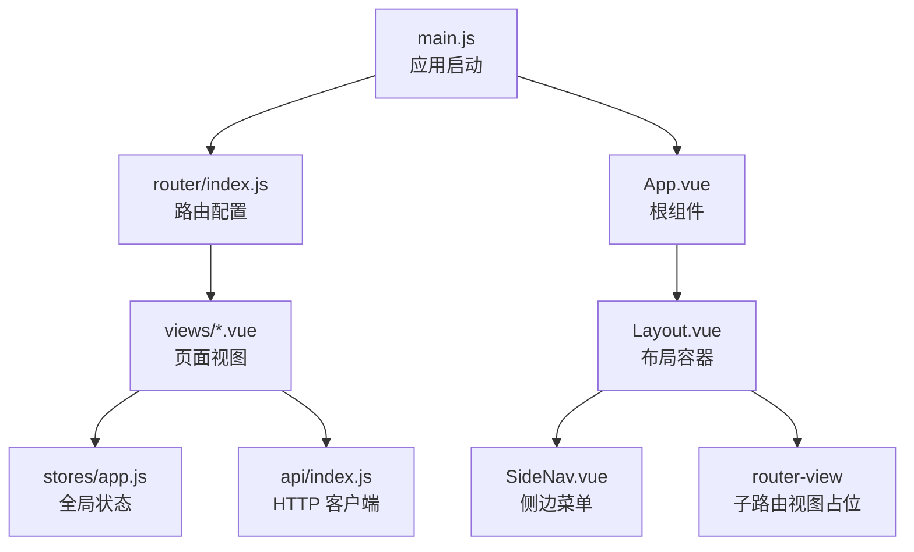
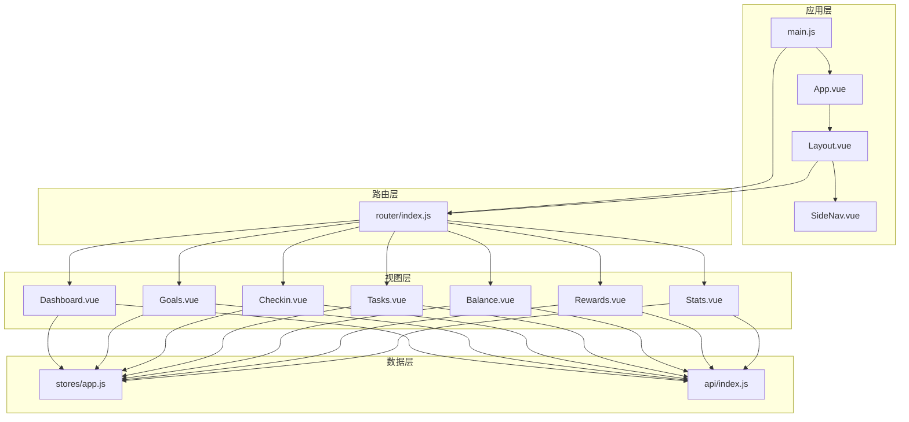
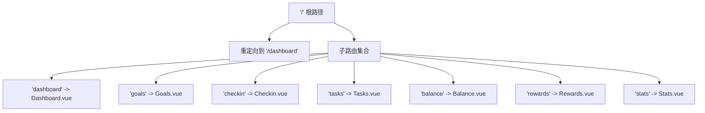
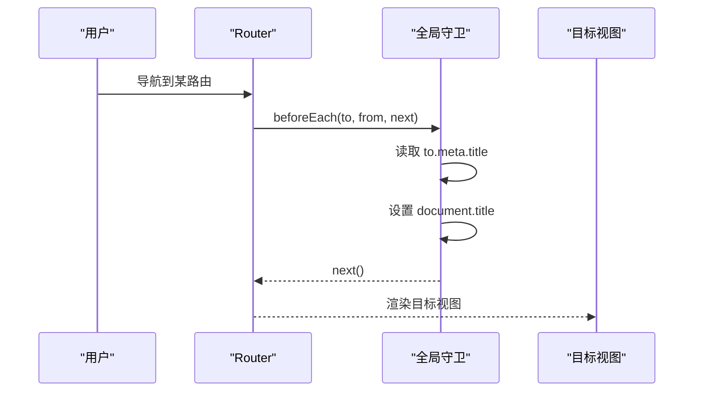
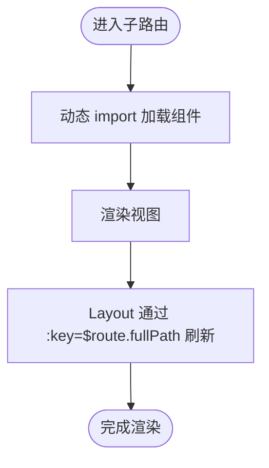
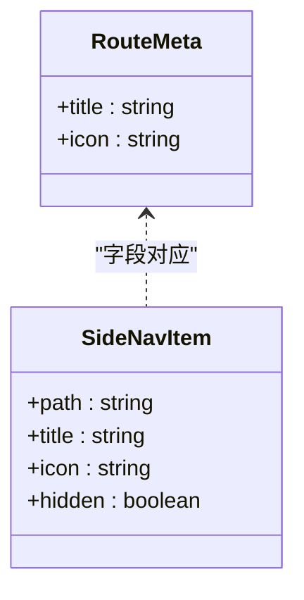
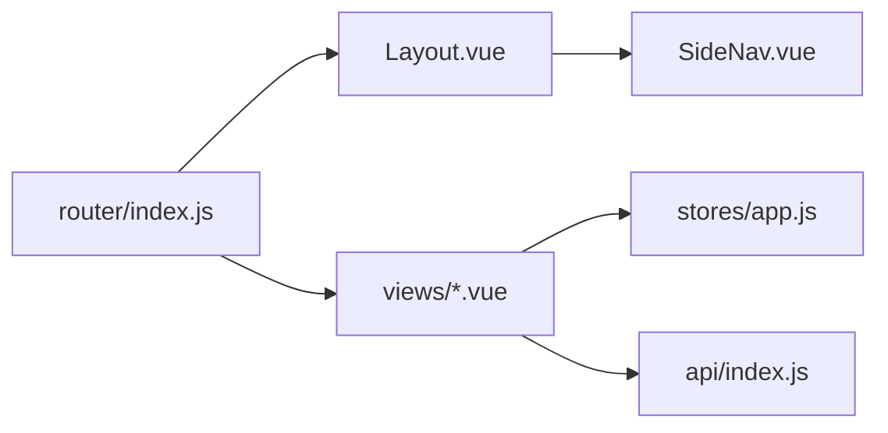

# 路由系统

<cite>
**本文引用的文件**
- [router/index.js](file://star-park/pc-admin/src/router/index.js)
- [main.js](file://star-park/pc-admin/src/main.js)
- [App.vue](file://star-park/pc-admin/src/App.vue)
- [Layout.vue](file://star-park/pc-admin/src/components/Layout.vue)
- [SideNav.vue](file://star-park/pc-admin/src/components/SideNav.vue)
- [Dashboard.vue](file://star-park/pc-admin/src/views/Dashboard.vue)
- [Goals.vue](file://star-park/pc-admin/src/views/Goals.vue)
- [Checkin.vue](file://star-park/pc-admin/src/views/Checkin.vue)
- [Tasks.vue](file://star-park/pc-admin/src/views/Tasks.vue)
- [Balance.vue](file://star-park/pc-admin/src/views/Balance.vue)
- [Rewards.vue](file://star-park/pc-admin/src/views/Rewards.vue)
- [Stats.vue](file://star-park/pc-admin/src/views/Stats.vue)
- [stores/app.js](file://star-park/pc-admin/src/stores/app.js)
- [api/index.js](file://star-park/pc-admin/src/api/index.js)
</cite>

## 目录
1. [简介](#简介)
2. [项目结构](#项目结构)
3. [核心组件](#核心组件)
4. [架构总览](#架构总览)
5. [详细组件分析](#详细组件分析)
6. [依赖关系分析](#依赖关系分析)
7. [性能考量](#性能考量)
8. [故障排查指南](#故障排查指南)
9. [结论](#结论)
10. [附录](#附录)

## 简介
本文件面向 StarParadise PC 管理后台的前端路由系统，围绕 Vue Router 的配置与实现进行系统化文档化，重点覆盖以下方面：
- 路由表定义与嵌套路由结构
- 路由守卫与页面标题设置
- 动态路由加载与代码分割
- 路由元信息的使用（权限示意、图标、面包屑思路）
- 路由参数传递、查询参数处理与重定向机制
- 最佳实践与调试技巧

## 项目结构
PC 管理后台采用单页应用（SPA）架构，路由系统位于 pc-admin 前端工程内，核心文件如下：
- 路由入口与配置：router/index.js
- 应用挂载入口：main.js
- 根组件：App.vue
- 布局与侧边导航：components/Layout.vue、components/SideNav.vue
- 页面视图：views 下各模块页面
- 状态与 API：stores/app.js、api/index.js

图表来源
- [main.js:1-22](file://star-park/pc-admin/src/main.js#L1-L22)
- [router/index.js:1-67](file://star-park/pc-admin/src/router/index.js#L1-L67)
- [App.vue:1-10](file://star-park/pc-admin/src/App.vue#L1-L10)
- [Layout.vue:1-29](file://star-park/pc-admin/src/components/Layout.vue#L1-L29)
- [SideNav.vue:1-132](file://star-park/pc-admin/src/components/SideNav.vue#L1-L132)

章节来源
- [router/index.js:1-67](file://star-park/pc-admin/src/router/index.js#L1-L67)
- [main.js:1-22](file://star-park/pc-admin/src/main.js#L1-L22)
- [App.vue:1-10](file://star-park/pc-admin/src/App.vue#L1-L10)
- [Layout.vue:1-29](file://star-park/pc-admin/src/components/Layout.vue#L1-L29)
- [SideNav.vue:1-132](file://star-park/pc-admin/src/components/SideNav.vue#L1-L132)

## 核心组件
- 路由配置与守卫
  - 使用 createRouter + createWebHistory 创建路由实例
  - 定义根路径 '/'，设置 redirect 到 '/dashboard'
  - 子路由包含 dashboard、goals、checkin、tasks、balance、rewards、stats
  - 全局前置守卫用于设置页面标题，读取 meta.title
- 布局与导航
  - Layout.vue 包裹 SideNav 与 router-view，主内容区通过 :key="$route.fullPath" 强制刷新当前子路由
  - SideNav.vue 通过 router-link 与 meta.icon 实现菜单渲染与激活态
- 视图组件
  - 各页面视图均通过懒加载方式按需加载，提升首屏性能
  - 多数页面在 mounted 阶段拉取全局状态（children）与业务数据

章节来源
- [router/index.js:4-64](file://star-park/pc-admin/src/router/index.js#L4-L64)
- [Layout.vue:1-29](file://star-park/pc-admin/src/components/Layout.vue#L1-L29)
- [SideNav.vue:29-47](file://star-park/pc-admin/src/components/SideNav.vue#L29-L47)
- [Dashboard.vue:1-146](file://star-park/pc-admin/src/views/Dashboard.vue#L1-L146)
- [Goals.vue:1-686](file://star-park/pc-admin/src/views/Goals.vue#L1-L686)
- [Checkin.vue:1-417](file://star-park/pc-admin/src/views/Checkin.vue#L1-L417)
- [Tasks.vue:1-265](file://star-park/pc-admin/src/views/Tasks.vue#L1-L265)
- [Balance.vue:1-173](file://star-park/pc-admin/src/views/Balance.vue#L1-L173)
- [Rewards.vue:1-471](file://star-park/pc-admin/src/views/Rewards.vue#L1-L471)
- [Stats.vue:1-291](file://star-park/pc-admin/src/views/Stats.vue#L1-L291)

## 架构总览
下图展示了路由系统在应用中的位置与交互关系：

图表来源
- [main.js:1-22](file://star-park/pc-admin/src/main.js#L1-L22)
- [router/index.js:1-67](file://star-park/pc-admin/src/router/index.js#L1-L67)
- [App.vue:1-10](file://star-park/pc-admin/src/App.vue#L1-L10)
- [Layout.vue:1-29](file://star-park/pc-admin/src/components/Layout.vue#L1-L29)
- [SideNav.vue:1-132](file://star-park/pc-admin/src/components/SideNav.vue#L1-L132)
- [Dashboard.vue:1-146](file://star-park/pc-admin/src/views/Dashboard.vue#L1-L146)
- [Goals.vue:1-686](file://star-park/pc-admin/src/views/Goals.vue#L1-L686)
- [Checkin.vue:1-417](file://star-park/pc-admin/src/views/Checkin.vue#L1-L417)
- [Tasks.vue:1-265](file://star-park/pc-admin/src/views/Tasks.vue#L1-L265)
- [Balance.vue:1-173](file://star-park/pc-admin/src/views/Balance.vue#L1-L173)
- [Rewards.vue:1-471](file://star-park/pc-admin/src/views/Rewards.vue#L1-L471)
- [Stats.vue:1-291](file://star-park/pc-admin/src/views/Stats.vue#L1-L291)
- [stores/app.js:1-62](file://star-park/pc-admin/src/stores/app.js#L1-L62)
- [api/index.js:1-56](file://star-park/pc-admin/src/api/index.js#L1-L56)

## 详细组件分析

### 路由表与嵌套路由
- 根路径 '/' 作为布局容器，redirect 到 '/dashboard'
- 子路由均采用懒加载组件，提升首屏性能
- 子路由 meta 中包含 title 与 icon 字段，供全局守卫与侧边导航使用

图表来源
- [router/index.js:4-54](file://star-park/pc-admin/src/router/index.js#L4-L54)

章节来源
- [router/index.js:4-54](file://star-park/pc-admin/src/router/index.js#L4-L54)

### 路由守卫与页面标题
- 全局前置守卫在每次路由切换时设置 document.title，格式为“页面标题 - 星星乐园管理后台”
- 该机制基于 meta.title 实现，确保每个页面标题一致化

图表来源
- [router/index.js:61-64](file://star-park/pc-admin/src/router/index.js#L61-L64)

章节来源
- [router/index.js:61-64](file://star-park/pc-admin/src/router/index.js#L61-L64)

### 动态路由加载与代码分割
- 所有子路由组件均通过动态 import 实现懒加载
- 优点：减少初始包体积，提升首屏加载速度；按需加载页面资源
- 注意：结合路由守卫与布局刷新策略，避免重复渲染问题

图表来源
- [router/index.js:13-50](file://star-park/pc-admin/src/router/index.js#L13-L50)
- [Layout.vue:5](file://star-park/pc-admin/src/components/Layout.vue#L5)

章节来源
- [router/index.js:13-50](file://star-park/pc-admin/src/router/index.js#L13-L50)
- [Layout.vue:5](file://star-park/pc-admin/src/components/Layout.vue#L5)

### 路由元信息与导航
- meta.title：用于全局守卫设置页面标题
- meta.icon：用于 SideNav 渲染菜单图标
- 菜单项数组与路由 path 对齐，隐藏项通过 hidden 字段控制

图表来源
- [router/index.js:14,20,26,32,38,44,50:14-50](file://star-park/pc-admin/src/router/index.js#L14-L50)
- [SideNav.vue:31-42](file://star-park/pc-admin/src/components/SideNav.vue#L31-L42)

章节来源
- [router/index.js:14,20,26,32,38,44,50:14-50](file://star-park/pc-admin/src/router/index.js#L14-L50)
- [SideNav.vue:31-42](file://star-park/pc-admin/src/components/SideNav.vue#L31-L42)

### 路由参数传递、查询参数与重定向
- 参数传递
  - 本项目未使用路由参数（:id），主要通过查询参数与全局状态管理
- 查询参数
  - Checkin 页面使用 el-date-picker 的 value-format 将日期以字符串形式传入，作为查询参数参与 API 请求
- 重定向
  - 根路径 redirect 到 dashboard，保证首次访问即进入首页

章节来源
- [Checkin.vue:6-15](file://star-park/pc-admin/src/views/Checkin.vue#L6-L15)
- [router/index.js:8](file://star-park/pc-admin/src/router/index.js#L8)

### 页面级导航与面包屑
- 本项目未实现通用面包屑组件，但具备实现条件：
  - 可在全局守卫中根据 $route.matched 生成面包屑
  - 可在 Layout 中渲染面包屑，结合 meta.title
  - 若需要跨页面共享面包屑，可在 Pinia store 中维护面包屑栈

（本节为概念性说明，不直接分析具体文件）

### 权限控制与路由守卫
- 当前路由系统未实现鉴权守卫
- 如需权限控制，建议在全局守卫中校验用户状态与路由 meta 权限标识，必要时进行角色判定与跳转

（本节为概念性说明，不直接分析具体文件）

## 依赖关系分析
- 路由配置依赖：
  - Layout.vue 作为根布局，内部包含 SideNav 与 router-view
  - 全局守卫依赖 meta.title
- 视图组件依赖：
  - 大多数页面依赖 Pinia store（children、当前选中孩子等）
  - 大多数页面依赖 api/index.js 发起请求
- 关键耦合点：
  - Layout.vue 通过 :key="$route.fullPath" 强制刷新，避免同路径复用导致的页面不更新
  - SideNav.vue 与路由 meta.icon 对齐，保证菜单与路由一致

图表来源
- [router/index.js:1-67](file://star-park/pc-admin/src/router/index.js#L1-L67)
- [Layout.vue:1-29](file://star-park/pc-admin/src/components/Layout.vue#L1-L29)
- [SideNav.vue:1-132](file://star-park/pc-admin/src/components/SideNav.vue#L1-L132)
- [stores/app.js:1-62](file://star-park/pc-admin/src/stores/app.js#L1-L62)
- [api/index.js:1-56](file://star-park/pc-admin/src/api/index.js#L1-L56)

章节来源
- [router/index.js:1-67](file://star-park/pc-admin/src/router/index.js#L1-L67)
- [Layout.vue:1-29](file://star-park/pc-admin/src/components/Layout.vue#L1-L29)
- [SideNav.vue:1-132](file://star-park/pc-admin/src/components/SideNav.vue#L1-L132)
- [stores/app.js:1-62](file://star-park/pc-admin/src/stores/app.js#L1-L62)
- [api/index.js:1-56](file://star-park/pc-admin/src/api/index.js#L1-L56)

## 性能考量
- 代码分割与懒加载
  - 所有子路由组件均采用动态 import，有效降低首屏体积
- 路由刷新策略
  - Layout 中通过 :key="$route.fullPath" 强制刷新当前子路由，避免缓存导致的状态不一致
- 图标与第三方库
  - Element Plus 图标统一注册，减少重复引入
- 网络请求优化
  - 多数页面使用 Promise.all 并行请求多个接口，缩短等待时间
  - API 层统一响应拦截，简化错误处理

章节来源
- [router/index.js:13-50](file://star-park/pc-admin/src/router/index.js#L13-L50)
- [Layout.vue:5](file://star-park/pc-admin/src/components/Layout.vue#L5)
- [main.js:13-16](file://star-park/pc-admin/src/main.js#L13-L16)
- [Dashboard.vue:76-87](file://star-park/pc-admin/src/views/Dashboard.vue#L76-L87)
- [Checkin.vue:160-195](file://star-park/pc-admin/src/views/Checkin.vue#L160-L195)
- [Rewards.vue:303-329](file://star-park/pc-admin/src/views/Rewards.vue#L303-L329)
- [Stats.vue:68-82](file://star-park/pc-admin/src/views/Stats.vue#L68-L82)
- [api/index.js:12-19](file://star-park/pc-admin/src/api/index.js#L12-L19)

## 故障排查指南
- 页面标题未更新
  - 检查目标路由是否设置 meta.title
  - 确认全局守卫是否执行
- 路由切换后页面未刷新
  - 检查 Layout 是否使用 :key="$route.fullPath"
- 菜单图标不显示
  - 检查路由 meta.icon 与 SideNav 菜单项 icon 是否一致
- 子路由无法渲染
  - 检查 Layout 中是否存在 router-view 占位
- 数据未加载
  - 检查页面 mounted 生命周期中是否调用 store.fetchChildren 或对应 API
  - 检查 api/index.js 响应拦截器是否正确返回 data

章节来源
- [router/index.js:61-64](file://star-park/pc-admin/src/router/index.js#L61-L64)
- [Layout.vue:5](file://star-park/pc-admin/src/components/Layout.vue#L5)
- [SideNav.vue:31-42](file://star-park/pc-admin/src/components/SideNav.vue#L31-L42)
- [api/index.js:12-19](file://star-park/pc-admin/src/api/index.js#L12-L19)

## 结论
StarParadise PC 管理后台的路由系统以简洁清晰的嵌套路由为核心，配合懒加载与全局守卫，实现了良好的首屏性能与一致的页面标题体验。通过 Layout 的强制刷新策略与 SideNav 的 meta.icon 对齐，保证了导航与视图的一致性。后续可在权限控制、面包屑与查询参数处理等方面进一步增强路由能力。

## 附录

### 路由配置最佳实践
- 命名规范
  - 路由 path 使用短横线分隔（如 'checkin'），与目录/文件命名保持一致
  - 路由 name 使用 PascalCase（如 'Dashboard'），便于识别
- 路径设计
  - 根路径 '/' 作为布局容器，redirect 到常用入口（如 '/dashboard'）
  - 子路由路径简洁明确，避免深层嵌套
- 嵌套路由
  - 采用 children 形式组织页面，便于统一布局与导航
- 路由元信息
  - meta.title 用于页面标题
  - meta.icon 用于菜单图标
- 动态加载
  - 所有子路由组件使用动态 import，确保按需加载
- 路由守卫
  - 在 beforeEach 中设置页面标题
  - 如需权限控制，可在守卫中增加鉴权逻辑

章节来源
- [router/index.js:4-54](file://star-park/pc-admin/src/router/index.js#L4-L54)
- [router/index.js:61-64](file://star-park/pc-admin/src/router/index.js#L61-L64)