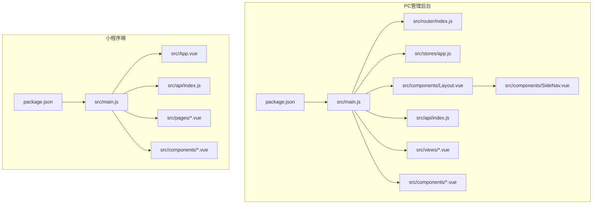
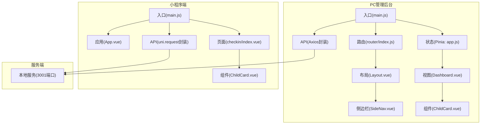
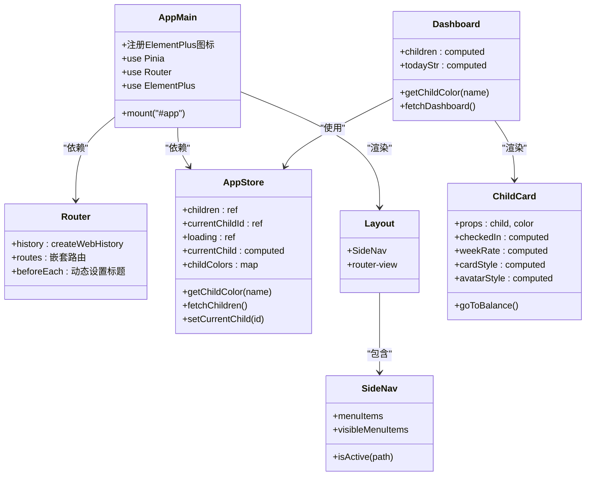
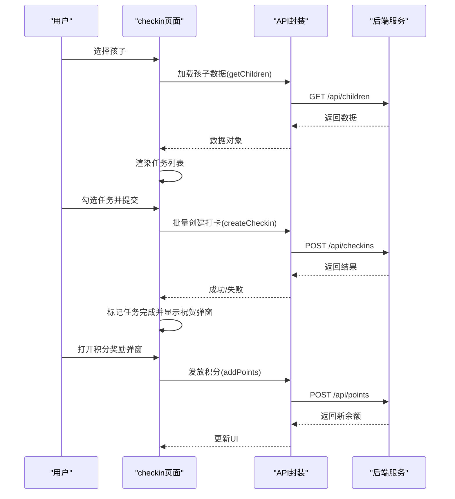
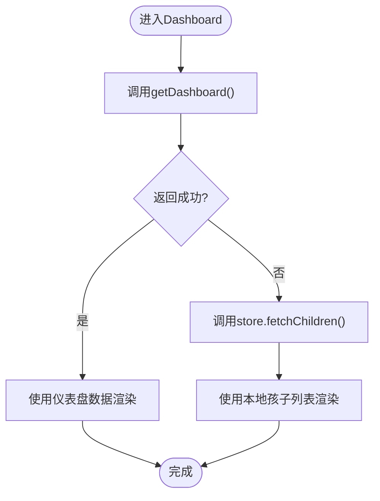
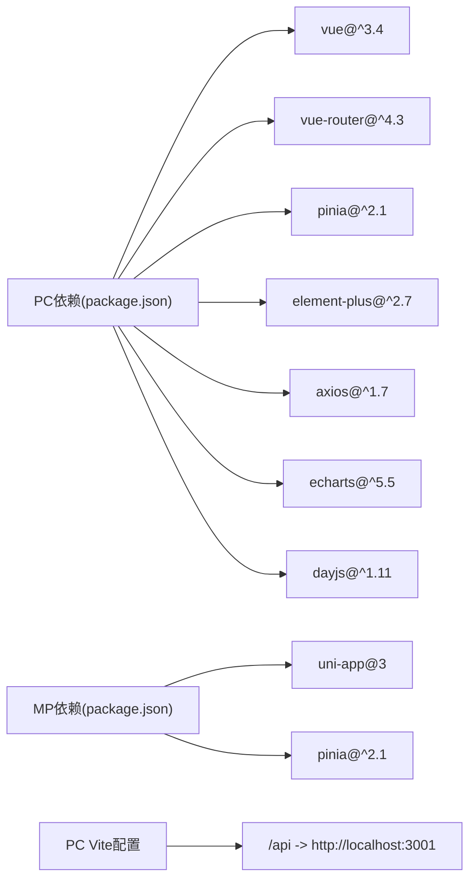

# 前端应用架构

<cite>
**本文档引用的文件**
- [star-park/pc-admin/package.json](file://star-park/pc-admin/package.json)
- [star-park/miniprogram/package.json](file://star-park/miniprogram/package.json)
- [star-park/pc-admin/src/main.js](file://star-park/pc-admin/src/main.js)
- [star-park/miniprogram/src/main.js](file://star-park/miniprogram/src/main.js)
- [star-park/pc-admin/vite.config.js](file://star-park/pc-admin/vite.config.js)
- [star-park/miniprogram/vite.config.js](file://star-park/miniprogram/vite.config.js)
- [star-park/pc-admin/src/router/index.js](file://star-park/pc-admin/src/router/index.js)
- [star-park/pc-admin/src/stores/app.js](file://star-park/pc-admin/src/stores/app.js)
- [star-park/pc-admin/src/App.vue](file://star-park/pc-admin/src/App.vue)
- [star-park/miniprogram/src/App.vue](file://star-park/miniprogram/src/App.vue)
- [star-park/pc-admin/src/components/Layout.vue](file://star-park/pc-admin/src/components/Layout.vue)
- [star-park/pc-admin/src/components/SideNav.vue](file://star-park/pc-admin/src/components/SideNav.vue)
- [star-park/pc-admin/src/api/index.js](file://star-park/pc-admin/src/api/index.js)
- [star-park/miniprogram/src/api/index.js](file://star-park/miniprogram/src/api/index.js)
- [star-park/pc-admin/src/views/Dashboard.vue](file://star-park/pc-admin/src/views/Dashboard.vue)
- [star-park/pc-admin/src/components/ChildCard.vue](file://star-park/pc-admin/src/components/ChildCard.vue)
- [star-park/miniprogram/src/components/ChildCard.vue](file://star-park/miniprogram/src/components/ChildCard.vue)
- [star-park/miniprogram/src/pages/checkin/index.vue](file://star-park/miniprogram/src/pages/checkin/index.vue)
</cite>

## 目录
1. [引言](#引言)
2. [项目结构](#项目结构)
3. [核心组件](#核心组件)
4. [架构总览](#架构总览)
5. [详细组件分析](#详细组件分析)
6. [依赖关系分析](#依赖关系分析)
7. [性能考虑](#性能考虑)
8. [故障排查指南](#故障排查指南)
9. [结论](#结论)
10. [附录](#附录)

## 引言
本文件面向StarParadise前端应用，系统化阐述PC管理后台与小程序端的前端架构设计。内容涵盖技术栈（Vue 3 + Element Plus + Pinia）、组件层次、路由配置、状态管理策略；深入解析uni-app跨平台开发的架构原理、页面结构与组件开发规范、响应式布局实现；并总结API客户端封装、错误处理机制、数据缓存策略与性能优化方案，以及组件设计模式、样式管理、主题定制与国际化支持等前端最佳实践。

## 项目结构
项目采用“多包”组织方式，分别构建PC管理后台与小程序端两套独立前端工程，共享部分设计思想与基础能力：
- PC管理后台：基于Vite + Vue 3 + Element Plus + Pinia，提供可视化仪表盘与业务管理界面。
- 小程序端：基于uni-app + Vue 3，统一适配微信小程序与H5运行环境，提供日常打卡与任务管理功能。

图表来源
- [star-park/pc-admin/package.json:1-26](file://star-park/pc-admin/package.json#L1-L26)
- [star-park/miniprogram/package.json:1-27](file://star-park/miniprogram/package.json#L1-L27)
- [star-park/pc-admin/src/main.js:1-22](file://star-park/pc-admin/src/main.js#L1-L22)
- [star-park/miniprogram/src/main.js:1-8](file://star-park/miniprogram/src/main.js#L1-L8)
- [star-park/pc-admin/src/router/index.js:1-67](file://star-park/pc-admin/src/router/index.js#L1-L67)
- [star-park/pc-admin/src/stores/app.js:1-62](file://star-park/pc-admin/src/stores/app.js#L1-L62)
- [star-park/pc-admin/src/components/Layout.vue:1-29](file://star-park/pc-admin/src/components/Layout.vue#L1-L29)
- [star-park/pc-admin/src/components/SideNav.vue:1-132](file://star-park/pc-admin/src/components/SideNav.vue#L1-L132)
- [star-park/pc-admin/src/api/index.js:1-55](file://star-park/pc-admin/src/api/index.js#L1-L55)
- [star-park/miniprogram/src/App.vue:1-26](file://star-park/miniprogram/src/App.vue#L1-L26)
- [star-park/miniprogram/src/api/index.js:1-65](file://star-park/miniprogram/src/api/index.js#L1-L65)

章节来源
- [star-park/pc-admin/package.json:1-26](file://star-park/pc-admin/package.json#L1-L26)
- [star-park/miniprogram/package.json:1-27](file://star-park/miniprogram/package.json#L1-L27)

## 核心组件
本节聚焦PC管理后台与小程序端的关键模块，阐明其职责与协作关系。

- PC管理后台
  - 应用入口与插件注册：在入口中完成Element Plus图标全局注册、Pinia与路由挂载，确保UI组件与状态管理可用。
  - 路由与导航：采用嵌套路由，Layout包裹侧边栏与主内容区，通过beforeEach设置页面标题。
  - 状态管理：Pinia Store集中管理“孩子列表/当前选中孩子/加载状态/颜色映射/接口调用”，提供计算属性与方法供视图层使用。
  - 视图层：Dashboard作为首页，组合ChildCard展示每个孩子的学习进度与积分余额等指标。
  - API封装：Axios实例统一配置baseURL、超时与响应拦截，导出具体业务API函数。

- 小程序端
  - 应用生命周期：通过uni-app生命周期钩子处理启动、显示与隐藏事件。
  - 页面与组件：checkin页面承载“孩子选择-任务勾选-打卡提交-积分奖励”的完整流程；ChildCard组件负责单个孩子的信息展示。
  - API封装：基于uni.request封装通用请求方法，按业务拆分接口函数，统一处理HTTP状态码与错误提示。

章节来源
- [star-park/pc-admin/src/main.js:1-22](file://star-park/pc-admin/src/main.js#L1-L22)
- [star-park/pc-admin/src/router/index.js:1-67](file://star-park/pc-admin/src/router/index.js#L1-L67)
- [star-park/pc-admin/src/stores/app.js:1-62](file://star-park/pc-admin/src/stores/app.js#L1-L62)
- [star-park/pc-admin/src/views/Dashboard.vue:1-146](file://star-park/pc-admin/src/views/Dashboard.vue#L1-L146)
- [star-park/pc-admin/src/components/ChildCard.vue:1-161](file://star-park/pc-admin/src/components/ChildCard.vue#L1-L161)
- [star-park/pc-admin/src/api/index.js:1-55](file://star-park/pc-admin/src/api/index.js#L1-L55)
- [star-park/miniprogram/src/App.vue:1-26](file://star-park/miniprogram/src/App.vue#L1-L26)
- [star-park/miniprogram/src/pages/checkin/index.vue:1-661](file://star-park/miniprogram/src/pages/checkin/index.vue#L1-L661)
- [star-park/miniprogram/src/components/ChildCard.vue:1-162](file://star-park/miniprogram/src/components/ChildCard.vue#L1-L162)
- [star-park/miniprogram/src/api/index.js:1-65](file://star-park/miniprogram/src/api/index.js#L1-L65)

## 架构总览
下图展示了PC管理后台与小程序端的总体架构与交互关系，包括应用入口、路由与状态管理、组件层次、API客户端以及服务端代理。

图表来源
- [star-park/pc-admin/src/main.js:1-22](file://star-park/pc-admin/src/main.js#L1-L22)
- [star-park/pc-admin/src/router/index.js:1-67](file://star-park/pc-admin/src/router/index.js#L1-L67)
- [star-park/pc-admin/src/stores/app.js:1-62](file://star-park/pc-admin/src/stores/app.js#L1-L62)
- [star-park/pc-admin/src/components/Layout.vue:1-29](file://star-park/pc-admin/src/components/Layout.vue#L1-L29)
- [star-park/pc-admin/src/components/SideNav.vue:1-132](file://star-park/pc-admin/src/components/SideNav.vue#L1-L132)
- [star-park/pc-admin/src/views/Dashboard.vue:1-146](file://star-park/pc-admin/src/views/Dashboard.vue#L1-L146)
- [star-park/pc-admin/src/components/ChildCard.vue:1-161](file://star-park/pc-admin/src/components/ChildCard.vue#L1-L161)
- [star-park/pc-admin/src/api/index.js:1-55](file://star-park/pc-admin/src/api/index.js#L1-L55)
- [star-park/miniprogram/src/main.js:1-8](file://star-park/miniprogram/src/main.js#L1-L8)
- [star-park/miniprogram/src/App.vue:1-26](file://star-park/miniprogram/src/App.vue#L1-L26)
- [star-park/miniprogram/src/pages/checkin/index.vue:1-661](file://star-park/miniprogram/src/pages/checkin/index.vue#L1-L661)
- [star-park/miniprogram/src/components/ChildCard.vue:1-162](file://star-park/miniprogram/src/components/ChildCard.vue#L1-L162)
- [star-park/miniprogram/src/api/index.js:1-65](file://star-park/miniprogram/src/api/index.js#L1-L65)

## 详细组件分析

### PC管理后台组件分析
- 应用入口与插件初始化
  - 完成Element Plus图标批量注册、Pinia与路由安装、全局样式引入，保证UI生态与状态管理可用。
- 路由与导航
  - 使用history模式，嵌套路由结构清晰；beforeEach动态设置页面标题，增强可访问性。
- 状态管理
  - Pinia Store集中维护“孩子列表/当前选中孩子/加载状态/颜色映射/接口调用”，提供计算属性currentChild与方法fetchChildren/setCurrentChild，降低视图层复杂度。
- 视图与组件
  - Dashboard聚合展示与快捷入口；ChildCard以props接收数据与颜色，内部通过computed派生样式与行为，便于复用与主题定制。

图表来源
- [star-park/pc-admin/src/main.js:1-22](file://star-park/pc-admin/src/main.js#L1-L22)
- [star-park/pc-admin/src/router/index.js:1-67](file://star-park/pc-admin/src/router/index.js#L1-L67)
- [star-park/pc-admin/src/stores/app.js:1-62](file://star-park/pc-admin/src/stores/app.js#L1-L62)
- [star-park/pc-admin/src/components/Layout.vue:1-29](file://star-park/pc-admin/src/components/Layout.vue#L1-L29)
- [star-park/pc-admin/src/components/SideNav.vue:1-132](file://star-park/pc-admin/src/components/SideNav.vue#L1-L132)
- [star-park/pc-admin/src/views/Dashboard.vue:1-146](file://star-park/pc-admin/src/views/Dashboard.vue#L1-L146)
- [star-park/pc-admin/src/components/ChildCard.vue:1-161](file://star-park/pc-admin/src/components/ChildCard.vue#L1-L161)

章节来源
- [star-park/pc-admin/src/main.js:1-22](file://star-park/pc-admin/src/main.js#L1-L22)
- [star-park/pc-admin/src/router/index.js:1-67](file://star-park/pc-admin/src/router/index.js#L1-L67)
- [star-park/pc-admin/src/stores/app.js:1-62](file://star-park/pc-admin/src/stores/app.js#L1-L62)
- [star-park/pc-admin/src/components/Layout.vue:1-29](file://star-park/pc-admin/src/components/Layout.vue#L1-L29)
- [star-park/pc-admin/src/components/SideNav.vue:1-132](file://star-park/pc-admin/src/components/SideNav.vue#L1-L132)
- [star-park/pc-admin/src/views/Dashboard.vue:1-146](file://star-park/pc-admin/src/views/Dashboard.vue#L1-L146)
- [star-park/pc-admin/src/components/ChildCard.vue:1-161](file://star-park/pc-admin/src/components/ChildCard.vue#L1-L161)

### 小程序端组件分析
- 应用生命周期
  - 通过uni.onLaunch/onShow/onHide处理应用生命周期事件，便于埋点与状态恢复。
- 页面流程
  - checkin页面实现“孩子选择-任务勾选-打卡提交-积分奖励”的完整闭环，包含数据加载、状态切换、弹窗交互与Toast反馈。
- 组件复用
  - ChildCard组件抽象为可点击的卡片，支持主题色与徽章状态，便于在不同页面复用。

图表来源
- [star-park/miniprogram/src/pages/checkin/index.vue:1-661](file://star-park/miniprogram/src/pages/checkin/index.vue#L1-L661)
- [star-park/miniprogram/src/api/index.js:1-65](file://star-park/miniprogram/src/api/index.js#L1-L65)

章节来源
- [star-park/miniprogram/src/App.vue:1-26](file://star-park/miniprogram/src/App.vue#L1-L26)
- [star-park/miniprogram/src/pages/checkin/index.vue:1-661](file://star-park/miniprogram/src/pages/checkin/index.vue#L1-L661)
- [star-park/miniprogram/src/components/ChildCard.vue:1-162](file://star-park/miniprogram/src/components/ChildCard.vue#L1-L162)
- [star-park/miniprogram/src/api/index.js:1-65](file://star-park/miniprogram/src/api/index.js#L1-L65)

### 复杂逻辑流程（PC仪表盘）
Dashboard在首次加载失败时回退到本地存储的“孩子列表”，体现容错与用户体验保障。

图表来源
- [star-park/pc-admin/src/views/Dashboard.vue:76-91](file://star-park/pc-admin/src/views/Dashboard.vue#L76-L91)
- [star-park/pc-admin/src/stores/app.js:31-44](file://star-park/pc-admin/src/stores/app.js#L31-L44)

章节来源
- [star-park/pc-admin/src/views/Dashboard.vue:1-146](file://star-park/pc-admin/src/views/Dashboard.vue#L1-L146)
- [star-park/pc-admin/src/stores/app.js:1-62](file://star-park/pc-admin/src/stores/app.js#L1-L62)

## 依赖关系分析
- 技术栈与工具链
  - PC管理后台：Vue 3、vue-router、pinia、element-plus、axios、echarts、dayjs；Vite构建与开发服务器。
  - 小程序端：uni-app 3、Vue 3、pinia；Vite插件uni支撑多端编译。
- 开发服务器与代理
  - PC端Vite配置将/api前缀代理至本地3001端口，简化前后端联调。
- 组件与页面
  - PC端采用Layout+SideNav+视图的层级结构；小程序端checkin页面承担主要业务逻辑。

图表来源
- [star-park/pc-admin/package.json:11-24](file://star-park/pc-admin/package.json#L11-L24)
- [star-park/miniprogram/package.json:10-25](file://star-park/miniprogram/package.json#L10-L25)
- [star-park/pc-admin/vite.config.js:8-13](file://star-park/pc-admin/vite.config.js#L8-L13)

章节来源
- [star-park/pc-admin/package.json:1-26](file://star-park/pc-admin/package.json#L1-L26)
- [star-park/miniprogram/package.json:1-27](file://star-park/miniprogram/package.json#L1-L27)
- [star-park/pc-admin/vite.config.js:1-19](file://star-park/pc-admin/vite.config.js#L1-L19)
- [star-park/miniprogram/vite.config.js:1-7](file://star-park/miniprogram/vite.config.js#L1-L7)

## 性能考虑
- 路由懒加载与增量渲染
  - PC端路由对视图组件采用动态导入，减少首屏体积与初次渲染时间。
- 组件复用与样式隔离
  - 通过Props传参与scoped样式，避免全局污染；ChildCard在PC与小程序端保持一致语义，提升复用效率。
- 状态管理粒度
  - Pinia Store集中管理关键状态，避免重复请求与重复计算；computed派生属性减少不必要重渲染。
- 请求拦截与错误降级
  - PC端Axios响应拦截统一提取data，异常打印日志；Dashboard在失败时回退本地数据，提升健壮性。
- 小程序端交互优化
  - 使用局部更新与条件渲染，减少不必要的setData；弹窗与遮罩仅在需要时显示，降低渲染压力。

## 故障排查指南
- 网络请求失败
  - PC端：检查Vite代理是否正确指向3001端口；确认响应拦截器是否抛出Promise.reject；查看控制台错误日志。
  - 小程序端：检查BASE_URL与uni.request回调，关注fail分支的Toast提示。
- 路由标题与面包屑
  - 确认router.beforeEach是否执行；检查meta.title字段是否正确设置。
- 状态同步问题
  - 检查Pinia Store的ref与computed是否正确响应；确认异步操作的finally块是否重置loading状态。
- 小程序页面空白或数据不更新
  - 确认onShow生命周期是否触发数据刷新；检查children数组与activeChildId的初始化逻辑。

章节来源
- [star-park/pc-admin/vite.config.js:8-13](file://star-park/pc-admin/vite.config.js#L8-L13)
- [star-park/pc-admin/src/api/index.js:13-19](file://star-park/pc-admin/src/api/index.js#L13-L19)
- [star-park/pc-admin/src/router/index.js:61-64](file://star-park/pc-admin/src/router/index.js#L61-L64)
- [star-park/pc-admin/src/stores/app.js:31-44](file://star-park/pc-admin/src/stores/app.js#L31-L44)
- [star-park/miniprogram/src/api/index.js:6-29](file://star-park/miniprogram/src/api/index.js#L6-L29)

## 结论
本项目在PC管理后台与小程序端分别采用成熟的技术栈与工程化实践，实现了清晰的组件层次、稳定的路由与状态管理、可靠的API封装与错误处理。通过Pinia集中状态、Element Plus统一UI、uni-app跨平台适配，既满足了业务需求，又兼顾了可维护性与扩展性。后续可在国际化、主题系统与缓存策略方面进一步完善，以提升全球化与性能表现。

## 附录
- 最佳实践建议
  - 国际化：引入i18n库，按模块拆分语言包，结合路由meta进行语言切换。
  - 主题定制：统一CSS变量与SCSS变量，建立主题切换机制与暗色模式支持。
  - 缓存策略：对静态数据与列表页增加本地缓存，结合失效时间与手动刷新。
  - 性能监控：接入性能指标采集，对首屏渲染、路由切换与接口耗时进行观测。
  - 可访问性：为键盘导航与屏幕阅读器提供语义化标签与ARIA属性。