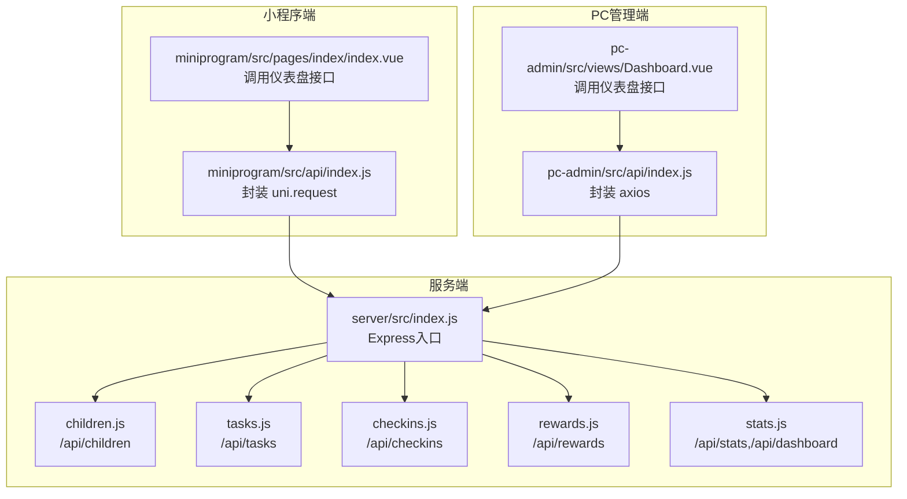
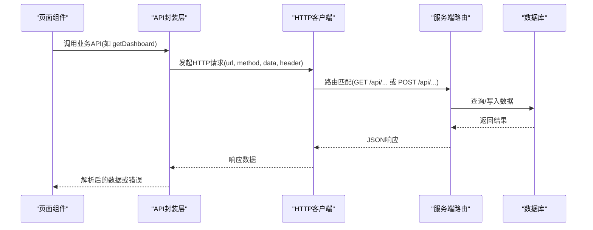
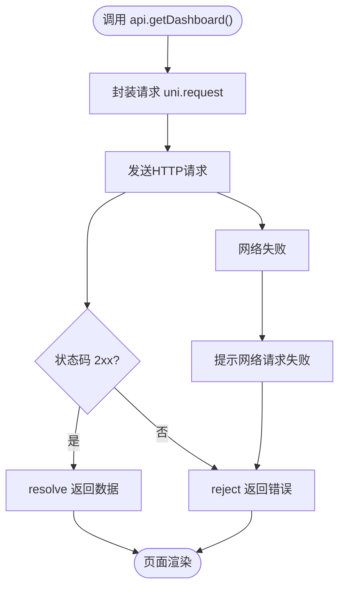
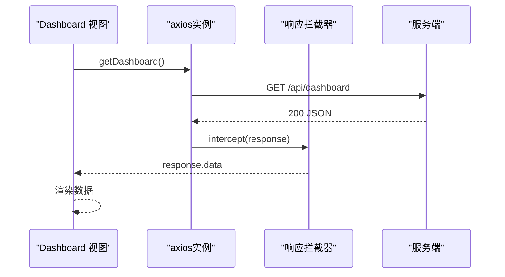
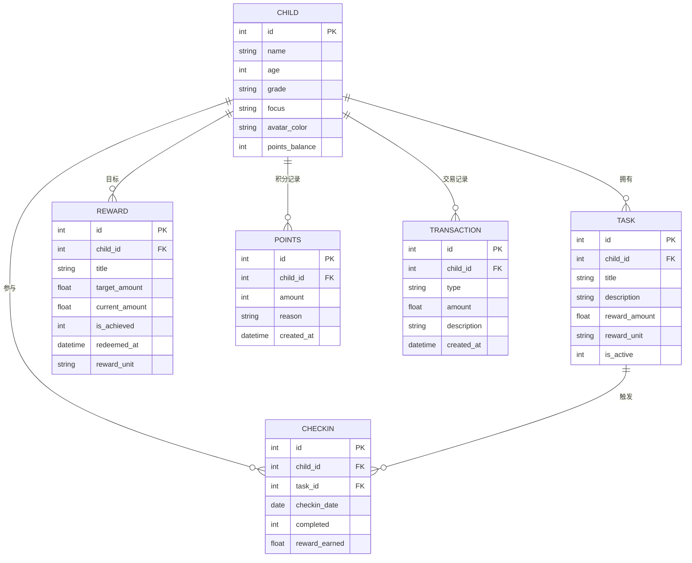
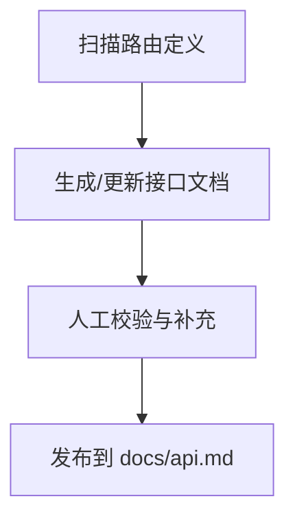
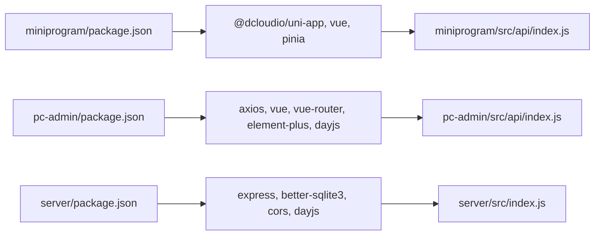

# API客户端封装

<cite>
**本文引用的文件**
- [miniprogram/src/api/index.js](file://star-park/miniprogram/src/api/index.js)
- [pc-admin/src/api/index.js](file://star-park/pc-admin/src/api/index.js)
- [server/src/index.js](file://star-park/server/src/index.js)
- [server/src/routes/children.js](file://star-park/server/src/routes/children.js)
- [server/src/routes/tasks.js](file://star-park/server/src/routes/tasks.js)
- [server/src/routes/checkins.js](file://star-park/server/src/routes/checkins.js)
- [server/src/routes/rewards.js](file://star-park/server/src/routes/rewards.js)
- [server/src/routes/stats.js](file://star-park/server/src/routes/stats.js)
- [docs/api.md](file://docs/api.md)
- [generate-api-doc.sh](file://scripts/generate-api-doc.sh)
- [miniprogram/src/pages/index/index.vue](file://star-park/miniprogram/src/pages/index/index.vue)
- [pc-admin/src/views/Dashboard.vue](file://star-park/pc-admin/src/views/Dashboard.vue)
- [miniprogram/src/main.js](file://star-park/miniprogram/src/main.js)
- [pc-admin/src/main.js](file://star-park/pc-admin/src/main.js)
- [miniprogram/package.json](file://star-park/miniprogram/package.json)
- [pc-admin/package.json](file://star-park/pc-admin/package.json)
- [server/package.json](file://star-park/server/package.json)
</cite>

## 目录
1. [简介](#简介)
2. [项目结构](#项目结构)
3. [核心组件](#核心组件)
4. [架构总览](#架构总览)
5. [详细组件分析](#详细组件分析)
6. [依赖关系分析](#依赖关系分析)
7. [性能考量](#性能考量)
8. [故障排除指南](#故障排除指南)
9. [结论](#结论)
10. [附录](#附录)

## 简介
本文件面向StarParadise小程序与PC管理端的API客户端封装，系统性阐述HTTP请求封装、网络拦截器、响应数据处理、错误处理机制；统一管理API调用、请求参数格式化、响应数据解析与状态码处理；解释认证机制、token管理、请求重试、超时处理等安全与可靠性保障；并覆盖API版本管理、接口文档生成、Mock数据支持、性能监控等高级能力。文末提供使用示例、最佳实践与故障排除建议。

## 项目结构
- 小程序端API封装位于 miniprogram/src/api/index.js，基于 uni.request 实现统一请求与状态码判断。
- PC管理端API封装位于 pc-admin/src/api/index.js，基于 axios 实现统一请求、超时控制与响应拦截器。
- 服务端位于 server/src，采用 Express + better-sqlite3 提供RESTful接口，路由按模块拆分。
- 文档与脚本：docs/api.md 提供接口文档，scripts/generate-api-doc.sh 支持自动化扫描生成。

**图表来源**
- [miniprogram/src/api/index.js:1-75](file://star-park/miniprogram/src/api/index.js#L1-L75)
- [pc-admin/src/api/index.js:1-56](file://star-park/pc-admin/src/api/index.js#L1-L56)
- [server/src/index.js:1-42](file://star-park/server/src/index.js#L1-L42)
- [server/src/routes/children.js:1-96](file://star-park/server/src/routes/children.js#L1-L96)
- [server/src/routes/tasks.js:1-91](file://star-park/server/src/routes/tasks.js#L1-L91)
- [server/src/routes/checkins.js:1-90](file://star-park/server/src/routes/checkins.js#L1-L90)
- [server/src/routes/rewards.js:1-167](file://star-park/server/src/routes/rewards.js#L1-L167)
- [server/src/routes/stats.js:1-182](file://star-park/server/src/routes/stats.js#L1-L182)

**章节来源**
- [miniprogram/src/api/index.js:1-75](file://star-park/miniprogram/src/api/index.js#L1-L75)
- [pc-admin/src/api/index.js:1-56](file://star-park/pc-admin/src/api/index.js#L1-L56)
- [server/src/index.js:1-42](file://star-park/server/src/index.js#L1-L42)

## 核心组件
- 小程序API封装
  - 统一封装：基于 uni.request，自动拼接BASE_URL，设置JSON头，统一处理2xx状态码与失败提示。
  - 接口定义：以对象形式导出常用业务接口，如仪表盘、孩子、打卡、统计、奖励、积分等。
- PC端API封装
  - 统一封装：基于 axios，设置baseURL、timeout、默认JSON头。
  - 响应拦截器：统一提取response.data，集中处理错误日志。
  - 接口定义：按模块导出具体API函数，便于在组件中直接调用。
- 服务端路由
  - 子模块路由：children、tasks、checkins、rewards、stats等，分别实现增删改查与业务逻辑。
  - 仪表盘与健康检查：/api/dashboard、/api/health等。

**章节来源**
- [miniprogram/src/api/index.js:1-75](file://star-park/miniprogram/src/api/index.js#L1-L75)
- [pc-admin/src/api/index.js:1-56](file://star-park/pc-admin/src/api/index.js#L1-L56)
- [server/src/routes/children.js:1-96](file://star-park/server/src/routes/children.js#L1-L96)
- [server/src/routes/tasks.js:1-91](file://star-park/server/src/routes/tasks.js#L1-L91)
- [server/src/routes/checkins.js:1-90](file://star-park/server/src/routes/checkins.js#L1-L90)
- [server/src/routes/rewards.js:1-167](file://star-park/server/src/routes/rewards.js#L1-L167)
- [server/src/routes/stats.js:1-182](file://star-park/server/src/routes/stats.js#L1-L182)

## 架构总览
下图展示从前端API封装到服务端路由的整体交互流程，包括请求发起、参数传递、响应解析与错误处理。

**图表来源**
- [miniprogram/src/api/index.js:7-30](file://star-park/miniprogram/src/api/index.js#L7-L30)
- [pc-admin/src/api/index.js:4-19](file://star-park/pc-admin/src/api/index.js#L4-L19)
- [server/src/index.js:20-27](file://star-park/server/src/index.js#L20-L27)

## 详细组件分析

### 小程序API封装分析
- 请求封装
  - 自动拼接BASE_URL，区分H5与小程序环境。
  - 统一header为application/json，支持合并自定义header。
  - 成功回调中仅当状态码在2xx区间才resolve，否则reject。
  - fail回调统一弹出“网络请求失败”提示并reject。
- 接口定义
  - 提供仪表盘、孩子、打卡、统计、奖励、任务、积分等常用接口。
  - 参数传递遵循REST风格，部分接口通过data传参，部分通过URL路径参数。
- 使用示例
  - 页面组件通过导入api对象调用相应方法，await获取数据并在异常时降级为默认数据。

**图表来源**
- [miniprogram/src/api/index.js:7-30](file://star-park/miniprogram/src/api/index.js#L7-L30)

**章节来源**
- [miniprogram/src/api/index.js:1-75](file://star-park/miniprogram/src/api/index.js#L1-L75)
- [miniprogram/src/pages/index/index.vue:100-124](file://star-park/miniprogram/src/pages/index/index.vue#L100-L124)

### PC端API封装分析
- 客户端配置
  - baseURL为“/api”，timeout为10秒，统一JSON头。
- 响应拦截器
  - 成功时提取response.data，简化上层调用。
  - 失败时打印错误日志并透传Promise.reject，便于上层统一处理。
- 接口定义
  - 按模块导出：孩子、任务、打卡、奖励、统计、仪表盘、积分等。
  - 支持查询参数与请求体参数，满足不同场景。
- 使用示例
  - 在Dashboard视图中调用getDashboard，捕获错误后回退到应用状态store中的数据。

**图表来源**
- [pc-admin/src/api/index.js:4-19](file://star-park/pc-admin/src/api/index.js#L4-L19)
- [pc-admin/src/views/Dashboard.vue:76-87](file://star-park/pc-admin/src/views/Dashboard.vue#L76-L87)

**章节来源**
- [pc-admin/src/api/index.js:1-56](file://star-park/pc-admin/src/api/index.js#L1-L56)
- [pc-admin/src/views/Dashboard.vue:76-87](file://star-park/pc-admin/src/views/Dashboard.vue#L76-L87)

### 服务端路由与数据模型
- 子模块路由
  - children：获取孩子列表、添加孩子、查询余额、查询交易记录。
  - tasks：获取任务列表、创建任务、更新任务、删除任务（含事务清理）。
  - checkins：获取打卡记录、创建打卡（含奖励发放与目标进度更新）。
  - rewards：获取奖励目标、创建/更新/删除奖励、兑换奖励（支持“元”和“星星”两种单位）。
  - stats：按孩子统计连续打卡、本周完成率、余额与30天每日完成情况；仪表盘聚合数据。
- 数据模型
  - 孩子表、任务表、打卡表、奖励表、积分表、交易表，围绕“孩子”为中心进行关联。

**图表来源**
- [server/src/routes/children.js:1-96](file://star-park/server/src/routes/children.js#L1-L96)
- [server/src/routes/tasks.js:1-91](file://star-park/server/src/routes/tasks.js#L1-L91)
- [server/src/routes/checkins.js:1-90](file://star-park/server/src/routes/checkins.js#L1-L90)
- [server/src/routes/rewards.js:1-167](file://star-park/server/src/routes/rewards.js#L1-L167)
- [server/src/routes/stats.js:1-182](file://star-park/server/src/routes/stats.js#L1-L182)

**章节来源**
- [server/src/routes/children.js:1-96](file://star-park/server/src/routes/children.js#L1-L96)
- [server/src/routes/tasks.js:1-91](file://star-park/server/src/routes/tasks.js#L1-L91)
- [server/src/routes/checkins.js:1-90](file://star-park/server/src/routes/checkins.js#L1-L90)
- [server/src/routes/rewards.js:1-167](file://star-park/server/src/routes/rewards.js#L1-L167)
- [server/src/routes/stats.js:1-182](file://star-park/server/src/routes/stats.js#L1-L182)

### API版本管理与接口文档
- 版本管理
  - 文档头部标注版本号与更新时间，便于追踪变更。
- 接口文档生成
  - 脚本通过扫描Express路由定义，输出端点清单，辅助维护文档一致性。
- 文档内容
  - 包含基础信息、接口列表、请求参数、响应示例与错误码说明。

**图表来源**
- [generate-api-doc.sh:1-18](file://scripts/generate-api-doc.sh#L1-L18)
- [docs/api.md:1-253](file://docs/api.md#L1-L253)

**章节来源**
- [docs/api.md:1-253](file://docs/api.md#L1-L253)
- [generate-api-doc.sh:1-18](file://scripts/generate-api-doc.sh#L1-L18)

### 认证机制与Token管理
- 当前实现
  - 服务端未启用鉴权中间件，接口无需认证。
- 建议
  - 引入JWT或会话令牌，在axios拦截器中统一注入Authorization头。
  - 在小程序端使用本地存储持久化token，并在过期时刷新或引导重新登录。
  - 对敏感接口增加权限校验与速率限制。

[本节为概念性建议，不直接分析具体文件]

### 请求重试与超时处理
- 小程序端
  - uni.request未内置自动重试，可在封装层基于Promise实现指数退避重试策略。
- PC端
  - axios已设置timeout，超时将抛出错误；可结合拦截器实现重试与错误提示。
- 建议
  - 对弱网环境与瞬时抖动，采用幂等GET请求重试，非幂等请求需谨慎。
  - 结合业务重试策略（如打卡创建失败提示用户重试）。

**章节来源**
- [miniprogram/src/api/index.js:7-30](file://star-park/miniprogram/src/api/index.js#L7-L30)
- [pc-admin/src/api/index.js:4-10](file://star-park/pc-admin/src/api/index.js#L4-L10)

### Mock数据支持与性能监控
- Mock数据
  - 小程序端在API失败时提供默认数据，保证首屏体验。
- 性能监控
  - 建议在axios拦截器中埋点记录请求耗时、成功率与错误类型。
  - 在小程序端记录uni.request的耗时与失败原因，便于定位问题。

**章节来源**
- [miniprogram/src/pages/index/index.vue:115-123](file://star-park/miniprogram/src/pages/index/index.vue#L115-L123)

## 依赖关系分析
- 前端依赖
  - 小程序端：@dcloudio/uni-app、vue、pinia。
  - PC端：axios、vue、vue-router、pinia、element-plus、dayjs。
- 服务端依赖
  - express、better-sqlite3、cors、dayjs。
- 构建与运行
  - Vite用于开发与构建，Express用于服务启动。

**图表来源**
- [miniprogram/package.json:1-28](file://star-park/miniprogram/package.json#L1-L28)
- [pc-admin/package.json:1-26](file://star-park/pc-admin/package.json#L1-L26)
- [server/package.json:1-15](file://star-park/server/package.json#L1-L15)

**章节来源**
- [miniprogram/package.json:1-28](file://star-park/miniprogram/package.json#L1-L28)
- [pc-admin/package.json:1-26](file://star-park/pc-admin/package.json#L1-L26)
- [server/package.json:1-15](file://star-park/server/package.json#L1-L15)

## 性能考量
- 网络层
  - PC端设置合理timeout，避免长时间阻塞UI。
  - 小程序端在失败时及时反馈，减少用户等待。
- 数据层
  - 路由中使用预编译SQL与事务，降低锁竞争与提升一致性。
  - 统计接口按日期范围与条件查询，避免全表扫描。
- 前端渲染
  - 使用computed与轻量数据映射，减少不必要的重渲染。
  - 首屏降级数据保证可用性。

[本节提供一般性指导，不直接分析具体文件]

## 故障排除指南
- 常见问题
  - 404：资源不存在或路径错误，检查URL与路由定义。
  - 400：参数缺失或非法，核对请求体与查询参数。
  - 500：服务器内部错误，查看服务端日志与数据库状态。
- 定位步骤
  - 检查API封装层是否正确拼接URL与设置header。
  - 校验服务端路由是否正确接收参数并执行SQL。
  - 在PC端开启浏览器开发者工具Network面板观察请求与响应。
- 降级策略
  - 小程序端在API失败时使用默认数据渲染，提示用户稍后重试。
  - PC端在Dashboard失败时回退到应用状态store中的数据。

**章节来源**
- [miniprogram/src/api/index.js:17-27](file://star-park/miniprogram/src/api/index.js#L17-L27)
- [pc-admin/src/api/index.js:13-19](file://star-park/pc-admin/src/api/index.js#L13-L19)
- [server/src/routes/children.js:42-53](file://star-park/server/src/routes/children.js#L42-L53)
- [server/src/routes/tasks.js:22-35](file://star-park/server/src/routes/tasks.js#L22-L35)
- [server/src/routes/checkins.js:31-44](file://star-park/server/src/routes/checkins.js#L31-L44)
- [server/src/routes/rewards.js:89-102](file://star-park/server/src/routes/rewards.js#L89-L102)
- [server/src/routes/stats.js:6-13](file://star-park/server/src/routes/stats.js#L6-L13)
- [miniprogram/src/pages/index/index.vue:115-123](file://star-park/miniprogram/src/pages/index/index.vue#L115-L123)

## 结论
本项目在前后端分离架构下，提供了清晰的API封装与模块化路由设计。小程序端与PC端分别采用适合各自平台的HTTP客户端，配合服务端的SQLite数据层与业务路由，实现了从仪表盘到奖励兑换的完整闭环。建议后续引入认证与token管理、统一重试与超时策略、Mock与性能监控，以进一步提升安全性、可靠性与可观测性。

## 附录
- API使用示例
  - 小程序：在页面生命周期中调用api.getDashboard，解析children并渲染卡片。
  - PC管理端：在Dashboard视图中调用getDashboard，捕获错误后回退到store数据。
- 最佳实践
  - 统一错误处理：在拦截器或封装层集中处理错误，避免散落各处。
  - 参数校验：前后端均进行参数校验，确保数据一致性。
  - 文档同步：通过脚本自动扫描路由生成接口文档，保持文档与实现一致。
- 安全与可靠性
  - 引入鉴权与token刷新机制。
  - 对非幂等请求增加防重与确认提示。
  - 增加网络异常与超时处理，提供用户友好的反馈。

**章节来源**
- [miniprogram/src/pages/index/index.vue:100-124](file://star-park/miniprogram/src/pages/index/index.vue#L100-L124)
- [pc-admin/src/views/Dashboard.vue:76-87](file://star-park/pc-admin/src/views/Dashboard.vue#L76-L87)
- [docs/api.md:1-253](file://docs/api.md#L1-L253)
- [generate-api-doc.sh:1-18](file://scripts/generate-api-doc.sh#L1-L18)