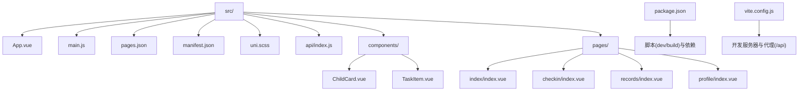
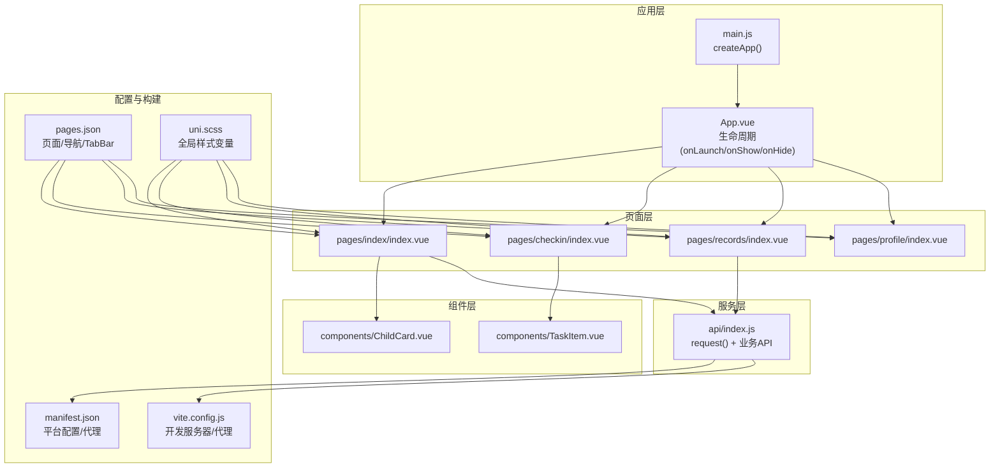
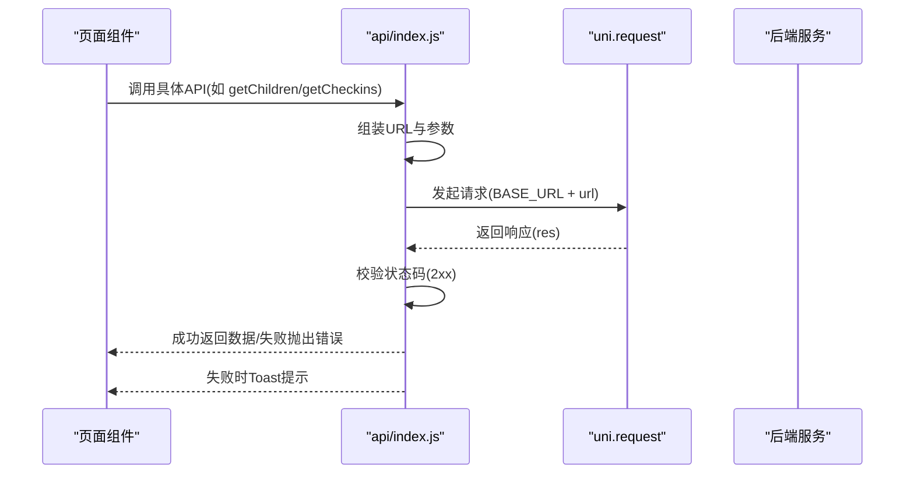
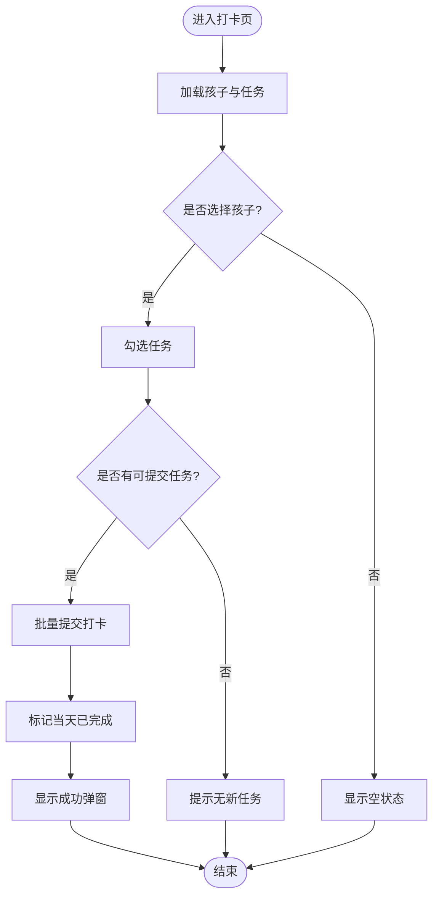
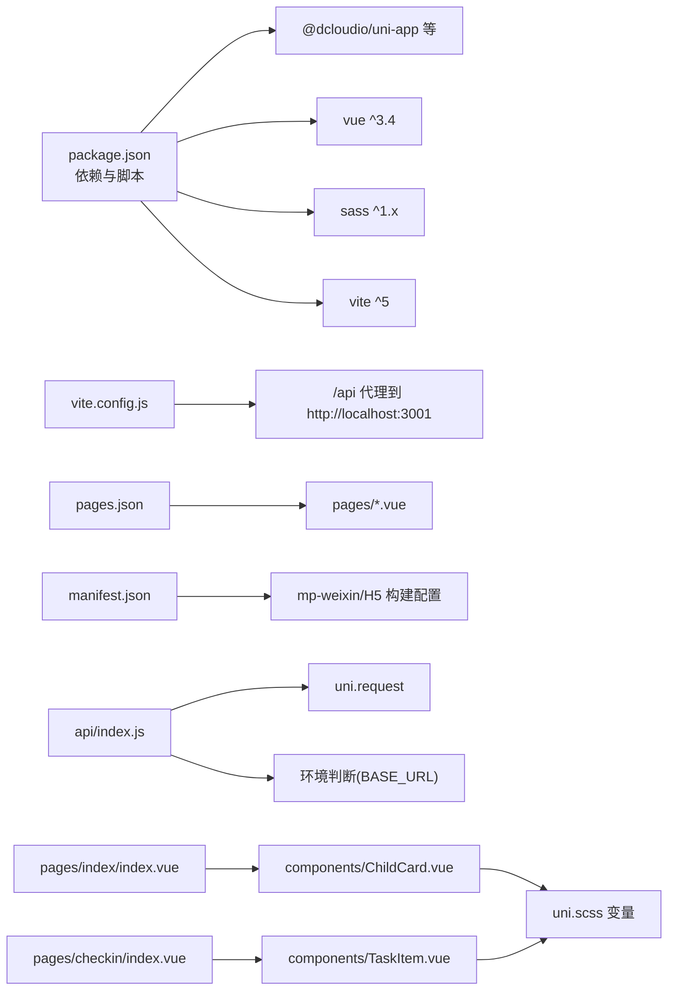

# 小程序端

<cite>
**本文引用的文件**
- [App.vue](file://star-park/miniprogram/src/App.vue)
- [main.js](file://star-park/miniprogram/src/main.js)
- [pages.json](file://star-park/miniprogram/src/pages.json)
- [manifest.json](file://star-park/miniprogram/src/manifest.json)
- [uni.scss](file://star-park/miniprogram/src/uni.scss)
- [api/index.js](file://star-park/miniprogram/src/api/index.js)
- [components/ChildCard.vue](file://star-park/miniprogram/src/components/ChildCard.vue)
- [components/TaskItem.vue](file://star-park/miniprogram/src/components/TaskItem.vue)
- [pages/index/index.vue](file://star-park/miniprogram/src/pages/index/index.vue)
- [pages/checkin/index.vue](file://star-park/miniprogram/src/pages/checkin/index.vue)
- [pages/records/index.vue](file://star-park/miniprogram/src/pages/records/index.vue)
- [pages/profile/index.vue](file://star-park/miniprogram/src/pages/profile/index.vue)
- [package.json](file://star-park/miniprogram/package.json)
- [vite.config.js](file://star-park/miniprogram/vite.config.js)
</cite>

## 目录
1. [简介](#简介)
2. [项目结构](#项目结构)
3. [核心组件](#核心组件)
4. [架构总览](#架构总览)
5. [详细组件分析](#详细组件分析)
6. [依赖关系分析](#依赖关系分析)
7. [性能考虑](#性能考虑)
8. [故障排查指南](#故障排查指南)
9. [结论](#结论)
10. [附录](#附录)

## 简介
本文件面向StarParadise小程序端的前端架构与实现，基于uni-app跨平台框架，聚焦以下主题：
- 应用配置与构建脚本
- 页面结构与路由、导航栏、TabBar
- 组件系统与自定义组件开发规范
- 生命周期管理与页面交互
- API客户端封装、网络请求、错误处理
- 响应式布局与样式体系
- 跨平台兼容与最佳实践

## 项目结构
小程序端位于 star-park/miniprogram，采用uni-app + Vue 3 + Vite的现代前端技术栈，支持微信小程序与H5双端编译输出。

图示来源
- [pages.json:1-54](file://star-park/miniprogram/src/pages.json#L1-L54)
- [manifest.json:1-31](file://star-park/miniprogram/src/manifest.json#L1-L31)
- [main.js:1-8](file://star-park/miniprogram/src/main.js#L1-L8)
- [App.vue:1-26](file://star-park/miniprogram/src/App.vue#L1-L26)
- [uni.scss:1-17](file://star-park/miniprogram/src/uni.scss#L1-L17)
- [api/index.js:1-75](file://star-park/miniprogram/src/api/index.js#L1-L75)
- [components/ChildCard.vue:1-162](file://star-park/miniprogram/src/components/ChildCard.vue#L1-L162)
- [components/TaskItem.vue:1-133](file://star-park/miniprogram/src/components/TaskItem.vue#L1-L133)
- [pages/index/index.vue:1-194](file://star-park/miniprogram/src/pages/index/index.vue#L1-L194)
- [pages/checkin/index.vue:1-322](file://star-park/miniprogram/src/pages/checkin/index.vue#L1-L322)
- [pages/records/index.vue:1-460](file://star-park/miniprogram/src/pages/records/index.vue#L1-L460)
- [pages/profile/index.vue:1-211](file://star-park/miniprogram/src/pages/profile/index.vue#L1-L211)
- [package.json:1-28](file://star-park/miniprogram/package.json#L1-L28)
- [vite.config.js:1-17](file://star-park/miniprogram/vite.config.js#L1-L17)

章节来源
- [package.json:1-28](file://star-park/miniprogram/package.json#L1-L28)
- [vite.config.js:1-17](file://star-park/miniprogram/vite.config.js#L1-L17)
- [pages.json:1-54](file://star-park/miniprogram/src/pages.json#L1-L54)
- [manifest.json:1-31](file://star-park/miniprogram/src/manifest.json#L1-L31)

## 核心组件
- 应用入口与生命周期
  - 应用入口通过 createApp 暴露 SSR 应用实例，供 uni-app 平台调用。
  - App.vue 中注册 onLaunch/onShow/onHide 生命周期钩子，用于全局日志与初始化。
- 页面与TabBar
  - pages.json 定义页面列表、全局导航样式与 TabBar 列表，包含图标路径与选中态图标。
- 样式与主题
  - uni.scss 定义全局SCSS变量，统一颜色、圆角、阴影等设计令牌，便于跨页面复用。
- API客户端
  - api/index.js 封装通用请求方法与业务接口，自动区分H5与小程序环境的BASE_URL，并统一封装错误提示。

章节来源
- [main.js:1-8](file://star-park/miniprogram/src/main.js#L1-L8)
- [App.vue:1-26](file://star-park/miniprogram/src/App.vue#L1-L26)
- [pages.json:1-54](file://star-park/miniprogram/src/pages.json#L1-L54)
- [uni.scss:1-17](file://star-park/miniprogram/src/uni.scss#L1-L17)
- [api/index.js:1-75](file://star-park/miniprogram/src/api/index.js#L1-L75)

## 架构总览
下图展示了从页面到API的典型调用链路，以及组件间的组合关系。

图示来源
- [App.vue:1-26](file://star-park/miniprogram/src/App.vue#L1-L26)
- [main.js:1-8](file://star-park/miniprogram/src/main.js#L1-L8)
- [pages/index/index.vue:1-194](file://star-park/miniprogram/src/pages/index/index.vue#L1-L194)
- [pages/checkin/index.vue:1-322](file://star-park/miniprogram/src/pages/checkin/index.vue#L1-L322)
- [pages/records/index.vue:1-460](file://star-park/miniprogram/src/pages/records/index.vue#L1-L460)
- [pages/profile/index.vue:1-211](file://star-park/miniprogram/src/pages/profile/index.vue#L1-L211)
- [components/ChildCard.vue:1-162](file://star-park/miniprogram/src/components/ChildCard.vue#L1-L162)
- [components/TaskItem.vue:1-133](file://star-park/miniprogram/src/components/TaskItem.vue#L1-L133)
- [api/index.js:1-75](file://star-park/miniprogram/src/api/index.js#L1-L75)
- [pages.json:1-54](file://star-park/miniprogram/src/pages.json#L1-L54)
- [manifest.json:1-31](file://star-park/miniprogram/src/manifest.json#L1-L31)
- [vite.config.js:1-17](file://star-park/miniprogram/vite.config.js#L1-L17)
- [uni.scss:1-17](file://star-park/miniprogram/src/uni.scss#L1-L17)

## 详细组件分析

### 页面与路由、导航栏、TabBar
- 页面声明与导航栏标题
  - pages.json 的 pages 数组定义每个页面路径与导航栏标题；globalStyle 控制全局导航文字色、背景色与页面背景色。
- TabBar 设计
  - tabBar.list 配置每项的 pagePath、文本、图标与选中图标；颜色与边框样式在 tabBar 下统一配置。
- 页面跳转
  - 页面内使用 uni.switchTab 或页面内逻辑控制切换，确保与 TabBar 对齐。

章节来源
- [pages.json:1-54](file://star-park/miniprogram/src/pages.json#L1-L54)

### 生命周期管理
- 应用级生命周期
  - App.vue 注册 onLaunch/onShow/onHide，用于应用启动、显示与隐藏时的日志或初始化。
- 页面级生命周期
  - 各页面在 onMounted/onShow 中触发数据加载，保证进入页面时能及时更新视图。

章节来源
- [App.vue:1-26](file://star-park/miniprogram/src/App.vue#L1-L26)
- [pages/index/index.vue:126-132](file://star-park/miniprogram/src/pages/index/index.vue#L126-L132)
- [pages/checkin/index.vue:265-266](file://star-park/miniprogram/src/pages/checkin/index.vue#L265-L266)
- [pages/records/index.vue:197-203](file://star-park/miniprogram/src/pages/records/index.vue#L197-L203)

### 组件系统与自定义组件
- 组件规范
  - 使用 <script setup> 语法，通过 defineProps/defineEmits 明确输入与事件，提升可维护性。
  - 样式使用 scoped 与 SCSS 变量，避免样式污染并统一风格。
- ChildCard 组件
  - 展示孩子头像、姓名、任务描述、打卡状态、连续天数与余额等信息；支持点击事件透传。
- TaskItem 组件
  - 展示任务名称、描述、奖励，支持勾选与禁用态；点击事件透传给父组件。

章节来源
- [components/ChildCard.vue:1-162](file://star-park/miniprogram/src/components/ChildCard.vue#L1-L162)
- [components/TaskItem.vue:1-133](file://star-park/miniprogram/src/components/TaskItem.vue#L1-L133)

### 数据绑定与事件处理
- 计算属性与响应式
  - 使用 ref/computed 管理页面状态与派生数据（如问候语、日期字符串、汇总统计）。
- 事件处理
  - 子组件通过 $emit 触发事件，父组件接收并更新状态；页面内事件如 tap、toggle 等直接绑定到处理器。

章节来源
- [pages/index/index.vue:43-133](file://star-park/miniprogram/src/pages/index/index.vue#L43-L133)
- [pages/checkin/index.vue:109-163](file://star-park/miniprogram/src/pages/checkin/index.vue#L109-L163)
- [pages/records/index.vue:83-163](file://star-park/miniprogram/src/pages/records/index.vue#L83-L163)

### API客户端封装与网络请求
- 请求封装
  - request(options) 统一封装 uni.request，自动拼接 BASE_URL，统一处理 2xx 成功与失败回调，失败时通过 uni.showToast 提示。
- 环境适配
  - 在浏览器(H5)环境下使用相对路径与Vite代理(/api)，在小程序环境下使用完整URL，确保跨平台可用。
- 业务接口
  - api 对象导出常用接口：仪表盘、孩子列表、打卡记录、创建打卡、统计、奖励、任务、余额、积分、交易等。

图示来源
- [api/index.js:1-75](file://star-park/miniprogram/src/api/index.js#L1-L75)
- [pages/checkin/index.vue:194-241](file://star-park/miniprogram/src/pages/checkin/index.vue#L194-L241)
- [pages/records/index.vue:127-163](file://star-park/miniprogram/src/pages/records/index.vue#L127-L163)

章节来源
- [api/index.js:1-75](file://star-park/miniprogram/src/api/index.js#L1-L75)

### 错误处理与降级
- 统一错误处理
  - request 在 fail 回调中统一提示“网络请求失败”，并在 catch 中 reject，便于上层捕获。
- 页面级降级
  - 页面加载失败时使用默认数据填充，保证用户体验与界面一致性。

章节来源
- [api/index.js:24-29](file://star-park/miniprogram/src/api/index.js#L24-L29)
- [pages/index/index.vue:115-124](file://star-park/miniprogram/src/pages/index/index.vue#L115-L124)
- [pages/checkin/index.vue:220-241](file://star-park/miniprogram/src/pages/checkin/index.vue#L220-L241)
- [pages/records/index.vue:152-163](file://star-park/miniprogram/src/pages/records/index.vue#L152-L163)

### 响应式布局与样式体系
- 设计令牌
  - uni.scss 定义主色、背景、文字、边框、圆角半径、阴影等变量，页面与组件通过变量统一风格。
- rpx 单位
  - 页面与组件普遍使用 rpx，配合 uni.scss 变量与 Flex/Grid 布局，实现移动端适配。
- 组件样式
  - ChildCard/TaskItem 使用 scoped 样式与变量，避免冲突；页面样式按模块化组织，便于维护。

章节来源
- [uni.scss:1-17](file://star-park/miniprogram/src/uni.scss#L1-L17)
- [pages/index/index.vue:135-194](file://star-park/miniprogram/src/pages/index/index.vue#L135-L194)
- [pages/checkin/index.vue:269-322](file://star-park/miniprogram/src/pages/checkin/index.vue#L269-L322)
- [pages/records/index.vue:206-460](file://star-park/miniprogram/src/pages/records/index.vue#L206-L460)

### 页面功能要点

#### 首页(index)
- 功能概览
  - 展示问候语、日期与完成度；渲染多个 ChildCard；底部汇总“最长连续”“本周完成”“总积累”。
- 数据流
  - 通过 api.getDashboard 获取 children，映射为卡片所需字段；onShow/onMounted 触发刷新。
- 导航
  - 点击卡片跳转至打卡页，使用 uni.switchTab 保持 TabBar 一致。

章节来源
- [pages/index/index.vue:1-194](file://star-park/miniprogram/src/pages/index/index.vue#L1-L194)
- [api/index.js:35-37](file://star-park/miniprogram/src/api/index.js#L35-L37)

#### 打卡页(checkin)
- 功能概览
  - 孩子选择器、任务列表、积分奖励入口、统计卡片、成功弹窗与提交打卡。
- 交互流程
  - 选择孩子 -> 加载任务 -> 勾选任务 -> 提交打卡 -> 标记当天已打 -> 弹出成功提示。
- 数据流
  - api.getChildren 初始化 children；api.getCheckins 标记当天已完成任务；api.createCheckin 提交新增打卡。

图示来源
- [pages/checkin/index.vue:109-193](file://star-park/miniprogram/src/pages/checkin/index.vue#L109-L193)
- [api/index.js:39-46](file://star-park/miniprogram/src/api/index.js#L39-L46)

章节来源
- [pages/checkin/index.vue:1-322](file://star-park/miniprogram/src/pages/checkin/index.vue#L1-L322)
- [api/index.js:35-67](file://star-park/miniprogram/src/api/index.js#L35-L67)

#### 记录页(records)
- 功能概览
  - 孩子选择器、余额卡片、礼物进度、日历与打卡明细。
- 日历算法
  - 计算当月第一天是周几，生成空格与日期单元，标记当天与已打卡日期。
- 数据流
  - api.getChildren 初始化 children；api.getCheckins 获取记录并提取当月打卡日期。

章节来源
- [pages/records/index.vue:1-460](file://star-park/miniprogram/src/pages/records/index.vue#L1-L460)
- [api/index.js:39-43](file://star-park/miniprogram/src/api/index.js#L39-L43)

#### 我的页(profile)
- 功能概览
  - 用户头像与简介、菜单项与关于信息；菜单点击统一提示“功能开发中”。

章节来源
- [pages/profile/index.vue:1-211](file://star-park/miniprogram/src/pages/profile/index.vue#L1-L211)

### 跨平台兼容与最佳实践
- 平台配置
  - manifest.json 中针对 mp-weixin 设置 appid、编译选项与 usingComponents；h5.devServer 配置代理转发 /api。
- 开发与构建
  - package.json 提供 dev:mp-weixin、dev:h5、build:mp-weixin、build:h5 脚本；vite.config.js 提供本地代理。
- 环境判断
  - api/index.js 通过 typeof window 判断运行环境，自动选择 BASE_URL，确保 H5 与小程序共用同一套逻辑。
- 样式与布局
  - 使用 rpx 与 uni.scss 变量，结合 Flex/Grid 实现响应式布局；组件样式 scoped，避免全局污染。
- 事件与生命周期
  - 组件间通过 props/emit 解耦；页面在 onMounted/onShow 中加载数据，保证首屏与切回可见时的数据新鲜度。

章节来源
- [manifest.json:1-31](file://star-park/miniprogram/src/manifest.json#L1-L31)
- [package.json:1-28](file://star-park/miniprogram/package.json#L1-L28)
- [vite.config.js:1-17](file://star-park/miniprogram/vite.config.js#L1-L17)
- [api/index.js:1-30](file://star-park/miniprogram/src/api/index.js#L1-L30)

## 依赖关系分析

图示来源
- [package.json:1-28](file://star-park/miniprogram/package.json#L1-L28)
- [vite.config.js:1-17](file://star-park/miniprogram/vite.config.js#L1-L17)
- [pages.json:1-54](file://star-park/miniprogram/src/pages.json#L1-L54)
- [manifest.json:1-31](file://star-park/miniprogram/src/manifest.json#L1-L31)
- [api/index.js:1-75](file://star-park/miniprogram/src/api/index.js#L1-L75)
- [components/ChildCard.vue:1-162](file://star-park/miniprogram/src/components/ChildCard.vue#L1-L162)
- [components/TaskItem.vue:1-133](file://star-park/miniprogram/src/components/TaskItem.vue#L1-L133)
- [pages/index/index.vue:1-194](file://star-park/miniprogram/src/pages/index/index.vue#L1-L194)
- [pages/checkin/index.vue:1-322](file://star-park/miniprogram/src/pages/checkin/index.vue#L1-L322)

章节来源
- [package.json:1-28](file://star-park/miniprogram/package.json#L1-L28)
- [vite.config.js:1-17](file://star-park/miniprogram/vite.config.js#L1-L17)
- [pages.json:1-54](file://star-park/miniprogram/src/pages.json#L1-L54)
- [manifest.json:1-31](file://star-park/miniprogram/src/manifest.json#L1-L31)
- [api/index.js:1-75](file://star-park/miniprogram/src/api/index.js#L1-L75)

## 性能考虑
- 数据加载时机
  - 在 onMounted/onShow 中拉取数据，避免阻塞首屏渲染；对高频页面可考虑本地缓存与节流。
- 组件渲染
  - 合理使用 computed 与响应式引用，减少不必要重渲染；列表渲染时使用 v-for 与稳定 key。
- 网络请求
  - 统一错误提示与失败回退，避免页面空白；对重复请求进行去重或合并。
- 样式体积
  - 使用 uni.scss 变量集中管理样式，减少重复定义；组件样式 scoped，避免全局样式膨胀。
- 构建优化
  - 生产构建开启压缩与按需打包；H5 代理仅在开发阶段启用，避免影响生产环境。

## 故障排查指南
- 网络请求失败
  - 现象：页面无数据或出现“网络请求失败”提示。
  - 排查：检查 BASE_URL 与环境判断；确认后端服务地址与端口；查看代理配置是否正确。
- 打卡提交异常
  - 现象：点击打卡无反应或提示失败。
  - 排查：确认当前是否有新任务需要提交；检查 createCheckin 接口返回；查看日志与 Toast 提示。
- TabBar 图标不显示
  - 现象：TabBar 图标缺失或未选中。
  - 排查：核对 pages.json 中 iconPath/selectedIconPath 路径；确保静态资源存在且路径正确。
- 页面切换异常
  - 现象：切换页面后数据未刷新。
  - 排查：确认 onShow 中是否重新加载数据；检查页面 key 与状态重置逻辑。

章节来源
- [api/index.js:24-29](file://star-park/miniprogram/src/api/index.js#L24-L29)
- [pages/checkin/index.vue:165-193](file://star-park/miniprogram/src/pages/checkin/index.vue#L165-L193)
- [pages.json:16-53](file://star-park/miniprogram/src/pages.json#L16-L53)

## 结论
本项目以 uni-app 为核心，结合 Vue 3 Composition API 与 SCSS 变量体系，实现了清晰的页面结构、可复用的组件系统与统一的网络请求封装。通过 pages.json 与 manifest.json 的配置，兼顾了微信小程序与 H5 的跨平台需求。建议在后续迭代中进一步完善缓存策略、错误监控与埋点上报，持续优化首屏性能与交互体验。

## 附录
- 开发与构建命令
  - 开发(微信小程序): npm run dev:mp-weixin
  - 开发(H5): npm run dev:h5
  - 构建(微信小程序): npm run build:mp-weixin
  - 构建(H5): npm run build:h5
- 代理配置
  - H5 开发服务器将 /api 代理到 http://localhost:3001，确保前后端联调顺畅。

章节来源
- [package.json:4-8](file://star-park/miniprogram/package.json#L4-L8)
- [vite.config.js:6-15](file://star-park/miniprogram/vite.config.js#L6-L15)
- [manifest.json:19-29](file://star-park/miniprogram/src/manifest.json#L19-L29)