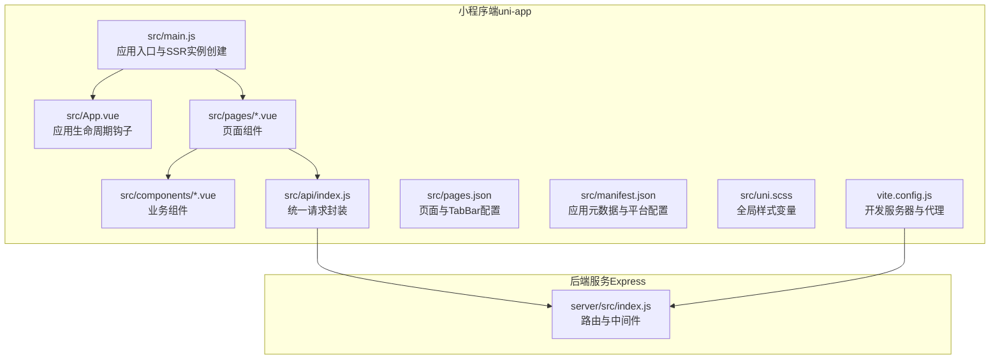
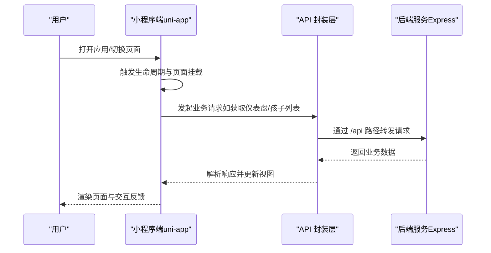
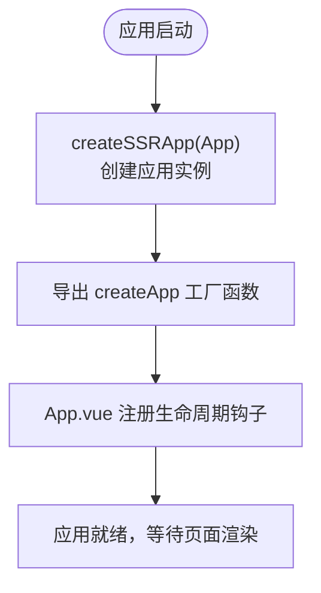
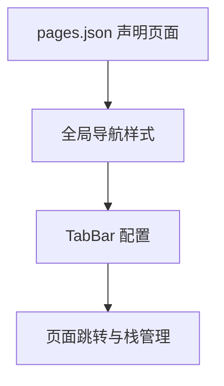
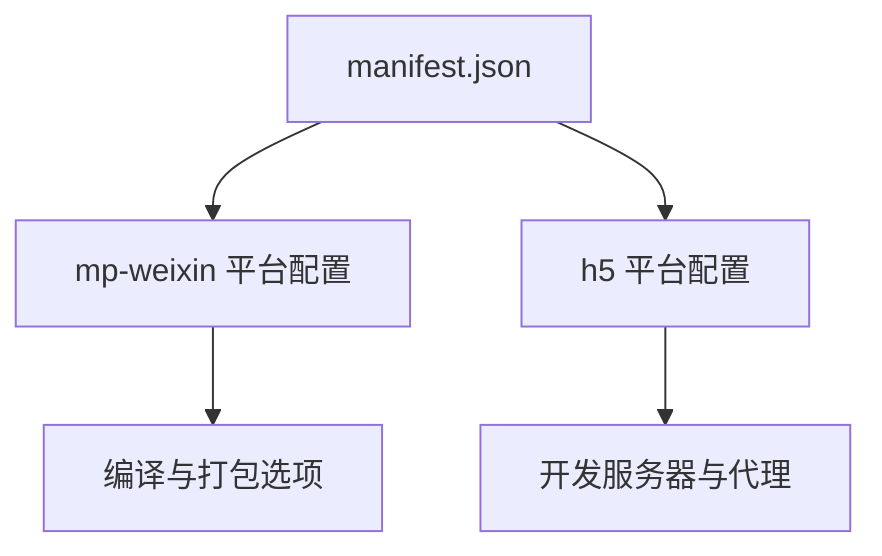
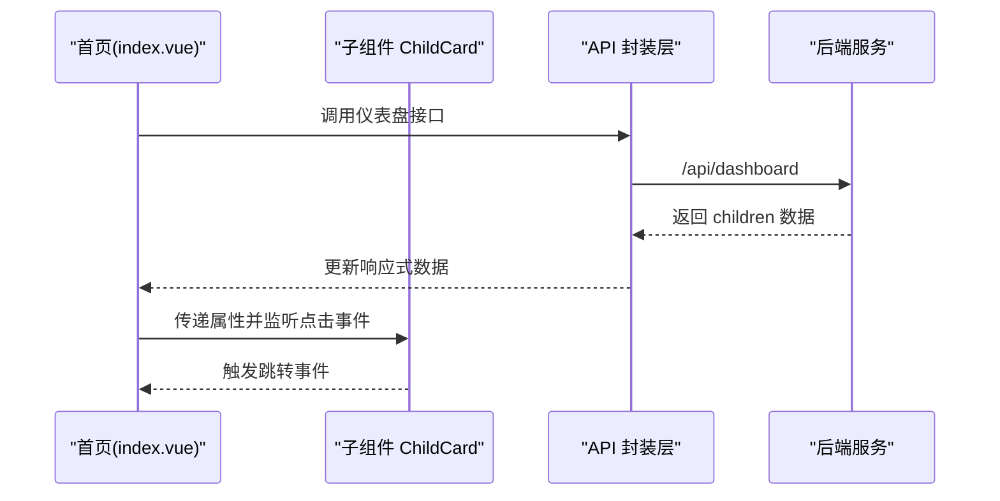
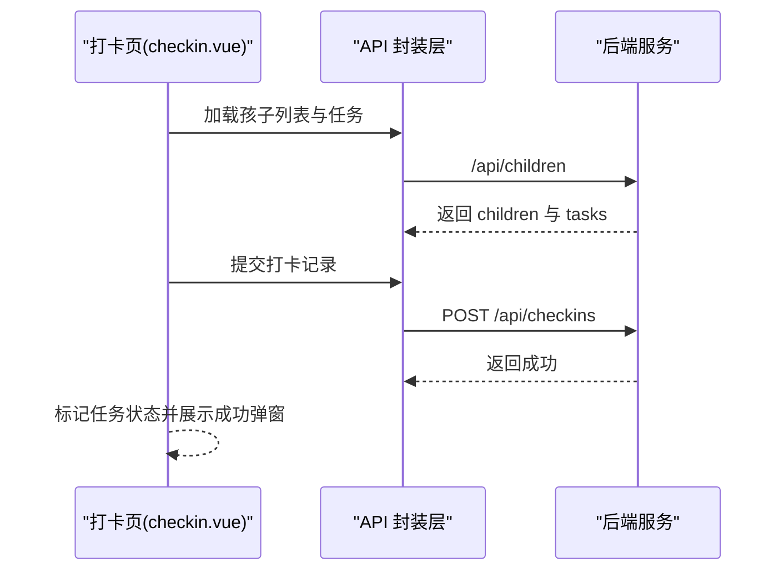
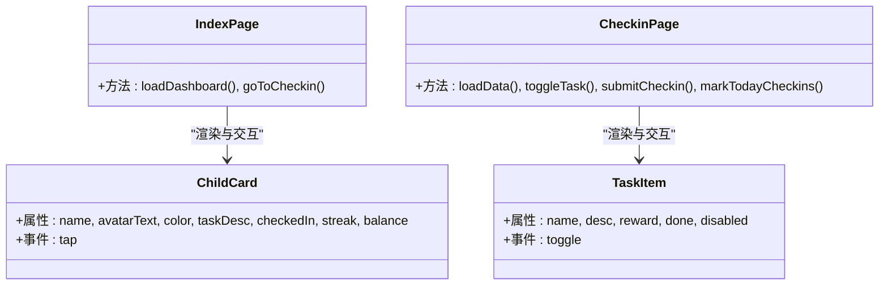
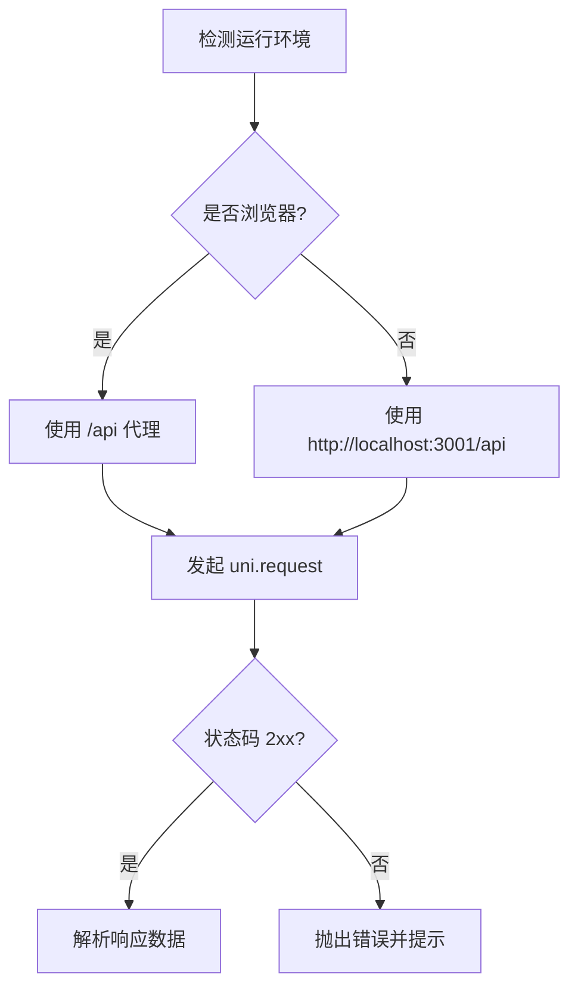
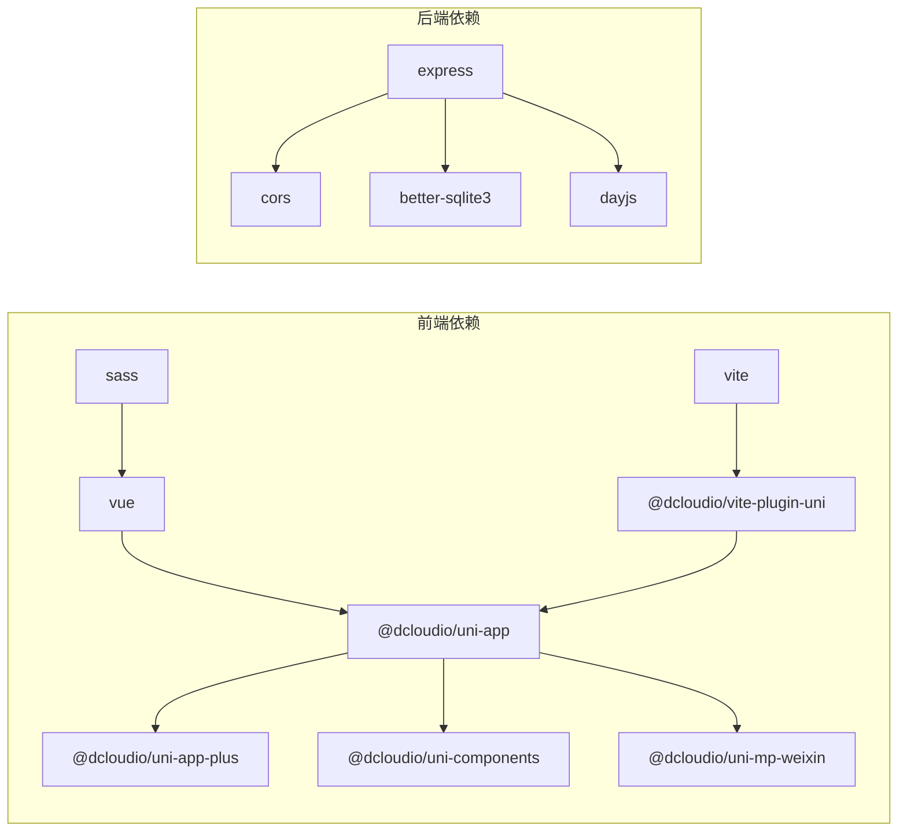

# 应用架构设计

<cite>
**本文引用的文件**
- [App.vue](file://star-park/miniprogram/src/App.vue)
- [main.js](file://star-park/miniprogram/src/main.js)
- [manifest.json](file://star-park/miniprogram/src/manifest.json)
- [pages.json](file://star-park/miniprogram/src/pages.json)
- [package.json](file://star-park/miniprogram/src/package.json)
- [index.vue（首页）](file://star-park/miniprogram/src/pages/index/index.vue)
- [index.vue（打卡页）](file://star-park/miniprogram/src/pages/checkin/index.vue)
- [ChildCard.vue](file://star-park/miniprogram/src/components/ChildCard.vue)
- [TaskItem.vue](file://star-park/miniprogram/src/components/TaskItem.vue)
- [vite.config.js](file://star-park/miniprogram/vite.config.js)
- [uni.scss](file://star-park/miniprogram/src/uni.scss)
- [api/index.js](file://star-park/miniprogram/src/api/index.js)
- [server/index.js](file://star-park/server/src/index.js)
- [server/package.json](file://star-park/server/package.json)
</cite>

## 目录
1. [引言](#引言)
2. [项目结构](#项目结构)
3. [核心组件](#核心组件)
4. [架构总览](#架构总览)
5. [详细组件分析](#详细组件分析)
6. [依赖关系分析](#依赖关系分析)
7. [性能考虑](#性能考虑)
8. [故障排查指南](#故障排查指南)
9. [结论](#结论)
10. [附录](#附录)

## 引言
本文件系统性梳理 StarParadise 小程序应用的整体架构与实现细节，围绕 uni-app 框架初始化、应用实例创建、全局配置管理、Vue 3 在小程序环境下的运行机制、SSR 应用创建模式、应用生命周期管理、manifest.json 配置、页面路由与 TabBar、全局状态与插件、国际化与多语言扩展建议、以及前后端联调与性能优化策略展开。文档同时提供架构图、时序图与流程图，帮助开发者快速理解并高效迭代。

## 项目结构
该工程采用“多端同构 + 平台适配”的组织方式：前端以 uni-app 为核心，分别面向微信小程序与 H5；后端以 Express 提供 REST API；构建工具采用 Vite + @dcloudio/vite-plugin-uni 插件。关键目录与职责如下：
- star-park/miniprogram/src：小程序端源码，包含页面、组件、全局样式、API 封装与配置文件
- star-park/server/src：后端服务，提供 REST 接口与数据库访问
- star-park/miniprogram/vite.config.js：开发服务器与代理配置
- 文档与脚本：docs、scripts、harness 等用于设计说明、开发规范与运维支持

图表来源
- [main.js:1-8](file://star-park/miniprogram/src/main.js#L1-L8)
- [App.vue:1-26](file://star-park/miniprogram/src/App.vue#L1-L26)
- [pages.json:1-54](file://star-park/miniprogram/src/pages.json#L1-L54)
- [manifest.json:1-31](file://star-park/miniprogram/src/manifest.json#L1-L31)
- [uni.scss:1-17](file://star-park/miniprogram/src/uni.scss#L1-L17)
- [vite.config.js:1-17](file://star-park/miniprogram/vite.config.js#L1-L17)
- [api/index.js:1-75](file://star-park/miniprogram/src/api/index.js#L1-L75)
- [server/index.js:1-42](file://star-park/server/src/index.js#L1-L42)

章节来源
- [package.json:1-28](file://star-park/miniprogram/src/package.json#L1-L28)

## 核心组件
- 应用入口与实例创建：通过 createSSRApp 创建 Vue 应用实例，并导出 createApp 工厂函数，满足 uni-app 的运行时要求
- 应用生命周期：在 App.vue 中注册 onLaunch/onShow/onHide 生命周期，用于应用级日志与全局行为
- 页面与组件：首页与打卡页承载主要业务逻辑；ChildCard、TaskItem 等组件复用性强，便于维护
- API 层：统一封装 request 与各接口方法，自动区分 H5 与小程序环境的请求地址
- 构建与开发：Vite 配置开发服务器与 /api 代理，连接本地后端服务

章节来源
- [main.js:1-8](file://star-park/miniprogram/src/main.js#L1-L8)
- [App.vue:1-26](file://star-park/miniprogram/src/App.vue#L1-L26)
- [ChildCard.vue:1-162](file://star-park/miniprogram/src/components/ChildCard.vue#L1-L162)
- [TaskItem.vue:1-133](file://star-park/miniprogram/src/components/TaskItem.vue#L1-L133)
- [api/index.js:1-75](file://star-park/miniprogram/src/api/index.js#L1-L75)
- [vite.config.js:1-17](file://star-park/miniprogram/vite.config.js#L1-L17)

## 架构总览
下图展示了从前端 uni-app 应用到后端 Express 服务的端到端交互路径，包括页面渲染、组件交互、API 请求与数据持久化。

图表来源
- [index.vue（首页）:100-124](file://star-park/miniprogram/src/pages/index/index.vue#L100-L124)
- [index.vue（打卡页）:194-241](file://star-park/miniprogram/src/pages/checkin/index.vue#L194-L241)
- [api/index.js:7-30](file://star-park/miniprogram/src/api/index.js#L7-L30)
- [server/index.js:20-27](file://star-park/server/src/index.js#L20-L27)

## 详细组件分析

### uni-app 初始化与应用实例创建
- 初始化流程
  - 通过 createSSRApp(App) 创建应用实例，返回 { app } 工厂函数，满足 uni-app 运行时约定
  - App.vue 注册应用生命周期钩子，处理启动、显示与隐藏事件
- SSR 应用创建模式
  - 采用 createSSRApp 作为统一入口，确保在多端（小程序/H5）的一致性
  - 通过 manifest.json 与 pages.json 定义平台元数据与页面结构

图表来源
- [main.js:4-7](file://star-park/miniprogram/src/main.js#L4-L7)
- [App.vue:4-14](file://star-park/miniprogram/src/App.vue#L4-L14)

章节来源
- [main.js:1-8](file://star-park/miniprogram/src/main.js#L1-L8)
- [App.vue:1-26](file://star-park/miniprogram/src/App.vue#L1-L26)

### 页面与路由（pages.json）
- 页面声明：pages.json 中声明所有页面路径与导航栏标题
- 全局样式：统一导航栏文字颜色、背景色与页面背景色
- TabBar：定义底部导航项、图标、选中态与跳转路径

图表来源
- [pages.json:2-53](file://star-park/miniprogram/src/pages.json#L2-L53)

章节来源
- [pages.json:1-54](file://star-park/miniprogram/src/pages.json#L1-L54)

### 应用元数据与平台配置（manifest.json）
- 基本信息：名称、描述、版本号、px 转换开关
- 平台特定配置：
  - 微信小程序：appid、编译设置（ES6、增强、PostCSS、压缩）、是否启用自定义组件
  - H5：开发服务器端口与 /api 代理，指向本地后端服务
- 作用：决定打包产物、编译选项与运行时行为

图表来源
- [manifest.json:8-29](file://star-park/miniprogram/src/manifest.json#L8-L29)

章节来源
- [manifest.json:1-31](file://star-park/miniprogram/src/manifest.json#L1-L31)

### 页面组件与业务逻辑（首页与打卡页）
- 首页（index/index.vue）
  - 问候语与日期计算、统计数据聚合（最长连续、本周完成率、总余额）
  - 子组件 ChildCard 列表展示，点击跳转至打卡页
  - 数据加载：onMounted 与 onShow 双重触发，保证页面可见即刷新
- 打卡页（checkin/index.vue）
  - 孩子选择器、任务列表、积分奖励入口、统计卡片
  - 任务勾选与提交：校验可提交状态、批量创建打卡记录、展示成功弹窗
  - 当日已打记录标记：拉取当日打卡记录并标记任务状态

图表来源
- [index.vue（首页）:100-132](file://star-park/miniprogram/src/pages/index/index.vue#L100-L132)
- [ChildCard.vue:32-42](file://star-park/miniprogram/src/components/ChildCard.vue#L32-L42)
- [api/index.js:37-37](file://star-park/miniprogram/src/api/index.js#L37-L37)

图表来源
- [index.vue（打卡页）:194-266](file://star-park/miniprogram/src/pages/checkin/index.vue#L194-L266)
- [api/index.js:39-46](file://star-park/miniprogram/src/api/index.js#L39-L46)
- [server/index.js:23-23](file://star-park/server/src/index.js#L23-L23)

章节来源
- [index.vue（首页）:1-194](file://star-park/miniprogram/src/pages/index/index.vue#L1-L194)
- [index.vue（打卡页）:1-322](file://star-park/miniprogram/src/pages/checkin/index.vue#L1-L322)

### 组件库与交互（ChildCard 与 TaskItem）
- ChildCard：头像、姓名、任务描述、打卡状态徽标、连续天数与余额统计
- TaskItem：任务名称、描述、奖励、勾选状态与禁用态、点击切换
- 两者均采用 scoped 样式与 SCSS 变量，保持视觉一致性

图表来源
- [ChildCard.vue:32-42](file://star-park/miniprogram/src/components/ChildCard.vue#L32-L42)
- [TaskItem.vue:22-35](file://star-park/miniprogram/src/components/TaskItem.vue#L22-L35)
- [index.vue（首页）:93-97](file://star-park/miniprogram/src/pages/index/index.vue#L93-L97)
- [index.vue（打卡页）:152-155](file://star-park/miniprogram/src/pages/checkin/index.vue#L152-L155)

章节来源
- [ChildCard.vue:1-162](file://star-park/miniprogram/src/components/ChildCard.vue#L1-L162)
- [TaskItem.vue:1-133](file://star-park/miniprogram/src/components/TaskItem.vue#L1-L133)

### API 封装与跨端适配
- 环境判断：通过运行时判断是否为浏览器环境，决定请求前缀（/api 或 http://localhost:3001/api）
- 统一错误处理：封装 request 方法，集中处理状态码与失败回调，统一提示网络异常
- 接口清单：涵盖仪表盘、孩子、打卡、统计、奖励、积分、余额与交易等

图表来源
- [api/index.js:1-30](file://star-park/miniprogram/src/api/index.js#L1-L30)

章节来源
- [api/index.js:1-75](file://star-park/miniprogram/src/api/index.js#L1-L75)

### 开发服务器与代理（Vite）
- 主机与端口：host 为 0.0.0.0，port 默认 5173
- 代理规则：将 /api 前缀转发到 http://localhost:3001，便于本地联调
- 与 manifest.json 的 h5.devServer 配置协同工作

章节来源
- [vite.config.js:1-17](file://star-park/miniprogram/vite.config.js#L1-L17)
- [manifest.json:19-29](file://star-park/miniprogram/src/manifest.json#L19-L29)

### 全局样式与主题变量（uni.scss）
- 定义主色、浅色主色、背景、文本、边框、圆角半径与阴影等变量
- 页面与组件通过 $primary、$text、$radius-* 等变量统一风格

章节来源
- [uni.scss:1-17](file://star-park/miniprogram/src/uni.scss#L1-L17)

### 后端服务（Express）
- 中间件：CORS 与 JSON 解析
- 路由：children、tasks、checkins、rewards、stats、points 等模块化路由
- 健康检查：/api/health
- 启动：监听端口并打印服务地址

章节来源
- [server/index.js:1-42](file://star-park/server/src/index.js#L1-L42)
- [server/package.json:1-15](file://star-park/server/package.json#L1-L15)

## 依赖关系分析
- 前端依赖
  - 运行时：vue、@dcloudio/uni-app、@dcloudio/uni-app-plus、@dcloudio/uni-components、@dcloudio/uni-mp-weixin
  - 构建：@dcloudio/vite-plugin-uni、vite、sass
- 后端依赖
  - express、better-sqlite3、cors、dayjs

图表来源
- [package.json:10-26](file://star-park/miniprogram/src/package.json#L10-L26)
- [server/package.json:8-13](file://star-park/server/package.json#L8-L13)

章节来源
- [package.json:1-28](file://star-park/miniprogram/src/package.json#L1-L28)
- [server/package.json:1-15](file://star-park/server/package.json#L1-L15)

## 性能考虑
- 页面懒加载与按需渲染：仅在 onMounted/onShow 时加载数据，避免无谓请求
- 本地状态缓存：对已加载的数据进行本地缓存，减少重复请求
- 图标与资源：TabBar 图标与静态资源放置于 static 目录，减小包体
- 编译优化：开启微信小程序的 ES6、增强、PostCSS、压缩等选项，提升运行效率
- 代理与网络：开发阶段使用 /api 代理，减少跨域与额外域名解析开销
- 样式体积：通过 uni.scss 统一样式变量，避免重复定义导致的体积膨胀

## 故障排查指南
- 网络请求失败
  - 现象：调用 API 失败或无响应
  - 排查：确认 /api 代理是否生效、后端服务是否启动、端口是否冲突
  - 参考：[api/index.js:24-27](file://star-park/miniprogram/src/api/index.js#L24-L27)、[vite.config.js:9-14](file://star-park/miniprogram/vite.config.js#L9-L14)、[server/index.js:38-41](file://star-park/server/src/index.js#L38-L41)
- 页面无法跳转或 TabBar 不显示
  - 现象：点击无反应或 TabBar 缺失
  - 排查：核对 pages.json 的 pagePath 与 tabBar.list 配置
  - 参考：[pages.json:21-52](file://star-park/miniprogram/src/pages.json#L21-L52)
- 微信小程序编译报错
  - 现象：ES6/增强/PostCSS 等设置导致编译失败
  - 排查：检查 manifest.json 中 setting 字段与项目依赖版本
  - 参考：[manifest.json:10-16](file://star-park/miniprogram/src/manifest.json#L10-L16)
- H5 开发环境无法访问后端
  - 现象：浏览器控制台出现跨域或 404
  - 排查：确认 vite 代理 /api 与后端端口一致
  - 参考：[vite.config.js:9-14](file://star-park/miniprogram/vite.config.js#L9-L14)、[manifest.json:20-28](file://star-park/miniprogram/src/manifest.json#L20-L28)

章节来源
- [api/index.js:24-27](file://star-park/miniprogram/src/api/index.js#L24-L27)
- [vite.config.js:9-14](file://star-park/miniprogram/vite.config.js#L9-L14)
- [pages.json:21-52](file://star-park/miniprogram/src/pages.json#L21-L52)
- [manifest.json:10-16](file://star-park/miniprogram/src/manifest.json#L10-L16)
- [server/index.js:38-41](file://star-park/server/src/index.js#L38-L41)

## 结论
本项目基于 uni-app 实现了跨小程序与 H5 的统一应用架构，通过清晰的页面与组件分层、统一的 API 封装、完善的 manifest/pages 配置以及前后端联调方案，实现了稳定的功能交付与良好的开发体验。后续可在全局状态管理、国际化与多语言扩展、性能监控与埋点等方面进一步完善。

## 附录
- 国际化与多语言扩展建议
  - 使用 vue-i18n 或自定义语言包管理器，结合 pages.json 的导航栏标题与组件文案进行多语言切换
  - 将日期格式化、数字单位等本地化内容集中管理，避免硬编码
- 全局状态管理
  - 建议引入 Pinia（已在依赖中）管理跨页面共享状态，如当前选中的孩子、登录态等
- 插件注册机制
  - 通过 main.js 的 createApp 工厂函数注册插件与全局指令/过滤器，确保在所有页面可用
- 构建与发布
  - 使用 package.json 中的脚本命令进行开发与构建，确保微信小程序与 H5 平台的差异化配置正确