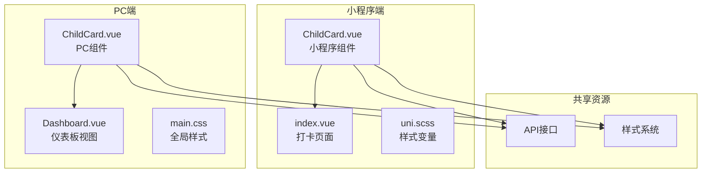
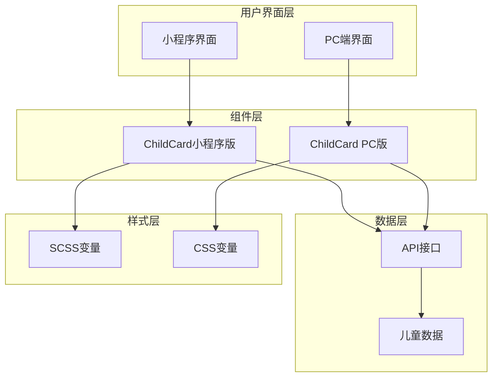
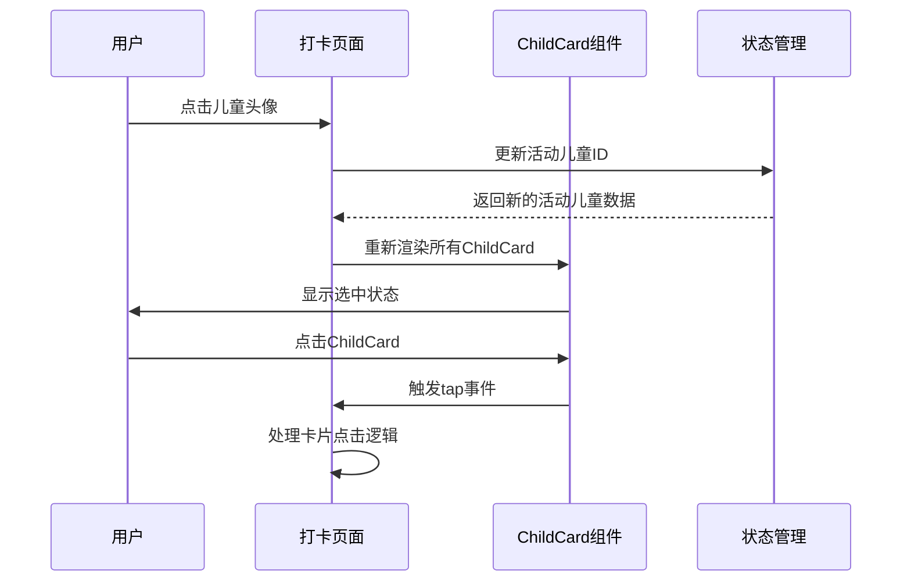
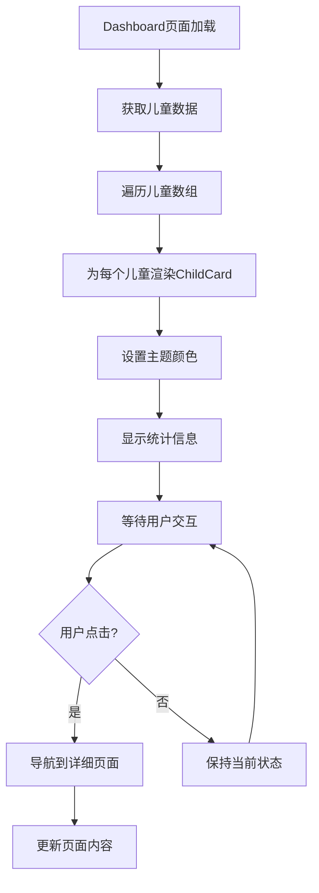
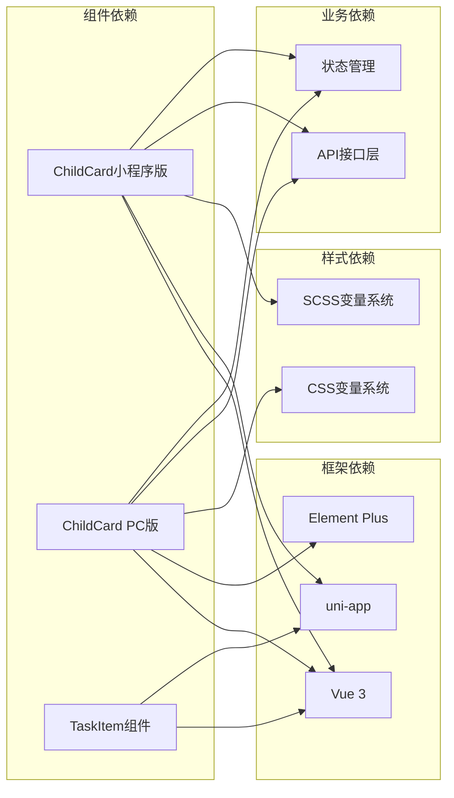
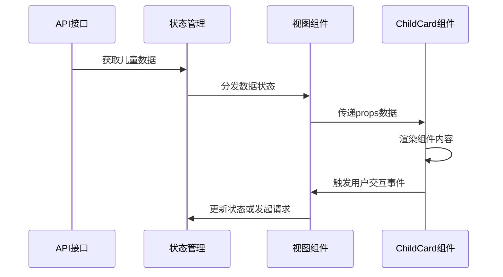

# ChildCard组件

<cite>
**本文档引用的文件**
- [ChildCard.vue（小程序）](file://star-park/miniprogram/src/components/ChildCard.vue)
- [ChildCard.vue（PC端）](file://star-park/pc-admin/src/components/ChildCard.vue)
- [index.vue（打卡页面）](file://star-park/miniprogram/src/pages/checkin/index.vue)
- [Dashboard.vue（PC端仪表板）](file://star-park/pc-admin/src/views/Dashboard.vue)
- [uni.scss（样式变量）](file://star-park/miniprogram/src/uni.scss)
- [main.css（PC端样式）](file://star-park/pc-admin/src/styles/main.css)
</cite>

## 目录
1. [简介](#简介)
2. [项目结构](#项目结构)
3. [核心组件](#核心组件)
4. [架构概览](#架构概览)
5. [详细组件分析](#详细组件分析)
6. [依赖关系分析](#依赖关系分析)
7. [性能考虑](#性能考虑)
8. [故障排除指南](#故障排除指南)
9. [结论](#结论)

## 简介

ChildCard组件是StarParadise小程序中的核心展示组件，专门用于展示儿童信息和相关统计数据。该组件在小程序端和PC端都有不同的实现版本，但都遵循统一的设计理念：提供清晰的信息层次结构，突出关键统计数据，并支持交互式操作。

该组件主要服务于家长和管理员，帮助他们快速了解每个孩子的学习进度、打卡状态和奖励情况。通过直观的视觉设计和响应式的布局，组件能够适应不同设备和屏幕尺寸的需求。

## 项目结构

ChildCard组件在项目中采用跨平台架构设计，分别针对小程序端和PC端进行了优化：

**图表来源**
- [ChildCard.vue（小程序）:1-162](file://star-park/miniprogram/src/components/ChildCard.vue#L1-L162)
- [ChildCard.vue（PC端）:1-161](file://star-park/pc-admin/src/components/ChildCard.vue#L1-L161)
- [index.vue（打卡页面）:1-322](file://star-park/miniprogram/src/pages/checkin/index.vue#L1-L322)
- [Dashboard.vue（PC端仪表板）:1-146](file://star-park/pc-admin/src/views/Dashboard.vue#L1-L146)

**章节来源**
- [ChildCard.vue（小程序）:1-162](file://star-park/miniprogram/src/components/ChildCard.vue#L1-L162)
- [ChildCard.vue（PC端）:1-161](file://star-park/pc-admin/src/components/ChildCard.vue#L1-L161)
- [uni.scss:1-17](file://star-park/miniprogram/src/uni.scss#L1-L17)
- [main.css:1-164](file://star-park/pc-admin/src/styles/main.css#L1-L164)

## 核心组件

### 小程序端ChildCard组件

小程序端的ChildCard组件是一个轻量级的Vue单文件组件，专注于提供简洁的信息展示功能：

**主要特性：**
- 响应式布局，适配不同屏幕尺寸
- 可定制的颜色主题系统
- 清晰的信息层次结构
- 轻量级的交互设计

**核心功能模块：**
1. **头像显示系统** - 支持个性化头像和颜色主题
2. **打卡状态标识** - 实时显示孩子的打卡完成状态
3. **统计数据面板** - 展示连续打卡天数和累计余额
4. **颜色条装饰** - 提供视觉焦点和品牌识别

**章节来源**
- [ChildCard.vue（小程序）:1-162](file://star-park/miniprogram/src/components/ChildCard.vue#L1-L162)

### PC端ChildCard组件

PC端的ChildCard组件基于Vue 3和Element Plus构建，提供了更丰富的功能和更好的用户体验：

**主要特性：**
- 响应式网格布局
- 进度条可视化展示
- 点击交互和路由导航
- 高级统计信息展示

**核心功能模块：**
1. **卡片式布局** - 使用现代化的卡片设计
2. **进度可视化** - 本周完成率的图形化展示
3. **点击导航** - 支持跳转到详细余额页面
4. **动态样式** - 基于颜色变量的主题定制

**章节来源**
- [ChildCard.vue（PC端）:1-161](file://star-park/pc-admin/src/components/ChildCard.vue#L1-L161)

## 架构概览

ChildCard组件在整个StarParadise应用中扮演着重要的角色，作为数据展示层的核心组件：

**图表来源**
- [index.vue（打卡页面）:10-15](file://star-park/miniprogram/src/pages/checkin/index.vue#L10-L15)
- [Dashboard.vue（PC端仪表板）:9-17](file://star-park/pc-admin/src/views/Dashboard.vue#L9-L17)
- [ChildCard.vue（小程序）:31-42](file://star-park/miniprogram/src/components/ChildCard.vue#L31-L42)
- [ChildCard.vue（PC端）:49-81](file://star-park/pc-admin/src/components/ChildCard.vue#L49-L81)

## 详细组件分析

### 小程序端ChildCard组件详解

#### Props属性定义

小程序端的ChildCard组件通过defineProps定义了以下属性：

| 属性名 | 类型 | 默认值 | 描述 |
|--------|------|--------|------|
| name | String | '' | 孩子姓名，用于显示在卡片头部 |
| avatarText | String | '' | 头像文本，通常是姓名首字母 |
| color | String | '#19C8B9' | 主题颜色，影响头像和装饰条颜色 |
| taskDesc | String | '' | 任务描述，显示在姓名下方 |
| checkedIn | Boolean | false | 打卡状态，true表示已完成打卡 |
| streak | Number/String | 0 | 连续打卡天数 |
| balance | String | '¥0' | 累计余额，格式为'¥X' |

#### 事件处理机制

组件通过`@tap="$emit('tap')"`实现了简单的点击事件处理，允许父组件监听卡片点击事件并执行相应的操作。

#### 视觉设计元素

**颜色条系统：**
- 高6rpx的水平条形装饰
- 完全填充容器宽度
- 颜色由color属性控制

**头像系统：**
- 72rpx正方形头像区域
- 圆角50%设计
- 白色粗体大写字母文本
- 背景色与主题色一致

**徽章系统：**
- 悬挂式标签设计
- 圆角胶囊形状
- "✓ 已打卡"/"待打卡"状态显示
- 不同状态使用不同样式

**统计卡片：**
- 两列等宽布局
- 数值使用32rpx粗体字体
- 标签使用22rpx细体字体
- 顶部边框分隔线

#### 状态管理

小程序端的ChildCard组件采用静态状态管理：
- 通过props接收外部数据
- 通过事件向父组件传递交互信号
- 内部不维护复杂的状态逻辑

#### 样式系统

组件使用SCSS预处理器，结合uni-app的样式变量系统：

**变量系统：**
- `$primary`: 主色调 #19C8B9
- `$radius-card`: 卡片圆角 16rpx
- `$shadow-card`: 卡片阴影效果
- `$text`: 主要文字颜色
- `$text-light`: 次要文字颜色

**响应式设计：**
- 使用rpx单位确保移动端适配
- 弹性布局配合gap间距
- 流式布局适应不同屏幕尺寸

**章节来源**
- [ChildCard.vue（小程序）:31-42](file://star-park/miniprogram/src/components/ChildCard.vue#L31-L42)
- [ChildCard.vue（小程序）:45-161](file://star-park/miniprogram/src/components/ChildCard.vue#L45-L161)
- [uni.scss:1-17](file://star-park/miniprogram/src/uni.scss#L1-L17)

### PC端ChildCard组件详解

#### Props属性定义

PC端的ChildCard组件通过defineProps定义了更丰富的属性：

| 属性名 | 类型 | 默认值 | 描述 |
|--------|------|--------|------|
| child | Object | {} | 完整的儿童数据对象 |
| color | String | '#19C8B9' | 主题颜色，影响整体样式 |

#### 计算属性系统

PC端组件使用computed属性进行数据转换和计算：

**关键计算属性：**
- `checkedIn`: 基于child.todayCheckedIn计算的打卡状态
- `weekRate`: 基于child.weekRate计算的完成率
- `cardStyle`: 动态计算的卡片样式对象
- `avatarStyle`: 动态计算的头像样式对象

#### 交互功能

PC端组件提供了更丰富的交互体验：

**点击导航：**
- 累计余额数值支持点击跳转
- 使用Vue Router进行页面导航
- 点击后跳转到余额详情页面

**进度可视化：**
- 使用Element Plus的el-progress组件
- 动态百分比显示本周完成率
- 自定义颜色和样式配置

#### 视觉设计元素

**卡片布局：**
- 最小宽度240px的弹性布局
- 顶部3px彩色边框装饰
- 标准的卡片圆角和阴影

**信息层次：**
- 头像区域：44px正方形，圆角12px
- 姓名区域：17px字体，600字重
- 年级区域：13px字体，浅色显示

**统计信息：**
- 今日打卡：布尔状态显示
- 连续打卡：数字加"天"单位
- 本周完成率：进度条可视化
- 累计余额：加粗显示，颜色跟随主题
- 总积分：可点击数值，橙色显示

**章节来源**
- [ChildCard.vue（PC端）:49-81](file://star-park/pc-admin/src/components/ChildCard.vue#L49-L81)
- [main.css:1-164](file://star-park/pc-admin/src/styles/main.css#L1-L164)

### 组件使用场景

#### 小程序端使用场景

ChildCard组件在小程序中主要用于打卡页面的儿童选择区域：

**图表来源**
- [index.vue（打卡页面）:148-150](file://star-park/miniprogram/src/pages/checkin/index.vue#L148-L150)

#### PC端使用场景

在PC端，ChildCard组件主要用于仪表板的儿童信息展示：

**图表来源**
- [Dashboard.vue（PC端仪表板）:9-17](file://star-park/pc-admin/src/views/Dashboard.vue#L9-L17)

**章节来源**
- [index.vue（打卡页面）:1-322](file://star-park/miniprogram/src/pages/checkin/index.vue#L1-L322)
- [Dashboard.vue（PC端仪表板）:1-146](file://star-park/pc-admin/src/views/Dashboard.vue#L1-L146)

## 依赖关系分析

ChildCard组件的依赖关系体现了项目的模块化设计理念：

**图表来源**
- [ChildCard.vue（小程序）:1-162](file://star-park/miniprogram/src/components/ChildCard.vue#L1-L162)
- [ChildCard.vue（PC端）:1-161](file://star-park/pc-admin/src/components/ChildCard.vue#L1-L161)
- [index.vue（打卡页面）:112-114](file://star-park/miniprogram/src/pages/checkin/index.vue#L112-L114)

### 样式系统依赖

两个版本的ChildCard组件都依赖于各自平台的样式系统：

**小程序端依赖：**
- uni.scss中的全局变量定义
- rpx单位确保移动端适配
- SCSS编译支持

**PC端依赖：**
- CSS自定义属性系统
- Element Plus组件库
- 响应式布局系统

### 数据流依赖

ChildCard组件的数据流展示了从API到UI的完整路径：

**图表来源**
- [index.vue（打卡页面）:194-241](file://star-park/miniprogram/src/pages/checkin/index.vue#L194-L241)
- [Dashboard.vue（PC端仪表板）:76-91](file://star-park/pc-admin/src/views/Dashboard.vue#L76-L91)

**章节来源**
- [ChildCard.vue（小程序）:1-162](file://star-park/miniprogram/src/components/ChildCard.vue#L1-L162)
- [ChildCard.vue（PC端）:1-161](file://star-park/pc-admin/src/components/ChildCard.vue#L1-L161)
- [index.vue（打卡页面）:1-322](file://star-park/miniprogram/src/pages/checkin/index.vue#L1-L322)
- [Dashboard.vue（PC端仪表板）:1-146](file://star-park/pc-admin/src/views/Dashboard.vue#L1-L146)

## 性能考虑

### 小程序端性能优化

**渲染优化：**
- 使用静态模板减少运行时计算
- 合理使用v-if/v-show控制条件渲染
- 避免不必要的数据绑定和计算

**内存管理：**
- 及时清理事件监听器
- 合理使用watcher避免内存泄漏
- 控制组件实例数量

**网络优化：**
- 缓存API响应数据
- 合并频繁的API调用
- 使用节流和防抖处理用户输入

### PC端性能优化

**组件优化：**
- 使用computed属性缓存计算结果
- 合理使用v-memo提升渲染性能
- 避免深度嵌套的响应式数据

**样式优化：**
- 使用CSS变量减少重绘
- 合理使用transform替代position
- 避免复杂的CSS选择器

**交互优化：**
- 使用requestAnimationFrame优化动画
- 合理使用虚拟滚动处理大量数据
- 实现懒加载和延迟初始化

### 最佳实践建议

**代码组织：**
- 将通用逻辑提取到工具函数
- 使用组合式API保持代码复用
- 合理拆分大型组件

**错误处理：**
- 实现完善的异常捕获机制
- 提供友好的错误提示
- 实现自动重试和降级策略

**测试覆盖：**
- 编写单元测试验证核心逻辑
- 实现集成测试确保组件协作
- 使用端到端测试验证用户流程

## 故障排除指南

### 常见问题及解决方案

**样式问题：**
- 颜色不生效：检查CSS变量是否正确导入
- 响应式布局异常：验证rpx单位使用是否正确
- 字体显示问题：确认字体文件是否正确加载

**数据问题：**
- props数据为空：检查父组件数据传递逻辑
- 计算属性异常：验证依赖数据的完整性
- 事件处理失效：确认事件监听器是否正确绑定

**性能问题：**
- 渲染卡顿：检查是否有过多的DOM操作
- 内存泄漏：审查组件生命周期钩子
- 网络请求超时：实现合理的重试机制

### 调试技巧

**开发工具：**
- 使用Vue DevTools检查组件状态
- 利用浏览器开发者工具分析样式
- 通过Network面板监控API请求

**日志记录：**
- 在关键节点添加console.log
- 实现结构化的错误报告
- 使用性能分析工具定位瓶颈

**单元测试：**
- 编写针对props的测试用例
- 验证事件触发的正确性
- 测试边界条件和异常情况

**章节来源**
- [ChildCard.vue（小程序）:1-162](file://star-park/miniprogram/src/components/ChildCard.vue#L1-L162)
- [ChildCard.vue（PC端）:1-161](file://star-park/pc-admin/src/components/ChildCard.vue#L1-L161)

## 结论

ChildCard组件作为StarParadise项目的核心展示组件，展现了优秀的跨平台设计和实现。通过小程序端和PC端的不同实现方式，组件既满足了移动端的简洁需求，又提供了PC端的丰富功能。

**设计亮点：**
- 统一的设计语言在不同平台上保持一致性
- 灵活的主题系统支持品牌定制
- 清晰的信息层次便于用户理解
- 响应式布局适应多设备环境

**技术优势：**
- 模块化的代码结构便于维护和扩展
- 完善的类型定义和默认值处理
- 优雅的样式系统和主题定制能力
- 良好的性能表现和用户体验

**未来发展方向：**
- 增强无障碍访问支持
- 优化国际化和本地化能力
- 扩展更多统计维度和可视化选项
- 提升组件的可配置性和扩展性

ChildCard组件的成功实现为整个StarParadise项目奠定了坚实的基础，为后续的功能扩展和用户体验优化提供了良好的技术支撑。