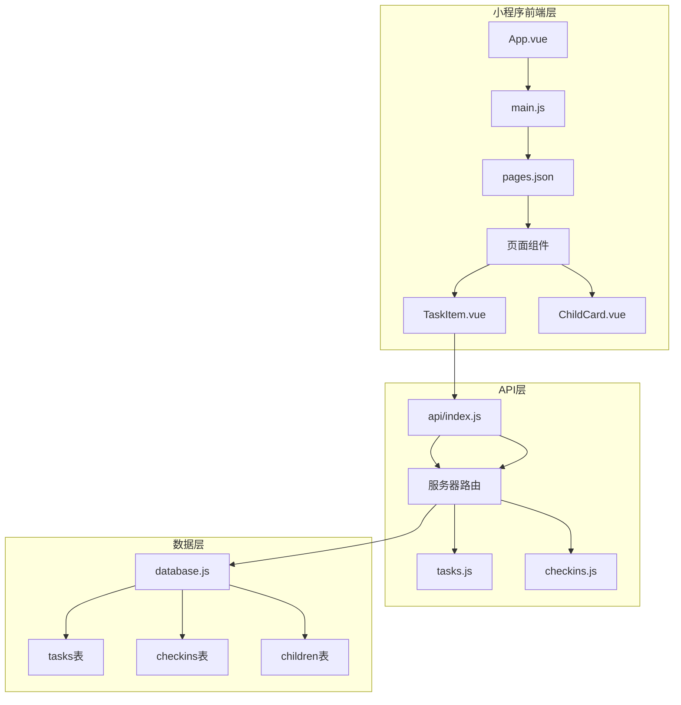
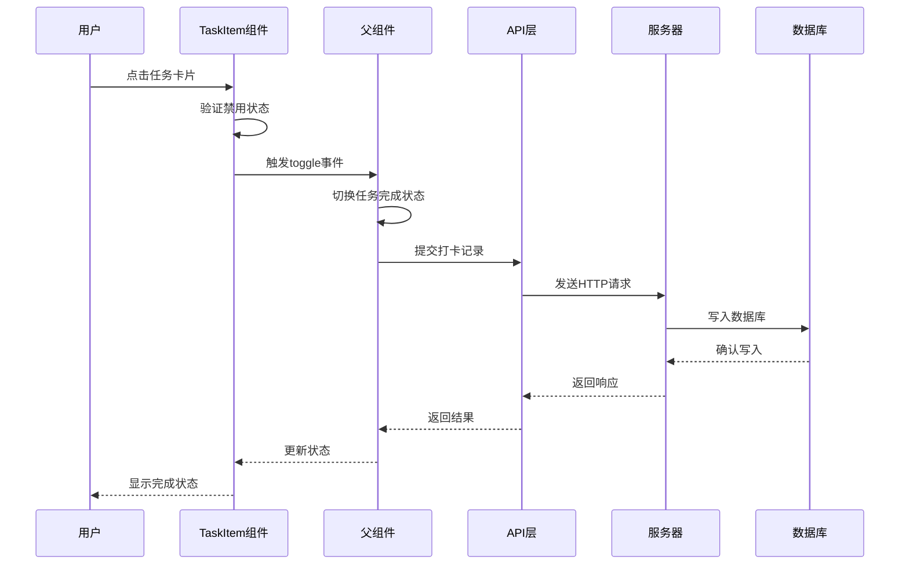
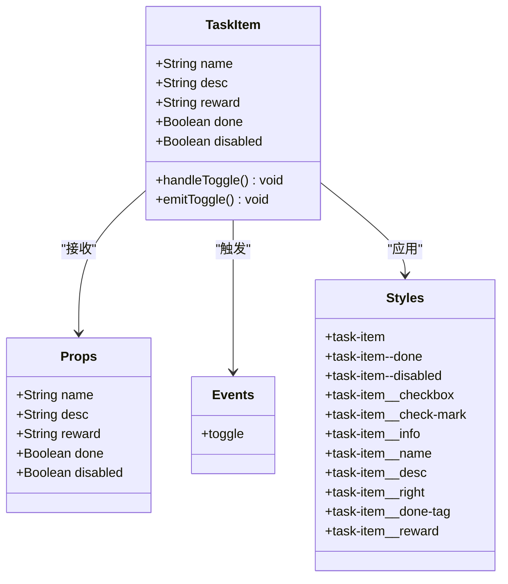
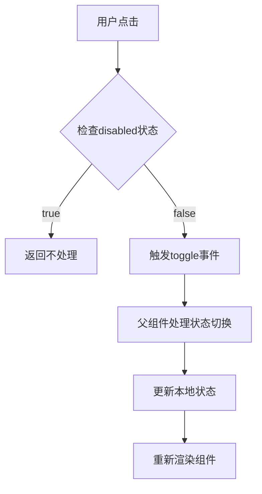
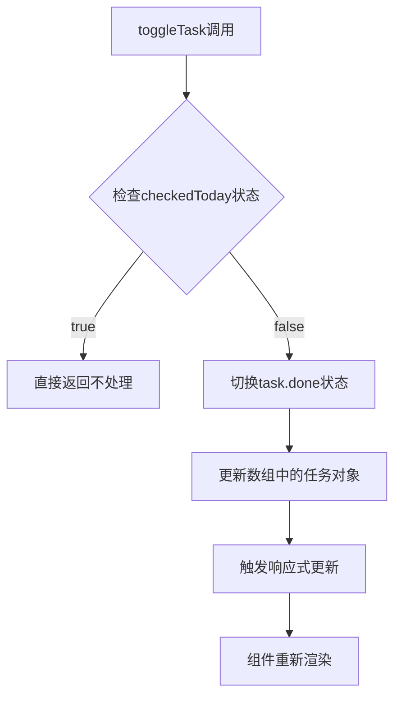
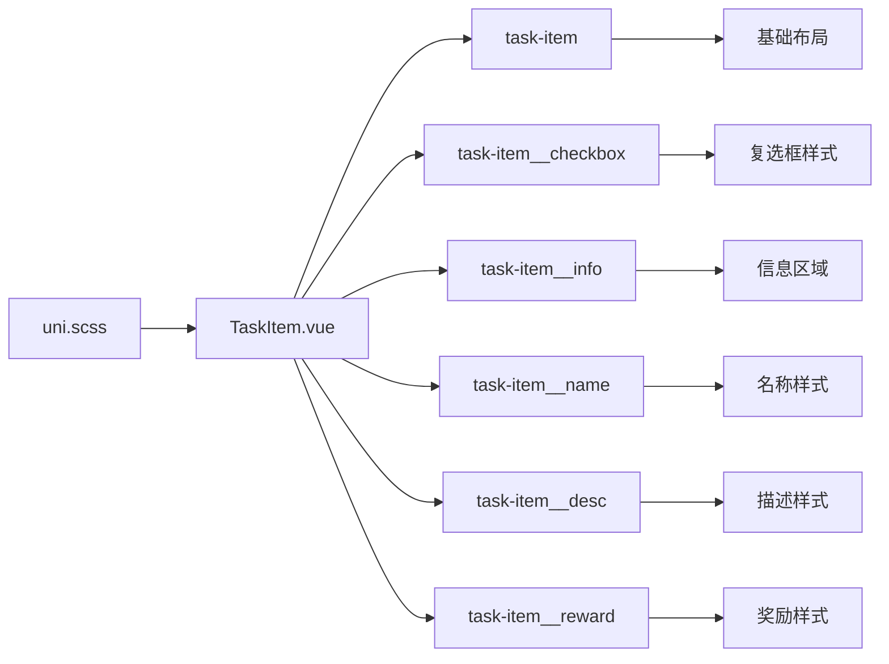
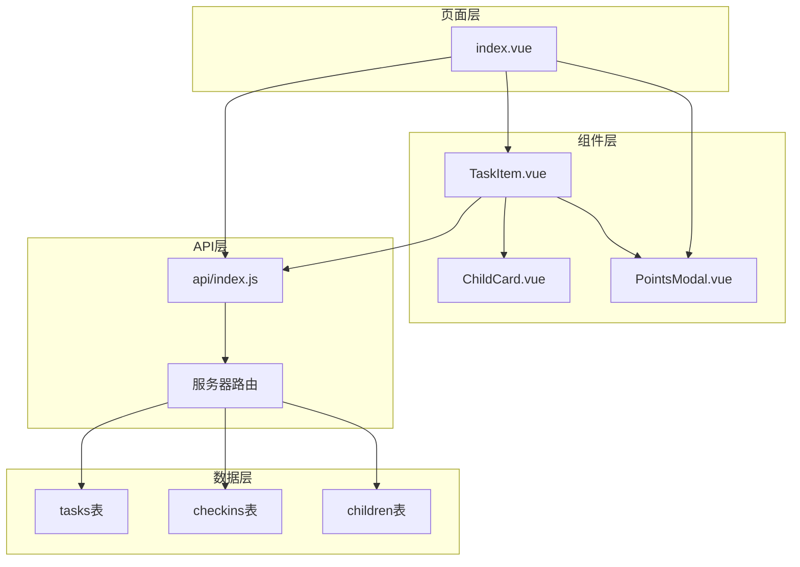

# TaskItem组件

<cite>
**本文档引用的文件**
- [TaskItem.vue](file://star-park/miniprogram/src/components/TaskItem.vue)
- [index.vue](file://star-park/miniprogram/src/pages/checkin/index.vue)
- [index.js](file://star-park/miniprogram/src/api/index.js)
- [tasks.js](file://star-park/server/src/routes/tasks.js)
- [database.js](file://star-park/server/src/database.js)
- [uni.scss](file://star-park/miniprogram/src/uni.scss)
- [main.js](file://star-park/miniprogram/src/main.js)
- [App.vue](file://star-park/miniprogram/src/App.vue)
- [pages.json](file://star-park/miniprogram/src/pages.json)
- [ChildCard.vue](file://star-park/miniprogram/src/components/ChildCard.vue)
</cite>

## 目录
1. [简介](#简介)
2. [项目结构](#项目结构)
3. [核心组件](#核心组件)
4. [架构概览](#架构概览)
5. [详细组件分析](#详细组件分析)
6. [依赖分析](#依赖分析)
7. [性能考虑](#性能考虑)
8. [故障排除指南](#故障排除指南)
9. [结论](#结论)

## 简介

TaskItem组件是StarParadise小程序中的核心UI组件，专门用于展示和管理儿童每日任务。该组件采用Vue 3 Composition API编写，实现了任务状态的可视化展示、用户交互处理和状态同步功能。组件设计简洁直观，提供了清晰的任务完成状态指示和奖励展示功能，是整个打卡系统的重要组成部分。

该组件在项目中承担着以下关键职责：
- 展示单个任务的详细信息（名称、描述、奖励）
- 提供任务完成状态的视觉反馈
- 处理用户的点击交互并触发相应的业务逻辑
- 与父组件进行数据通信和状态同步

## 项目结构

StarParadise项目采用模块化架构设计，TaskItem组件位于组件层，与页面层和API层形成清晰的分层结构：

**图表来源**
- [TaskItem.vue:1-133](file://star-park/miniprogram/src/components/TaskItem.vue#L1-L133)
- [index.vue:1-322](file://star-park/miniprogram/src/pages/checkin/index.vue#L1-L322)
- [index.js:1-75](file://star-park/miniprogram/src/api/index.js#L1-L75)

**章节来源**
- [TaskItem.vue:1-133](file://star-park/miniprogram/src/components/TaskItem.vue#L1-L133)
- [index.vue:1-322](file://star-park/miniprogram/src/pages/checkin/index.vue#L1-L322)
- [pages.json:1-54](file://star-park/miniprogram/src/pages.json#L1-L54)

## 核心组件

### 组件设计目的

TaskItem组件的核心设计理念是提供直观、易用的任务管理界面，通过视觉化的方式帮助儿童和家长跟踪日常任务完成情况。组件采用了卡片式设计，结合渐变色彩和阴影效果，营造出温馨友好的用户体验。

### 主要功能特性

1. **任务信息展示**：显示任务名称、描述和奖励信息
2. **状态可视化**：通过不同的视觉样式表示任务完成状态
3. **交互响应**：支持点击操作，提供即时的视觉反馈
4. **状态同步**：与父组件保持数据一致性
5. **禁用控制**：防止重复打卡的保护机制

**章节来源**
- [TaskItem.vue:21-36](file://star-park/miniprogram/src/components/TaskItem.vue#L21-L36)
- [TaskItem.vue:38-132](file://star-park/miniprogram/src/components/TaskItem.vue#L38-L132)

## 架构概览

TaskItem组件在整个系统架构中扮演着重要的桥梁角色，连接着UI层、业务逻辑层和数据持久层：

**图表来源**
- [TaskItem.vue:32-35](file://star-park/miniprogram/src/components/TaskItem.vue#L32-L35)
- [index.vue:152-155](file://star-park/miniprogram/src/pages/checkin/index.vue#L152-L155)
- [index.vue:174-191](file://star-park/miniprogram/src/pages/checkin/index.vue#L174-L191)

## 详细组件分析

### 组件结构分析

TaskItem组件采用Vue 3的组合式API（Composition API）编写，具有清晰的结构层次：

**图表来源**
- [TaskItem.vue:21-36](file://star-park/miniprogram/src/components/TaskItem.vue#L21-L36)
- [TaskItem.vue:38-132](file://star-park/miniprogram/src/components/TaskItem.vue#L38-L132)

### Props属性定义详解

组件通过defineProps定义了五个核心属性，每个属性都有明确的类型定义和默认值：

| 属性名 | 类型 | 默认值 | 描述 | 使用场景 |
|--------|------|--------|------|----------|
| name | String | '' | 任务名称 | 显示任务标题 |
| desc | String | '' | 任务描述 | 提供任务详情说明 |
| reward | String | '' | 奖励信息 | 展示完成任务的奖励 |
| done | Boolean | false | 完成状态 | 控制任务完成样式 |
| disabled | Boolean | false | 禁用状态 | 防止重复打卡 |

### 事件处理机制

组件通过defineEmits定义了toggle事件，实现了父子组件间的通信：

**图表来源**
- [TaskItem.vue:32-35](file://star-park/miniprogram/src/components/TaskItem.vue#L32-L35)
- [index.vue:152-155](file://star-park/miniprogram/src/pages/checkin/index.vue#L152-L155)

### 任务状态切换逻辑

在父组件中，任务状态的切换逻辑通过toggleTask方法实现：

**图表来源**
- [index.vue:152-155](file://star-park/miniprogram/src/pages/checkin/index.vue#L152-L155)

### 交互设计与视觉反馈

组件采用了多层次的视觉反馈机制：

1. **基础样式**：白色背景、圆角边框、阴影效果
2. **完成状态**：透明度降低、文字删除线、颜色变淡
3. **禁用状态**：灰色背景、半透明效果
4. **选中状态**：绿色主题色填充、对勾图标

### 样式系统分析

组件使用SCSS预处理器，结合全局样式变量实现统一的视觉风格：

**图表来源**
- [TaskItem.vue:38-132](file://star-park/miniprogram/src/components/TaskItem.vue#L38-L132)
- [uni.scss:1-17](file://star-park/miniprogram/src/uni.scss#L1-L17)

**章节来源**
- [TaskItem.vue:21-36](file://star-park/miniprogram/src/components/TaskItem.vue#L21-L36)
- [TaskItem.vue:38-132](file://star-park/miniprogram/src/components/TaskItem.vue#L38-L132)
- [index.vue:152-155](file://star-park/miniprogram/src/pages/checkin/index.vue#L152-L155)

## 依赖分析

### 组件间依赖关系

TaskItem组件在项目中的依赖关系如下：

**图表来源**
- [TaskItem.vue:112](file://star-park/miniprogram/src/pages/checkin/index.vue#L112)
- [index.vue:112-114](file://star-park/miniprogram/src/pages/checkin/index.vue#L112-L114)

### 外部依赖

组件依赖于以下外部库和框架：

- **Vue 3.4+**：提供响应式系统和组合式API
- **@dcloudio/uni-app**：跨平台小程序开发框架
- **SCSS**：CSS预处理器，支持嵌套语法和变量
- **better-sqlite3**：SQLite数据库驱动（服务器端）

**章节来源**
- [TaskItem.vue:1-133](file://star-park/miniprogram/src/components/TaskItem.vue#L1-L133)
- [index.js:10-17](file://star-park/miniprogram/src/api/index.js#L10-L17)
- [database.js:1-111](file://star-park/server/src/database.js#L1-L111)

## 性能考虑

### 渲染优化

1. **响应式更新**：利用Vue 3的响应式系统，只更新发生变化的部分
2. **条件渲染**：根据任务状态动态显示或隐藏元素
3. **事件防抖**：避免频繁的状态切换导致的性能问题

### 内存管理

1. **组件卸载**：确保组件销毁时清理相关资源
2. **事件监听**：避免内存泄漏的事件监听器
3. **数据绑定**：合理使用v-model和计算属性

### 网络性能

1. **批量操作**：将多个任务的打卡操作合并处理
2. **缓存策略**：合理使用本地缓存减少网络请求
3. **错误处理**：优雅处理网络异常情况

## 故障排除指南

### 常见问题及解决方案

1. **任务无法切换状态**
   - 检查disabled属性是否被设置
   - 验证父组件的toggle事件处理逻辑
   - 确认任务对象的done属性正确更新

2. **样式显示异常**
   - 检查SCSS编译是否正常
   - 验证样式类名是否正确应用
   - 确认全局样式变量定义

3. **数据不同步**
   - 检查响应式数据绑定
   - 验证事件冒泡和传播
   - 确认数组引用的正确性

### 调试技巧

1. **开发者工具**：使用微信开发者工具进行调试
2. **日志输出**：在关键节点添加console.log语句
3. **断点调试**：设置断点观察数据变化

**章节来源**
- [TaskItem.vue:32-35](file://star-park/miniprogram/src/components/TaskItem.vue#L32-L35)
- [index.vue:152-155](file://star-park/miniprogram/src/pages/checkin/index.vue#L152-L155)

## 结论

TaskItem组件作为StarParadise小程序的核心UI组件，展现了优秀的组件设计原则和实现质量。组件通过清晰的职责分离、合理的状态管理和完善的交互设计，为用户提供了直观易用的任务管理体验。

### 设计优势

1. **模块化设计**：组件职责单一，易于维护和测试
2. **响应式架构**：充分利用Vue 3的响应式特性
3. **视觉一致性**：统一的样式系统和设计语言
4. **扩展性强**：良好的接口设计便于功能扩展

### 技术亮点

1. **组合式API**：采用Vue 3最新开发模式
2. **类型安全**：严格的Props类型定义
3. **事件通信**：清晰的父子组件通信机制
4. **样式隔离**：Scoped样式确保样式独立性

该组件为整个StarParadise项目奠定了坚实的基础，其设计理念和实现方式值得在类似的教育类应用中借鉴和学习。