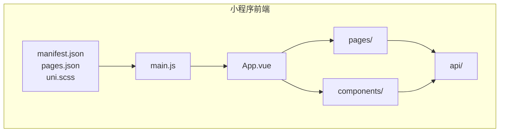
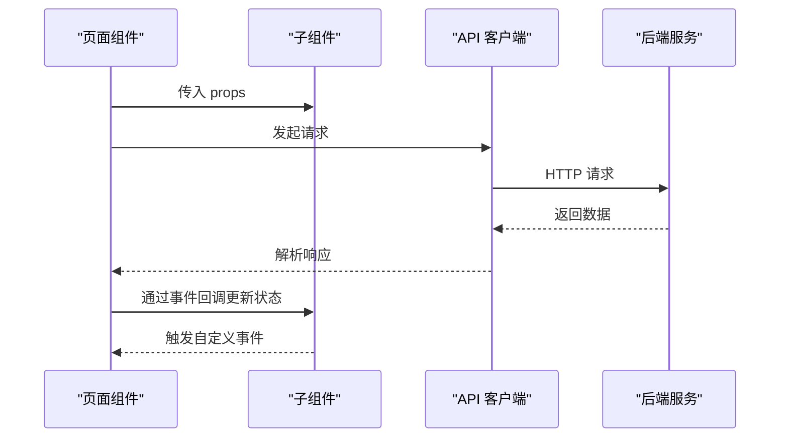
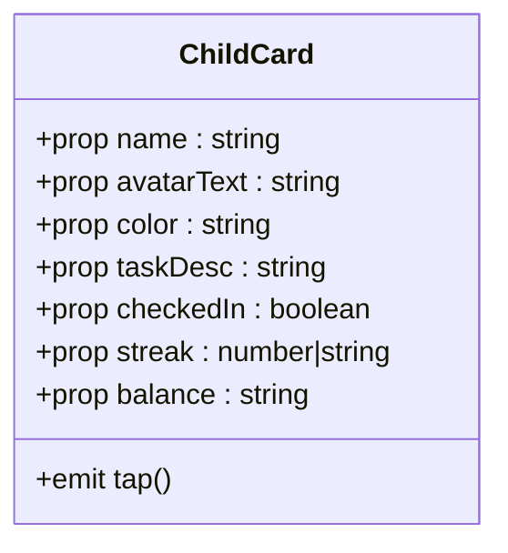
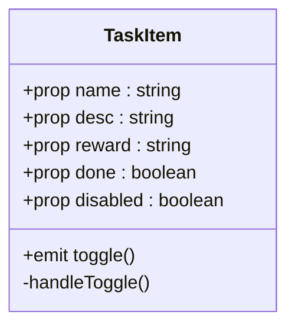
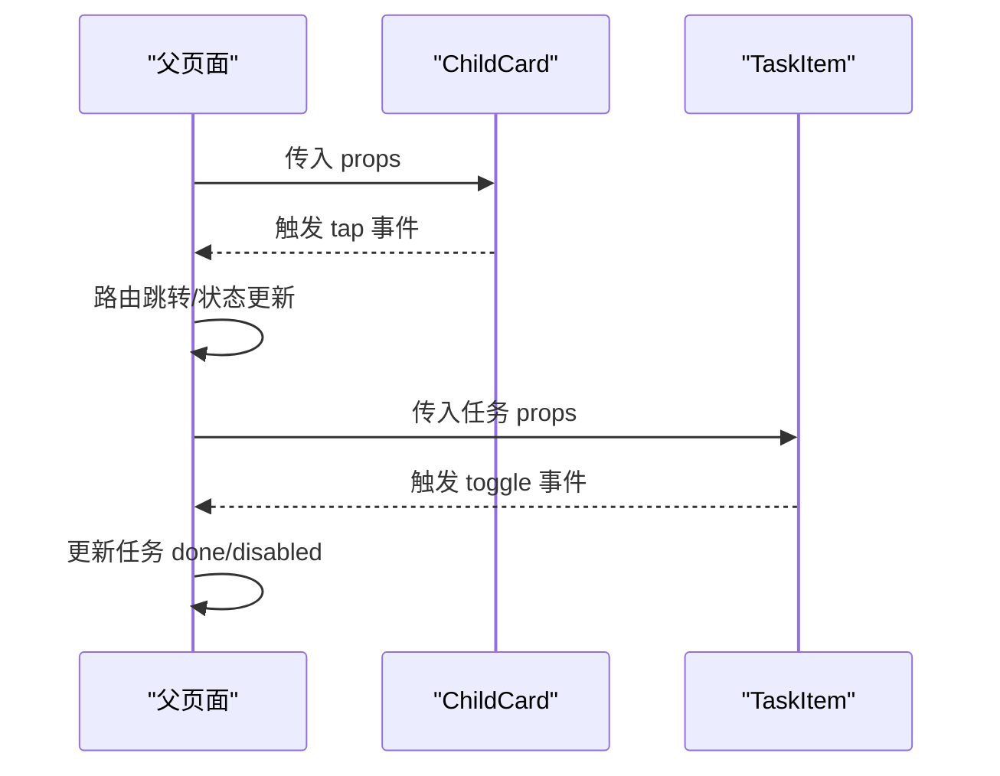
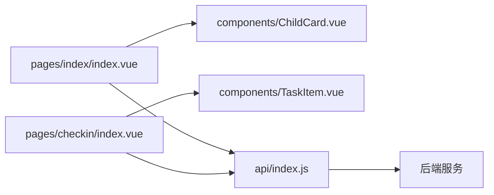

# 组件开发规范

<cite>
**本文引用的文件**
- [ChildCard.vue](file://star-park/miniprogram/src/components/ChildCard.vue)
- [TaskItem.vue](file://star-park/miniprogram/src/components/TaskItem.vue)
- [index.vue（首页）](file://star-park/miniprogram/src/pages/index/index.vue)
- [index.vue（打卡页）](file://star-park/miniprogram/src/pages/checkin/index.vue)
- [App.vue](file://star-park/miniprogram/src/App.vue)
- [main.js](file://star-park/miniprogram/src/main.js)
- [manifest.json](file://star-park/miniprogram/src/manifest.json)
- [pages.json](file://star-park/miniprogram/src/pages.json)
- [uni.scss](file://star-park/miniprogram/src/uni.scss)
- [index.js（API 客户端）](file://star-park/miniprogram/src/api/index.js)
- [ARCHITECTURE.md](file://docs/ARCHITECTURE.md)
- [DEVELOPMENT.md](file://docs/DEVELOPMENT.md)
- [ChildCard.vue（PC 管理后台）](file://star-park/pc-admin/src/components/ChildCard.vue)
- [Layout.vue（PC 管理后台）](file://star-park/pc-admin/src/components/Layout.vue)
</cite>

## 目录
1. [引言](#引言)
2. [项目结构](#项目结构)
3. [核心组件](#核心组件)
4. [架构总览](#架构总览)
5. [组件详解](#组件详解)
6. [依赖关系分析](#依赖关系分析)
7. [性能考量](#性能考量)
8. [故障排查指南](#故障排查指南)
9. [结论](#结论)
10. [附录](#附录)

## 引言
本文件面向 StarParadise 小程序组件开发，聚焦于 ChildCard 与 TaskItem 两大组件的设计原则、属性定义、事件处理、数据绑定策略，并结合首页与打卡页的实际使用场景，系统阐述组件间通信、生命周期、样式隔离、条件渲染与动态组件等高级特性。同时给出组件复用策略、性能优化与可维护性设计的最佳实践，以及开发规范、测试方法与调试技巧。

## 项目结构
- 小程序前端位于 star-park/miniprogram/src，采用 uni-app + Vue 3 的单页应用结构，页面通过 pages.json 声明，全局样式与变量在 uni.scss 中集中管理。
- 组件位于 src/components，页面位于 src/pages，API 客户端位于 src/api。
- 应用入口在 src/main.js，平台配置在 src/manifest.json，页面路由在 src/pages.json。
- 文档 docs/ARCHITECTURE.md 与 docs/DEVELOPMENT.md 提供架构与开发流程说明。

图表来源
- [main.js:1-8](file://star-park/miniprogram/src/main.js#L1-L8)
- [App.vue:1-26](file://star-park/miniprogram/src/App.vue#L1-L26)
- [pages.json:1-54](file://star-park/miniprogram/src/pages.json#L1-L54)
- [manifest.json:1-31](file://star-park/miniprogram/src/manifest.json#L1-L31)
- [uni.scss:1-17](file://star-park/miniprogram/src/uni.scss#L1-L17)

章节来源
- [DEVELOPMENT.md:72-99](file://docs/DEVELOPMENT.md#L72-L99)
- [ARCHITECTURE.md:10-71](file://docs/ARCHITECTURE.md#L10-L71)

## 核心组件
- ChildCard：用于首页展示孩子信息卡片，包含头像、姓名、任务描述、打卡状态徽章、连续打卡与累计余额等统计数据。
- TaskItem：用于打卡页的任务条目，包含复选框、名称、描述、奖励金额、禁用态与完成态样式，支持点击切换完成状态。

章节来源
- [ChildCard.vue:1-162](file://star-park/miniprogram/src/components/ChildCard.vue#L1-L162)
- [TaskItem.vue:1-133](file://star-park/miniprogram/src/components/TaskItem.vue#L1-L133)

## 架构总览
- 前后端分离：小程序前端通过 API 客户端发起 HTTP 请求，后端提供 REST 接口；PC 管理后台同样通过 API 客户端访问后端。
- 组件化：页面通过 import 方式引入组件，组件之间通过 props 与 emits 进行数据与事件传递。
- 生命周期：小程序端使用 uni-app 的生命周期钩子（如 onShow、onMounted），Vue 3 的组合式 API（setup、computed、ref）负责状态与逻辑。

图表来源
- [index.vue（首页）:10-40](file://star-park/miniprogram/src/pages/index/index.vue#L10-L40)
- [index.vue（打卡页）:53-75](file://star-park/miniprogram/src/pages/checkin/index.vue#L53-L75)
- [index.js（API 客户端）:1-75](file://star-park/miniprogram/src/api/index.js#L1-L75)

章节来源
- [ARCHITECTURE.md:117-143](file://docs/ARCHITECTURE.md#L117-L143)

## 组件详解

### ChildCard 组件
- 设计原则
  - 单一职责：专注展示孩子信息与状态，不承担业务逻辑。
  - 可复用性：通过 props 输入数据，通过 emits 输出交互事件。
  - 样式隔离：scoped 样式避免污染。
- 属性定义
  - name：字符串，默认空。
  - avatarText：字符串，默认空。
  - color：字符串，默认主题色。
  - taskDesc：字符串，默认空。
  - checkedIn：布尔，默认 false。
  - streak：数字或字符串，默认 0。
  - balance：字符串，默认“¥0”。
- 事件处理
  - tap：点击卡片触发，父组件监听并跳转至打卡页。
- 数据绑定策略
  - 通过 v-bind 动态绑定样式（颜色条、头像背景、徽章类名）。
  - 通过计算属性与模板表达式进行简单格式化（如余额前缀）。
- 样式隔离
  - scoped SCSS，局部作用域类名，配合 uni.scss 变量统一风格。
- 生命周期
  - 无复杂生命周期钩子，主要依赖父组件传参与事件回调。
- 高级特性
  - 条件渲染：徽章根据 checkedIn 切换“已打卡/待打卡”状态。
  - 动态组件：此处为静态展示，若扩展可按需引入动态组件能力。

图表来源
- [ChildCard.vue:32-42](file://star-park/miniprogram/src/components/ChildCard.vue#L32-L42)

章节来源
- [ChildCard.vue:1-162](file://star-park/miniprogram/src/components/ChildCard.vue#L1-L162)
- [index.vue（首页）:10-23](file://star-park/miniprogram/src/pages/index/index.vue#L10-L23)

### TaskItem 组件
- 设计原则
  - 可交互条目：支持点击切换完成态，禁用态不可操作。
  - 明确状态：done/disabled 两态，视觉反馈清晰。
- 属性定义
  - name：字符串，默认空。
  - desc：字符串，默认空。
  - reward：字符串，默认空。
  - done：布尔，默认 false。
  - disabled：布尔，默认 false。
- 事件处理
  - toggle：当未禁用时，点击复选框触发父组件处理。
- 数据绑定策略
  - 通过 v-if 控制描述与完成标签的显示。
  - 通过 v-bind 动态绑定类名实现样式随状态变化。
- 样式隔离
  - scoped SCSS，完成态与禁用态通过类名切换实现。
- 生命周期
  - 无复杂生命周期，依赖父组件传参与事件回调。
- 高级特性
  - 条件渲染：描述与完成标签按条件显示。
  - 动态组件：当前为静态条目，若扩展可按需引入动态组件能力。

图表来源
- [TaskItem.vue:21-36](file://star-park/miniprogram/src/components/TaskItem.vue#L21-L36)

章节来源
- [TaskItem.vue:1-133](file://star-park/miniprogram/src/components/TaskItem.vue#L1-L133)
- [index.vue（打卡页）:53-75](file://star-park/miniprogram/src/pages/checkin/index.vue#L53-L75)

### 组件间通信
- 父子通信（Props/Emit）
  - 首页向 ChildCard 传递孩子信息，ChildCard 通过 tap 事件通知父组件跳转。
  - 打卡页向 TaskItem 传递任务信息，TaskItem 通过 toggle 事件通知父组件更新任务状态。
- 事件流
  - 子组件只负责触发事件，父组件决定如何处理（更新本地状态、调用 API、刷新 UI）。
- 通信示例（序列图）

图表来源
- [index.vue（首页）:10-23](file://star-park/miniprogram/src/pages/index/index.vue#L10-L23)
- [index.vue（打卡页）:53-75](file://star-park/miniprogram/src/pages/checkin/index.vue#L53-L75)
- [ChildCard.vue:42](file://star-park/miniprogram/src/components/ChildCard.vue#L42)
- [TaskItem.vue:30](file://star-park/miniprogram/src/components/TaskItem.vue#L30)

### 生命周期与平台适配
- 小程序端生命周期
  - onMounted/onShow：页面挂载与显示时加载数据。
  - App 级别生命周期：onLaunch/onShow/onHide。
- 组合式 API
  - 使用 ref/computed 管理响应式数据与计算属性。
- 平台差异
  - API 客户端根据运行环境自动选择 baseURL（H5 代理或本地直连）。

章节来源
- [index.vue（首页）:126-132](file://star-park/miniprogram/src/pages/index/index.vue#L126-L132)
- [index.vue（打卡页）:265-266](file://star-park/miniprogram/src/pages/checkin/index.vue#L265-L266)
- [App.vue:1-15](file://star-park/miniprogram/src/App.vue#L1-L15)
- [index.js（API 客户端）:1-30](file://star-park/miniprogram/src/api/index.js#L1-L30)

### 样式隔离与主题变量
- 样式隔离
  - 组件内使用 scoped，避免样式泄漏。
- 主题变量
  - 通过 uni.scss 定义主色、边框、阴影、圆角等变量，组件内统一引用。
- 平台差异
  - 小程序端使用 rpx 单位与 scoped SCSS；PC 管理后台使用 CSS 变量与 scoped。

章节来源
- [ChildCard.vue:45-161](file://star-park/miniprogram/src/components/ChildCard.vue#L45-L161)
- [TaskItem.vue:38-132](file://star-park/miniprogram/src/components/TaskItem.vue#L38-L132)
- [uni.scss:1-17](file://star-park/miniprogram/src/uni.scss#L1-L17)
- [ChildCard.vue（PC 管理后台）:83-160](file://star-park/pc-admin/src/components/ChildCard.vue#L83-L160)

### 条件渲染与动态组件
- 条件渲染
  - ChildCard：徽章根据 checkedIn 切换类名；首页空状态根据是否选择孩子显示提示。
  - TaskItem：描述与完成标签按条件显示；禁用态不可点击。
- 动态组件
  - 当前为静态组件，若需按类型渲染不同子组件，可在父组件中使用动态组件能力。

章节来源
- [ChildCard.vue:13-16](file://star-park/miniprogram/src/components/ChildCard.vue#L13-L16)
- [TaskItem.vue:10-17](file://star-park/miniprogram/src/components/TaskItem.vue#L10-L17)
- [index.vue（首页）:103-105](file://star-park/miniprogram/src/pages/index/index.vue#L103-L105)

### 数据绑定策略
- 首页
  - 通过计算属性 dateStr、maxStreak、weeklyRate、totalBalance 进行数据聚合与格式化。
  - 通过 v-for 渲染多个 ChildCard。
- 打卡页
  - 通过 activeChild、activeTasks 计算当前选中孩子与任务列表。
  - 通过 toggleTask 切换任务完成态；通过 submitCheckin 提交打卡。

章节来源
- [index.vue（首页）:52-90](file://star-park/miniprogram/src/pages/index/index.vue#L52-L90)
- [index.vue（首页）:100-124](file://star-park/miniprogram/src/pages/index/index.vue#L100-L124)
- [index.vue（打卡页）:122-146](file://star-park/miniprogram/src/pages/checkin/index.vue#L122-L146)
- [index.vue（打卡页）:152-192](file://star-park/miniprogram/src/pages/checkin/index.vue#L152-L192)

## 依赖关系分析
- 组件依赖
  - 页面依赖组件：首页依赖 ChildCard；打卡页依赖 TaskItem 与 PointsModal。
  - 组件依赖 API：页面通过 API 客户端发起请求，组件不直接依赖后端。
- 依赖图

图表来源
- [index.vue（首页）:46-47](file://star-park/miniprogram/src/pages/index/index.vue#L46-L47)
- [index.vue（打卡页）:112-113](file://star-park/miniprogram/src/pages/checkin/index.vue#L112-L113)
- [index.js（API 客户端）:35-74](file://star-park/miniprogram/src/api/index.js#L35-L74)

章节来源
- [ARCHITECTURE.md:88-95](file://docs/ARCHITECTURE.md#L88-L95)

## 性能考量
- 渲染优化
  - 使用 computed 缓存计算结果，减少重复计算。
  - 对长列表使用 v-for + key，避免不必要的重排。
- 事件处理
  - 在子组件中对禁用态提前返回，避免无效处理。
- 网络请求
  - 合理使用本地状态与缓存，减少重复请求。
- 样式与资源
  - 使用 scoped 与变量，避免重复样式定义；合理拆分组件，降低渲染范围。

## 故障排查指南
- 常见问题
  - 点击无响应：检查子组件是否正确发出事件，父组件是否监听；确认 disabled 状态。
  - 数据不显示：检查 props 是否正确传入，父组件数据加载是否成功。
  - 样式异常：检查 scoped 是否生效，变量是否正确引用。
- 调试技巧
  - 使用 uni-app 的调试工具查看页面与组件树。
  - 在父组件中打印关键状态，定位数据流转问题。
  - 分步注释模板片段，缩小问题范围。

章节来源
- [TaskItem.vue:32-35](file://star-park/miniprogram/src/components/TaskItem.vue#L32-L35)
- [index.vue（首页）:194-241](file://star-park/miniprogram/src/pages/index/index.vue#L194-L241)
- [index.vue（打卡页）:174-192](file://star-park/miniprogram/src/pages/checkin/index.vue#L174-L192)

## 结论
ChildCard 与 TaskItem 作为 StarParadise 小程序的核心展示与交互组件，遵循单一职责、可复用与样式隔离的设计原则。通过 props 与 emits 实现清晰的父子通信，结合 computed 与 ref 实现高效的数据绑定。在生命周期与平台适配方面，充分利用 uni-app 与 Vue 3 的能力，确保跨端一致体验。建议在后续迭代中进一步完善动态组件、错误边界与性能监控，持续提升可维护性与用户体验。

## 附录

### 组件开发规范
- 属性命名与默认值：保持一致的命名风格，提供合理的默认值。
- 事件命名：使用语义化事件名，避免与原生事件冲突。
- 样式组织：统一使用 scoped 与变量，避免全局污染。
- 生命周期：尽量将副作用放在 onMounted/onShow 中，避免在模板中直接执行逻辑。
- 可测试性：将复杂逻辑抽离为纯函数，便于单元测试。

### 测试方法与调试技巧
- 单元测试：针对计算属性与工具函数编写测试。
- 集成测试：模拟页面与组件交互，验证事件与状态变更。
- 调试：利用浏览器/开发者工具断点与日志，逐步定位问题。