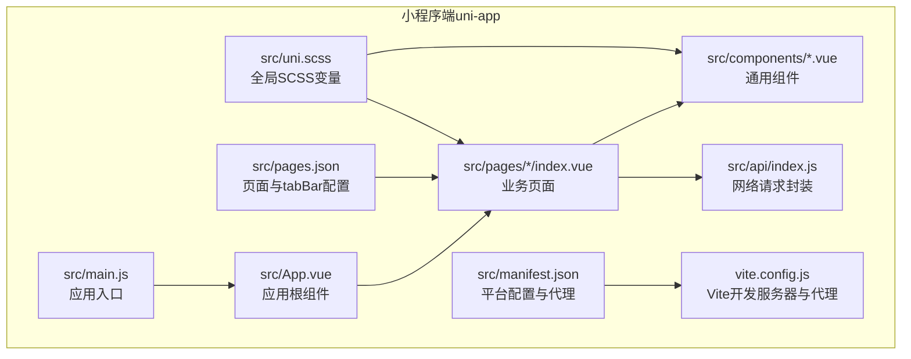
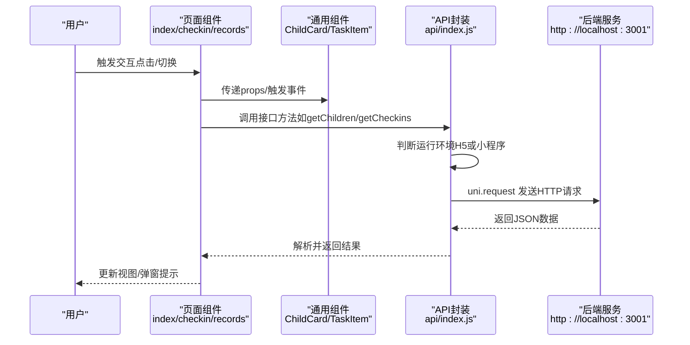
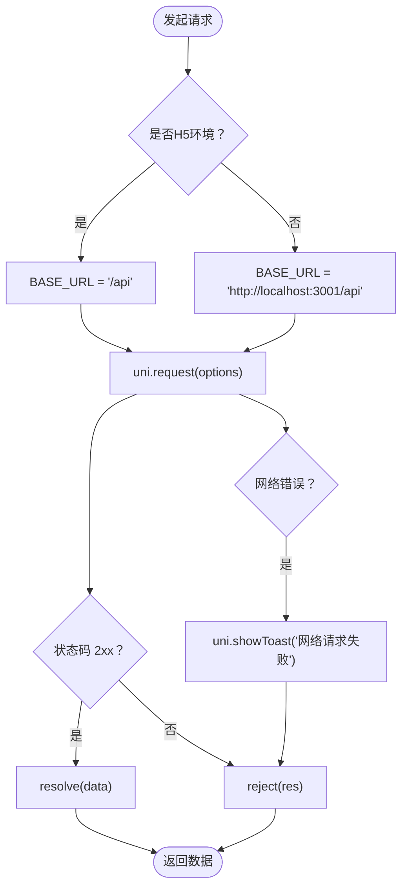
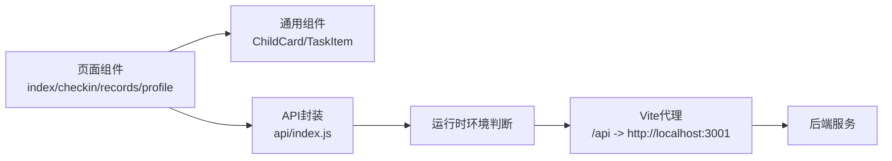

# 跨平台适配

<cite>
**本文引用的文件**
- [star-park/miniprogram/src/manifest.json](file://star-park/miniprogram/src/manifest.json)
- [star-park/miniprogram/src/pages.json](file://star-park/miniprogram/src/pages.json)
- [star-park/miniprogram/src/App.vue](file://star-park/miniprogram/src/App.vue)
- [star-park/miniprogram/src/main.js](file://star-park/miniprogram/src/main.js)
- [star-park/miniprogram/package.json](file://star-park/miniprogram/package.json)
- [star-park/miniprogram/src/uni.scss](file://star-park/miniprogram/src/uni.scss)
- [star-park/miniprogram/src/api/index.js](file://star-park/miniprogram/src/api/index.js)
- [star-park/miniprogram/src/components/ChildCard.vue](file://star-park/miniprogram/src/components/ChildCard.vue)
- [star-park/miniprogram/src/components/TaskItem.vue](file://star-park/miniprogram/src/components/TaskItem.vue)
- [star-park/miniprogram/src/pages/index/index.vue](file://star-park/miniprogram/src/pages/index/index.vue)
- [star-park/miniprogram/src/pages/checkin/index.vue](file://star-park/miniprogram/src/pages/checkin/index.vue)
- [star-park/miniprogram/src/pages/records/index.vue](file://star-park/miniprogram/src/pages/records/index.vue)
- [star-park/miniprogram/src/pages/profile/index.vue](file://star-park/miniprogram/src/pages/profile/index.vue)
- [star-park/miniprogram/vite.config.js](file://star-park/miniprogram/vite.config.js)
</cite>

## 目录
1. [简介](#简介)
2. [项目结构](#项目结构)
3. [核心组件](#核心组件)
4. [架构总览](#架构总览)
5. [详细组件分析](#详细组件分析)
6. [依赖关系分析](#依赖关系分析)
7. [性能考量](#性能考量)
8. [故障排查指南](#故障排查指南)
9. [结论](#结论)
10. [附录](#附录)

## 简介
本文件面向StarParadise小程序跨平台适配，围绕uni-app框架在多端统一开发中的原理与实践展开，重点覆盖以下方面：
- uni-app跨平台原理与平台差异处理
- 条件编译与平台特定代码管理
- 不同小程序平台（如微信）的适配策略、API差异、UI组件兼容性与性能优化
- CSS单位转换、事件处理差异、存储机制区别、网络请求差异
- 发布流程、兼容性测试、问题排查与最佳实践

## 项目结构
该项目采用uni-app多端统一工程，核心位于miniprogram目录，包含Vue 3 + Vite构建配置、页面路由、全局样式与API封装，并通过manifest.json进行平台配置与代理设置。

图表来源
- [star-park/miniprogram/src/main.js:1-8](file://star-park/miniprogram/src/main.js#L1-L8)
- [star-park/miniprogram/src/App.vue:1-26](file://star-park/miniprogram/src/App.vue#L1-L26)
- [star-park/miniprogram/src/pages.json:1-54](file://star-park/miniprogram/src/pages.json#L1-L54)
- [star-park/miniprogram/src/manifest.json:1-31](file://star-park/miniprogram/src/manifest.json#L1-L31)
- [star-park/miniprogram/src/api/index.js:1-75](file://star-park/miniprogram/src/api/index.js#L1-L75)
- [star-park/miniprogram/src/uni.scss:1-17](file://star-park/miniprogram/src/uni.scss#L1-L17)
- [star-park/miniprogram/vite.config.js:1-17](file://star-park/miniprogram/vite.config.js#L1-L17)

章节来源
- [star-park/miniprogram/src/main.js:1-8](file://star-park/miniprogram/src/main.js#L1-L8)
- [star-park/miniprogram/src/App.vue:1-26](file://star-park/miniprogram/src/App.vue#L1-L26)
- [star-park/miniprogram/src/pages.json:1-54](file://star-park/miniprogram/src/pages.json#L1-L54)
- [star-park/miniprogram/src/manifest.json:1-31](file://star-park/miniprogram/src/manifest.json#L1-L31)
- [star-park/miniprogram/src/api/index.js:1-75](file://star-park/miniprogram/src/api/index.js#L1-L75)
- [star-park/miniprogram/src/uni.scss:1-17](file://star-park/miniprogram/src/uni.scss#L1-L17)
- [star-park/miniprogram/vite.config.js:1-17](file://star-park/miniprogram/vite.config.js#L1-L17)

## 核心组件
- 应用入口与生命周期
  - 应用入口导出createApp工厂函数，用于SSR/客户端环境初始化。
  - App.vue注册应用生命周期钩子，便于全局日志与初始化。
- 页面与导航
  - pages.json集中声明页面列表、全局导航样式与tabBar图标资源路径。
- 平台配置
  - manifest.json配置各平台参数，如微信小程序appid、编译选项、H5开发服务器与代理；transformPx开关关闭px到rpx自动转换。
- 全局样式
  - uni.scss定义主题色、圆角、阴影、字体等全局变量，供组件与页面按需使用。
- API封装
  - api/index.js对uni.request进行统一封装，区分H5与小程序环境的BASE_URL，统一错误提示与响应处理。
- 组件体系
  - ChildCard与TaskItem为通用UI组件，通过props与事件解耦，便于在多页面复用。
- 构建与开发
  - package.json提供多端构建脚本；vite.config.js配置本地开发代理与端口。

章节来源
- [star-park/miniprogram/src/main.js:1-8](file://star-park/miniprogram/src/main.js#L1-L8)
- [star-park/miniprogram/src/App.vue:1-26](file://star-park/miniprogram/src/App.vue#L1-L26)
- [star-park/miniprogram/src/pages.json:1-54](file://star-park/miniprogram/src/pages.json#L1-L54)
- [star-park/miniprogram/src/manifest.json:1-31](file://star-park/miniprogram/src/manifest.json#L1-L31)
- [star-park/miniprogram/src/uni.scss:1-17](file://star-park/miniprogram/src/uni.scss#L1-L17)
- [star-park/miniprogram/src/api/index.js:1-75](file://star-park/miniprogram/src/api/index.js#L1-L75)
- [star-park/miniprogram/src/components/ChildCard.vue:1-162](file://star-park/miniprogram/src/components/ChildCard.vue#L1-L162)
- [star-park/miniprogram/src/components/TaskItem.vue:1-133](file://star-park/miniprogram/src/components/TaskItem.vue#L1-L133)
- [star-park/miniprogram/package.json:1-28](file://star-park/miniprogram/package.json#L1-L28)
- [star-park/miniprogram/vite.config.js:1-17](file://star-park/miniprogram/vite.config.js#L1-L17)

## 架构总览
下图展示从页面到API再到服务端的整体调用链路，以及开发时的代理转发关系。

图表来源
- [star-park/miniprogram/src/pages/index/index.vue:1-194](file://star-park/miniprogram/src/pages/index/index.vue#L1-L194)
- [star-park/miniprogram/src/pages/checkin/index.vue:1-322](file://star-park/miniprogram/src/pages/checkin/index.vue#L1-L322)
- [star-park/miniprogram/src/pages/records/index.vue:1-460](file://star-park/miniprogram/src/pages/records/index.vue#L1-L460)
- [star-park/miniprogram/src/components/ChildCard.vue:1-162](file://star-park/miniprogram/src/components/ChildCard.vue#L1-L162)
- [star-park/miniprogram/src/components/TaskItem.vue:1-133](file://star-park/miniprogram/src/components/TaskItem.vue#L1-L133)
- [star-park/miniprogram/src/api/index.js:1-75](file://star-park/miniprogram/src/api/index.js#L1-L75)
- [star-park/miniprogram/vite.config.js:1-17](file://star-park/miniprogram/vite.config.js#L1-L17)

## 详细组件分析

### 页面与导航（pages.json）
- 页面清单与标题文本由pages.json集中管理，确保多端一致的导航体验。
- tabBar配置包含图标路径与选中态图标，需保证静态资源路径在各平台可用。

章节来源
- [star-park/miniprogram/src/pages.json:1-54](file://star-park/miniprogram/src/pages.json#L1-L54)

### 应用根组件（App.vue）
- 注册应用生命周期事件，便于全局日志与初始化。
- 全局样式以page为作用域，统一字号、行高与字体族，配合rpx单位实现移动端适配。

章节来源
- [star-park/miniprogram/src/App.vue:1-26](file://star-park/miniprogram/src/App.vue#L1-L26)

### API封装（api/index.js）
- 运行时判断是否在浏览器环境中，决定使用相对路径代理还是完整URL。
- 统一封装uni.request，处理状态码范围与失败回调，统一toast提示。
- 定义常用业务接口方法，便于页面直接调用。

图表来源
- [star-park/miniprogram/src/api/index.js:1-75](file://star-park/miniprogram/src/api/index.js#L1-L75)

章节来源
- [star-park/miniprogram/src/api/index.js:1-75](file://star-park/miniprogram/src/api/index.js#L1-L75)

### 通用组件（ChildCard.vue / TaskItem.vue）
- ChildCard：展示孩子信息、打卡状态、连续天数与余额，支持点击事件透传。
- TaskItem：展示任务条目、勾选状态、奖励金额，支持禁用态与点击切换。
- 两者均使用SCSS变量与rpx单位，确保在不同屏幕密度下视觉一致性。

章节来源
- [star-park/miniprogram/src/components/ChildCard.vue:1-162](file://star-park/miniprogram/src/components/ChildCard.vue#L1-L162)
- [star-park/miniprogram/src/components/TaskItem.vue:1-133](file://star-park/miniprogram/src/components/TaskItem.vue#L1-L133)

### 首页（pages/index/index.vue）
- 展示问候语、日期与孩子卡片列表，汇总最长连续、本周完成率与总余额。
- 支持从API获取数据，失败时回退默认数据，保障首屏可用性。
- 使用onMounted与onShow刷新数据，提升页面可见性体验。

章节来源
- [star-park/miniprogram/src/pages/index/index.vue:1-194](file://star-park/miniprogram/src/pages/index/index.vue#L1-L194)

### 打卡页（pages/checkin/index.vue）
- 孩子选择器、任务列表、积分奖励入口、提交按钮与统计卡片构成完整流程。
- 通过标记今日已打行为“禁用态”，避免重复提交。
- 成功后弹出祝贺动画，增强正反馈。

章节来源
- [star-park/miniprogram/src/pages/checkin/index.vue:1-322](file://star-park/miniprogram/src/pages/checkin/index.vue#L1-L322)

### 记录页（pages/records/index.vue）
- 孩子切换、余额卡片、礼物进度（部分场景）、日历网格与打卡明细。
- 日历基于当月第一天与周一开始计算偏移，渲染空位与今日标识。
- 通过API获取打卡记录并提取当月打卡日期，驱动日历与列表。

章节来源
- [star-park/miniprogram/src/pages/records/index.vue:1-460](file://star-park/miniprogram/src/pages/records/index.vue#L1-L460)

### 我的页（pages/profile/index.vue）
- 菜单入口统一跳转至Toast提示（功能开发中），便于后续扩展。
- 信息卡片与版本信息展示，保持一致的视觉风格。

章节来源
- [star-park/miniprogram/src/pages/profile/index.vue:1-211](file://star-park/miniprogram/src/pages/profile/index.vue#L1-L211)

### 构建与开发（package.json / vite.config.js）
- 多端构建脚本：dev:mp-weixin、build:mp-weixin、dev:h5、build:h5。
- H5开发服务器端口与代理配置，将/api前缀转发至后端服务地址。

章节来源
- [star-park/miniprogram/package.json:1-28](file://star-park/miniprogram/package.json#L1-L28)
- [star-park/miniprogram/vite.config.js:1-17](file://star-park/miniprogram/vite.config.js#L1-L17)

## 依赖关系分析
- 页面依赖通用组件与API封装，形成清晰的单向数据流。
- API封装依赖运行时环境判断，决定请求目标地址。
- 开发服务器通过代理将前端请求转发至后端，避免跨域问题。

图表来源
- [star-park/miniprogram/src/pages/index/index.vue:1-194](file://star-park/miniprogram/src/pages/index/index.vue#L1-L194)
- [star-park/miniprogram/src/pages/checkin/index.vue:1-322](file://star-park/miniprogram/src/pages/checkin/index.vue#L1-L322)
- [star-park/miniprogram/src/pages/records/index.vue:1-460](file://star-park/miniprogram/src/pages/records/index.vue#L1-L460)
- [star-park/miniprogram/src/pages/profile/index.vue:1-211](file://star-park/miniprogram/src/pages/profile/index.vue#L1-L211)
- [star-park/miniprogram/src/components/ChildCard.vue:1-162](file://star-park/miniprogram/src/components/ChildCard.vue#L1-L162)
- [star-park/miniprogram/src/components/TaskItem.vue:1-133](file://star-park/miniprogram/src/components/TaskItem.vue#L1-L133)
- [star-park/miniprogram/src/api/index.js:1-75](file://star-park/miniprogram/src/api/index.js#L1-L75)
- [star-park/miniprogram/vite.config.js:1-17](file://star-park/miniprogram/vite.config.js#L1-L17)

章节来源
- [star-park/miniprogram/src/api/index.js:1-75](file://star-park/miniprogram/src/api/index.js#L1-L75)
- [star-park/miniprogram/vite.config.js:1-17](file://star-park/miniprogram/vite.config.js#L1-L17)

## 性能考量
- rpx单位与SCSS变量：统一使用rpx与SCSS变量，减少重复计算与不必要重排。
- 组件拆分：将可复用UI拆分为独立组件，降低页面复杂度与渲染成本。
- 数据懒加载：在页面显示时再拉取数据，避免首屏阻塞。
- 代理与缓存：开发阶段合理配置代理，生产环境建议启用HTTP缓存与CDN加速。
- 图标与静态资源：tabBar图标路径需在各平台验证，避免额外网络请求。

## 故障排查指南
- 网络请求失败
  - 现象：调用API后出现“网络请求失败”提示。
  - 排查：确认运行环境（H5或小程序）、BASE_URL拼接、后端服务可达性与代理配置。
  - 参考：[api/index.js:1-75](file://star-park/miniprogram/src/api/index.js#L1-L75)，[vite.config.js:1-17](file://star-park/miniprogram/vite.config.js#L1-L17)
- 打卡重复提交
  - 现象：同一任务多次被标记为已打。
  - 排查：检查任务项的checkedToday标记逻辑与提交流程。
  - 参考：[pages/checkin/index.vue:1-322](file://star-park/miniprogram/src/pages/checkin/index.vue#L1-L322)
- tabBar图标不显示
  - 现象：底部导航图标缺失或空白。
  - 排查：核对pages.json中iconPath与selectedIconPath路径，确保静态资源存在且路径正确。
  - 参考：[pages.json:1-54](file://star-park/miniprogram/src/pages.json#L1-L54)
- px与rpx转换异常
  - 现象：样式在某些设备上显示过大或过小。
  - 排查：manifest.json中transformPx为false，需手动使用rpx；或开启自动转换并统一设计稿基准。
  - 参考：[manifest.json:1-31](file://star-park/miniprogram/src/manifest.json#L1-L31)
- H5开发代理无效
  - 现象：/api请求未被转发至后端。
  - 排查：确认vite.config.js代理配置、端口占用与跨域头设置。
  - 参考：[vite.config.js:1-17](file://star-park/miniprogram/vite.config.js#L1-L17)

章节来源
- [star-park/miniprogram/src/api/index.js:1-75](file://star-park/miniprogram/src/api/index.js#L1-L75)
- [star-park/miniprogram/src/pages/checkin/index.vue:1-322](file://star-park/miniprogram/src/pages/checkin/index.vue#L1-L322)
- [star-park/miniprogram/src/pages.json:1-54](file://star-park/miniprogram/src/pages.json#L1-L54)
- [star-park/miniprogram/src/manifest.json:1-31](file://star-park/miniprogram/src/manifest.json#L1-L31)
- [star-park/miniprogram/vite.config.js:1-17](file://star-park/miniprogram/vite.config.js#L1-L17)

## 结论
本项目基于uni-app实现了多端统一开发，通过集中式的页面配置、全局样式变量与API封装，有效降低了平台差异带来的维护成本。结合rpx单位、组件化与代理转发机制，能够在微信小程序与H5环境下稳定运行。建议在后续迭代中完善平台特定代码管理、补充条件编译与平台差异处理策略，并持续优化网络层与UI渲染性能。

## 附录

### 平台差异与适配要点（微信小程序）
- 应用配置
  - 在manifest.json中为mp-weixin配置appid与编译选项，确保预览与上传流程顺畅。
- 网络请求
  - 使用uni.request统一接口；H5通过代理转发，小程序直连后端。
- UI与样式
  - 使用rpx与SCSS变量；transformPx关闭时需手动适配。
- 导航与tabBar
  - 通过pages.json集中管理页面与tabBar图标路径，确保资源可用。
- 开发与调试
  - 使用package.json脚本启动对应平台开发；H5端口与代理在vite.config.js中配置。

章节来源
- [star-park/miniprogram/src/manifest.json:1-31](file://star-park/miniprogram/src/manifest.json#L1-L31)
- [star-park/miniprogram/src/pages.json:1-54](file://star-park/miniprogram/src/pages.json#L1-L54)
- [star-park/miniprogram/src/api/index.js:1-75](file://star-park/miniprogram/src/api/index.js#L1-L75)
- [star-park/miniprogram/vite.config.js:1-17](file://star-park/miniprogram/vite.config.js#L1-L17)
- [star-park/miniprogram/package.json:1-28](file://star-park/miniprogram/package.json#L1-L28)