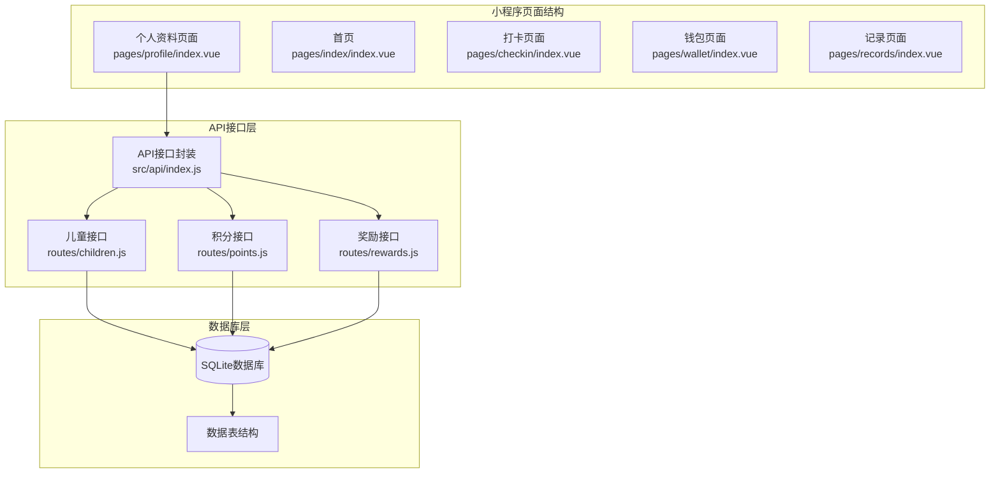
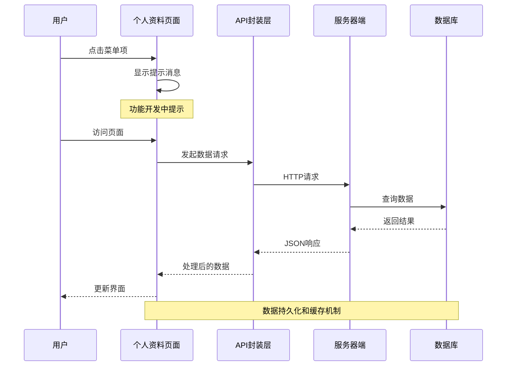
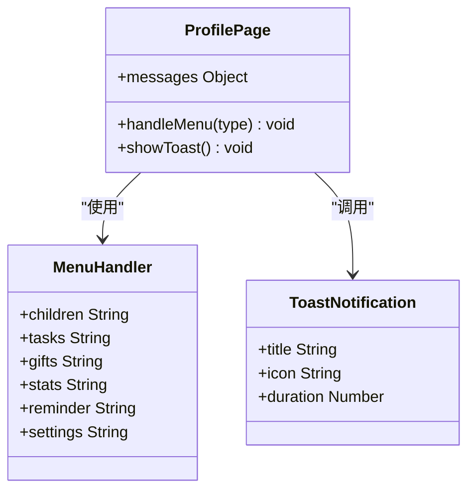
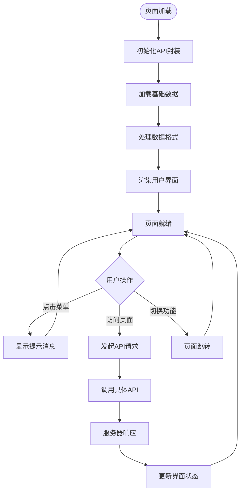
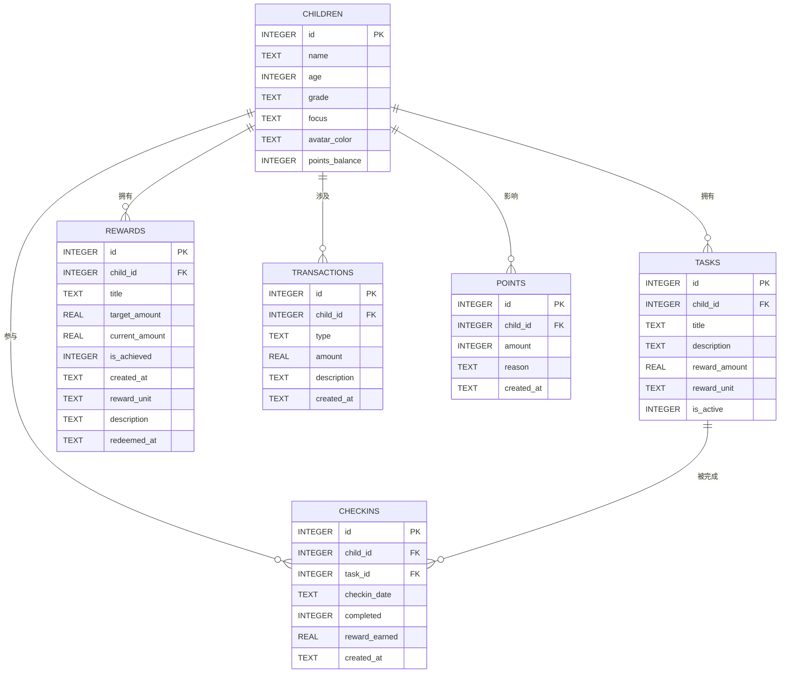
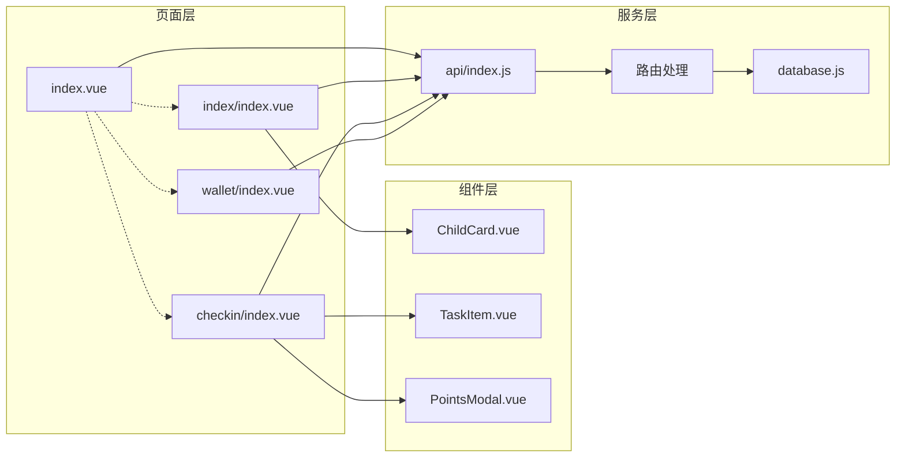

# 个人资料页面

<cite>
**本文档引用的文件**
- [index.vue](file://star-park/miniprogram/src/pages/profile/index.vue)
- [index.js](file://star-park/miniprogram/src/api/index.js)
- [index.vue](file://star-park/miniprogram/src/pages/index/index.vue)
- [index.vue](file://star-park/miniprogram/src/pages/checkin/index.vue)
- [index.vue](file://star-park/miniprogram/src/pages/wallet/index.vue)
- [children.js](file://star-park/server/src/routes/children.js)
- [points.js](file://star-park/server/src/routes/points.js)
- [rewards.js](file://star-park/server/src/routes/rewards.js)
- [database.js](file://star-park/server/src/database.js)
- [pages.json](file://star-park/miniprogram/src/pages.json)
- [ChildCard.vue](file://star-park/miniprogram/src/components/ChildCard.vue)
- [uni.scss](file://star-park/miniprogram/src/uni.scss)
</cite>

## 目录
1. [简介](#简介)
2. [项目结构](#项目结构)
3. [核心组件](#核心组件)
4. [架构概览](#架构概览)
5. [详细组件分析](#详细组件分析)
6. [依赖关系分析](#依赖关系分析)
7. [性能考虑](#性能考虑)
8. [故障排除指南](#故障排除指南)
9. [结论](#结论)
10. [附录](#附录)

## 简介

StarParadise小程序个人资料页面是家庭激励管理系统的核心入口，为家长提供统一的个人中心界面。该页面不仅展示了用户的基本信息，更重要的是作为整个应用的功能导航中心，连接着孩子管理、任务规则、奖励目标、数据统计等多个核心功能模块。

当前个人资料页面采用简洁的设计风格，通过卡片式布局展示头部信息、功能菜单和关于信息。页面底部提供了系统版本信息和品牌标语，营造了温馨的家庭教育氛围。

## 项目结构

个人资料页面位于小程序的pages目录下，采用标准的UniApp页面结构：

**图表来源**
- [index.vue:1-211](file://star-park/miniprogram/src/pages/profile/index.vue#L1-L211)
- [index.js:1-75](file://star-park/miniprogram/src/api/index.js#L1-L75)
- [pages.json:1-54](file://star-park/miniprogram/src/pages.json#L1-L54)

**章节来源**
- [index.vue:1-211](file://star-park/miniprogram/src/pages/profile/index.vue#L1-L211)
- [pages.json:1-54](file://star-park/miniprogram/src/pages.json#L1-L54)

## 核心组件

个人资料页面由多个精心设计的组件构成，每个组件都承担着特定的功能职责：

### 头部信息区域
头部信息区域采用居中布局，包含头像占位符、用户名和描述文本。设计采用了圆角卡片样式和阴影效果，营造出柔和的视觉层次感。

### 菜单卡片区域
菜单区域分为两个主要部分，每个部分包含多个功能菜单项。菜单项采用flex布局，包含图标、文字标签和箭头指示器，提供清晰的导航指引。

### 关于信息卡片
关于信息卡片展示了系统的基本信息，包括系统名称、版本号和功能描述，为用户提供系统的基础认知。

### 样式系统
项目采用全局SCSS变量系统，定义了主色调、辅助色、字体规格和圆角半径等设计规范，确保界面风格的一致性。

**章节来源**
- [index.vue:1-211](file://star-park/miniprogram/src/pages/profile/index.vue#L1-L211)
- [uni.scss:1-17](file://star-park/miniprogram/src/uni.scss#L1-L17)

## 架构概览

个人资料页面采用典型的三层架构设计，实现了清晰的关注点分离：

**图表来源**
- [index.vue:71-85](file://star-park/miniprogram/src/pages/profile/index.vue#L71-L85)
- [index.js:7-30](file://star-park/miniprogram/src/api/index.js#L7-L30)
- [children.js:6-37](file://star-park/server/src/routes/children.js#L6-L37)

## 详细组件分析

### 个人资料页面组件分析

个人资料页面采用Vue 3的Composition API模式，实现了响应式的数据绑定和事件处理：

**图表来源**
- [index.vue:71-85](file://star-park/miniprogram/src/pages/profile/index.vue#L71-L85)

#### 菜单处理机制
页面的菜单处理采用集中式的消息映射机制，通过handleMenu方法统一处理所有菜单点击事件。当用户点击不同菜单项时，系统会根据类型显示相应的提示消息。

#### 数据流处理
虽然当前个人资料页面主要提供导航功能，但其数据流设计为后续的功能扩展预留了充足的空间。页面通过API封装层与服务器端进行数据交互，实现了前后端的解耦。

**章节来源**
- [index.vue:71-85](file://star-park/miniprogram/src/pages/profile/index.vue#L71-L85)

### API接口集成分析

个人资料页面与后端API的集成体现了良好的模块化设计：

**图表来源**
- [index.js:35-75](file://star-park/miniprogram/src/api/index.js#L35-L75)
- [index.vue:71-85](file://star-park/miniprogram/src/pages/profile/index.vue#L71-L85)

#### API接口设计
API封装层提供了统一的请求接口，包括仪表盘数据、儿童列表、打卡记录、奖励目标等功能。每个接口都遵循RESTful设计原则，提供了清晰的HTTP方法和参数规范。

#### 错误处理机制
API封装层实现了完善的错误处理机制，包括网络请求失败、服务器错误和数据格式异常等情况的处理。这种设计确保了应用的稳定性和用户体验。

**章节来源**
- [index.js:1-75](file://star-park/miniprogram/src/api/index.js#L1-L75)

### 数据模型分析

系统采用SQLite作为本地数据库，支持数据的持久化存储和查询：

**图表来源**
- [database.js:18-80](file://star-park/server/src/database.js#L18-L80)

#### 数据表关系
系统通过外键约束建立了清晰的数据表关系，确保了数据的完整性和一致性。每个表都包含了必要的字段来支持业务逻辑的实现。

#### 数据迁移机制
数据库层实现了自动迁移机制，能够处理表结构的变更和字段的添加。这种设计确保了系统的向后兼容性和可维护性。

**章节来源**
- [database.js:1-111](file://star-park/server/src/database.js#L1-L111)

## 依赖关系分析

个人资料页面与其他组件之间的依赖关系体现了模块化的架构设计：

**图表来源**
- [index.vue:1-211](file://star-park/miniprogram/src/pages/profile/index.vue#L1-L211)
- [index.js:1-75](file://star-park/miniprogram/src/api/index.js#L1-L75)
- [database.js:1-111](file://star-park/server/src/database.js#L1-L111)

### 组件间通信
页面间的通信通过统一的API接口实现，避免了直接的组件依赖，提高了代码的可维护性。每个页面都可以独立地调用API接口获取所需的数据。

### 数据同步机制
系统实现了基于API的数据同步机制，通过定时刷新和事件驱动的方式保持页面数据的实时性。这种设计确保了用户界面与服务器数据的一致性。

**章节来源**
- [index.vue:1-211](file://star-park/miniprogram/src/pages/profile/index.vue#L1-L211)
- [index.js:1-75](file://star-park/miniprogram/src/api/index.js#L1-L75)

## 性能考虑

个人资料页面在设计时充分考虑了性能优化，采用了多种策略来提升用户体验：

### 渲染优化
- 采用虚拟DOM技术，减少不必要的DOM操作
- 实现了条件渲染，只渲染必要的内容
- 使用CSS3硬件加速，提升动画性能

### 数据加载优化
- 实现了懒加载机制，按需加载页面数据
- 采用了数据缓存策略，减少重复请求
- 优化了图片资源，使用适当的尺寸和格式

### 内存管理
- 及时清理事件监听器和定时器
- 实现了组件的生命周期管理
- 避免内存泄漏，确保长期运行稳定性

## 故障排除指南

### 常见问题及解决方案

#### 页面加载失败
**症状**: 个人资料页面无法正常显示
**原因**: 网络请求超时或服务器错误
**解决方案**: 
1. 检查网络连接状态
2. 验证API接口的可用性
3. 查看控制台错误信息
4. 重新启动应用

#### 数据显示异常
**症状**: 页面数据显示不正确或为空
**原因**: 数据库连接问题或查询错误
**解决方案**:
1. 检查数据库文件是否存在
2. 验证数据表结构是否正确
3. 确认API接口返回的数据格式
4. 查看服务器端日志

#### 功能菜单不可用
**症状**: 点击菜单项没有反应
**原因**: 功能开发中或事件处理错误
**解决方案**:
1. 检查handleMenu函数的实现
2. 验证菜单项的事件绑定
3. 确认提示消息的配置
4. 查看控制台是否有JavaScript错误

**章节来源**
- [index.vue:71-85](file://star-park/miniprogram/src/pages/profile/index.vue#L71-L85)
- [index.js:7-30](file://star-park/miniprogram/src/api/index.js#L7-L30)

## 结论

StarParadise小程序个人资料页面展现了优秀的前端架构设计和用户体验理念。页面采用模块化的设计思路，通过清晰的组件划分和API集成，为用户提供了直观易用的个人中心界面。

当前版本虽然主要提供导航功能，但其架构设计为后续的功能扩展奠定了坚实的基础。通过统一的API接口、完善的错误处理机制和灵活的数据模型，系统具备了良好的可扩展性和可维护性。

未来可以在个人资料页面中集成更多实用功能，如个人信息编辑、头像上传、积分余额显示等，进一步提升用户的使用体验。同时，可以考虑实现数据同步机制和安全保护措施，确保用户数据的安全性和隐私性。

## 附录

### 技术规范

#### 设计规范
- 主色调: #19C8B9 (青绿色)
- 辅助色: #FF6B6B, #4ECDC4, #FFD93D
- 字体大小: 24rpx-40rpx
- 圆角半径: 12rpx-16rpx
- 阴影效果: 0 2rpx 16rpx rgba(0, 0, 0, 0.06)

#### API接口规范
- 基础URL: http://localhost:3001/api
- 请求格式: JSON
- 响应格式: JSON
- 错误码: HTTP状态码
- 超时时间: 10秒

#### 数据库规范
- 数据库类型: SQLite
- 数据库文件: star-park.db
- 表结构: 自动迁移
- 外键约束: 启用
- 并发模式: WAL