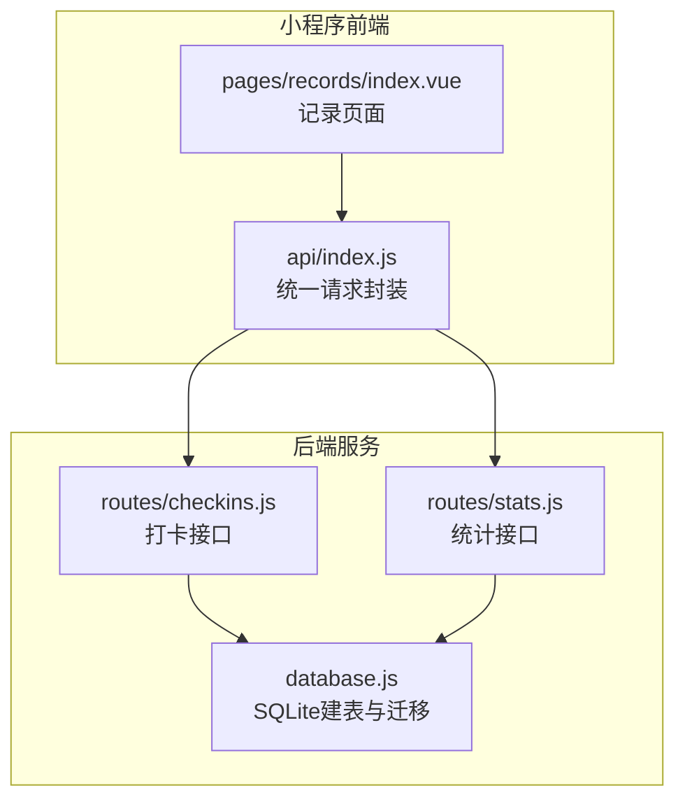
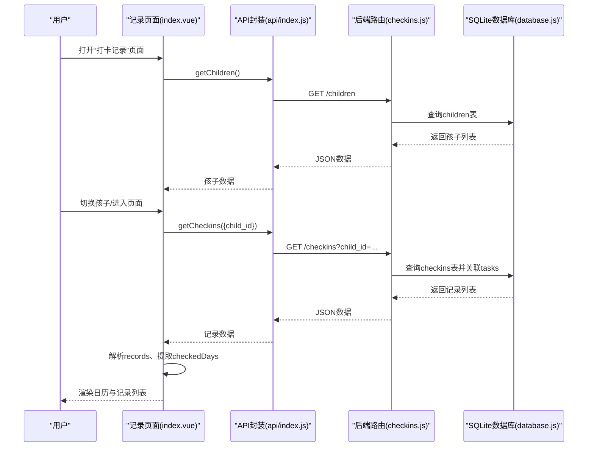
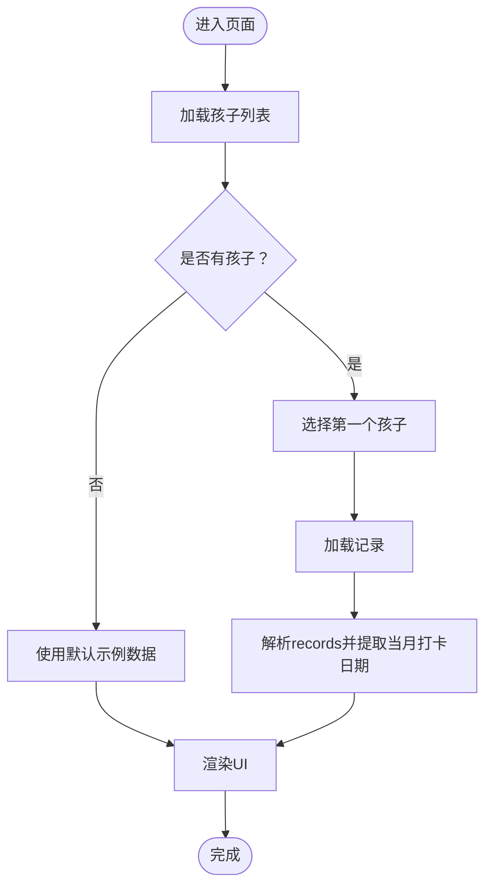
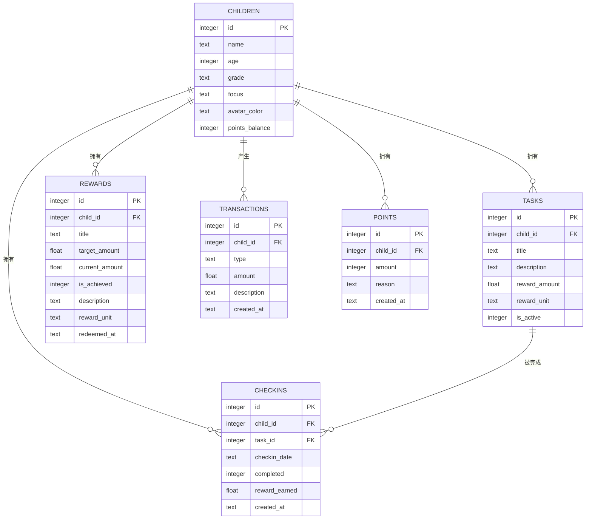
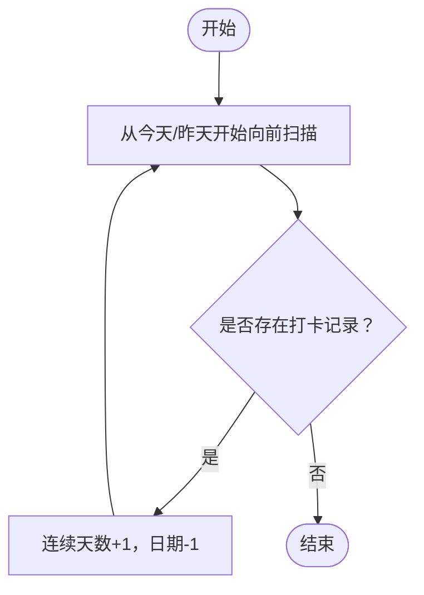
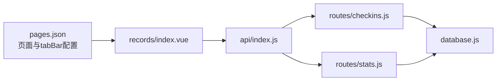

# 打卡记录页面

<cite>
**本文档引用的文件**
- [index.vue](file://star-park/miniprogram/src/pages/records/index.vue)
- [index.js](file://star-park/miniprogram/src/api/index.js)
- [checkins.js](file://star-park/server/src/routes/checkins.js)
- [stats.js](file://star-park/server/src/routes/stats.js)
- [database.js](file://star-park/server/src/database.js)
- [pages.json](file://star-park/miniprogram/src/pages.json)
- [uni.scss](file://star-park/miniprogram/src/uni.scss)
- [package.json](file://star-park/miniprogram/src/package.json)
</cite>

## 目录
1. [简介](#简介)
2. [项目结构](#项目结构)
3. [核心组件](#核心组件)
4. [架构总览](#架构总览)
5. [详细组件分析](#详细组件分析)
6. [依赖关系分析](#依赖关系分析)
7. [性能考虑](#性能考虑)
8. [故障排除指南](#故障排除指南)
9. [结论](#结论)
10. [附录](#附录)

## 简介
本文件面向StarParadise小程序“打卡记录”页面，系统性阐述打卡历史数据的获取、展示与管理机制，覆盖以下关键主题：
- 记录列表渲染逻辑与UI结构
- 时间筛选与状态分类显示
- 数据加载策略、分页与无限滚动优化建议
- 打卡趋势分析、连续打卡统计、完成率计算的实现思路
- 数据可视化方案、性能优化技巧与用户体验改进建议

该页面基于Vue 3 + UniApp技术栈构建，前端通过统一API模块调用后端服务，后端采用Express + SQLite实现数据持久化与查询。

## 项目结构
“打卡记录”页面位于小程序前端目录中，配合全局API封装与后端路由实现完整的数据流闭环。页面在应用启动时加载，进入页面时刷新数据，确保用户看到最新打卡记录。

图表来源
- [index.vue:1-460](file://star-park/miniprogram/src/pages/records/index.vue#L1-L460)
- [index.js:1-75](file://star-park/miniprogram/src/api/index.js#L1-L75)
- [checkins.js:1-90](file://star-park/server/src/routes/checkins.js#L1-L90)
- [stats.js:1-182](file://star-park/server/src/routes/stats.js#L1-L182)
- [database.js:1-111](file://star-park/server/src/database.js#L1-L111)

章节来源
- [index.vue:1-460](file://star-park/miniprogram/src/pages/records/index.vue#L1-L460)
- [pages.json:1-54](file://star-park/miniprogram/src/pages.json#L1-L54)

## 核心组件
- 页面容器与布局
  - 孩子选择器：支持多孩子切换，按颜色区分，选中态高亮。
  - 余额卡片：展示累计获得、本月收益与已用金额。
  - 礼物进度（可选）：当存在未达成奖励目标时显示进度条。
  - 简单日历：按周显示当月日期，标记已打卡、今日等状态。
  - 打卡明细：列表展示每条记录的任务名、时间与奖励金额。
  - 空状态：无记录时提示“暂无打卡记录”。

- 数据模型与状态
  - children：孩子数组，包含id、name、color、balance、monthlyEarnings、spent、giftGoal等。
  - activeChildId：当前选中的孩子ID。
  - records：记录数组，包含id、taskName、date、amount。
  - checkedDays：当月已打卡日期集合，用于日历渲染。

- 关键方法
  - selectChild(id)：切换当前孩子并触发记录加载。
  - loadRecords()：拉取指定孩子的打卡记录，解析为页面可用格式，并提取当月打卡日期。
  - loadChildren()：拉取孩子列表，设置默认选中并初始化记录加载。

章节来源
- [index.vue:83-204](file://star-park/miniprogram/src/pages/records/index.vue#L83-L204)

## 架构总览
下图展示了从页面到后端接口再到数据库的完整调用链路，以及页面对返回数据的处理与渲染流程。

图表来源
- [index.vue:127-163](file://star-park/miniprogram/src/pages/records/index.vue#L127-L163)
- [index.js:35-46](file://star-park/miniprogram/src/api/index.js#L35-L46)
- [checkins.js:6-28](file://star-park/server/src/routes/checkins.js#L6-L28)
- [database.js:18-80](file://star-park/server/src/database.js#L18-L80)

## 详细组件分析

### 页面渲染与交互
- 孩子选择器
  - 使用v-for遍历children，根据activeChildId高亮选中项，点击回调selectChild触发记录刷新。
- 日历渲染
  - calendarDays计算函数生成当月网格，空位填充占位对象，已打卡日期标记checked，今日标记isToday。
- 记录列表
  - v-for遍历records，左侧彩色圆点对应孩子主色，右侧展示任务名、日期与奖励金额；负值金额使用特殊样式。

图表来源
- [index.vue:165-195](file://star-park/miniprogram/src/pages/records/index.vue#L165-L195)
- [index.vue:127-163](file://star-park/miniprogram/src/pages/records/index.vue#L127-L163)

章节来源
- [index.vue:1-204](file://star-park/miniprogram/src/pages/records/index.vue#L1-L204)

### 数据加载策略与错误回退
- 正常流程
  - 首次进入页面时调用loadChildren，若存在孩子则设置activeChildId并调用loadRecords。
  - loadRecords通过API封装调用后端接口，将返回的原始记录映射为页面字段，提取当月打卡日期集合。
- 错误回退
  - 若请求失败，页面使用内置示例数据与固定打卡日期集合进行渲染，保证用户体验连续性。

章节来源
- [index.vue:127-163](file://star-park/miniprogram/src/pages/records/index.vue#L127-L163)
- [index.vue:165-195](file://star-park/miniprogram/src/pages/records/index.vue#L165-L195)

### 时间筛选与状态分类
- 时间筛选
  - 后端接口支持按child_id筛选；当前页面按月维度渲染日历，但未实现按具体日期筛选。
- 状态分类
  - 日历单元格状态：空位(empty)、已打卡(checked)、部分完成(partial)、今日(today)。
  - 记录列表按奖励金额正负区分视觉样式，便于快速识别收入/支出。

章节来源
- [index.vue:100-120](file://star-park/miniprogram/src/pages/records/index.vue#L100-L120)
- [index.vue:448-448](file://star-park/miniprogram/src/pages/records/index.vue#L448-L448)

### 后端接口与数据模型
- 接口定义
  - GET /api/checkins：支持按date与child_id筛选，返回打卡记录并关联任务标题。
  - POST /api/checkins：创建打卡记录，同时写入交易记录并更新未达成奖励目标的累计金额。
- 数据模型
  - children、tasks、checkins、rewards、transactions、points等表结构由SQLite建表语句定义，外键约束确保数据一致性。

图表来源
- [database.js:18-80](file://star-park/server/src/database.js#L18-L80)

章节来源
- [checkins.js:6-28](file://star-park/server/src/routes/checkins.js#L6-L28)
- [checkins.js:30-87](file://star-park/server/src/routes/checkins.js#L30-L87)
- [database.js:18-80](file://star-park/server/src/database.js#L18-L80)

### 统计与趋势分析（扩展建议）
当前记录页面未直接展示连续打卡、完成率与30天趋势，但后端提供了相应统计接口与算法基础，可作为扩展实现的依据：
- 连续打卡天数：从当天或前一天开始向前扫描，统计连续有打卡的天数。
- 本周完成率：本周应打卡次数（活跃任务数×已过天数）与实际完成次数比值。
- 30天每日完成情况：按日期分组统计完成次数，填充缺失日期为0。

图表来源
- [stats.js:17-36](file://star-park/server/src/routes/stats.js#L17-L36)

章节来源
- [stats.js:6-101](file://star-park/server/src/routes/stats.js#L6-L101)

## 依赖关系分析
- 前端依赖
  - Vue 3、UniApp、Pinia、SCSS等，页面通过api/index.js统一发起HTTP请求。
- 后端依赖
  - Express、better-sqlite3、dayjs，负责路由、数据库访问与日期处理。
- 页面与路由映射
  - “记录”页面在pages.json中注册，导航栏标题为“打卡记录”，tabBar中对应“记录”入口。

图表来源
- [pages.json:1-54](file://star-park/miniprogram/src/pages.json#L1-L54)
- [index.vue:86-86](file://star-park/miniprogram/src/pages/records/index.vue#L86-L86)
- [index.js:35-74](file://star-park/miniprogram/src/api/index.js#L35-L74)
- [checkins.js:1-90](file://star-park/server/src/routes/checkins.js#L1-L90)
- [stats.js:1-182](file://star-park/server/src/routes/stats.js#L1-L182)
- [database.js:1-111](file://star-park/server/src/database.js#L1-L111)

章节来源
- [pages.json:1-54](file://star-park/miniprogram/src/pages.json#L1-L54)
- [package.json:1-28](file://star-park/miniprogram/src/package.json#L1-L28)

## 性能考虑
- 数据加载优化
  - 首屏渲染：在loadChildren成功后立即触发loadRecords，减少等待时间。
  - 错误回退：请求失败时使用本地示例数据，避免长时间白屏。
- 列表渲染优化
  - 使用v-for并提供稳定key，避免不必要的DOM重排。
  - 对于大量记录场景，建议引入虚拟滚动或分页加载。
- 网络与缓存
  - 在onShow生命周期中刷新数据，确保前后台切换后数据新鲜度。
  - 可在API层增加缓存策略（如ETag或内存缓存）降低重复请求。
- 图片与资源
  - tabbar图标与页面背景色在uni.scss中集中管理，便于统一维护与优化。

章节来源
- [index.vue:197-203](file://star-park/miniprogram/src/pages/records/index.vue#L197-L203)
- [uni.scss:1-17](file://star-park/miniprogram/src/uni.scss#L1-L17)

## 故障排除指南
- 请求失败
  - 现象：加载记录或孩子列表失败，控制台输出错误信息。
  - 处理：页面已内置错误回退逻辑，使用示例数据与固定日期集合渲染，保障基本可用性。
- 数据不一致
  - 现象：日历标记与记录列表不匹配。
  - 处理：确认后端接口返回的checkin_date格式与前端解析一致；检查当月筛选逻辑。
- 样式异常
  - 现象：颜色、阴影、圆角等样式不符合预期。
  - 处理：检查uni.scss中的全局变量是否正确引用；确认scoped样式未被意外覆盖。

章节来源
- [index.vue:152-162](file://star-park/miniprogram/src/pages/records/index.vue#L152-L162)
- [index.vue:183-194](file://star-park/miniprogram/src/pages/records/index.vue#L183-L194)

## 结论
“打卡记录”页面通过清晰的组件划分与简洁的数据流设计，实现了从数据获取到界面渲染的完整闭环。当前版本聚焦于基础展示与错误回退，后续可在以下方向增强：
- 引入时间筛选与分页/无限滚动，优化大数据量下的交互体验。
- 增加连续打卡、完成率与30天趋势等统计指标，丰富数据可视化。
- 在API层引入缓存与节流策略，进一步提升性能与稳定性。

## 附录
- API接口清单（与记录页面相关）
  - GET /children：获取孩子列表
  - GET /checkins：获取打卡记录（支持child_id筛选）
  - POST /checkins：创建打卡记录
  - GET /stats/:childId：获取统计信息（连续打卡、完成率、30天趋势等）

章节来源
- [index.js:35-74](file://star-park/miniprogram/src/api/index.js#L35-L74)
- [checkins.js:6-28](file://star-park/server/src/routes/checkins.js#L6-L28)
- [stats.js:6-101](file://star-park/server/src/routes/stats.js#L6-L101)