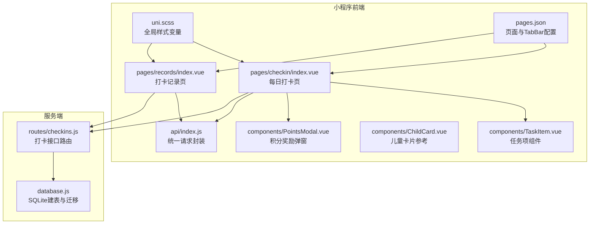
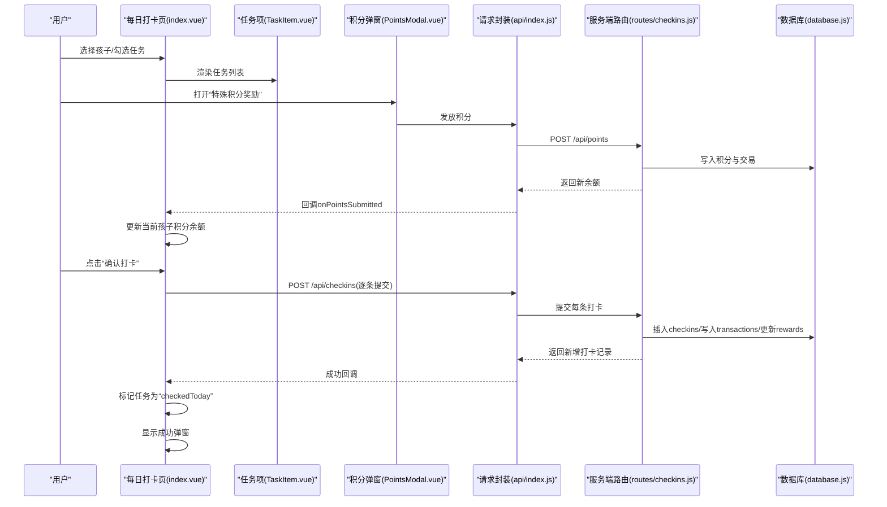
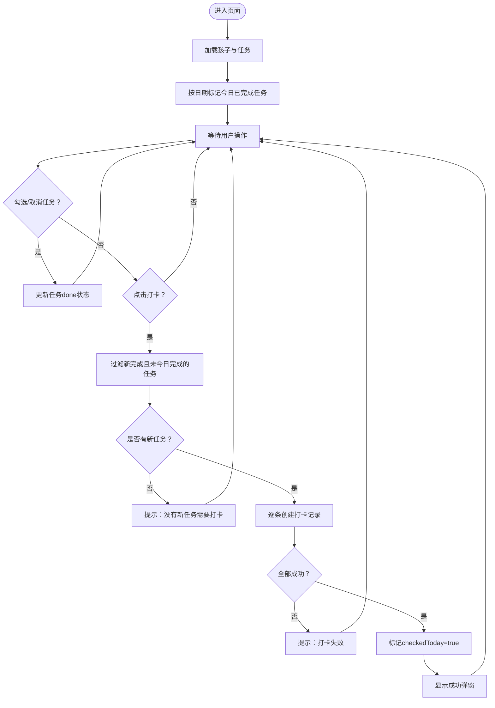
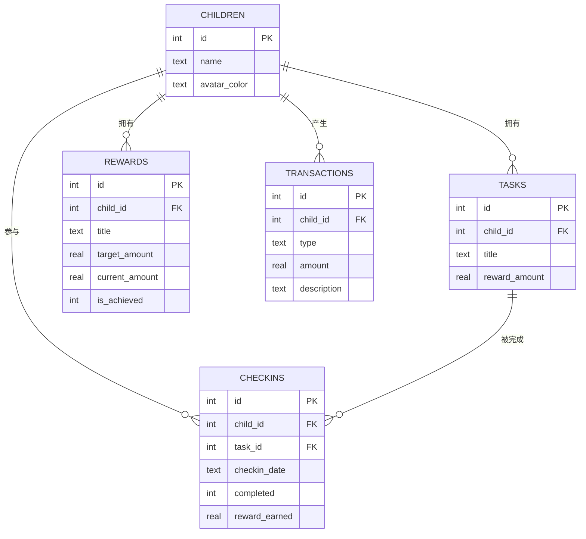
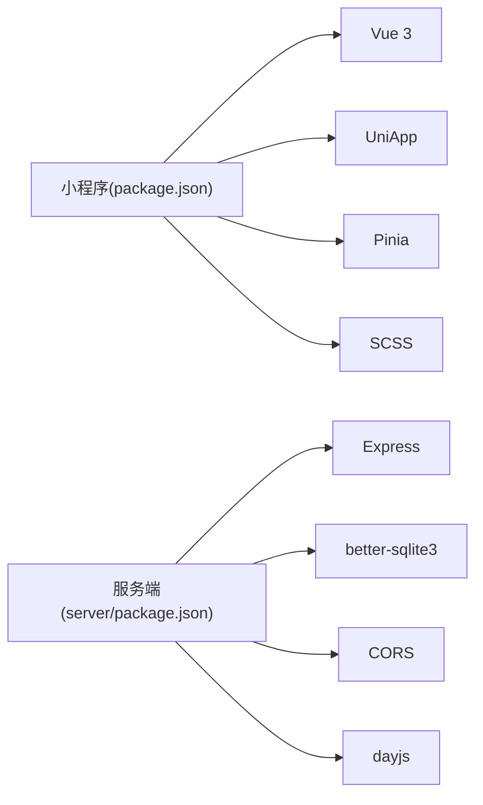

# 每日打卡页面

<cite>
**本文引用的文件**
- [index.vue](file://star-park/miniprogram/src/pages/checkin/index.vue)
- [index.js](file://star-park/miniprogram/src/api/index.js)
- [checkins.js](file://star-park/server/src/routes/checkins.js)
- [database.js](file://star-park/server/src/database.js)
- [TaskItem.vue](file://star-park/miniprogram/src/components/TaskItem.vue)
- [ChildCard.vue](file://star-park/miniprogram/src/components/ChildCard.vue)
- [PointsModal.vue](file://star-park/miniprogram/src/components/PointsModal.vue)
- [records/index.vue](file://star-park/miniprogram/src/pages/records/index.vue)
- [pages.json](file://star-park/miniprogram/src/pages.json)
- [uni.scss](file://star-park/miniprogram/src/uni.scss)
- [package.json](file://star-park/miniprogram/package.json)
- [server/package.json](file://star-park/server/package.json)
</cite>

## 目录
1. [简介](#简介)
2. [项目结构](#项目结构)
3. [核心组件](#核心组件)
4. [架构总览](#架构总览)
5. [详细组件分析](#详细组件分析)
6. [依赖关系分析](#依赖关系分析)
7. [性能考量](#性能考量)
8. [故障排查指南](#故障排查指南)
9. [结论](#结论)
10. [附录](#附录)

## 简介
本文件面向“每日打卡页面”，系统性阐述以下内容：
- 打卡功能的实现原理与流程
- 打卡状态检测与任务完成判定
- 打卡提交流程、数据校验与异常处理
- 打卡按钮的状态管理、动画与成功反馈
- 打卡记录展示、历史状态与统计信息
- 用户体验优化建议、错误处理策略与调试方法

## 项目结构
该页面属于小程序前端（基于 Vue 3 + UniApp），并与本地 Express 服务端配合，使用 SQLite 数据库存储业务数据。

图表来源
- [index.vue:1-322](file://star-park/miniprogram/src/pages/checkin/index.vue#L1-L322)
- [TaskItem.vue:1-133](file://star-park/miniprogram/src/components/TaskItem.vue#L1-L133)
- [PointsModal.vue:1-241](file://star-park/miniprogram/src/components/PointsModal.vue#L1-L241)
- [records/index.vue:1-460](file://star-park/miniprogram/src/pages/records/index.vue#L1-L460)
- [index.js:1-75](file://star-park/miniprogram/src/api/index.js#L1-L75)
- [checkins.js:1-90](file://star-park/server/src/routes/checkins.js#L1-L90)
- [database.js:1-111](file://star-park/server/src/database.js#L1-L111)
- [pages.json:1-54](file://star-park/miniprogram/src/pages.json#L1-L54)
- [uni.scss:1-17](file://star-park/miniprogram/src/uni.scss#L1-L17)

章节来源
- [pages.json:1-54](file://star-park/miniprogram/src/pages.json#L1-L54)

## 核心组件
- 每日打卡页：负责孩子选择、任务列表渲染、打卡按钮状态控制、成功弹窗与统计信息展示，并在页面显示时刷新数据。
- 任务项组件：提供勾选/禁用态切换，支持“今日已完成”标记。
- 积分奖励弹窗：用于向特定孩子发放额外积分，完成后回传新余额。
- 请求封装：统一封装网络请求与错误提示，便于前后端交互。
- 服务端接口：提供获取/创建打卡记录的能力，并在创建时联动生成交易与更新奖励目标进度。

章节来源
- [index.vue:1-322](file://star-park/miniprogram/src/pages/checkin/index.vue#L1-L322)
- [TaskItem.vue:1-133](file://star-park/miniprogram/src/components/TaskItem.vue#L1-L133)
- [PointsModal.vue:1-241](file://star-park/miniprogram/src/components/PointsModal.vue#L1-L241)
- [index.js:1-75](file://star-park/miniprogram/src/api/index.js#L1-L75)
- [checkins.js:1-90](file://star-park/server/src/routes/checkins.js#L1-L90)

## 架构总览
打卡页面从前端到后端的数据流如下：

图表来源
- [index.vue:165-192](file://star-park/miniprogram/src/pages/checkin/index.vue#L165-L192)
- [TaskItem.vue:32-35](file://star-park/miniprogram/src/components/TaskItem.vue#L32-L35)
- [PointsModal.vue:83-102](file://star-park/miniprogram/src/components/PointsModal.vue#L83-L102)
- [index.js:35-74](file://star-park/miniprogram/src/api/index.js#L35-L74)
- [checkins.js:30-87](file://star-park/server/src/routes/checkins.js#L30-L87)
- [database.js:39-80](file://star-park/server/src/database.js#L39-L80)

## 详细组件分析

### 每日打卡页（index.vue）
- 页面职责
  - 加载并展示可选孩子列表，支持按颜色区分与高亮。
  - 渲染当前选中孩子的任务列表，支持勾选与禁用态。
  - 计算“可提交”状态与“今日奖励”总额，动态更新按钮文案。
  - 提交打卡：对“今日未完成但已完成”的任务逐一创建打卡记录。
  - 成功反馈：弹出“恭喜”卡片，显示本次奖励与提示语。
  - 加载与标记：进入页面时拉取孩子与任务，并标记当天已完成的任务。
- 关键状态与计算
  - 当前孩子 activeChild、任务 activeTasks
  - 可提交 canSubmit：至少有一项任务被勾选且未标记为“今日已打”
  - 全部完成 allDone：当任务数大于0且全部勾选
  - 今日奖励 todayReward：对勾选任务的奖励文本进行数值提取并求和
- 提交流程
  - 过滤出“新完成且未标记为今日完成”的任务集合
  - 遍历逐条调用创建打卡接口，携带 child_id、task_id、checkin_date、completed
  - 失败时统一提示“打卡失败”，并终止流程
  - 成功后批量标记 checkedToday 并显示成功弹窗
- 动画与反馈
  - 成功弹窗采用缩放入场动画
  - 按钮禁用态通过类名控制样式
- 数据来源
  - 孩子列表与任务：首次加载时从后端 children 接口获取；若失败则使用内置默认数据
  - 今日已完成任务：通过 checkins 接口按日期查询，匹配 task_id 并标记

图表来源
- [index.vue:165-192](file://star-park/miniprogram/src/pages/checkin/index.vue#L165-L192)
- [index.vue:243-263](file://star-park/miniprogram/src/pages/checkin/index.vue#L243-L263)

章节来源
- [index.vue:109-267](file://star-park/miniprogram/src/pages/checkin/index.vue#L109-L267)

### 任务项组件（TaskItem.vue）
- 交互行为
  - 点击复选框触发 toggle 事件，若 disabled 则忽略
  - 支持 done/disabled 两种视觉状态，勾选后名称带删除线
- 设计要点
  - 使用 scoped 样式与主题变量，保证一致的视觉风格
  - 通过 props 传递任务属性，解耦父组件状态

章节来源
- [TaskItem.vue:1-133](file://star-park/miniprogram/src/components/TaskItem.vue#L1-L133)

### 积分奖励弹窗（PointsModal.vue）
- 功能
  - 孩子选择、积分分值与奖励理由输入
  - 校验分值有效性后调用 addPoints 接口
  - 成功后向上抛出 submitted 事件，携带 childId 与 newBalance
- 错误处理
  - 输入非法时提示“请输入有效的积分数值”
  - 异常时提示“积分发放失败”

章节来源
- [PointsModal.vue:59-102](file://star-park/miniprogram/src/components/PointsModal.vue#L59-L102)

### 请求封装（api/index.js）
- 统一请求
  - 自动拼接 BASE_URL，兼容 H5 与小程序环境
  - 统一处理响应码与失败回调，失败时弹出“网络请求失败”
- 接口清单（与打卡相关）
  - getChildren、getCheckins、createCheckin、addPoints

章节来源
- [index.js:1-75](file://star-park/miniprogram/src/api/index.js#L1-L75)

### 服务端接口（routes/checkins.js）
- 查询接口
  - 支持按日期与 child_id 查询打卡记录，返回任务标题与奖励等信息
- 创建接口
  - 参数校验：child_id、task_id、checkin_date 必填
  - 读取任务奖励金额，插入 checkins 记录
  - 若完成且奖励>0：写入 earn 类型交易，并更新所有未达成奖励目标的 current_amount，必要时置位 is_achieved
  - 返回新增记录详情

图表来源
- [checkins.js:6-28](file://star-park/server/src/routes/checkins.js#L6-L28)
- [checkins.js:30-87](file://star-park/server/src/routes/checkins.js#L30-L87)
- [database.js:18-80](file://star-park/server/src/database.js#L18-L80)

章节来源
- [checkins.js:1-90](file://star-park/server/src/routes/checkins.js#L1-L90)
- [database.js:1-111](file://star-park/server/src/database.js#L1-L111)

### 打卡记录页（records/index.vue）
- 展示能力
  - 孩子选择器、余额卡片、礼物进度（部分孩子）、简单日历与打卡明细
  - 日历按周显示，标注今日与已打卡日期
- 数据来源
  - 通过 getCheckins 接口获取当月打卡明细，解析日期并标记当月已打卡日

章节来源
- [records/index.vue:1-460](file://star-park/miniprogram/src/pages/records/index.vue#L1-L460)

### 样式与主题（uni.scss）
- 定义主色、背景、文字、阴影、圆角等全局变量，确保组件风格一致

章节来源
- [uni.scss:1-17](file://star-park/miniprogram/src/uni.scss#L1-L17)

## 依赖关系分析
- 前端依赖
  - Vue 3、UniApp、Pinia、SCSS、Vite
- 服务端依赖
  - Express、better-sqlite3、CORS、dayjs
- 页面与 TabBar
  - pages.json 中声明“每日打卡”与“打卡记录”页面及 TabBar 导航

图表来源
- [package.json:1-28](file://star-park/miniprogram/package.json#L1-L28)
- [server/package.json:1-15](file://star-park/server/package.json#L1-L15)

章节来源
- [package.json:1-28](file://star-park/miniprogram/package.json#L1-L28)
- [server/package.json:1-15](file://star-park/server/package.json#L1-L15)

## 性能考量
- 前端
  - 任务列表渲染使用虚拟列表思想（按需渲染），避免超大列表导致卡顿
  - 按天标记已完成任务时仅遍历当前孩子任务，复杂度 O(n)
  - 打卡提交采用逐条请求，便于失败定位；如需优化可考虑批量提交（需服务端支持）
- 服务端
  - SQLite 启用 WAL 模式与外键约束，提升并发与数据一致性
  - 查询接口按日期与 child_id 进行条件筛选，避免全表扫描
  - 事务内原子性写入 checkins、transactions 与 rewards，减少锁竞争

[本节为通用性能建议，不直接分析具体代码文件]

## 故障排查指南
- 常见问题与定位
  - “没有新任务需要打卡”：检查任务 done 状态与 checkedToday 标记是否正确
  - “打卡失败”：查看网络请求封装中的失败提示与控制台错误日志
  - “无法加载数据”：确认服务端接口可用与数据库初始化完成
- 调试步骤
  - 在前端页面与组件中增加关键节点的日志输出
  - 使用浏览器或开发者工具查看网络面板，核对请求参数与响应体
  - 在服务端路由中打印 SQL 参数与执行结果，定位数据库层问题
- 错误处理策略
  - 前端：统一 toast 提示，避免抛出未捕获异常
  - 服务端：对必填参数与任务存在性进行校验，返回明确错误信息

章节来源
- [index.vue:165-192](file://star-park/miniprogram/src/pages/checkin/index.vue#L165-L192)
- [index.js:7-30](file://star-park/miniprogram/src/api/index.js#L7-L30)
- [checkins.js:34-44](file://star-park/server/src/routes/checkins.js#L34-L44)

## 结论
每日打卡页面通过清晰的组件化设计与前后端协作，实现了从任务勾选、状态检测、数据提交到成功反馈的完整闭环。服务端在创建打卡的同时维护交易与奖励进度，确保数据一致性与可追溯性。建议在后续迭代中关注批量提交、离线缓存与更丰富的统计维度，以进一步提升用户体验与可维护性。

[本节为总结性内容，不直接分析具体代码文件]

## 附录

### 打卡状态与按钮管理
- 状态判断
  - 可提交：存在至少一项 done 且未 checkedToday 的任务
  - 全部完成：任务数>0 且全部 done
- 按钮文案
  - 未满足可提交：显示“请先完成任务”
  - 全部完成：显示“今日任务已全部完成”
  - 可提交：显示“确认打卡 · 今日获得 X元”
- 禁用态
  - 当不可提交时，按钮类名包含禁用态样式

章节来源
- [index.vue:130-146](file://star-park/miniprogram/src/pages/checkin/index.vue#L130-L146)
- [TaskItem.vue:32-35](file://star-park/miniprogram/src/components/TaskItem.vue#L32-L35)

### 成功反馈与动画
- 成功弹窗
  - 显示“打卡成功！”、“获得 X”、“提示语”与“好的”按钮
  - 缩放入场动画增强反馈感
- 动画实现
  - 通过 CSS 动画 keyframes 实现弹窗缩放

章节来源
- [index.vue:18-30](file://star-park/miniprogram/src/pages/checkin/index.vue#L18-L30)
- [index.vue:321-322](file://star-park/miniprogram/src/pages/checkin/index.vue#L321-L322)

### 打卡记录与历史状态
- 记录页
  - 展示当月打卡日历与明细，按日期聚合
  - 支持按孩子切换查看不同记录
- 历史状态
  - 通过按日期查询 checkins 接口，匹配 task_id 并标记“今日已完成”

章节来源
- [records/index.vue:100-120](file://star-park/miniprogram/src/pages/records/index.vue#L100-L120)
- [records/index.vue:127-163](file://star-park/miniprogram/src/pages/records/index.vue#L127-L163)
- [index.vue:243-263](file://star-park/miniprogram/src/pages/checkin/index.vue#L243-L263)

### 统计信息
- 当前孩子统计
  - 连续打卡天数、本月累计、累计余额、总积分
- 计算逻辑
  - 由前端从 children 数据映射而来，若接口失败则使用内置默认数据

章节来源
- [index.vue:78-99](file://star-park/miniprogram/src/pages/checkin/index.vue#L78-L99)
- [index.vue:194-241](file://star-park/miniprogram/src/pages/checkin/index.vue#L194-L241)