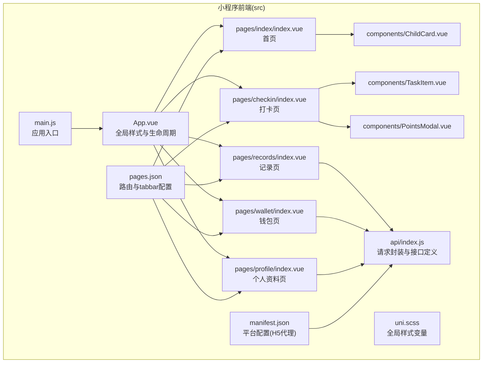
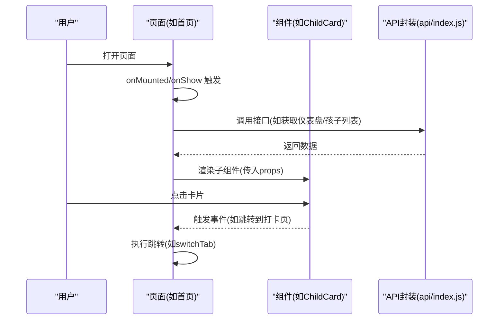
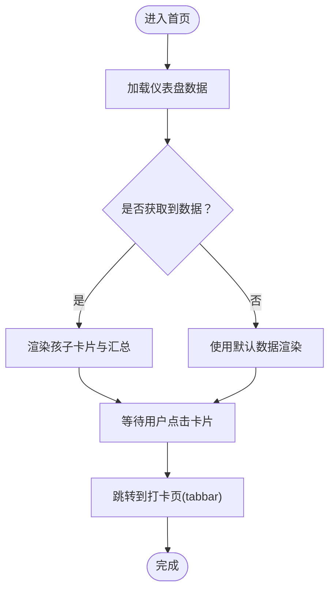
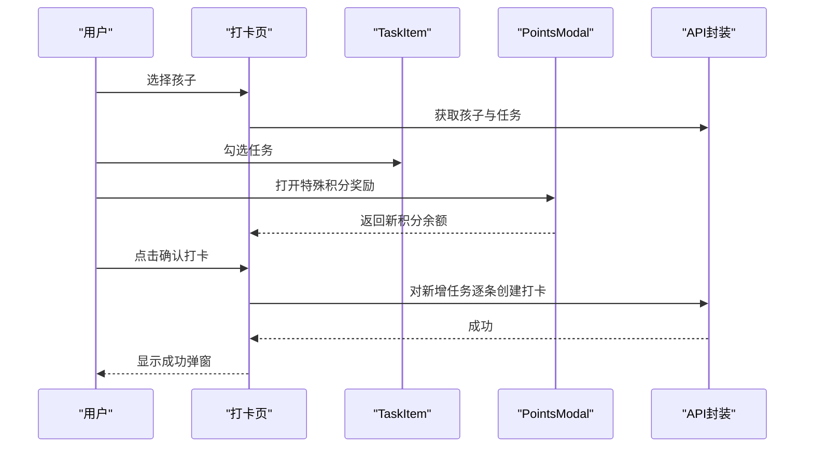
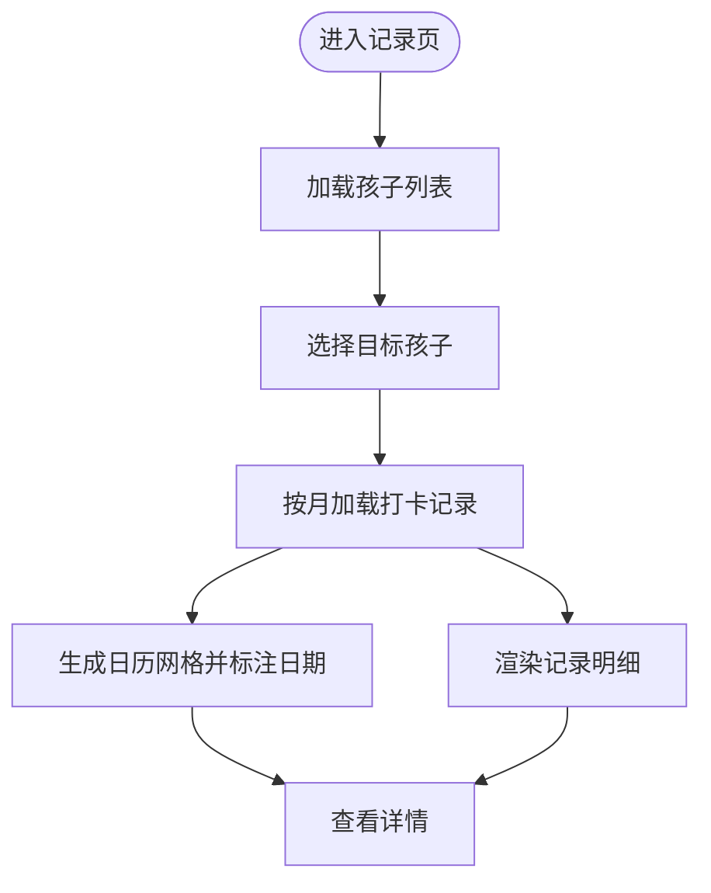
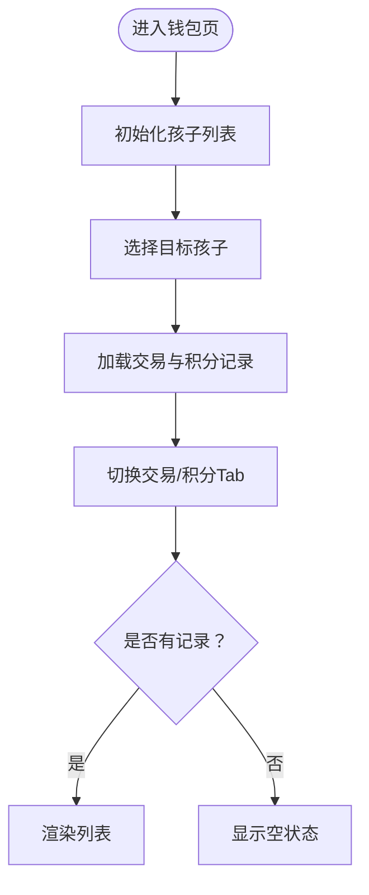
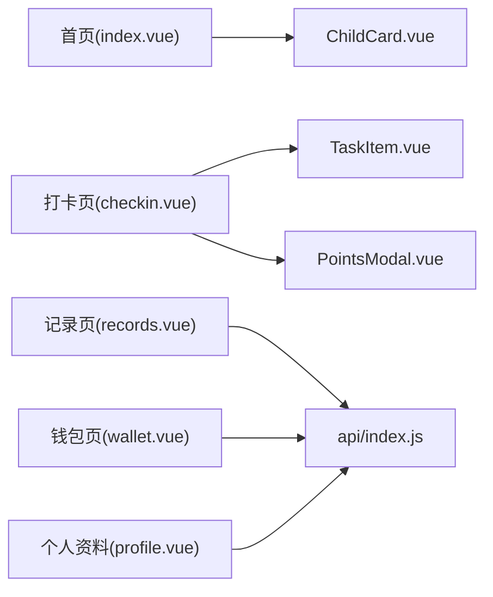

# 页面结构设计

<cite>
**本文引用的文件**
- [pages.json](file://star-park/miniprogram/src/pages.json)
- [App.vue](file://star-park/miniprogram/src/App.vue)
- [main.js](file://star-park/miniprogram/src/main.js)
- [manifest.json](file://star-park/miniprogram/src/manifest.json)
- [uni.scss](file://star-park/miniprogram/src/uni.scss)
- [index.vue（首页）](file://star-park/miniprogram/src/pages/index/index.vue)
- [checkin.vue（打卡页）](file://star-park/miniprogram/src/pages/checkin/index.vue)
- [records.vue（记录页）](file://star-park/miniprogram/src/pages/records/index.vue)
- [wallet.vue（钱包页）](file://star-park/miniprogram/src/pages/wallet/index.vue)
- [profile.vue（个人资料页）](file://star-park/miniprogram/src/pages/profile/index.vue)
- [ChildCard.vue](file://star-park/miniprogram/src/components/ChildCard.vue)
- [TaskItem.vue](file://star-park/miniprogram/src/components/TaskItem.vue)
- [PointsModal.vue](file://star-park/miniprogram/src/components/PointsModal.vue)
- [api/index.js](file://star-park/miniprogram/src/api/index.js)
- [package.json](file://star-park/miniprogram/package.json)
</cite>

## 目录
1. [简介](#简介)
2. [项目结构](#项目结构)
3. [核心组件](#核心组件)
4. [架构总览](#架构总览)
5. [详细组件分析](#详细组件分析)
6. [依赖关系分析](#依赖关系分析)
7. [性能考虑](#性能考虑)
8. [故障排查指南](#故障排查指南)
9. [结论](#结论)
10. [附录](#附录)

## 简介
本文件面向StarParadise小程序的页面结构与交互设计，围绕pages.json路由配置、页面注册机制、导航栏与tabbar设置进行系统化梳理；并深入解析首页任务列表、打卡页面、个人资料页、记录页面的设计思路与实现细节，覆盖页面生命周期、数据传递机制、页面间跳转逻辑、响应式布局与样式适配、动画效果与用户体验优化等关键技术点。同时提供页面开发规范、性能优化建议与调试技巧，帮助开发者快速理解与迭代该小程序。

## 项目结构
- 采用UniApp多端统一框架，页面与组件位于src目录下，页面以pages/xxx/index.vue组织，公共组件位于components/目录。
- 全局样式变量集中于uni.scss，全局应用样式在App.vue中定义。
- 页面注册与tabbar配置集中在pages.json，manifest.json用于小程序平台配置与H5代理设置。

图表来源
- [pages.json:1-54](file://star-park/miniprogram/src/pages.json#L1-L54)
- [App.vue:1-26](file://star-park/miniprogram/src/App.vue#L1-L26)
- [uni.scss:1-17](file://star-park/miniprogram/src/uni.scss#L1-L17)
- [main.js:1-8](file://star-park/miniprogram/src/main.js#L1-L8)
- [manifest.json:1-31](file://star-park/miniprogram/src/manifest.json#L1-L31)
- [index.vue（首页）:1-194](file://star-park/miniprogram/src/pages/index/index.vue#L1-L194)
- [checkin.vue（打卡页）:1-322](file://star-park/miniprogram/src/pages/checkin/index.vue#L1-L322)
- [records.vue（记录页）:1-460](file://star-park/miniprogram/src/pages/records/index.vue#L1-L460)
- [wallet.vue（钱包页）:1-368](file://star-park/miniprogram/src/pages/wallet/index.vue#L1-L368)
- [profile.vue（个人资料页）:1-211](file://star-park/miniprogram/src/pages/profile/index.vue#L1-L211)
- [ChildCard.vue:1-162](file://star-park/miniprogram/src/components/ChildCard.vue#L1-L162)
- [TaskItem.vue:1-133](file://star-park/miniprogram/src/components/TaskItem.vue#L1-L133)
- [PointsModal.vue:1-241](file://star-park/miniprogram/src/components/PointsModal.vue#L1-L241)
- [api/index.js:1-75](file://star-park/miniprogram/src/api/index.js#L1-L75)

章节来源
- [pages.json:1-54](file://star-park/miniprogram/src/pages.json#L1-L54)
- [App.vue:1-26](file://star-park/miniprogram/src/App.vue#L1-L26)
- [uni.scss:1-17](file://star-park/miniprogram/src/uni.scss#L1-L17)
- [main.js:1-8](file://star-park/miniprogram/src/main.js#L1-L8)
- [manifest.json:1-31](file://star-park/miniprogram/src/manifest.json#L1-L31)

## 核心组件
- 页面注册与tabbar：pages.json集中声明页面与tabbar，统一管理导航与图标资源路径。
- 全局样式：uni.scss定义主题色、半径、阴影等变量；App.vue设置全局page背景与字体族。
- 应用入口：main.js导出createApp工厂函数，供UniApp运行时调用。
- 平台配置：manifest.json启用微信小程序端与H5端，H5端通过Vite代理转发/api到后端服务。

章节来源
- [pages.json:1-54](file://star-park/miniprogram/src/pages.json#L1-L54)
- [App.vue:17-26](file://star-park/miniprogram/src/App.vue#L17-L26)
- [uni.scss:1-17](file://star-park/miniprogram/src/uni.scss#L1-L17)
- [main.js:1-8](file://star-park/miniprogram/src/main.js#L1-L8)
- [manifest.json:8-29](file://star-park/miniprogram/src/manifest.json#L8-L29)

## 架构总览
- 页面层：首页、打卡页、记录页、钱包页、个人资料页。
- 组件层：ChildCard、TaskItem、PointsModal等可复用UI组件。
- 数据层：api/index.js统一封装请求，按页面职责调用不同接口。
- 生命周期：各页面在onMounted/onShow中拉取数据，确保进入即刷新最新状态。

图表来源
- [index.vue（首页）:92-132](file://star-park/miniprogram/src/pages/index/index.vue#L92-L132)
- [ChildCard.vue:1-43](file://star-park/miniprogram/src/components/ChildCard.vue#L1-L43)
- [api/index.js:35-74](file://star-park/miniprogram/src/api/index.js#L35-L74)

## 详细组件分析

### 首页（任务列表）
- 功能定位：展示问候语与日期、孩子卡片列表、汇总统计（最长连续、本周完成率、总积累）。
- 生命周期：onMounted与onShow均触发loadDashboard，保证每次可见时刷新数据。
- 数据来源：优先调用仪表盘接口，失败时回退默认数据。
- 页面跳转：点击卡片触发跳转至tabbar中的“打卡”页。
- 响应式布局：使用rpx单位与flex布局，配合全局阴影与圆角变量提升视觉一致性。
- 动画与体验：卡片状态变化与按钮禁用态增强反馈。

图表来源
- [index.vue（首页）:92-132](file://star-park/miniprogram/src/pages/index/index.vue#L92-L132)

章节来源
- [index.vue（首页）:1-194](file://star-park/miniprogram/src/pages/index/index.vue#L1-L194)
- [ChildCard.vue:1-162](file://star-park/miniprogram/src/components/ChildCard.vue#L1-L162)

### 打卡页面（任务与奖励）
- 功能定位：多孩子切换、任务勾选、特殊积分奖励、打卡成功提示与统计卡片。
- 生命周期：onMounted/onShow均加载数据，并标记当日已完成的任务。
- 数据来源：获取孩子列表与任务，标记今日已完成的任务；提交时对新增完成的任务逐一创建打卡记录。
- 页面跳转：通过tabbar直接切换到“首页/记录/钱包/我的”。
- 动画与体验：成功弹窗使用缩放动画；任务勾选与禁用态明确状态；积分奖励弹窗支持多孩子选择与表单校验。
- 错误处理：提交失败时toast提示并中断流程。

图表来源
- [checkin.vue（打卡页）:148-192](file://star-park/miniprogram/src/pages/checkin/index.vue#L148-L192)
- [TaskItem.vue:1-133](file://star-park/miniprogram/src/components/TaskItem.vue#L1-L133)
- [PointsModal.vue:83-102](file://star-park/miniprogram/src/components/PointsModal.vue#L83-L102)
- [api/index.js:42-46](file://star-park/miniprogram/src/api/index.js#L42-L46)

章节来源
- [checkin.vue（打卡页）:1-322](file://star-park/miniprogram/src/pages/checkin/index.vue#L1-L322)
- [TaskItem.vue:1-133](file://star-park/miniprogram/src/components/TaskItem.vue#L1-L133)
- [PointsModal.vue:1-241](file://star-park/miniprogram/src/components/PointsModal.vue#L1-L241)
- [api/index.js:1-75](file://star-park/miniprogram/src/api/index.js#L1-L75)

### 记录页面（日历与明细）
- 功能定位：按月展示打卡日历、记录明细、余额与礼物目标进度（特定孩子）。
- 生命周期：onMounted加载孩子列表，onShow根据当前选中孩子刷新记录。
- 数据来源：获取当月打卡记录，提取日期集合用于日历高亮；记录按时间倒序展示。
- 响应式布局：网格日历与卡片列表结合，rpx适配不同屏幕密度。
- 体验优化：空状态友好提示；今日高亮边框；不同金额颜色区分。

图表来源
- [records.vue（记录页）:127-203](file://star-park/miniprogram/src/pages/records/index.vue#L127-L203)

章节来源
- [records.vue（记录页）:1-460](file://star-park/miniprogram/src/pages/records/index.vue#L1-L460)

### 钱包页面（余额与明细）
- 功能定位：双余额展示（金额/积分）、交易明细与积分记录切换、时间格式化。
- 生命周期：onMounted初始化，onShow根据当前选中孩子刷新数据。
- 数据来源：分别加载交易与积分记录，限制展示数量；空状态友好提示。
- 体验优化：Tab切换卡片化；金额正负颜色区分；时间人性化格式。

图表来源
- [wallet.vue（钱包页）:117-182](file://star-park/miniprogram/src/pages/wallet/index.vue#L117-L182)

章节来源
- [wallet.vue（钱包页）:1-368](file://star-park/miniprogram/src/pages/wallet/index.vue#L1-L368)

### 个人资料页（菜单与关于）
- 功能定位：用户头像与描述、功能菜单（占位提示）、关于信息、底部标语。
- 交互策略：菜单项点击统一toast提示“功能开发中”，避免误操作。
- 体验优化：卡片化布局与阴影，信息分组清晰。

章节来源
- [profile.vue（个人资料页）:1-211](file://star-park/miniprogram/src/pages/profile/index.vue#L1-L211)

## 依赖关系分析
- 页面依赖关系：首页依赖ChildCard；打卡页依赖TaskItem与PointsModal；记录/钱包页依赖api封装；个人资料页依赖api（当前为占位）。
- 组件依赖关系：TaskItem与PointsModal为独立可复用组件；ChildCard作为首页子组件。
- 请求依赖关系：api/index.js统一管理所有接口，页面按需调用。

图表来源
- [index.vue（首页）:46-47](file://star-park/miniprogram/src/pages/index/index.vue#L46-L47)
- [checkin.vue（打卡页）:112-114](file://star-park/miniprogram/src/pages/checkin/index.vue#L112-L114)
- [records.vue（记录页）](file://star-park/miniprogram/src/pages/records/index.vue#L86)
- [wallet.vue（钱包页）](file://star-park/miniprogram/src/pages/wallet/index.vue#L87)
- [profile.vue（个人资料页）:71-85](file://star-park/miniprogram/src/pages/profile/index.vue#L71-L85)
- [ChildCard.vue:1-43](file://star-park/miniprogram/src/components/ChildCard.vue#L1-L43)
- [TaskItem.vue:1-36](file://star-park/miniprogram/src/components/TaskItem.vue#L1-L36)
- [PointsModal.vue:1-70](file://star-park/miniprogram/src/components/PointsModal.vue#L1-L70)
- [api/index.js:35-74](file://star-park/miniprogram/src/api/index.js#L35-L74)

章节来源
- [api/index.js:1-75](file://star-park/miniprogram/src/api/index.js#L1-L75)

## 性能考虑
- 数据加载策略
  - 在onShow中刷新数据，确保页面可见时总是最新，但应避免重复请求；可在页面内增加防抖或缓存标识。
  - 记录/钱包页对返回数据做截断（如最多50条），减少DOM渲染压力。
- 渲染优化
  - 使用scoped样式与rpx单位，避免过度重绘；卡片阴影与圆角变量统一，减少重复计算。
  - 列表渲染使用key绑定，提升diff效率。
- 网络与错误处理
  - 统一的请求封装与失败toast，避免白屏；接口失败时回退默认数据，保障可用性。
- H5代理
  - H5开发环境通过Vite代理转发/api，避免跨域问题，提高联调效率。

章节来源
- [records.vue（记录页）:139-140](file://star-park/miniprogram/src/pages/records/index.vue#L139-L140)
- [wallet.vue（钱包页）:139-148](file://star-park/miniprogram/src/pages/wallet/index.vue#L139-L148)
- [api/index.js:7-30](file://star-park/miniprogram/src/api/index.js#L7-L30)
- [manifest.json:19-28](file://star-park/miniprogram/src/manifest.json#L19-L28)

## 故障排查指南
- 页面无法显示或空白
  - 检查pages.json中页面路径与style配置是否正确。
  - 确认App.vue全局样式未阻断渲染。
- tabbar不生效
  - 确认tabbar.list中的pagePath与pages.json中声明一致，图标路径存在且可访问。
- 数据不更新
  - 确认onShow中触发了数据加载；检查api封装的请求是否成功返回。
- 打卡失败
  - 查看控制台错误日志；确认任务勾选状态与新增任务判断逻辑。
- H5联调失败
  - 检查manifest.json中/devServer/proxy配置与后端服务端口一致。

章节来源
- [pages.json:16-53](file://star-park/miniprogram/src/pages.json#L16-L53)
- [App.vue:17-26](file://star-park/miniprogram/src/App.vue#L17-L26)
- [api/index.js:7-30](file://star-park/miniprogram/src/api/index.js#L7-L30)
- [manifest.json:19-28](file://star-park/miniprogram/src/manifest.json#L19-L28)

## 结论
本项目基于UniApp构建，页面结构清晰、组件化程度高、数据流统一。通过pages.json集中管理路由与tabbar，结合生命周期与API封装，实现了从首页任务列表到打卡、记录、钱包、个人资料的完整业务闭环。建议在后续迭代中进一步完善个人资料页菜单功能、优化网络请求与缓存策略、增强异常场景的用户提示与回退逻辑，持续提升稳定性与用户体验。

## 附录

### 页面与tabbar配置要点
- 页面注册：pages.json中声明path与navigationBarTitleText，确保标题与导航一致。
- tabbar：统一颜色、图标与pagePath，保证视觉与行为一致。
- 全局样式：全局背景色与字体族在App.vue中统一设置，避免页面重复定义。

章节来源
- [pages.json:1-54](file://star-park/miniprogram/src/pages.json#L1-L54)
- [App.vue:17-26](file://star-park/miniprogram/src/App.vue#L17-L26)

### 页面生命周期与数据传递
- 生命周期：各页面在onMounted/onShow中加载数据，确保进入即刷新。
- 数据传递：组件通过props接收数据，通过事件向上通信；页面间通过uni提供的导航API跳转。

章节来源
- [index.vue（首页）:126-132](file://star-park/miniprogram/src/pages/index/index.vue#L126-L132)
- [checkin.vue（打卡页）:265-267](file://star-park/miniprogram/src/pages/checkin/index.vue#L265-L267)
- [records.vue（记录页）:197-203](file://star-park/miniprogram/src/pages/records/index.vue#L197-L203)
- [wallet.vue（钱包页）:176-182](file://star-park/miniprogram/src/pages/wallet/index.vue#L176-L182)

### 开发规范与调试技巧
- 开发规范
  - 统一使用rpx与全局SCSS变量，保持视觉一致性。
  - 组件命名与职责单一，props与事件命名清晰。
  - 页面级逻辑尽量集中在生命周期钩子中，避免分散。
- 调试技巧
  - 使用uni.showToast输出关键状态与错误信息。
  - H5端通过manifest.json代理快速联调后端接口。
  - 在onShow中刷新数据，便于测试页面切换后的状态同步。

章节来源
- [uni.scss:1-17](file://star-park/miniprogram/src/uni.scss#L1-L17)
- [manifest.json:19-28](file://star-park/miniprogram/src/manifest.json#L19-L28)
- [api/index.js:24-26](file://star-park/miniprogram/src/api/index.js#L24-L26)