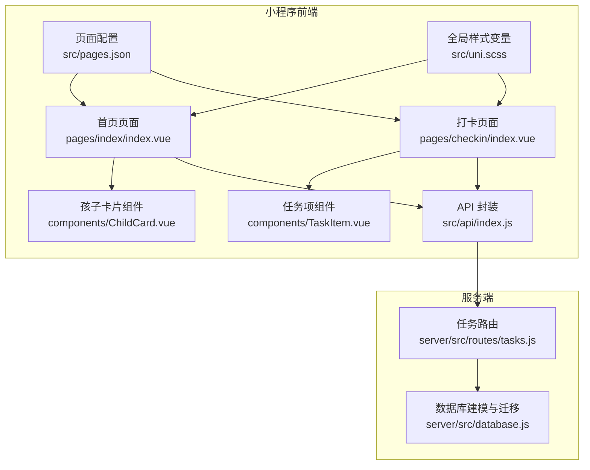
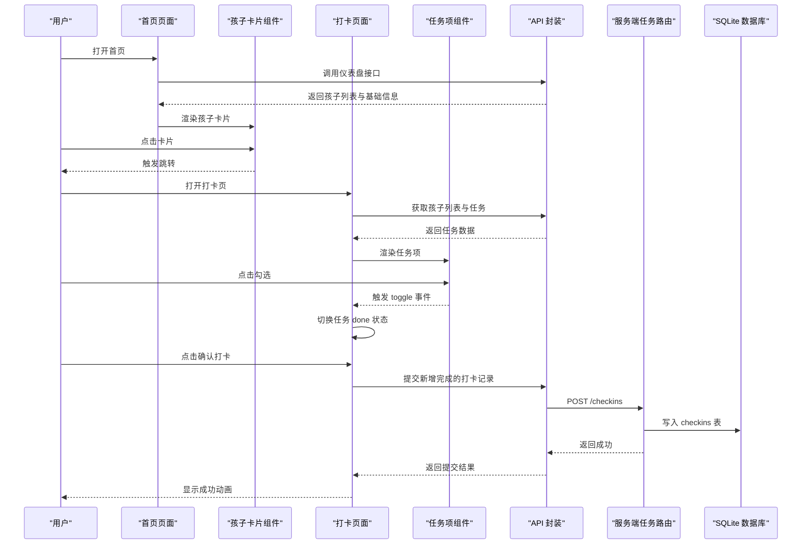
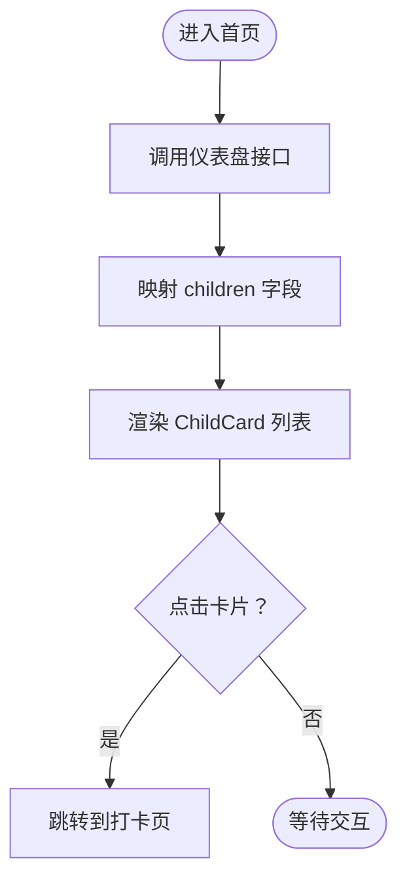
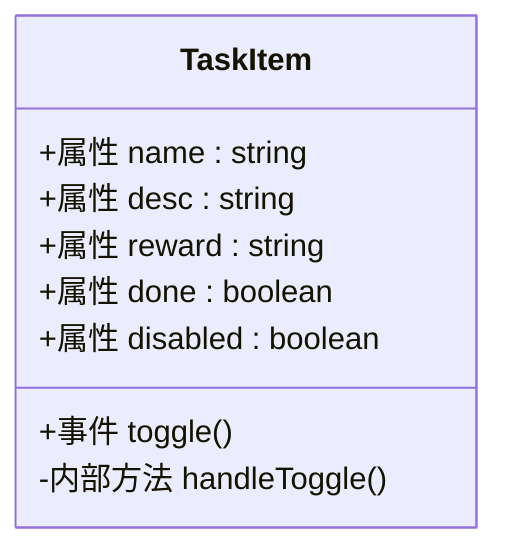
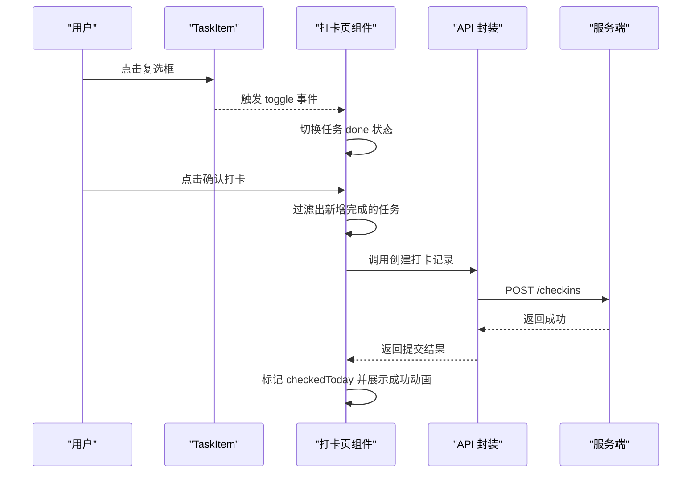
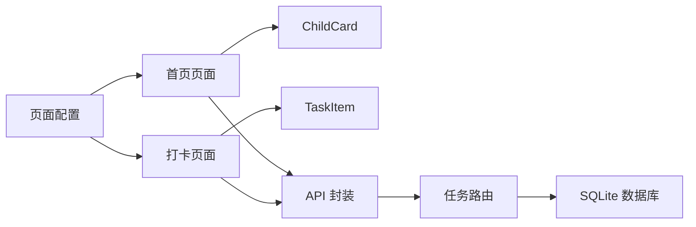
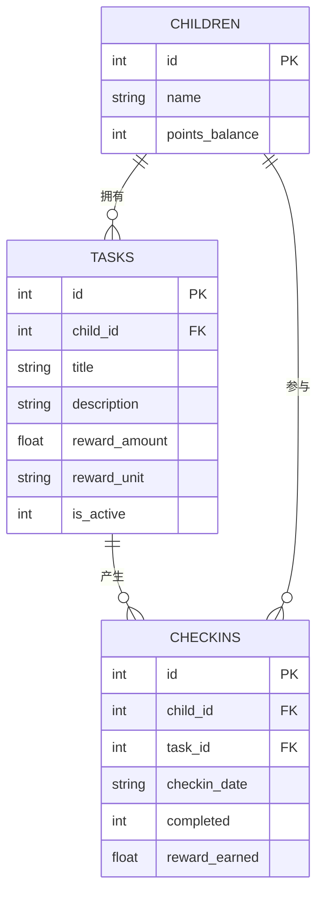

# 首页任务列表

<cite>
**本文引用的文件**
- [index.vue](file://star-park/miniprogram/src/pages/index/index.vue)
- [TaskItem.vue](file://star-park/miniprogram/src/components/TaskItem.vue)
- [ChildCard.vue](file://star-park/miniprogram/src/components/ChildCard.vue)
- [index.vue](file://star-park/miniprogram/src/pages/checkin/index.vue)
- [index.js](file://star-park/miniprogram/src/api/index.js)
- [pages.json](file://star-park/miniprogram/src/pages.json)
- [uni.scss](file://star-park/miniprogram/src/uni.scss)
- [index.js](file://star-park/server/src/routes/tasks.js)
- [database.js](file://star-park/server/src/database.js)
</cite>

## 目录
1. [简介](#简介)
2. [项目结构](#项目结构)
3. [核心组件](#核心组件)
4. [架构概览](#架构概览)
5. [详细组件分析](#详细组件分析)
6. [依赖关系分析](#依赖关系分析)
7. [性能考虑](#性能考虑)
8. [故障排查指南](#故障排查指南)
9. [结论](#结论)
10. [附录](#附录)

## 简介
本文件聚焦于 StarParadise 小程序首页“任务列表”相关能力与实现，围绕以下目标展开：
- 解释首页的任务展示逻辑、任务状态管理与完成操作
- 详解 TaskItem 组件的实现细节、数据绑定、点击事件处理与状态切换机制
- 说明任务列表的渲染优化、数据缓存策略与实时状态更新
- 介绍任务排序规则、过滤条件与搜索功能的实现现状
- 提供页面性能优化技巧、用户体验设计原则与常见问题解决方案

需要特别说明的是：当前仓库中首页页面并未直接渲染任务列表，而是通过 ChildCard 展示每个孩子的任务描述与打卡状态；真正的任务列表与完成操作位于“每日打卡”页面。本文将结合首页与打卡页的实现，给出完整的任务生命周期说明与优化建议。

## 项目结构
首页与任务相关的关键文件组织如下：
- 页面层
  - 首页：pages/index/index.vue
  - 打卡页：pages/checkin/index.vue
  - 记录页：pages/records/index.vue（用于查看历史打卡）
- 组件层
  - 任务项：components/TaskItem.vue
  - 孩子卡片：components/ChildCard.vue
- API 层
  - 请求封装与接口定义：src/api/index.js
- 样式与全局配置
  - 全局样式变量：src/uni.scss
  - 页面路由与 TabBar 配置：src/pages.json
- 服务端
  - 任务相关路由：server/src/routes/tasks.js
  - 数据库建模与迁移：server/src/database.js

图表来源
- [index.vue:1-194](file://star-park/miniprogram/src/pages/index/index.vue#L1-L194)
- [index.vue:1-322](file://star-park/miniprogram/src/pages/checkin/index.vue#L1-L322)
- [TaskItem.vue:1-133](file://star-park/miniprogram/src/components/TaskItem.vue#L1-L133)
- [ChildCard.vue:1-162](file://star-park/miniprogram/src/components/ChildCard.vue#L1-L162)
- [index.js:1-75](file://star-park/miniprogram/src/api/index.js#L1-L75)
- [pages.json:1-54](file://star-park/miniprogram/src/pages.json#L1-L54)
- [uni.scss:1-17](file://star-park/miniprogram/src/uni.scss#L1-L17)
- [index.js:1-91](file://star-park/server/src/routes/tasks.js#L1-L91)
- [database.js:1-111](file://star-park/server/src/database.js#L1-L111)

章节来源
- [index.vue:1-194](file://star-park/miniprogram/src/pages/index/index.vue#L1-L194)
- [index.vue:1-322](file://star-park/miniprogram/src/pages/checkin/index.vue#L1-L322)
- [TaskItem.vue:1-133](file://star-park/miniprogram/src/components/TaskItem.vue#L1-L133)
- [ChildCard.vue:1-162](file://star-park/miniprogram/src/components/ChildCard.vue#L1-L162)
- [index.js:1-75](file://star-park/miniprogram/src/api/index.js#L1-L75)
- [pages.json:1-54](file://star-park/miniprogram/src/pages.json#L1-L54)
- [uni.scss:1-17](file://star-park/miniprogram/src/uni.scss#L1-L17)
- [index.js:1-91](file://star-park/server/src/routes/tasks.js#L1-L91)
- [database.js:1-111](file://star-park/server/src/database.js#L1-L111)

## 核心组件
- 首页任务展示载体：ChildCard
  - 作用：展示每个孩子的名称、头像、任务描述、是否已打卡、连续天数与累计余额等信息
  - 关键属性：name、avatarText、color、taskDesc、checkedIn、streak、balance
  - 交互：支持点击跳转到打卡页
- 任务项组件：TaskItem
  - 作用：单个任务的勾选控件与信息展示，支持完成态样式与禁用态
  - 关键属性：name、desc、reward、done、disabled
  - 事件：toggle（由父组件监听并处理）
- 打卡页任务列表
  - 作用：按孩子维度展示任务列表，支持勾选完成、计算今日奖励、提交打卡
  - 关键逻辑：标记今日已打过卡的任务、提交新增完成的任务、展示成功动画

章节来源
- [ChildCard.vue:1-162](file://star-park/miniprogram/src/components/ChildCard.vue#L1-L162)
- [TaskItem.vue:1-133](file://star-park/miniprogram/src/components/TaskItem.vue#L1-L133)
- [index.vue:1-322](file://star-park/miniprogram/src/pages/checkin/index.vue#L1-L322)

## 架构概览
整体流程分为“数据获取—状态管理—UI 渲染—提交更新”四个阶段，并贯穿“本地状态—远端 API—数据库”的闭环。

图表来源
- [index.vue:92-132](file://star-park/miniprogram/src/pages/index/index.vue#L92-L132)
- [index.vue:152-192](file://star-park/miniprogram/src/pages/checkin/index.vue#L152-L192)
- [TaskItem.vue:32-35](file://star-park/miniprogram/src/components/TaskItem.vue#L32-L35)
- [index.js:35-74](file://star-park/miniprogram/src/api/index.js#L35-L74)
- [index.js:1-91](file://star-park/server/src/routes/tasks.js#L1-L91)
- [database.js:39-49](file://star-park/server/src/database.js#L39-L49)

## 详细组件分析

### 首页任务展示（ChildCard）
- 数据来源与映射
  - 首页通过仪表盘接口获取 children 列表，对返回数据进行格式化，生成 avatarText、color、taskDesc、checkedIn、streak、balance 等字段，传递给 ChildCard
- 交互行为
  - ChildCard 支持点击事件，首页在模板中绑定点击后跳转至打卡页
- 样式与主题
  - 使用全局样式变量控制主色、阴影、圆角等，保证视觉一致性

图表来源
- [index.vue:100-124](file://star-park/miniprogram/src/pages/index/index.vue#L100-L124)
- [ChildCard.vue:1-43](file://star-park/miniprogram/src/components/ChildCard.vue#L1-L43)
- [uni.scss:1-17](file://star-park/miniprogram/src/uni.scss#L1-L17)

章节来源
- [index.vue:100-132](file://star-park/miniprogram/src/pages/index/index.vue#L100-L132)
- [ChildCard.vue:1-162](file://star-park/miniprogram/src/components/ChildCard.vue#L1-L162)
- [uni.scss:1-17](file://star-park/miniprogram/src/uni.scss#L1-L17)

### 任务项组件（TaskItem）
- 属性与状态
  - name/desc/reward：任务基本信息
  - done：完成态（影响样式与文本划线）
  - disabled：禁用态（阻止点击，常用于已打过卡的任务）
- 事件机制
  - 当未禁用时，点击复选框触发 toggle 事件，由父组件处理状态切换
- 样式与反馈
  - 完成态与禁用态分别通过类名切换，提供明确的视觉反馈

图表来源
- [TaskItem.vue:21-36](file://star-park/miniprogram/src/components/TaskItem.vue#L21-L36)

章节来源
- [TaskItem.vue:1-133](file://star-park/miniprogram/src/components/TaskItem.vue#L1-L133)

### 打卡页任务列表（交互与状态）
- 子组件使用
  - 通过 v-for 渲染 TaskItem，绑定 name/desc/reward/done/disabled，并监听 toggle 事件
- 状态计算
  - canSubmit：至少有一个任务完成
  - allDone：所有任务均已完成
  - todayReward：根据完成任务的奖励金额累加
- 任务切换
  - toggleTask：在未被标记为“今日已打过卡”时，切换 done 状态
- 实时更新
  - 提交成功后，将新增完成的任务标记为 checkedToday，并展示成功动画
  - 通过重新加载数据或调用“获取今日打卡记录”接口，刷新本地状态

图表来源
- [index.vue:53-75](file://star-park/miniprogram/src/pages/checkin/index.vue#L53-L75)
- [index.vue:152-155](file://star-park/miniprogram/src/pages/checkin/index.vue#L152-L155)
- [index.vue:165-192](file://star-park/miniprogram/src/pages/checkin/index.vue#L165-L192)
- [index.js:45-46](file://star-park/miniprogram/src/api/index.js#L45-L46)
- [index.js:1-91](file://star-park/server/src/routes/tasks.js#L1-L91)

章节来源
- [index.vue:1-322](file://star-park/miniprogram/src/pages/checkin/index.vue#L1-L322)
- [TaskItem.vue:1-133](file://star-park/miniprogram/src/components/TaskItem.vue#L1-L133)
- [index.js:1-75](file://star-park/miniprogram/src/api/index.js#L1-L75)
- [index.js:1-91](file://star-park/server/src/routes/tasks.js#L1-L91)

### 任务排序规则、过滤条件与搜索
- 排序规则
  - 服务端按任务 ID 升序返回任务列表，前端未做额外排序
- 过滤条件
  - 服务端支持按 child_id 过滤任务
- 搜索功能
  - 当前未实现任务标题/描述的搜索过滤

章节来源
- [index.js:5-19](file://star-park/server/src/routes/tasks.js#L5-L19)
- [index.js:60-61](file://star-park/miniprogram/src/api/index.js#L60-L61)

### 数据缓存策略与实时状态更新
- 首页数据
  - 首页在 onMounted/onShow 生命周期中拉取仪表盘数据，未见本地持久化缓存
- 打卡页数据
  - 打卡页在 onMounted/onShow 中加载孩子与任务列表，并调用“获取今日打卡记录”接口标记已打过卡的任务
  - 提交成功后，通过本地状态更新与成功动画反馈，避免立即刷新导致的闪烁

章节来源
- [index.vue:126-132](file://star-park/miniprogram/src/pages/index/index.vue#L126-L132)
- [index.vue:243-266](file://star-park/miniprogram/src/pages/checkin/index.vue#L243-L266)
- [index.vue:243-263](file://star-park/miniprogram/src/pages/checkin/index.vue#L243-L263)

## 依赖关系分析
- 组件依赖
  - 首页依赖 ChildCard；打卡页依赖 TaskItem
  - 两者均依赖 API 封装进行数据访问
- 外部依赖
  - API 封装基于 uni.request；服务端基于 Express 与 SQLite
- 路由与导航
  - pages.json 定义首页与打卡页的 TabBar，首页卡片点击跳转至打卡页

图表来源
- [index.vue:1-46](file://star-park/miniprogram/src/pages/index/index.vue#L1-L46)
- [index.vue:1-114](file://star-park/miniprogram/src/pages/checkin/index.vue#L1-L114)
- [TaskItem.vue:1-36](file://star-park/miniprogram/src/components/TaskItem.vue#L1-L36)
- [ChildCard.vue:1-42](file://star-park/miniprogram/src/components/ChildCard.vue#L1-L42)
- [index.js:1-75](file://star-park/miniprogram/src/api/index.js#L1-L75)
- [pages.json:1-54](file://star-park/miniprogram/src/pages.json#L1-L54)
- [index.js:1-91](file://star-park/server/src/routes/tasks.js#L1-L91)
- [database.js:1-111](file://star-park/server/src/database.js#L1-L111)

章节来源
- [index.vue:1-194](file://star-park/miniprogram/src/pages/index/index.vue#L1-L194)
- [index.vue:1-322](file://star-park/miniprogram/src/pages/checkin/index.vue#L1-L322)
- [TaskItem.vue:1-133](file://star-park/miniprogram/src/components/TaskItem.vue#L1-L133)
- [ChildCard.vue:1-162](file://star-park/miniprogram/src/components/ChildCard.vue#L1-L162)
- [index.js:1-75](file://star-park/miniprogram/src/api/index.js#L1-L75)
- [pages.json:1-54](file://star-park/miniprogram/src/pages.json#L1-L54)
- [index.js:1-91](file://star-park/server/src/routes/tasks.js#L1-L91)
- [database.js:1-111](file://star-park/server/src/database.js#L1-L111)

## 性能考虑
- 渲染优化
  - 首页使用 v-for 渲染 ChildCard，建议保持 key 的稳定性，避免不必要的重排
  - 打卡页使用 v-for 渲染 TaskItem，建议在任务较多时采用虚拟滚动或分页
- 状态更新
  - 打卡页在提交成功后仅更新本地状态，减少重复请求
  - 可考虑引入轻量缓存（如内存缓存）以降低重复加载成本
- 网络请求
  - API 封装统一处理错误提示，建议在高频请求场景增加节流/防抖
- 图标与资源
  - TabBar 图标与静态资源建议压缩与懒加载，减少首屏压力

## 故障排查指南
- 首页无法显示任务列表
  - 检查仪表盘接口返回结构与字段映射
  - 确认 children 列表非空且包含任务描述字段
- 打卡页任务无法勾选
  - 检查 disabled 属性是否被错误设置为 true
  - 确认 toggle 事件是否正确传递到父组件
- 提交打卡失败
  - 查看网络请求错误提示与服务端返回状态码
  - 确认任务 ID、child_id、checkin_date 参数是否正确
- 今日已打过卡的任务仍可勾选
  - 检查“标记今日已打过卡”的逻辑是否执行
  - 确认提交成功后本地状态是否同步更新

章节来源
- [index.vue:100-124](file://star-park/miniprogram/src/pages/index/index.vue#L100-L124)
- [index.vue:152-155](file://star-park/miniprogram/src/pages/checkin/index.vue#L152-L155)
- [index.vue:165-192](file://star-park/miniprogram/src/pages/checkin/index.vue#L165-L192)
- [index.js:7-30](file://star-park/miniprogram/src/api/index.js#L7-L30)
- [index.js:1-91](file://star-park/server/src/routes/tasks.js#L1-L91)

## 结论
- 首页通过 ChildCard 展示每个孩子的任务概览与打卡状态，引导用户进入打卡页
- 打卡页提供完整的任务勾选、状态计算与提交流程，具备良好的实时反馈
- 服务端提供按孩子筛选的任务列表与打卡记录写入能力，数据库模型清晰
- 建议在现有基础上增强搜索与排序、引入缓存与虚拟滚动等优化手段，进一步提升性能与体验

## 附录
- 任务数据模型（简化）
  - children：id、name、points_balance 等
  - tasks：child_id、title、description、reward_amount、reward_unit、is_active
  - checkins：child_id、task_id、checkin_date、completed、reward_earned

图表来源
- [database.js:18-80](file://star-park/server/src/database.js#L18-L80)