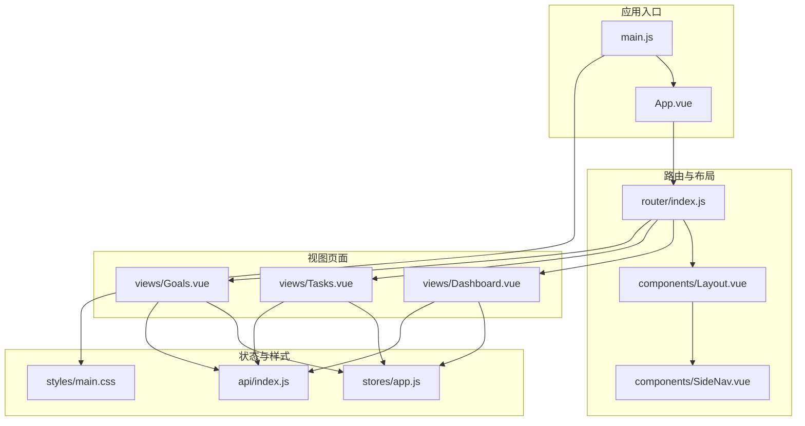
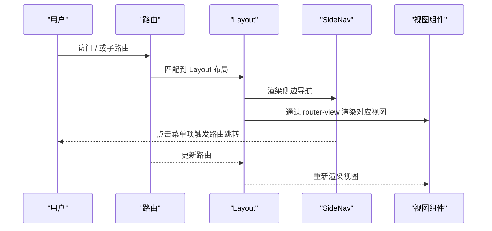
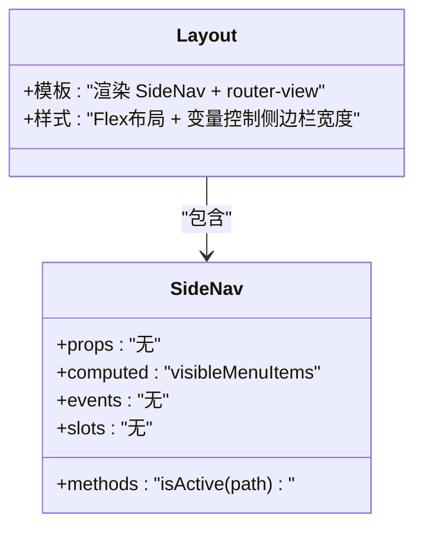
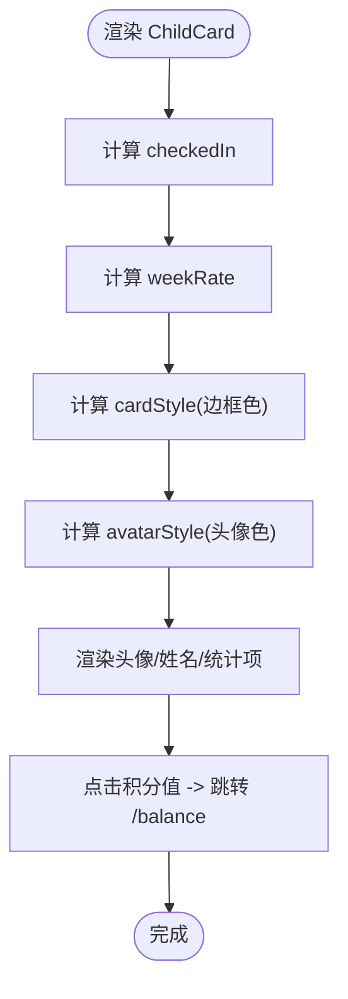
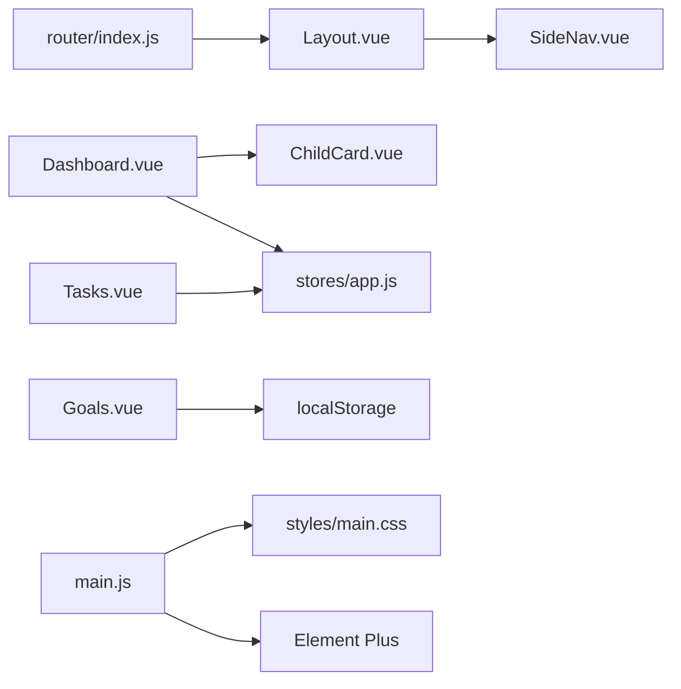

# PC管理后台组件

<cite>
**本文引用的文件**
- [Layout.vue](file://star-park/pc-admin/src/components/Layout.vue)
- [SideNav.vue](file://star-park/pc-admin/src/components/SideNav.vue)
- [ChildCard.vue](file://star-park/pc-admin/src/components/ChildCard.vue)
- [TaskItem.vue](file://star-park/miniprogram/src/components/TaskItem.vue)
- [router/index.js](file://star-park/pc-admin/src/router/index.js)
- [stores/app.js](file://star-park/pc-admin/src/stores/app.js)
- [styles/main.css](file://star-park/pc-admin/src/styles/main.css)
- [views/Dashboard.vue](file://star-park/pc-admin/src/views/Dashboard.vue)
- [views/Tasks.vue](file://star-park/pc-admin/src/views/Tasks.vue)
- [views/Goals.vue](file://star-park/pc-admin/src/views/Goals.vue)
- [api/index.js](file://star-park/pc-admin/src/api/index.js)
- [main.js](file://star-park/pc-admin/src/main.js)
</cite>

## 目录
1. [简介](#简介)
2. [项目结构](#项目结构)
3. [核心组件](#核心组件)
4. [架构总览](#架构总览)
5. [详细组件分析](#详细组件分析)
6. [依赖关系分析](#依赖关系分析)
7. [性能考量](#性能考量)
8. [故障排查指南](#故障排查指南)
9. [结论](#结论)
10. [附录](#附录)

## 简介
本文件面向StarParadise PC管理后台的前端组件体系，聚焦以下目标：
- 布局组件（Layout、SideNav）的整体架构与导航功能
- 业务组件（ChildCard、TaskItem）的业务逻辑与数据展示
- 组件的props、事件、插槽、样式定制
- Element Plus组件库的集成与主题变量配置
- 响应式布局与组件状态管理
- 组件间通信模式、数据流与错误处理策略

## 项目结构
PC管理后台采用Vue 3 + Vite + Pinia + Element Plus技术栈，组件位于src/components，页面视图位于src/views，路由在src/router，全局样式在src/styles，状态管理在src/stores。

图表来源
- [main.js:1-22](file://star-park/pc-admin/src/main.js#L1-L22)
- [router/index.js:1-67](file://star-park/pc-admin/src/router/index.js#L1-L67)
- [Layout.vue:1-29](file://star-park/pc-admin/src/components/Layout.vue#L1-L29)
- [SideNav.vue:1-132](file://star-park/pc-admin/src/components/SideNav.vue#L1-L132)
- [views/Dashboard.vue:1-146](file://star-park/pc-admin/src/views/Dashboard.vue#L1-L146)
- [views/Tasks.vue:1-265](file://star-park/pc-admin/src/views/Tasks.vue#L1-L265)
- [views/Goals.vue:1-686](file://star-park/pc-admin/src/views/Goals.vue#L1-L686)
- [stores/app.js:1-62](file://star-park/pc-admin/src/stores/app.js#L1-L62)
- [styles/main.css:1-164](file://star-park/pc-admin/src/styles/main.css#L1-L164)
- [api/index.js:1-55](file://star-park/pc-admin/src/api/index.js#L1-L55)

章节来源
- [router/index.js:1-67](file://star-park/pc-admin/src/router/index.js#L1-L67)
- [main.js:1-22](file://star-park/pc-admin/src/main.js#L1-L22)

## 核心组件
- Layout：负责整体布局容器，内嵌侧边导航与主内容区，通过router-view渲染当前路由视图。
- SideNav：固定侧边栏导航，基于路由生成菜单项，支持活动态样式与图标渲染。
- ChildCard：儿童信息卡片，展示打卡状态、连续天数、周完成率、余额与积分等指标，并支持跳转到积分记录页。
- TaskItem：任务项组件（小程序端），用于展示任务名称、描述、奖励与完成状态，支持toggle事件。

章节来源
- [Layout.vue:1-29](file://star-park/pc-admin/src/components/Layout.vue#L1-L29)
- [SideNav.vue:1-132](file://star-park/pc-admin/src/components/SideNav.vue#L1-L132)
- [ChildCard.vue:1-161](file://star-park/pc-admin/src/components/ChildCard.vue#L1-L161)
- [TaskItem.vue:1-98](file://star-park/miniprogram/src/components/TaskItem.vue#L1-L98)

## 架构总览
PC管理后台采用“路由驱动的布局 + 组件化视图”的架构模式：
- 路由层：定义页面路由与标题元信息，设置页面标题。
- 布局层：Layout包裹SideNav与router-view，控制主内容区宽度与背景。
- 视图层：各页面组件负责业务数据拉取、状态管理与UI交互。
- 状态层：Pinia Store集中管理儿童列表、当前选中儿童、加载状态与颜色映射。
- 样式层：CSS变量统一主题色、间距、阴影与滚动条；覆盖Element Plus主题变量以适配品牌色。

图表来源
- [router/index.js:1-67](file://star-park/pc-admin/src/router/index.js#L1-L67)
- [Layout.vue:1-29](file://star-park/pc-admin/src/components/Layout.vue#L1-L29)
- [SideNav.vue:1-132](file://star-park/pc-admin/src/components/SideNav.vue#L1-L132)

## 详细组件分析

### 布局组件：Layout 与 SideNav
- 设计要点
  - Layout使用Flex布局，主内容区通过CSS变量控制左侧边距，保证与SideNav宽度一致。
  - SideNav固定定位，包含Logo区、菜单区、底部信息区，菜单项根据路由动态高亮。
  - 菜单项通过Element Plus图标组件渲染，图标名来自路由meta或硬编码配置。
- Props/事件/插槽
  - Layout：无props；内部通过router-view渲染当前视图。
  - SideNav：无props；内部通过useRoute计算当前激活路径，无显式事件与插槽。
- 样式定制
  - 通过CSS变量控制侧边栏宽度、背景、阴影、文字色等。
  - 导航项悬停与激活态使用伪类与变量色实现。
- 使用示例
  - 在路由中将Layout作为父级组件，子路由自动进入主内容区。
- 错误处理
  - 菜单过滤隐藏项，避免渲染无效链接。
- 性能
  - 菜单项过滤在计算属性中完成，避免重复渲染。

图表来源
- [Layout.vue:1-29](file://star-park/pc-admin/src/components/Layout.vue#L1-L29)
- [SideNav.vue:25-48](file://star-park/pc-admin/src/components/SideNav.vue#L25-L48)

章节来源
- [Layout.vue:1-29](file://star-park/pc-admin/src/components/Layout.vue#L1-L29)
- [SideNav.vue:1-132](file://star-park/pc-admin/src/components/SideNav.vue#L1-L132)

### 业务组件：ChildCard
- 功能概述
  - 展示儿童头像占位、姓名、年级；统计今日打卡、连续天数、周完成率、余额与积分。
  - 周完成率使用Element Plus进度条组件，支持自定义颜色与显示文本。
  - 点击积分值跳转至积分记录页。
- Props
  - child: 对象，包含name、grade、todayCheckedIn、streak、weekRate、balance、points_balance等字段。
  - color: 字符串，卡片顶部边框与头像颜色映射，默认品牌色。
- 事件
  - 内部使用router.push进行页面跳转，无对外事件抛出。
- 插槽
  - 无插槽。
- 样式定制
  - 通过计算样式绑定边框与头像颜色；支持通过color prop影响主题一致性。
- 使用示例
  - 在Dashboard中遍历children，为每个child渲染一个ChildCard，并传入对应颜色映射。
- 错误处理
  - 对缺失字段使用默认值（如weekRate默认0、balance默认0、points_balance默认0）。
- 性能
  - 所有动态样式通过计算属性生成，减少模板表达式复杂度。

图表来源
- [ChildCard.vue:49-81](file://star-park/pc-admin/src/components/ChildCard.vue#L49-L81)

章节来源
- [ChildCard.vue:1-161](file://star-park/pc-admin/src/components/ChildCard.vue#L1-L161)
- [views/Dashboard.vue:8-17](file://star-park/pc-admin/src/views/Dashboard.vue#L8-L17)

### 业务组件：TaskItem（小程序端）
- 功能概述
  - 展示任务名称、描述与奖励，支持勾选完成状态；完成态下名称与奖励文本变淡并添加删除线。
- Props
  - name: 字符串，任务名称。
  - desc: 字符串，任务描述。
  - reward: 字符串，奖励说明。
  - done: 布尔，是否完成。
- 事件
  - toggle: 点击复选框时触发，供父组件监听。
- 插槽
  - 无插槽。
- 样式定制
  - 使用SCSS变量与品牌色，完成态降低透明度与颜色饱和度。
- 使用示例
  - 在任务列表中循环渲染，绑定done与toggle事件。
- 错误处理
  - 无网络请求，无需错误处理。
- 性能
  - 纯展示组件，性能开销极小。

章节来源
- [TaskItem.vue:1-98](file://star-park/miniprogram/src/components/TaskItem.vue#L1-L98)

### 视图组件：Dashboard（仪表盘）
- 数据流
  - 首次挂载尝试调用getDashboard获取数据；若失败则回退到store.fetchChildren拉取本地缓存。
  - children来源：优先展示接口返回的children数组，否则回退到Pinia store中的children。
- 交互
  - 快捷按钮直接跳转到打卡、任务、奖励、统计页面。
- 错误处理
  - 接口失败时打印错误并回退到store.fetchChildren。
- 响应式
  - cards-row使用flex与wrap实现卡片自适应排列。

章节来源
- [views/Dashboard.vue:43-92](file://star-park/pc-admin/src/views/Dashboard.vue#L43-L92)
- [api/index.js:44](file://star-park/pc-admin/src/api/index.js#L44)
- [stores/app.js:31-44](file://star-park/pc-admin/src/stores/app.js#L31-L44)

### 视图组件：Tasks（任务管理）
- 数据流
  - 初始化时先拉取children，再拉取所有任务列表；支持按孩子筛选。
  - 表单提交时根据编辑/新增分支调用createTask或updateTask，删除成功后刷新列表。
- 交互
  - 弹窗表单支持选择孩子、输入名称、描述、奖励金额与单位、开关启用状态。
  - 支持删除任务的二次确认。
- 错误处理
  - 提交与删除均捕获异常并提示错误信息。
- 响应式
  - 表格列宽与标签样式通过scoped样式与深选择器(:deep)控制。

章节来源
- [views/Tasks.vue:98-231](file://star-park/pc-admin/src/views/Tasks.vue#L98-L231)
- [api/index.js:24-28](file://star-park/pc-admin/src/api/index.js#L24-L28)

### 视图组件：Goals（目标管理）
- 数据流
  - 使用localStorage持久化目标与待办数据，首次加载时从本地恢复或填充默认数据。
  - 目标卡片支持状态分类与进度条展示；待办表格支持筛选、勾选、编辑与删除。
- 交互
  - 目标弹窗支持设置标题、状态与进度/目标；待办弹窗支持设置标题、关联目标、创建人、优先级与计划日期。
- 错误处理
  - 删除操作使用消息确认框，防止误删。
- 响应式
  - 目标网格在不同屏幕宽度下调整列数，确保移动端友好。

章节来源
- [views/Goals.vue:194-480](file://star-park/pc-admin/src/views/Goals.vue#L194-L480)

## 依赖关系分析
- 组件依赖
  - Layout依赖SideNav；Dashboard、Tasks、Goals依赖Layout作为路由容器。
  - Dashboard依赖ChildCard；Tasks依赖Element Plus表格、对话框、表单组件；Goals依赖Element Plus标签、表格、日期选择等。
- 状态依赖
  - Dashboard与Tasks共享Pinia store中的children与加载状态；Goals独立使用localStorage。
- 样式依赖
  - 所有组件共享styles/main.css中的CSS变量与Element Plus主题覆盖。
- 路由依赖
  - router/index.js定义了Layout与各子路由，beforeEach统一设置页面标题。

图表来源
- [Layout.vue:1-29](file://star-park/pc-admin/src/components/Layout.vue#L1-L29)
- [SideNav.vue:1-132](file://star-park/pc-admin/src/components/SideNav.vue#L1-L132)
- [views/Dashboard.vue:1-146](file://star-park/pc-admin/src/views/Dashboard.vue#L1-L146)
- [views/Tasks.vue:1-265](file://star-park/pc-admin/src/views/Tasks.vue#L1-L265)
- [views/Goals.vue:1-686](file://star-park/pc-admin/src/views/Goals.vue#L1-L686)
- [stores/app.js:1-62](file://star-park/pc-admin/src/stores/app.js#L1-L62)
- [router/index.js:1-67](file://star-park/pc-admin/src/router/index.js#L1-L67)
- [main.js:1-22](file://star-park/pc-admin/src/main.js#L1-L22)
- [styles/main.css:1-164](file://star-park/pc-admin/src/styles/main.css#L1-L164)

章节来源
- [router/index.js:1-67](file://star-park/pc-admin/src/router/index.js#L1-L67)
- [main.js:1-22](file://star-park/pc-admin/src/main.js#L1-L22)

## 性能考量
- 计算属性优化
  - SideNav的visibleMenuItems与ChildCard的checkedIn、weekRate均通过computed缓存结果，避免重复计算。
- 懒加载路由
  - 子路由组件通过动态导入，减少首屏包体积。
- 主题变量与样式复用
  - CSS变量统一主题色与阴影，减少重复样式声明；Element Plus主题覆盖仅在main.css中集中维护。
- 列表渲染
  - Dashboard中使用v-for渲染ChildCard，配合v-loading提升用户体验。

## 故障排查指南
- 页面标题未更新
  - 检查router.beforeEach是否正确设置document.title。
- 侧边导航未高亮
  - 检查menuItems的path与当前路由是否一致，isActive比较逻辑是否正确。
- 仪表盘数据为空
  - 检查getDashboard接口返回格式，确保children字段存在；若失败回退到store.fetchChildren。
- 任务管理无法保存
  - 检查表单必填项校验与payload字段映射；查看控制台错误信息。
- 目标/待办未持久化
  - 检查localStorage写入与读取键名是否一致。

章节来源
- [router/index.js:61-64](file://star-park/pc-admin/src/router/index.js#L61-L64)
- [SideNav.vue:41-47](file://star-park/pc-admin/src/components/SideNav.vue#L41-L47)
- [views/Dashboard.vue:76-91](file://star-park/pc-admin/src/views/Dashboard.vue#L76-L91)
- [views/Tasks.vue:160-201](file://star-park/pc-admin/src/views/Tasks.vue#L160-L201)
- [views/Goals.vue:461-479](file://star-park/pc-admin/src/views/Goals.vue#L461-L479)

## 结论
该PC管理后台组件体系以Layout/SideNav为核心布局，结合Pinia状态管理与Element Plus UI库，实现了清晰的数据流与良好的主题一致性。ChildCard与TaskItem分别承担业务数据展示与交互，Dashboard/Tasks/Goals等视图组件围绕这些基础组件构建完整的管理流程。通过CSS变量与路由守卫，系统具备良好的可扩展性与可维护性。

## 附录

### 组件属性与使用要点速查
- Layout
  - 用途：布局容器，内含SideNav与router-view
  - 关键点：主内容区通过CSS变量控制左侧边距
- SideNav
  - 用途：侧边导航菜单
  - 关键点：菜单项过滤hidden字段；isActive高亮
- ChildCard
  - 用途：儿童信息卡片
  - 关键点：props.child与color；周完成率使用el-progress
- TaskItem（小程序）
  - 用途：任务项展示
  - 关键点：done与toggle事件

章节来源
- [Layout.vue:1-29](file://star-park/pc-admin/src/components/Layout.vue#L1-L29)
- [SideNav.vue:31-47](file://star-park/pc-admin/src/components/SideNav.vue#L31-L47)
- [ChildCard.vue:53-80](file://star-park/pc-admin/src/components/ChildCard.vue#L53-L80)
- [TaskItem.vue:14-22](file://star-park/miniprogram/src/components/TaskItem.vue#L14-L22)