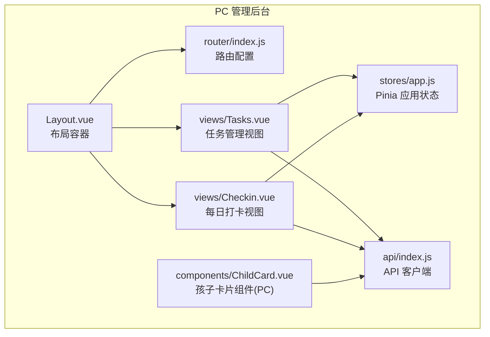
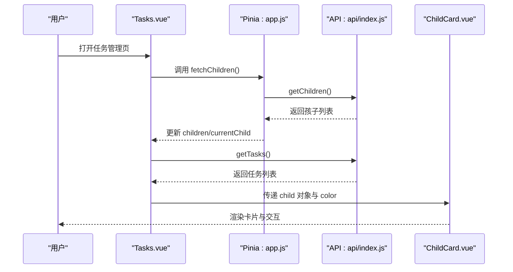
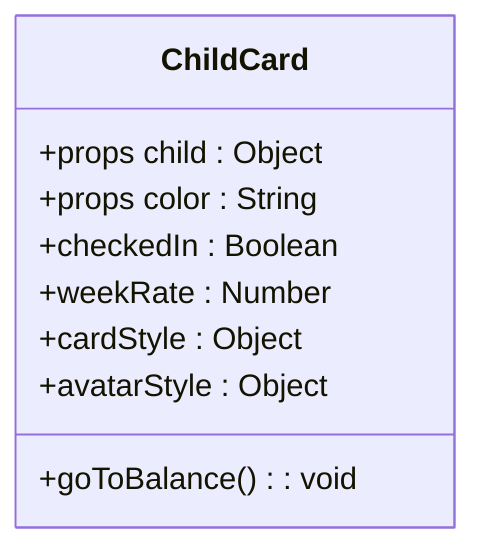
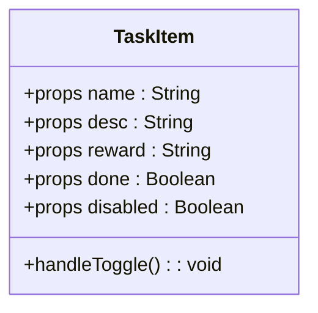
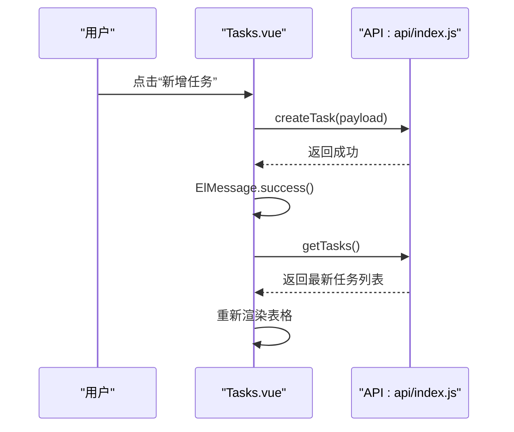
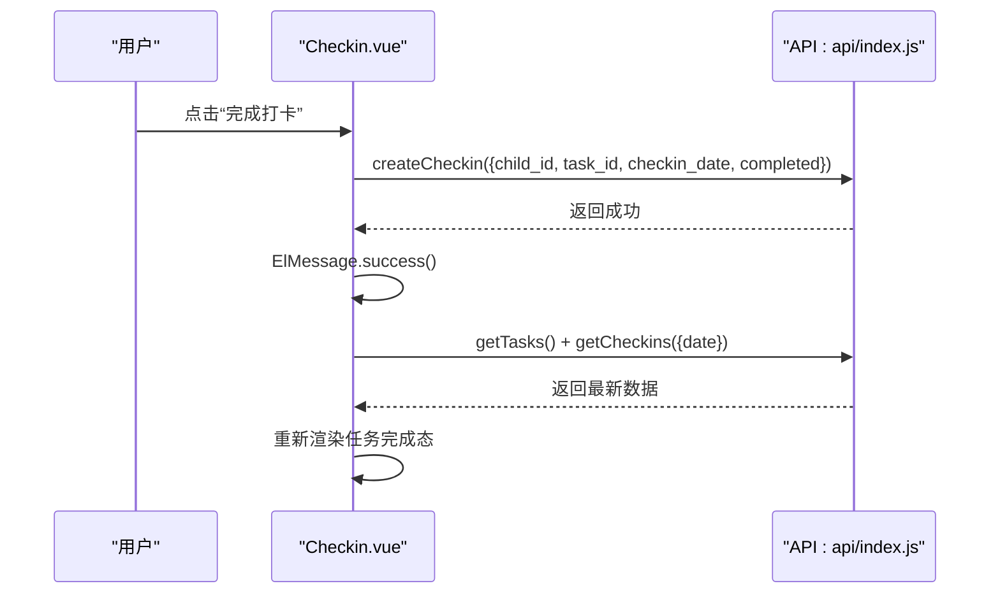
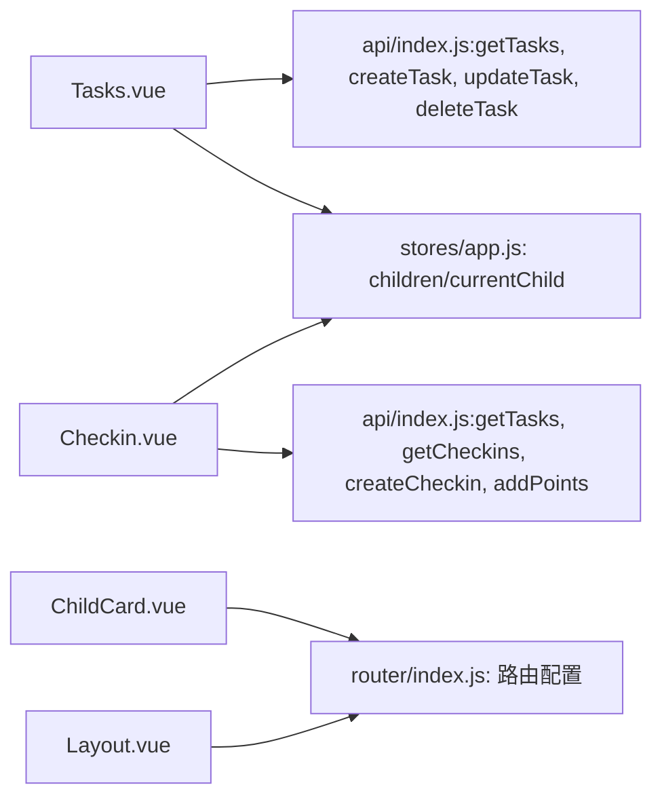

# 业务组件

<cite>
**本文引用的文件**
- [ChildCard.vue（PC 管理后台）](file://star-park/pc-admin/src/components/ChildCard.vue)
- [TaskItem.vue（小程序端）](file://star-park/miniprogram/src/components/TaskItem.vue)
- [Tasks.vue（PC 管理后台任务视图）](file://star-park/pc-admin/src/views/Tasks.vue)
- [Checkin.vue（PC 管理后台打卡视图）](file://star-park/pc-admin/src/views/Checkin.vue)
- [api/index.js（PC 管理后台 API 客户端）](file://star-park/pc-admin/src/api/index.js)
- [router/index.js（PC 路由配置）](file://star-park/pc-admin/src/router/index.js)
- [Layout.vue（PC 布局容器）](file://star-park/pc-admin/src/components/Layout.vue)
- [app.js（Pinia 应用状态）](file://star-park/pc-admin/src/stores/app.js)
</cite>

## 目录
1. [引言](#引言)
2. [项目结构](#项目结构)
3. [核心组件](#核心组件)
4. [架构总览](#架构总览)
5. [详细组件分析](#详细组件分析)
6. [依赖关系分析](#依赖关系分析)
7. [性能考量](#性能考量)
8. [故障排查指南](#故障排查指南)
9. [结论](#结论)
10. [附录](#附录)

## 引言
本文件面向 StarParadise PC 管理后台的业务组件，聚焦两类组件的设计与实现：
- ChildCard：以卡片形式展示孩子信息，包含打卡状态、连续天数、周完成率、余额与积分等关键指标，并支持点击跳转到积分明细页。
- TaskItem：在小程序端用于展示单个任务项，包含名称、描述、奖励、完成态与禁用态，支持点击切换完成状态。

同时，文档覆盖组件的 props 定义、事件处理、插槽使用、样式定制、数据格式转换、条件渲染、用户交互反馈、与 API 客户端的集成、数据刷新策略与错误处理机制，并提供可直接定位到源码路径的使用示例与应用场景说明。

## 项目结构
- 组件层：PC 后台组件位于 pc-admin/src/components；小程序组件位于 miniprogram/src/components。
- 视图层：PC 后台视图位于 pc-admin/src/views，如 Tasks、Checkin 等页面。
- 状态与路由：Pinia 状态位于 pc-admin/src/stores；路由位于 pc-admin/src/router。
- API 客户端：统一封装于 pc-admin/src/api/index.js，提供 children、tasks、checkins、rewards、stats、points 等接口。

图表来源
- [Layout.vue:1-29](file://star-park/pc-admin/src/components/Layout.vue#L1-L29)
- [router/index.js:1-67](file://star-park/pc-admin/src/router/index.js#L1-L67)
- [app.js:1-62](file://star-park/pc-admin/src/stores/app.js#L1-L62)
- [Tasks.vue:1-265](file://star-park/pc-admin/src/views/Tasks.vue#L1-L265)
- [Checkin.vue:1-417](file://star-park/pc-admin/src/views/Checkin.vue#L1-L417)
- [ChildCard.vue（PC）:1-161](file://star-park/pc-admin/src/components/ChildCard.vue#L1-L161)
- [api/index.js:1-56](file://star-park/pc-admin/src/api/index.js#L1-L56)

章节来源
- [Layout.vue:1-29](file://star-park/pc-admin/src/components/Layout.vue#L1-L29)
- [router/index.js:1-67](file://star-park/pc-admin/src/router/index.js#L1-L67)
- [app.js:1-62](file://star-park/pc-admin/src/stores/app.js#L1-L62)
- [Tasks.vue:1-265](file://star-park/pc-admin/src/views/Tasks.vue#L1-L265)
- [Checkin.vue:1-417](file://star-park/pc-admin/src/views/Checkin.vue#L1-L417)
- [ChildCard.vue（PC）:1-161](file://star-park/pc-admin/src/components/ChildCard.vue#L1-L161)
- [api/index.js:1-56](file://star-park/pc-admin/src/api/index.js#L1-L56)

## 核心组件
- ChildCard（PC）
  - 功能：以卡片形式展示孩子姓名、年级、今日打卡状态、连续打卡天数、本周完成率进度条、累计余额与积分余额。
  - 数据绑定：通过 props.child 接收孩子对象，内部计算 checkedIn 与 weekRate；通过 color 控制边框与头像配色。
  - 交互：点击“积分余额”数值区域触发路由跳转至“积分记录”页。
  - 样式：scoped 样式控制卡片尺寸、头像、标签与数值样式，支持主题变量与颜色定制。
- TaskItem（小程序）
  - 功能：展示任务名称、描述、奖励；根据 done/disabled 状态切换样式；支持点击触发 toggle 事件。
  - 数据绑定：通过 props.name/desc/reward/done/disabled 传入；内部通过 emit('toggle') 抛出事件。
  - 插槽：未使用具名/作用域插槽；通过模板内容组合展示。
  - 样式：SCSS scoped 样式，支持完成态与禁用态视觉差异。

章节来源
- [ChildCard.vue（PC）:1-161](file://star-park/pc-admin/src/components/ChildCard.vue#L1-L161)
- [TaskItem.vue（小程序）:1-133](file://star-park/miniprogram/src/components/TaskItem.vue#L1-L133)

## 架构总览
PC 管理后台采用“布局容器 + 路由 + 视图 + 组件 + 状态 + API 客户端”的分层架构。视图通过 Pinia 状态管理全局孩子列表与当前选中孩子，通过 API 客户端拉取数据并进行格式转换，组件负责渲染与交互。

图表来源
- [Tasks.vue:98-231](file://star-park/pc-admin/src/views/Tasks.vue#L98-L231)
- [app.js:31-44](file://star-park/pc-admin/src/stores/app.js#L31-L44)
- [api/index.js:22-22](file://star-park/pc-admin/src/api/index.js#L22-L22)
- [ChildCard.vue（PC）:49-81](file://star-park/pc-admin/src/components/ChildCard.vue#L49-L81)

## 详细组件分析

### ChildCard 组件（PC 管理后台）
- 设计与布局
  - 卡片头部包含圆形头像占位符（首字母）、姓名与年级。
  - 卡片主体包含多项指标：今日打卡（布尔状态）、连续打卡天数、本周完成率进度条、累计余额与积分余额。
  - 头像与卡片边框颜色由 props.color 控制，支持主题一致性。
- 数据绑定与计算
  - checkedIn：基于 child.todayCheckedIn 计算。
  - weekRate：基于 child.weekRate 计算。
  - cardStyle/avatarStyle：动态生成内联样式，确保颜色一致。
- 交互与导航
  - 点击“积分余额”数值区域，调用路由跳转至“积分记录”页。
- Props、事件与插槽
  - Props：child（对象）、color（字符串，默认主题色）。
  - 事件：无自定义事件抛出。
  - 插槽：未使用具名/作用域插槽。
- 样式定制
  - 支持通过 color 自定义主题色；卡片尺寸、字体、间距等通过 scoped 样式控制。
- 使用示例（路径）
  - 在任务管理或仪表盘中，将从 Pinia 状态读取的孩子对象传给 ChildCard，例如：
    - [Tasks.vue: 传参位置:113-113](file://star-park/pc-admin/src/views/Tasks.vue#L113-L113)
    - [app.js: children/currentChild 来源:31-44](file://star-park/pc-admin/src/stores/app.js#L31-L44)

图表来源
- [ChildCard.vue（PC）:49-81](file://star-park/pc-admin/src/components/ChildCard.vue#L49-L81)

章节来源
- [ChildCard.vue（PC）:1-161](file://star-park/pc-admin/src/components/ChildCard.vue#L1-L161)
- [Tasks.vue:113-113](file://star-park/pc-admin/src/views/Tasks.vue#L113-L113)
- [app.js:31-44](file://star-park/pc-admin/src/stores/app.js#L31-L44)

### TaskItem 组件（小程序端）
- 设计与布局
  - 左侧为复选框区域，右侧为任务信息与奖励展示；完成态与禁用态有明显视觉差异。
  - 支持显示任务描述与奖励单位（元/星星）。
- 数据绑定与交互
  - props: name/desc/reward/done/disabled。
  - 点击复选框区域触发 toggle 事件；当 disabled 为真时忽略点击。
- 事件与插槽
  - 事件：toggle。
  - 插槽：未使用具名/作用域插槽。
- 样式定制
  - SCSS scoped 样式，支持完成态与禁用态的样式切换。
- 使用示例（路径）
  - 在打卡视图中循环渲染任务项并监听 toggle 事件，例如：
    - [Checkin.vue: 任务项渲染与事件监听:38-69](file://star-park/pc-admin/src/views/Checkin.vue#L38-L69)
    - [TaskItem.vue: 事件定义与处理:21-36](file://star-park/miniprogram/src/components/TaskItem.vue#L21-L36)

图表来源
- [TaskItem.vue（小程序）:21-36](file://star-park/miniprogram/src/components/TaskItem.vue#L21-L36)

章节来源
- [TaskItem.vue（小程序）:1-133](file://star-park/miniprogram/src/components/TaskItem.vue#L1-L133)
- [Checkin.vue:38-69](file://star-park/pc-admin/src/views/Checkin.vue#L38-L69)

### 任务管理视图（Tasks.vue）
- 功能概览
  - 展示所有任务，按“所属孩子”筛选；支持新增/编辑/删除任务。
  - 表单字段包括：所属孩子、任务名称、描述、奖励金额与单位、是否启用。
- 数据流与刷新策略
  - 首次进入页面：加载孩子列表与任务列表；任务列表按当前选中孩子过滤。
  - 新增/编辑/删除后：调用对应 API 并重新拉取任务列表以刷新。
- 错误处理
  - 通过 Element Plus 的消息提示反馈操作结果；异常时打印日志并保持界面稳定。
- 使用示例（路径）
  - [Tasks.vue: 表格列与操作按钮:20-51](file://star-park/pc-admin/src/views/Tasks.vue#L20-L51)
  - [Tasks.vue: 表单提交与刷新:160-190](file://star-park/pc-admin/src/views/Tasks.vue#L160-L190)
  - [Tasks.vue: 删除任务:192-201](file://star-park/pc-admin/src/views/Tasks.vue#L192-L201)
  - [Tasks.vue: 获取任务列表:203-222](file://star-park/pc-admin/src/views/Tasks.vue#L203-L222)

图表来源
- [Tasks.vue:133-190](file://star-park/pc-admin/src/views/Tasks.vue#L133-L190)
- [api/index.js:26-26](file://star-park/pc-admin/src/api/index.js#L26-L26)

章节来源
- [Tasks.vue:1-265](file://star-park/pc-admin/src/views/Tasks.vue#L1-L265)
- [api/index.js:24-28](file://star-park/pc-admin/src/api/index.js#L24-L28)

### 每日打卡视图（Checkin.vue）
- 功能概览
  - 支持按日期筛选任务与打卡记录；每个孩子展示其任务清单与完成状态。
  - 提供“特殊积分奖励”入口，支持为孩子发放额外积分。
- 数据流与格式转换
  - 同步拉取任务与打卡数据，统一将 snake_case 字段映射为 camelCase，便于组件消费。
  - 通过 isTaskChecked 判断任务是否已完成，getCheckinReward 获取该任务已获得的奖励。
- 交互与反馈
  - 完成打卡后提示成功消息并重新拉取数据刷新状态。
  - “特殊积分奖励”弹窗收集孩子、积分数量与原因，提交后提示成功。
- 使用示例（路径）
  - [Checkin.vue: 任务渲染与完成态样式:38-69](file://star-park/pc-admin/src/views/Checkin.vue#L38-L69)
  - [Checkin.vue: 打卡提交与刷新:197-216](file://star-park/pc-admin/src/views/Checkin.vue#L197-L216)
  - [Checkin.vue: 特殊积分奖励弹窗:82-110](file://star-park/pc-admin/src/views/Checkin.vue#L82-L110)
  - [Checkin.vue: 提交积分奖励:232-249](file://star-park/pc-admin/src/views/Checkin.vue#L232-L249)

图表来源
- [Checkin.vue:197-216](file://star-park/pc-admin/src/views/Checkin.vue#L197-L216)
- [api/index.js:32-32](file://star-park/pc-admin/src/api/index.js#L32-L32)

章节来源
- [Checkin.vue:1-417](file://star-park/pc-admin/src/views/Checkin.vue#L1-L417)
- [api/index.js:30-32](file://star-park/pc-admin/src/api/index.js#L30-L32)

## 依赖关系分析
- 组件与状态
  - Tasks.vue 与 Checkin.vue 通过 Pinia 状态管理全局孩子列表与当前选中孩子，避免重复请求。
- 组件与 API
  - 任务管理：Tasks.vue 直接调用 getTasks/createTask/updateTask/deleteTask。
  - 打卡视图：Checkin.vue 调用 getTasks/getCheckins/createCheckin，以及特殊积分 addPoints。
- 组件与路由
  - ChildCard 中的积分余额点击跳转至“积分记录”页；路由配置见 router/index.js。
- 组件与布局
  - Layout.vue 作为根布局，承载侧边栏与主内容区，router-view 根据路由动态渲染视图。

图表来源
- [Tasks.vue:102-102](file://star-park/pc-admin/src/views/Tasks.vue#L102-L102)
- [Checkin.vue:118-118](file://star-park/pc-admin/src/views/Checkin.vue#L118-L118)
- [api/index.js:22-54](file://star-park/pc-admin/src/api/index.js#L22-L54)
- [router/index.js:1-67](file://star-park/pc-admin/src/router/index.js#L1-L67)
- [app.js:31-44](file://star-park/pc-admin/src/stores/app.js#L31-L44)
- [Layout.vue:1-29](file://star-park/pc-admin/src/components/Layout.vue#L1-L29)

章节来源
- [Tasks.vue:102-102](file://star-park/pc-admin/src/views/Tasks.vue#L102-L102)
- [Checkin.vue:118-118](file://star-park/pc-admin/src/views/Checkin.vue#L118-L118)
- [api/index.js:22-54](file://star-park/pc-admin/src/api/index.js#L22-L54)
- [router/index.js:1-67](file://star-park/pc-admin/src/router/index.js#L1-L67)
- [app.js:31-44](file://star-park/pc-admin/src/stores/app.js#L31-L44)
- [Layout.vue:1-29](file://star-park/pc-admin/src/components/Layout.vue#L1-L29)

## 性能考量
- 数据缓存与去重：Pinia 状态集中管理 children，减少重复请求。
- 并发请求：Checkin 视图使用 Promise.all 并行拉取任务与打卡数据，缩短等待时间。
- 渲染优化：Element Plus 的 v-loading 与空态组件提升长列表与空数据场景的体验。
- 样式隔离：scoped 样式避免全局污染，同时降低样式冲突成本。

## 故障排查指南
- API 请求失败
  - 症状：任务列表/打卡数据为空或报错。
  - 排查：查看响应拦截器日志与 Element Plus 消息提示；确认 baseURL 与网络连通性。
  - 参考路径：
    - [api/index.js: 响应拦截器与错误处理:13-19](file://star-park/pc-admin/src/api/index.js#L13-L19)
    - [Tasks.vue: 获取任务失败处理:217-218](file://star-park/pc-admin/src/views/Tasks.vue#L217-L218)
    - [Checkin.vue: 获取打卡数据失败处理:190-191](file://star-park/pc-admin/src/views/Checkin.vue#L190-L191)
- 任务状态不刷新
  - 症状：完成打卡后状态未更新。
  - 排查：确认提交成功后是否调用了 fetchCheckinData 或 fetchTasks；检查返回数据字段映射是否正确。
  - 参考路径：
    - [Checkin.vue: 打卡成功后刷新:210-211](file://star-park/pc-admin/src/views/Checkin.vue#L210-L211)
    - [Tasks.vue: 提交成功后刷新:183-183](file://star-park/pc-admin/src/views/Tasks.vue#L183-L183)
- 孩子颜色不生效
  - 症状：ChildCard 边框与头像颜色不符合预期。
  - 排查：确认传入的 color 是否正确；检查样式拼接逻辑。
  - 参考路径：
    - [ChildCard.vue: color 样式应用:69-76](file://star-park/pc-admin/src/components/ChildCard.vue#L69-L76)
- 任务项点击无效
  - 症状：点击 TaskItem 复选框无反应。
  - 排查：确认 disabled 为 false；检查事件监听是否正确绑定。
  - 参考路径：
    - [TaskItem.vue: 点击处理与事件抛出:32-35](file://star-park/miniprogram/src/components/TaskItem.vue#L32-L35)

章节来源
- [api/index.js:13-19](file://star-park/pc-admin/src/api/index.js#L13-L19)
- [Tasks.vue:217-218](file://star-park/pc-admin/src/views/Tasks.vue#L217-L218)
- [Checkin.vue:190-191](file://star-park/pc-admin/src/views/Checkin.vue#L190-L191)
- [ChildCard.vue（PC）:69-76](file://star-park/pc-admin/src/components/ChildCard.vue#L69-L76)
- [TaskItem.vue（小程序）:32-35](file://star-park/miniprogram/src/components/TaskItem.vue#L32-L35)

## 结论
ChildCard 与 TaskItem 分别承担了 PC 管理后台与小程序端的核心展示职责。二者通过统一的 API 客户端与 Pinia 状态管理形成清晰的数据流，配合 Element Plus 的 UI 组件与 scoped 样式，实现了良好的可维护性与用户体验。建议在后续迭代中：
- 在 PC 端补充 TaskItem 组件，统一任务项交互体验；
- 将 ChildCard 的颜色映射迁移至 Pinia，便于跨页面共享；
- 对 API 错误进行更细粒度的分类提示，提升可诊断性。

## 附录
- 组件属性与事件速查
  - ChildCard（PC）
    - Props：child（对象）、color（字符串）
    - 事件：无
    - 插槽：无
  - TaskItem（小程序）
    - Props：name、desc、reward、done、disabled
    - 事件：toggle
    - 插槽：无
- 关键使用示例（路径）
  - [Tasks.vue: 任务表格与对话框:1-96](file://star-park/pc-admin/src/views/Tasks.vue#L1-L96)
  - [Checkin.vue: 任务项渲染与打卡流程:38-216](file://star-park/pc-admin/src/views/Checkin.vue#L38-L216)
  - [ChildCard.vue（PC）: 样式与交互:1-81](file://star-park/pc-admin/src/components/ChildCard.vue#L1-L81)
  - [TaskItem.vue（小程序）: 事件与样式:1-36](file://star-park/miniprogram/src/components/TaskItem.vue#L1-L36)