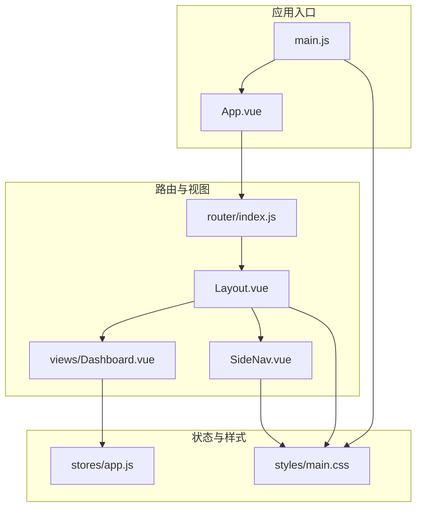
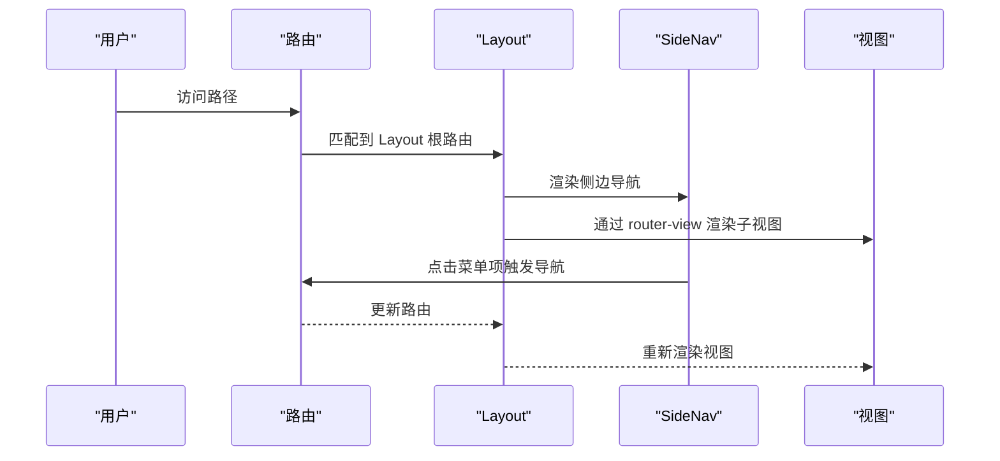
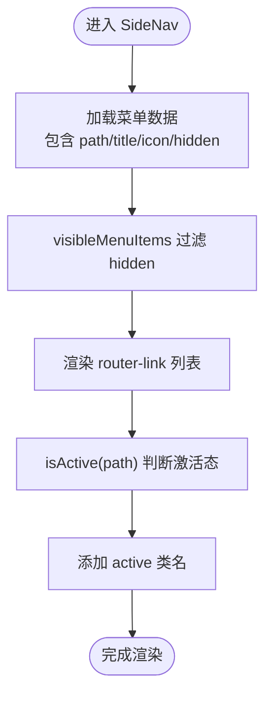
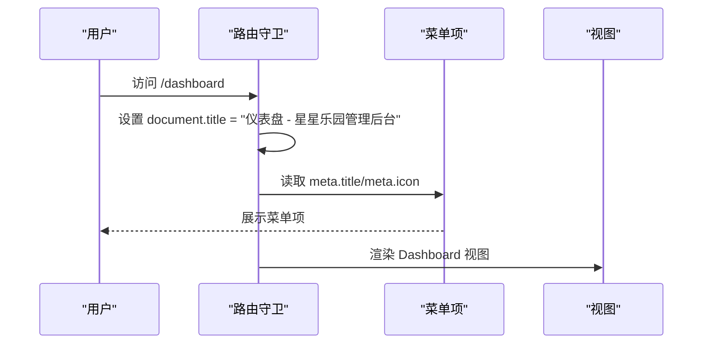
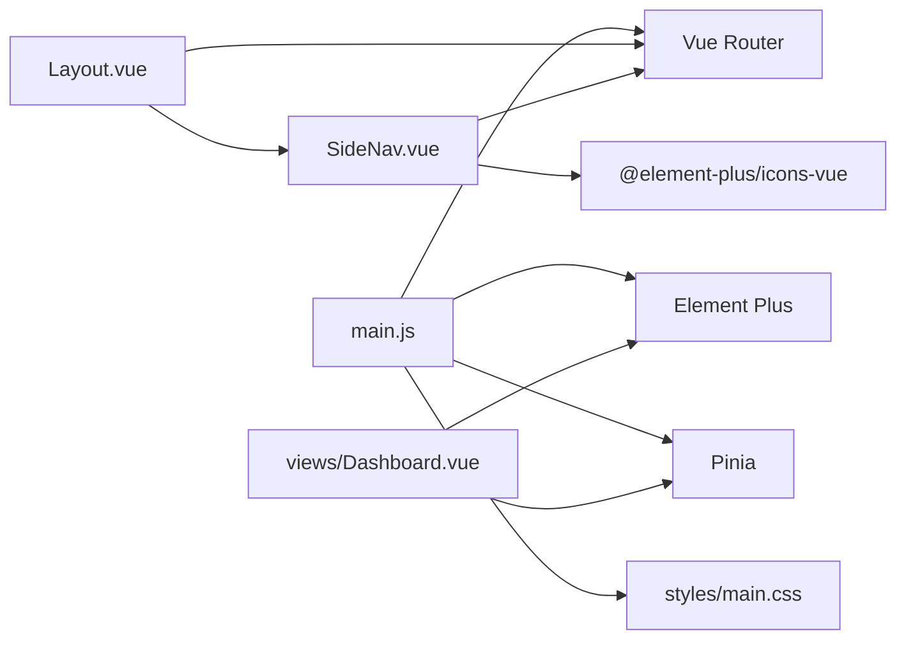

# 布局组件

<cite>
**本文引用的文件**
- [Layout.vue](file://star-park/pc-admin/src/components/Layout.vue)
- [SideNav.vue](file://star-park/pc-admin/src/components/SideNav.vue)
- [router/index.js](file://star-park/pc-admin/src/router/index.js)
- [main.js](file://star-park/pc-admin/src/main.js)
- [styles/main.css](file://star-park/pc-admin/src/styles/main.css)
- [App.vue](file://star-park/pc-admin/src/App.vue)
- [stores/app.js](file://star-park/pc-admin/src/stores/app.js)
- [views/Dashboard.vue](file://star-park/pc-admin/src/views/Dashboard.vue)
- [components/ChildCard.vue](file://star-park/pc-admin/src/components/ChildCard.vue)
- [package.json](file://star-park/pc-admin/package.json)
</cite>

## 目录
1. [简介](#简介)
2. [项目结构](#项目结构)
3. [核心组件](#核心组件)
4. [架构总览](#架构总览)
5. [组件详解](#组件详解)
6. [依赖关系分析](#依赖关系分析)
7. [性能与响应式特性](#性能与响应式特性)
8. [故障排查指南](#故障排查指南)
9. [结论](#结论)
10. [附录：使用示例与最佳实践](#附录使用示例与最佳实践)

## 简介
本文件面向 StarParadise PC 管理后台的布局组件体系，系统性梳理 Layout 组件的整体布局架构、SideNav 侧边栏导航实现、路由与菜单联动、样式与主题定制、以及与 Element Plus 的集成方式。文档同时覆盖响应式适配、生命周期与路由守卫配合、权限控制集成建议等关键主题，并提供可直接落地的使用示例与最佳实践。

## 项目结构
PC 管理后台采用 Vue 3 + Vue Router + Pinia + Element Plus 技术栈，布局层由 Layout 与 SideNav 组成，通过路由嵌套承载各业务视图。全局样式通过 CSS 变量统一主题色与尺寸，Element Plus 主题通过 CSS 覆盖实现一致风格。

图表来源
- [App.vue:1-10](file://star-park/pc-admin/src/App.vue#L1-L10)
- [main.js:1-22](file://star-park/pc-admin/src/main.js#L1-L22)
- [router/index.js:1-67](file://star-park/pc-admin/src/router/index.js#L1-L67)
- [Layout.vue:1-29](file://star-park/pc-admin/src/components/Layout.vue#L1-L29)
- [SideNav.vue:1-132](file://star-park/pc-admin/src/components/SideNav.vue#L1-L132)
- [views/Dashboard.vue:1-146](file://star-park/pc-admin/src/views/Dashboard.vue#L1-L146)
- [stores/app.js:1-62](file://star-park/pc-admin/src/stores/app.js#L1-L62)
- [styles/main.css:1-164](file://star-park/pc-admin/src/styles/main.css#L1-L164)

章节来源
- [router/index.js:1-67](file://star-park/pc-admin/src/router/index.js#L1-L67)
- [main.js:1-22](file://star-park/pc-admin/src/main.js#L1-L22)
- [styles/main.css:1-164](file://star-park/pc-admin/src/styles/main.css#L1-L164)

## 核心组件
- Layout：负责整体布局容器，承载 SideNav 与主内容区，使用 CSS 变量控制侧边栏宽度与背景色，主内容区通过 margin-left 实现空间预留。
- SideNav：固定定位的侧边导航，基于路由动态渲染菜单项，支持图标、标题、激活态高亮与隐藏字段控制。
- 路由系统：以 Layout 为根布局，子路由对应各功能页面；在 beforeEach 中设置页面标题。
- Element Plus 集成：全局注册图标组件，按需引入样式；通过 CSS 变量覆盖主题色系，确保组件风格统一。
- 全局样式：定义 CSS 变量（主题色、字号、圆角、阴影、滚动条等），并在组件中广泛使用。

章节来源
- [Layout.vue:1-29](file://star-park/pc-admin/src/components/Layout.vue#L1-L29)
- [SideNav.vue:1-132](file://star-park/pc-admin/src/components/SideNav.vue#L1-L132)
- [router/index.js:1-67](file://star-park/pc-admin/src/router/index.js#L1-L67)
- [main.js:1-22](file://star-park/pc-admin/src/main.js#L1-L22)
- [styles/main.css:1-164](file://star-park/pc-admin/src/styles/main.css#L1-L164)

## 架构总览
布局架构采用“容器 + 导航 + 视图”的三层组织：
- 容器层：Layout 提供布局骨架与样式占位。
- 导航层：SideNav 提供菜单与激活态逻辑。
- 视图层：各子路由视图在 Layout 内部渲染，共享全局样式与主题。

图表来源
- [router/index.js:1-67](file://star-park/pc-admin/src/router/index.js#L1-L67)
- [Layout.vue:1-29](file://star-park/pc-admin/src/components/Layout.vue#L1-L29)
- [SideNav.vue:1-132](file://star-park/pc-admin/src/components/SideNav.vue#L1-L132)

## 组件详解

### Layout 组件
- 结构职责
  - 容器：flex 布局，最小高度 100vh。
  - 主内容区：通过 CSS 变量控制左侧边距，保证与 SideNav 不重叠。
  - 内容渲染：router-view 使用 $route.fullPath 作为 key，确保路径变化时强制刷新。
- 样式要点
  - 使用 CSS 变量：--sidebar-width 控制侧边栏宽度；--bg 控制背景色。
  - 主内容区溢出滚动，高度 100vh，避免布局塌陷。
- 适用场景
  - 作为所有业务页面的外层容器，统一侧边栏与主内容区的空间关系。

章节来源
- [Layout.vue:1-29](file://star-park/pc-admin/src/components/Layout.vue#L1-L29)
- [styles/main.css:1-164](file://star-park/pc-admin/src/styles/main.css#L1-L164)

### SideNav 组件
- 菜单数据与可见性
  - 菜单项数组包含 path、title、icon、hidden 字段。
  - visibleMenuItems 过滤 hidden 字段，实现菜单项的动态显示/隐藏。
- 激活态逻辑
  - 通过 useRoute 获取当前路径，isActive 判断是否为激活项，添加 active 类名。
- Element Plus 集成
  - 使用 el-icon 包裹动态组件，实现图标随菜单项动态渲染。
- 样式与交互
  - 固定定位，宽度来自 CSS 变量；hover 与 active 状态提供视觉反馈。
  - 菜单区域支持纵向滚动，避免内容溢出。
- 事件与交互
  - 通过 router-link 实现导航跳转，无需手动监听点击事件。

图表来源
- [SideNav.vue:1-132](file://star-park/pc-admin/src/components/SideNav.vue#L1-L132)

章节来源
- [SideNav.vue:1-132](file://star-park/pc-admin/src/components/SideNav.vue#L1-L132)

### 路由与菜单联动
- 路由结构
  - 根路由指向 Layout，children 定义各子页面。
  - 子路由 meta 中包含 title 与 icon，用于页面标题与菜单项展示。
- 路由守卫
  - beforeEach 动态设置 document.title，结合 meta.title 输出“页面标题 - 后台名称”。
- 与 Layout 协作
  - Layout 作为根组件承载 router-view，子路由在 Layout 内部渲染。

图表来源
- [router/index.js:1-67](file://star-park/pc-admin/src/router/index.js#L1-L67)
- [SideNav.vue:1-132](file://star-park/pc-admin/src/components/SideNav.vue#L1-L132)

章节来源
- [router/index.js:1-67](file://star-park/pc-admin/src/router/index.js#L1-L67)

### Element Plus 集成与主题定制
- 图标注册
  - main.js 中遍历 @element-plus/icons-vue 并全局注册，SideNav 中通过动态组件渲染图标。
- 主题覆盖
  - styles/main.css 通过 CSS 变量覆盖 Element Plus 组件的主题色，如按钮、标签页、开关、进度条等。
- 组件使用
  - 视图中使用 ElButton、ElIcon、ElProgress 等组件，风格与全局主题保持一致。

章节来源
- [main.js:1-22](file://star-park/pc-admin/src/main.js#L1-L22)
- [styles/main.css:44-92](file://star-park/pc-admin/src/styles/main.css#L44-L92)
- [SideNav.vue:14-16](file://star-park/pc-admin/src/components/SideNav.vue#L14-L16)
- [views/Dashboard.vue:22-38](file://star-park/pc-admin/src/views/Dashboard.vue#L22-L38)

### 生命周期与路由守卫配合
- 应用启动
  - main.js 初始化 Pinia、Router、Element Plus，并注册图标组件。
- 页面加载
  - beforeEach 在每次导航前设置页面标题，确保标题与菜单项一致。
- 视图挂载
  - Dashboard 在 mounted 钩子中拉取数据或回退到 store 数据，保证首次渲染的数据一致性。

章节来源
- [main.js:1-22](file://star-park/pc-admin/src/main.js#L1-L22)
- [router/index.js:61-64](file://star-park/pc-admin/src/router/index.js#L61-L64)
- [views/Dashboard.vue:89-91](file://star-park/pc-admin/src/views/Dashboard.vue#L89-L91)

### 权限控制集成建议
- 路由级权限
  - 在 beforeEach 中校验用户角色/权限，未授权则重定向至登录或 403 页面。
- 菜单项级权限
  - 为菜单项增加 role 字段，visibleMenuItems 过滤时根据用户角色动态显示。
- 视图级权限
  - 在视图内通过 store 或组合式函数判断权限，决定渲染内容或禁用操作按钮。

说明：以上为通用集成建议，具体实现需结合后端接口与鉴权策略扩展。

## 依赖关系分析
- 组件依赖
  - Layout 依赖 SideNav。
  - SideNav 依赖 vue-router（useRoute）、Element Plus 图标（el-icon）。
  - 视图依赖 Pinia（useAppStore）、Element Plus 组件。
- 样式依赖
  - 所有组件共享 styles/main.css 中的 CSS 变量与通用样式。
- 运行时依赖
  - main.js 注入 Element Plus、图标、Pinia、Router。

图表来源
- [main.js:1-22](file://star-park/pc-admin/src/main.js#L1-L22)
- [Layout.vue:10-12](file://star-park/pc-admin/src/components/Layout.vue#L10-L12)
- [SideNav.vue:1-132](file://star-park/pc-admin/src/components/SideNav.vue#L1-L132)
- [views/Dashboard.vue:46-49](file://star-park/pc-admin/src/views/Dashboard.vue#L46-L49)

章节来源
- [package.json:11-20](file://star-park/pc-admin/package.json#L11-L20)

## 性能与响应式特性
- 布局性能
  - Layout 使用 CSS 变量控制侧边栏宽度与背景，减少 JS 计算开销。
  - 主内容区启用垂直滚动，避免整页重排。
- 响应式适配
  - styles/main.css 设置最小宽度 1024px，确保桌面端体验稳定。
  - Element Plus 提供组件级别的响应式行为，如表格、表单等。
- 主题与滚动条
  - 自定义滚动条样式，提升视觉一致性；主题色通过 CSS 变量集中管理。

章节来源
- [styles/main.css:26-33](file://star-park/pc-admin/src/styles/main.css#L26-L33)
- [styles/main.css:94-111](file://star-park/pc-admin/src/styles/main.css#L94-L111)

## 故障排查指南
- 菜单不显示或显示异常
  - 检查菜单项是否设置 hidden 字段；确认 visibleMenuItems 过滤逻辑生效。
  - 确认 meta.title 与 meta.icon 是否正确配置于路由。
- 激活态不生效
  - 检查 isActive 判断逻辑与当前路由 path 是否一致。
- 图标不显示
  - 确认 main.js 中已注册 @element-plus/icons-vue。
- 样式不生效
  - 检查 CSS 变量是否在 :root 正确声明，组件是否使用了正确的变量名。
- 页面标题未更新
  - 确认 beforeEach 中是否读取到 meta.title 并设置 document.title。

章节来源
- [SideNav.vue:41-47](file://star-park/pc-admin/src/components/SideNav.vue#L41-L47)
- [router/index.js:61-64](file://star-park/pc-admin/src/router/index.js#L61-L64)
- [main.js:13-16](file://star-park/pc-admin/src/main.js#L13-L16)
- [styles/main.css:1-17](file://star-park/pc-admin/src/styles/main.css#L1-L17)

## 结论
该布局组件体系以 Layout 为核心容器，SideNav 提供灵活的菜单与激活态管理，配合 Element Plus 的主题覆盖与图标生态，形成统一、可扩展的 PC 管理后台界面基础。通过 CSS 变量与路由守卫，实现了主题一致性与标题同步。建议在现有基础上进一步完善权限控制与响应式细节，以满足更复杂的业务需求。

## 附录：使用示例与最佳实践
- 新增菜单项
  - 在 SideNav 的菜单数组中新增对象，包含 path、title、icon；如需隐藏，设置 hidden。
  - 确保路由中存在对应子路由，并在 meta 中配置 title 与 icon。
- 自定义主题色
  - 修改 styles/main.css 中 :root 的 --primary、--bg 等变量，即可全局生效。
- 优化主内容区
  - 如需全宽展示，可在特定视图中移除 Layout 的 margin-left 或自定义 CSS 变量。
- 路由守卫增强
  - 在 beforeEach 中加入权限校验逻辑，未授权时跳转至登录页或错误页。
- 组件复用
  - 将公共样式抽离至 styles/main.css，组件内部仅使用变量名，避免硬编码。

章节来源
- [SideNav.vue:31-39](file://star-park/pc-admin/src/components/SideNav.vue#L31-L39)
- [router/index.js:4-53](file://star-park/pc-admin/src/router/index.js#L4-L53)
- [styles/main.css:1-17](file://star-park/pc-admin/src/styles/main.css#L1-L17)