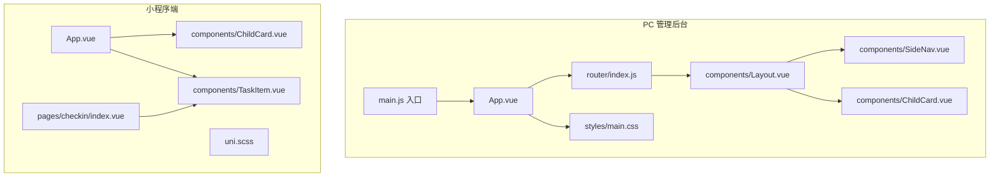
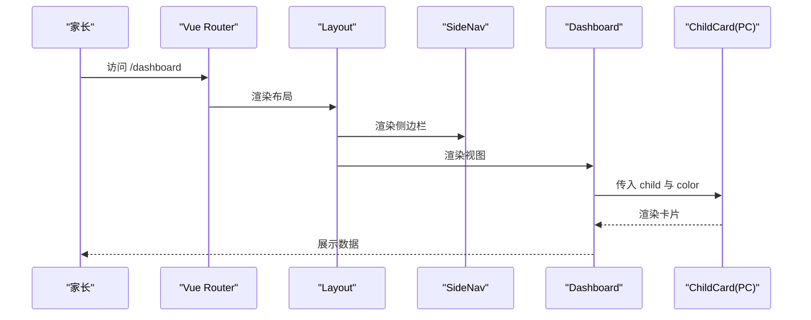
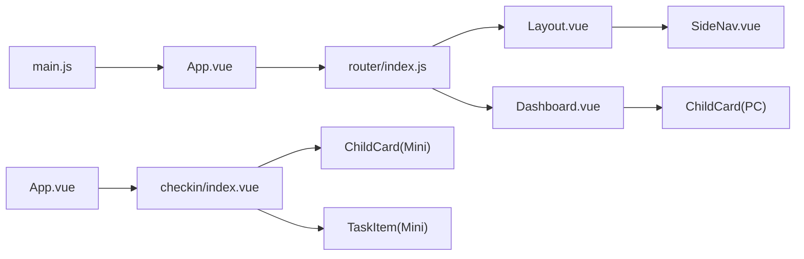

# 前端组件库

<cite>
**本文引用的文件**
- [Layout.vue](file://star-park/pc-admin/src/components/Layout.vue)
- [SideNav.vue](file://star-park/pc-admin/src/components/SideNav.vue)
- [ChildCard.vue（PC 管理后台）](file://star-park/pc-admin/src/components/ChildCard.vue)
- [ChildCard.vue（小程序端）](file://star-park/miniprogram/src/components/ChildCard.vue)
- [TaskItem.vue（小程序端）](file://star-park/miniprogram/src/components/TaskItem.vue)
- [main.css（PC 管理后台样式）](file://star-park/pc-admin/src/styles/main.css)
- [uni.scss（小程序端样式变量）](file://star-park/miniprogram/src/uni.scss)
- [App.vue（PC 管理后台）](file://star-park/pc-admin/src/App.vue)
- [App.vue（小程序端）](file://star-park/miniprogram/src/App.vue)
- [main.js（PC 管理后台入口）](file://star-park/pc-admin/src/main.js)
- [router/index.js（PC 管理后台路由）](file://star-park/pc-admin/src/router/index.js)
- [Dashboard.vue（PC 管理后台视图）](file://star-park/pc-admin/src/views/Dashboard.vue)
- [checkin/index.vue（小程序端打卡页）](file://star-park/miniprogram/src/pages/checkin/index.vue)
- [pc-admin.md（管理后台设计文档）](file://docs/design-docs/pc-admin.md)
- [miniprogram.md（小程序设计文档）](file://docs/design-docs/miniprogram.md)
</cite>

## 目录
1. [简介](#简介)
2. [项目结构](#项目结构)
3. [核心组件](#核心组件)
4. [架构总览](#架构总览)
5. [组件详解](#组件详解)
6. [依赖关系分析](#依赖关系分析)
7. [性能与体验优化](#性能与体验优化)
8. [故障排查指南](#故障排查指南)
9. [结论](#结论)
10. [附录](#附录)

## 简介
本文件为 StarParadise 前端组件库的组件级文档，聚焦于 PC 管理后台与小程序端的 UI 组件设计与使用规范。内容涵盖布局组件（Layout、SideNav）与业务组件（ChildCard、TaskItem）的视觉外观、行为模式、交互流程、属性与事件、插槽与自定义选项，并提供响应式设计、无障碍与跨浏览器兼容性建议、性能优化策略以及主题定制与样式覆盖方法。

## 项目结构
- PC 管理后台采用 Vue 3 + Element Plus 架构，组件位于 pc-admin/src/components，样式位于 pc-admin/src/styles，路由位于 pc-admin/src/router。
- 小程序端采用 Vue 3 + uni-app 架构，组件位于 miniprogram/src/components，样式变量位于 miniprogram/src/uni.scss，页面位于 miniprogram/src/pages。

图表来源
- [main.js（PC 管理后台入口）:1-22](file://star-park/pc-admin/src/main.js#L1-L22)
- [router/index.js（PC 管理后台路由）:1-67](file://star-park/pc-admin/src/router/index.js#L1-L67)
- [Layout.vue:1-29](file://star-park/pc-admin/src/components/Layout.vue#L1-L29)
- [SideNav.vue:1-132](file://star-park/pc-admin/src/components/SideNav.vue#L1-L132)
- [ChildCard.vue（PC 管理后台）:1-161](file://star-park/pc-admin/src/components/ChildCard.vue#L1-L161)
- [main.css（PC 管理后台样式）:1-164](file://star-park/pc-admin/src/styles/main.css#L1-L164)
- [App.vue（PC 管理后台）:1-10](file://star-park/pc-admin/src/App.vue#L1-L10)
- [App.vue（小程序端）:1-26](file://star-park/miniprogram/src/App.vue#L1-L26)
- [ChildCard.vue（小程序端）:1-162](file://star-park/miniprogram/src/components/ChildCard.vue#L1-L162)
- [TaskItem.vue（小程序端）:1-98](file://star-park/miniprogram/src/components/TaskItem.vue#L1-L98)
- [checkin/index.vue（小程序端打卡页）:1-661](file://star-park/miniprogram/src/pages/checkin/index.vue#L1-L661)
- [uni.scss（小程序端样式变量）:1-17](file://star-park/miniprogram/src/uni.scss#L1-L17)

章节来源
- [pc-admin.md（管理后台设计文档）:1-85](file://docs/design-docs/pc-admin.md#L1-L85)
- [miniprogram.md（小程序设计文档）:1-78](file://docs/design-docs/miniprogram.md#L1-L78)

## 核心组件
- 布局组件
  - Layout：容器布局，左侧固定侧边栏，右侧主内容区，使用 CSS 变量控制侧栏宽度与背景色。
  - SideNav：固定侧边导航，包含图标菜单项、当前激活态高亮、Logo 区域与版本信息。
- 业务组件
  - ChildCard（PC 管理后台）：展示孩子信息、打卡状态、周完成率、余额与积分等，支持点击跳转积分记录。
  - ChildCard（小程序端）：展示孩子头像、姓名、任务描述、打卡徽章、连续打卡与累计余额等，支持点击事件。
  - TaskItem（小程序端）：展示任务名称、描述、奖励金额与完成勾选框，支持切换事件。

章节来源
- [Layout.vue:1-29](file://star-park/pc-admin/src/components/Layout.vue#L1-L29)
- [SideNav.vue:1-132](file://star-park/pc-admin/src/components/SideNav.vue#L1-L132)
- [ChildCard.vue（PC 管理后台）:1-161](file://star-park/pc-admin/src/components/ChildCard.vue#L1-L161)
- [ChildCard.vue（小程序端）:1-162](file://star-park/miniprogram/src/components/ChildCard.vue#L1-L162)
- [TaskItem.vue（小程序端）:1-98](file://star-park/miniprogram/src/components/TaskItem.vue#L1-L98)

## 架构总览
PC 管理后台通过路由嵌套 Layout，SideNav 作为侧边栏组件渲染；业务页面（如 Dashboard）中复用 ChildCard 展示数据。小程序端页面直接使用 ChildCard 与 TaskItem，二者均通过 props 控制外观与行为，通过事件回调实现交互。

图表来源
- [router/index.js（PC 管理后台路由）:1-67](file://star-park/pc-admin/src/router/index.js#L1-L67)
- [Layout.vue:1-29](file://star-park/pc-admin/src/components/Layout.vue#L1-L29)
- [SideNav.vue:1-132](file://star-park/pc-admin/src/components/SideNav.vue#L1-L132)
- [Dashboard.vue（PC 管理后台视图）:1-146](file://star-park/pc-admin/src/views/Dashboard.vue#L1-L146)
- [ChildCard.vue（PC 管理后台）:1-161](file://star-park/pc-admin/src/components/ChildCard.vue#L1-L161)

## 组件详解

### 布局组件

#### Layout（PC 管理后台）
- 职责：提供全局布局容器，承载 SideNav 与主内容区，使用 CSS 变量控制侧栏宽度与背景色，主内容区滚动。
- 关键点：
  - 使用 CSS 变量 `--sidebar-width` 控制侧栏宽度。
  - 使用 CSS 变量 `--bg` 控制背景色。
  - 主内容区通过 `margin-left: var(--sidebar-width)` 占位。
- 适用场景：所有需要统一侧边导航的后台页面。

章节来源
- [Layout.vue:1-29](file://star-park/pc-admin/src/components/Layout.vue#L1-L29)
- [main.css（PC 管理后台样式）:1-164](file://star-park/pc-admin/src/styles/main.css#L1-L164)

#### SideNav（PC 管理后台）
- 职责：固定侧边导航菜单，支持图标、标题、激活态高亮与版本信息。
- 关键点：
  - 菜单项通过数组配置，支持隐藏字段过滤。
  - 激活态通过当前路由匹配判断。
  - 使用 Element Plus 图标组件渲染。
- 适用场景：管理后台的全局导航。

章节来源
- [SideNav.vue:1-132](file://star-park/pc-admin/src/components/SideNav.vue#L1-L132)
- [main.js（PC 管理后台入口）:1-22](file://star-park/pc-admin/src/main.js#L1-L22)

### 业务组件

#### ChildCard（PC 管理后台）
- 功能：展示孩子基本信息、今日打卡状态、周完成率（进度条）、累计余额与总积分，点击“总积分”可跳转到积分记录页。
- Props
  - child: 对象，包含 name、grade、todayCheckedIn、streak、weekRate、balance、points_balance 等字段。
  - color: 字符串，卡片顶部边框与头像颜色。
- 事件：无
- 插槽：无
- 自定义选项：通过 color 与 CSS 变量控制主题色；进度条颜色随 color 传递。
- 行为与交互：
  - 头像背景色与文字色由 color 动态计算。
  - “总积分”值点击后通过路由跳转至 /balance。
  - “今日打卡”根据 child.todayCheckedIn 切换文案与样式。
- 使用示例路径
  - 在 Dashboard 中循环渲染多个 ChildCard 并传入 child 与 color。

章节来源
- [ChildCard.vue（PC 管理后台）:1-161](file://star-park/pc-admin/src/components/ChildCard.vue#L1-L161)
- [Dashboard.vue（PC 管理后台视图）:1-146](file://star-park/pc-admin/src/views/Dashboard.vue#L1-L146)

#### ChildCard（小程序端）
- 功能：展示孩子头像、姓名、任务描述、打卡徽章（已完成/待打卡）、连续打卡天数与累计余额。
- Props
  - name: 字符串，孩子姓名。
  - avatarText: 字符串，头像占位文本。
  - color: 字符串，头像与徽章颜色。
  - taskDesc: 字符串，任务描述。
  - checkedIn: 布尔值，是否已完成打卡。
  - streak: 数字或字符串，连续打卡天数。
  - balance: 字符串，累计余额。
- 事件
  - tap: 点击卡片触发。
- 插槽：无
- 自定义选项：通过 color 控制主题色；通过 checkedIn 控制徽章样式。
- 行为与交互：
  - 点击卡片触发 tap 事件，便于上层页面处理跳转或操作。
  - 徽章根据 checkedIn 切换“已完成/待打卡”样式。
- 使用示例路径
  - 在打卡页 checkin/index.vue 中用于展示孩子列表与状态。

章节来源
- [ChildCard.vue（小程序端）:1-162](file://star-park/miniprogram/src/components/ChildCard.vue#L1-L162)
- [checkin/index.vue（小程序端打卡页）:1-661](file://star-park/miniprogram/src/pages/checkin/index.vue#L1-L661)

#### TaskItem（小程序端）
- 功能：展示单个任务的名称、描述与奖励金额，支持勾选完成状态。
- Props
  - name: 字符串，任务名称。
  - desc: 字符串，任务描述。
  - reward: 字符串，奖励金额。
  - done: 布尔值，是否已完成。
- 事件
  - toggle: 点击勾选框触发。
- 插槽：无
- 自定义选项：done 控制勾选框样式与文字删除线。
- 行为与交互：
  - 点击勾选框触发 toggle 事件，上层页面负责更新任务 done 状态。
  - 完成状态下，名称与奖励金额变浅色并带删除线。
- 使用示例路径
  - 在打卡页 checkin/index.vue 中循环渲染任务列表并绑定 toggle 事件。

章节来源
- [TaskItem.vue（小程序端）:1-98](file://star-park/miniprogram/src/components/TaskItem.vue#L1-L98)
- [checkin/index.vue（小程序端打卡页）:1-661](file://star-park/miniprogram/src/pages/checkin/index.vue#L1-L661)

### 组件组合与集成
- PC 管理后台
  - Layout 嵌套路由，SideNav 作为全局导航；Dashboard 中通过 v-for 渲染多个 ChildCard，实现卡片墙布局。
- 小程序端
  - 页面直接引入 ChildCard 与 TaskItem，通过 props 传入数据，通过事件回调更新状态；在打卡页中组合使用以完成“选择孩子 -> 勾选任务 -> 提交打卡”的闭环。

章节来源
- [router/index.js（PC 管理后台路由）:1-67](file://star-park/pc-admin/src/router/index.js#L1-L67)
- [Layout.vue:1-29](file://star-park/pc-admin/src/components/Layout.vue#L1-L29)
- [Dashboard.vue（PC 管理后台视图）:1-146](file://star-park/pc-admin/src/views/Dashboard.vue#L1-L146)
- [checkin/index.vue（小程序端打卡页）:1-661](file://star-park/miniprogram/src/pages/checkin/index.vue#L1-L661)

## 依赖关系分析

图表来源
- [main.js（PC 管理后台入口）:1-22](file://star-park/pc-admin/src/main.js#L1-L22)
- [router/index.js（PC 管理后台路由）:1-67](file://star-park/pc-admin/src/router/index.js#L1-L67)
- [Layout.vue:1-29](file://star-park/pc-admin/src/components/Layout.vue#L1-L29)
- [SideNav.vue:1-132](file://star-park/pc-admin/src/components/SideNav.vue#L1-L132)
- [Dashboard.vue（PC 管理后台视图）:1-146](file://star-park/pc-admin/src/views/Dashboard.vue#L1-L146)
- [ChildCard.vue（PC 管理后台）:1-161](file://star-park/pc-admin/src/components/ChildCard.vue#L1-L161)
- [App.vue（PC 管理后台）:1-10](file://star-park/pc-admin/src/App.vue#L1-L10)
- [App.vue（小程序端）:1-26](file://star-park/miniprogram/src/App.vue#L1-L26)
- [checkin/index.vue（小程序端打卡页）:1-661](file://star-park/miniprogram/src/pages/checkin/index.vue#L1-L661)
- [ChildCard.vue（小程序端）:1-162](file://star-park/miniprogram/src/components/ChildCard.vue#L1-L162)
- [TaskItem.vue（小程序端）:1-98](file://star-park/miniprogram/src/components/TaskItem.vue#L1-L98)

## 性能与体验优化
- 响应式设计
  - PC 端最小宽度约束与 CSS 变量统一主题，确保在不同分辨率下保持一致的视觉与交互体验。
  - 小程序端使用 rpx 单位适配多设备屏幕密度。
- 无障碍与可访问性
  - 为交互元素提供明确的焦点顺序与键盘可达性（建议在实际页面中补充 aria-* 属性与键盘事件）。
  - 使用语义化标签与对比度良好的颜色方案，确保低视力用户的可读性。
- 跨浏览器兼容性
  - PC 端使用现代 CSS 特性与 Element Plus 样式覆盖，建议在旧版浏览器中提供必要的 polyfill 与降级样式。
  - 小程序端遵循 uni-app 生态的兼容策略，避免使用平台不支持的特性。
- 性能优化
  - PC 端：合理拆分组件与懒加载路由，减少初始包体；利用 CSS 变量与共享样式降低重复计算。
  - 小程序端：避免在 v-for 中进行复杂计算，尽量将数据预处理在上层页面完成；使用事件节流/防抖处理高频交互。

## 故障排查指南
- PC 管理后台
  - 若侧边栏宽度异常，请检查 CSS 变量 `--sidebar-width` 的设置与 Layout 的 margin-left 计算。
  - 若 Element Plus 组件样式未生效，检查 main.js 中 Element Plus 的注册与主题覆盖样式顺序。
  - 若路由标题未更新，检查 router/index.js 中 beforeEach 的 meta.title 设置。
- 小程序端
  - 若 ChildCard/TaskItem 样式丢失，检查 uni.scss 变量与 scoped 样式作用域。
  - 若点击事件未触发，确认组件是否正确发出事件并绑定到上层页面处理函数。
  - 若页面空白或字体异常，检查 App.vue 中 page 样式与字体族设置。

章节来源
- [main.css（PC 管理后台样式）:1-164](file://star-park/pc-admin/src/styles/main.css#L1-L164)
- [main.js（PC 管理后台入口）:1-22](file://star-park/pc-admin/src/main.js#L1-L22)
- [router/index.js（PC 管理后台路由）:1-67](file://star-park/pc-admin/src/router/index.js#L1-L67)
- [App.vue（PC 管理后台）:1-10](file://star-park/pc-admin/src/App.vue#L1-L10)
- [App.vue（小程序端）:1-26](file://star-park/miniprogram/src/App.vue#L1-L26)
- [ChildCard.vue（小程序端）:1-162](file://star-park/miniprogram/src/components/ChildCard.vue#L1-L162)
- [TaskItem.vue（小程序端）:1-98](file://star-park/miniprogram/src/components/TaskItem.vue#L1-L98)

## 结论
本组件库围绕 PC 管理后台与小程序端的实际业务需求，提供了简洁、可扩展且风格统一的 UI 组件。通过 props 与事件驱动的交互模型，结合 CSS 变量与样式变量的主题系统，能够快速适配不同角色（家长/孩子）的使用场景。建议在后续迭代中进一步完善无障碍属性、统一错误提示与加载状态，并持续优化跨端兼容与性能表现。

## 附录

### 组件属性与事件速查表

- Layout（PC）
  - 属性：无
  - 事件：无
  - 插槽：无
  - 适用：全局布局容器

- SideNav（PC）
  - 属性：无
  - 事件：无
  - 插槽：无
  - 适用：全局导航菜单

- ChildCard（PC）
  - 属性：child（对象）、color（字符串）
  - 事件：无
  - 插槽：无
  - 适用：展示孩子信息与统计数据

- ChildCard（小程序）
  - 属性：name、avatarText、color、taskDesc、checkedIn、streak、balance
  - 事件：tap
  - 插槽：无
  - 适用：展示孩子列表与状态

- TaskItem（小程序）
  - 属性：name、desc、reward、done
  - 事件：toggle
  - 插槽：无
  - 适用：任务勾选与奖励展示

### 主题定制与样式覆盖策略
- PC 管理后台
  - 使用 CSS 变量覆盖主题色、背景、阴影与圆角等，集中维护于 styles/main.css。
  - Element Plus 组件样式通过类名覆盖实现统一风格。
- 小程序端
  - 使用 uni.scss 定义全局变量，组件内通过 scoped + 变量引用实现主题化。
  - 建议在页面级样式中对组件进行轻量覆盖，避免破坏组件内部结构。

章节来源
- [main.css（PC 管理后台样式）:1-164](file://star-park/pc-admin/src/styles/main.css#L1-L164)
- [uni.scss（小程序端样式变量）:1-17](file://star-park/miniprogram/src/uni.scss#L1-L17)