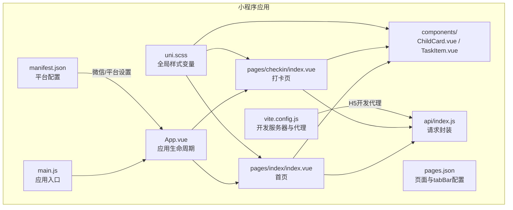
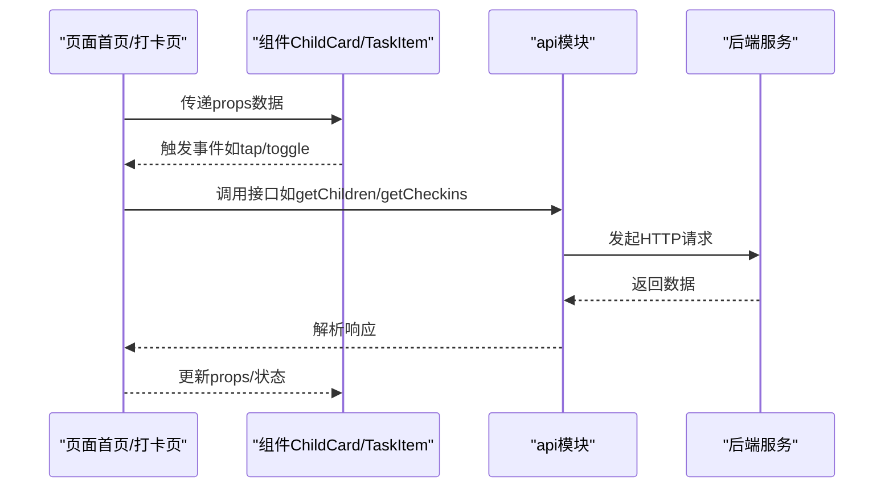
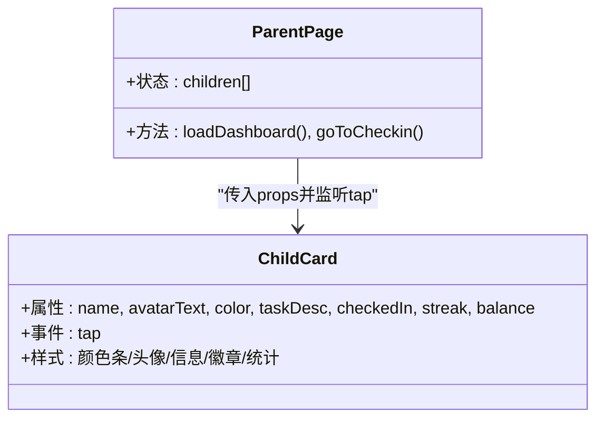
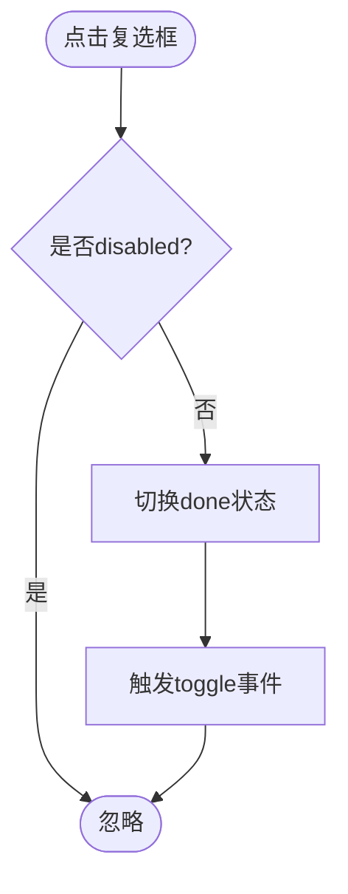
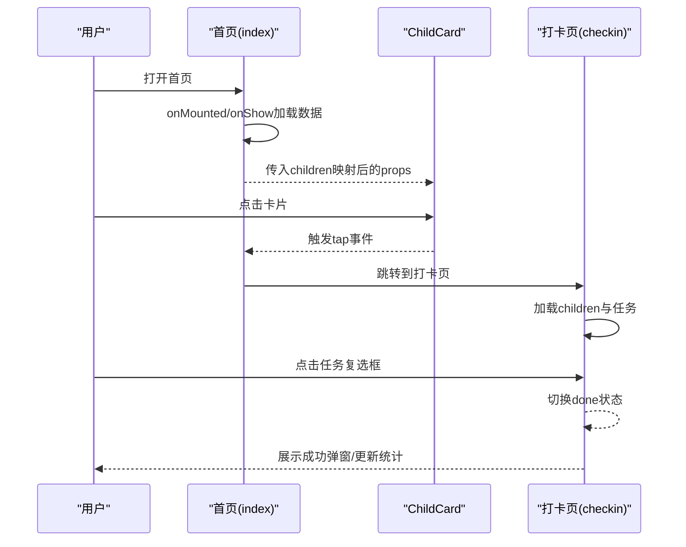
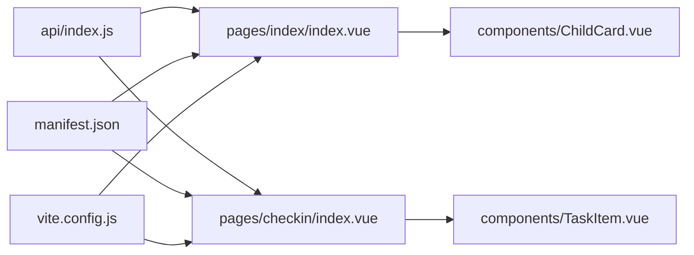

# 小程序端组件

<cite>
**本文引用的文件**
- [ChildCard.vue](file://star-park/miniprogram/src/components/ChildCard.vue)
- [TaskItem.vue](file://star-park/miniprogram/src/components/TaskItem.vue)
- [index.vue（首页）](file://star-park/miniprogram/src/pages/index/index.vue)
- [index.vue（打卡页）](file://star-park/miniprogram/src/pages/checkin/index.vue)
- [App.vue](file://star-park/miniprogram/src/App.vue)
- [main.js](file://star-park/miniprogram/src/main.js)
- [pages.json](file://star-park/miniprogram/src/pages.json)
- [uni.scss](file://star-park/miniprogram/src/uni.scss)
- [manifest.json](file://star-park/miniprogram/src/manifest.json)
- [vite.config.js](file://star-park/miniprogram/vite.config.js)
- [api/index.js](file://star-park/miniprogram/src/api/index.js)
</cite>

## 目录
1. [简介](#简介)
2. [项目结构](#项目结构)
3. [核心组件](#核心组件)
4. [架构总览](#架构总览)
5. [组件详解](#组件详解)
6. [依赖关系分析](#依赖关系分析)
7. [性能与内存优化](#性能与内存优化)
8. [兼容性与跨平台适配](#兼容性与跨平台适配)
9. [调试与最佳实践](#调试与最佳实践)
10. [结论](#结论)

## 简介
本文件面向StarParadise小程序端的组件化实现，聚焦于ChildCard与TaskItem两个核心组件在uni-app框架下的设计与实现要点，涵盖：
- 组件在小程序环境中的特殊实现与生命周期处理
- 事件绑定与数据绑定机制
- 样式限制、动画与交互优化
- 跨平台适配策略（微信小程序、H5）
- 性能优化与内存管理建议
- 调试技巧与最佳实践

## 项目结构
该小程序采用uni-app + Vue 3 Composition API + Vite构建，页面与组件均位于src目录下，页面路由由pages.json统一声明，全局样式变量集中于uni.scss，运行时通过manifest.json配置各平台参数。

**图表来源**
- [App.vue:1-26](file://star-park/miniprogram/src/App.vue#L1-L26)
- [main.js:1-8](file://star-park/miniprogram/src/main.js#L1-L8)
- [pages.json:1-54](file://star-park/miniprogram/src/pages.json#L1-L54)
- [uni.scss:1-17](file://star-park/miniprogram/src/uni.scss#L1-L17)
- [manifest.json:1-31](file://star-park/miniprogram/src/manifest.json#L1-L31)
- [vite.config.js:1-17](file://star-park/miniprogram/vite.config.js#L1-L17)
- [api/index.js:1-75](file://star-park/miniprogram/src/api/index.js#L1-L75)
- [ChildCard.vue:1-162](file://star-park/miniprogram/src/components/ChildCard.vue#L1-L162)
- [TaskItem.vue:1-133](file://star-park/miniprogram/src/components/TaskItem.vue#L1-L133)
- [index.vue（首页）:1-194](file://star-park/miniprogram/src/pages/index/index.vue#L1-L194)
- [index.vue（打卡页）:1-322](file://star-park/miniprogram/src/pages/checkin/index.vue#L1-L322)

**章节来源**
- [pages.json:1-54](file://star-park/miniprogram/src/pages.json#L1-L54)
- [uni.scss:1-17](file://star-park/miniprogram/src/uni.scss#L1-L17)
- [manifest.json:1-31](file://star-park/miniprogram/src/manifest.json#L1-L31)
- [vite.config.js:1-17](file://star-park/miniprogram/vite.config.js#L1-L17)

## 核心组件
- ChildCard：用于展示儿童卡片，包含头像占位、姓名、任务描述、打卡状态徽章、连续打卡与累计余额等信息，并支持点击事件向外抛出。
- TaskItem：用于展示单条任务项，包含复选框、名称、描述、奖励数值、禁用态与完成态视觉差异，并提供toggle事件供父组件处理。

两者均采用Vue 3的<script setup>语法，使用defineProps与defineEmits声明属性与事件，配合scoped样式实现组件内聚与样式隔离。

**章节来源**
- [ChildCard.vue:31-43](file://star-park/miniprogram/src/components/ChildCard.vue#L31-L43)
- [TaskItem.vue:21-36](file://star-park/miniprogram/src/components/TaskItem.vue#L21-L36)

## 架构总览
整体采用“页面-组件”两级结构：页面负责业务逻辑与数据流，组件负责UI与交互；通过uni-app提供的生命周期钩子（如onMounted、onShow）在合适时机加载数据；通过api模块统一封装请求，实现H5与小程序双端一致的调用体验。

**图表来源**
- [index.vue（首页）:44-133](file://star-park/miniprogram/src/pages/index/index.vue#L44-L133)
- [index.vue（打卡页）:109-267](file://star-park/miniprogram/src/pages/checkin/index.vue#L109-L267)
- [api/index.js:7-30](file://star-park/miniprogram/src/api/index.js#L7-L30)

## 组件详解

### ChildCard 组件
- 设计模式
  - 单一职责：渲染儿童信息与状态，不承担业务逻辑。
  - 受控组件：所有状态由父组件传入，通过事件向上反馈。
  - 视觉层次：颜色条、头像、信息区、徽章、统计数据区，布局清晰。
- 数据绑定
  - 属性：name、avatarText、color、taskDesc、checkedIn、streak、balance。
  - 事件：tap（点击卡片）。
- 样式与主题
  - 使用全局变量$primary、$primary-light、$text、$text-light、$border、$shadow-card、$radius-*等，保证风格一致。
  - 支持“完成态”类名切换以降低透明度。
- 生命周期与交互
  - 页面通过onMounted/onShow触发数据加载，ChildCard仅负责渲染与事件透传。
  - 点击事件用于跳转到打卡页或执行其他业务动作。

**图表来源**
- [ChildCard.vue:31-43](file://star-park/miniprogram/src/components/ChildCard.vue#L31-L43)
- [index.vue（首页）:10-23](file://star-park/miniprogram/src/pages/index/index.vue#L10-L23)

**章节来源**
- [ChildCard.vue:1-162](file://star-park/miniprogram/src/components/ChildCard.vue#L1-L162)
- [index.vue（首页）:10-23](file://star-park/miniprogram/src/pages/index/index.vue#L10-L23)

### TaskItem 组件
- 设计模式
  - 内部状态：done（本地切换），disabled（防重复操作）。
  - 事件驱动：toggle事件由父组件统一处理，避免直接修改父级状态。
- 数据绑定
  - 属性：name、desc、reward、done、disabled。
  - 事件：toggle。
- 样式与交互
  - 复选框勾选态、禁用态、完成态文本样式变化。
  - 奖励数值在完成态下变灰，增强可读性。
- 业务约束
  - 当disabled为true且done为true时显示“已完成”标签，防止重复提交。

**图表来源**
- [TaskItem.vue:32-35](file://star-park/miniprogram/src/components/TaskItem.vue#L32-L35)
- [index.vue（打卡页）:152-155](file://star-park/miniprogram/src/pages/checkin/index.vue#L152-L155)

**章节来源**
- [TaskItem.vue:1-133](file://star-park/miniprogram/src/components/TaskItem.vue#L1-L133)
- [index.vue（打卡页）:53-62](file://star-park/miniprogram/src/pages/checkin/index.vue#L53-L62)

### 页面与组件协作
- 首页（index）
  - 渲染多个ChildCard，每个卡片绑定tap事件以进入打卡页。
  - 计算问候语、日期字符串、汇总数据（最长连续、本周完成率、总余额）。
  - 在onMounted与onShow时拉取仪表盘数据。
- 打卡页（checkin）
  - 孩子选择器：通过child-selector切换当前活跃儿童。
  - 任务列表：根据活跃儿童的任务数组渲染TaskItem，支持toggle事件。
  - 提交打卡：校验可提交条件，批量创建checkin记录，展示成功弹窗与统计卡片。
  - 加载与标记：首次加载后查询当日已打卡任务并标记为checkedToday。

**图表来源**
- [index.vue（首页）:100-132](file://star-park/miniprogram/src/pages/index/index.vue#L100-L132)
- [index.vue（首页）:93-97](file://star-park/miniprogram/src/pages/index/index.vue#L93-L97)
- [index.vue（打卡页）:194-267](file://star-park/miniprogram/src/pages/checkin/index.vue#L194-L267)
- [index.vue（打卡页）:165-192](file://star-park/miniprogram/src/pages/checkin/index.vue#L165-L192)

**章节来源**
- [index.vue（首页）:1-194](file://star-park/miniprogram/src/pages/index/index.vue#L1-L194)
- [index.vue（打卡页）:1-322](file://star-park/miniprogram/src/pages/checkin/index.vue#L1-L322)

## 依赖关系分析
- 组件依赖
  - ChildCard/TaskItem均为纯展示组件，无内部状态，依赖父组件传入数据与事件回调。
- 页面依赖
  - 首页依赖api模块获取仪表盘数据，依赖ChildCard渲染列表。
  - 打卡页依赖api模块获取children与checkins，依赖TaskItem渲染任务列表。
- 平台依赖
  - 请求封装根据运行环境自动选择URL前缀（H5使用代理路径，小程序使用本地服务地址）。
  - manifest.json启用微信小程序原生组件与编译优化设置。

**图表来源**
- [api/index.js:1-75](file://star-park/miniprogram/src/api/index.js#L1-L75)
- [index.vue（首页）:47-47](file://star-park/miniprogram/src/pages/index/index.vue#L47-L47)
- [index.vue（打卡页）:114-114](file://star-park/miniprogram/src/pages/checkin/index.vue#L114-L114)
- [ChildCard.vue:1-162](file://star-park/miniprogram/src/components/ChildCard.vue#L1-L162)
- [TaskItem.vue:1-133](file://star-park/miniprogram/src/components/TaskItem.vue#L1-L133)
- [manifest.json:1-31](file://star-park/miniprogram/src/manifest.json#L1-L31)
- [vite.config.js:1-17](file://star-park/miniprogram/vite.config.js#L1-L17)

**章节来源**
- [api/index.js:1-75](file://star-park/miniprogram/src/api/index.js#L1-L75)
- [manifest.json:1-31](file://star-park/miniprogram/src/manifest.json#L1-L31)
- [vite.config.js:1-17](file://star-park/miniprogram/vite.config.js#L1-L17)

## 性能与内存优化
- 列表渲染优化
  - 使用v-for渲染列表时确保提供稳定key，避免不必要的重排与重绘。
  - 对高频更新的数据进行浅层比较，减少响应式开销。
- 事件处理
  - 将复杂计算移至computed，避免在模板中进行重复计算。
  - 在父组件统一处理toggle等事件，避免子组件持有过多状态。
- 动画与视觉
  - 使用CSS过渡与简单动画（如成功弹窗）提升交互体验，但避免过度使用导致掉帧。
- 内存管理
  - 页面切换时利用onHide/onShow控制资源加载与释放，避免后台持续占用。
  - 避免在组件内创建大量闭包与长生命周期定时器。
- 网络请求
  - 合理缓存与去抖（如多次快速点击提交时，前端应阻止重复提交）。
  - 错误提示统一通过toast或全局提示组件，避免异常堆栈泄露。

[本节为通用指导，无需特定文件引用]

## 兼容性与跨平台适配
- 平台差异点
  - 微信小程序：使用原生组件与平台API，manifest.json开启usingComponents与编译优化。
  - H5：通过vite dev server与proxy将/api转发到后端服务，api模块自动识别运行环境。
- 样式与单位
  - 使用rpx作为移动端适配单位，保证在不同设备像素比下的显示一致性。
  - 全局样式变量集中管理，确保主题与间距的一致性。
- 生命周期与导航
  - 使用uni-app生命周期钩子（如onShow）在页面可见时刷新数据。
  - 页面间跳转使用uni.switchTab/redirectTo等API，保持跨平台一致性。
- 动画与交互
  - 小程序端对部分CSS动画支持有限，建议使用平台支持良好的过渡与基础动画。
  - 交互反馈（toast、loading）统一通过uni.xxx API，避免平台差异带来的问题。

**章节来源**
- [manifest.json:8-18](file://star-park/miniprogram/src/manifest.json#L8-L18)
- [vite.config.js:6-15](file://star-park/miniprogram/vite.config.js#L6-L15)
- [api/index.js:1-30](file://star-park/miniprogram/src/api/index.js#L1-L30)
- [pages.json:1-54](file://star-park/miniprogram/src/pages.json#L1-L54)

## 调试与最佳实践
- 调试技巧
  - 使用console输出关键流程日志（如onLaunch/onShow/onHide）。
  - 在api模块中捕获fail并统一toast提示，便于定位网络问题。
  - 使用uni.showToast/uni.showLoading等平台API进行用户反馈。
- 最佳实践
  - 组件尽量无副作用，通过props与事件与父组件通信。
  - 将计算逻辑放入computed或局部变量，减少模板表达式复杂度。
  - 对外暴露明确的事件命名（如toggle、tap），保持接口稳定。
  - 在父组件中集中处理业务状态变更，子组件只负责渲染与事件透传。
- 开发工具
  - H5开发通过vite dev server启动，结合proxy访问后端API。
  - 小程序端使用开发者工具进行断点调试与真机预览。

**章节来源**
- [App.vue:4-14](file://star-park/miniprogram/src/App.vue#L4-L14)
- [api/index.js:24-28](file://star-park/miniprogram/src/api/index.js#L24-L28)
- [vite.config.js:6-15](file://star-park/miniprogram/vite.config.js#L6-L15)

## 结论
ChildCard与TaskItem在本项目中体现了清晰的组件边界与事件驱动设计：ChildCard专注展示与点击反馈，TaskItem专注任务切换与状态呈现。页面通过生命周期钩子与api模块完成数据加载与交互处理，形成“页面-组件-服务”的清晰分层。结合全局样式变量与manifest配置，系统在微信小程序与H5两端具备良好的一致性与可维护性。后续可在列表渲染、事件节流与动画优化方面进一步细化，以提升性能与用户体验。