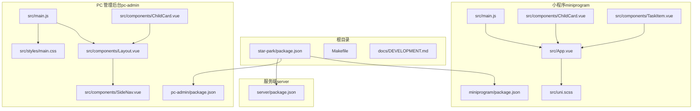
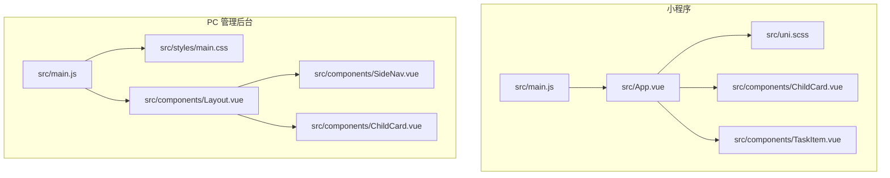
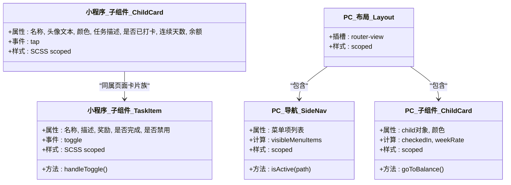
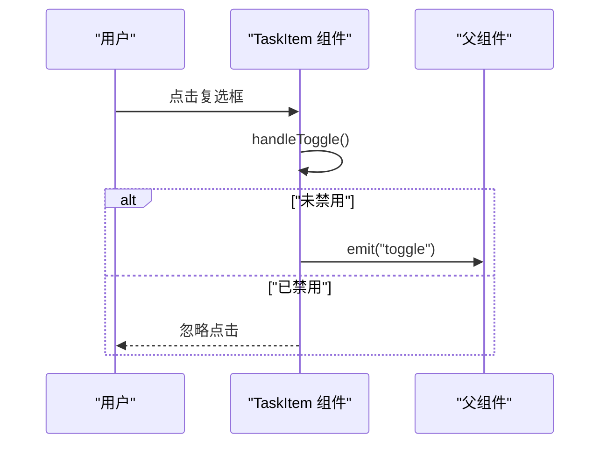
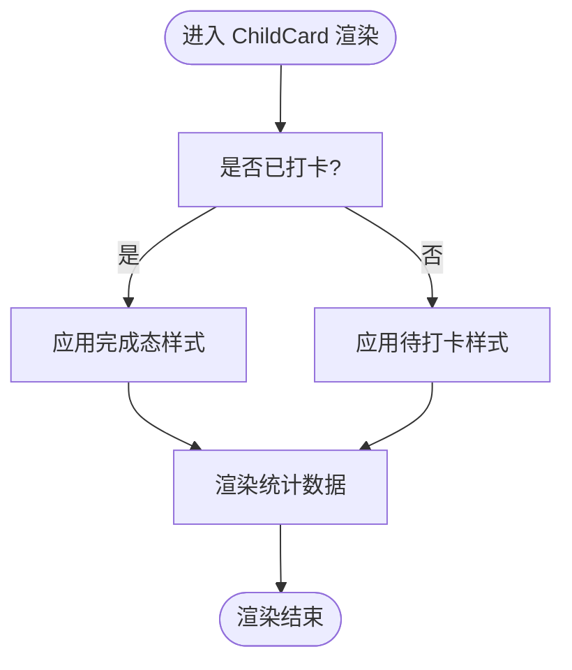
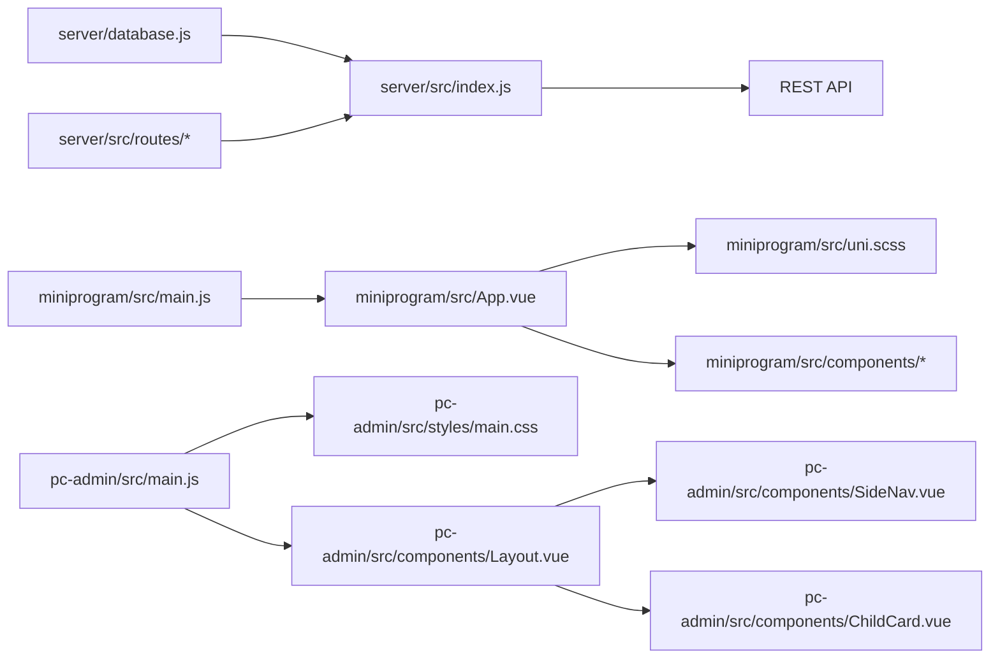

# 组件设计规范

<cite>
**本文引用的文件**
- [ChildCard.vue（小程序）](file://star-park/miniprogram/src/components/ChildCard.vue)
- [TaskItem.vue（小程序）](file://star-park/miniprogram/src/components/TaskItem.vue)
- [ChildCard.vue（PC 管理后台）](file://star-park/pc-admin/src/components/ChildCard.vue)
- [Layout.vue（PC 管理后台）](file://star-park/pc-admin/src/components/Layout.vue)
- [SideNav.vue（PC 管理后台）](file://star-park/pc-admin/src/components/SideNav.vue)
- [main.js（小程序）](file://star-park/miniprogram/src/main.js)
- [App.vue（小程序）](file://star-park/miniprogram/src/App.vue)
- [uni.scss（小程序）](file://star-park/miniprogram/src/uni.scss)
- [main.js（PC 管理后台）](file://star-park/pc-admin/src/main.js)
- [main.css（PC 管理后台）](file://star-park/pc-admin/src/styles/main.css)
- [package.json（根目录）](file://star-park/package.json)
- [package.json（小程序）](file://star-park/miniprogram/package.json)
- [package.json（PC 管理后台）](file://star-park/pc-admin/package.json)
- [package.json（服务端）](file://star-park/server/package.json)
- [DEVELOPMENT.md](file://docs/DEVELOPMENT.md)
- [Makefile](file://Makefile)
</cite>

## 目录
1. 引言
2. 项目结构
3. 核心组件
4. 架构总览
5. 详细组件分析
6. 依赖关系分析
7. 性能考虑
8. 故障排查指南
9. 结论
10. 附录

## 引言
本规范面向 StarParadise 的组件化开发，旨在建立统一的组件设计标准与最佳实践，覆盖命名约定、文件组织、代码风格、注释规范、可复用性设计、接口设计、错误边界、性能优化、测试与文档、版本管理、演进与废弃流程、向后兼容保障、与设计系统集成及主题定制、国际化策略等。本文以现有组件与工程配置为依据，结合仓库中的实际实现进行提炼与扩展。

## 项目结构
StarParadise 采用多端一体化工程结构：根目录通过统一的 package.json 管理跨端脚本；前端分为 PC 管理后台与小程序两套应用，分别拥有独立的入口、组件、路由与状态管理；服务端提供 REST API；公共样式与变量在各端分别定义并注入。

图表来源
- [package.json（根目录）:1-13](file://star-park/package.json#L1-L13)
- [main.js（小程序）:1-8](file://star-park/miniprogram/src/main.js#L1-L8)
- [App.vue（小程序）:1-26](file://star-park/miniprogram/src/App.vue#L1-L26)
- [uni.scss（小程序）:1-17](file://star-park/miniprogram/src/uni.scss#L1-L17)
- [main.js（PC 管理后台）:1-22](file://star-park/pc-admin/src/main.js#L1-L22)
- [main.css（PC 管理后台）:1-164](file://star-park/pc-admin/src/styles/main.css#L1-L164)
- [Layout.vue（PC 管理后台）:1-29](file://star-park/pc-admin/src/components/Layout.vue#L1-L29)
- [SideNav.vue（PC 管理后台）:1-132](file://star-park/pc-admin/src/components/SideNav.vue#L1-L132)
- [ChildCard.vue（小程序）:1-162](file://star-park/miniprogram/src/components/ChildCard.vue#L1-L162)
- [ChildCard.vue（PC 管理后台）:1-161](file://star-park/pc-admin/src/components/ChildCard.vue#L1-L161)
- [TaskItem.vue（小程序）:1-133](file://star-park/miniprogram/src/components/TaskItem.vue#L1-L133)
- [package.json（小程序）:1-28](file://star-park/miniprogram/package.json#L1-L28)
- [package.json（PC 管理后台）:1-26](file://star-park/pc-admin/package.json#L1-L26)
- [package.json（服务端）:1-15](file://star-park/server/package.json#L1-L15)

章节来源
- [DEVELOPMENT.md: 项目结构与命令:72-99](file://docs/DEVELOPMENT.md#L72-L99)
- [Makefile: 构建与验证任务:1-70](file://Makefile#L1-L70)

## 核心组件
本节聚焦于已实现的核心组件：ChildCard 与 TaskItem（小程序），以及 PC 端的 Layout、SideNav 与 ChildCard。这些组件体现了跨端一致的设计理念与差异化实现策略。

- 设计要点
  - 数据驱动：组件通过 props 接收数据，避免硬编码，便于复用与主题化。
  - 事件通信：使用 emits 与父组件解耦交互，如点击、切换等。
  - 主题变量：通过全局样式变量或 CSS 变量实现颜色、尺寸、阴影等主题化。
  - 状态计算：PC 端使用组合式 API 计算派生状态，减少模板复杂度。
  - 导航与布局：侧边导航与主布局分离，职责清晰，利于扩展。

章节来源
- [ChildCard.vue（小程序）:1-162](file://star-park/miniprogram/src/components/ChildCard.vue#L1-L162)
- [TaskItem.vue（小程序）:1-133](file://star-park/miniprogram/src/components/TaskItem.vue#L1-L133)
- [ChildCard.vue（PC 管理后台）:1-161](file://star-park/pc-admin/src/components/ChildCard.vue#L1-L161)
- [Layout.vue（PC 管理后台）:1-29](file://star-park/pc-admin/src/components/Layout.vue#L1-L29)
- [SideNav.vue（PC 管理后台）:1-132](file://star-park/pc-admin/src/components/SideNav.vue#L1-L132)

## 架构总览
下图展示组件在应用中的位置与依赖关系：小程序与 PC 端各自拥有独立入口与样式体系；二者均通过 props 与 emits 与上层页面/容器交互；PC 端引入 Element Plus 并通过 CSS 变量与主题覆盖实现统一风格。

图表来源
- [main.js（小程序）:1-8](file://star-park/miniprogram/src/main.js#L1-L8)
- [App.vue（小程序）:1-26](file://star-park/miniprogram/src/App.vue#L1-L26)
- [uni.scss（小程序）:1-17](file://star-park/miniprogram/src/uni.scss#L1-L17)
- [main.js（PC 管理后台）:1-22](file://star-park/pc-admin/src/main.js#L1-L22)
- [main.css（PC 管理后台）:1-164](file://star-park/pc-admin/src/styles/main.css#L1-L164)
- [Layout.vue（PC 管理后台）:1-29](file://star-park/pc-admin/src/components/Layout.vue#L1-L29)
- [SideNav.vue（PC 管理后台）:1-132](file://star-park/pc-admin/src/components/SideNav.vue#L1-L132)
- [ChildCard.vue（小程序）:1-162](file://star-park/miniprogram/src/components/ChildCard.vue#L1-L162)
- [ChildCard.vue（PC 管理后台）:1-161](file://star-park/pc-admin/src/components/ChildCard.vue#L1-L161)
- [TaskItem.vue（小程序）:1-133](file://star-park/miniprogram/src/components/TaskItem.vue#L1-L133)

## 详细组件分析

### 组件类图（基于现有实现）

图表来源
- [ChildCard.vue（小程序）:1-162](file://star-park/miniprogram/src/components/ChildCard.vue#L1-L162)
- [TaskItem.vue（小程序）:1-133](file://star-park/miniprogram/src/components/TaskItem.vue#L1-L133)
- [Layout.vue（PC 管理后台）:1-29](file://star-park/pc-admin/src/components/Layout.vue#L1-L29)
- [SideNav.vue（PC 管理后台）:1-132](file://star-park/pc-admin/src/components/SideNav.vue#L1-L132)
- [ChildCard.vue（PC 管理后台）:1-161](file://star-park/pc-admin/src/components/ChildCard.vue#L1-L161)

章节来源
- [ChildCard.vue（小程序）:31-43](file://star-park/miniprogram/src/components/ChildCard.vue#L31-L43)
- [TaskItem.vue（小程序）:21-36](file://star-park/miniprogram/src/components/TaskItem.vue#L21-L36)
- [ChildCard.vue（PC 管理后台）:49-81](file://star-park/pc-admin/src/components/ChildCard.vue#L49-L81)
- [Layout.vue（PC 管理后台）:1-29](file://star-park/pc-admin/src/components/Layout.vue#L1-L29)
- [SideNav.vue（PC 管理后台）:25-48](file://star-park/pc-admin/src/components/SideNav.vue#L25-L48)

### 交互序列图（以 TaskItem 切换为例）

图表来源
- [TaskItem.vue（小程序）:32-36](file://star-park/miniprogram/src/components/TaskItem.vue#L32-L36)

章节来源
- [TaskItem.vue（小程序）:21-36](file://star-park/miniprogram/src/components/TaskItem.vue#L21-L36)

### 流程图（ChildCard 状态渲染）

图表来源
- [ChildCard.vue（小程序）:1-29](file://star-park/miniprogram/src/components/ChildCard.vue#L1-L29)
- [ChildCard.vue（PC 管理后台）:1-47](file://star-park/pc-admin/src/components/ChildCard.vue#L1-L47)

章节来源
- [ChildCard.vue（小程序）:1-29](file://star-park/miniprogram/src/components/ChildCard.vue#L1-L29)
- [ChildCard.vue（PC 管理后台）:1-47](file://star-park/pc-admin/src/components/ChildCard.vue#L1-L47)

## 依赖关系分析
- 依赖分层
  - 层 0：服务端（数据库初始化与种子数据）
  - 层 1：服务端（路由）
  - 层 2：服务端（入口）
  - 层 3：前端（API 客户端、组件、状态）
  - 层 4：前端（页面视图）
  - 层 5：前端（应用入口）
- 依赖注入
  - 小程序：通过 uni-app 提供的运行时能力与全局样式变量
  - PC 管理后台：通过 Element Plus、Vue Router、Pinia 注入生态能力，并通过 CSS 变量与主题覆盖统一风格
- 外部依赖
  - 小程序：Vue 3、Pinia、uni-app 生态
  - PC 管理后台：Vue 3、Vue Router、Pinia、Element Plus、ECharts、Axios、Day.js
  - 服务端：Express、better-sqlite3、CORS、Day.js

图表来源
- [package.json（服务端）:1-15](file://star-park/server/package.json#L1-L15)
- [package.json（小程序）:1-28](file://star-park/miniprogram/package.json#L1-L28)
- [package.json（PC 管理后台）:1-26](file://star-park/pc-admin/package.json#L1-L26)
- [main.js（小程序）:1-8](file://star-park/miniprogram/src/main.js#L1-L8)
- [App.vue（小程序）:1-26](file://star-park/miniprogram/src/App.vue#L1-L26)
- [uni.scss（小程序）:1-17](file://star-park/miniprogram/src/uni.scss#L1-L17)
- [main.js（PC 管理后台）:1-22](file://star-park/pc-admin/src/main.js#L1-L22)
- [main.css（PC 管理后台）:1-164](file://star-park/pc-admin/src/styles/main.css#L1-L164)
- [Layout.vue（PC 管理后台）:1-29](file://star-park/pc-admin/src/components/Layout.vue#L1-L29)
- [SideNav.vue（PC 管理后台）:1-132](file://star-park/pc-admin/src/components/SideNav.vue#L1-L132)
- [ChildCard.vue（PC 管理后台）:1-161](file://star-park/pc-admin/src/components/ChildCard.vue#L1-L161)

章节来源
- [DEVELOPMENT.md: 项目结构与命令:72-99](file://docs/DEVELOPMENT.md#L72-L99)
- [Makefile: 构建与验证任务:1-70](file://Makefile#L1-L70)

## 性能考虑
- 渲染优化
  - 使用 scoped 样式与细粒度类名，避免全局污染与重排风暴
  - 在 PC 端使用 CSS 变量与主题覆盖，减少重复样式计算
- 交互反馈
  - 为按钮与选择器添加过渡动画，提升感知速度
- 状态与计算
  - PC 端使用计算属性缓存派生状态，降低模板开销
- 资源加载
  - 通过 Element Plus 按需注册图标，减少首屏体积
- 打包与构建
  - 使用 Vite 与按需构建策略，缩短构建时间与产物体积

## 故障排查指南
- 环境与依赖
  - 确认 Node.js 与 npm 版本满足前置要求
  - 使用统一脚本安装依赖与启动服务
- 构建与验证
  - 使用 Makefile 中的任务执行架构检查、质量检查、端到端验证
- 常见问题定位
  - 样式不生效：检查 scoped 作用域与 CSS 变量覆盖顺序
  - 交互无效：确认事件发射与父组件监听是否正确
  - 主题不一致：核对小程序 SCSS 变量与 PC CSS 变量映射

章节来源
- [DEVELOPMENT.md: 前置条件与命令:3-27](file://docs/DEVELOPMENT.md#L3-L27)
- [Makefile: 构建与验证任务:1-70](file://Makefile#L1-L70)

## 结论
本规范以现有组件与工程配置为基础，总结了跨端组件的通用设计原则与实现要点，并给出了可操作的约束与建议。后续可在现有基础上补充测试与文档模板、版本管理策略与演进路线图，以进一步完善组件生命周期管理与团队协作效率。

## 附录

### 命名约定
- 文件命名
  - 组件文件使用帕斯卡命名（如 ChildCard.vue、TaskItem.vue）
  - 页面文件使用帕斯卡命名（如 Dashboard.vue、Tasks.vue）
- 样式命名
  - 使用 BEM 或模块化命名空间（如组件名__块）
- 变量命名
  - SCSS 变量前缀区分层级（如 $radius-*、$text-*）
  - CSS 变量前缀区分主题（如 --primary、--bg）

### 文件组织结构
- 组件目录
  - 小程序：src/components 下按功能拆分
  - PC 管理后台：src/components 下按功能拆分
- 页面与视图
  - 小程序：src/pages 下按页面拆分
  - PC 管理后台：src/views 下按页面拆分
- 样式与变量
  - 小程序：src/uni.scss 统一变量
  - PC 管理后台：src/styles/main.css 统一变量与覆盖

### 代码风格规范
- Vue 单文件组件
  - script-setup 优先，明确 defineProps 与 defineEmits
  - 计算属性优先于模板内表达式
- 样式
  - 优先使用 scoped 样式，避免全局污染
  - 变量集中管理，主题化优先

### 注释标准
- 组件注释
  - props 与 emits 的用途、类型与默认值
  - 关键逻辑的简要说明
- 样式注释
  - 关键变量与主题色的语义说明

### 可复用性设计原则
- 单一职责：每个组件聚焦一个业务领域
- 明确接口：通过 props 与 emits 暴露行为与数据
- 主题解耦：通过变量与 CSS 变量实现主题化
- 状态外置：将复杂状态交由父组件或 Pinia 管理

### 接口设计规范
- Props 设计
  - 明确必填项与可选项，提供合理默认值
  - 类型约束与校验
- Emits 设计
  - 事件命名语义化，避免内部实现细节泄露
  - 传递最小必要数据

### 错误边界处理
- 输入校验：对非法输入进行兜底显示
- 网络异常：在父组件或 API 客户端统一处理
- 降级策略：在不可用状态下提供占位与提示

### 性能优化策略
- 渲染层面：减少不必要的重渲染，使用计算属性与浅比较
- 样式层面：避免深层嵌套与重复选择器
- 交互层面：为高频交互添加节流/防抖

### 组件测试规范
- 单元测试
  - 验证 props 输入与输出事件
  - 验证样式类名与内容渲染
- 端到端测试
  - 使用现有 Makefile 任务进行端到端验证

### 文档编写标准
- 组件文档
  - 功能说明、接口清单、使用示例、注意事项
- 架构文档
  - 项目结构、依赖关系、主题与国际化策略

### 版本管理策略
- 语义化版本：主版本号.次版本号.修订号
- 变更日志：记录破坏性变更、新增与修复
- 分支策略：feature/dev/release/master

### 组件演进路线图
- 短期：完善测试与文档，统一主题变量
- 中期：抽象通用布局与表单组件，沉淀设计系统
- 长期：跨端共享组件库，支持动态主题与国际化

### 废弃组件处理流程
- 评估与公告：发布弃用通知与迁移指引
- 迁移支持：提供替代方案与迁移脚本
- 清理阶段：在指定版本移除并清理依赖

### 向后兼容性保证措施
- 接口兼容：新增字段保持可选，避免破坏既有调用
- 样式兼容：保留旧类名一段时间，逐步替换
- 行为兼容：提供过渡期的兼容层

### 与设计系统集成方式
- 变量对齐：统一主色、辅色、字号、间距、圆角与阴影
- 组件对齐：复用 Element Plus 组件，通过 CSS 变量覆盖
- 主题定制：通过 CSS 变量与 SCSS 变量实现主题切换

### 主题定制机制
- 小程序：SCSS 变量集中管理，按主题生成不同变量集
- PC 管理后台：CSS 变量集中管理，通过覆盖实现主题切换

### 国际化支持策略
- 文案提取：将文案集中管理，支持多语言键值
- 日期与数字：使用 Day.js 与本地化格式
- 路由与菜单：菜单标题与路由文案可配置