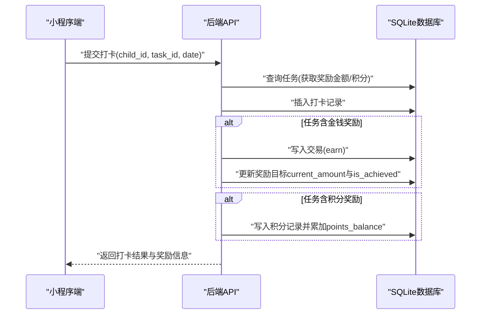
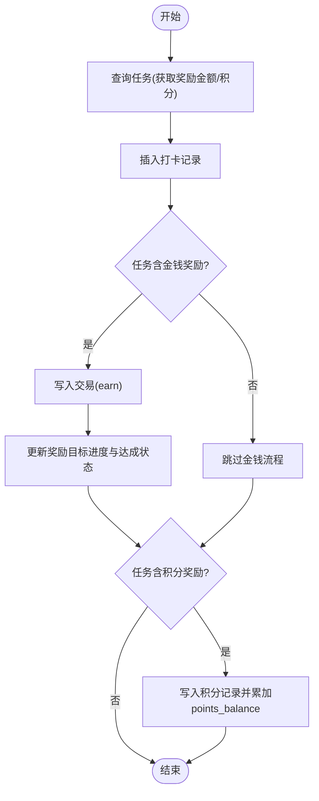

# 功能模块说明

<cite>
**本文引用的文件**
- [ARCHITECTURE.md](file://docs/ARCHITECTURE.md)
- [api.md](file://docs/api.md)
- [database.js](file://star-park/server/src/database.js)
- [children.js](file://star-park/server/src/routes/children.js)
- [tasks.js](file://star-park/server/src/routes/tasks.js)
- [checkins.js](file://star-park/server/src/routes/checkins.js)
- [rewards.js](file://star-park/server/src/routes/rewards.js)
- [points.js](file://star-park/server/src/routes/points.js)
- [stats.js](file://star-park/server/src/routes/stats.js)
- [goals.js](file://star-park/server/src/routes/goals.js)
- [todos.js](file://star-park/server/src/routes/todos.js)
- [TodoTree.vue](file://star-park/pc-admin/src/components/TodoTree.vue)
- [checkin/index.vue](file://star-park/miniprogram/src/pages/checkin/index.vue)
- [Dashboard.vue](file://star-park/pc-admin/src/views/Dashboard.vue)
</cite>

## 产品概述
星星乐园是面向多孩家庭的激励管理系统，核心机制为"任务打卡 + 双货币激励（金钱+积分）"，所有功能围绕孩子维度独立管理。系统通过小程序端完成日常打卡与即时反馈，通过管理后台进行目标、任务、奖励与统计分析的集中管理；后端以 REST API 提供统一能力，数据层使用 SQLite 实现轻量持久化。

- 目标用户：家长（管理与统计）、孩子（打卡与激励）。
- 核心价值：用可量化的行为激励培养习惯，帮助家长可视化追踪进度并合理分配奖励。
- 适用场景：每日学习任务打卡、习惯养成、阶段性目标达成与兑换、家庭内多孩并行管理。

**章节来源**
- [ARCHITECTURE.md:6-15](file://docs/ARCHITECTURE.md#L6-L15)
- [api.md:6-14](file://docs/api.md#L6-L14)

## 核心业务流程
- 家长在管理后台创建孩子、任务、奖励目标与待办目标；设置任务的金钱与积分奖励。
- 孩子在小程序端选择孩子后，勾选当日已完成的任务并提交打卡；支持一键全部打卡。
- 打卡成功后，系统自动：
  - 记录打卡明细；
  - 若任务含金钱奖励，写入交易记录并累计到余额；
  - 同步更新未达成奖励目标的当前金额与达成状态；
  - 若任务含积分奖励，写入积分记录并累加孩子积分余额。
- 家长可在管理后台查看仪表盘、连续打卡天数、周完成率、余额与积分、以及奖励目标达成情况，并进行兑换操作。

**图表来源**
- [checkins.js:40-95](file://star-park/server/src/routes/checkins.js#L40-L95)
- [rewards.js:115-179](file://star-park/server/src/routes/rewards.js#L115-L179)
- [points.js:30-72](file://star-park/server/src/routes/points.js#L30-L72)

**章节来源**
- [checkins.js:40-202](file://star-park/server/src/routes/checkins.js#L40-L202)
- [rewards.js:115-179](file://star-park/server/src/routes/rewards.js#L115-L179)
- [points.js:30-72](file://star-park/server/src/routes/points.js#L30-L72)
- [checkin/index.vue:174-223](file://star-park/miniprogram/src/pages/checkin/index.vue#L174-L223)

## 功能模块清单

### 孩子管理
- 职责：维护孩子基本信息（姓名、年龄、年级、专注方向、头像色），聚合展示其任务列表与余额、积分余额。
- 关键属性：name、age、grade、focus、avatar_color、balance、points_balance。
- 业务价值：作为所有业务数据的归属维度，确保每个孩子的任务、打卡、奖励、积分相互隔离。
- 验收要点：
  - 新增孩子必填 name；
  - 获取孩子列表时附带任务与余额、积分余额；
  - 按 planned_date 排序任务（有计划日期在前升序，无计划日期在后按 id）。

**章节来源**
- [children.js:35-70](file://star-park/server/src/routes/children.js#L35-L70)
- [tasks.js:5-19](file://star-park/server/src/routes/tasks.js#L5-L19)
- [api.md:33-98](file://docs/api.md#L33-L98)

### 任务管理
- 职责：定义孩子需要完成的行为项，配置金钱与积分奖励、计划日期与是否启用。
- 关键属性：child_id、title、description、reward_amount、reward_unit、planned_date、points_reward、is_active。
- 业务价值：将抽象目标拆解为可执行、可计奖的日常行为，支撑打卡与激励闭环。
- 验收要点：
  - 创建任务必填 child_id、title；
  - 支持部分更新字段，planned_date 与 points_reward 支持显式置空或置零；
  - 删除任务需级联清理关联打卡记录。

**章节来源**
- [tasks.js:21-92](file://star-park/server/src/routes/tasks.js#L21-L92)
- [api.md:100-126](file://docs/api.md#L100-L126)

### 打卡系统
- 职责：记录孩子对某任务在某日期的完成情况，触发奖励与目标进度更新。
- 关键属性：child_id、task_id、checkin_date、completed、reward_earned。
- 业务价值：将行为转化为可度量的激励事件，驱动金钱与积分发放及目标达成。
- 验收要点：
  - 必填 child_id、task_id、checkin_date；
  - 完成打卡时写入交易与积分（如有），并更新奖励目标进度；
  - 支持批量自动打卡，避免重复打卡。

**章节来源**
- [checkins.js:40-202](file://star-park/server/src/routes/checkins.js#L40-L202)
- [api.md:232-257](file://docs/api.md#L232-L257)
- [checkin/index.vue:174-223](file://star-park/miniprogram/src/pages/checkin/index.vue#L174-L223)

### 奖励目标
- 职责：设定孩子期望达成的奖励（如玩具、活动），支持金钱或积分两种单位，跟踪当前进度与达成状态，并提供兑换入口。
- 关键属性：child_id、title、target_amount、current_amount、is_achieved、redeemed_at、reward_unit。
- 业务价值：将长期动机具象化，让孩子看到"攒够就能换"的清晰路径，提升坚持动力。
- 验收要点：
  - 创建目标必填 child_id、title、target_amount；
  - 读取目标时需根据余额同步 current_amount 与 is_achieved；
  - 兑换需校验已达成且未兑换，并按单位扣减对应余额或积分。

**章节来源**
- [rewards.js:5-179](file://star-park/server/src/routes/rewards.js#L5-L179)
- [api.md:258-311](file://docs/api.md#L258-L311)

### 积分系统
- 职责：记录孩子积分的获得与消耗，维护 children.points_balance，并与奖励目标联动。
- 关键属性：child_id、amount、reason、created_at；children.points_balance。
- 业务价值：提供非金钱维度的行为激励，适合鼓励学习、阅读、运动等软性表现。
- 验收要点：
  - 手动添加积分需传入非零整数；
  - 写入积分记录同时更新孩子积分余额；
  - 积分型奖励兑换时扣减积分并记录原因。

**章节来源**
- [points.js:5-72](file://star-park/server/src/routes/points.js#L5-L72)
- [rewards.js:150-170](file://star-park/server/src/routes/rewards.js#L150-L170)
- [api.md:334-357](file://docs/api.md#L334-L357)

### 统计分析
- 职责：计算并展示连续打卡天数、本周完成率、近30天每日打卡数、余额与积分余额、活跃任务与奖励目标等。
- 关键指标：streak、weekly_rate、daily_data、balance、points_balance、active_tasks、rewards。
- 业务价值：帮助家长了解孩子习惯养成趋势，及时调整任务难度与奖励策略。
- 验收要点：
  - 连续打卡从今日或昨日倒推连续有打卡的天数；
  - 周完成率=本周实际完成打卡数/（活跃任务数×已过天数）；
  - 余额口径=总收入-总支出-已兑换。

**章节来源**
- [stats.js:6-182](file://star-park/server/src/routes/stats.js#L6-L182)
- [api.md:312-332](file://docs/api.md#L312-L332)
- [Dashboard.vue:53-68](file://star-park/pc-admin/src/views/Dashboard.vue#L53-L68)

### 待办任务层级管理
- 职责：支持待办任务的父子层级关系管理，实现复杂任务的分解与结构化组织。
- 关键属性：parent_id、goal_id、priority、expected_points、planned_date、description、completed。
- 业务价值：将复杂的年度目标分解为可执行的子任务，支持任务间的依赖关系和层次化管理。
- 验收要点：
  - 支持创建带 parent_id 的子任务，子任务自动继承父任务的 child_id；
  - 支持通过 API 设置或清除父子关系（PUT /api/todos/:id 传 parent_id）；
  - 支持按 parent_id 筛选子任务（GET /api/todos?parent_id=x 或 parent_id=null）；
  - 删除父任务时级联删除所有子任务；
  - 前端 TodoTree 组件支持拖拽设置父子关系、树形展示、过滤等功能；
  - 限制：仅支持单层嵌套，子任务不能再有子任务。

**更新** 新增待办任务层级关系功能，支持父子任务管理和树形结构展示

**章节来源**
- [todos.js:5-134](file://star-park/server/src/routes/todos.js#L5-L134)
- [TodoTree.vue:1-436](file://star-park/pc-admin/src/components/TodoTree.vue#L1-L436)
- [api.md:175-233](file://docs/api.md#L175-L233)

## 数据与状态
- 核心数据模型
  - children：孩子主数据，包含基础信息与 points_balance。
  - tasks：任务定义，含奖励金额、单位、计划日期、积分奖励、是否启用。
  - checkins：打卡明细，记录每次完成情况及奖励金额。
  - transactions：交易流水，类型包括 earn/spend/redeem，用于计算余额。
  - rewards：奖励目标，跟踪 target_amount、current_amount、is_achieved、redeemed_at、reward_unit。
  - points：积分流水，记录积分增减与原因。
  - goals/todos：年度目标与待办，用于目标拆解与追踪（可选）。
  - todos.parent_id：待办任务的父子关系字段，支持任务层级结构。

- 关键状态流转
  - 打卡完成 → 写入 checkins → 若 reward_amount>0 写入 transactions(earn) → 更新 rewards.current_amount 与 is_achieved → 若 points_reward>0 写入 points 并累加 children.points_balance。
  - 兑换奖励 → 校验 is_achieved=1 且 redeemed_at 为空 → 按 reward_unit 扣减余额或积分 → 标记 redeemed_at。
  - 待办任务层级 → 创建时支持 parent_id → 子任务继承父任务的 child_id → 支持拖拽设置父子关系 → 删除父任务级联删除子任务。

**图表来源**
- [checkins.js:40-95](file://star-park/server/src/routes/checkins.js#L40-L95)
- [rewards.js:115-179](file://star-park/server/src/routes/rewards.js#L115-L179)
- [points.js:30-72](file://star-park/server/src/routes/points.js#L30-L72)

- 数据所有权边界
  - 所有数据以 child_id 为归属维度，跨孩子隔离；
  - 全局目标/待办允许 child_id 为 null，但奖励目标默认绑定具体孩子；
  - 余额与积分分别由 transactions 与 points 表保障一致性；
  - 待办任务层级通过 parent_id 自引用实现，支持父子任务关系。

**章节来源**
- [database.js:48-88](file://star-park/server/src/database.js#L48-L88)
- [database.js:173-185](file://star-park/server/src/database.js#L173-L185)
- [api.md:127-230](file://docs/api.md#L127-L230)

## 关键约束与边界
- 非功能性需求
  - 单进程服务，SQLite 嵌入式存储，适合家庭内网部署；
  - 前后端分离，前端仅通过 HTTP API 通信，禁止直接导入后端模块。
- 依赖与集成边界
  - 后端依赖 express、better-sqlite3、cors、dayjs；
  - 管理后台使用 Vue 3 + Element Plus + ECharts；
  - 小程序端使用 uni-app 框架。
- 业务约束
  - 打卡必填 child_id、task_id、checkin_date；
  - 任务删除会级联删除关联打卡；
  - 奖励目标兑换需满足"已达成且未兑换"，并按单位扣减对应余额或积分；
  - 周完成率基于"活跃任务数 × 已过天数"计算，未完成打卡不计入分母；
  - 待办任务层级仅支持单层嵌套，子任务不能再有子任务；
  - 子任务自动继承父任务的 child_id，确保数据一致性。

**更新** 新增待办任务层级关系的业务约束

**章节来源**
- [ARCHITECTURE.md:75-95](file://docs/ARCHITECTURE.md#L75-L95)
- [ARCHITECTURE.md:167-201](file://docs/ARCHITECTURE.md#L167-L201)
- [tasks.js:74-92](file://star-park/server/src/routes/tasks.js#L74-L92)
- [rewards.js:115-179](file://star-park/server/src/routes/rewards.js#L115-L179)
- [stats.js:38-56](file://star-park/server/src/routes/stats.js#L38-L56)
- [todos.js:42-54](file://star-park/server/src/routes/todos.js#L42-L54)