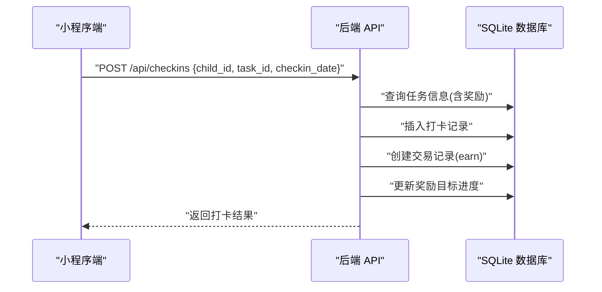
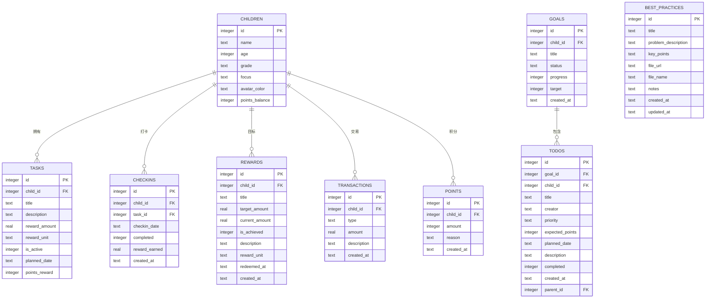
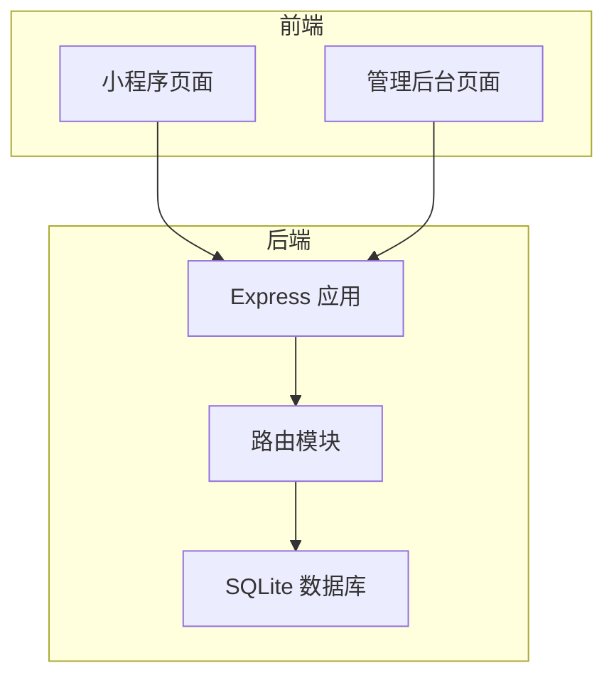
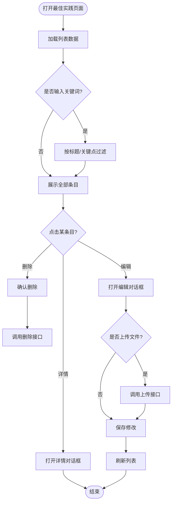
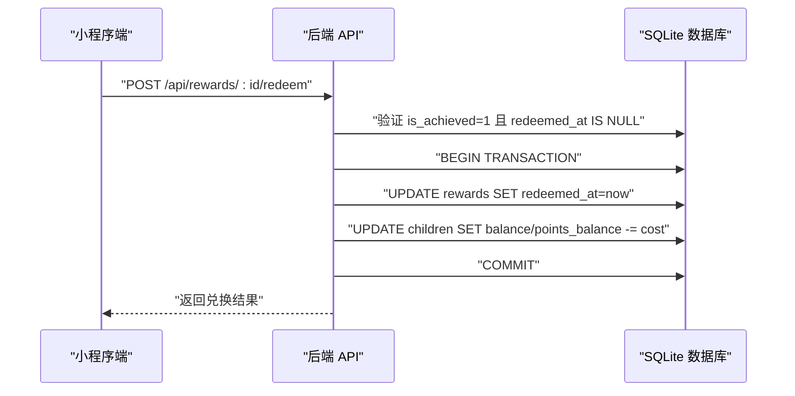
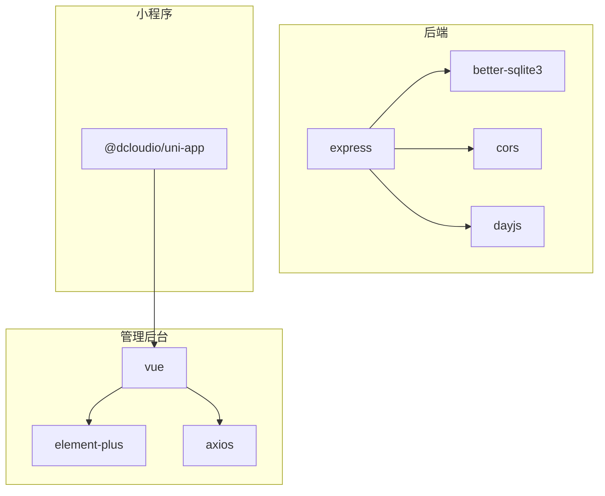

# 最佳实践管理系统

<cite>
**本文引用的文件**
- [ARCHITECTURE.md](file://docs/ARCHITECTURE.md)
- [api.md](file://docs/api.md)
- [server.md](file://docs/design-docs/server.md)
- [app.js](file://star-park/server/src/app.js)
- [database.js](file://star-park/server/src/database.js)
- [best-practices.js](file://star-park/server/src/routes/best-practices.js)
- [BestPractices.vue](file://star-park/pc-admin/src/views/BestPractices.vue)
- [index.vue（小程序首页）](file://star-park/miniprogram/src/pages/index/index.vue)
- [Dashboard.vue（管理后台仪表盘）](file://star-park/pc-admin/src/views/Dashboard.vue)
</cite>

## 产品概述
星星乐园是一个面向多孩家庭的激励管理系统，核心机制为“任务打卡 + 双货币激励（金钱+积分）”，所有功能围绕孩子维度独立管理。除传统的任务、打卡、奖励与统计外，系统新增“最佳实践”模块，用于沉淀家庭运营经验、问题复盘与可复用方法，支持富文本描述、关键点总结与附件上传，便于家长与管理者共享和检索。

目标用户包括：
- 家长：创建与管理孩子、任务、目标、奖励，查看打卡与统计数据，沉淀最佳实践。
- 孩子：通过小程序完成每日打卡，获得金钱与积分激励，兑换奖励。
- 运营/管理者：在管理后台进行数据概览、成员管理与知识沉淀。

核心价值：
- 以行为激励驱动习惯养成，兼顾即时反馈（积分）与长期目标（余额）。
- 将隐性经验显性化，形成可检索、可复用的家庭知识库。
- 前后端分离、部署简单，适合家庭内网使用。

适用场景：
- 多孩家庭日常学习与生活习惯培养。
- 家长对孩子成长过程的可视化追踪与正向激励。
- 团队或小组内部的经验沉淀与分享（扩展场景）。

## 核心业务流程
- 打卡与激励流程
  - 孩子在小程序首页进入打卡页，选择任务并提交打卡。
  - 后端校验任务信息，写入打卡记录，创建交易记录并更新奖励目标进度。
  - 前端展示连续打卡天数、本周完成率与总积累等汇总指标。
- 奖励兑换流程
  - 家长在管理后台设置奖励目标（金额或积分），当达成后可兑换。
  - 后端校验达成状态与未兑换条件，执行事务扣减对应余额或积分，并记录兑换时间。
- 最佳实践沉淀流程
  - 家长在管理后台新建实践，填写标题、解决问题、关键点与备注，可选择上传附件。
  - 后端提供增删改查与文件上传接口，支持按关键词搜索。
  - 列表页支持卡片式浏览、详情预览与快速编辑删除。

**图表来源**
- [server.md:75-93](file://docs/design-docs/server.md#L75-L93)
- [api.md:247-260](file://docs/api.md#L247-L260)

**章节来源**
- [ARCHITECTURE.md:117-143](file://docs/ARCHITECTURE.md#L117-L143)
- [server.md:75-112](file://docs/design-docs/server.md#L75-L112)
- [api.md:235-314](file://docs/api.md#L235-L314)

## 功能模块清单
- 孩子管理
  - 职责：维护孩子基本信息、头像颜色、关注点等；提供余额与交易记录查询。
  - 用户价值：清晰呈现每个孩子的激励现状与成长轨迹。
  - 验收要点：新增孩子后能在仪表盘与小程序中正确显示；余额与交易记录准确。
- 任务与待办
  - 职责：定义任务（含计划日期与奖励）、管理待办（支持关联目标、优先级、预期积分、父子层级）。
  - 用户价值：将复杂目标拆解为可执行的待办，提升完成率。
  - 验收要点：任务排序符合计划日期优先；待办筛选与级联删除正常。
- 打卡与统计
  - 职责：记录打卡、计算连续打卡与周完成率，提供仪表盘数据。
  - 用户价值：直观反馈坚持程度与阶段性成果。
  - 验收要点：打卡后余额与奖励目标进度同步更新；统计口径一致。
- 奖励目标与兑换
  - 职责：设定奖励目标（金额或积分），达成后可兑换并扣减余额或积分。
  - 用户价值：将长期目标具象化，增强动机。
  - 验收要点：仅已达成且未兑换的奖励可兑换；事务保护确保一致性。
- 积分系统
  - 职责：记录积分增减原因与数量，支持查询与手动发放。
  - 用户价值：对行为进行即时正向强化。
  - 验收要点：积分变动有迹可循；余额与积分双轨并行不冲突。
- 最佳实践（新增）
  - 职责：沉淀家庭运营经验，支持富文本描述、关键点总结与附件上传，提供搜索与详情预览。
  - 用户价值：将隐性经验显性化，便于传承与复用。
  - 验收要点：CRUD 完整；文件上传大小限制生效；关键词搜索命中标题与关键点；详情页渲染富文本与附件链接。

**章节来源**
- [api.md:33-368](file://docs/api.md#L33-L368)
- [best-practices.js:25-124](file://star-park/server/src/routes/best-practices.js#L25-L124)
- [BestPractices.vue:147-311](file://star-park/pc-admin/src/views/BestPractices.vue#L147-L311)

## 数据与状态
- 核心数据模型
  - children：孩子基本信息与头像颜色，包含 points_balance 字段用于积分余额。
  - tasks：任务定义，含奖励金额/单位、计划日期与积分奖励。
  - checkins：打卡记录，关联孩子与任务，记录完成状态与奖励。
  - rewards：奖励目标，支持描述、单位（元/积分）与兑换时间。
  - transactions：金钱交易流水，类型包含 earn 等。
  - points：积分流水，记录原因与数量。
  - goals/todos：年度目标与待办，支持父子层级与优先级、预期积分、计划日期。
  - best_practices：最佳实践条目，包含标题、问题描述、关键点、附件信息与备注。
- 关键状态流转
  - 打卡：任务存在 → 写入打卡记录 → 创建交易 → 更新奖励目标进度。
  - 兑换：验证达成且未兑换 → 事务内扣减余额/积分 → 记录兑换时间。
  - 最佳实践：创建/更新/删除条目；文件上传成功后回填 URL 与文件名。
- 数据所有权边界
  - 孩子维度隔离：任务、打卡、奖励、积分均绑定 child_id。
  - 全局与个人目标：goals/todos 支持归属孩子或全局（null）。
  - 最佳实践：无孩子绑定，属于家庭共享知识库。

**图表来源**
- [database.js:27-127](file://star-park/server/src/database.js#L27-L127)

**章节来源**
- [database.js:27-197](file://star-park/server/src/database.js#L27-L197)
- [api.md:33-368](file://docs/api.md#L33-L368)

## 关键约束与边界
- 非功能性需求
  - 部署简单：使用 SQLite 嵌入式数据库，无需外部数据库服务。
  - 跨域支持：启用 CORS，便于前后端分离开发。
  - 静态资源托管：生产环境可通过环境变量直接托管前端产物。
- 依赖与集成边界
  - 后端依赖 Express、better-sqlite3、cors、dayjs。
  - 管理后台依赖 Vue、Element Plus、ECharts、Axios。
  - 小程序依赖 uni-app 框架。
- 业务约束
  - 认证方式：无（家庭内网使用），需配合网络隔离保障安全。
  - 文件上传：单文件大小限制为 10MB，存储于 uploads 目录并通过 /uploads 静态路径访问。
  - 奖励兑换：仅允许已达成且未兑换的目标进行兑换，采用事务保证一致性。
  - 任务与待办：待办支持父子层级（单层嵌套），删除父任务会级联删除子任务。

**章节来源**
- [ARCHITECTURE.md:156-201](file://docs/ARCHITECTURE.md#L156-L201)
- [server.md:114-130](file://docs/design-docs/server.md#L114-L130)
- [best-practices.js:14-23](file://star-park/server/src/routes/best-practices.js#L14-L23)
- [api.md:286-314](file://docs/api.md#L286-L314)

## 架构与组件关系
- 层层次结构
  - L0：数据库初始化与种子数据。
  - L1：路由模块（children、tasks、checkins、rewards、stats、points、goals、todos、best-practices）。
  - L2：Express 应用入口，注册中间件与路由。
  - L3：前端 API 客户端、组件、路由与样式。
  - L4：页面视图（小程序 pages、管理后台 views）。
  - L5：应用入口（main.js、App.vue）。
- 请求处理流
  - 客户端请求 → Express 中间件（CORS、JSON 解析）→ 路由处理 → SQLite 查询 → JSON 响应。
  - 错误统一返回 400/404/500，便于前端提示与排查。

**图表来源**
- [ARCHITECTURE.md:14-71](file://docs/ARCHITECTURE.md#L14-L71)
- [app.js:16-35](file://star-park/server/src/app.js#L16-L35)

**章节来源**
- [ARCHITECTURE.md:75-95](file://docs/ARCHITECTURE.md#L75-L95)
- [app.js:16-55](file://star-park/server/src/app.js#L16-L55)

## 详细组件分析

### 最佳实践模块
- 职责
  - 提供最佳实践的增删改查与文件上传能力。
  - 支持按关键词搜索标题与关键点。
  - 管理后台提供富文本编辑器与预览，便于内容创作与阅读。
- 关键实现
  - 后端路由：GET/POST/PUT/DELETE 与文件上传，使用 multer 配置存储目录与大小限制。
  - 数据库表：best_practices 包含标题、问题描述、关键点、附件信息与备注。
  - 前端页面：卡片网格展示、搜索过滤、详情对话框、编辑表单与文件上传。
- 用户体验
  - 列表页支持快速浏览与操作；详情页富文本渲染与附件下载。
  - 上传失败或超限给出明确提示；编辑时保留已有内容。

**图表来源**
- [BestPractices.vue:147-311](file://star-park/pc-admin/src/views/BestPractices.vue#L147-L311)
- [best-practices.js:25-124](file://star-park/server/src/routes/best-practices.js#L25-L124)

**章节来源**
- [best-practices.js:25-124](file://star-park/server/src/routes/best-practices.js#L25-L124)
- [BestPractices.vue:147-311](file://star-park/pc-admin/src/views/BestPractices.vue#L147-L311)

### 打卡与奖励流程
- 职责
  - 记录打卡、计算奖励、更新目标进度。
  - 提供统计数据与仪表盘数据。
- 关键实现
  - 打卡接口：校验任务信息，写入打卡记录，创建交易，更新奖励目标。
  - 奖励兑换：事务保护，扣减余额或积分，记录兑换时间。
- 用户体验
  - 小程序首页展示问候语、日期与汇总指标；点击跳转打卡页。
  - 管理后台仪表盘展示孩子卡片与添加成员入口。

**图表来源**
- [server.md:95-112](file://docs/design-docs/server.md#L95-L112)
- [api.md:286-314](file://docs/api.md#L286-L314)

**章节来源**
- [server.md:75-112](file://docs/design-docs/server.md#L75-L112)
- [api.md:235-314](file://docs/api.md#L235-L314)

### 管理后台仪表盘
- 职责
  - 展示孩子卡片、添加新成员、获取仪表盘数据。
- 关键实现
  - 调用 getDashboard 接口，兼容数组或对象格式。
  - 提供添加成员对话框，表单校验与提交。
- 用户体验
  - 欢迎区显示日期；卡片区域支持添加成员；空状态提示。

**章节来源**
- [Dashboard.vue:1-145](file://star-park/pc-admin/src/views/Dashboard.vue#L1-L145)

### 小程序首页
- 职责
  - 展示问候语、日期、孩子卡片与汇总指标。
- 关键实现
  - 调用 getDashboard 接口，映射为本地数据结构。
  - 点击卡片跳转打卡页。
- 用户体验
  - 根据时间段动态问候；汇总展示最长连续、本周完成率与总积累。

**章节来源**
- [index.vue（小程序首页）:1-133](file://star-park/miniprogram/src/pages/index/index.vue#L1-L133)

## 依赖分析
- 后端依赖
  - express：HTTP 服务框架。
  - better-sqlite3：嵌入式数据库驱动。
  - cors：跨域请求支持。
  - dayjs：日期处理。
- 管理后台依赖
  - vue、vue-router、pinia、element-plus、echarts、axios。
- 小程序依赖
  - vue、pinia、@dcloudio/uni-app。

**图表来源**
- [ARCHITECTURE.md:167-201](file://docs/ARCHITECTURE.md#L167-L201)

**章节来源**
- [ARCHITECTURE.md:167-201](file://docs/ARCHITECTURE.md#L167-L201)

## 性能考虑
- 数据库优化
  - 启用 WAL 模式提升并发性能。
  - 为 todos.parent_id 建立索引，加速子任务查询。
- 前端优化
  - 列表分页与懒加载（可扩展）。
  - 富文本编辑器按需加载，减少首屏体积。
- 文件上传
  - 限制单文件大小为 10MB，避免大文件影响服务稳定性。

**章节来源**
- [database.js:21-24](file://star-park/server/src/database.js#L21-L24)
- [database.js:194-197](file://star-park/server/src/database.js#L194-L197)
- [best-practices.js:14-23](file://star-park/server/src/routes/best-practices.js#L14-L23)

## 故障排查指南
- 常见问题
  - 打卡后余额未更新：检查任务奖励配置与交易记录是否正确写入。
  - 奖励无法兑换：确认 is_achieved=1 且 redeemed_at 为空。
  - 最佳实践搜索无结果：检查关键词是否匹配标题或关键点。
  - 文件上传失败：确认文件大小不超过 10MB，服务器 uploads 目录存在且有写权限。
- 日志与定位
  - 后端错误统一返回 500，结合数据库日志与路由日志定位问题。
  - 前端错误通过 ElMessage 提示，检查网络请求与接口响应。

**章节来源**
- [api.md:361-368](file://docs/api.md#L361-L368)
- [best-practices.js:25-124](file://star-park/server/src/routes/best-practices.js#L25-L124)
- [BestPractices.vue:266-285](file://star-park/pc-admin/src/views/BestPractices.vue#L266-L285)

## 结论
最佳实践管理系统在星星乐园原有激励体系基础上，新增了知识沉淀与分享能力，使家庭运营经验得以结构化存储与检索。通过前后端分离、简洁部署与友好交互，系统既满足孩子激励的日常需求，又为家长与管理者提供了高效的知识管理工具。未来可在权限控制、版本管理与协作分享方面持续演进，进一步提升系统的可用性与扩展性。