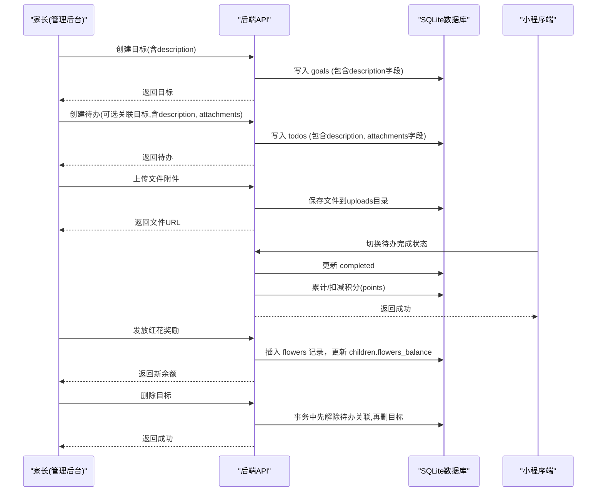
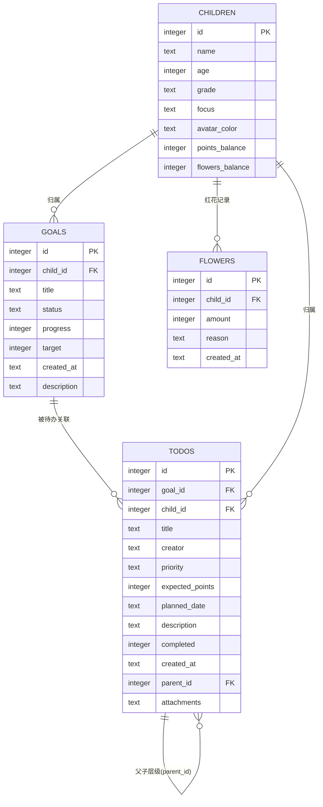
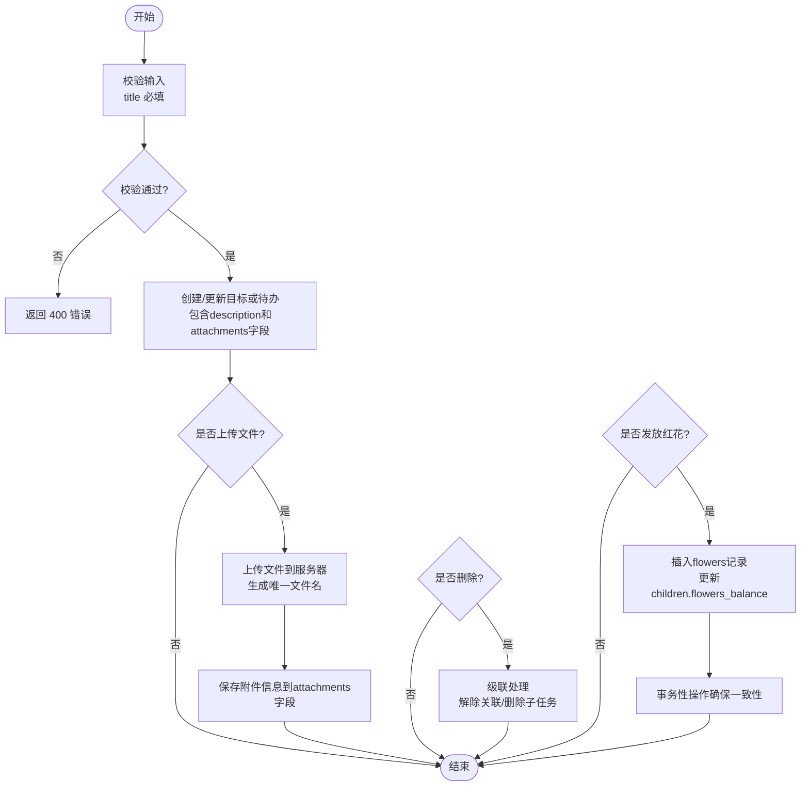

# 目标管理需求实现SOP

<cite>
**本文引用的文件**
- [database.js](file://star-park/server/src/database.js)
- [goals.js](file://star-park/server/src/routes/goals.js)
- [todos.js](file://star-park/server/src/routes/todos.js)
- [flowers.js](file://star-park/server/src/routes/flowers.js)
- [api.md](file://docs/api.md)
- [acceptance.md](file://docs/exec-specs/completed/goals-todos-db-persistence/acceptance.md)
- [tasks.md](file://docs/exec-specs/completed/goals-todos-db-persistence/tasks.md)
- [Goals.vue](file://star-park/pc-admin/src/views/Goals.vue)
- [TodoTree.vue](file://star-park/pc-admin/src/components/TodoTree.vue)
- [index.js](file://star-park/pc-admin/src/api/index.js)
- [star-park-nodejs-cicd.yml](file://.flow/star-park-nodejs-cicd.yml)
- [目标管理需求实现SOP.md](file://.qoderwake/cidRR7nMraPhZpgXUOuhARMxQ%3D%3D/目标管理需求实现SOP.md)
</cite>

## 更新摘要
**变更内容**
- 增强了标准操作流程文档，集成九阶段开发工作流，涵盖从需求确认到项目结项的完整流程
- 更新了阿里云云效 Projex 系统集成细节，包括需求评论同步机制
- 完善了模板和最佳实践，支持自动化需求状态流转
- 新增了红花奖励系统的完整实现，扩展了双货币体系为三货币体系
- 优化了CI/CD流水线配置，支持更好的构建和部署体验

## 产品概述
星星乐园是面向多孩家庭的激励管理系统，核心机制为"任务打卡 + 三货币激励（金钱+积分+红花）"，所有功能围绕孩子维度独立管理。目标与待办是家长规划年度目标、拆解可执行任务并追踪完成度的关键能力：目标用于承载方向与进度，待办用于落地执行；完成待办可自动汇总到对应孩子的积分余额，形成正向反馈闭环。

- **目标**：家长为孩子或家庭设定年度目标，支持状态分类（待办/休憩/健康/快乐/学习），以进度条可视化推进情况，新增描述字段支持详细说明目标内容和期望成果。
- **待办**：将目标拆解为具体可执行的任务，支持优先级、计划日期、预期积分、父子层级等管理能力，同时支持详细的任务描述和丰富的文件附件功能。
- **红花奖励**：新增第三种货币形式，通过特殊奖励机制激励孩子行为，支持手动发放和自动累计。
- **价值**：帮助家长把抽象目标转化为日常行动，通过多维激励提升孩子内驱力，同时沉淀过程数据便于复盘。

## 核心业务流程
- **创建目标**：家长在管理后台新增目标，选择归属孩子（可为全局目标），设置状态、进度、目标值及详细描述。
- **关联待办**：为目标添加待办，支持设置父任务（单层嵌套）、优先级、计划日期、预期积分、任务描述及文件附件等。
- **文件附件管理**：支持多文件上传、拖拽上传、文件预览、删除操作，以及父子任务间的附件继承。
- **执行与完成**：孩子或家长勾选待办完成，系统根据预期积分自动增减对应孩子的积分余额。
- **红花奖励发放**：家长可通过打卡页或奖励管理页面发放红花奖励，实时更新孩子红花余额。
- **删除与解绑**：删除目标时，自动解除其关联待办的目标关系（待办保留）；删除待办会级联删除其子任务。
- **数据迁移**：首次使用会将浏览器本地遗留的目标与待办一次性迁移至服务端，确保跨设备一致。

**图表来源**
- [goals.js:21-85](file://star-park/server/src/routes/goals.js#L21-L85)
- [todos.js:84-138](file://star-park/server/src/routes/todos.js#L84-L138)
- [flowers.js:30-70](file://star-park/server/src/routes/flowers.js#L30-L70)
- [database.js:90-124](file://star-park/server/src/database.js#L90-L124)

## 功能模块清单
- **目标管理**
  - 职责：提供目标的增删改查、按孩子筛选、状态与进度维护，支持详细描述字段。
  - 用户价值：清晰呈现年度目标与完成度，便于家长聚焦重点，通过描述字段详细说明目标背景和要求。
  - 验收要点：
    - 列表支持按 child_id 筛选；创建必填 title；不存在资源返回 404；删除目标时事务内先解除待办关联再删除。
    - description 字段支持文本输入，可在创建和更新时设置。
    - 参考接口定义与验收命令。
- **待办管理**
  - 职责：提供待办的增删改查、按孩子/目标/父任务筛选、父子层级、优先级、计划日期、预期积分等。
  - 用户价值：将目标拆解为可执行动作，支持计划与激励，通过描述字段详细说明任务要求。
  - 验收要点：
    - GET 支持 child_id、goal_id、parent_id 组合筛选；POST 必填 title；PUT 支持显式清空字段；删除父任务级联删除子任务。
    - description 字段支持文本输入，可在创建和更新时设置。
    - 防注入：动态字段来自白名单数组，禁止直接拼接 Object.keys(req.body)。
- **文件附件管理**
  - 职责：支持多文件上传、拖拽上传、文件预览、删除操作，以及父子任务间的附件继承机制。
  - 用户价值：方便用户上传相关文档、图片等附件，支持多种文件格式，提供直观的附件管理界面。
  - 验收要点：
    - 支持多文件同时上传，最大文件大小限制为10MB。
    - 支持中文文件名，避免乱码问题。
    - 附件信息以JSON数组形式存储在数据库中，支持向后兼容旧的单附件字段。
    - 父子任务间可继承附件，复制任务时自动复制附件信息。
- **红花奖励管理**
  - 职责：提供红花的查询、发放、余额管理功能，支持手动发放和自动累计。
  - 用户价值：通过第三货币形式增强激励机制，丰富奖励体系，提升孩子参与积极性。
  - 验收要点：
    - 支持查询指定孩子的红花记录和当前余额。
    - 支持手动发放红花，自动更新children表的flowers_balance字段。
    - 事务性操作确保数据一致性。
- **前端页面与API封装**
  - 职责：Goals.vue 负责展示与交互；api/index.js 统一封装目标与待办API调用。
  - 用户价值：家长友好界面，操作流畅，错误提示明确，支持丰富的描述信息和附件管理。
  - 验收要点：
    - 构建通过；移除本地默认数据；仅保留迁移标记；模板未改动；删除确认分两段 try/catch；toggleTodo 成功后才更新本地状态并触发积分汇总。
    - 目标和待办的描述字段均支持textarea输入，最多3行显示。
    - 附件上传组件支持多文件选择和拖拽操作。
- **数据持久化与迁移**
  - 职责：数据库表结构稳定幂等；首次进入进行一次性迁移，避免重复导入。
  - 用户价值：数据不丢失，跨设备一致，描述信息和附件完整保存。
  - 验收要点：
    - goals/todos 表结构与外键约束正确；resetForTest 顺序满足外键依赖；迁移失败不打标记，下次重试。
    - goals 表新增 description 字段，默认值为空字符串。
    - todos 表新增 attachments 字段，支持JSON数组存储多个附件。
    - children 表新增 flowers_balance 字段，支持红花余额缓存。

**章节来源**
- [api.md:127-234](file://docs/api.md#L127-L234)
- [acceptance.md:41-93](file://docs/exec-specs/completed/goals-todos-db-persistence/acceptance.md#L41-L93)
- [tasks.md:173-295](file://docs/exec-specs/completed/goals-todos-db-persistence/tasks.md#L173-L295)
- [flowers.js:1-73](file://star-park/server/src/routes/flowers.js#L1-L73)
- [Goals.vue:207-668](file://star-park/pc-admin/src/views/Goals.vue#L207-L668)
- [TodoTree.vue:80-101](file://star-park/pc-admin/src/components/TodoTree.vue#L80-L101)
- [index.js:31-43](file://star-park/pc-admin/src/api/index.js#L31-L43)

## 数据与状态
- **核心数据模型**
  - **目标（goals）**：id、child_id、title、status、progress、target、created_at、**description**（新增）。
  - **待办（todos）**：id、goal_id、child_id、title、creator、priority、expected_points、planned_date、description、completed、created_at、parent_id（父子层级）、**attachments**（新增，JSON数组）。
  - **红花（flowers）**：id、child_id、amount、reason、created_at（新增的红花奖励记录）。
  - **孩子（children）**：id、name、age、grade、focus、avatar_color、points_balance、**flowers_balance**（新增红花余额）。
  - **关系**：todos.goal_id → goals.id；todos.child_id → children.id；goals.child_id → children.id；flowers.child_id → children.id。
- **关键状态流转**
  - 目标状态：todo/rest/health/happy/study，用于分类与视觉区分。
  - 待办完成：completed 由 0→1 或 1→0 切换，完成后根据 expected_points 自动加减积分。
  - 父子层级：parent_id 为空表示顶级任务；删除父任务会级联删除子任务。
  - 附件继承：创建子任务时可继承父任务的附件信息。
  - 红花余额：通过手动发放或奖励兑换自动更新children表的flowers_balance字段。
- **数据所有权边界**
  - 目标与待办可按 child_id 归属特定孩子，也可设为全局（null）。
  - 删除目标不会删除待办，但会解除关联；删除待办会级联删除其子任务。
  - 附件数据以JSON数组形式存储，支持向后兼容旧的单附件字段。
  - 红花奖励记录与余额分离存储，确保数据可追溯性和性能。

**图表来源**
- [database.js:90-124](file://star-park/server/src/database.js#L90-L124)
- [database.js:147-155](file://star-park/server/src/database.js#L147-L155)
- [database.js:228-261](file://star-park/server/src/database.js#L228-L261)

**章节来源**
- [database.js:90-124](file://star-park/server/src/database.js#L90-L124)
- [database.js:147-155](file://star-park/server/src/database.js#L147-L155)
- [database.js:228-261](file://star-park/server/src/database.js#L228-L261)
- [api.md:127-234](file://docs/api.md#L127-L234)
- [flowers.js:1-73](file://star-park/server/src/routes/flowers.js#L1-L73)

## 关键约束与边界
- **非功能性需求**
  - 幂等性：建表语句使用 IF NOT EXISTS，重复启动不报错。
  - 安全性：SQL 全部使用占位符；动态字段来自白名单数组，防止 SQL 注入。
  - 一致性：删除目标使用事务，先解除待办关联再删除目标。
  - 文件安全：文件大小限制为10MB，支持中文文件名处理。
  - 事务性：红花发放操作使用事务确保数据一致性。
- **依赖与集成边界**
  - 前后端通过 REST API 通信；前端不直接访问数据库。
  - 积分系统与待办联动：完成待办后调用积分接口进行汇总。
  - 文件存储：使用multer中间件处理文件上传，保存到uploads目录。
  - 云效集成：通过Projex API实现需求评论同步和状态自动流转。
- **业务约束**
  - 目标必填 title；待办必填 title。
  - 父子层级仅支持单层嵌套（子任务不能再有子任务）。
  - 删除父待办会级联删除其子任务。
  - 删除目标不会删除待办，但会解除关联。
  - 首次进入进行一次性迁移，避免重复导入。
  - **新增**：description 字段为可选字段，支持空值，用于存储详细的目标和任务描述信息。
  - **新增**：attachments 字段支持JSON数组格式，最多存储10个附件，每个附件不超过10MB。
  - **新增**：红花数量必须为非零整数，支持负数表示扣减。

**图表来源**
- [goals.js:21-85](file://star-park/server/src/routes/goals.js#L21-L85)
- [todos.js:84-138](file://star-park/server/src/routes/todos.js#L84-L138)
- [todos.js:213-229](file://star-park/server/src/routes/todos.js#L213-L229)
- [flowers.js:30-70](file://star-park/server/src/routes/flowers.js#L30-L70)

**章节来源**
- [acceptance.md:41-93](file://docs/exec-specs/completed/goals-todos-db-persistence/acceptance.md#L41-L93)
- [tasks.md:173-295](file://docs/exec-specs/completed/goals-todos-db-persistence/tasks.md#L173-L295)
- [api.md:127-234](file://docs/api.md#L127-L234)
- [flowers.js:30-70](file://star-park/server/src/routes/flowers.js#L30-L70)

## 九阶段开发工作流

### 阶段1：需求确认
- 明确需求背景、验收标准、影响范围
- 从阿里云云效 Projex 提取需求 ID 和链接
- 收集原始需求信息，包括需求来源、目标用户、期望行为等
- 决策记录模板标准化，确保需求可追溯

### 阶段2：方案确认
- 确定改动点、分支策略、回滚方案
- 评估技术方案可行性
- 制定详细的实施方案

### 阶段3：代码修改
- 按分层架构与项目规范修改代码
- 遵循最小改动原则
- 保持代码质量和一致性

### 阶段4：本地验证
- 执行完整的构建和测试流程
- 验证功能符合验收标准
- 检查代码质量和架构合规性

### 阶段5：远端同步
- 提交并推送至 Codeup 目标分支
- 确保 commit message 规范
- 关联需求 ID 便于追踪

### 阶段6：流水线触发
- 触发云效 Flow 流水线执行
- 监控各阶段运行状态
- 验证构建和部署结果

### 阶段7：分支合并
- 部署验证通过后合并至 main 分支
- 执行代码评审流程
- 确保合并质量

### 阶段8：验收
- 按验收标准逐项确认
- 生成验收结论
- 记录验收结果

### 阶段9：结项
- 更新 Projex 需求状态
- 更新相关文档
- 关闭任务并记录经验

**章节来源**
- [目标管理需求实现SOP.md:10-27](file://.qoderwake/cidRR7nMraPhZpgXUOuhARMxQ%3D%3D/目标管理需求实现SOP.md#L10-L27)
- [目标管理需求实现SOP.md:31-444](file://.qoderwake/cidRR7nMraPhZpgXUOuhARMxQ%3D%3D/目标管理需求实现SOP.md#L31-L444)

## 阿里云云效系统集成

### Projex 评论同步机制
- 每个阶段完成后通过 `aliyun devops projex-create-workitem-comment` 追加阶段记录
- 评论内容为纯文本格式，不支持 markdown 特殊符号和 emoji
- 确保需求全生命周期可追溯，便于复盘和审计

### 自动化规则配置
- 关联的 Codeup MR 已合并 → 需求状态变更为「开发完成」
- 关联的流水线运行成功（main 分支） → 需求状态变更为「待验收」
- 验收结论为通过 → 需求状态变更为「已完成」

### CI/CD 流水线优化
- 支持 Node.js 20.9.0 环境
- 优化 better-sqlite3 原生模块安装
- 改进构建性能和稳定性
- 支持生产环境健康检查和自动回滚

**章节来源**
- [目标管理需求实现SOP.md:527-597](file://.qoderwake/cidRR7nMraPhZpgXUOuhARMxQ%3D%3D/目标管理需求实现SOP.md#L527-L597)
- [star-park-nodejs-cicd.yml:1-153](file://.flow/star-park-nodejs-cicd.yml#L1-L153)

## 新增功能详解

### 红花奖励系统
本次更新为核心功能增强，为星星乐园添加了第三种货币形式——红花，完善了三货币激励体系：

#### 数据库层面
- 新建 `flowers` 账本表，镜像 `points` 表结构（id/child_id/amount/reason/created_at）
- 在 `children` 表新增 `flowers_balance INTEGER DEFAULT 0` 字段作为余额缓存
- 实现幂等的 ALTER TABLE 迁移，确保升级兼容性

#### 后端API实现
- 新增 `/api/flowers` 路由，支持 GET 查询红花记录和余额，POST 手动发放红花
- 使用事务性操作确保数据一致性，同时更新记录表和余额缓存
- 支持红花数量的正负值操作，支持自定义理由说明

#### 用户体验优化
- 仪表盘卡片新增红花余额展示，采用玫瑰色主题突出显示
- 打卡页新增红花奖励入口，支持快速发放弹窗
- 奖励管理页面新增红花单位选项，支持红花兑换逻辑

#### 技术实现细节
- 使用 SQLite 事务确保红花发放的原子性
- 余额缓存机制提升查询性能
- 完善的错误处理和参数校验

**章节来源**
- [database.js:90-97](file://star-park/server/src/database.js#L90-L97)
- [database.js:147-155](file://star-park/server/src/database.js#L147-L155)
- [flowers.js:1-73](file://star-park/server/src/routes/flowers.js#L1-L73)

### 文件附件功能增强
本次更新为核心功能增强，为待办事项系统添加了完整的文件附件支持：

#### 数据库层面
- 在 `database.js` 中为 `todos` 表添加了 `attachments TEXT` 字段，用于存储JSON格式的附件数组
- 实现了从旧单附件字段（file_url/file_name）到新attachments数组的数据迁移
- 支持向后兼容，确保旧数据能够正常显示

#### 后端API实现
- 新增 `/api/todos/upload` 端点，支持多文件上传
- 使用multer中间件处理文件上传，配置10MB大小限制
- 支持中文文件名，通过latin1到utf8的编码转换避免乱码
- 生成唯一文件名格式：`时间戳-随机字符串.扩展名`

#### 前端界面增强
- 在Goals.vue中添加文件附件上传组件，支持多文件选择和拖拽操作
- 实现附件预览功能，显示文件名和下载链接
- 支持附件删除操作，可从表单中移除已上传的文件
- 实现父子任务间的附件继承机制，创建子任务时可继承父任务的附件

#### 用户体验优化
- 文件大小验证，超过10MB的文件会被拒绝
- 上传进度反馈，提供成功和失败的提示信息
- 附件列表展示，支持点击打开文件
- 响应式设计，适配不同屏幕尺寸

**章节来源**
- [database.js:228-261](file://star-park/server/src/database.js#L228-L261)
- [todos.js:213-229](file://star-park/server/src/routes/todos.js#L213-L229)
- [Goals.vue:150-175](file://star-park/pc-admin/src/views/Goals.vue#L150-L175)
- [Goals.vue:618-651](file://star-park/pc-admin/src/views/Goals.vue#L618-L651)
- [TodoTree.vue:80-101](file://star-park/pc-admin/src/components/TodoTree.vue#L80-L101)
- [index.js:42-43](file://star-park/pc-admin/src/api/index.js#L42-L43)

### 附件继承机制
系统实现了智能的附件继承功能：

- **创建子任务时**：自动继承父任务的附件信息，减少重复上传工作
- **复制任务时**：完整复制原任务的附件列表，保持任务关联性
- **数据映射**：前后端之间正确映射attachments数组格式，支持camelCase和snake_case字段名
- **清理机制**：当父任务被删除时，子任务的附件引用仍然有效，确保数据完整性

**章节来源**
- [Goals.vue:537-557](file://star-park/pc-admin/src/views/Goals.vue#L537-L557)
- [Goals.vue:653-667](file://star-park/pc-admin/src/views/Goals.vue#L653-L667)
- [Todos.test.js:123-138](file://star-park/server/tests/todos.test.js#L123-L138)

## 工具与命令速查

### 开发环境
- 安装依赖：`cd star-park && npm run install:all`
- 启动后端：`npm run start:server`
- 启动管理后台：`npm run start:pc`
- 前端构建：`cd star-park/pc-admin && npm run build`

### 质量检查
- 架构 lint：`make lint-arch`
- 全部 lint：`make lint`
- 端到端验证：`make verify`

### 发布运维
- 查看流水线：[https://flow.aliyun.com/pipelines/5212797/current](https://flow.aliyun.com/pipelines/5212797/current)
- 生产健康检查：`curl http://127.0.0.1:3002/api/health`
- 服务日志：`journalctl -u star-park-server -n 100 --no-pager`
- 回滚操作：`bash /opt/star-park/current/deploy/rollback.sh`

### 需求管理
- 需求评论同步：`aliyun devops projex-create-workitem-comment --id <workitemId> --content <内容>`
- 需求状态更新：通过云效控制台或自动化规则

**章节来源**
- [目标管理需求实现SOP.md:448-463](file://.qoderwake/cidRR7nMraPhZpgXUOuhARMxQ%3D%3D/目标管理需求实现SOP.md#L448-L463)
- [DEVELOPMENT.md:29-44](file://docs/DEVELOPMENT.md#L29-L44)

## 常见问题与解决方案

### 权限与环境问题
- **权限守卫拦截**：无法访问项目根目录之外的路径，a1 CLI / 网络命令被拦截
  - 解法：在正确的项目根目录启动会话；无法自动执行的步骤转人工
- **流水线无法自动触发**：推送后流水线没反应
  - 解法：在云效控制台检查「代码源触发」是否开启、分支是否匹配、webhook 是否存在
- **本地构建正常但 CI 失败**：云效公共镜像环境差异
  - 解法：参考 CICD-PLAYBOOK.md §4 做预防性适配

### 数据库与数据问题
- **原生模块编译失败**：better-sqlite3 在云效构建机无法编译
  - 解法：使用预编译产物替代源码编译，配置 npmmirror 镜像
- **端口不通**：安全组已放通但 curl 仍失败
  - 解法：同时检查目标机 firewalld；区分主机 reject 和安全组丢包

### 需求管理问题
- **合并后需求状态未更新**：Projex 状态仍停留在「开发中」
  - 解法：检查 MR/Commit 是否正确关联需求 ID；确认自动化规则已开启；必要时手动更新
- **Projex 评论发布失败**：API 返回 400 错误
  - 解法：评论内容使用纯文本，去除 emoji、markdown 特殊符号

**章节来源**
- [目标管理需求实现SOP.md:467-478](file://.qoderwake/cidRR7nMraPhZpgXUOuhARMxQ%3D%3D/目标管理需求实现SOP.md#L467-L478)
- [star-park-nodejs-cicd.yml:66-85](file://.flow/star-park-nodejs-cicd.yml#L66-L85)

## 附录：全流程检查清单

### 需求阶段
- [ ] 需求来源、目标用户、验收标准已明确
- [ ] Projex 需求链接与需求 ID 已提取并记录
- [ ] 影响范围（前端/后端/数据库/文档）已评估
- [ ] 方案已确认并记录
- [ ] Projex 评论已追加「阶段1：需求确认」和「阶段2：根因分析」

### 开发阶段
- [ ] 已在正确分支上开发
- [ ] Commit / MR 标题已关联需求 ID
- [ ] 改动最小化，符合分层架构
- [ ] 数据层与展示层变更已区分
- [ ] Projex 评论已追加「阶段3：代码修改」

### 验证阶段
- [ ] make lint-arch 通过
- [ ] 涉及子项目构建通过
- [ ] 页面/功能已人工验证
- [ ] 无新增 console.log 调试语句
- [ ] Projex 评论已追加「阶段4：本地验证」

### 发布阶段
- [ ] 已提交并推送至远端目标分支
- [ ] 流水线已触发并成功运行
- [ ] 生产环境健康检查通过
- [ ] 特性分支已合并至 main
- [ ] main 分支流水线运行成功
- [ ] Projex 评论已追加「阶段5：Commit + Push」和「阶段6：流水线」

### 验收与结项
- [ ] 验收 checklist 全部通过
- [ ] Projex 需求状态已更新为「已完成」（自动或人工）
- [ ] 相关文档已更新
- [ ] 需求/任务状态已关闭
- [ ] 经验教训已记录
- [ ] Projex 评论已追加「阶段7：生产验证 + 状态更新」

**章节来源**
- [目标管理需求实现SOP.md:481-524](file://.qoderwake/cidRR7nMraPhZpgXUOuhARMxQ%3D%3D/目标管理需求实现SOP.md#L481-L524)