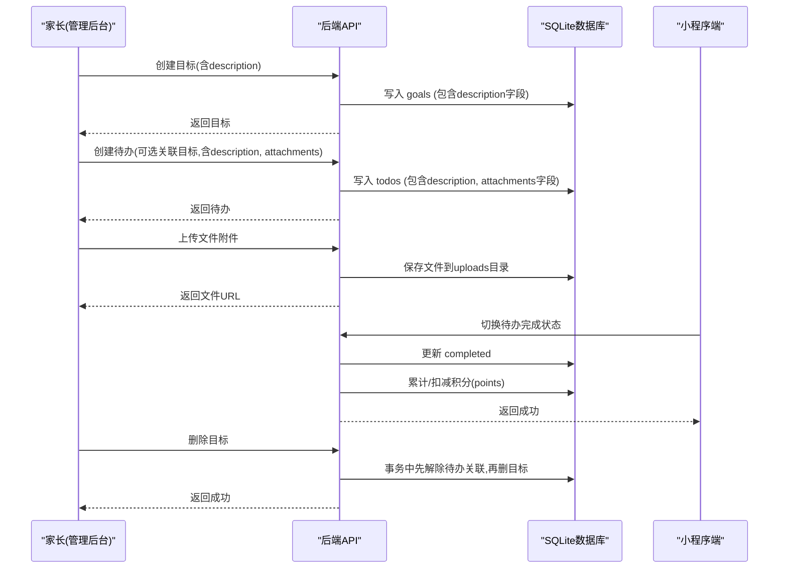
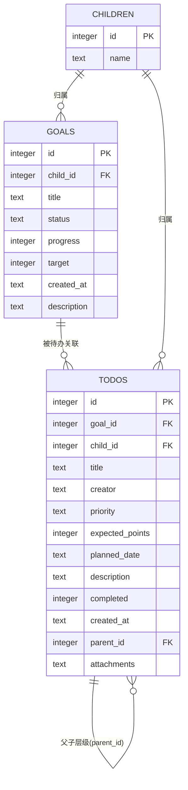
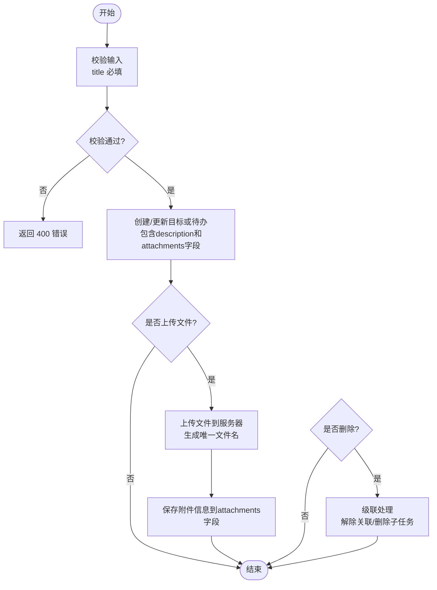

# 目标管理需求实现SOP

<cite>
**本文引用的文件**
- [database.js](file://star-park/server/src/database.js)
- [goals.js](file://star-park/server/src/routes/goals.js)
- [todos.js](file://star-park/server/src/routes/todos.js)
- [api.md](file://docs/api.md)
- [acceptance.md](file://docs/exec-specs/completed/goals-todos-db-persistence/acceptance.md)
- [tasks.md](file://docs/exec-specs/completed/goals-todos-db-persistence/tasks.md)
- [Goals.vue](file://star-park/pc-admin/src/views/Goals.vue)
- [TodoTree.vue](file://star-park/pc-admin/src/components/TodoTree.vue)
- [index.js](file://star-park/pc-admin/src/api/index.js)
</cite>

## 更新摘要
**变更内容**
- 增强了待办事项的文件附件功能，支持多文件上传、拖拽上传、文件预览和继承机制
- 数据库schema增加了attachments字段，支持JSON数组存储多个附件
- 后端路由实现了文件上传处理，支持中文文件名和多文件上传
- 前端界面集成了完整的附件管理功能，包括上传、预览、删除等操作
- 实现了父子任务间的附件继承机制

## 产品概述
星星乐园是面向多孩家庭的激励管理系统，核心机制为"任务打卡 + 双货币激励（金钱+积分）"，所有功能围绕孩子维度独立管理。目标与待办是家长规划年度目标、拆解可执行任务并追踪完成度的关键能力：目标用于承载方向与进度，待办用于落地执行；完成待办可自动汇总到对应孩子的积分余额，形成正向反馈闭环。

- **目标**：家长为孩子或家庭设定年度目标，支持状态分类（待办/休憩/健康/快乐/学习），以进度条可视化推进情况，新增描述字段支持详细说明目标内容和期望成果。
- **待办**：将目标拆解为具体可执行的任务，支持优先级、计划日期、预期积分、父子层级等管理能力，同时支持详细的任务描述和丰富的文件附件功能。
- **价值**：帮助家长把抽象目标转化为日常行动，通过积分激励提升孩子内驱力，同时沉淀过程数据便于复盘。

## 核心业务流程
- **创建目标**：家长在管理后台新增目标，选择归属孩子（可为全局目标），设置状态、进度、目标值及详细描述。
- **关联待办**：为目标添加待办，支持设置父任务（单层嵌套）、优先级、计划日期、预期积分、任务描述及文件附件等。
- **文件附件管理**：支持多文件上传、拖拽上传、文件预览、删除操作，以及父子任务间的附件继承。
- **执行与完成**：孩子或家长勾选待办完成，系统根据预期积分自动增减对应孩子的积分余额。
- **删除与解绑**：删除目标时，自动解除其关联待办的目标关系（待办保留）；删除待办会级联删除其子任务。
- **数据迁移**：首次使用会将浏览器本地遗留的目标与待办一次性迁移至服务端，确保跨设备一致。

**图表来源**
- [goals.js:21-85](file://star-park/server/src/routes/goals.js#L21-L85)
- [todos.js:84-138](file://star-park/server/src/routes/todos.js#L84-L138)
- [database.js:90-124](file://star-park/server/src/database.js#L90-L124)

**章节来源**
- [acceptance.md:7-62](file://docs/exec-specs/completed/goals-todos-db-persistence/acceptance.md#L7-L62)
- [tasks.md:69-171](file://docs/exec-specs/completed/goals-todos-db-persistence/tasks.md#L69-L171)

## 功能模块清单
- **目标管理**
  - 职责：提供目标的增删改查、按孩子筛选、状态与进度维护，支持详细描述字段。
  - 用户价值：清晰呈现年度目标与完成度，便于家长聚焦重点，通过描述字段详细说明目标背景和要求。
  - 验收要点：
    - 列表支持按 child_id 筛选；创建必填 title；不存在资源返回 404；删除目标时事务内先解除待办关联再删除。
    - description 字段支持文本输入，可在创建和更新时设置。
    - 参考接口定义与验收命令。
- **待办管理**
  - 职责：提供待办的增删改查、按孩子/目标/父任务筛选、父子层级、优先级、计划日期、预期积分等。
  - 用户价值：将目标拆解为可执行动作，支持计划与激励，通过描述字段详细说明任务要求。
  - 验收要点：
    - GET 支持 child_id、goal_id、parent_id 组合筛选；POST 必填 title；PUT 支持显式清空字段；删除父任务级联删除子任务。
    - description 字段支持文本输入，可在创建和更新时设置。
    - 防注入：动态字段来自白名单数组，禁止直接拼接 Object.keys(req.body)。
- **文件附件管理**
  - 职责：支持多文件上传、拖拽上传、文件预览、删除操作，以及父子任务间的附件继承机制。
  - 用户价值：方便用户上传相关文档、图片等附件，支持多种文件格式，提供直观的附件管理界面。
  - 验收要点：
    - 支持多文件同时上传，最大文件大小限制为10MB。
    - 支持中文文件名，避免乱码问题。
    - 附件信息以JSON数组形式存储在数据库中，支持向后兼容旧的单附件字段。
    - 父子任务间可继承附件，复制任务时自动复制附件信息。
- **前端页面与API封装**
  - 职责：Goals.vue 负责展示与交互；api/index.js 统一封装目标与待办API调用。
  - 用户价值：家长友好界面，操作流畅，错误提示明确，支持丰富的描述信息和附件管理。
  - 验收要点：
    - 构建通过；移除本地默认数据；仅保留迁移标记；模板未改动；删除确认分两段 try/catch；toggleTodo 成功后才更新本地状态并触发积分汇总。
    - 目标和待办的描述字段均支持textarea输入，最多3行显示。
    - 附件上传组件支持多文件选择和拖拽操作。
- **数据持久化与迁移**
  - 职责：数据库表结构稳定幂等；首次进入进行一次性迁移，避免重复导入。
  - 用户价值：数据不丢失，跨设备一致，描述信息和附件完整保存。
  - 验收要点：
    - goals/todos 表结构与外键约束正确；resetForTest 顺序满足外键依赖；迁移失败不打标记，下次重试。
    - goals 表新增 description 字段，默认值为空字符串。
    - todos 表新增 attachments 字段，支持JSON数组存储多个附件。

**章节来源**
- [api.md:127-234](file://docs/api.md#L127-L234)
- [acceptance.md:41-93](file://docs/exec-specs/completed/goals-todos-db-persistence/acceptance.md#L41-L93)
- [tasks.md:173-295](file://docs/exec-specs/completed/goals-todos-db-persistence/tasks.md#L173-L295)
- [Goals.vue:207-668](file://star-park/pc-admin/src/views/Goals.vue#L207-L668)
- [TodoTree.vue:80-101](file://star-park/pc-admin/src/components/TodoTree.vue#L80-L101)
- [index.js:31-43](file://star-park/pc-admin/src/api/index.js#L31-L43)

## 数据与状态
- **核心数据模型**
  - **目标（goals）**：id、child_id、title、status、progress、target、created_at、**description**（新增）。
  - **待办（todos）**：id、goal_id、child_id、title、creator、priority、expected_points、planned_date、description、completed、created_at、parent_id（父子层级）、**attachments**（新增，JSON数组）。
  - **关系**：todos.goal_id → goals.id；todos.child_id → children.id；goals.child_id → children.id。
- **关键状态流转**
  - 目标状态：todo/rest/health/happy/study，用于分类与视觉区分。
  - 待办完成：completed 由 0→1 或 1→0 切换，完成后根据 expected_points 自动加减积分。
  - 父子层级：parent_id 为空表示顶级任务；删除父任务会级联删除子任务。
  - 附件继承：创建子任务时可继承父任务的附件信息。
- **数据所有权边界**
  - 目标与待办可按 child_id 归属特定孩子，也可设为全局（null）。
  - 删除目标不会删除待办，但会解除关联；删除待办会级联删除其子任务。
  - 附件数据以JSON数组形式存储，支持向后兼容旧的单附件字段。

**图表来源**
- [database.js:90-124](file://star-park/server/src/database.js#L90-L124)
- [database.js:228-261](file://star-park/server/src/database.js#L228-L261)

**章节来源**
- [database.js:90-124](file://star-park/server/src/database.js#L90-L124)
- [database.js:228-261](file://star-park/server/src/database.js#L228-L261)
- [api.md:127-234](file://docs/api.md#L127-L234)

## 关键约束与边界
- **非功能性需求**
  - 幂等性：建表语句使用 IF NOT EXISTS，重复启动不报错。
  - 安全性：SQL 全部使用占位符；动态字段来自白名单数组，防止 SQL 注入。
  - 一致性：删除目标使用事务，先解除待办关联再删除目标。
  - 文件安全：文件大小限制为10MB，支持中文文件名处理。
- **依赖与集成边界**
  - 前后端通过 REST API 通信；前端不直接访问数据库。
  - 积分系统与待办联动：完成待办后调用积分接口进行汇总。
  - 文件存储：使用multer中间件处理文件上传，保存到uploads目录。
- **业务约束**
  - 目标必填 title；待办必填 title。
  - 父子层级仅支持单层嵌套（子任务不能再有子任务）。
  - 删除父待办会级联删除其子任务。
  - 删除目标不会删除待办，但会解除关联。
  - 首次进入进行一次性迁移，避免重复导入。
  - **新增**：description 字段为可选字段，支持空值，用于存储详细的目标和任务描述信息。
  - **新增**：attachments 字段支持JSON数组格式，最多存储10个附件，每个附件不超过10MB。

**图表来源**
- [goals.js:21-85](file://star-park/server/src/routes/goals.js#L21-L85)
- [todos.js:84-138](file://star-park/server/src/routes/todos.js#L84-L138)
- [todos.js:213-229](file://star-park/server/src/routes/todos.js#L213-L229)

**章节来源**
- [acceptance.md:41-93](file://docs/exec-specs/completed/goals-todos-db-persistence/acceptance.md#L41-L93)
- [tasks.md:173-295](file://docs/exec-specs/completed/goals-todos-db-persistence/tasks.md#L173-L295)
- [api.md:127-234](file://docs/api.md#L127-L234)

## 新增功能详解

### 文件附件功能增强
本次更新为核心功能增强，为待办事项系统添加了完整的文件附件支持：

#### 数据库层面
- 在 `database.js` 中为 `todos` 表添加了 `attachments TEXT` 字段，用于存储JSON格式的附件数组
- 实现了从旧单附件字段（file_url/file_name）到新attachments数组的数据迁移
- 支持向后兼容，确保旧数据能够正常显示

#### 后端API实现
- 新增 `/api/todos/upload` 端点，支持多文件上传
- 使用multer中间件处理文件上传，配置10MB大小限制
- 支持中文文件名，通过latin1到utf8的编码转换避免乱码
- 生成唯一文件名格式：`时间戳-随机字符串.扩展名`

#### 前端界面增强
- 在Goals.vue中添加文件附件上传组件，支持多文件选择和拖拽操作
- 实现附件预览功能，显示文件名和下载链接
- 支持附件删除操作，可从表单中移除已上传的文件
- 实现父子任务间的附件继承机制，创建子任务时可继承父任务的附件

#### 用户体验优化
- 文件大小验证，超过10MB的文件会被拒绝
- 上传进度反馈，提供成功和失败的提示信息
- 附件列表展示，支持点击打开文件
- 响应式设计，适配不同屏幕尺寸

### 技术实现细节
- **文件存储**：使用Node.js文件系统模块，文件保存在项目根目录的uploads文件夹中
- **数据序列化**：使用JSON.stringify/parse处理attachments字段的序列化和反序列化
- **兼容性处理**：同时支持新的attachments数组格式和旧的file_url/file_name字段
- **错误处理**：完善的异常捕获和用户友好的错误提示

**章节来源**
- [database.js:228-261](file://star-park/server/src/database.js#L228-L261)
- [todos.js:213-229](file://star-park/server/src/routes/todos.js#L213-L229)
- [Goals.vue:150-175](file://star-park/pc-admin/src/views/Goals.vue#L150-L175)
- [Goals.vue:618-651](file://star-park/pc-admin/src/views/Goals.vue#L618-L651)
- [TodoTree.vue:80-101](file://star-park/pc-admin/src/components/TodoTree.vue#L80-L101)
- [index.js:42-43](file://star-park/pc-admin/src/api/index.js#L42-L43)

### 附件继承机制
系统实现了智能的附件继承功能：

- **创建子任务时**：自动继承父任务的附件信息，减少重复上传工作
- **复制任务时**：完整复制原任务的附件列表，保持任务关联性
- **数据映射**：前后端之间正确映射attachments数组格式，支持camelCase和snake_case字段名
- **清理机制**：当父任务被删除时，子任务的附件引用仍然有效，确保数据完整性

**章节来源**
- [Goals.vue:537-557](file://star-park/pc-admin/src/views/Goals.vue#L537-L557)
- [Goals.vue:653-667](file://star-park/pc-admin/src/views/Goals.vue#L653-L667)
- [Todos.test.js:123-138](file://star-park/server/tests/todos.test.js#L123-L138)