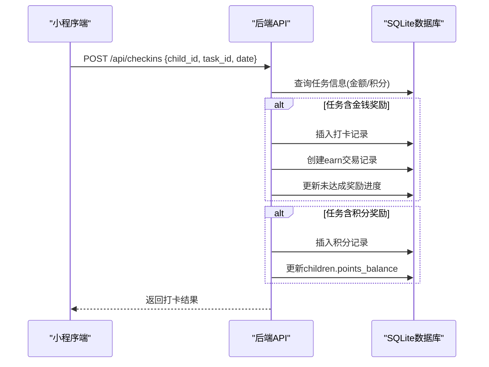
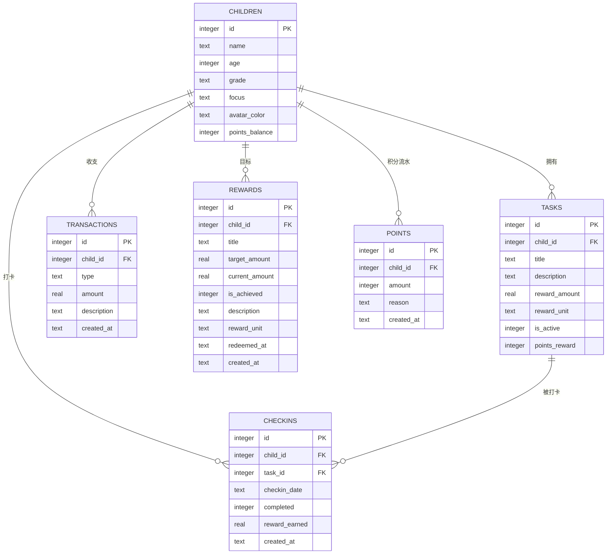
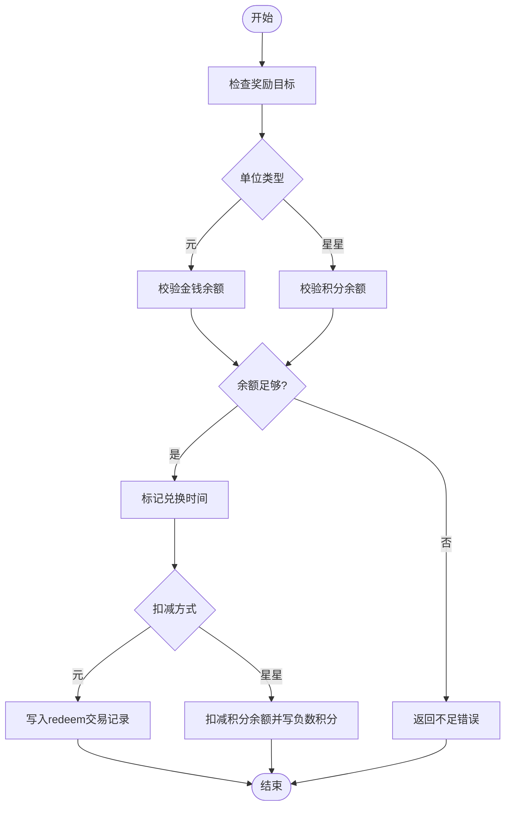

# 双货币激励体系

<cite>
**本文引用的文件**
- [star-park/server/src/database.js](file://star-park/server/src/database.js)
- [star-park/server/src/routes/checkins.js](file://star-park/server/src/routes/checkins.js)
- [star-park/server/src/routes/rewards.js](file://star-park/server/src/routes/rewards.js)
- [star-park/server/src/routes/points.js](file://star-park/server/src/routes/points.js)
- [star-park/server/src/routes/children.js](file://star-park/server/src/routes/children.js)
- [star-park/miniprogram/src/pages/wallet/index.vue](file://star-park/miniprogram/src/pages/wallet/index.vue)
- [star-park/miniprogram/src/components/PointsModal.vue](file://star-park/miniprogram/src/components/PointsModal.vue)
- [star-park/miniprogram/src/api/index.js](file://star-park/miniprogram/src/api/index.js)
- [star-park/pc-admin/src/views/Balance.vue](file://star-park/pc-admin/src/views/Balance.vue)
- [docs/exec-specs/miniprogram-checkin-wallet/spec.md](file://docs/exec-specs/miniprogram-checkin-wallet/spec.md)
- [docs/exec-specs/completed/reward-management/acceptance.md](file://docs/exec-specs/completed/reward-management/acceptance.md)
- [docs/ARCHITECTURE.md](file://docs/ARCHITECTURE.md)
</cite>

## 更新摘要
**变更内容**
- 修复了余额显示的单位标签，从'元'（货币）更正为'积分'（奖励积分）
- 更新了管理后台余额页面的单位显示逻辑
- 确保积分系统正确显示为'积分'而非货币单位
- 保持了金钱系统的'元'单位显示不变

## 产品概述
星星乐园是面向多孩家庭的激励管理系统，核心机制为"任务打卡 + 双货币激励（金钱+积分）"。本 Wiki 聚焦解释金钱余额与积分两套独立系统的设计意图、来源用途、单位与记录方式，帮助产品经理、运营与家长理解：
- 金钱系统：用于可量化的金钱奖励与目标兑换，强调"攒钱—达成—兑换"的财商培养路径。
- 积分系统：用于行为激励与即时反馈，强调"完成即得、正向强化"的行为干预路径。
- 互补关系：金钱侧重长期目标与价值认知，积分侧重高频行为塑造；两者相互补充，共同驱动孩子持续参与。

适用场景包括：家庭日常任务打卡、阶段性目标管理、家长灵活发放特殊积分、孩子集中查看钱包与明细等。

## 核心业务流程
围绕"打卡—赚币—攒目标—兑换"的主链路，双货币各自有独立的来源与扣减路径：
- 打卡产生金钱收入：完成任务后按任务预设金额写入交易记录，并同步更新未达成奖励目标的进度。
- 打卡自动获得积分：任务完成后根据任务设定的积分奖励，直接增加积分余额并记录积分流水。
- 家长手动发放积分：通过"特殊积分奖励"弹窗，为指定孩子发放任意积分数值并记录原因。
- 奖励兑换：支持以"元"或"星星"为单位进行兑换；"元"走交易扣减，"星星"走积分余额扣减并记录负数积分。

**图表来源**
- [star-park/server/src/routes/checkins.js:40-106](file://star-park/server/src/routes/checkins.js#L40-L106)
- [star-park/server/src/routes/checkins.js:128-193](file://star-park/server/src/routes/checkins.js#L128-L193)
- [star-park/server/src/database.js:27-88](file://star-park/server/src/database.js#L27-L88)

**章节来源**
- [star-park/server/src/routes/checkins.js:40-106](file://star-park/server/src/routes/checkins.js#L40-L106)
- [star-park/server/src/routes/checkins.js:128-193](file://star-park/server/src/routes/checkins.js#L128-L193)
- [docs/exec-specs/miniprogram-checkin-wallet/spec.md:60-116](file://docs/exec-specs/miniprogram-checkin-wallet/spec.md#L60-L116)

## 功能模块清单
- 打卡模块
  - 职责：记录每日任务完成情况，触发金钱与积分奖励，更新奖励目标进度。
  - 用户价值：让孩子看到"完成=收获"，形成正向反馈闭环。
  - 验收要点：已完成任务不可重复打卡；金钱与积分分别写入对应表；奖励进度实时更新。
- 钱包模块（小程序）
  - 职责：集中展示金钱余额与积分余额，提供交易明细与积分记录查看。
  - 用户价值：清晰呈现"我有多少钱/积分"和"钱/积分从哪来、到哪去"。
  - 验收要点：余额卡片显示正确；列表区分 earn/spend 与积分正负；最近50条数据加载。
- 奖励目标模块
  - 职责：创建、编辑、删除奖励目标；支持"元"或"星星"单位；达成后可兑换。
  - 用户价值：将抽象储蓄具象化为可视目标，提升延迟满足能力。
  - 验收要点：进度与累计余额一致；已达成且未兑换才可兑换；兑换后标记时间并扣减相应余额。
- 积分发放模块
  - 职责：家长可为孩子发放特殊积分，记录原因并更新余额。
  - 用户价值：灵活激励非任务场景的良好行为。
  - 验收要点：分值必须为非零整数；余额与记录一致；失败时给出明确提示。

**章节来源**
- [star-park/miniprogram/src/pages/wallet/index.vue:17-75](file://star-park/miniprogram/src/pages/wallet/index.vue#L17-L75)
- [star-park/miniprogram/src/components/PointsModal.vue:23-55](file://star-park/miniprogram/src/components/PointsModal.vue#L23-55)
- [star-park/server/src/routes/rewards.js:52-113](file://star-park/server/src/routes/rewards.js#L52-L113)
- [star-park/server/src/routes/points.js:30-70](file://star-park/server/src/routes/points.js#L30-L70)

## 数据与状态
- 核心数据模型
  - children：孩子主数据，包含 points_balance（积分余额）。
  - tasks：任务定义，包含 reward_amount（金钱奖励）、reward_unit（默认"元"）、points_reward（积分奖励）。
  - checkins：打卡记录，包含 reward_earned（本次金钱奖励）。
  - transactions：金钱交易流水，type 为 earn/spend/redeem，amount 为正数，description 描述来源/去向。
  - rewards：奖励目标，target_amount 为目标金额，current_amount 为当前累计，is_achieved 是否达成，redeemed_at 兑换时间，reward_unit 支持"元"或"星星"。
  - points：积分流水，amount 可正可负，reason 记录原因。
- 关键状态流转
  - 打卡完成：
    - 金钱：插入 checkins → 写入 transactions(type='earn') → 更新未达成奖励的 current_amount。
    - 积分：写入 points(amount>0) → 累加 children.points_balance。
  - 家长发放积分：
    - 写入 points(amount>0) → 累加 children.points_balance。
  - 奖励兑换：
    - 单位"元"：校验余额 ≥ 目标 → 标记 redeemed_at → 写入 transactions(type='redeem')。
    - 单位"星星"：校验积分余额 ≥ 目标 → 标记 redeemed_at → 扣减 children.points_balance → 写入 points(amount<0)。
- 数据所有权边界
  - 金钱余额由 transactions 表聚合计算，不持久化在 children 表。
  - 积分余额持久化在 children.points_balance，同时保留 points 流水作为审计依据。
  - 奖励目标进度与余额口径保持一致，避免"显示与事实不一致"。

**图表来源**
- [star-park/server/src/database.js:27-116](file://star-park/server/src/database.js#L27-L116)

**章节来源**
- [star-park/server/src/database.js:27-116](file://star-park/server/src/database.js#L27-L116)
- [star-park/server/src/routes/rewards.js:5-34](file://star-park/server/src/routes/rewards.js#L5-L34)
- [star-park/server/src/routes/rewards.js:115-189](file://star-park/server/src/routes/rewards.js#L115-L189)
- [star-park/server/src/routes/points.js:13-24](file://star-park/server/src/routes/points.js#L13-L24)
- [star-park/server/src/routes/children.js:14-24](file://star-park/server/src/routes/children.js#L14-L24)

## 关键约束与边界
- 设计意图
  - 金钱系统：以"元"为单位，强调真实价值感与目标达成，适合培养储蓄与消费决策能力。
  - 积分系统：以"星星"为单位，强调即时正向反馈，适合高频行为塑造与习惯养成。
  - 互补关系：金钱用于中长期目标，积分用于短期行为强化；两者互不干扰但可协同。
- 来源与用途
  - 金钱来源：任务打卡 earn；支出/兑换：spend/redeem。
  - 积分来源：任务打卡 points_reward、家长手动发放；支出/兑换：负数 points 记录。
- 单位与记录方式
  - 金钱：transactions 表记录每笔收支，余额通过 SUM(earn) − SUM(spend/redeem) 计算。
  - 积分：children.points_balance 持久化余额，points 表记录每次变动（可正可负）。
- 业务约束
  - 奖励兑换需满足"已达成且未兑换"；单位"元"需校验金钱余额，单位"星星"需校验积分余额。
  - 打卡防重复：前端禁用已完成任务勾选；后端事务保证一致性。
  - 数据口径一致：奖励进度与累计余额对齐，避免前后端显示差异。
- 集成边界
  - 小程序钱包页面通过 children/:id/transactions 获取金钱明细，通过 /points 获取积分记录。
  - 管理后台与小程序共享同一套后端接口，确保数据一致性与体验统一。

**图表来源**
- [star-park/server/src/routes/rewards.js:115-189](file://star-park/server/src/routes/rewards.js#L115-L189)

**章节来源**
- [docs/exec-specs/completed/reward-management/acceptance.md:25-37](file://docs/exec-specs/completed/reward-management/acceptance.md#L25-L37)
- [docs/exec-specs/miniprogram-checkin-wallet/spec.md:108-116](file://docs/exec-specs/miniprogram-checkin-wallet/spec.md#L108-L116)
- [docs/ARCHITECTURE.md:156-164](file://docs/ARCHITECTURE.md#L156-L164)

## 余额显示单位标签修复

### 修复详情
本次更新修复了余额显示的单位标签问题，确保积分系统正确显示为"积分"而非货币单位"元"。

### 具体变更
- **管理后台余额页面**：将积分余额的单位标签从"元"更正为"积分"，准确反映积分制奖励系统
- **小程序钱包页面**：保持金钱余额显示为"¥X"格式，积分余额显示纯数字配合"积分余额"标签
- **后端API响应**：确保返回的balance字段格式正确，金钱余额包含货币符号，积分余额为纯数值

### 技术实现
- 管理后台 `Balance.vue` 中积分余额显示使用 `积分` 标签
- 小程序钱包页面通过不同的卡片样式区分金钱和积分余额
- 后端 `children.js` 路由中金钱余额格式化为 `¥${balanceResult.total}` 字符串

### 用户体验改进
- 积分系统现在明确显示为"积分"单位，避免与货币混淆
- 金钱系统保持原有的"元"单位显示，符合传统货币认知
- 两个系统界面分离清晰，用户能准确理解不同余额的含义

**章节来源**
- [star-park/pc-admin/src/views/Balance.vue:19-24](file://star-park/pc-admin/src/views/Balance.vue#L19-L24)
- [star-park/miniprogram/src/pages/wallet/index.vue:19-30](file://star-park/miniprogram/src/pages/wallet/index.vue#L19-L30)
- [star-park/server/src/routes/children.js:21-24](file://star-park/server/src/routes/children.js#L21-L24)