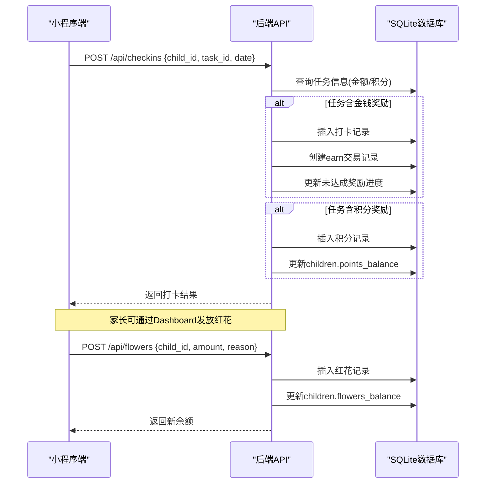
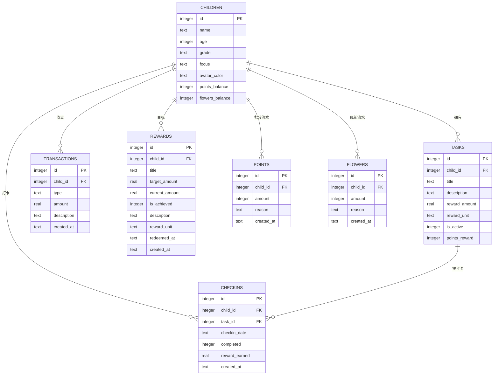
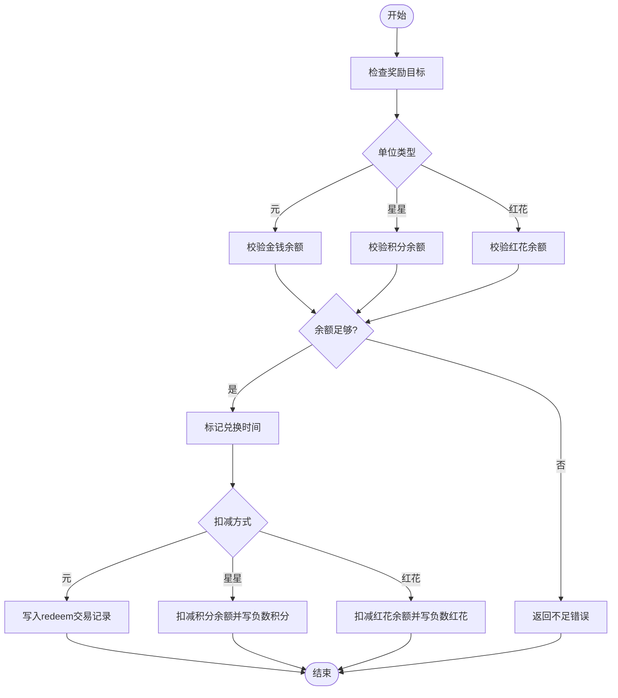
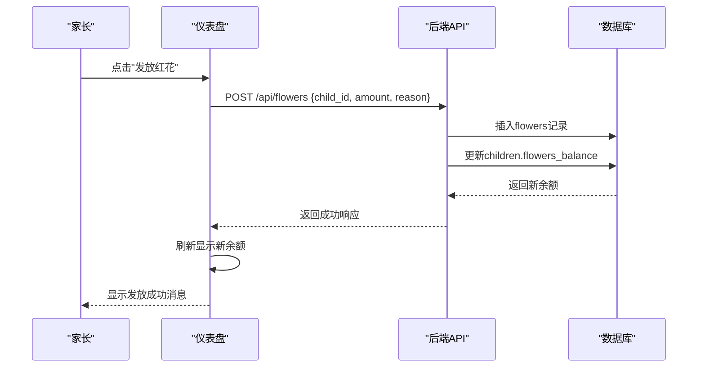

# 双货币激励体系

<cite>
**本文引用的文件**
- [star-park/server/src/database.js](file://star-park/server/src/database.js)
- [star-park/server/src/routes/checkins.js](file://star-park/server/src/routes/checkins.js)
- [star-park/server/src/routes/rewards.js](file://star-park/server/src/routes/rewards.js)
- [star-park/server/src/routes/points.js](file://star-park/server/src/routes/points.js)
- [star-park/server/src/routes/flowers.js](file://star-park/server/src/routes/flowers.js)
- [star-park/server/src/routes/children.js](file://star-park/server/src/routes/children.js)
- [star-park/server/src/routes/stats.js](file://star-park/server/src/routes/stats.js)
- [star-park/miniprogram/src/pages/wallet/index.vue](file://star-park/miniprogram/src/pages/wallet/index.vue)
- [star-park/miniprogram/src/components/PointsModal.vue](file://star-park/miniprogram/src/components/PointsModal.vue)
- [star-park/miniprogram/src/api/index.js](file://star-park/miniprogram/src/api/index.js)
- [star-park/pc-admin/src/views/Balance.vue](file://star-park/pc-admin/src/views/Balance.vue)
- [star-park/pc-admin/src/components/ChildCard.vue](file://star-park/pc-admin/src/components/ChildCard.vue)
- [star-park/pc-admin/src/views/Rewards.vue](file://star-park/pc-admin/src/views/Rewards.vue)
- [star-park/pc-admin/src/views/Dashboard.vue](file://star-park/pc-admin/src/views/Dashboard.vue)
- [star-park/pc-admin/src/views/Checkin.vue](file://star-park/pc-admin/src/views/Checkin.vue)
- [star-park/pc-admin/src/api/index.js](file://star-park/pc-admin/src/api/index.js)
- [star-park/server/tests/flowers.test.js](file://star-park/server/tests/flowers.test.js)
- [docs/exec-specs/miniprogram-checkin-wallet/spec.md](file://docs/exec-specs/miniprogram-checkin-wallet/spec.md)
- [docs/exec-specs/completed/reward-management/acceptance.md](file://docs/exec-specs/completed/reward-management/acceptance.md)
- [docs/ARCHITECTURE.md](file://docs/ARCHITECTURE.md)
</cite>

## 更新摘要
**变更内容**
- 红花奖励系统UI功能从孤立的Checkin.vue组件迁移到Dashboard.vue页面，提升可访问性
- 在仪表盘页面新增"发放红花"按钮和完整的弹窗交互流程
- 实现了红花的发放、查询、余额管理和奖励兑换的完整前端界面
- 优化了用户界面体验，将红花管理功能集成到主工作流中

## 产品概述
星星乐园是面向多孩家庭的激励管理系统，核心机制为"任务打卡 + 三货币激励（金钱+积分+红花）"。本 Wiki 聚焦解释金钱余额、积分余额与红花余额三套独立系统的设计意图、来源用途、单位与记录方式，帮助产品经理、运营与家长理解：
- 金钱系统：用于可量化的金钱奖励与目标兑换，强调"攒钱—达成—兑换"的财商培养路径。
- 积分系统：用于行为激励与即时反馈，强调"完成即得、正向强化"的行为干预路径。
- 红花系统：用于特殊行为奖励与情感激励，强调"家长认可、即时鼓励"的情感教育路径。
- 互补关系：金钱侧重长期目标与价值认知，积分侧重高频行为塑造，红花侧重情感认可与特殊表现；三者相互补充，共同驱动孩子持续参与。

适用场景包括：家庭日常任务打卡、阶段性目标管理、家长灵活发放特殊红花、孩子集中查看钱包与明细等。

## 核心业务流程
围绕"打卡—赚币—攒目标—兑换"的主链路，三货币各自有独立的来源与扣减路径：
- 打卡产生金钱收入：完成任务后按任务预设金额写入交易记录，并同步更新未达成奖励目标的进度。
- 打卡自动获得积分：任务完成后根据任务设定的积分奖励，直接增加积分余额并记录积分流水。
- 家长手动发放红花：通过仪表盘的"发放红花"功能，为指定孩子发放任意红花朵数并记录原因。
- 奖励兑换：支持以"元"、"星星"或"红花"为单位进行兑换；"元"走交易扣减，"星星"走积分余额扣减，"红花"走红花余额扣减并记录负数流水。



**图表来源**
- [star-park/server/src/routes/checkins.js:40-106](file://star-park/server/src/routes/checkins.js#L40-L106)
- [star-park/server/src/routes/checkins.js:128-193](file://star-park/server/src/routes/checkins.js#L128-L193)
- [star-park/server/src/routes/flowers.js:30-70](file://star-park/server/src/routes/flowers.js#L30-L70)
- [star-park/server/src/database.js:27-88](file://star-park/server/src/database.js#L27-L88)

**章节来源**
- [star-park/server/src/routes/checkins.js:40-106](file://star-park/server/src/routes/checkins.js#L40-L106)
- [star-park/server/src/routes/checkins.js:128-193](file://star-park/server/src/routes/checkins.js#L128-L193)
- [star-park/server/src/routes/flowers.js:30-70](file://star-park/server/src/routes/flowers.js#L30-L70)
- [docs/exec-specs/miniprogram-checkin-wallet/spec.md:60-116](file://docs/exec-specs/miniprogram-checkin-wallet/spec.md#L60-L116)

## 功能模块清单
- 打卡模块
  - 职责：记录每日任务完成情况，触发金钱与积分奖励，更新奖励目标进度。
  - 用户价值：让孩子看到"完成=收获"，形成正向反馈闭环。
  - 验收要点：已完成任务不可重复打卡；金钱与积分分别写入对应表；奖励进度实时更新。
- 钱包模块（小程序）
  - 职责：集中展示金钱余额与积分余额，提供交易明细与积分记录查看。
  - 用户价值：清晰呈现"我有多少钱/积分"和"钱/积分从哪来、到哪去"。
  - 验收要点：余额卡片显示正确；列表区分 earn/spend 与积分正负；最近50条数据加载。
- 红花管理模块
  - 职责：家长可为孩子发放红花，记录原因并更新余额；支持查询红花记录和当前余额。
  - 用户价值：灵活激励非任务场景的良好行为，增强亲子互动和情感连接。
  - 验收要点：分值必须为非零整数；余额与记录一致；失败时给出明确提示；默认理由为"特殊红花奖励"。
- 奖励目标模块
  - 职责：创建、编辑、删除奖励目标；支持"元"、"星星"或"红花"单位；达成后可兑换。
  - 用户价值：将抽象储蓄具象化为可视目标，提升延迟满足能力。
  - 验收要点：进度与累计余额一致；已达成且未兑换才可兑换；兑换后标记时间并扣减相应余额。
- 仪表盘模块
  - 职责：展示所有孩子的综合信息，包括金钱余额、积分余额和红花余额。
  - 用户价值：一目了然了解每个孩子的激励状态和成长情况。
  - 验收要点：三种货币余额均正确显示；支持快速发放红花操作；集成红花明细查看功能。

**章节来源**
- [star-park/miniprogram/src/pages/wallet/index.vue:17-75](file://star-park/miniprogram/src/pages/wallet/index.vue#L17-L75)
- [star-park/miniprogram/src/components/PointsModal.vue:23-55](file://star-park/miniprogram/src/components/PointsModal.vue#L23-L55)
- [star-park/server/src/routes/rewards.js:52-113](file://star-park/server/src/routes/rewards.js#L52-L113)
- [star-park/server/src/routes/points.js:30-70](file://star-park/server/src/routes/points.js#L30-L70)
- [star-park/server/src/routes/flowers.js:30-70](file://star-park/server/src/routes/flowers.js#L30-L70)
- [star-park/pc-admin/src/components/ChildCard.vue:24-29](file://star-park/pc-admin/src/components/ChildCard.vue#L24-L29)

## 数据与状态
- 核心数据模型
  - children：孩子主数据，包含 points_balance（积分余额）和 flowers_balance（红花余额）。
  - tasks：任务定义，包含 reward_amount（金钱奖励）、reward_unit（默认"元"）、points_reward（积分奖励）。
  - checkins：打卡记录，包含 reward_earned（本次金钱奖励）。
  - transactions：金钱交易流水，type 为 earn/spend/redeem，amount 为正数，description 描述来源/去向。
  - rewards：奖励目标，target_amount 为目标金额，current_amount 为当前累计，is_achieved 是否达成，redeemed_at 兑换时间，reward_unit 支持"元"、"星星"或"红花"。
  - points：积分流水，amount 可正可负，reason 记录原因。
  - flowers：红花流水，amount 可正可负，reason 记录原因。
- 关键状态流转
  - 打卡完成：
    - 金钱：插入 checkins → 写入 transactions(type='earn') → 更新未达成奖励的 current_amount。
    - 积分：写入 points(amount>0) → 累加 children.points_balance。
  - 家长发放红花：
    - 写入 flowers(amount>0) → 累加 children.flowers_balance。
  - 奖励兑换：
    - 单位"元"：校验余额 ≥ 目标 → 标记 redeemed_at → 写入 transactions(type='redeem')。
    - 单位"星星"：校验积分余额 ≥ 目标 → 标记 redeemed_at → 扣减 children.points_balance → 写入 points(amount<0)。
    - 单位"红花"：校验红花余额 ≥ 目标 → 标记 redeemed_at → 扣减 children.flowers_balance → 写入 flowers(amount<0)。
- 数据所有权边界
  - 金钱余额由 transactions 表聚合计算，不持久化在 children 表。
  - 积分余额持久化在 children.points_balance，同时保留 points 流水作为审计依据。
  - 红花余额持久化在 children.flowers_balance，同时保留 flowers 流水作为审计依据。
  - 奖励目标进度与余额口径保持一致，避免"显示与事实不一致"。



**图表来源**
- [star-park/server/src/database.js:27-116](file://star-park/server/src/database.js#L27-L116)
- [star-park/server/src/database.js:90-97](file://star-park/server/src/database.js#L90-L97)

**章节来源**
- [star-park/server/src/database.js:27-116](file://star-park/server/src/database.js#L27-L116)
- [star-park/server/src/routes/rewards.js:5-34](file://star-park/server/src/routes/rewards.js#L5-L34)
- [star-park/server/src/routes/rewards.js:115-189](file://star-park/server/src/routes/rewards.js#L115-L189)
- [star-park/server/src/routes/points.js:13-24](file://star-park/server/src/routes/points.js#L13-L24)
- [star-park/server/src/routes/flowers.js:13-24](file://star-park/server/src/routes/flowers.js#L13-L24)
- [star-park/server/src/routes/children.js:14-24](file://star-park/server/src/routes/children.js#L14-L24)

## 关键约束与边界
- 设计意图
  - 金钱系统：以"元"为单位，强调真实价值感与目标达成，适合培养储蓄与消费决策能力。
  - 积分系统：以"星星"为单位，强调即时正向反馈，适合高频行为塑造与习惯养成。
  - 红花系统：以"红花"为单位，强调情感认可与特殊表现奖励，适合培养良好品格和社交技能。
  - 互补关系：金钱用于中长期目标，积分用于短期行为强化，红花用于情感教育和特殊认可；三者互不干扰但可协同。
- 来源与用途
  - 金钱来源：任务打卡 earn；支出/兑换：spend/redeem。
  - 积分来源：任务打卡 points_reward、家长手动发放；支出/兑换：负数 points 记录。
  - 红花来源：家长手动发放；支出/兑换：负数 flowers 记录。
- 单位与记录方式
  - 金钱：transactions 表记录每笔收支，余额通过 SUM(earn) − SUM(spend/redeem) 计算。
  - 积分：children.points_balance 持久化余额，points 表记录每次变动（可正可负）。
  - 红花：children.flowers_balance 持久化余额，flowers 表记录每次变动（可正可负）。
- 业务约束
  - 奖励兑换需满足"已达成且未兑换"；单位"元"需校验金钱余额，单位"星星"需校验积分余额，单位"红花"需校验红花余额。
  - 打卡防重复：前端禁用已完成任务勾选；后端事务保证一致性。
  - 数据口径一致：奖励进度与累计余额对齐，避免前后端显示差异。
  - 红花发放验证：数量必须为非零整数，缺少必填字段返回400错误。
- 集成边界
  - 小程序钱包页面通过 children/:id/transactions 获取金钱明细，通过 /points 获取积分记录。
  - 管理后台与小程序共享同一套后端接口，确保数据一致性与体验统一。
  - 仪表盘API返回所有三种货币的余额信息，支持前端统一展示。



**图表来源**
- [star-park/server/src/routes/rewards.js:191-214](file://star-park/server/src/routes/rewards.js#L191-L214)

**章节来源**
- [docs/exec-specs/completed/reward-management/acceptance.md:25-37](file://docs/exec-specs/completed/reward-management/acceptance.md#L25-L37)
- [docs/exec-specs/miniprogram-checkin-wallet/spec.md:108-116](file://docs/exec-specs/miniprogram-checkin-wallet/spec.md#L108-L116)
- [docs/ARCHITECTURE.md:156-164](file://docs/ARCHITECTURE.md#L156-L164)

## 红花奖励系统详解

### 系统架构
红花奖励系统作为第三货币，完整实现了从数据层到API层到展示层的全链路支持：

#### 数据层设计
- **flowers表**：镜像points表结构，包含id、child_id、amount、reason、created_at字段
- **children表扩展**：新增flowers_balance INTEGER DEFAULT 0字段，使用try/catch ALTER TABLE迁移模式
- **测试支持**：resetForTest()函数中已包含flowers表的清理逻辑

#### API端点实现
- **GET /api/flowers?child_id=x**：查询孩子的红花记录和当前余额
- **POST /api/flowers**：手动发放红花，支持可选的reason参数，默认为"特殊红花奖励"
- **事务处理**：采用与points.js相同的事务模式，确保数据一致性

#### 前端集成
- **仪表盘展示**：ChildCard组件新增红花余额行，使用玫瑰色#E9165D标识
- **奖励管理**：Rewards.vue下拉选项新增"红花"单位，支持红花奖励目标创建
- **发放功能**：Dashboard.vue新增红花发放弹窗，支持选择孩子、输入数量和理由
- **颜色区分**：红花标签使用danger类型，与其他货币形成视觉区分

### 业务流程


**图表来源**
- [star-park/server/src/routes/flowers.js:30-70](file://star-park/server/src/routes/flowers.js#L30-L70)
- [star-park/pc-admin/src/views/Dashboard.vue:184-211](file://star-park/pc-admin/src/views/Dashboard.vue#L184-L211)

### 业务规则
- **发放规则**：
  - child_id和amount为必填项
  - amount必须为非零整数
  - reason可选，默认为"特殊红花奖励"
  - 支持多次发放累计余额
  
- **查询规则**：
  - 必须提供child_id参数
  - 返回红花记录列表和当前余额
  - 记录按创建时间倒序排列

- **兑换规则**：
  - 支持以"红花"为单位创建奖励目标
  - 兑换时校验红花余额是否充足
  - 兑换成功后扣减红花余额并记录负数流水
  - 错误时返回"红花余额不足"提示

**章节来源**
- [star-park/server/src/routes/flowers.js:5-28](file://star-park/server/src/routes/flowers.js#L5-L28)
- [star-park/server/src/routes/flowers.js:30-70](file://star-park/server/src/routes/flowers.js#L30-L70)
- [star-park/server/src/routes/rewards.js:191-214](file://star-park/server/src/routes/rewards.js#L191-L214)
- [star-park/server/tests/flowers.test.js:39-81](file://star-park/server/tests/flowers.test.js#L39-L81)

## 仪表盘红花发放功能增强

### 功能迁移详情
本次更新将红花发放功能从孤立的Checkin.vue组件迁移到Dashboard.vue主页面，提升了用户体验和功能可访问性：

#### 主要变更
- **功能位置迁移**：红花发放功能从Checkin.vue迁移至Dashboard.vue首页
- **新增发放按钮**：在仪表盘顶部添加醒目的"🌸 发放红花"按钮
- **完整弹窗交互**：实现了包含孩子选择、数量输入、理由填写的完整表单
- **实时余额更新**：发放成功后自动刷新显示新的红花余额
- **红花明细查看**：集成红花记录查看功能，支持点击查看历史发放记录

#### 技术实现
- **Dashboard.vue增强**：新增完整的红花发放弹窗组件和相关状态管理
- **ChildCard.vue扩展**：新增红花余额显示行，支持点击查看红花明细
- **API集成**：调用getFlowers和addFlowers API实现数据交互
- **样式优化**：使用Element Plus组件库构建现代化的用户界面

### 用户界面改进
- **直观的操作入口**：在仪表盘首页提供显眼的红花发放按钮
- **友好的表单设计**：使用下拉选择、数字输入和文本域的组合表单
- **实时反馈**：操作成功或失败都有相应的消息提示
- **数据可视化**：通过不同颜色和样式的余额显示区分三种货币

### 业务流程优化
```mermaid
flowchart TD
A[家长进入仪表盘] --> B[点击"发放红花"按钮]
B --> C[打开红花发放弹窗]
C --> D[选择目标孩子]
D --> E[输入红花数量]
E --> F[可选填写奖励理由]
F --> G[提交发放请求]
G --> H[后端处理并更新余额]
H --> I[前端刷新显示新余额]
I --> J[显示成功消息]
```

**图表来源**
- [star-park/pc-admin/src/views/Dashboard.vue:8-11](file://star-park/pc-admin/src/views/Dashboard.vue#L8-L11)
- [star-park/pc-admin/src/views/Dashboard.vue:67-95](file://star-park/pc-admin/src/views/Dashboard.vue#L67-L95)
- [star-park/pc-admin/src/views/Dashboard.vue:222-249](file://star-park/pc-admin/src/views/Dashboard.vue#L222-L249)

**章节来源**
- [star-park/pc-admin/src/views/Dashboard.vue:8-11](file://star-park/pc-admin/src/views/Dashboard.vue#L8-L11)
- [star-park/pc-admin/src/views/Dashboard.vue:67-95](file://star-park/pc-admin/src/views/Dashboard.vue#L67-L95)
- [star-park/pc-admin/src/views/Dashboard.vue:222-249](file://star-park/pc-admin/src/views/Dashboard.vue#L222-L249)
- [star-park/pc-admin/src/components/ChildCard.vue:24-29](file://star-park/pc-admin/src/components/ChildCard.vue#L24-L29)

## 余额显示单位标签修复

### 修复详情
本次更新修复了余额显示的单位标签问题，确保各货币系统正确显示相应的单位标签。

### 具体变更
- **管理后台余额页面**：将积分余额的单位标签从"元"更正为"积分"，准确反映积分制奖励系统
- **仪表盘卡片**：红花余额使用专门的样式和标签，与金钱和积分形成视觉区分
- **小程序钱包页面**：保持金钱余额显示为"¥X"格式，积分余额显示纯数字配合"积分余额"标签
- **后端API响应**：确保返回的balance字段格式正确，金钱余额包含货币符号，积分和红花余额为纯数值

### 技术实现
- 管理后台 `Balance.vue` 中积分余额显示使用 `<span class="balance-unit">积分</span>` 标签
- 仪表盘 `ChildCard.vue` 中红花余额使用 `.stat-value.flowers-value` 样式类，颜色为#E9165D
- 小程序钱包页面通过不同的卡片样式区分金钱和积分余额
- 后端 `children.js` 路由中金钱余额格式化为 `¥${balanceResult.total}` 字符串

### 用户体验改进
- 各货币系统现在都有明确的单位标签，避免混淆
- 金钱系统保持原有的"元"单位显示，符合传统货币认知
- 积分系统显示为"积分"，红花系统使用玫瑰色标识
- 三个系统界面分离清晰，用户能准确理解不同余额的含义

**章节来源**
- [star-park/pc-admin/src/views/Balance.vue:19-24](file://star-park/pc-admin/src/views/Balance.vue#L19-L24)
- [star-park/miniprogram/src/pages/wallet/index.vue:19-30](file://star-park/miniprogram/src/pages/wallet/index.vue#L19-L30)
- [star-park/server/src/routes/children.js:21-24](file://star-park/server/src/routes/children.js#L21-L24)
- [star-park/pc-admin/src/components/ChildCard.vue:132-136](file://star-park/pc-admin/src/components/ChildCard.vue#L132-L136)