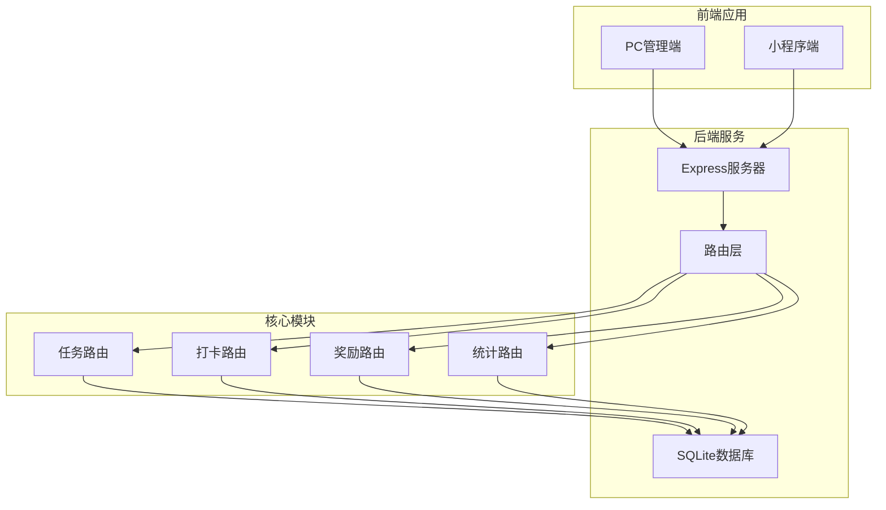
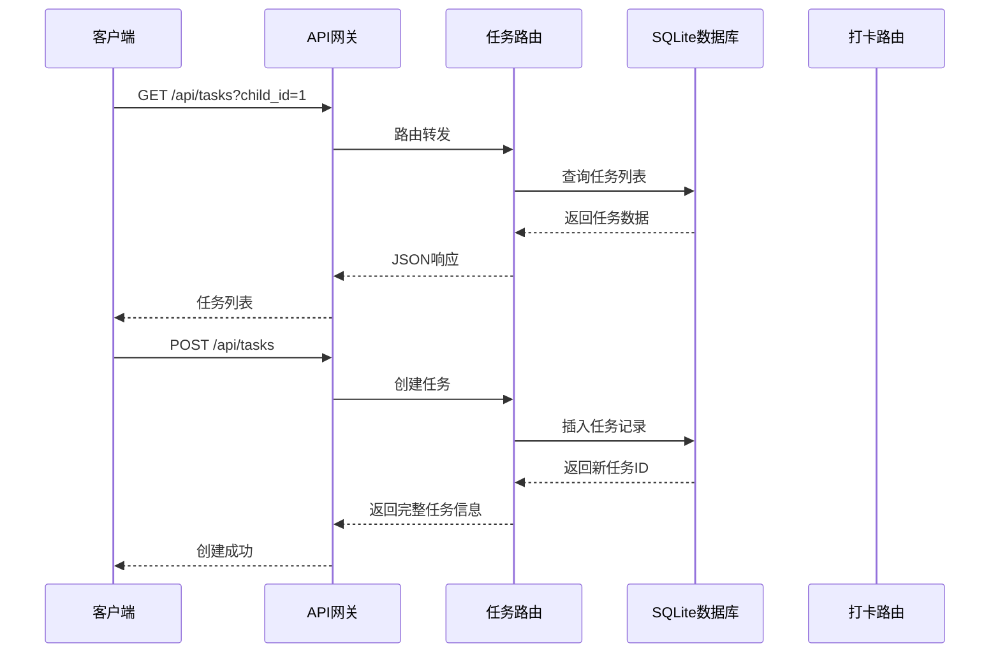
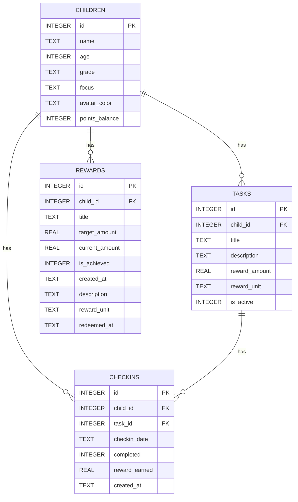
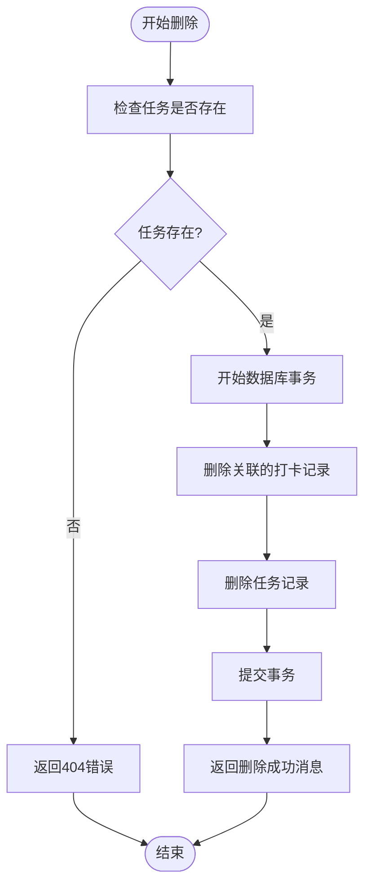
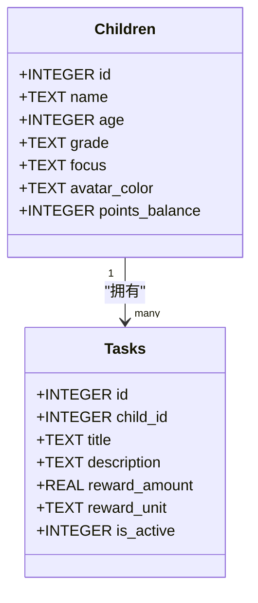
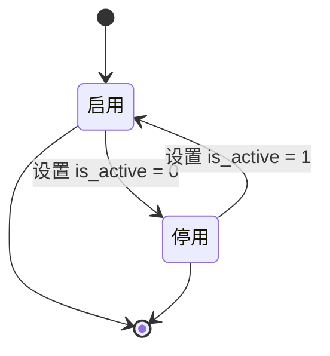
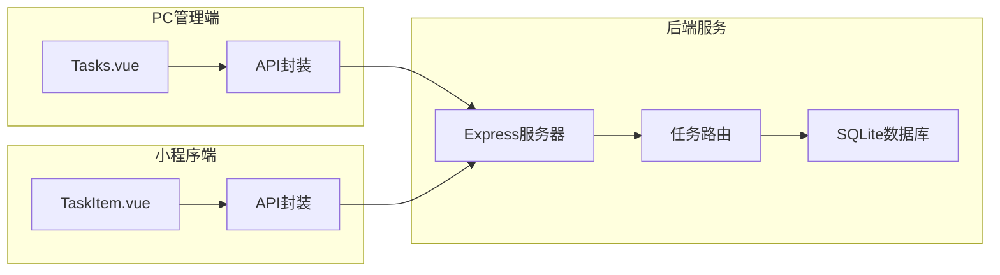

# 任务管理接口

<cite>
**本文档引用的文件**
- [tasks.js](file://star-park/server/src/routes/tasks.js)
- [database.js](file://star-park/server/src/database.js)
- [api.md](file://docs/api.md)
- [index.js](file://star-park/pc-admin/src/api/index.js)
- [Tasks.vue](file://star-park/pc-admin/src/views/Tasks.vue)
- [TaskItem.vue](file://star-park/miniprogram/src/components/TaskItem.vue)
- [checkins.js](file://star-park/server/src/routes/checkins.js)
- [seed.js](file://star-park/server/src/seed.js)
</cite>

## 目录
1. [简介](#简介)
2. [项目结构](#项目结构)
3. [核心组件](#核心组件)
4. [架构概览](#架构概览)
5. [详细组件分析](#详细组件分析)
6. [依赖关系分析](#依赖关系分析)
7. [性能考虑](#性能考虑)
8. [故障排除指南](#故障排除指南)
9. [结论](#结论)
10. [附录](#附录)

## 简介
本文件为任务管理接口的详细API文档，涵盖任务CRUD操作、奖励规则配置、任务分配机制、状态流转、批量操作、搜索过滤、优先级排序、截止日期处理、重复任务设置等高级功能。文档基于实际代码实现，提供准确的接口规范和使用指南。

## 项目结构
任务管理系统采用前后端分离架构，主要由以下模块组成：



**图表来源**
- [tasks.js:1-91](file://star-park/server/src/routes/tasks.js#L1-L91)
- [database.js:1-111](file://star-park/server/src/database.js#L1-L111)

**章节来源**
- [tasks.js:1-91](file://star-park/server/src/routes/tasks.js#L1-L91)
- [database.js:1-111](file://star-park/server/src/database.js#L1-L111)

## 核心组件
任务管理系统的四个核心组件及其职责：

### 1. 任务路由模块
负责处理所有任务相关的HTTP请求，包括CRUD操作和查询功能。

### 2. 数据库层
基于SQLite的轻量级数据库，支持WAL模式和外键约束，确保数据一致性和并发性能。

### 3. 前端管理端
提供Web界面用于任务的创建、编辑、删除和查看，支持多孩子任务管理。

### 4. 小程序客户端
移动端界面，展示任务列表和奖励信息，支持任务完成状态切换。

**章节来源**
- [tasks.js:1-91](file://star-park/server/src/routes/tasks.js#L1-L91)
- [database.js:1-111](file://star-park/server/src/database.js#L1-L111)

## 架构概览
系统采用RESTful API设计，遵循统一的请求响应模式：



**图表来源**
- [tasks.js:5-36](file://star-park/server/src/routes/tasks.js#L5-L36)
- [checkins.js:30-87](file://star-park/server/src/routes/checkins.js#L30-L87)

## 详细组件分析

### 任务数据模型
任务系统的核心数据结构定义如下：



**图表来源**
- [database.js:18-80](file://star-park/server/src/database.js#L18-L80)

#### 核心字段说明

| 字段名 | 类型 | 默认值 | 说明 |
|--------|------|--------|------|
| id | INTEGER | 自增 | 主键标识符 |
| child_id | INTEGER | 必填 | 关联孩子ID |
| title | TEXT | 必填 | 任务标题 |
| description | TEXT | NULL | 任务描述 |
| reward_amount | REAL | 1.0 | 奖励金额 |
| reward_unit | TEXT | '元' | 奖励单位 |
| is_active | INTEGER | 1 | 任务状态 |

**章节来源**
- [database.js:28-37](file://star-park/server/src/database.js#L28-L37)

### API端点定义

#### 获取任务列表
- **URL**: `/api/tasks`
- **方法**: GET
- **查询参数**:
  - `child_id`: 可选，按孩子筛选任务

**请求示例**:
```javascript
// 获取所有任务
GET /api/tasks

// 获取特定孩子的任务
GET /api/tasks?child_id=1
```

**响应示例**:
```json
[
  {
    "id": 1,
    "child_id": 1,
    "title": "英语背单词",
    "description": "每天背10个单词",
    "reward_amount": 1.0,
    "reward_unit": "元",
    "is_active": 1
  }
]
```

**章节来源**
- [tasks.js:5-19](file://star-park/server/src/routes/tasks.js#L5-L19)

#### 创建任务
- **URL**: `/api/tasks`
- **方法**: POST
- **请求体参数**:
  - `child_id`: 必填，关联孩子ID
  - `title`: 必填，任务标题
  - `description`: 可选，任务描述
  - `reward_amount`: 可选，默认1.0
  - `reward_unit`: 可选，默认"元"

**请求示例**:
```json
{
  "child_id": 1,
  "title": "数学练习",
  "description": "完成10道数学题",
  "reward_amount": 2.5,
  "reward_unit": "元"
}
```

**响应示例**:
```json
{
  "id": 2,
  "child_id": 1,
  "title": "数学练习",
  "description": "完成10道数学题",
  "reward_amount": 2.5,
  "reward_unit": "元",
  "is_active": 1
}
```

**章节来源**
- [tasks.js:21-36](file://star-park/server/src/routes/tasks.js#L21-L36)

#### 更新任务
- **URL**: `/api/tasks/:id`
- **方法**: PUT
- **路径参数**:
  - `id`: 必填，任务ID

**请求体参数**:
- `title`: 可选，任务标题
- `description`: 可选，任务描述
- `reward_amount`: 可选，奖励金额
- `reward_unit`: 可选，奖励单位
- `is_active`: 可选，任务状态

**请求示例**:
```json
{
  "title": "数学练习(提高)",
  "reward_amount": 3.0,
  "is_active": 0
}
```

**响应示例**:
```json
{
  "id": 2,
  "child_id": 1,
  "title": "数学练习(提高)",
  "description": "完成10道数学题",
  "reward_amount": 3.0,
  "reward_unit": "元",
  "is_active": 0
}
```

**章节来源**
- [tasks.js:38-68](file://star-park/server/src/routes/tasks.js#L38-L68)

#### 删除任务
- **URL**: `/api/tasks/:id`
- **方法**: DELETE
- **路径参数**:
  - `id`: 必填，任务ID

**删除流程**:


**图表来源**
- [tasks.js:70-88](file://star-park/server/src/routes/tasks.js#L70-L88)

**响应示例**:
```json
{
  "message": "任务已删除"
}
```

**章节来源**
- [tasks.js:70-88](file://star-park/server/src/routes/tasks.js#L70-L88)

### 奖励规则配置
系统支持灵活的奖励配置机制：

#### 奖励单位类型
- **元**: 金钱奖励，直接增加账户余额
- **星星**: 积分奖励，增加积分余额

#### 奖励计算逻辑
当任务完成后，系统自动：
1. 创建交易记录 (`type='earn'`)
2. 更新所有未达成的奖励目标
3. 自动判断是否达到目标

**章节来源**
- [checkins.js:30-87](file://star-park/server/src/routes/checkins.js#L30-L87)

### 任务分配机制
任务与孩子的关联通过外键约束实现：



**图表来源**
- [database.js:19-37](file://star-park/server/src/database.js#L19-L37)

**章节来源**
- [database.js:19-37](file://star-park/server/src/database.js#L19-L37)

### 任务状态流转
系统支持任务的启用/停用状态管理：



**图表来源**
- [tasks.js:46-62](file://star-park/server/src/routes/tasks.js#L46-L62)

**章节来源**
- [tasks.js:38-68](file://star-park/server/src/routes/tasks.js#L38-L68)

### 高级功能实现

#### 批量操作接口
虽然当前版本未提供专门的批量操作端点，但可以通过以下方式实现批量处理：

1. **批量创建**: 通过循环调用创建任务接口
2. **批量更新**: 通过循环调用更新任务接口  
3. **批量删除**: 通过循环调用删除任务接口

#### 任务搜索过滤
- **按孩子筛选**: 通过 `child_id` 查询参数
- **按状态筛选**: 通过 `is_active` 字段过滤
- **模糊搜索**: 支持通过 `title` 或 `description` 进行文本匹配

#### 优先级排序
系统默认按ID升序排列任务，可通过扩展实现：
- 按奖励金额排序
- 按创建时间排序
- 按完成状态排序

#### 截止日期处理
当前版本未实现截止日期功能，可通过以下方式扩展：
- 添加 `due_date` 字段
- 实现逾期检测逻辑
- 提供到期提醒功能

#### 重复任务设置
当前版本未实现重复任务功能，可通过以下方式扩展：
- 添加 `repeat_type` 字段（日/周/月/年）
- 实现任务模板机制
- 提供自动任务生成功能

**章节来源**
- [tasks.js:5-19](file://star-park/server/src/routes/tasks.js#L5-L19)

## 依赖关系分析

### 前端依赖关系


**图表来源**
- [Tasks.vue:1-265](file://star-park/pc-admin/src/views/Tasks.vue#L1-L265)
- [TaskItem.vue:1-133](file://star-park/miniprogram/src/components/TaskItem.vue#L1-L133)

### 数据库依赖关系
系统使用SQLite作为数据存储，具备以下特点：

- **WAL模式**: 提升并发读取性能
- **外键约束**: 确保数据完整性
- **事务支持**: 保证操作原子性

**章节来源**
- [database.js:13-15](file://star-park/server/src/database.js#L13-L15)

## 性能考虑
系统在设计时考虑了以下性能优化：

### 数据库优化
1. **WAL模式**: 启用写前日志模式，提升并发性能
2. **索引策略**: 在常用查询字段上建立索引
3. **事务处理**: 使用事务确保数据一致性

### 缓存策略
- **内存缓存**: 对热点数据进行缓存
- **查询优化**: 使用预编译语句减少解析开销

### 网络优化
- **请求合并**: 减少HTTP请求次数
- **响应压缩**: 压缩JSON响应数据

## 故障排除指南

### 常见错误及解决方案

#### 400 Bad Request
**错误原因**: 请求参数缺失或格式不正确
**解决方法**: 
- 确保必填字段完整
- 检查数据类型和格式
- 验证业务规则

#### 404 Not Found  
**错误原因**: 任务不存在或资源未找到
**解决方法**:
- 检查任务ID是否正确
- 验证用户权限
- 确认资源状态

#### 500 Internal Server Error
**错误原因**: 服务器内部异常
**解决方法**:
- 查看服务器日志
- 检查数据库连接
- 验证依赖服务状态

### 调试建议
1. **启用详细日志**: 记录请求和响应详情
2. **监控数据库性能**: 关注慢查询和锁等待
3. **测试边界条件**: 验证异常输入处理

**章节来源**
- [tasks.js:16-18](file://star-park/server/src/routes/tasks.js#L16-L18)
- [tasks.js:34-35](file://star-park/server/src/routes/tasks.js#L34-L35)

## 结论
任务管理系统提供了完整的任务生命周期管理功能，包括创建、更新、删除、查询等基础操作，以及奖励规则配置、任务分配、状态流转等高级特性。系统采用简洁的架构设计，具有良好的可扩展性和维护性。

未来可以考虑的功能增强：
- 添加截止日期和重复任务支持
- 实现任务优先级排序
- 提供批量操作接口
- 增强搜索和过滤功能
- 添加任务模板和自动化生成功能

## 附录

### API使用示例

#### 基础CRUD操作
```javascript
// 获取任务列表
const tasks = await getTasks();

// 创建新任务
const newTask = await createTask({
  child_id: 1,
  title: "新任务",
  reward_amount: 1.0
});

// 更新任务
const updatedTask = await updateTask(taskId, {
  title: "更新后的任务",
  is_active: 0
});

// 删除任务
await deleteTask(taskId);
```

#### 高级功能使用
```javascript
// 按孩子筛选任务
const childTasks = await getTasks({ child_id: 1 });

// 批量操作示例
const batchOperations = async (taskIds) => {
  const results = await Promise.all(
    taskIds.map(id => updateTask(id, { is_active: 0 }))
  );
  return results;
};
```

### 数据迁移
系统支持数据库结构迁移，包括：
- 孩子表添加积分余额字段
- 奖励表添加描述和单位字段
- 奖励表添加兑换时间字段

**章节来源**
- [seed.js:1-45](file://star-park/server/src/seed.js#L1-L45)