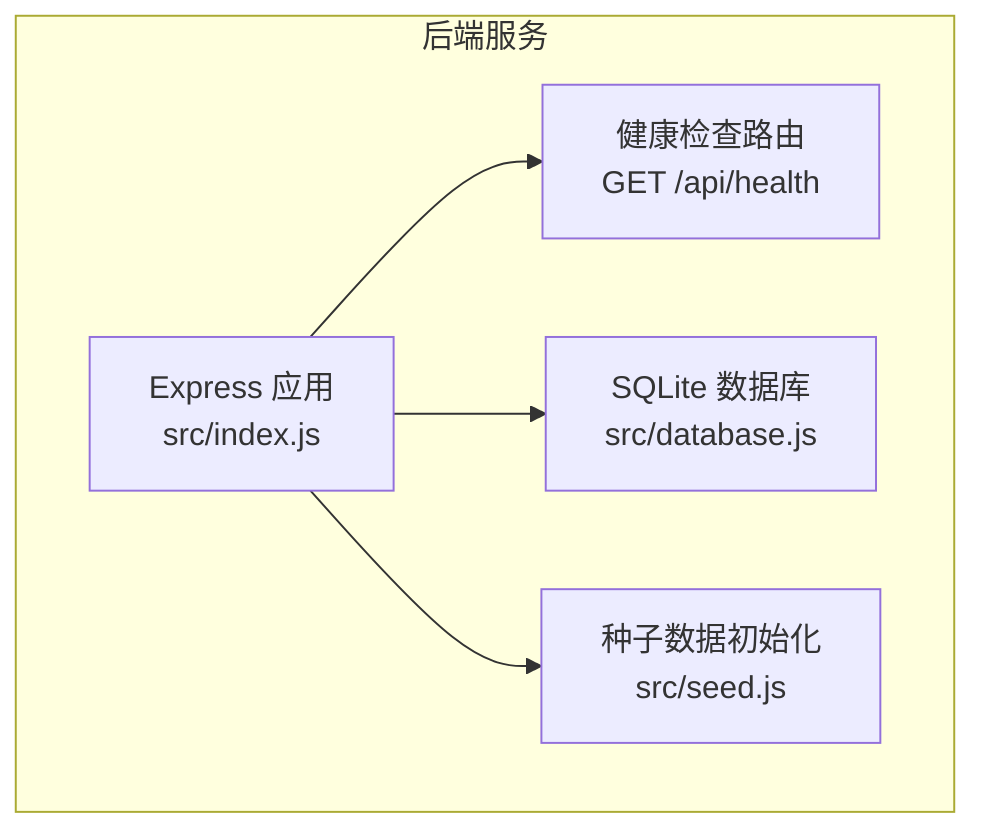
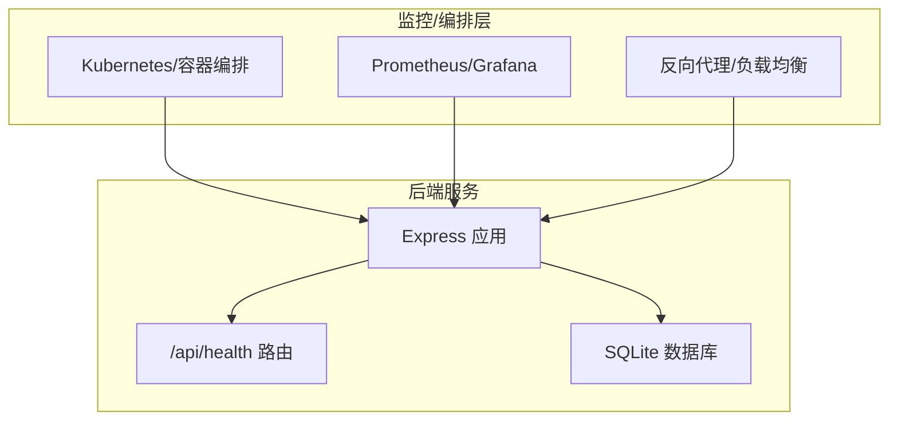
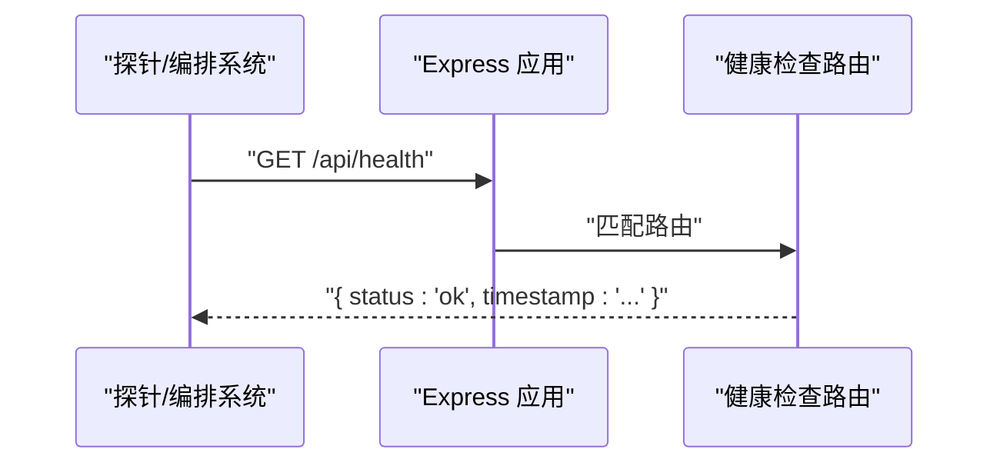
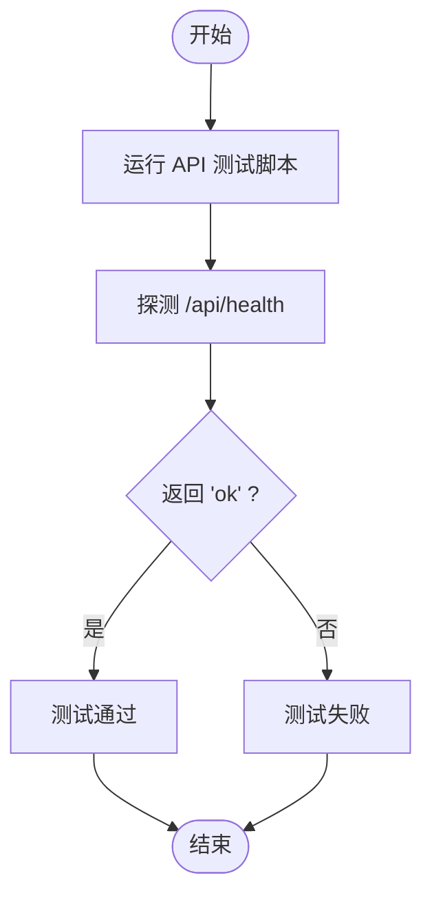
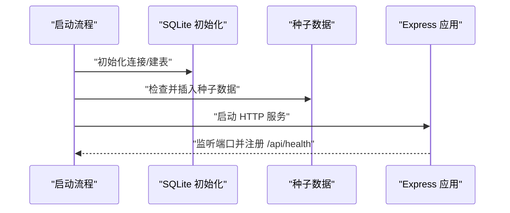
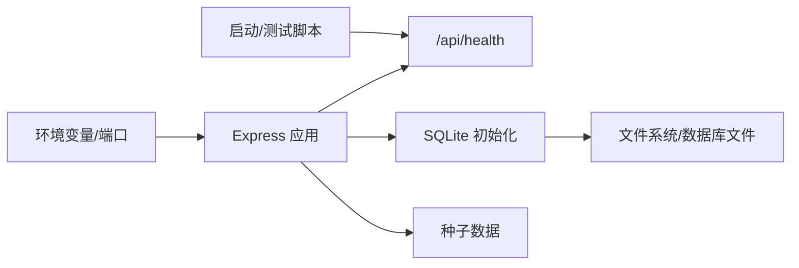

# 健康检查接口

<cite>
**本文引用的文件**
- [index.js](file://star-park/server/src/index.js)
- [api.md](file://docs/api.md)
- [OPERATIONS.md](file://docs/OPERATIONS.md)
- [run-api-tests.sh](file://scripts/run-api-tests.sh)
- [start-server.sh](file://harness/scripts/start-server.sh)
- [environment.json](file://harness/config/environment.json)
- [ARCHITECTURE.md](file://docs/ARCHITECTURE.md)
- [database.js](file://star-park/server/src/database.js)
- [seed.js](file://star-park/server/src/seed.js)
- [package.json](file://star-park/server/package.json)
</cite>

## 目录
1. [简介](#简介)
2. [项目结构](#项目结构)
3. [核心组件](#核心组件)
4. [架构总览](#架构总览)
5. [详细组件分析](#详细组件分析)
6. [依赖关系分析](#依赖关系分析)
7. [性能考量](#性能考量)
8. [故障排查指南](#故障排查指南)
9. [结论](#结论)
10. [附录](#附录)

## 简介
本文件为 StarParadise 项目的健康检查接口提供完整、可操作的 API 文档。重点覆盖 /api/health 端点的实现原理、响应格式、监控用途，并结合系统运维场景解释其在服务可用性检测、数据库连接状态检查、依赖服务状态监控中的作用。同时提供 curl 示例、响应示例、常见失败原因与解决方案，以及容器化部署中的健康检查配置最佳实践。

## 项目结构
后端服务采用 Express + SQLite 的单体架构，健康检查端点直接挂载在服务根路由下，便于容器编排与平台监控系统进行探测。

图表来源
- [index.js:29-32](file://star-park/server/src/index.js#L29-L32)
- [database.js:10](file://star-park/server/src/database.js#L10)
- [seed.js:3](file://star-park/server/src/seed.js#L3)

章节来源
- [index.js:1-42](file://star-park/server/src/index.js#L1-L42)
- [ARCHITECTURE.md:14-69](file://docs/ARCHITECTURE.md#L14-L69)

## 核心组件
- 健康检查端点：提供轻量级的存活探针，返回服务基本状态与时间戳，便于自动化系统快速判断服务是否处于可接受的“就绪”状态。
- 数据库连接：服务启动时即初始化 SQLite 连接；健康检查不执行额外查询，但间接验证了数据库初始化与文件系统可读写能力。
- 种子数据：服务启动时自动检查并初始化基础数据，确保后续业务接口可用。

章节来源
- [index.js:29-32](file://star-park/server/src/index.js#L29-L32)
- [database.js:10](file://star-park/server/src/database.js#L10)
- [seed.js:3](file://star-park/server/src/seed.js#L3)

## 架构总览
健康检查在系统架构中的位置如下：

图表来源
- [index.js:29-32](file://star-park/server/src/index.js#L29-L32)
- [database.js:10](file://star-park/server/src/database.js#L10)

## 详细组件分析

### 健康检查端点定义与实现
- 路径：/api/health
- 方法：GET
- 功能：返回服务存活状态与当前时间戳，作为轻量级健康探针。
- 响应：包含状态字段与 ISO 8601 时间戳，便于下游系统记录与比对。

图表来源
- [index.js:29-32](file://star-park/server/src/index.js#L29-L32)

章节来源
- [index.js:29-32](file://star-park/server/src/index.js#L29-L32)
- [api.md:18-31](file://docs/api.md#L18-L31)

### 响应格式与示例
- 响应字段
  - status: 字符串，表示服务状态，当前固定为 "ok"
  - timestamp: ISO 8601 字符串，表示服务端当前时间
- 响应示例
  - 成功示例：{"status":"ok","timestamp":"2026-05-25T12:00:00.000Z"}

章节来源
- [api.md:24-31](file://docs/api.md#L24-L31)

### 在系统运维中的作用
- 服务可用性检测：通过定时探测 /api/health 判断服务进程是否存活与可响应。
- 数据库连接状态检查：服务启动时初始化 SQLite 连接；健康检查间接反映数据库初始化与文件系统状态。
- 依赖服务状态监控：在多容器编排中，可将 /api/health 作为“就绪探针”，确保上游依赖（如数据库卷挂载、网络策略）满足后再对外提供服务。

章节来源
- [index.js:35-41](file://star-park/server/src/index.js#L35-L41)
- [database.js:10](file://star-park/server/src/database.js#L10)

### curl 命令与响应示例
- 命令示例
  - curl http://localhost:3001/api/health
- 预期响应
  - {"status":"ok","timestamp":"..."}
- 失败示例
  - 若服务未启动或端口不可达，curl 将返回连接错误或超时

章节来源
- [OPERATIONS.md:67-70](file://docs/OPERATIONS.md#L67-L70)
- [api.md:24-31](file://docs/api.md#L24-L31)

### 健康检查在自动化测试与启动流程中的应用
- API 测试脚本通过 /api/health 验证服务是否启动并返回 "ok"。
- 启动脚本在启动后循环探测 /api/health，直到服务就绪或超时。

图表来源
- [run-api-tests.sh:13-17](file://scripts/run-api-tests.sh#L13-L17)
- [start-server.sh:18-25](file://harness/scripts/start-server.sh#L18-L25)

章节来源
- [run-api-tests.sh:13-17](file://scripts/run-api-tests.sh#L13-L17)
- [start-server.sh:18-25](file://harness/scripts/start-server.sh#L18-L25)

### 健康检查与数据库初始化的关系
- 服务启动时初始化 SQLite 连接并创建必要表结构。
- 种子数据在首次启动时按需插入，保证业务接口可用。
- 健康检查本身不查询业务数据，但服务可用性与数据库初始化状态密切相关。

图表来源
- [database.js:10](file://star-park/server/src/database.js#L10)
- [seed.js:3](file://star-park/server/src/seed.js#L3)
- [index.js:35-41](file://star-park/server/src/index.js#L35-L41)

章节来源
- [database.js:10](file://star-park/server/src/database.js#L10)
- [seed.js:3](file://star-park/server/src/seed.js#L3)
- [index.js:35-41](file://star-park/server/src/index.js#L35-L41)

## 依赖关系分析
- 健康检查端点依赖于 Express 应用已启动且路由已注册。
- 数据库初始化与文件系统权限影响服务能否成功启动，从而影响健康检查结果。
- 启动脚本与测试脚本均依赖 /api/health 作为就绪判定依据。

图表来源
- [index.js:14](file://star-park/server/src/index.js#L14)
- [index.js:29-32](file://star-park/server/src/index.js#L29-L32)
- [database.js:10](file://star-park/server/src/database.js#L10)
- [seed.js:3](file://star-park/server/src/seed.js#L3)
- [start-server.sh:8-14](file://harness/scripts/start-server.sh#L8-L14)
- [run-api-tests.sh:13-17](file://scripts/run-api-tests.sh#L13-L17)

章节来源
- [index.js:14](file://star-park/server/src/index.js#L14)
- [index.js:29-32](file://star-park/server/src/index.js#L29-L32)
- [database.js:10](file://star-park/server/src/database.js#L10)
- [seed.js:3](file://star-park/server/src/seed.js#L3)
- [start-server.sh:8-14](file://harness/scripts/start-server.sh#L8-L14)
- [run-api-tests.sh:13-17](file://scripts/run-api-tests.sh#L13-L17)

## 性能考量
- 健康检查为纯内存响应，不涉及数据库查询，开销极低，适合高频探测。
- 在高并发编排环境中，建议将探针间隔设置为秒级，避免过度频繁导致不必要的负载。
- 若未来扩展为“就绪探针”，可在健康检查基础上增加数据库连通性校验，但需权衡探测频率与性能。

## 故障排查指南
- 无法访问 /api/health
  - 检查服务是否启动、端口是否正确、防火墙/安全组是否放行。
  - 参考启动脚本中的就绪探测逻辑，确认服务在预期时间内完成启动。
- 响应中 status 非 "ok"
  - 当前实现固定返回 "ok"；若出现异常，优先检查服务日志与端口占用。
- 数据库相关问题
  - 确认数据库文件存在且可读写；必要时备份/恢复数据库文件。
  - 如需重建初始数据，可删除数据库文件后重启服务，触发种子数据初始化。
- 容器化部署
  - 确保容器内端口映射正确、卷挂载包含数据库文件。
  - 在编排平台配置存活探针与就绪探针，分别用于进程级健康与服务级可用性。

章节来源
- [OPERATIONS.md:65-102](file://docs/OPERATIONS.md#L65-L102)
- [run-api-tests.sh:13-17](file://scripts/run-api-tests.sh#L13-L17)
- [start-server.sh:18-25](file://harness/scripts/start-server.sh#L18-L25)
- [environment.json:27-36](file://harness/config/environment.json#L27-L36)

## 结论
/api/health 作为轻量级健康检查端点，为 StarParadise 后端服务提供了简单可靠的存活与就绪探针。结合自动化测试与启动脚本，它在本地开发、CI/CD 与生产部署中均发挥关键作用。建议在容器化与云原生环境中将其配置为存活探针与就绪探针的基础能力，并根据实际需求逐步增强为更全面的健康状态评估。

## 附录

### curl 命令与响应示例
- 命令
  - curl http://localhost:3001/api/health
- 成功响应示例
  - {"status":"ok","timestamp":"2026-05-25T12:00:00.000Z"}

章节来源
- [OPERATIONS.md:67-70](file://docs/OPERATIONS.md#L67-L70)
- [api.md:24-31](file://docs/api.md#L24-L31)

### 健康检查在容器化部署中的最佳实践
- 存活探针（livenessProbe）
  - 使用 HTTP GET /api/health，成功阈值设为 1，失败阈值 3，探测间隔 10s。
- 就绪探针（readinessProbe）
  - 使用 HTTP GET /api/health，成功阈值 1，失败阈值 3，探测间隔 5s。
- 启动延迟
  - 设置 initialDelaySeconds，允许服务完成数据库初始化与种子数据加载。
- 编排平台配置参考
  - Kubernetes Deployment/Service/Ingress 配置中加入上述探针参数。
  - 反向代理（如 Nginx）需透传 /api/health 请求至后端服务。

章节来源
- [start-server.sh:18-25](file://harness/scripts/start-server.sh#L18-L25)
- [environment.json:27-36](file://harness/config/environment.json#L27-L36)