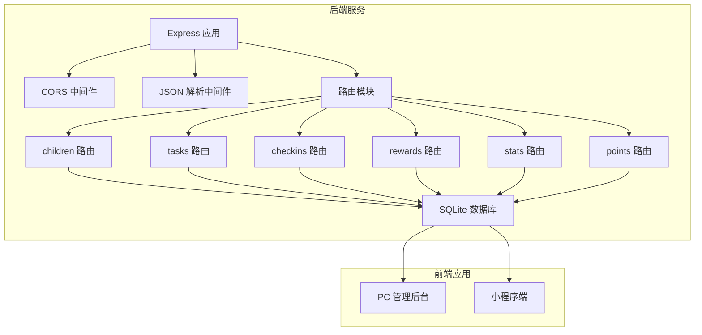
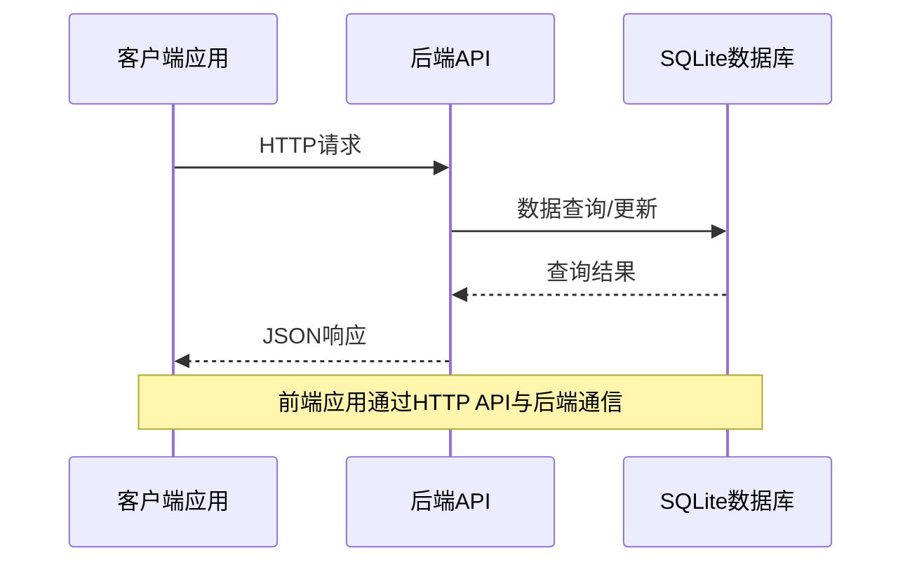
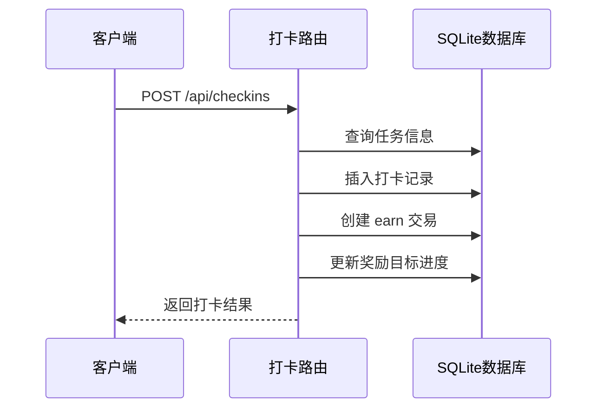
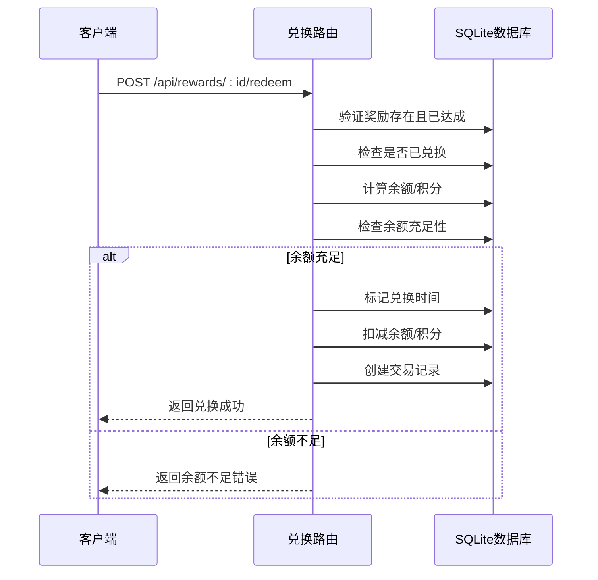
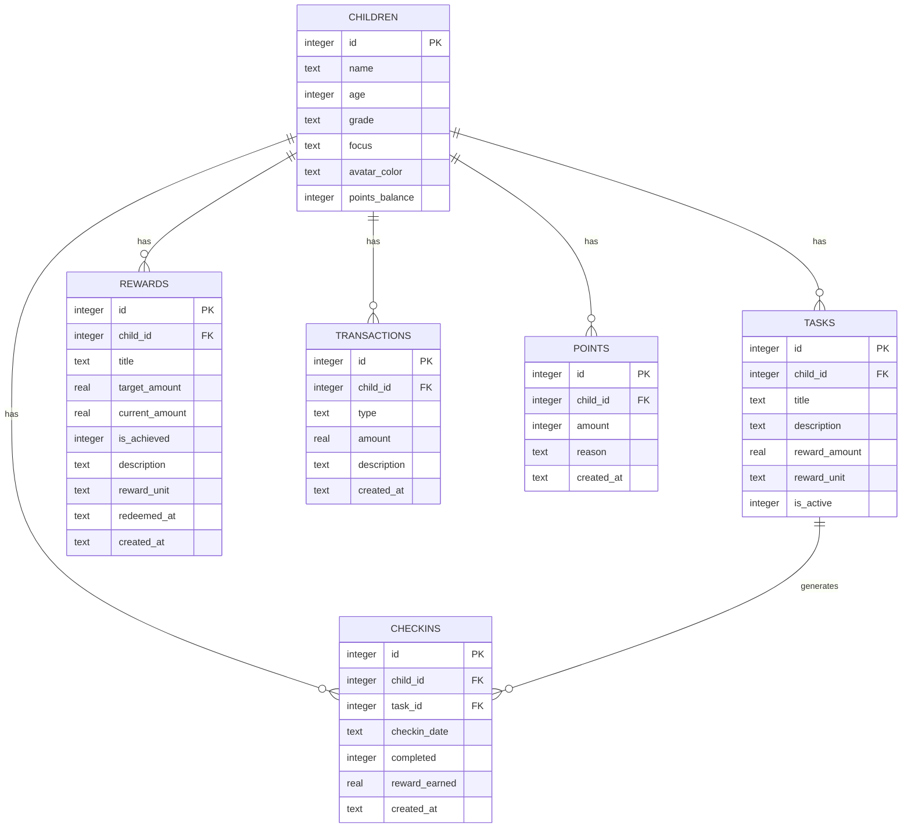
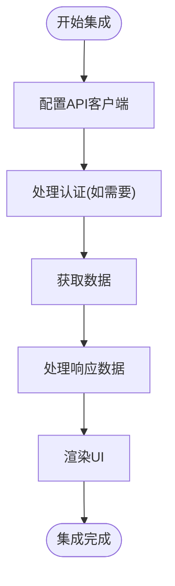

# 后端API接口文档

<cite>
**本文档引用的文件**
- [index.js](file://star-park/server/src/index.js)
- [children.js](file://star-park/server/src/routes/children.js)
- [tasks.js](file://star-park/server/src/routes/tasks.js)
- [checkins.js](file://star-park/server/src/routes/checkins.js)
- [rewards.js](file://star-park/server/src/routes/rewards.js)
- [stats.js](file://star-park/server/src/routes/stats.js)
- [points.js](file://star-park/server/src/routes/points.js)
- [database.js](file://star-park/server/src/database.js)
- [seed.js](file://star-park/server/src/seed.js)
- [api.md](file://docs/api.md)
- [server.md](file://docs/design-docs/server.md)
- [ARCHITECTURE.md](file://docs/ARCHITECTURE.md)
</cite>

## 更新摘要
**变更内容**
- 新增奖励兑换功能端点 POST /api/rewards/:id/redeem
- 完善奖励管理的CRUD操作，支持description、reward_unit字段
- 添加完整的错误处理机制，包括余额不足、重复兑换等场景
- 增强数据库迁移逻辑，支持rewards表结构演进
- 完善前后端API客户端集成

## 目录
1. [简介](#简介)
2. [项目结构](#项目结构)
3. [核心组件](#核心组件)
4. [架构概览](#架构概览)
5. [详细接口规范](#详细接口规范)
6. [数据模型](#数据模型)
7. [认证与授权](#认证与授权)
8. [错误处理](#错误处理)
9. [性能优化](#性能优化)
10. [限流策略](#限流策略)
11. [调试指南](#调试指南)
12. [客户端集成](#客户端集成)
13. [结论](#结论)

## 简介

StarParadise（星星乐园）是一个家庭激励管理系统，提供RESTful API服务来管理孩子、任务、打卡、奖励和积分系统。该系统采用Express.js + SQLite架构，专为家庭环境设计，无需复杂的外部依赖。

## 项目结构

后端服务采用模块化设计，主要包含以下组件：



**图表来源**
- [index.js:1-27](file://star-park/server/src/index.js#L1-L27)
- [server.md:14-31](file://docs/design-docs/server.md#L14-L31)

**章节来源**
- [index.js:1-42](file://star-park/server/src/index.js#L1-L42)
- [ARCHITECTURE.md:14-69](file://docs/ARCHITECTURE.md#L14-L69)

## 核心组件

### 服务配置

后端服务使用Express.js框架，提供以下核心功能：
- **健康检查**：`/api/health` - 检查服务运行状态
- **CORS 支持**：允许跨域请求
- **JSON 解析**：自动解析请求体
- **路由分发**：按功能模块组织API端点

### 数据存储

系统使用better-sqlite3嵌入式数据库，无需外部数据库服务：
- **WAL 模式**：提升并发性能
- **外键约束**：确保数据完整性
- **自动迁移**：支持数据库结构演进

**章节来源**
- [index.js:13-27](file://star-park/server/src/index.js#L13-L27)
- [database.js:13-15](file://star-park/server/src/database.js#L13-L15)

## 架构概览

系统采用前后端分离的monorepo架构，后端提供RESTful API，前端通过HTTP协议进行通信：



**图表来源**
- [ARCHITECTURE.md:137-141](file://docs/ARCHITECTURE.md#L137-L141)

**章节来源**
- [ARCHITECTURE.md:10-83](file://docs/ARCHITECTURE.md#L10-L83)

## 详细接口规范

### 健康检查接口

**基础信息**
- **路径**：`/api/health`
- **方法**：GET
- **用途**：检查服务是否正常运行

**响应格式**
```json
{
  "status": "ok",
  "timestamp": "2026-05-25T12:00:00.000Z"
}
```

**使用场景**
- 服务启动后的自检
- 监控系统健康状态
- CI/CD部署验证

**章节来源**
- [index.js:29-32](file://star-park/server/src/index.js#L29-L32)
- [api.md:18-31](file://docs/api.md#L18-L31)

### 孩子管理接口

#### 获取孩子列表

**基础信息**
- **路径**：`/api/children`
- **方法**：GET
- **用途**：获取所有孩子及其任务和余额信息

**响应结构**
```json
[
  {
    "id": 1,
    "name": "老二",
    "age": 13,
    "grade": "初一",
    "focus": "各学科提分",
    "avatar_color": "#FF6B6B",
    "balance": "¥3",
    "points_balance": 0,
    "tasks": [
      {
        "id": 1,
        "name": "英语背单词",
        "desc": "每天背10个单词",
        "reward": "1元",
        "standard": "每天背10个单词"
      }
    ]
  }
]
```

**使用场景**
- 家长查看所有孩子的整体情况
- 系统初始化时的数据展示

**章节来源**
- [children.js:5-37](file://star-park/server/src/routes/children.js#L5-L37)
- [api.md:33-57](file://docs/api.md#L33-L57)

#### 添加孩子

**基础信息**
- **路径**：`/api/children`
- **方法**：POST
- **用途**：创建新的孩子记录

**请求参数**
| 参数名 | 类型 | 必填 | 说明 | 默认值 |
|--------|------|------|------|--------|
| name | string | 是 | 孩子姓名 | - |
| age | number | 否 | 年龄 | null |
| grade | string | 否 | 年级 | null |
| focus | string | 否 | 专注方向 | null |
| avatar_color | string | 否 | 头像颜色 | #19C8B9 |

**响应格式**
```json
{
  "id": 1,
  "name": "老二",
  "age": 13,
  "grade": "初一",
  "focus": "各学科提分",
  "avatar_color": "#FF6B6B"
}
```

**使用场景**
- 家长新增家庭成员
- 系统批量导入

**章节来源**
- [children.js:39-54](file://star-park/server/src/routes/children.js#L39-L54)
- [api.md:59-73](file://docs/api.md#L59-L73)

#### 获取积分余额

**基础信息**
- **路径**：`/api/children/:id/balance`
- **方法**：GET
- **用途**：获取指定孩子的积分余额

**响应格式**
```json
0
```

**使用场景**
- 实时显示孩子积分余额
- 积分消费前的余额验证

**章节来源**
- [children.js:56-68](file://star-park/server/src/routes/children.js#L56-L68)

#### 获取交易记录

**基础信息**
- **路径**：`/api/children/:id/transactions`
- **方法**：GET
- **用途**：获取指定孩子的积分交易记录

**响应格式**
```json
[
  {
    "id": 1,
    "child_id": 1,
    "amount": 10,
    "description": "完成任务奖励",
    "createdAt": "2026-05-25T10:30:00.000Z",
    "type": "earn"
  }
]
```

**使用场景**
- 查看积分明细
- 财务对账

**章节来源**
- [children.js:70-85](file://star-park/server/src/routes/children.js#L70-85)

### 任务管理接口

#### 获取任务列表

**基础信息**
- **路径**：`/api/tasks`
- **方法**：GET
- **用途**：获取任务列表，支持按孩子筛选

**查询参数**
| 参数名 | 类型 | 必填 | 说明 |
|--------|------|------|------|
| child_id | number | 否 | 按孩子ID筛选 |

**响应格式**
```json
[
  {
    "id": 1,
    "child_id": 1,
    "title": "英语背单词",
    "description": "每天背10个单词",
    "reward_amount": 1.0,
    "reward_unit": "元",
    "is_active": 1
  }
]
```

**使用场景**
- 家长查看所有任务
- 按孩子筛选特定任务

**章节来源**
- [tasks.js:5-19](file://star-park/server/src/routes/tasks.js#L5-L19)
- [api.md:84-94](file://docs/api.md#L84-L94)

#### 创建任务

**基础信息**
- **路径**：`/api/tasks`
- **方法**：POST
- **用途**：创建新任务

**请求参数**
| 参数名 | 类型 | 必填 | 说明 | 默认值 |
|--------|------|------|------|--------|
| child_id | number | 是 | 关联孩子ID | - |
| title | string | 是 | 任务标题 | - |
| description | string | 否 | 任务描述 | null |
| reward_amount | number | 否 | 奖励金额 | 1.0 |
| reward_unit | string | 否 | 奖励单位 | "元" |

**响应格式**
```json
{
  "id": 1,
  "child_id": 1,
  "title": "英语背单词",
  "description": "每天背10个单词",
  "reward_amount": 1.0,
  "reward_unit": "元",
  "is_active": 1
}
```

**使用场景**
- 家长为孩子设置新任务
- 系统批量导入任务

**章节来源**
- [tasks.js:21-36](file://star-park/server/src/routes/tasks.js#L21-L36)
- [api.md:95-109](file://docs/api.md#L95-L109)

#### 更新任务

**基础信息**
- **路径**：`/api/tasks/:id`
- **方法**：PUT
- **用途**：更新现有任务信息

**请求参数**
| 参数名 | 类型 | 必填 | 说明 |
|--------|------|------|------|
| title | string | 否 | 任务标题 |
| description | string | 否 | 任务描述 |
| reward_amount | number | 否 | 奖励金额 |
| reward_unit | string | 否 | 奖励单位 |
| is_active | number | 否 | 是否激活 |

**响应格式**
```json
{
  "id": 1,
  "child_id": 1,
  "title": "英语背单词",
  "description": "每天背10个单词",
  "reward_amount": 1.0,
  "reward_unit": "元",
  "is_active": 1
}
```

**使用场景**
- 修改任务设置
- 暂停或恢复任务

**章节来源**
- [tasks.js:38-68](file://star-park/server/src/routes/tasks.js#L38-L68)

#### 删除任务

**基础信息**
- **路径**：`/api/tasks/:id`
- **方法**：DELETE
- **用途**：删除任务及其相关打卡记录

**响应格式**
```json
{
  "message": "任务已删除"
}
```

**使用场景**
- 清理不再需要的任务
- 系统维护

**章节来源**
- [tasks.js:70-88](file://star-park/server/src/routes/tasks.js#L70-L88)

### 打卡管理接口

#### 获取打卡记录

**基础信息**
- **路径**：`/api/checkins`
- **方法**：GET
- **用途**：获取打卡记录，支持日期和孩子筛选

**查询参数**
| 参数名 | 类型 | 必填 | 说明 |
|--------|------|------|------|
| date | string | 否 | 日期筛选（YYYY-MM-DD） |
| child_id | number | 否 | 按孩子筛选 |

**响应格式**
```json
[
  {
    "id": 1,
    "child_id": 1,
    "task_id": 1,
    "checkin_date": "2026-05-25",
    "completed": 1,
    "reward_earned": 1.0,
    "created_at": "2026-05-25T10:30:00.000Z",
    "task_title": "英语背单词"
  }
]
```

**使用场景**
- 查看历史打卡记录
- 生成打卡报表

**章节来源**
- [checkins.js:6-28](file://star-park/server/src/routes/checkins.js#L6-L28)
- [api.md:120-131](file://docs/api.md#L120-L131)

#### 创建打卡

**基础信息**
- **路径**：`/api/checkins`
- **方法**：POST
- **用途**：创建打卡记录并处理奖励

**请求参数**
| 参数名 | 类型 | 必填 | 说明 | 默认值 |
|--------|------|------|------|--------|
| child_id | number | 是 | 孩子ID | - |
| task_id | number | 是 | 任务ID | - |
| checkin_date | string | 是 | 打卡日期（YYYY-MM-DD） | - |
| completed | number | 否 | 是否完成 | 1 |

**响应格式**
```json
{
  "id": 1,
  "child_id": 1,
  "task_id": 1,
  "checkin_date": "2026-05-25",
  "completed": 1,
  "reward_earned": 1.0,
  "created_at": "2026-05-25T10:30:00.000Z",
  "task_title": "英语背单词"
}
```

**打卡流程**



**图表来源**
- [checkins.js:31-87](file://star-park/server/src/routes/checkins.js#L31-L87)

**使用场景**
- 孩子完成日常任务打卡
- 家长确认完成情况

**章节来源**
- [checkins.js:30-87](file://star-park/server/src/routes/checkins.js#L30-L87)
- [api.md:132-145](file://docs/api.md#L132-L145)

### 奖励管理接口

#### 获取奖励目标

**基础信息**
- **路径**：`/api/rewards`
- **方法**：GET
- **用途**：获取奖励目标，支持按孩子筛选

**查询参数**
| 参数名 | 类型 | 必填 | 说明 |
|--------|------|------|------|
| child_id | number | 否 | 按孩子筛选 |

**响应格式**
```json
[
  {
    "id": 1,
    "child_id": 1,
    "title": "变形金刚玩具",
    "target_amount": 50,
    "current_amount": 0,
    "is_achieved": 0,
    "description": "乐高积木套装",
    "reward_unit": "元",
    "redeemed_at": null,
    "created_at": "2026-05-25T10:30:00.000Z"
  }
]
```

**使用场景**
- 查看所有奖励目标
- 按孩子筛选特定奖励

**章节来源**
- [rewards.js:5-19](file://star-park/server/src/routes/rewards.js#L5-L19)
- [api.md:146-149](file://docs/api.md#L146-L149)

#### 创建奖励目标

**基础信息**
- **路径**：`/api/rewards`
- **方法**：POST
- **用途**：创建新的奖励目标

**请求参数**
| 参数名 | 类型 | 必填 | 说明 | 默认值 |
|--------|------|------|------|--------|
| child_id | number | 是 | 关联孩子ID | - |
| title | string | 是 | 奖励名称 | - |
| target_amount | number | 是 | 目标金额 | - |
| description | string | 否 | 奖励描述 | "" |
| reward_unit | string | 否 | 奖励单位 | "元" |

**响应格式**
```json
{
  "id": 1,
  "child_id": 1,
  "title": "变形金刚玩具",
  "target_amount": 50,
  "current_amount": 0,
  "is_achieved": 0,
  "description": "乐高积木套装",
  "reward_unit": "元",
  "redeemed_at": null
}
```

**使用场景**
- 设置新的奖励目标
- 家长激励计划

**章节来源**
- [rewards.js:21-36](file://star-park/server/src/routes/rewards.js#L21-L36)
- [api.md:151-163](file://docs/api.md#L151-L163)

#### 更新奖励目标

**基础信息**
- **路径**：`/api/rewards/:id`
- **方法**：PUT
- **用途**：更新奖励目标信息

**请求参数**
| 参数名 | 类型 | 必填 | 说明 |
|--------|------|------|------|
| title | string | 否 | 奖励名称 |
| target_amount | number | 否 | 目标金额 |
| current_amount | number | 否 | 当前进度 |
| is_achieved | number | 否 | 是否达成 |
| description | string | 否 | 奖励描述 |
| reward_unit | string | 否 | 奖励单位 |

**响应格式**
```json
{
  "id": 1,
  "child_id": 1,
  "title": "变形金刚玩具",
  "target_amount": 50,
  "current_amount": 0,
  "is_achieved": 0,
  "description": "乐高积木套装",
  "reward_unit": "元",
  "redeemed_at": null
}
```

**使用场景**
- 调整奖励目标
- 手动标记达成

**章节来源**
- [rewards.js:38-66](file://star-park/server/src/routes/rewards.js#L38-L66)

#### 删除奖励目标

**基础信息**
- **路径**：`/api/rewards/:id`
- **方法**：DELETE
- **用途**：删除奖励目标

**响应格式**
```json
{
  "success": true
}
```

**使用场景**
- 清理不再需要的奖励
- 系统维护

**章节来源**
- [rewards.js:68-81](file://star-park/server/src/routes/rewards.js#L68-L81)

#### 兑换奖励目标

**基础信息**
- **路径**：`/api/rewards/:id/redeem`
- **方法**：POST
- **用途**：兑换已达成的奖励目标（家长操作）

**路径参数**
| 参数名 | 类型 | 必填 | 说明 |
|--------|------|------|------|
| id | number | 是 | 奖励目标ID |

**响应格式**
```json
{
  "id": 1,
  "child_id": 1,
  "title": "变形金刚玩具",
  "target_amount": 50,
  "current_amount": 50,
  "is_achieved": 1,
  "description": "乐高积木套装",
  "reward_unit": "元",
  "redeemed_at": "2026-05-25T15:30:00.000Z"
}
```

**兑换流程**



**图表来源**
- [rewards.js:89-164](file://star-park/server/src/routes/rewards.js#L89-L164)

**错误处理**
- **404**: 奖励目标不存在
- **400**: 奖励目标尚未达成，无法兑换
- **400**: 奖励已兑换，不能重复兑换  
- **400**: 余额不足，无法兑换
- **400**: 积分余额不足，无法兑换
- **400**: 不支持的奖励单位

**使用场景**
- 家长确认孩子达成奖励目标后执行兑换
- 扣减相应余额并记录兑换时间

**章节来源**
- [rewards.js:89-164](file://star-park/server/src/routes/rewards.js#L89-L164)

### 统计分析接口

#### 获取统计数据

**基础信息**
- **路径**：`/api/stats/:childId`
- **方法**：GET
- **用途**：获取指定孩子的综合统计数据

**路径参数**
| 参数名 | 类型 | 必填 | 说明 |
|--------|------|------|------|
| childId | number | 是 | 孩子ID |

**响应格式**
```json
{
  "child_id": 1,
  "streak": 5,
  "weekly_rate": 75,
  "weekly_checkins": 15,
  "weekly_expected": 20,
  "active_tasks": 4,
  "balance": 3.0,
  "daily_data": [
    {
      "date": "2026-05-25",
      "count": 2
    }
  ]
}
```

**统计指标说明**
- **streak**：连续打卡天数
- **weekly_rate**：本周完成率（百分比）
- **balance**：余额（总收入 - 总支出）
- **daily_data**：最近30天每日完成情况

**使用场景**
- 家长查看孩子表现
- 教育效果评估

**章节来源**
- [stats.js:6-101](file://star-park/server/src/routes/stats.js#L6-L101)
- [api.md:169-184](file://docs/api.md#L169-L184)

#### 获取仪表盘数据

**基础信息**
- **路径**：`/api/dashboard`
- **方法**：GET
- **用途**：获取所有孩子的仪表盘数据

**响应格式**
```json
[
  {
    "id": 1,
    "name": "老二",
    "today_checkins": [],
    "active_tasks": [],
    "streak": 5,
    "weekly_rate": 75,
    "balance": 3.0,
    "points_balance": 0,
    "rewards": []
  }
]
```

**使用场景**
- 管理后台首页展示
- 家长快速概览

**章节来源**
- [stats.js:103-179](file://star-park/server/src/routes/stats.js#L103-L179)
- [api.md:186-189](file://docs/api.md#L186-L189)

### 积分系统接口

#### 获取积分记录

**基础信息**
- **路径**：`/api/points`
- **方法**：GET
- **用途**：获取指定孩子的积分记录

**查询参数**
| 参数名 | 类型 | 必填 | 说明 |
|--------|------|------|------|
| child_id | number | 是 | 孩子ID |

**响应格式**
```json
{
  "records": [
    {
      "id": 1,
      "child_id": 1,
      "amount": 10,
      "reason": "完成任务奖励",
      "created_at": "2026-05-25T10:30:00.000Z",
      "child_name": "老二"
    }
  ],
  "balance": 10
}
```

**使用场景**
- 查看积分明细
- 财务对账

**章节来源**
- [points.js:5-28](file://star-park/server/src/routes/points.js#L5-L28)
- [api.md:191-201](file://docs/api.md#L191-L201)

#### 添加积分

**基础信息**
- **路径**：`/api/points`
- **方法**：POST
- **用途**：手动添加积分（家长操作）

**请求参数**
| 参数名 | 类型 | 必填 | 说明 | 默认值 |
|--------|------|------|------|--------|
| child_id | number | 是 | 孩子ID |
| amount | number | 是 | 积分数量（非零整数） |
| reason | string | 否 | 原因 | "特殊积分奖励" |

**响应格式**
```json
{
  "id": 1,
  "child_id": 1,
  "amount": 10,
  "reason": "特殊积分奖励",
  "new_balance": 10
}
```

**使用场景**
- 家长特殊奖励
- 系统活动积分发放

**章节来源**
- [points.js:30-72](file://star-park/server/src/routes/points.js#L30-L72)
- [api.md:202-214](file://docs/api.md#L202-L214)

## 数据模型

系统使用SQLite数据库存储所有数据，核心表结构如下：



**图表来源**
- [database.js:18-80](file://star-park/server/src/database.js#L18-L80)

**章节来源**
- [database.js:18-80](file://star-park/server/src/database.js#L18-L80)

## 认证与授权

### 认证机制

**当前状态**：无认证机制
- **原因**：家庭内网使用，无需复杂安全控制
- **适用场景**：家庭网络环境下的简单部署

### 授权策略

由于系统设计为家庭内网使用，所有API端点都可公开访问。建议在生产环境中考虑以下增强：

1. **基本认证**：用户名密码验证
2. **Token认证**：JWT Token验证
3. **IP白名单**：限制访问来源
4. **HTTPS强制**：加密传输

**章节来源**
- [api.md:10-15](file://docs/api.md#L10-L15)

## 错误处理

### 错误状态码

| 状态码 | 说明 | 触发条件 | 处理建议 |
|--------|------|----------|----------|
| 200 | 成功 | 正常响应 | 验证响应格式 |
| 201 | 创建成功 | 新资源创建 | 检查Location头 |
| 400 | 请求错误 | 参数缺失或无效 | 修正请求参数 |
| 404 | 资源不存在 | ID不存在 | 检查资源ID |
| 500 | 服务器错误 | 数据库异常 | 重试或检查日志 |

### 错误响应格式

```json
{
  "error": "错误描述信息"
}
```

### 奖励兑换错误处理

奖励兑换功能包含完善的错误处理机制：

- **余额不足错误**：当金钱余额或积分余额不足时返回400状态码
- **重复兑换保护**：防止同一奖励被多次兑换
- **状态验证**：仅允许兑换已达成且未兑换的奖励
- **事务一致性**：所有操作在数据库事务中执行，确保数据一致性

**章节来源**
- [api.md:215-222](file://docs/api.md#L215-L222)

## 性能优化

### 数据库优化

1. **WAL模式**：启用写前日志模式提升并发性能
2. **外键约束**：确保数据一致性
3. **索引策略**：在常用查询字段上建立索引
4. **连接池**：合理管理数据库连接

### API优化

1. **缓存策略**：对静态数据进行缓存
2. **分页查询**：大数据量时使用分页
3. **批量操作**：支持批量数据处理
4. **压缩传输**：启用Gzip压缩

### 前端优化

1. **懒加载**：按需加载数据
2. **虚拟滚动**：大量列表的性能优化
3. **防抖节流**：输入框和搜索优化
4. **本地存储**：缓存常用数据

## 限流策略

### 当前状态
系统未实现API限流机制

### 建议的限流方案

1. **基于IP的限流**
   - 1000次/小时/IP
   - 100次/分钟/IP
   - 10次/秒/IP

2. **基于用户令牌的限流**
   - 5000次/小时/用户
   - 500次/分钟/用户
   - 50次/秒/用户

3. **基于功能的限流**
   - 查询操作：100次/分钟
   - 写入操作：50次/分钟
   - 批量操作：10次/小时

## 调试指南

### 开发环境调试

1. **启动服务**
   ```bash
   npm start
   ```

2. **查看日志**
   - 服务启动日志
   - 数据库操作日志
   - 错误堆栈信息

3. **健康检查**
   ```bash
   curl http://localhost:3001/api/health
   ```

### 常见问题排查

1. **数据库连接失败**
   - 检查数据库文件权限
   - 验证数据库路径配置
   - 确认SQLite扩展安装

2. **API响应异常**
   - 检查请求参数格式
   - 验证数据库表结构
   - 查看服务器错误日志

3. **性能问题**
   - 分析查询执行计划
   - 监控数据库连接数
   - 优化慢查询语句

### 测试数据

系统提供种子数据初始化功能：

```javascript
// 自动初始化测试数据
const seed = require('./src/seed');
seed();
```

**章节来源**
- [seed.js:3-42](file://star-park/server/src/seed.js#L3-L42)

## 客户端集成

### 基础配置

1. **基础URL设置**
   ```
   Base URL: http://localhost:3001/api
   ```

2. **CORS配置**
   - 允许来自前端应用的跨域请求
   - 支持预检请求处理

3. **错误处理**
   - 统一错误响应处理
   - 重试机制实现
   - 用户友好的错误提示

### 前端集成要点

1. **请求封装**
   - 统一的HTTP客户端
   - 请求拦截器处理认证
   - 响应拦截器处理错误

2. **状态管理**
   - API调用状态跟踪
   - 缓存策略实现
   - 数据同步机制

3. **用户体验**
   - 加载状态指示
   - 网络错误处理
   - 离线数据支持

### 示例集成流程



## 结论

StarParadise后端API服务提供了完整的孩子管理、任务打卡、奖励管理和积分系统功能。系统采用简洁的架构设计，使用SQLite数据库无需额外依赖，适合家庭环境使用。

### 设计优势

1. **简单易用**：无认证机制，部署简单
2. **性能优秀**：SQLite嵌入式数据库，响应迅速
3. **扩展性强**：模块化设计，易于功能扩展
4. **维护友好**：代码结构清晰，文档完善

### 发展建议

1. **安全增强**：在生产环境中添加认证机制
2. **监控完善**：添加API使用统计和性能监控
3. **文档扩展**：完善API版本控制和变更日志
4. **测试覆盖**：增加自动化测试覆盖率

该API文档为开发者提供了完整的接口规范和技术指导，便于快速集成和二次开发。