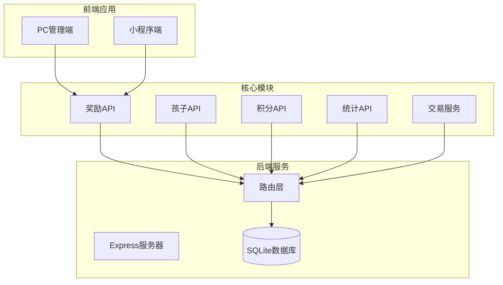
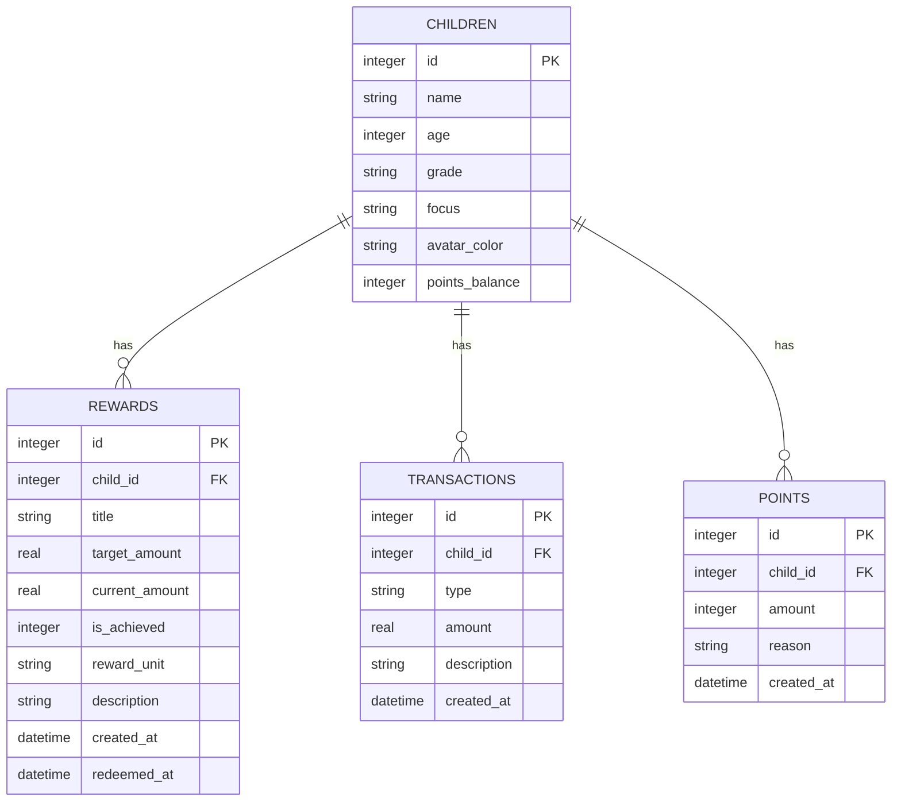
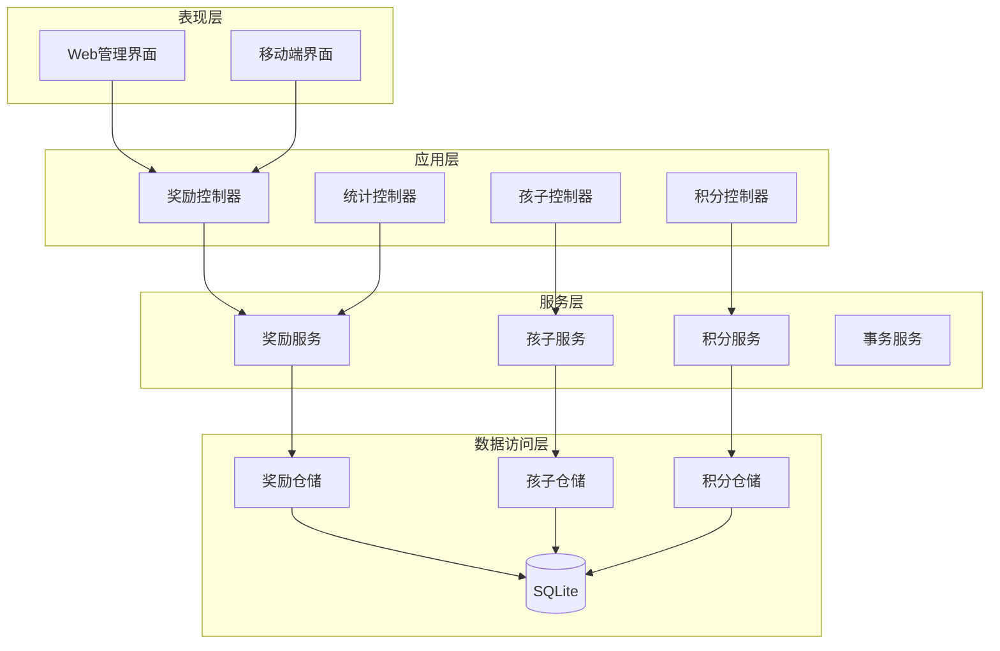
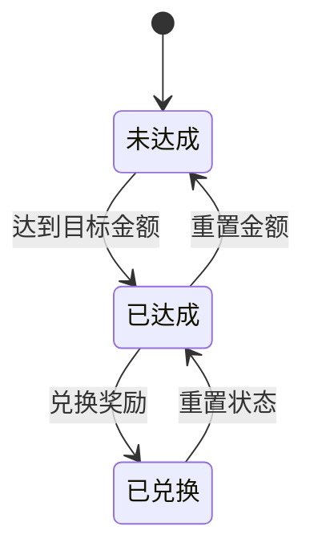
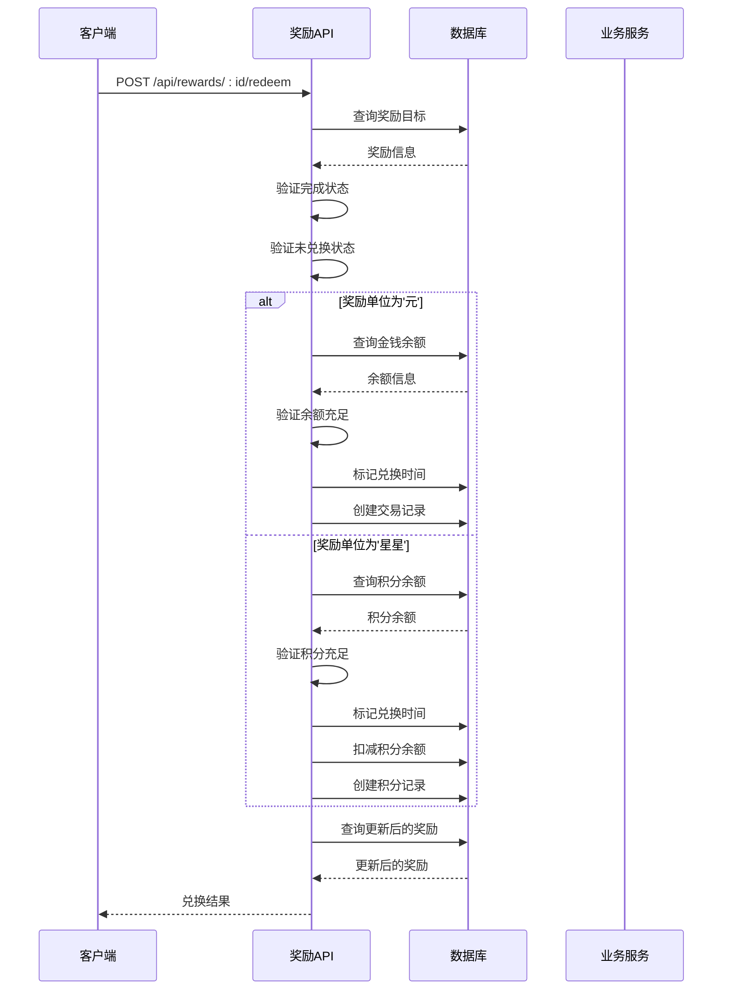
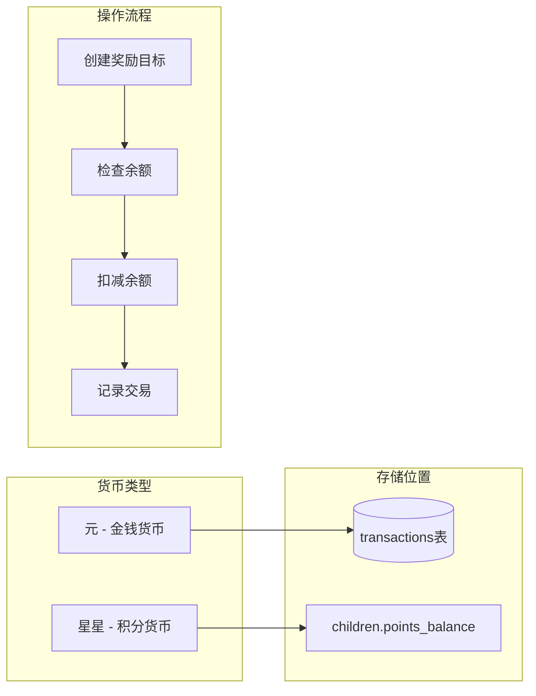
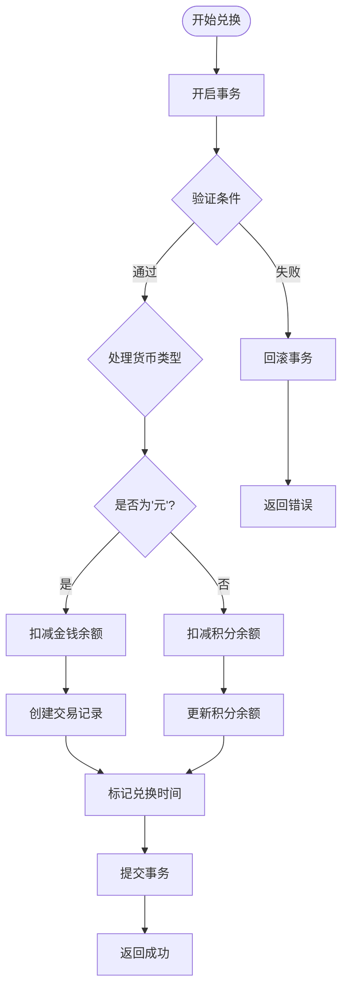
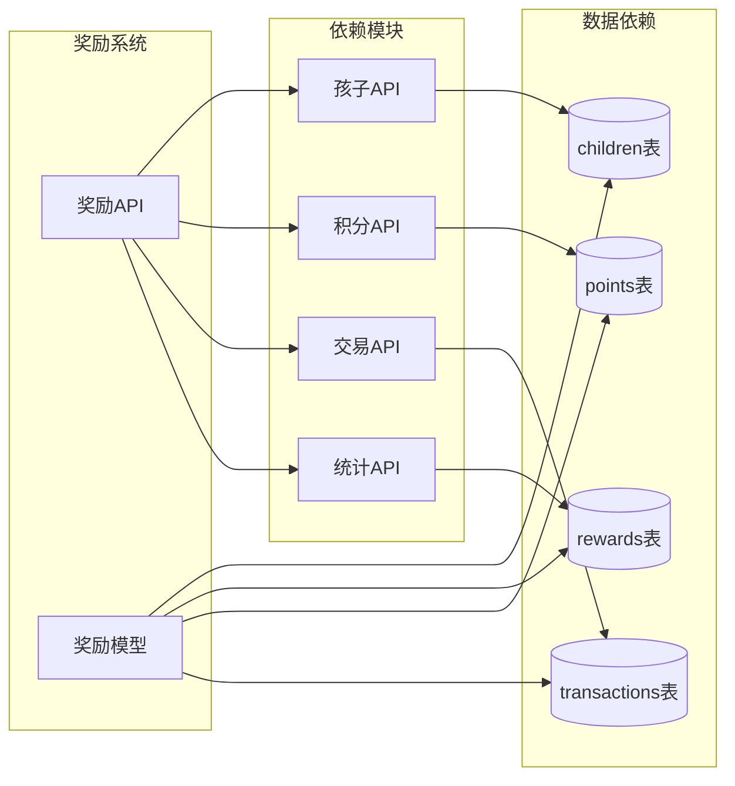

# 奖励管理接口

<cite>
**本文档引用的文件**
- [rewards.js](file://star-park/server/src/routes/rewards.js)
- [database.js](file://star-park/server/src/database.js)
- [index.js](file://star-park/server/src/index.js)
- [api.md](file://docs/api.md)
- [Rewards.vue](file://star-park/pc-admin/src/views/Rewards.vue)
- [index.js](file://star-park/pc-admin/src/api/index.js)
- [children.js](file://star-park/server/src/routes/children.js)
- [points.js](file://star-park/server/src/routes/points.js)
- [stats.js](file://star-park/server/src/routes/stats.js)
- [seed.js](file://star-park/server/src/seed.js)
- [index.vue](file://star-park/miniprogram/src/pages/rewards/index.vue)
</cite>

## 更新摘要
**变更内容**
- 新增双货币支持系统（元/yuan 和 星星/stars）
- 完善完整的CRUD操作接口
- 实现自动余额扣减的兑换功能
- 添加描述字段、奖励单位字段和兑换时间戳
- 增强交易处理和事务管理
- 优化前后端数据同步机制

## 目录
1. [简介](#简介)
2. [项目结构](#项目结构)
3. [核心组件](#核心组件)
4. [架构概览](#架构概览)
5. [详细组件分析](#详细组件分析)
6. [依赖分析](#依赖分析)
7. [性能考虑](#性能考虑)
8. [故障排除指南](#故障排除指南)
9. [结论](#结论)
10. [附录](#附录)

## 简介
星星乐园奖励管理系统是一个基于家庭内网的儿童行为激励平台，通过奖励目标机制帮助孩子建立良好的学习和生活习惯。系统提供完整的奖励生命周期管理，包括目标创建、进度跟踪、完成状态管理和奖励兑换等功能。

本系统采用RESTful API设计，支持两种奖励单位：
- **元**：基于金钱的奖励，通过交易记录进行余额管理
- **星星**：基于积分的奖励，通过独立的积分系统进行管理

**更新** 系统现已支持完整的双货币体系，实现了自动余额扣减和全面的交易处理功能。

## 项目结构
奖励管理系统位于StarParadise项目的star-park目录中，采用前后端分离架构：



**图表来源**
- [index.js:1-42](file://star-park/server/src/index.js#L1-L42)
- [rewards.js:1-167](file://star-park/server/src/routes/rewards.js#L1-L167)

**章节来源**
- [index.js:1-42](file://star-park/server/src/index.js#L1-L42)
- [database.js:1-111](file://star-park/server/src/database.js#L1-L111)

## 核心组件
奖励管理系统包含以下核心组件：

### 数据模型
奖励系统基于SQLite数据库，主要涉及以下表结构：



**更新** 新增了`reward_unit`、`description`和`redeemed_at`字段，支持双货币系统和完整的兑换追踪。

**图表来源**
- [database.js:18-80](file://star-park/server/src/database.js#L18-L80)

### API接口概览
系统提供完整的奖励管理API接口：

| 接口 | 方法 | 路径 | 功能描述 |
|------|------|------|----------|
| 获取奖励 | GET | `/api/rewards` | 获取所有奖励目标 |
| 创建奖励 | POST | `/api/rewards` | 创建新的奖励目标 |
| 更新奖励 | PUT | `/api/rewards/:id` | 更新奖励目标信息 |
| 删除奖励 | DELETE | `/api/rewards/:id` | 删除奖励目标 |
| 兑换奖励 | POST | `/api/rewards/:id/redeem` | 兑换已完成的奖励 |

**更新** 新增的兑换接口支持自动余额扣减和交易记录生成。

**章节来源**
- [rewards.js:5-87](file://star-park/server/src/routes/rewards.js#L5-L87)
- [api.md:146-175](file://docs/api.md#L146-L175)

## 架构概览
奖励管理系统采用分层架构设计，确保业务逻辑清晰分离：



**图表来源**
- [rewards.js:1-167](file://star-park/server/src/routes/rewards.js#L1-L167)
- [index.js:6-11](file://star-park/server/src/index.js#L6-L11)

## 详细组件分析

### 奖励目标数据模型
奖励目标是系统的核心实体，具有以下属性：

| 属性名 | 类型 | 必填 | 默认值 | 描述 |
|--------|------|------|--------|------|
| id | integer | 否 | 自增 | 奖励目标唯一标识符 |
| child_id | integer | 是 | - | 关联的孩子ID |
| title | string | 是 | - | 奖励名称 |
| target_amount | real | 是 | - | 目标金额/积分 |
| current_amount | real | 否 | 0 | 当前累积金额/积分 |
| is_achieved | integer | 否 | 0 | 是否达成（0/1） |
| reward_unit | string | 否 | '元' | 奖励单位（'元'/'星星'） |
| description | string | 否 | '' | 奖励描述 |
| created_at | datetime | 否 | 当前时间 | 创建时间 |
| redeemed_at | datetime | 否 | null | 兑换时间 |

**更新** 新增字段说明：
- `reward_unit`: 指定奖励使用的货币单位，支持'元'和'星星'两种类型
- `description`: 奖励目标的详细描述信息
- `redeemed_at`: 记录奖励被兑换的具体时间戳

### 进度计算算法
奖励进度通过以下公式计算：

```mermaid
flowchart TD
Start([开始计算进度]) --> CheckTarget{是否有目标金额?}
CheckTarget --> |否| ReturnZero[返回0%]
CheckTarget --> |是| GetAmount[获取当前金额]
GetAmount --> CalcProgress[进度 = (当前金额/目标金额) × 100]
CalcProgress --> MinCalc[取进度与100的最小值]
MinCalc --> ReturnResult[返回进度百分比]
ReturnZero --> End([结束])
ReturnResult --> End
```

**图表来源**
- [Rewards.vue:194-198](file://star-park/pc-admin/src/views/Rewards.vue#L194-L198)

### 完成状态管理
系统通过`is_achieved`字段管理奖励完成状态：



### 奖励兑换流程
兑换流程根据奖励单位分为两种处理方式：



**更新** 兑换流程现已支持双货币系统，自动处理不同货币类型的余额扣减逻辑。

**图表来源**
- [rewards.js:89-164](file://star-park/server/src/routes/rewards.js#L89-L164)

**章节来源**
- [rewards.js:89-164](file://star-park/server/src/routes/rewards.js#L89-L164)
- [Rewards.vue:282-301](file://star-park/pc-admin/src/views/Rewards.vue#L282-L301)

### 奖励类型分类
系统支持两种奖励类型：

#### 1. 金钱奖励（元）
- **适用场景**：实物奖励、外出消费等
- **余额管理**：通过`transactions`表管理收支
- **兑换条件**：需有足够的金钱余额
- **记录方式**：创建`redeem`类型的交易记录

#### 2. 积分奖励（星星）
- **适用场景**：虚拟奖励、特权体验等
- **余额管理**：通过`children`表的`points_balance`字段管理
- **兑换条件**：需有足够的积分余额
- **记录方式**：在`points`表创建负值记录

**更新** 两种奖励类型现在都有完整的余额检查和自动扣减机制。

**章节来源**
- [rewards.js:107-154](file://star-park/server/src/routes/rewards.js#L107-L154)
- [children.js:14-22](file://star-park/server/src/routes/children.js#L14-L22)

### 双货币系统设计
系统实现了完整的双货币支持架构：



**图表来源**
- [database.js:51-79](file://star-park/server/src/database.js#L51-L79)
- [rewards.js:107-154](file://star-park/server/src/routes/rewards.js#L107-L154)

### 事务处理机制
系统使用数据库事务确保数据一致性：



**更新** 新增的事务处理机制确保了兑换操作的原子性和数据一致性。

**章节来源**
- [rewards.js:107-154](file://star-park/server/src/routes/rewards.js#L107-L154)

## 依赖分析
奖励管理系统与其他模块存在以下依赖关系：



**图表来源**
- [rewards.js:1-3](file://star-park/server/src/routes/rewards.js#L1-L3)
- [index.js:6-11](file://star-park/server/src/index.js#L6-L11)

**章节来源**
- [index.js:6-27](file://star-park/server/src/index.js#L6-L27)
- [database.js:18-80](file://star-park/server/src/database.js#L18-L80)

## 性能考虑
奖励管理系统在设计时考虑了以下性能优化：

### 数据库优化
- **WAL模式**：启用Write-Ahead Logging提升并发性能
- **外键约束**：确保数据一致性
- **索引策略**：在常用查询字段上建立索引

### API性能
- **批量查询**：支持按孩子ID筛选奖励目标
- **事务处理**：兑换操作使用数据库事务保证原子性
- **缓存策略**：前端组件缓存查询结果

### 内存管理
- **流式处理**：大量数据查询使用流式处理避免内存溢出
- **连接池**：合理管理数据库连接

**更新** 新增的事务处理机制提升了复杂操作的执行效率和数据安全性。

## 故障排除指南

### 常见错误及解决方案

#### 1. 奖励未达成错误
**错误信息**：`奖励目标尚未达成，无法兑换`
**原因**：`is_achieved`字段为0或`current_amount`小于`target_amount`
**解决方案**：先增加奖励金额至目标值，系统自动标记为已达成

#### 2. 重复兑换错误
**错误信息**：`奖励已兑换，不能重复兑换`
**原因**：`redeemed_at`字段已设置
**解决方案**：重置奖励状态或创建新的奖励目标

#### 3. 余额不足错误
**错误信息**：`余额不足，无法兑换` 或 `积分余额不足，无法兑换`
**原因**：可用余额小于奖励金额
**解决方案**：先充值或获得足够的奖励金额/积分

#### 4. 不支持的奖励单位错误
**错误信息**：`不支持的奖励单位: xxx`
**原因**：`reward_unit`字段设置了无效值
**解决方案**：仅支持'元'和'星星'两种单位

#### 5. 数据库迁移错误
**错误信息**：字段不存在或类型不匹配
**原因**：数据库版本不一致
**解决方案**：运行数据库初始化脚本

**更新** 新增了针对双货币系统的特定错误处理。

**章节来源**
- [rewards.js:97-102](file://star-park/server/src/routes/rewards.js#L97-L102)
- [rewards.js:116-134](file://star-park/server/src/routes/rewards.js#L116-L134)
- [rewards.js:149-151](file://star-park/server/src/routes/rewards.js#L149-L151)

### 调试建议
1. **检查网络连接**：确保API服务正常运行
2. **验证权限**：确认有适当的访问权限
3. **查看日志**：检查服务器端错误日志
4. **测试API**：使用curl或Postman测试API接口
5. **验证数据一致性**：检查相关表的数据完整性

## 结论
星星乐园奖励管理系统通过简洁而强大的API设计，为家庭提供了完整的儿童行为激励解决方案。系统支持多种奖励类型，灵活的进度跟踪机制，以及安全可靠的兑换流程。

### 主要优势
- **简单易用**：直观的API设计，易于集成和使用
- **功能完整**：覆盖奖励管理的全生命周期
- **扩展性强**：支持自定义奖励单位和业务规则
- **数据安全**：完善的错误处理和数据验证机制
- **双货币支持**：灵活支持金钱和积分两种奖励体系

### 发展建议
1. **增强统计功能**：提供更多维度的奖励数据分析
2. **移动端优化**：针对移动设备优化用户体验
3. **自动化规则**：支持更复杂的奖励触发条件
4. **多语言支持**：国际化部署准备
5. **高级报表**：生成详细的奖励使用报告

## 附录

### API使用示例

#### 1. 创建奖励目标
```javascript
// 请求示例
{
  "child_id": 1,
  "title": "新玩具",
  "target_amount": 50,
  "description": "完成一周任务获得",
  "reward_unit": "元"
}

// 响应示例
{
  "id": 1,
  "child_id": 1,
  "title": "新玩具",
  "target_amount": 50,
  "current_amount": 0,
  "is_achieved": 0,
  "reward_unit": "元",
  "description": "完成一周任务获得",
  "created_at": "2026-05-25T12:00:00.000Z"
}
```

#### 2. 更新奖励进度
```javascript
// 请求示例
{
  "current_amount": 30,
  "is_achieved": 0
}

// 响应示例
{
  "id": 1,
  "child_id": 1,
  "title": "新玩具",
  "target_amount": 50,
  "current_amount": 30,
  "is_achieved": 0,
  "reward_unit": "元",
  "description": "完成一周任务获得"
}
```

#### 3. 兑换奖励
```javascript
// 请求示例
// POST /api/rewards/1/redeem

// 响应示例
{
  "id": 1,
  "child_id": 1,
  "title": "新玩具",
  "target_amount": 50,
  "current_amount": 50,
  "is_achieved": 1,
  "reward_unit": "元",
  "description": "完成一周任务获得",
  "redeemed_at": "2026-05-25T12:00:00.000Z"
}
```

### 奖励设置最佳实践

#### 1. 目标设定原则
- **SMART原则**：具体、可衡量、可实现、相关性强、有时限
- **渐进式目标**：从小目标开始，逐步提高难度
- **及时反馈**：设置合理的里程碑和奖励节点

#### 2. 单位选择策略
- **金钱奖励**：适合实物奖励，需要明确的预算控制
- **积分奖励**：适合虚拟奖励，便于长期积累
- **混合模式**：结合两种单位，满足不同需求

#### 3. 进度跟踪建议
- **实时更新**：及时更新奖励进度
- **可视化展示**：通过进度条直观显示完成情况
- **提醒机制**：设置进度提醒和完成通知

### 双货币使用指南

#### 1. 元货币使用场景
- 购买实物商品（玩具、书籍等）
- 支付外出活动费用
- 兑换特殊体验机会

#### 2. 星星货币使用场景
- 解锁虚拟特权（延长屏幕时间等）
- 兑换游戏道具或虚拟物品
- 作为日常行为激励的小额奖励

#### 3. 混合使用策略
- 大额奖励使用元货币
- 日常小成就使用星星货币
- 建立货币间的兑换比例关系

**章节来源**
- [api.md:146-191](file://docs/api.md#L146-L191)
- [Rewards.vue:194-202](file://star-park/pc-admin/src/views/Rewards.vue#L194-L202)
- [rewards.js:24-38](file://star-park/server/src/routes/rewards.js#L24-L38)