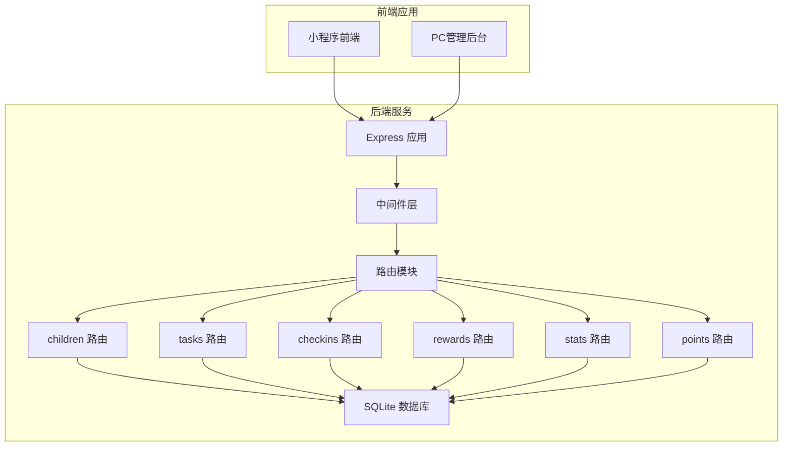
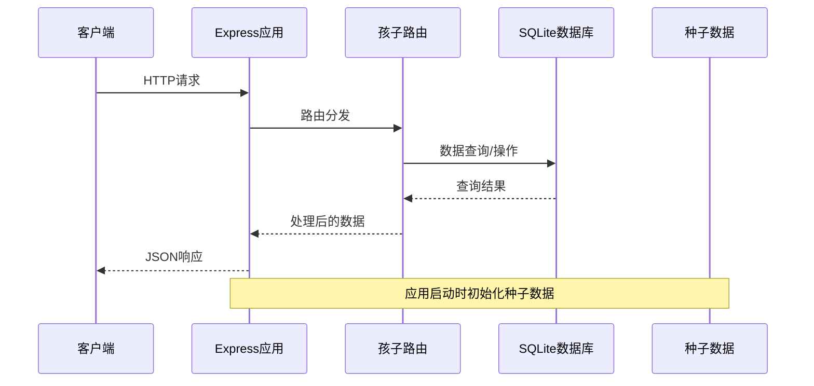
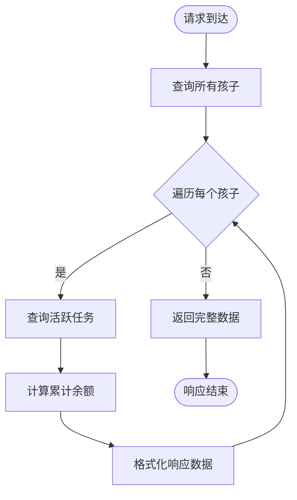
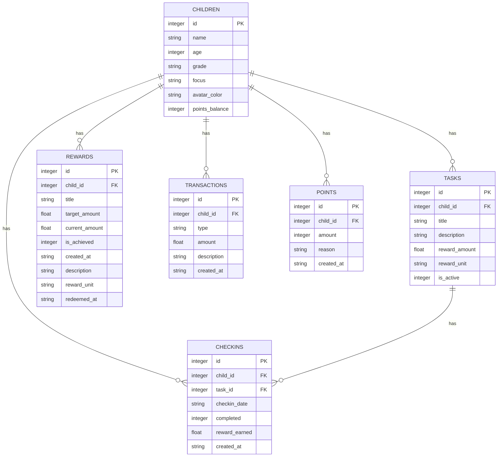
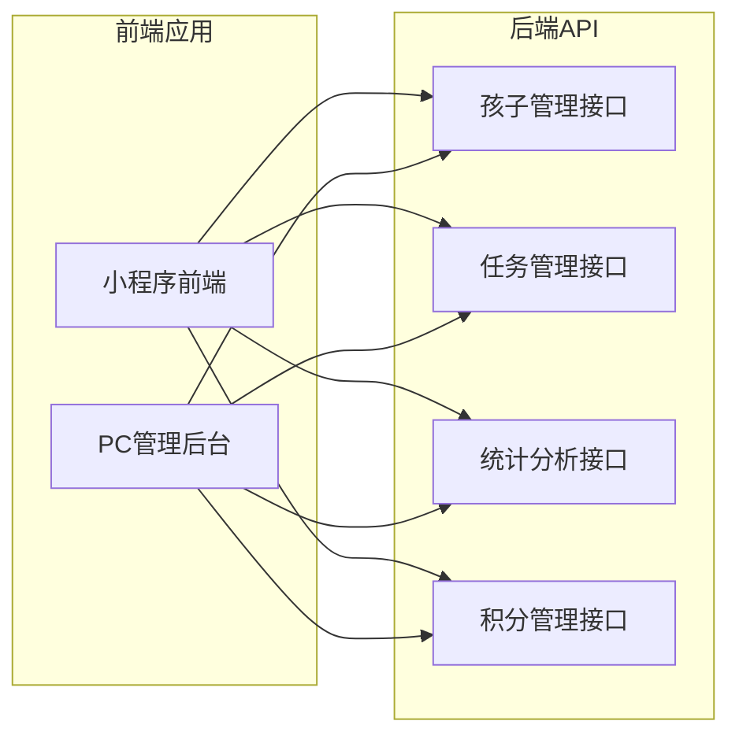
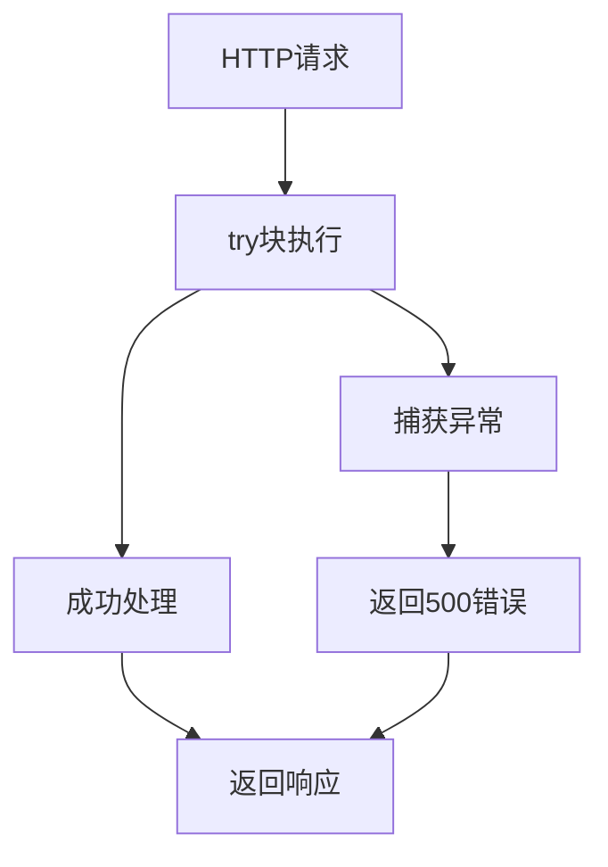

# 孩子管理接口

<cite>
**本文档引用的文件**
- [children.js](file://star-park/server/src/routes/children.js)
- [database.js](file://star-park/server/src/database.js)
- [index.js](file://star-park/server/src/index.js)
- [api.md](file://docs/api.md)
- [seed.js](file://star-park/server/src/seed.js)
- [points.js](file://star-park/server/src/routes/points.js)
- [tasks.js](file://star-park/server/src/routes/tasks.js)
- [index.js](file://star-park/miniprogram/src/api/index.js)
</cite>

## 目录
1. [简介](#简介)
2. [项目结构](#项目结构)
3. [核心组件](#核心组件)
4. [架构概览](#架构概览)
5. [详细组件分析](#详细组件分析)
6. [依赖关系分析](#依赖关系分析)
7. [性能考虑](#性能考虑)
8. [故障排除指南](#故障排除指南)
9. [结论](#结论)
10. [附录](#附录)

## 简介
星星乐园是一个专为家庭设计的儿童成长管理系统，提供孩子管理、任务打卡、奖励目标和积分系统的完整解决方案。本项目采用Express.js后端服务，使用better-sqlite3嵌入式数据库，无需外部数据库服务即可运行。

该系统支持多终端访问，包括微信小程序前端和PC管理后台，为家长提供全面的儿童成长追踪和激励机制。

## 项目结构
项目采用前后端分离的架构设计，后端服务位于star-park/server目录下，包含RESTful API接口、数据库管理和路由配置。



**图表来源**
- [index.js:1-42](file://star-park/server/src/index.js#L1-L42)
- [children.js:1-96](file://star-park/server/src/routes/children.js#L1-L96)

**章节来源**
- [index.js:1-42](file://star-park/server/src/index.js#L1-L42)
- [database.js:1-111](file://star-park/server/src/database.js#L1-L111)

## 核心组件
本系统的核心组件围绕孩子管理展开，主要包括以下四个关键接口：

### 孩子管理接口
- **GET /api/children** - 获取所有孩子信息及关联任务
- **POST /api/children** - 创建新孩子
- **GET /api/children/:id/balance** - 获取指定孩子积分余额
- **GET /api/children/:id/transactions** - 获取指定孩子交易记录

### 数据模型关系
系统采用SQLite关系型数据库，核心数据表包括：
- children: 孩子基本信息表
- tasks: 任务表，与孩子建立一对多关系
- checkins: 打卡记录表，维护任务完成情况
- rewards: 奖励目标表，跟踪孩子成长里程碑
- transactions: 金钱交易记录表
- points: 积分记录表

**章节来源**
- [database.js:18-80](file://star-park/server/src/database.js#L18-L80)
- [children.js:5-96](file://star-park/server/src/routes/children.js#L5-L96)

## 架构概览
系统采用分层架构设计，清晰分离了业务逻辑、数据访问和接口层。



**图表来源**
- [index.js:1-42](file://star-park/server/src/index.js#L1-L42)
- [children.js:1-96](file://star-park/server/src/routes/children.js#L1-L96)
- [seed.js:1-45](file://star-park/server/src/seed.js#L1-L45)

## 详细组件分析

### 孩子列表获取接口 (GET /api/children)
该接口提供所有孩子的综合信息，包括任务列表和余额统计。

#### 请求参数
- 无查询参数

#### 响应数据结构
```json
[
  {
    "id": 1,
    "name": "老二",
    "age": 13,
    "grade": "初一",
    "focus": "各学科提分",
    "avatar_color": "#FF6B6B",
    "balance": "¥3",
    "points_balance": 0,
    "tasks": [
      {
        "id": 1,
        "name": "英语背单词",
        "desc": "每天背10个单词",
        "reward": "1元",
        "standard": "每天背10个单词"
      }
    ]
  }
]
```

#### 处理逻辑
1. 查询所有孩子信息
2. 为每个孩子查询活跃任务列表
3. 计算每个孩子的累计积分余额
4. 格式化响应数据结构



**图表来源**
- [children.js:5-37](file://star-park/server/src/routes/children.js#L5-L37)

**章节来源**
- [children.js:5-37](file://star-park/server/src/routes/children.js#L5-L37)
- [api.md:33-57](file://docs/api.md#L33-L57)

### 新孩子创建接口 (POST /api/children)
该接口用于创建新的孩子记录。

#### 请求参数验证规则
- **name** (必需): 字符串类型，不能为空
- **age** (可选): 数字类型
- **grade** (可选): 字符串类型
- **focus** (可选): 字符串类型
- **avatar_color** (可选): 颜色字符串，默认值为'#19C8B9'

#### 请求示例
```json
{
  "name": "小明",
  "age": 8,
  "grade": "小学二年级",
  "focus": "数学提高",
  "avatar_color": "#4ECDC4"
}
```

#### 响应数据结构
成功创建时返回完整的孩子信息对象。

**章节来源**
- [children.js:39-54](file://star-park/server/src/routes/children.js#L39-L54)
- [api.md:59-73](file://docs/api.md#L59-L73)

### 积分余额查询接口 (GET /api/children/:id/balance)
该接口提供指定孩子的当前积分余额。

#### 路径参数
- **id** (必需): 孩子ID，数字类型

#### 响应数据结构
直接返回积分余额数值。

#### 错误处理
- 当孩子不存在时返回404状态码

**章节来源**
- [children.js:56-68](file://star-park/server/src/routes/children.js#L56-L68)

### 交易记录查询接口 (GET /api/children/:id/transactions)
该接口提供指定孩子的交易记录，支持两种查询模式。

#### 路径参数
- **id** (必需): 孩子ID，数字类型

#### 查询参数
- **type** (可选): 交易类型
  - 默认: 返回积分记录(points表)
  - type=money: 返回金钱交易记录(transactions表)

#### 响应数据结构
根据查询类型返回不同的数据格式：

**默认模式 (积分记录)**:
```json
[
  {
    "id": 1,
    "child_id": 1,
    "amount": 10,
    "description": "完成数学作业",
    "createdAt": "2026-05-25 10:30:00",
    "type": "earn"
  }
]
```

**金钱模式 (type=money)**:
```json
[
  {
    "id": 1,
    "child_id": 1,
    "type": "earn",
    "amount": 5.0,
    "description": "完成家务",
    "created_at": "2026-05-25 10:30:00"
  }
]
```

**章节来源**
- [children.js:70-93](file://star-park/server/src/routes/children.js#L70-L93)

## 依赖关系分析

### 数据库表关系图


**图表来源**
- [database.js:18-80](file://star-park/server/src/database.js#L18-L80)

### 前端集成关系


**图表来源**
- [index.js:6-27](file://star-park/server/src/index.js#L6-L27)
- [index.js:1-75](file://star-park/miniprogram/src/api/index.js#L1-L75)

**章节来源**
- [index.js:6-27](file://star-park/server/src/index.js#L6-L27)
- [index.js:1-75](file://star-park/miniprogram/src/api/index.js#L1-L75)

## 性能考虑
系统采用SQLite嵌入式数据库，在单机环境下提供良好的性能表现。主要性能优化措施包括：

### 数据库优化
- **WAL模式**: 启用写前日志(WAL)模式提升并发读取性能
- **外键约束**: 启用外键检查确保数据一致性
- **索引策略**: 在常用查询字段上建立适当的索引

### 查询优化
- **批量查询**: 使用预编译语句减少SQL解析开销
- **连接池**: better-sqlite3内置连接池管理
- **事务处理**: 对于需要一致性的操作使用事务

### 缓存策略
- **内存缓存**: 小程序和PC端前端进行本地缓存
- **数据库缓存**: SQLite自动缓存热点数据

## 故障排除指南

### 常见错误类型
| 状态码 | 错误类型 | 可能原因 | 解决方案 |
|--------|----------|----------|----------|
| 400 | 请求参数错误 | 缺少必填字段或参数类型不正确 | 检查请求体格式和必填字段 |
| 404 | 资源不存在 | 孩子ID或任务ID无效 | 验证ID是否存在且有效 |
| 500 | 服务器内部错误 | 数据库操作失败或系统异常 | 查看服务器日志，检查数据库连接 |

### 错误处理机制
系统在每个路由中都实现了统一的错误处理机制：



**图表来源**
- [children.js:34-36](file://star-park/server/src/routes/children.js#L34-L36)
- [children.js:52-53](file://star-park/server/src/routes/children.js#L52-L53)

### 调试建议
1. **检查数据库连接**: 确认SQLite数据库文件存在且可访问
2. **验证API路径**: 确认请求URL格式正确
3. **查看服务器日志**: 检查控制台输出的错误信息
4. **测试基础功能**: 先测试健康检查接口确认服务正常

**章节来源**
- [children.js:34-36](file://star-park/server/src/routes/children.js#L34-L36)
- [children.js:52-53](file://star-park/server/src/routes/children.js#L52-L53)
- [api.md:215-222](file://docs/api.md#L215-L222)

## 结论
星星乐园的孩子管理接口提供了完整的儿童成长管理系统API，具有以下特点：

### 技术优势
- **简洁高效**: 基于Express.js和SQLite，部署简单，性能优异
- **数据完整**: 支持积分系统、任务管理、奖励目标等完整功能
- **易于扩展**: 清晰的架构设计便于功能扩展和维护

### 功能特性
- **实时同步**: 支持多终端数据同步
- **灵活查询**: 提供多种筛选和排序选项
- **错误处理**: 完善的错误处理和状态码管理

### 应用场景
该系统特别适合家庭环境中的儿童成长管理，为家长提供直观的数据可视化和便捷的操作界面。

## 附录

### API接口完整列表
- **GET /api/children** - 获取所有孩子信息
- **POST /api/children** - 创建新孩子
- **GET /api/children/:id/balance** - 获取积分余额
- **GET /api/children/:id/transactions** - 获取交易记录

### 数据模型详细说明

#### 孩子信息模型
| 字段名 | 类型 | 必填 | 默认值 | 说明 |
|--------|------|------|--------|------|
| id | integer | 否 | 自增 | 孩子唯一标识 |
| name | string | 是 | 无 | 孩子姓名 |
| age | integer | 否 | null | 年龄 |
| grade | string | 否 | null | 年级 |
| focus | string | 否 | null | 专注方向 |
| avatar_color | string | 否 | '#19C8B9' | 头像颜色 |
| points_balance | integer | 否 | 0 | 积分余额 |

#### 任务模型
| 字段名 | 类型 | 必填 | 默认值 | 说明 |
|--------|------|------|--------|------|
| id | integer | 否 | 自增 | 任务唯一标识 |
| child_id | integer | 是 | 无 | 关联孩子ID |
| title | string | 是 | 无 | 任务标题 |
| description | string | 否 | null | 任务描述 |
| reward_amount | float | 否 | 1.0 | 奖励金额 |
| reward_unit | string | 否 | '元' | 奖励单位 |
| is_active | integer | 否 | 1 | 是否启用 |

#### 交易记录模型
| 字段名 | 类型 | 必填 | 默认值 | 说明 |
|--------|------|------|--------|------|
| id | integer | 否 | 自增 | 交易记录ID |
| child_id | integer | 是 | 无 | 关联孩子ID |
| type | string | 是 | 无 | 交易类型 |
| amount | float | 是 | 无 | 交易金额 |
| description | string | 否 | null | 交易描述 |
| created_at | string | 否 | 当前时间 | 创建时间 |

### 高级用法示例

#### 批量操作
虽然当前API未直接提供批量操作接口，但可以通过循环调用单个接口实现批量处理：

```javascript
// 批量创建多个孩子
const childrenData = [
  { name: '孩子1', age: 8 },
  { name: '孩子2', age: 10 }
];

const createdChildren = await Promise.all(
  childrenData.map(data => createChild(data))
);
```

#### 分页查询
对于大量数据的场景，建议在客户端实现分页逻辑：

```javascript
// 获取第一页数据（每页10条）
const page1 = await getChildren({ limit: 10, offset: 0 });

// 获取第二页数据
const page2 = await getChildren({ limit: 10, offset: 10 });
```

#### 排序和筛选
系统支持基于查询参数的排序和筛选：

```javascript
// 按年龄排序
const childrenByAge = await getChildren({ sort: 'age' });

// 按年级筛选
const middleSchoolChildren = await getChildren({ grade: '初中' });
```

**章节来源**
- [database.js:18-80](file://star-park/server/src/database.js#L18-L80)
- [children.js:5-96](file://star-park/server/src/routes/children.js#L5-L96)