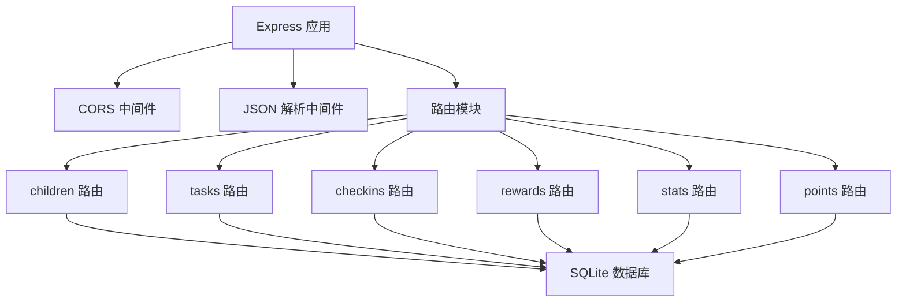
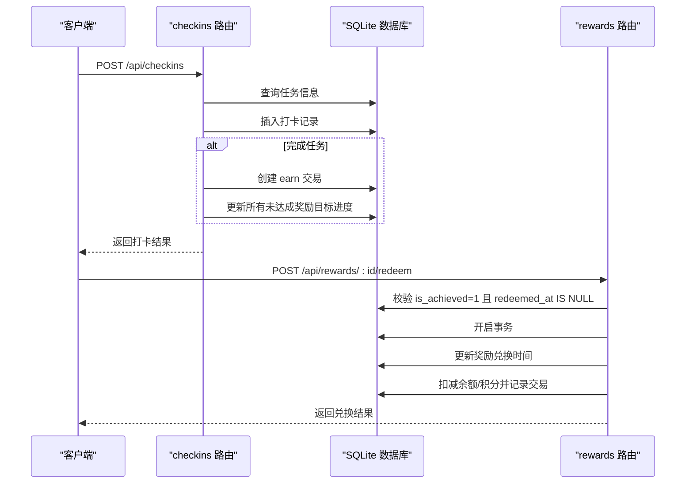
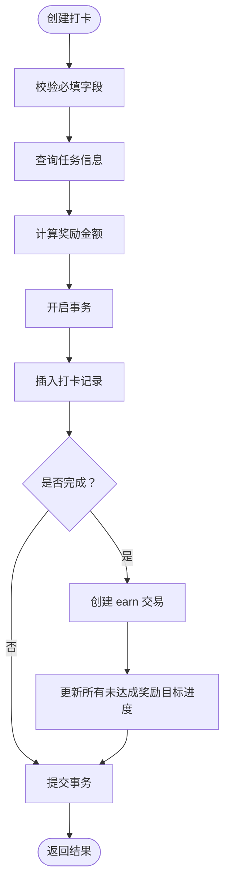
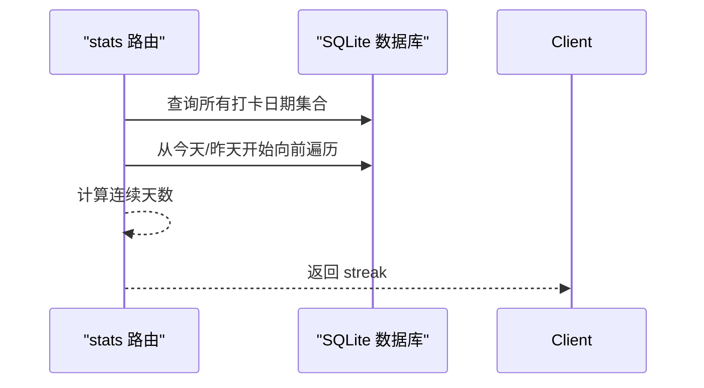
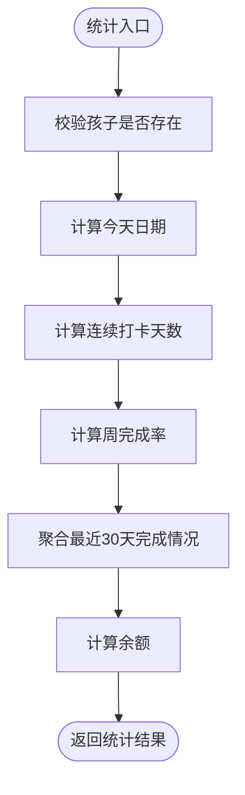
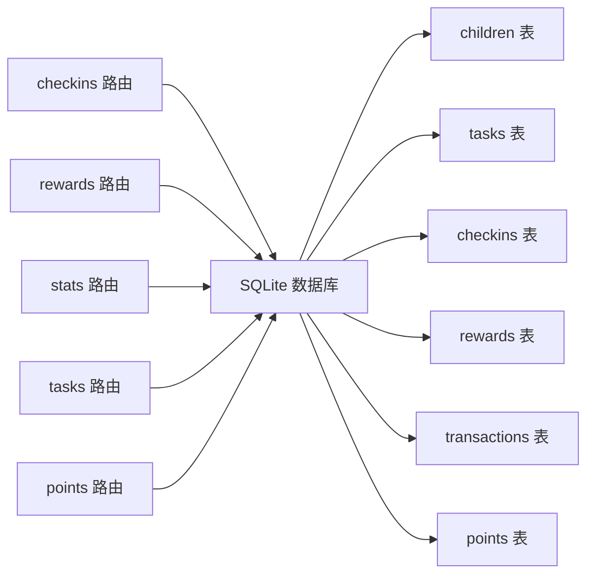

# 打卡管理接口

<cite>
**本文引用的文件**
- [checkins.js](file://star-park/server/src/routes/checkins.js)
- [rewards.js](file://star-park/server/src/routes/rewards.js)
- [stats.js](file://star-park/server/src/routes/stats.js)
- [database.js](file://star-park/server/src/database.js)
- [index.js](file://star-park/server/src/index.js)
- [api.md](file://docs/api.md)
- [server.md](file://docs/design-docs/server.md)
- [seed.js](file://star-park/server/src/seed.js)
- [tasks.js](file://star-park/server/src/routes/tasks.js)
- [points.js](file://star-park/server/src/routes/points.js)
- [index.js](file://star-park/miniprogram/src/api/index.js)
- [index.js](file://star-park/pc-admin/src/api/index.js)
- [index.vue](file://star-park/miniprogram/src/pages/checkin/index.vue)
- [Checkin.vue](file://star-park/pc-admin/src/views/Checkin.vue)
</cite>

## 目录
1. [简介](#简介)
2. [项目结构](#项目结构)
3. [核心组件](#核心组件)
4. [架构总览](#架构总览)
5. [详细组件分析](#详细组件分析)
6. [依赖关系分析](#依赖关系分析)
7. [性能考虑](#性能考虑)
8. [故障排查指南](#故障排查指南)
9. [结论](#结论)
10. [附录](#附录)

## 简介
本文件为“打卡管理接口”的完整API文档，覆盖以下能力：
- 打卡记录的创建、查询、更新、删除
- 打卡与奖励系统的联动：自动奖励计算、连续打卡统计、奖励发放流程
- 打卡状态管理、批量打卡、历史记录查询
- 事务性操作保障数据一致性、错误处理策略、性能优化建议
- 时间维度分析与统计计算逻辑（连续打卡、周完成率、最近30天每日完成情况）

## 项目结构
后端采用 Express + better-sqlite3 的轻量架构，核心路由包括：
- 孩子：/api/children
- 任务：/api/tasks
- 打卡：/api/checkins
- 奖励：/api/rewards
- 统计：/api/stats（/api/dashboard）
- 积分：/api/points

图表来源
- [index.js:21-27](file://star-park/server/src/index.js#L21-L27)

章节来源
- [index.js:1-42](file://star-park/server/src/index.js#L1-L42)
- [database.js:18-80](file://star-park/server/src/database.js#L18-L80)

## 核心组件
- 打卡路由：负责创建/查询打卡记录，并在完成任务时自动更新奖励进度与交易流水
- 奖励路由：负责奖励目标的增删改查与兑换，支持“元”和“积分”两种单位
- 统计路由：提供连续打卡、周完成率、最近30天每日完成情况、余额等统计
- 数据库：定义 children、tasks、checkins、rewards、transactions、points 等表结构与迁移

章节来源
- [checkins.js:6-89](file://star-park/server/src/routes/checkins.js#L6-L89)
- [rewards.js:5-167](file://star-park/server/src/routes/rewards.js#L5-L167)
- [stats.js:6-182](file://star-park/server/src/routes/stats.js#L6-L182)
- [database.js:18-111](file://star-park/server/src/database.js#L18-L111)

## 架构总览
打卡与奖励联动的关键流程如下：
- 创建打卡：插入 checkins，若完成则创建 earn 交易，更新所有未达成奖励目标的 current_amount，并自动判定是否达成
- 兑换奖励：校验达成状态与未兑换状态，按单位执行余额扣减并记录交易

图表来源
- [checkins.js:31-87](file://star-park/server/src/routes/checkins.js#L31-L87)
- [rewards.js:89-164](file://star-park/server/src/routes/rewards.js#L89-L164)

## 详细组件分析

### 打卡记录管理
- 创建打卡
  - 接口：POST /api/checkins
  - 请求体字段：child_id、task_id、checkin_date、completed（可选，默认1）
  - 业务逻辑：校验必填；查询任务获取奖励金额；事务内插入打卡记录；若完成则创建 earn 交易并更新所有未达成奖励目标的 current_amount，自动判定达成
  - 响应：返回新增打卡记录（含任务标题）
- 查询打卡
  - 接口：GET /api/checkins
  - 查询参数：date（YYYY-MM-DD）、child_id
  - 响应：打卡记录列表（含任务标题）
- 更新/删除打卡
  - 当前实现：未提供 PUT/DELETE /api/checkins；如需修改可通过删除旧记录后重建的方式间接实现

图表来源
- [checkins.js:31-87](file://star-park/server/src/routes/checkins.js#L31-L87)

章节来源
- [checkins.js:6-89](file://star-park/server/src/routes/checkins.js#L6-L89)

### 奖励系统联动
- 自动奖励计算
  - 完成任务时，根据任务 reward_amount 生成 earn 交易，并更新所有未达成奖励目标的 current_amount
  - 若 current_amount 达到或超过 target_amount，则标记 is_achieved=1
- 连续打卡统计
  - 从当天或前一天开始向前回溯，统计连续有打卡记录的天数
- 奖励兑换
  - 支持“元”和“积分”两种单位
  - “元”：校验交易余额充足后扣减 earn 减 spend 差额
  - “积分”：校验 children.points_balance 后扣减并记录 points 流水
  - 兑换后记录 redeemed_at

图表来源
- [stats.js:17-36](file://star-park/server/src/routes/stats.js#L17-L36)

章节来源
- [checkins.js:48-76](file://star-park/server/src/routes/checkins.js#L48-L76)
- [stats.js:17-36](file://star-park/server/src/routes/stats.js#L17-L36)
- [rewards.js:89-164](file://star-park/server/src/routes/rewards.js#L89-L164)

### 统计与历史查询
- 孩子统计
  - 接口：GET /api/stats/:childId
  - 返回：streak、weekly_rate、weekly_checkins、weekly_expected、active_tasks、balance、daily_data（最近30天）
- 仪表盘
  - 接口：GET /api/dashboard
  - 返回：每个孩子的今日打卡、活跃任务、连续天数、周完成率、余额、未达成奖励目标

图表来源
- [stats.js:6-101](file://star-park/server/src/routes/stats.js#L6-L101)

章节来源
- [stats.js:6-182](file://star-park/server/src/routes/stats.js#L6-L182)

### 事务性操作与数据一致性
- 打卡创建：使用 db.transaction 包裹插入打卡、创建 earn 交易、更新奖励目标进度，确保原子性
- 任务删除：先删除关联打卡记录，再删除任务，避免外键约束导致的删除失败
- 奖励兑换：根据单位分别校验余额并扣减，使用事务保证多步操作一致

章节来源
- [checkins.js:48-76](file://star-park/server/src/routes/checkins.js#L48-L76)
- [tasks.js:78-84](file://star-park/server/src/routes/tasks.js#L78-L84)
- [rewards.js:107-154](file://star-park/server/src/routes/rewards.js#L107-L154)

### 错误处理策略
- 400：缺少必填字段、余额不足、积分不足、不支持的奖励单位
- 404：资源不存在（任务、奖励、孩子）
- 500：数据库异常
- 前端统一拦截错误并提示用户

章节来源
- [checkins.js:34-36](file://star-park/server/src/routes/checkins.js#L34-L36)
- [rewards.js:94-102](file://star-park/server/src/routes/rewards.js#L94-L102)
- [rewards.js:158-162](file://star-park/server/src/routes/rewards.js#L158-L162)
- [api.md:246-253](file://docs/api.md#L246-L253)

### 使用示例与最佳实践
- 批量打卡
  - 在客户端逐条调用 POST /api/checkins，传入 child_id、task_id、checkin_date、completed
  - 前端示例：小程序/PC 管理端均按任务循环提交
- 历史记录查询
  - 使用 GET /api/checkins?date=YYYY-MM-DD&child_id=x 查询指定日期或指定孩子的打卡记录
- 连续打卡与周完成率
  - 调用 GET /api/stats/:childId 获取 streak、weekly_rate 等指标
- 奖励兑换
  - 先确认 is_achieved=1 且 redeemed_at 为空，再调用 POST /api/rewards/:id/redeem

章节来源
- [index.js:30-32](file://star-park/server/src/index.js#L30-L32)
- [index.js:34-35](file://star-park/server/src/index.js#L34-L35)
- [index.js:38-42](file://star-park/server/src/index.js#L38-L42)
- [index.vue:165-192](file://star-park/miniprogram/src/pages/checkin/index.vue#L165-L192)
- [Checkin.vue:197-216](file://star-park/pc-admin/src/views/Checkin.vue#L197-L216)

## 依赖关系分析

图表来源
- [database.js:18-80](file://star-park/server/src/database.js#L18-L80)
- [checkins.js:10-24](file://star-park/server/src/routes/checkins.js#L10-L24)
- [rewards.js:6-19](file://star-park/server/src/routes/rewards.js#L6-L19)
- [stats.js:7-101](file://star-park/server/src/routes/stats.js#L7-L101)

章节来源
- [database.js:18-111](file://star-park/server/src/database.js#L18-L111)

## 性能考虑
- 数据库并发：启用 WAL 模式与外键约束，提升并发读写性能
- 查询优化：统计接口对日期范围与去重做了合理索引（DISTINCT checkin_date）
- 事务边界：将多步写操作包裹在事务中，减少锁竞争与回滚成本
- 前端缓存：客户端可对常用数据（如任务列表、孩子列表）做本地缓存，减少重复请求

章节来源
- [database.js:13-15](file://star-park/server/src/database.js#L13-L15)
- [stats.js:19-21](file://star-park/server/src/routes/stats.js#L19-L21)

## 故障排查指南
- 打卡失败
  - 检查必填字段：child_id、task_id、checkin_date
  - 确认任务存在且未被删除
  - 查看是否重复打卡（同 child_id+task_id+checkin_date）
- 奖励兑换失败
  - 确认 is_achieved=1 且 redeemed_at 为空
  - “元”单位：检查交易余额是否足够
  - “积分”单位：检查 children.points_balance 是否足够
- 统计异常
  - 检查孩子是否存在
  - 确认任务 is_active 状态影响周完成率计算

章节来源
- [checkins.js:34-44](file://star-park/server/src/routes/checkins.js#L34-L44)
- [rewards.js:94-102](file://star-park/server/src/routes/rewards.js#L94-L102)
- [rewards.js:116-118](file://star-park/server/src/routes/rewards.js#L116-L118)
- [stats.js:11-13](file://star-park/server/src/routes/stats.js#L11-L13)

## 结论
本系统通过“打卡即奖励”的闭环设计，实现了自动化的奖励计算与连续打卡统计。事务性操作确保了数据一致性，统计接口提供了直观的可视化指标。建议在生产环境中结合前端缓存与合理的索引策略进一步优化性能，并持续监控错误日志以提升稳定性。

## 附录

### API 定义与示例

- 健康检查
  - GET /api/health
  - 响应：包含服务状态与时间戳
- 获取孩子列表
  - GET /api/children
  - 响应：包含每个孩子的余额、积分余额、任务列表等
- 获取任务列表
  - GET /api/tasks?child_id=x
  - 响应：任务列表（可按孩子筛选）
- 创建任务
  - POST /api/tasks
  - 请求体：child_id、title、description、reward_amount、reward_unit
- 更新任务
  - PUT /api/tasks/:id
  - 请求体：title、description、reward_amount、reward_unit、is_active
- 删除任务
  - DELETE /api/tasks/:id
  - 事务：先删打卡记录，再删任务
- 获取打卡记录
  - GET /api/checkins?date=YYYY-MM-DD&child_id=x
  - 响应：打卡记录列表（含任务标题）
- 创建打卡
  - POST /api/checkins
  - 请求体：child_id、task_id、checkin_date、completed（可选）
  - 响应：新增打卡记录
- 获取奖励目标
  - GET /api/rewards?child_id=x
  - 响应：奖励目标列表
- 创建奖励目标
  - POST /api/rewards
  - 请求体：child_id、title、target_amount、description、reward_unit
- 更新奖励目标
  - PUT /api/rewards/:id
  - 请求体：title、target_amount、current_amount、is_achieved、description、reward_unit
- 删除奖励目标
  - DELETE /api/rewards/:id
- 兑换奖励
  - POST /api/rewards/:id/redeem
  - 前置条件：is_achieved=1 且 redeemed_at 为空
  - 响应：记录 redeemed_at
- 获取统计数据
  - GET /api/stats/:childId
  - 响应：streak、weekly_rate、balance、daily_data
- 获取仪表盘数据
  - GET /api/dashboard
  - 响应：每个孩子的今日打卡、活跃任务、连续天数、周完成率、余额、未达成奖励目标
- 获取积分记录
  - GET /api/points?child_id=x
  - 响应：积分记录与当前积分余额
- 添加积分
  - POST /api/points
  - 请求体：child_id、amount、reason
  - 响应：新增积分记录与新的积分余额

章节来源
- [api.md:18-253](file://docs/api.md#L18-L253)
- [server.md:37-58](file://docs/design-docs/server.md#L37-L58)