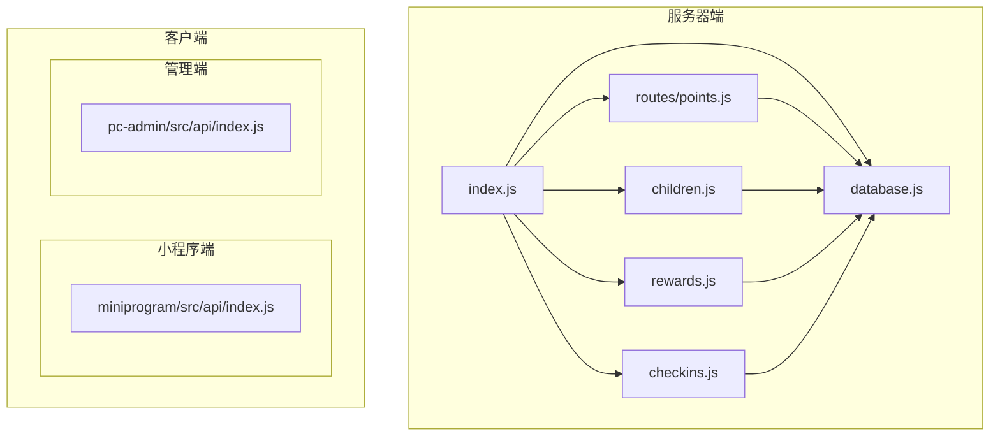
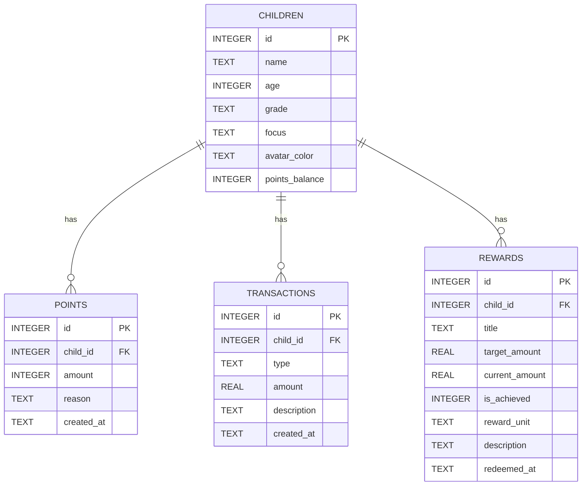
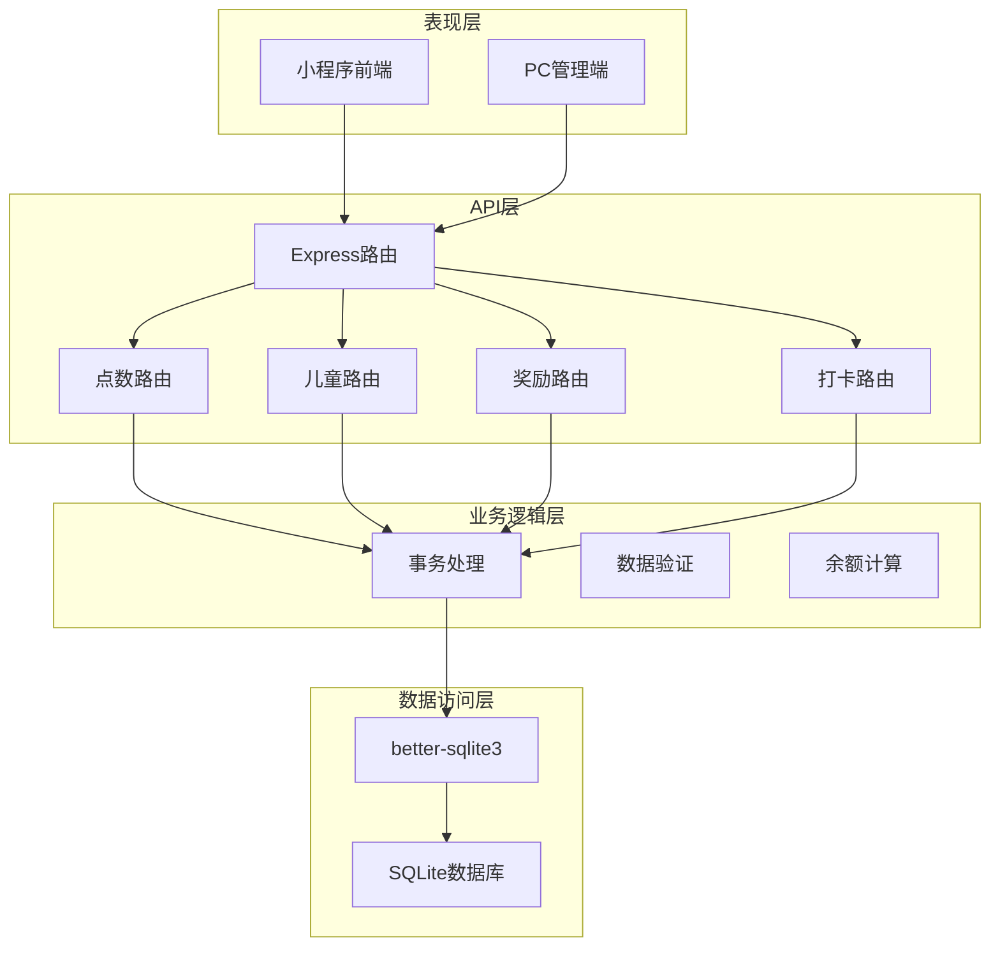
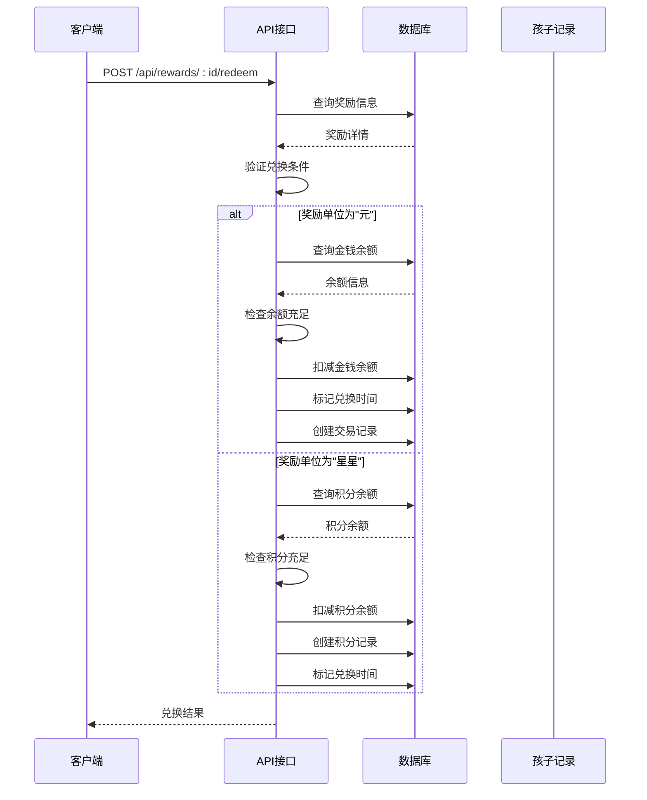
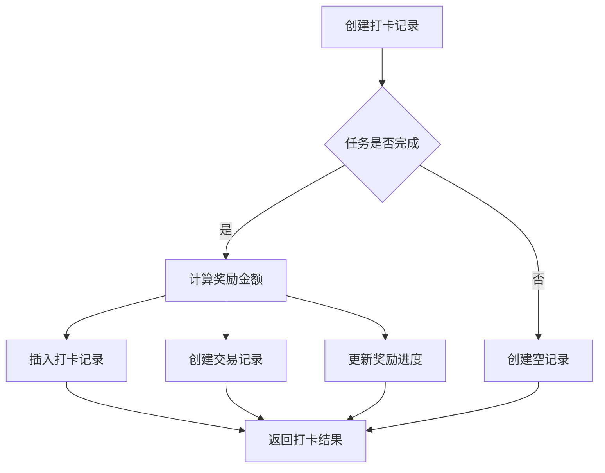
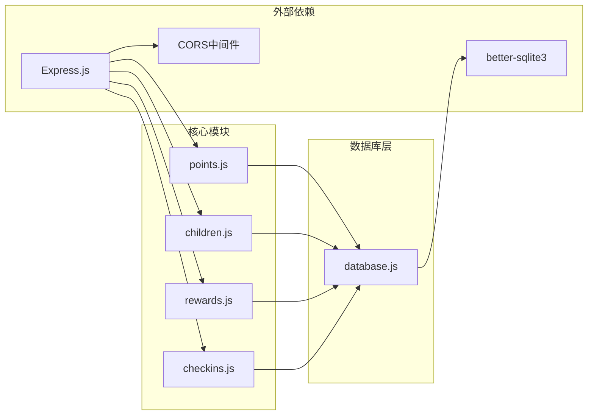
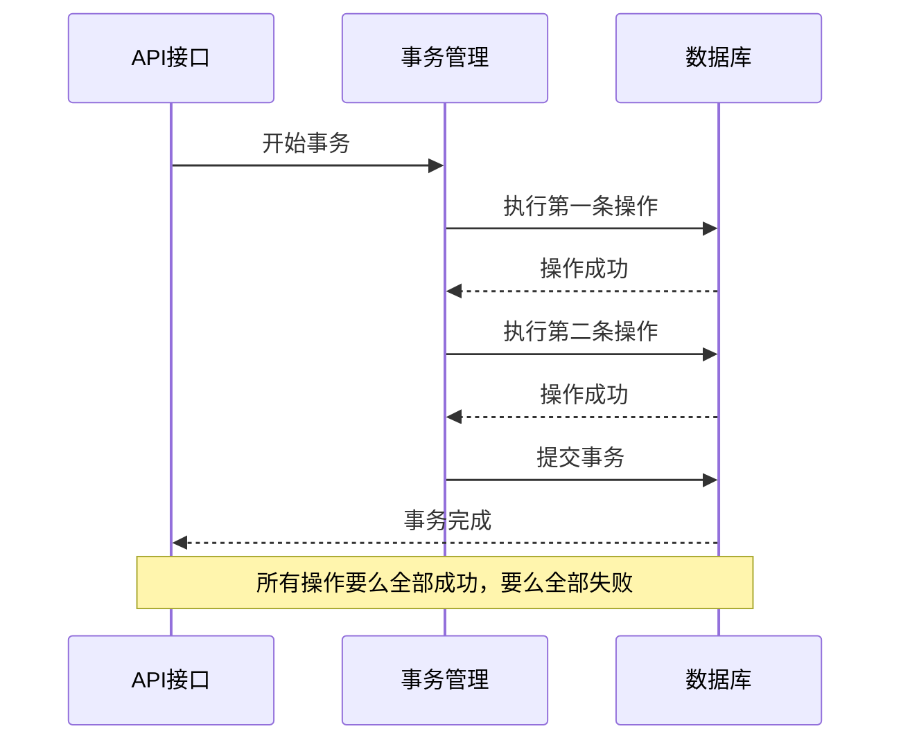

# 积分系统接口

<cite>
**本文档引用的文件**
- [points.js](file://star-park/server/src/routes/points.js)
- [database.js](file://star-park/server/src/database.js)
- [children.js](file://star-park/server/src/routes/children.js)
- [rewards.js](file://star-park/server/src/routes/rewards.js)
- [checkins.js](file://star-park/server/src/routes/checkins.js)
- [index.js](file://star-park/server/src/index.js)
- [api.md](file://docs/api.md)
- [index.js](file://star-park/miniprogram/src/api/index.js)
- [index.js](file://star-park/pc-admin/src/api/index.js)
</cite>

## 目录
1. [简介](#简介)
2. [项目结构](#项目结构)
3. [核心组件](#核心组件)
4. [架构概览](#架构概览)
5. [详细组件分析](#详细组件分析)
6. [依赖关系分析](#依赖关系分析)
7. [性能考虑](#性能考虑)
8. [故障排除指南](#故障排除指南)
9. [结论](#结论)

## 简介

星星乐园积分系统是一个双轨制的奖励管理系统，同时支持金钱奖励和积分奖励两种机制。该系统通过独立的积分表和金钱交易表实现分离管理，为家长提供了灵活的奖励发放和管理能力。

系统采用Express.js构建RESTful API，使用better-sqlite3作为数据库存储，实现了完整的积分生命周期管理，包括积分发放、查询、余额计算、兑换等功能。

## 项目结构

积分系统位于星星乐园项目的server目录中，主要包含以下核心文件：



**图表来源**
- [index.js:1-42](file://star-park/server/src/index.js#L1-L42)
- [points.js:1-74](file://star-park/server/src/routes/points.js#L1-L74)

**章节来源**
- [index.js:1-42](file://star-park/server/src/index.js#L1-L42)
- [database.js:1-111](file://star-park/server/src/database.js#L1-L111)

## 核心组件

### 数据库设计

积分系统基于SQLite数据库，采用双轨制设计：



**图表来源**
- [database.js:18-80](file://star-park/server/src/database.js#L18-L80)

### 积分表结构

积分系统的核心数据表设计如下：

| 字段名 | 类型 | 说明 | 约束 |
|--------|------|------|------|
| id | INTEGER | 主键 | 自增 |
| child_id | INTEGER | 孩子ID | 外键引用children表 |
| amount | INTEGER | 积分数量 | 必填，允许负值 |
| reason | TEXT | 积分原因 | 可选 |
| created_at | TEXT | 创建时间 | 默认当前时间 |

### 余额计算机制

系统通过两个独立的表实现双轨制设计：
- **金钱系统**: 使用transactions表记录收入和支出
- **积分系统**: 使用points表记录积分变动，结合children表的points_balance字段

**章节来源**
- [database.js:72-79](file://star-park/server/src/database.js#L72-L79)
- [database.js:19-26](file://star-park/server/src/database.js#L19-L26)

## 架构概览

积分系统采用分层架构设计，实现了清晰的关注点分离：



**图表来源**
- [index.js:6-11](file://star-park/server/src/index.js#L6-L11)
- [points.js:1-74](file://star-park/server/src/routes/points.js#L1-L74)

## 详细组件分析

### 积分记录管理

#### 获取积分记录接口

**接口定义**
- **路径**: `/api/points`
- **方法**: GET
- **参数**: child_id (必填)

**功能说明**
该接口提供积分记录的查询功能，同时返回当前余额信息。

**请求示例**
```javascript
// 获取特定孩子的积分记录
GET /api/points?child_id=1
```

**响应结构**
```json
{
  "records": [
    {
      "id": 1,
      "child_id": 1,
      "amount": 10,
      "reason": "完成任务奖励",
      "created_at": "2026-05-25 10:30:00",
      "child_name": "老二"
    }
  ],
  "balance": 45
}
```

#### 添加积分接口

**接口定义**
- **路径**: `/api/points`
- **方法**: POST
- **参数**: child_id, amount, reason

**功能说明**
该接口用于手动添加积分，支持家长为孩子发放特殊奖励。

**请求示例**
```javascript
// 发放积分奖励
POST /api/points
{
  "child_id": 1,
  "amount": 5,
  "reason": "帮助家务"
}
```

**响应结构**
```json
{
  "id": 101,
  "child_id": 1,
  "amount": 5,
  "reason": "帮助家务",
  "new_balance": 50
}
```

**章节来源**
- [points.js:5-28](file://star-park/server/src/routes/points.js#L5-L28)
- [points.js:30-72](file://star-park/server/src/routes/points.js#L30-L72)

### 余额查询系统

#### 积分余额查询

**接口定义**
- **路径**: `/api/children/:id/balance`
- **方法**: GET

**功能说明**
直接查询指定孩子的积分余额，无需加载完整的积分记录。

**响应示例**
```json
{
  "points_balance": 45
}
```

#### 交易记录查询

**接口定义**
- **路径**: `/api/children/:id/transactions`
- **方法**: GET
- **参数**: type (可选，默认返回积分记录)

**功能说明**
查询指定孩子的交易记录，支持type参数切换不同类型的记录。

**响应示例**
```json
{
  "records": [
    {
      "id": 1,
      "child_id": 1,
      "amount": 10,
      "reason": "完成任务奖励",
      "created_at": "2026-05-25 10:30:00",
      "type": "earn"
    }
  ]
}
```

**章节来源**
- [children.js:56-93](file://star-park/server/src/routes/children.js#L56-L93)

### 奖励兑换系统

#### 兑换奖励流程

积分系统支持两种奖励单位的兑换：



**图表来源**
- [rewards.js:89-164](file://star-park/server/src/routes/rewards.js#L89-L164)

**章节来源**
- [rewards.js:89-164](file://star-park/server/src/routes/rewards.js#L89-L164)

### 打卡与积分联动

#### 打卡奖励机制

当孩子完成任务打卡时，系统会自动处理积分和金钱奖励：



**图表来源**
- [checkins.js:30-87](file://star-park/server/src/routes/checkins.js#L30-L87)

**章节来源**
- [checkins.js:30-87](file://star-park/server/src/routes/checkins.js#L30-L87)

## 依赖关系分析

### 组件耦合度

积分系统与其他模块的依赖关系如下：



**图表来源**
- [index.js:1-42](file://star-park/server/src/index.js#L1-L42)
- [database.js:1-11](file://star-park/server/src/database.js#L1-L11)

### 数据一致性保证

系统通过事务机制确保数据一致性：



**图表来源**
- [points.js:43-57](file://star-park/server/src/routes/points.js#L43-L57)
- [rewards.js:107-154](file://star-park/server/src/routes/rewards.js#L107-L154)

**章节来源**
- [points.js:43-57](file://star-park/server/src/routes/points.js#L43-L57)
- [rewards.js:107-154](file://star-park/server/src/routes/rewards.js#L107-L154)

## 性能考虑

### 数据库优化

1. **WAL模式**: 启用Write-Ahead Logging模式提升并发性能
2. **外键约束**: 确保数据完整性
3. **索引策略**: 在常用查询字段上建立索引

### 缓存策略

建议在应用层实现适当的缓存机制：
- 孩子信息缓存
- 最近交易记录缓存
- 奖励进度缓存

### API性能优化

1. **批量查询**: 支持按日期范围查询
2. **分页机制**: 大量记录时使用分页
3. **条件过滤**: 支持多条件组合查询

## 故障排除指南

### 常见错误类型

| 错误代码 | 说明 | 解决方案 |
|----------|------|----------|
| 400 | 参数验证失败 | 检查必填参数是否完整 |
| 404 | 资源不存在 | 确认ID是否正确 |
| 400 | 余额不足 | 检查当前余额是否足够 |
| 500 | 服务器内部错误 | 查看服务器日志 |

### 调试建议

1. **启用详细日志**: 在开发环境中开启详细错误信息
2. **单元测试**: 为关键业务逻辑编写测试用例
3. **监控指标**: 监控API响应时间和错误率

**章节来源**
- [api.md:246-253](file://docs/api.md#L246-L253)

## 结论

星星乐园积分系统通过双轨制设计实现了灵活的奖励管理机制。系统采用模块化架构，清晰分离了积分管理和金钱管理的功能边界，同时通过事务机制确保了数据的一致性和完整性。

该系统的主要优势包括：
- **双轨制设计**: 同时支持积分和金钱两种奖励形式
- **事务安全**: 关键操作都包含在事务中执行
- **扩展性强**: 模块化设计便于功能扩展
- **用户体验**: 提供了完整的前端界面支持

未来可以考虑的功能增强：
- 积分有效期管理
- 积分转账功能
- 更丰富的统计报表
- 积分规则配置管理