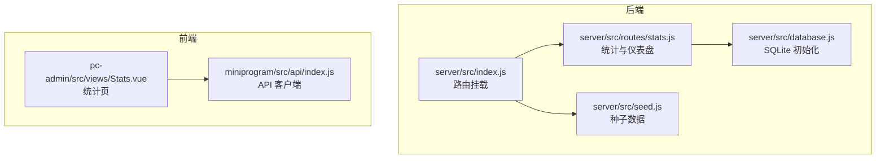
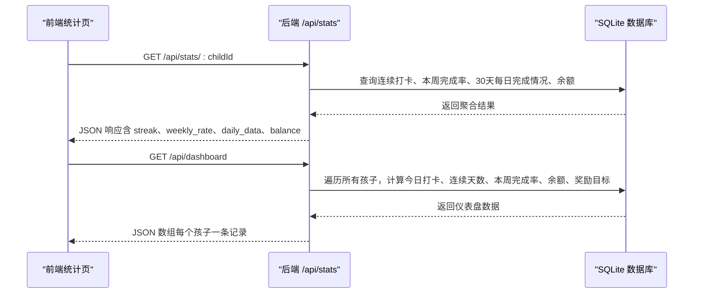
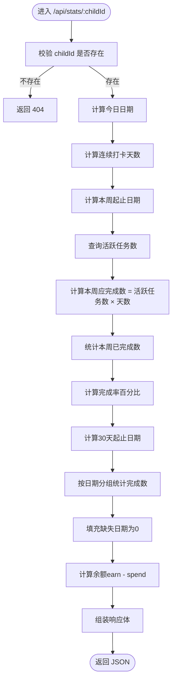
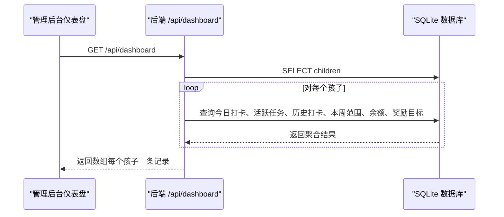
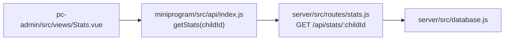
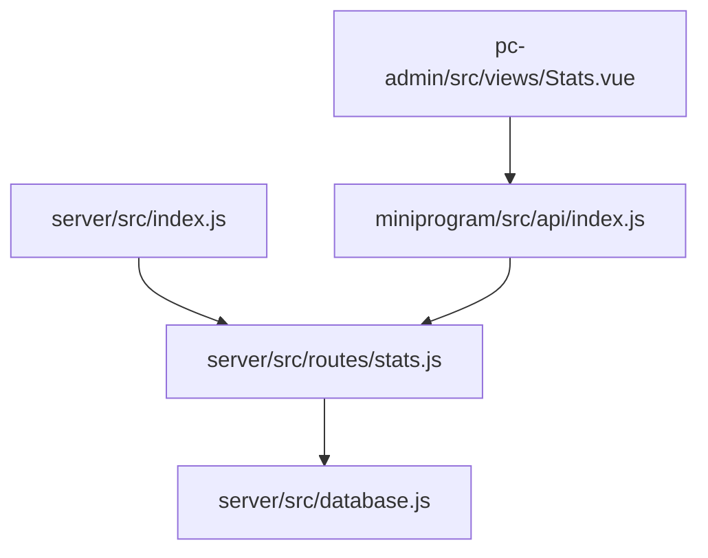
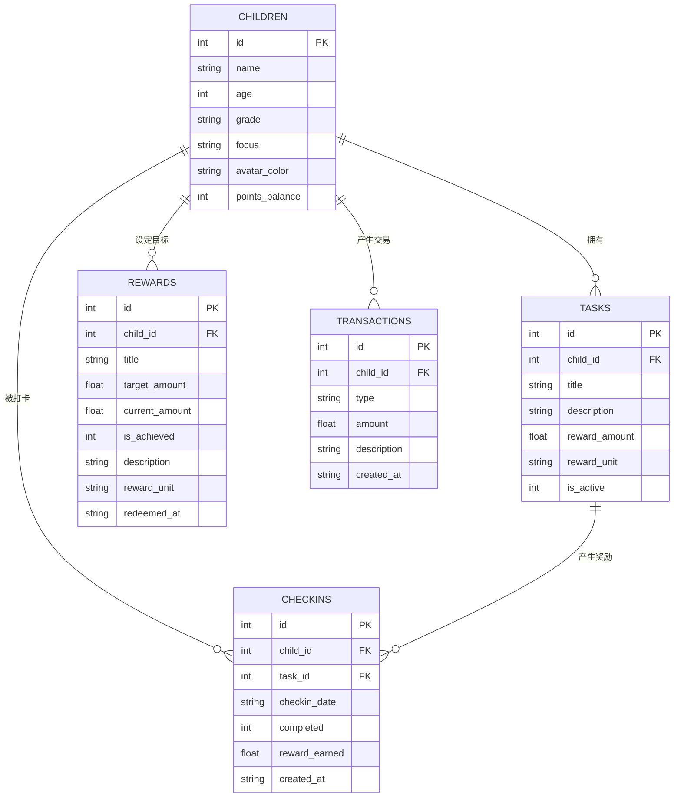

# 统计分析接口

<cite>
**本文引用的文件**
- [stats.js](file://star-park/server/src/routes/stats.js)
- [index.js](file://star-park/server/src/index.js)
- [database.js](file://star-park/server/src/database.js)
- [api.md](file://docs/api.md)
- [Stats.vue](file://star-park/pc-admin/src/views/Stats.vue)
- [index.js](file://star-park/miniprogram/src/api/index.js)
- [ARCHITECTURE.md](file://docs/ARCHITECTURE.md)
- [seed.js](file://star-park/server/src/seed.js)
</cite>

## 目录
1. [简介](#简介)
2. [项目结构](#项目结构)
3. [核心组件](#核心组件)
4. [架构总览](#架构总览)
5. [详细组件分析](#详细组件分析)
6. [依赖关系分析](#依赖关系分析)
7. [性能考虑](#性能考虑)
8. [故障排查指南](#故障排查指南)
9. [结论](#结论)
10. [附录](#附录)

## 简介
本文件为“统计分析接口”的完整API文档，覆盖以下内容：
- 接口清单与调用方式：GET /api/stats/:childId、GET /api/dashboard
- 统计指标与计算逻辑：连续打卡天数、本周完成率、收支平衡、30天每日完成情况
- 时间范围查询与数据聚合算法
- 前端使用示例与图表渲染要点
- 数据缓存策略、性能优化与大数据量处理最佳实践

## 项目结构
后端采用 Express + SQLite 的轻量架构，统计分析接口位于后端路由模块中，并通过统一入口挂载至 /api/stats 与 /api/dashboard。

**图表来源**
- [index.js:20-27](file://star-park/server/src/index.js#L20-L27)
- [stats.js:1-182](file://star-park/server/src/routes/stats.js#L1-L182)
- [database.js:1-111](file://star-park/server/src/database.js#L1-L111)
- [seed.js:1-45](file://star-park/server/src/seed.js#L1-L45)
- [Stats.vue:1-291](file://star-park/pc-admin/src/views/Stats.vue#L1-L291)
- [index.js:1-75](file://star-park/miniprogram/src/api/index.js#L1-L75)

**章节来源**
- [index.js:13-27](file://star-park/server/src/index.js#L13-L27)
- [ARCHITECTURE.md:10-71](file://docs/ARCHITECTURE.md#L10-L71)

## 核心组件
- 统计路由模块：提供单个孩子统计与全站仪表盘数据
- 数据库层：SQLite 表结构与迁移脚本
- 前端统计页：展示热力图与完成率趋势图
- API 文档：接口规范与响应示例

**章节来源**
- [stats.js:6-101](file://star-park/server/src/routes/stats.js#L6-L101)
- [stats.js:103-179](file://star-park/server/src/routes/stats.js#L103-L179)
- [database.js:18-80](file://star-park/server/src/database.js#L18-L80)
- [api.md:200-221](file://docs/api.md#L200-L221)

## 架构总览
后端通过中间件接收请求，路由层解析参数并访问数据库，最终返回JSON响应；前端通过HTTP客户端调用后端接口并渲染图表。

**图表来源**
- [stats.js:6-101](file://star-park/server/src/routes/stats.js#L6-L101)
- [stats.js:103-179](file://star-park/server/src/routes/stats.js#L103-L179)
- [database.js:18-80](file://star-park/server/src/database.js#L18-L80)

## 详细组件分析

### 接口：GET /api/stats/:childId（单个孩子统计）
- 功能概述
  - 返回指定孩子的关键统计指标，便于前端绘制热力图与趋势图。
- 请求参数
  - 路径参数：childId（数字）
- 响应字段
  - child_id：孩子ID
  - streak：连续打卡天数（从今天或昨天向前连续）
  - weekly_rate：本周完成率（百分比）
  - weekly_checkins：本周已完成打卡数
  - weekly_expected：本周应完成打卡数（活跃任务数 × 从周初到今天的天数）
  - active_tasks：当前活跃任务数
  - balance：余额（总收入 - 总支出）
  - daily_data：最近30天每日完成情况数组，元素包含 date 与 count
- 计算逻辑与算法
  - 连续打卡天数：从今天或昨天开始向前扫描历史打卡日期集合，遇到断档停止。
  - 本周完成率：本周完成数 / 本周应完成数，保留整数百分比。
  - 30天每日完成情况：按日期分组统计完成数，填充缺失日期为0。
  - 余额：分别统计 earn 与 spend 类型交易的合计差额。
- 时间范围查询
  - 今日：YYYY-MM-DD
  - 本周：周一至今天
  - 30天：从30天前到今天
- 前端使用示例
  - 在管理后台统计页中，选择孩子后调用该接口，将 daily_data 渲染为热力图。
- 错误处理
  - 孩子不存在返回404；异常返回500。

**图表来源**
- [stats.js:6-101](file://star-park/server/src/routes/stats.js#L6-L101)

**章节来源**
- [stats.js:6-101](file://star-park/server/src/routes/stats.js#L6-L101)
- [api.md:200-215](file://docs/api.md#L200-L215)

### 接口：GET /api/dashboard（仪表盘数据）
- 功能概述
  - 返回所有孩子的实时统计与今日打卡详情，用于管理后台仪表盘。
- 响应结构
  - 数组，每条记录代表一个孩子，包含：
    - 今日打卡详情（today_checkins）
    - 活跃任务列表（active_tasks）
    - 连续打卡天数（streak）
    - 本周完成率（weekly_rate）
    - 余额（balance）
    - 积分余额（points_balance）
    - 未达成奖励目标（rewards）
- 计算逻辑
  - 与单个孩子统计类似，但对每个孩子重复计算。
- 前端使用示例
  - 管理后台仪表盘页面加载时调用该接口，渲染每个孩子的状态卡片。

**图表来源**
- [stats.js:103-179](file://star-park/server/src/routes/stats.js#L103-L179)
- [database.js:18-80](file://star-park/server/src/database.js#L18-L80)

**章节来源**
- [stats.js:103-179](file://star-park/server/src/routes/stats.js#L103-L179)
- [api.md:217-221](file://docs/api.md#L217-L221)

### 前端集成与图表渲染
- 管理后台统计页
  - 通过 API 客户端获取统计数据，渲染“最近30天打卡热力图”和“完成率趋势图”。
  - 支持按周/月切换趋势图粒度。
- 小程序端 API 客户端
  - 提供 getStats(childId) 方法，统一转发到 /api/stats/:childId。

**图表来源**
- [Stats.vue:68-82](file://star-park/pc-admin/src/views/Stats.vue#L68-L82)
- [index.js:48-49](file://star-park/miniprogram/src/api/index.js#L48-L49)
- [stats.js:6-101](file://star-park/server/src/routes/stats.js#L6-L101)
- [database.js:1-111](file://star-park/server/src/database.js#L1-L111)

**章节来源**
- [Stats.vue:1-291](file://star-park/pc-admin/src/views/Stats.vue#L1-L291)
- [index.js:1-75](file://star-park/miniprogram/src/api/index.js#L1-L75)

## 依赖关系分析
- 路由依赖
  - /api/stats 与 /api/dashboard 共用同一路由模块，实现统计与仪表盘功能。
- 数据库依赖
  - 统计接口依赖 children、tasks、checkins、transactions、rewards 等表。
- 前后端依赖
  - 前端通过 HTTP 客户端调用后端接口，不直接导入后端模块。

**图表来源**
- [index.js:20-27](file://star-park/server/src/index.js#L20-L27)
- [stats.js:1-182](file://star-park/server/src/routes/stats.js#L1-L182)
- [database.js:1-111](file://star-park/server/src/database.js#L1-L111)
- [Stats.vue:1-291](file://star-park/pc-admin/src/views/Stats.vue#L1-L291)
- [index.js:1-75](file://star-park/miniprogram/src/api/index.js#L1-L75)

**章节来源**
- [index.js:20-27](file://star-park/server/src/index.js#L20-L27)
- [ARCHITECTURE.md:117-143](file://docs/ARCHITECTURE.md#L117-L143)

## 性能考虑
- 数据库层面
  - 使用 WAL 模式提升并发读写性能。
  - 为常用查询建立索引（建议在 checkin_date、child_id、task_id 等列上建立索引，以加速统计查询）。
- 查询优化
  - 连续打卡扫描：先取 DISTINCT checkin_date 并构建集合，再线性回溯，时间复杂度 O(d)，其中 d 为历史天数。
  - 本周完成率：使用日期范围过滤，避免全表扫描。
  - 30天每日完成情况：按日期分组统计，填充缺失日期，避免跨表连接。
- 缓存策略
  - 前端缓存：对最近一次查询结果进行短期缓存（如 1 分钟），减少重复请求。
  - 后端缓存：对热点数据（如活跃任务数、余额）可在进程内存中缓存，设置 TTL 或基于变更事件失效。
- 大数据量处理
  - 分页与节流：若未来数据量增长，建议引入分页或按月聚合。
  - 异步统计：对复杂聚合任务可异步生成并落库，前端轮询结果。
- 前端渲染优化
  - ECharts 图表按需初始化与销毁，窗口 resize 时重绘。
  - 避免在渲染过程中进行大量计算，提前在后端完成聚合。

[本节为通用性能指导，无需特定文件引用]

## 故障排查指南
- 常见问题
  - 孩子不存在：/api/stats/:childId 返回 404，检查 childId 是否正确。
  - 服务器内部错误：后端捕获异常返回 500，查看服务端日志定位 SQL 或业务逻辑问题。
  - 统计结果异常：确认数据库中是否存在有效数据（checkins、transactions、rewards）。
- 排查步骤
  - 核对请求路径与参数：childId 是否为数字且存在。
  - 检查数据库表结构与迁移是否完成。
  - 查看服务端控制台输出与日志。
- 建议
  - 在前端增加加载态与错误提示，提升用户体验。
  - 对关键接口增加超时与重试机制。

**章节来源**
- [stats.js:8-100](file://star-park/server/src/routes/stats.js#L8-L100)
- [stats.js:104-179](file://star-park/server/src/routes/stats.js#L104-L179)

## 结论
统计分析接口提供了连续打卡、本周完成率、收支平衡与30天每日完成情况等核心指标，配合前端图表渲染形成直观的可视化面板。通过合理的数据库索引、缓存与查询优化，可在小规模家庭场景下获得稳定性能。随着数据规模增长，建议引入分页、异步聚合与更细粒度的缓存策略。

[本节为总结性内容，无需特定文件引用]

## 附录

### API 规范摘要
- GET /api/stats/:childId
  - 请求：childId（路径参数）
  - 响应：包含 streak、weekly_rate、weekly_checkins、weekly_expected、active_tasks、balance、daily_data
- GET /api/dashboard
  - 请求：无
  - 响应：数组，每条记录包含今日打卡详情、活跃任务、连续天数、完成率、余额、积分余额、未达成奖励目标

**章节来源**
- [api.md:200-221](file://docs/api.md#L200-L221)

### 数据模型概览

**图表来源**
- [database.js:18-80](file://star-park/server/src/database.js#L18-L80)

### 种子数据与初始化
- 初始化脚本会在数据库中插入示例孩子、任务与奖励目标，便于快速验证统计接口。

**章节来源**
- [seed.js:1-45](file://star-park/server/src/seed.js#L1-L45)