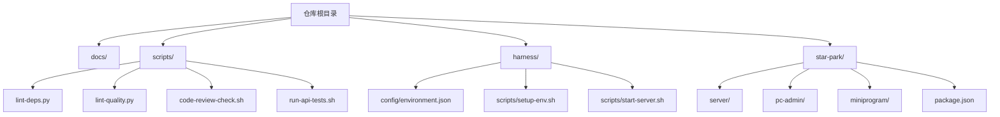
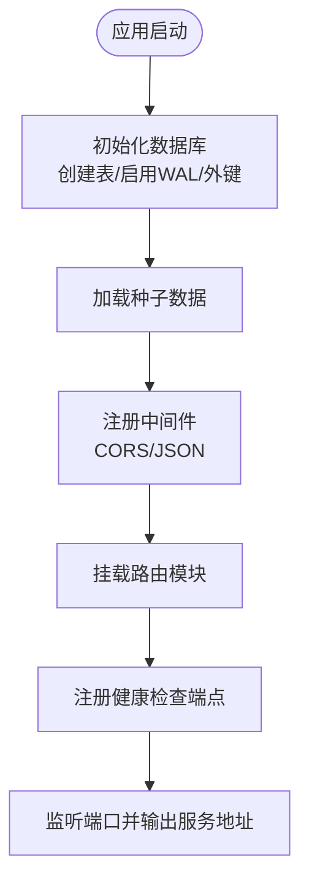
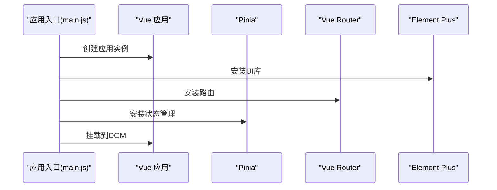
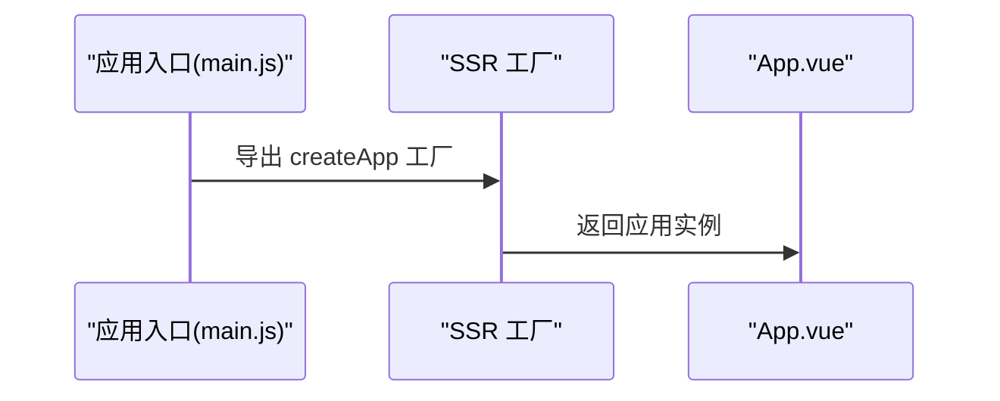
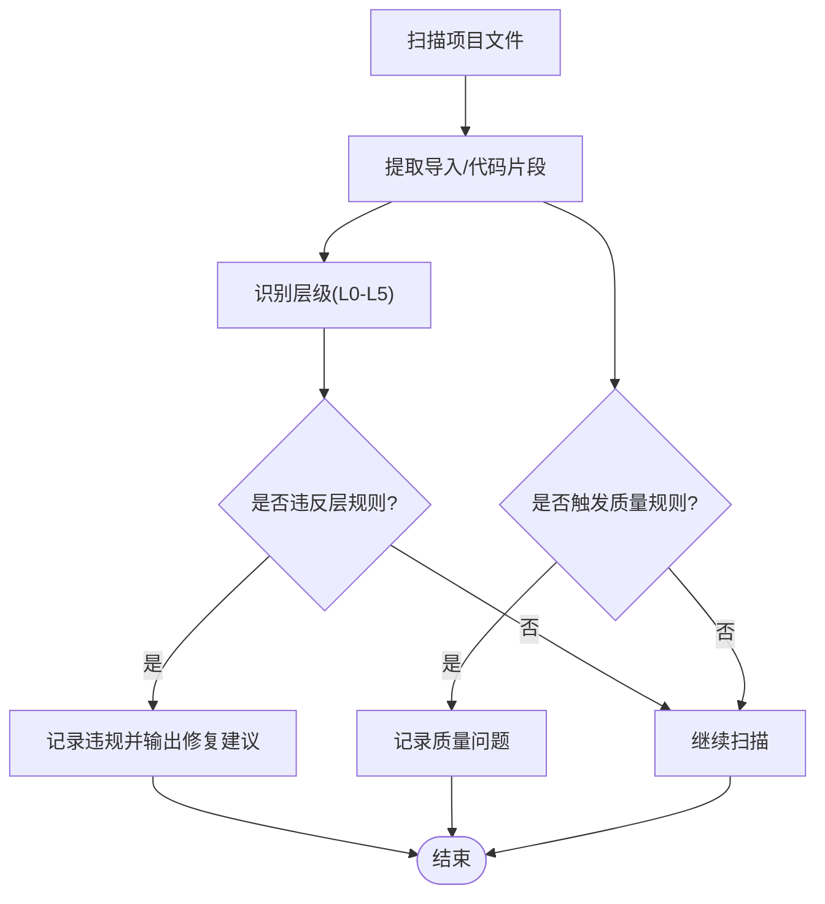
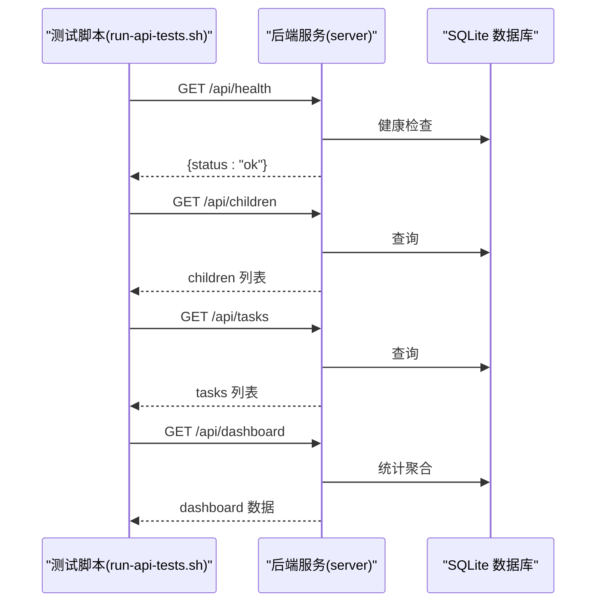
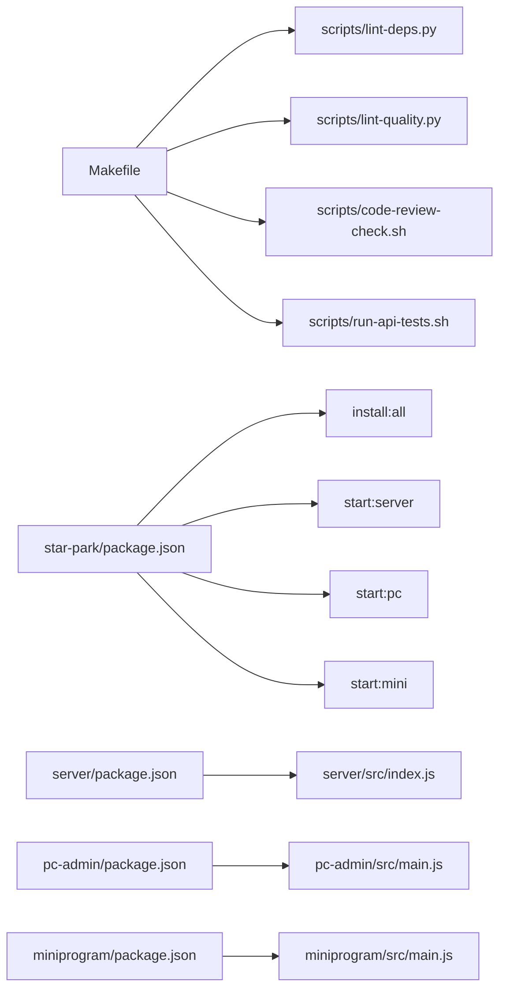

# 开发者指南

<cite>
**本文引用的文件**
- [docs/DEVELOPMENT.md](file://docs/DEVELOPMENT.md)
- [docs/ARCHITECTURE.md](file://docs/ARCHITECTURE.md)
- [Makefile](file://Makefile)
- [scripts/code-review-check.sh](file://scripts/code-review-check.sh)
- [scripts/run-api-tests.sh](file://scripts/run-api-tests.sh)
- [scripts/lint-deps.py](file://scripts/lint-deps.py)
- [scripts/lint-quality.py](file://scripts/lint-quality.py)
- [harness/config/environment.json](file://harness/config/environment.json)
- [star-park/package.json](file://star-park/package.json)
- [star-park/server/src/index.js](file://star-park/server/src/index.js)
- [star-park/server/src/database.js](file://star-park/server/src/database.js)
- [star-park/server/src/routes/rewards.js](file://star-park/server/src/routes/rewards.js)
- [star-park/pc-admin/src/main.js](file://star-park/pc-admin/src/main.js)
- [star-park/pc-admin/src/api/index.js](file://star-park/pc-admin/src/api/index.js)
- [star-park/pc-admin/src/views/Rewards.vue](file://star-park/pc-admin/src/views/Rewards.vue)
- [star-park/pc-admin/vite.config.js](file://star-park/pc-admin/vite.config.js)
- [star-park/miniprogram/src/main.js](file://star-park/miniprogram/src/main.js)
- [star-park/miniprogram/src/api/index.js](file://star-park/miniprogram/src/api/index.js)
- [star-park/miniprogram/src/pages/rewards/index.vue](file://star-park/miniprogram/src/pages/rewards/index.vue)
- [star-park/miniprogram/src/pages.json](file://star-park/miniprogram/src/pages.json)
- [star-park/server/package.json](file://star-park/server/package.json)
- [star-park/pc-admin/package.json](file://star-park/pc-admin/package.json)
- [star-park/miniprogram/package.json](file://star-park/miniprogram/package.json)
- [docs/exec-specs/completed/reward-management/acceptance.md](file://docs/exec-specs/completed/reward-management/acceptance.md)
- [docs/exec-specs/completed/reward-management/tasks.md](file://docs/exec-specs/completed/reward-management/tasks.md)
- [harness/scripts/setup-env.sh](file://harness/scripts/setup-env.sh)
- [harness/scripts/start-server.sh](file://harness/scripts/start-server.sh)
</cite>

## 更新摘要
**变更内容**
- 增强了monorepo开发基础设施，添加了统一的npm脚本管理多个项目
- 完善了环境配置和代理设置，支持开发环境的API转发
- 新增了奖励管理功能的完整验收标准和任务文档
- 扩展了小程序的奖励查看页面和管理后台的奖励管理功能
- 优化了后端奖励API，支持描述、奖励单位和兑换逻辑

## 目录
1. [简介](#简介)
2. [项目结构](#项目结构)
3. [核心组件](#核心组件)
4. [架构总览](#架构总览)
5. [详细组件分析](#详细组件分析)
6. [依赖分析](#依赖分析)
7. [性能考虑](#性能考虑)
8. [故障排查指南](#故障排查指南)
9. [结论](#结论)
10. [附录](#附录)

## 简介
本指南面向StarParadise项目的开发者，提供从环境准备、开发流程、代码规范、测试策略、构建与部署到运维与故障排查的完整说明。项目采用前后端分离的monorepo架构，后端基于Express + SQLite提供REST API，前端包含管理后台（PC端）与小程序（uni-app），并辅以统一的脚手架与验证工具链。

**更新** 增强了开发基础设施，提供了更完善的monorepo管理和多项目脚本支持。

## 项目结构
- 顶层包含文档、脚本、测试夹具与构建产物输出等。
- star-park 子目录下包含三个主要子项目：server（后端）、pc-admin（PC管理后台）、miniprogram（小程序）。
- scripts目录提供编码规范、质量检查、API测试、依赖约束等工具脚本。
- harness目录提供环境配置与端到端验证场景定义。

**图表来源**
- [Makefile:1-70](file://Makefile#L1-L70)
- [docs/DEVELOPMENT.md:65-92](file://docs/DEVELOPMENT.md#L65-L92)
- [star-park/package.json:1-13](file://star-park/package.json#L1-L13)

**章节来源**
- [docs/DEVELOPMENT.md:65-92](file://docs/DEVELOPMENT.md#L65-L92)

## 核心组件
- 后端服务（server）
  - 作用：提供REST API，处理儿童、任务、打卡、奖励、积分等业务。
  - 入口：Express应用，挂载多个路由模块，并在启动时初始化SQLite与种子数据。
  - 数据层：SQLite数据库，启用WAL与外键约束，提供DDL与迁移逻辑。
- 管理后台（pc-admin）
  - 作用：家长使用的数据统计与管理界面，基于Vue 3 + Element Plus。
  - 入口：应用初始化注册Pinia、路由、UI库与图标，挂载到DOM。
- 小程序（miniprogram）
  - 作用：移动端打卡界面，基于uni-app + Vue 3。
  - 入口：SSR应用工厂函数，按平台打包（H5/微信小程序）。

**更新** 奖励管理功能已完善，支持完整的CRUD操作和兑换逻辑。

**章节来源**
- [docs/ARCHITECTURE.md:95-114](file://docs/ARCHITECTURE.md#L95-L114)
- [star-park/server/src/index.js:1-42](file://star-park/server/src/index.js#L1-L42)
- [star-park/server/src/database.js:1-90](file://star-park/server/src/database.js#L1-L90)
- [star-park/pc-admin/src/main.js:1-22](file://star-park/pc-admin/src/main.js#L1-L22)
- [star-park/miniprogram/src/main.js:1-8](file://star-park/miniprogram/src/main.js#L1-L8)

## 架构总览
- 分层架构与依赖约束
  - L0：数据层（database、seed），仅依赖标准库与npm包。
  - L1：后端路由（routes/*），依赖L0。
  - L2：后端入口（index），依赖L0、L1。
  - L3：前端API/组件/路由/Store，仅依赖npm包。
  - L4：前端页面/视图，依赖L3。
  - L5：前端入口，依赖L3、L4。
  - 禁止跨子项目直接导入；同一子项目内页面/视图不得互相导入。
- 数据流
  - 客户端请求经中间件进入路由处理，访问SQLite查询，返回JSON；错误统一处理。
- 关键设计决策
  - SQLite嵌入式数据库、monorepo多包结构、uni-app多端运行、积分与余额双系统。

```mermaid
graph TD
subgraph "L5 前端入口"
MP_MAIN["miniprogram/src/main.js"]
PC_MAIN["pc-admin/src/main.js"]
end
subgraph "L4 前端页面/视图"
MP_PAGES["miniprogram/src/pages/..."]
PC_VIEWS["pc-admin/src/views/..."]
end
subgraph "L3 前端组件/API"
MP_API["miniprogram/src/api/..."]
MP_COMP["miniprogram/src/components/..."]
PC_API["pc-admin/src/api/..."]
PC_COMP["pc-admin/src/components/..."]
PC_ROUTER["pc-admin/src/router/..."]
PC_STORE["pc-admin/src/stores/..."]
end
subgraph "L2 后端入口"
SRV_INDEX["server/src/index.js"]
end
subgraph "L1 后端路由"
SRV_CHILDREN["server/src/routes/children.js"]
SRV_TASKS["server/src/routes/tasks.js"]
SRV_CHECKINS["server/src/routes/checkins.js"]
SRV_REWARDS["server/src/routes/rewards.js"]
SRV_STATS["server/src/routes/stats.js"]
SRV_POINTS["server/src/routes/points.js"]
end
subgraph "L0 数据层"
SRV_DB["server/src/database.js"]
SRV_SEED["server/src/seed.js"]
end
MP_MAIN --> MP_PAGES
MP_PAGES --> MP_API
MP_PAGES --> MP_COMP
PC_MAIN --> PC_VIEWS
PC_VIEWS --> PC_API
PC_VIEWS --> PC_COMP
PC_MAIN --> PC_ROUTER
PC_MAIN --> PC_STORE
SRV_INDEX --> SRV_CHILDREN
SRV_INDEX --> SRV_TASKS
SRV_INDEX --> SRV_CHECKINS
SRV_INDEX --> SRV_REWARDS
SRV_INDEX --> SRV_STATS
SRV_INDEX --> SRV_POINTS
SRV_CHILDREN --> SRV_DB
SRV_TASKS --> SRV_DB
SRV_CHECKINS --> SRV_DB
SRV_REWARDS --> SRV_DB
SRV_STATS --> SRV_DB
SRV_POINTS --> SRV_DB
SRV_SEED --> SRV_DB
```

**图表来源**
- [docs/ARCHITECTURE.md:14-69](file://docs/ARCHITECTURE.md#L14-L69)

**章节来源**
- [docs/ARCHITECTURE.md:73-94](file://docs/ARCHITECTURE.md#L73-L94)
- [docs/ARCHITECTURE.md:115-142](file://docs/ARCHITECTURE.md#L115-L142)

## 详细组件分析

### 后端服务（server）
- 启动与中间件
  - 启用CORS与JSON解析中间件。
  - 挂载多条API前缀路由，统一健康检查端点。
- 数据库初始化
  - 在本地data目录创建SQLite文件，启用WAL与外键约束。
  - 定义children、tasks、checkins、rewards、transactions、points等表。
  - 迁移：为children表新增points_balance列。
- 种子数据
  - 应用启动时初始化种子数据。

**更新** rewards表已添加description、reward_unit、redeemed_at字段支持，并提供完整的兑换逻辑。

**图表来源**
- [star-park/server/src/index.js:13-41](file://star-park/server/src/index.js#L13-L41)
- [star-park/server/src/database.js:17-89](file://star-park/server/src/database.js#L17-L89)

**章节来源**
- [star-park/server/src/index.js:1-42](file://star-park/server/src/index.js#L1-L42)
- [star-park/server/src/database.js:1-90](file://star-park/server/src/database.js#L1-L90)

### 管理后台（pc-admin）
- 应用初始化
  - 创建Vue应用实例，注册Element Plus图标，安装Pinia与路由。
  - 引入全局样式并挂载到DOM。
- 依赖与构建
  - 基于Vite进行开发与生产构建，依赖Vue、Vue Router、Pinia、Element Plus、ECharts、Axios等。
- 开发环境配置
  - Vite代理配置支持API转发至后端服务。

**更新** Rewards.vue页面已全面重写，支持孩子筛选、奖励卡片网格、编辑对话框和兑换功能。

**图表来源**
- [star-park/pc-admin/src/main.js:10-21](file://star-park/pc-admin/src/main.js#L10-L21)

**章节来源**
- [star-park/pc-admin/src/main.js:1-22](file://star-park/pc-admin/src/main.js#L1-L22)
- [star-park/pc-admin/package.json:1-26](file://star-park/pc-admin/package.json#L1-L26)
- [star-park/pc-admin/vite.config.js:1-25](file://star-park/pc-admin/vite.config.js#L1-L25)

### 小程序（miniprogram）
- 应用入口
  - 使用SSR工厂函数创建应用实例，按平台打包（H5/微信小程序）。
- 依赖与构建
  - 基于uni-app与Vite，依赖Vue、Pinia与相关平台插件。
- 奖励查看页面
  - 新增pages/rewards/index.vue，支持孩子选择器和奖励列表展示。

**更新** 小程序已添加奖励查看页面，支持奖励进度显示和统计信息。

**图表来源**
- [star-park/miniprogram/src/main.js:4-7](file://star-park/miniprogram/src/main.js#L4-L7)

**章节来源**
- [star-park/miniprogram/src/main.js:1-8](file://star-park/miniprogram/src/main.js#L1-L8)
- [star-park/miniprogram/package.json:1-29](file://star-park/miniprogram/package.json#L1-L29)

### 依赖约束与质量检查
- 依赖约束（lint-deps.py）
  - 严格校验模块层级导入方向，禁止跨子项目直接导入，禁止同一子项目页面/视图互相导入。
  - 对违反规则的文件输出修复建议（如依赖注入、接口抽象）。
- 代码质量（lint-quality.py）
  - 禁止服务端代码使用原始console.log；允许特定文件与场景的例外。
  - 控制文件规模（默认最大500行），对已知大文件给出例外。
- 编码规范（code-review-check.sh）
  - 检查是否存在debugger语句与TODO标记（可选提醒）。

**图表来源**
- [scripts/lint-deps.py:152-244](file://scripts/lint-deps.py#L152-L244)
- [scripts/lint-quality.py:47-119](file://scripts/lint-quality.py#L47-L119)
- [scripts/code-review-check.sh:12-31](file://scripts/code-review-check.sh#L12-31)

**章节来源**
- [scripts/lint-deps.py:1-248](file://scripts/lint-deps.py#L1-248)
- [scripts/lint-quality.py:1-124](file://scripts/lint-quality.py#L1-124)
- [scripts/code-review-check.sh:1-35](file://scripts/code-review-check.sh#L1-35)

### API测试与端到端验证
- API测试（run-api-tests.sh）
  - 健康检查：调用/api/health，期望返回包含"ok"的JSON。
  - 功能验证：获取children、tasks、dashboard等端点。
- 端到端验证（Makefile + harness）
  - Makefile提供verify目标，遍历scripts/verify/*.sh执行验证场景。
  - harness/config/environment.json定义功能场景（健康检查、打卡流程）与测试环境变量。

**更新** 新增了奖励管理的完整验收标准和任务文档，支持奖励创建、更新、删除和兑换操作的验证。

**图表来源**
- [scripts/run-api-tests.sh:10-36](file://scripts/run-api-tests.sh#L10-L36)
- [star-park/server/src/index.js:29-32](file://star-park/server/src/index.js#L29-L32)

**章节来源**
- [scripts/run-api-tests.sh:1-36](file://scripts/run-api-tests.sh#L1-36)
- [Makefile:54-60](file://Makefile#L54-L60)
- [harness/config/environment.json:19-49](file://harness/config/environment.json#L19-L49)

## 依赖分析
- 项目依赖
  - server：express、better-sqlite3、cors、dayjs。
  - pc-admin：vue、vue-router、pinia、element-plus、echarts、axios、dayjs及相关Vite插件。
  - miniprogram：uni-app生态、vue、pinia及相关Vite插件。
- 构建与脚本
  - Makefile提供统一入口：build、test、lint、lint-arch、verify、api-doc、check-db、api-test、check-conventions、setup-env、start-server、teardown-env。
  - scripts目录提供架构约束、质量检查、编码规范与API测试脚本。
- Monorepo脚本管理
  - star-park/package.json提供统一的安装和启动脚本。

**更新** 新增了monorepo级别的npm脚本管理，支持一键安装所有依赖和启动各个服务。

**图表来源**
- [Makefile:1-70](file://Makefile#L1-L70)
- [star-park/package.json:1-13](file://star-park/package.json#L1-L13)
- [star-park/server/package.json:1-16](file://star-park/server/package.json#L1-L16)
- [star-park/pc-admin/package.json:1-26](file://star-park/pc-admin/package.json#L1-L26)
- [star-park/miniprogram/package.json:1-29](file://star-park/miniprogram/package.json#L1-L29)

**章节来源**
- [Makefile:1-70](file://Makefile#L1-L70)
- [star-park/package.json:1-13](file://star-park/package.json#L1-L13)
- [star-park/server/package.json:1-16](file://star-park/server/package.json#L1-L16)
- [star-park/pc-admin/package.json:1-26](file://star-park/pc-admin/package.json#L1-L26)
- [star-park/miniprogram/package.json:1-29](file://star-park/miniprogram/package.json#L1-L29)

## 性能考虑
- 数据库
  - 启用WAL模式与外键约束，提升并发与一致性。
  - 建议对高频查询字段建立索引（如checkins.child_id、checkins.task_id、children.id等）。
- 服务端
  - 使用CORS与JSON中间件，避免不必要的中间件链路。
  - 控制路由粒度与响应体大小，减少序列化开销。
- 前端
  - 按需引入UI组件与图标，避免全量引入。
  - 合理拆分大型页面组件，降低首屏渲染压力。
- 构建
  - 使用Vite的预构建与懒加载策略，减少bundle体积。
  - 生产构建开启压缩与Tree-shaking。

## 故障排查指南
- 环境与依赖
  - 确认Node.js版本满足要求，Python 3.10+用于质量脚本。
  - 使用统一命令安装依赖与启动服务，避免局部安装导致的版本不一致。
- 服务启动
  - 后端默认端口3001，可通过环境变量调整；确保SQLite数据目录可写。
  - 健康检查失败时，优先检查服务进程与端口占用。
- 代理配置
  - 管理后台开发时需配置Vite代理转发至后端API（/api -> http://localhost:3001）。
- 依赖约束与质量检查
  - 若lint-arch失败，根据提示修正模块导入方向或拆分文件。
  - 若质量检查失败，移除服务端console.log或在允许范围内保留。
- API测试
  - API测试失败时，确认后端已启动且端点可用；核对返回内容格式。

**更新** 新增了monorepo脚本的使用指导，推荐使用star-park/package.json中的统一脚本。

**章节来源**
- [docs/DEVELOPMENT.md:94-116](file://docs/DEVELOPMENT.md#L94-L116)
- [scripts/lint-deps.py:184-218](file://scripts/lint-deps.py#L184-L218)
- [scripts/lint-quality.py:74-97](file://scripts/lint-quality.py#L74-L97)
- [scripts/run-api-tests.sh:13-32](file://scripts/run-api-tests.sh#L13-L32)
- [star-park/package.json:6-11](file://star-park/package.json#L6-L11)

## 结论
本指南提供了StarParadise项目的开发规范、流程与工具链说明。通过严格的分层约束、质量检查与端到端验证，结合清晰的构建与测试流程，能够帮助团队高效协作并保持代码质量与可维护性。

**更新** 增强的monorepo基础设施和奖励管理功能为项目开发提供了更好的支持和验证保障。

## 附录

### 开发工作流程
- 环境准备
  - 安装Node.js 18+、npm 9+、Python 3.10+。
  - 克隆仓库并安装依赖，分别启动后端与前端服务。
- 分支管理
  - 建议采用功能分支开发，主分支仅合并通过CI的PR。
- 代码审查
  - 提交前执行编码规范检查与质量检查，确保无debugger与console.log滥用。
- 持续集成
  - CI中执行lint-arch、lint-quality、run-api-tests与verify，确保通过后再合并。

**更新** 推荐使用monorepo脚本进行环境准备和服务启动。

**章节来源**
- [docs/DEVELOPMENT.md:9-27](file://docs/DEVELOPMENT.md#L9-L27)
- [Makefile:41-52](file://Makefile#L41-L52)
- [scripts/code-review-check.sh:12-31](file://scripts/code-review-check.sh#L12-L31)
- [star-park/package.json:6-11](file://star-park/package.json#L6-L11)

### 代码规范与命名约定
- 编码规范
  - 禁止在生产代码中使用debugger与原始console.log（服务端）。
  - 保持文件规模合理，必要时拆分大型文件。
- 命名约定
  - 路由模块遵循REST风格，资源名词复数形式。
  - 组件与页面采用语义化命名，避免缩写。
- 注释规范
  - 关键函数与复杂逻辑提供简要注释，说明输入、输出与边界条件。
- Git提交规范
  - 提交信息采用类型+主题格式，如feat(server): 新增打卡接口。

**章节来源**
- [scripts/code-review-check.sh:12-31](file://scripts/code-review-check.sh#L12-L31)
- [scripts/lint-quality.py:14-44](file://scripts/lint-quality.py#L14-L44)

### 测试策略
- 单元测试
  - 建议为路由与工具函数补充单元测试，覆盖正常与异常路径。
- 集成测试
  - 使用现有API测试脚本作为集成测试基线，逐步扩展端到端场景。
- 端到端测试
  - 通过Makefile的verify目标与harness场景定义，执行端到端流程验证。

**更新** 新增了奖励管理功能的完整验收标准，支持奖励创建、更新、删除和兑换操作的端到端验证。

**章节来源**
- [scripts/run-api-tests.sh:10-36](file://scripts/run-api-tests.sh#L10-L36)
- [Makefile:54-60](file://Makefile#L54-L60)
- [harness/config/environment.json:25-49](file://harness/config/environment.json#L25-L49)
- [docs/exec-specs/completed/reward-management/acceptance.md:1-109](file://docs/exec-specs/completed/reward-management/acceptance.md#L1-L109)

### 构建与部署
- 构建命令
  - 后端：npm start/dev。
  - PC管理后台：vite dev/build/preview。
  - 小程序：uni与uni build（H5/微信小程序）。
- 环境配置
  - 环境变量：PORT、NODE_ENV。
  - 测试环境变量：NODE_ENV=test、PORT=3002。
- 部署流程
  - 使用Makefile统一入口，先构建再部署；确保SQLite数据目录权限与路径正确。

**更新** 新增了monorepo级别的构建脚本和环境配置管理。

**章节来源**
- [docs/DEVELOPMENT.md:29-64](file://docs/DEVELOPMENT.md#L29-L64)
- [docs/DEVELOPMENT.md:94-100](file://docs/DEVELOPMENT.md#L94-L100)
- [harness/config/environment.json:19-24](file://harness/config/environment.json#L19-L24)
- [star-park/package.json:6-11](file://star-park/package.json#L6-L11)

### 开发工具配置
- IDE设置
  - 启用ESLint/Prettier（若引入），保持统一格式。
  - 配置TypeScript（如使用）与Vue语言特性支持。
- 调试技巧
  - 使用浏览器开发者工具与Vite Devtools定位前端问题。
  - 后端使用--watch模式快速迭代，配合日志定位问题。
- 性能分析
  - 前端：使用浏览器性能面板与网络面板分析瓶颈。
  - 后端：结合日志与数据库查询计划分析慢查询。

**更新** Vite代理配置已完善，支持开发环境的API转发和外部API调用。

**章节来源**
- [docs/DEVELOPMENT.md:101-116](file://docs/DEVELOPMENT.md#L101-L116)
- [star-park/server/package.json:4-7](file://star-park/server/package.json#L4-L7)
- [star-park/pc-admin/vite.config.js:6-19](file://star-park/pc-admin/vite.config.js#L6-L19)

### 安全最佳实践
- 输入校验
  - 对所有API参数进行类型与范围校验，避免SQL注入与XSS。
- 认证与授权
  - 当前为演示环境，建议在生产中引入认证与权限控制。
- 日志与监控
  - 使用结构化日志，避免敏感信息泄露；记录关键操作审计日志。

### Monorepo开发脚本使用
- 统一安装依赖：`cd star-park && npm run install:all`
- 启动后端服务：`cd star-park && npm run start:server`
- 启动管理后台：`cd star-park && npm run start:pc`
- 启动小程序：`cd star-park && npm run start:mini`

**新增** monorepo级别的脚本管理，简化多项目开发和部署流程。

**章节来源**
- [star-park/package.json:6-11](file://star-park/package.json#L6-L11)

### 奖励管理功能实现
- 数据库迁移
  - rewards表新增description、reward_unit、redeemed_at字段。
- 后端API完善
  - 支持奖励的完整CRUD操作和兑换逻辑。
  - 事务处理确保数据一致性。
- 前端界面
  - 管理后台：完整的奖励管理界面，支持孩子筛选和兑换操作。
  - 小程序：奖励查看页面，支持进度展示和统计信息。

**新增** 奖励管理功能的完整实现，包括数据库迁移、API接口和前端界面。

**章节来源**
- [docs/exec-specs/completed/reward-management/tasks.md:1-683](file://docs/exec-specs/completed/reward-management/tasks.md#L1-L683)
- [star-park/server/src/routes/rewards.js:1-167](file://star-park/server/src/routes/rewards.js#L1-L167)
- [star-park/pc-admin/src/views/Rewards.vue:1-471](file://star-park/pc-admin/src/views/Rewards.vue#L1-L471)
- [star-park/miniprogram/src/pages/rewards/index.vue:1-320](file://star-park/miniprogram/src/pages/rewards/index.vue#L1-L320)