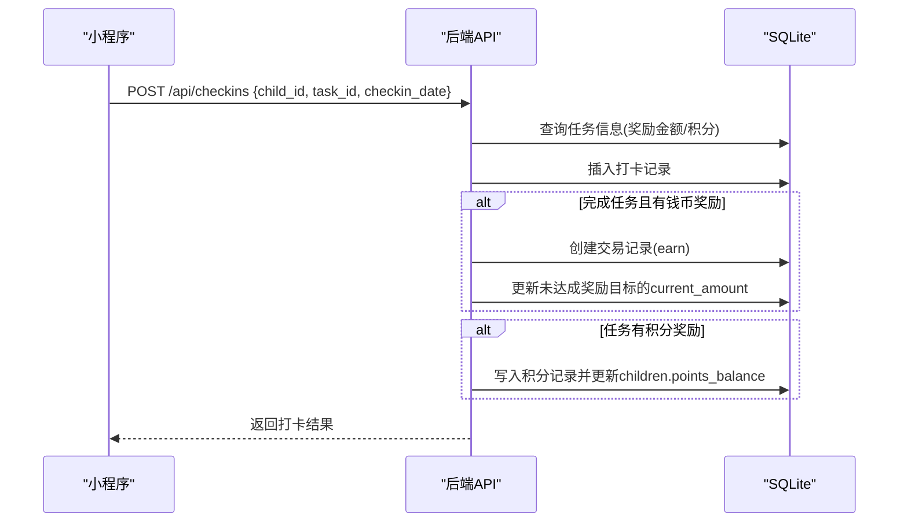
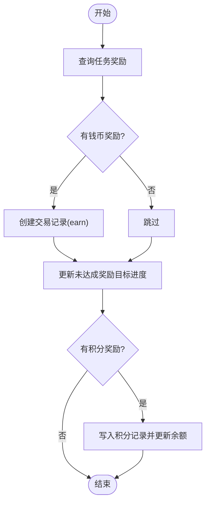

# 当前状态与演进方向

<cite>
**本文引用的文件**
- [ARCHITECTURE.md](file://docs/ARCHITECTURE.md)
- [api.md](file://docs/api.md)
- [app.js](file://star-park/server/src/app.js)
- [checkins.js](file://star-park/server/src/routes/checkins.js)
- [tasks.js](file://star-park/server/src/routes/tasks.js)
- [rewards.js](file://star-park/server/src/routes/rewards.js)
- [stats.js](file://star-park/server/src/routes/stats.js)
- [points.js](file://star-park/server/src/routes/points.js)
- [goals.js](file://star-park/server/src/routes/goals.js)
- [todos.js](file://star-park/server/src/routes/todos.js)
- [database.js](file://star-park/server/src/database.js)
- [TodoTree.vue](file://star-park/pc-admin/src/components/TodoTree.vue)
- [pages.json](file://star-park/miniprogram/src/pages.json)
- [index.vue（打卡页）](file://star-park/miniprogram/src/pages/checkin/index.vue)
- [router/index.js（管理后台路由）](file://star-park/pc-admin/src/router/index.js)
- [Dashboard.vue（管理后台仪表盘）](file://star-park/pc-admin/src/views/Dashboard.vue)
- [acceptance.md（目标与待办验收）](file://docs/exec-specs/completed/goals-todos-db-persistence/acceptance.md)
- [acceptance.md（奖励管理验收）](file://docs/exec-specs/completed/reward-management/acceptance.md)
- [spec.md（小程序打卡与钱包需求）](file://docs/exec-specs/miniprogram-checkin-wallet/spec.md)
</cite>

## 更新摘要
**变更内容**
- 新增待办任务层级结构功能：支持父子关系、拖拽排序、自动继承child_id等特性
- 增强待办任务管理能力：支持树形展示、级联删除、父子关系验证
- 改进用户体验：提供直观的拖拽界面和父子关系管理对话框

## 产品概述
星星乐园是面向多孩家庭的激励管理系统，围绕"孩子"维度提供任务、打卡、奖励目标与双货币激励（金钱余额 + 积分）的闭环体验。家长通过管理后台进行目标与奖励管理、数据查看；孩子与家长通过小程序完成每日打卡、查看记录与钱包明细。系统采用前后端分离架构：后端 Express + SQLite 提供 REST API，前端包含管理后台（Vue 3）与小程序（uni-app）。

- 目标用户：家长（管理与统计）、孩子（打卡与激励反馈）
- 核心价值：以"任务打卡 + 双货币激励"驱动习惯养成，可视化进度与连续打卡提升内驱力
- 适用场景：家庭日常学习/行为激励、多孩差异化目标管理、家长监督与复盘

**章节来源**
- [ARCHITECTURE.md:6-15](file://docs/ARCHITECTURE.md#L6-L15)
- [api.md:6-14](file://docs/api.md#L6-L14)

## 核心业务流程
- 任务创建与计划：家长在管理后台或小程序创建任务，可设置计划日期与奖励金额/积分
- 打卡与激励：孩子在小程序勾选今日任务并提交打卡；后端写入打卡记录、发放金钱交易（earn）与积分，并更新奖励目标进度
- 奖励兑换：家长在管理后台对已达成奖励进行兑换，按单位扣减对应余额（元或星星）
- 统计与看板：后端计算连续打卡天数、周完成率、近30天每日打卡、余额等，供管理后台仪表盘展示
- **待办任务层级管理**：家长维护年度目标与拆解待办，支持父子层级关系、优先级、预期积分、计划日期与关联目标，实现任务的精细化分解与管理



**图表来源**
- [checkins.js:40-106](file://star-park/server/src/routes/checkins.js#L40-L106)
- [rewards.js:115-179](file://star-park/server/src/routes/rewards.js#L115-L179)
- [points.js:30-70](file://star-park/server/src/routes/points.js#L30-L70)

**章节来源**
- [checkins.js:40-203](file://star-park/server/src/routes/checkins.js#L40-L203)
- [rewards.js:36-192](file://star-park/server/src/routes/rewards.js#L36-L192)
- [points.js:5-72](file://star-park/server/src/routes/points.js#L5-L72)
- [stats.js:6-182](file://star-park/server/src/routes/stats.js#L6-L182)

## 功能模块清单
- 孩子管理
  - 职责：创建/获取孩子信息，聚合任务与余额、积分
  - 价值：家长集中管理多孩信息，作为所有业务的数据主体
  - 验收要点：列表、详情、基础字段齐全
- 任务管理
  - 职责：CRUD 任务，支持计划日期、奖励金额/单位、积分奖励
  - 价值：将激励规则结构化，支撑打卡与奖励联动
  - 验收要点：排序（计划日期优先）、部分更新、删除级联清理打卡
- 打卡管理
  - 职责：提交打卡、自动打卡、查询记录；完成后发放金钱与积分，更新奖励进度
  - 价值：形成"行为—激励"闭环，提升坚持度
  - 验收要点：事务一致性、重复打卡防护（前端禁用+后端校验）、自动打卡批量处理
- 奖励目标
  - 职责：创建/更新/删除奖励目标，支持单位（元/星星），达成后兑换
  - 价值：用长期目标强化动机，兑换机制增强成就感
  - 验收要点：进度同步、兑换前置条件、余额/积分扣减、防重复兑换
- 统计数据与仪表盘
  - 职责：计算连续打卡、周完成率、近30天每日打卡、余额等
  - 价值：为家长提供可视化复盘与决策依据
  - 验收要点：口径一致（余额=earn−spend−redeem）、周完成率分母为活跃任务×天数
- 积分管理
  - 职责：查询积分记录、手动添加积分、更新余额
  - 价值：行为激励的即时正反馈
  - 验收要点：非零整数校验、事务更新余额
- **待办任务层级管理**
  - 职责：目标CRUD、待办CRUD、父子层级关系、筛选（按孩子/目标/父任务）、优先级、计划日期、预期积分
  - 价值：将年度目标拆解为可执行动作，支持层级化任务分解与追踪
  - 验收要点：删除目标时解除待办关联、字段白名单更新、测试覆盖、父子关系验证、自动继承child_id、级联删除子任务
- 小程序端
  - 职责：打卡、记录、钱包、奖励目标查看、一键全部打卡
  - 价值：孩子与家长移动端便捷操作
  - 验收要点：TabBar 配置、页面路由、今日打卡状态标记、钱包双余额展示
- 管理后台
  - 职责：仪表盘、目标管理、奖励管理、数据统计、积分记录、**待办任务树形管理**
  - 价值：家长一站式管理与分析
  - 验收要点：路由与视图映射、数据加载与错误回退、**拖拽排序、父子关系管理**

**章节来源**
- [app.js:19-28](file://star-park/server/src/app.js#L19-L28)
- [api.md:33-365](file://docs/api.md#L33-L365)
- [pages.json:1-54](file://star-park/miniprogram/src/pages.json#L1-L54)
- [router/index.js:4-47](file://star-park/pc-admin/src/router/index.js#L4-L47)
- [acceptance.md（目标与待办）:7-124](file://docs/exec-specs/completed/goals-todos-db-persistence/acceptance.md#L7-L124)
- [acceptance.md（奖励管理）:17-109](file://docs/exec-specs/completed/reward-management/acceptance.md#L17-L109)

## 数据与状态
- 核心实体
  - 孩子：id、name、age、grade、focus、avatar_color、balance（累计）、points_balance（积分余额）
  - 任务：id、child_id、title、description、reward_amount、reward_unit、planned_date、is_active、points_reward
  - 打卡：id、child_id、task_id、checkin_date、completed、reward_earned
  - 交易：id、child_id、type（earn/spend/redeem）、amount、description、created_at
  - 奖励目标：id、child_id、title、target_amount、current_amount、is_achieved、redeemed_at、description、reward_unit
  - 积分：id、child_id、amount、reason、created_at
  - 目标：id、child_id、title、status、progress、target、created_at
  - **待办：id、goal_id、child_id、title、creator、priority、expected_points、planned_date、description、completed、parent_id（父子关系）**
- 关键状态流转
  - 打卡完成 → 写入打卡记录 → 若有钱币奖励则创建 earn 交易 → 更新未达成奖励目标的 current_amount 与 is_achieved → 若有积分奖励则写入 points 并更新 children.points_balance
  - 奖励兑换 → 校验达成与未兑换 → 按单位扣减余额或积分 → 标记 redeemed_at → 创建 redeem 交易或负数积分记录
  - 删除目标 → 事务中先解除待办 goal_id → 再删除目标
  - **待办层级管理 → 创建子任务时自动继承父任务的 child_id → 支持父子关系建立与取消 → 删除父任务时级联删除所有子任务**
- 数据所有权边界
  - 孩子维度隔离：任务、打卡、奖励、积分、目标、待办均绑定 child_id（可为 null 表示全局）
  - 余额口径统一：dashboard 与 rewards 使用相同口径计算余额（earn − spend − redeem）
  - **待办层级约束：仅支持单层嵌套，子任务不能再有子任务；父子关系需在同一孩子维度内**



**图表来源**
- [checkins.js:50-95](file://star-park/server/src/routes/checkins.js#L50-L95)
- [rewards.js:115-179](file://star-park/server/src/routes/rewards.js#L115-L179)
- [points.js:43-55](file://star-park/server/src/routes/points.js#L43-L55)

**章节来源**
- [rewards.js:5-34](file://star-park/server/src/routes/rewards.js#L5-L34)
- [stats.js:79-97](file://star-park/server/src/routes/stats.js#L79-L97)
- [goals.js:67-85](file://star-park/server/src/routes/goals.js#L67-L85)
- [todos.js:42-54](file://star-park/server/src/routes/todos.js#L42-L54)

## 关键约束与边界
- 非功能性需求
  - 层依赖约束：后端路由不得互引同层模块；数据库层不得导入项目内部模块；前端仅通过 HTTP API 通信
  - 单文件行数限制：路由与视图建议 ≤ 500 行，便于维护
  - 构建与测试：前后端需通过构建与单元测试，覆盖率达标
- 依赖与集成边界
  - 后端：Express、better-sqlite3、cors、dayjs
  - 管理后台：Vue 3、Element Plus、ECharts、Pinia、Axios
  - 小程序：uni-app、Vue 3、Pinia
- 业务约束
  - 无认证（家庭内网使用），接口默认开放
  - 奖励单位支持"元"和"星星"，兑换时需校验余额/积分充足
  - 周完成率分母基于活跃任务数 × 周天数；连续打卡从今日或昨日向前连续计数
  - 删除目标时保持待办存在但解除关联；删除任务时级联删除其打卡记录
  - **待办层级约束：仅支持单层父子关系，禁止多级嵌套；子任务自动继承父任务的 child_id；父子关系需在有效范围内（避免循环引用）**

**章节来源**
- [ARCHITECTURE.md:75-95](file://docs/ARCHITECTURE.md#L75-L95)
- [ARCHITECTURE.md:167-201](file://docs/ARCHITECTURE.md#L167-L201)
- [acceptance.md（目标与待办）:127-284](file://docs/exec-specs/completed/goals-todos-db-persistence/acceptance.md#L127-L284)
- [acceptance.md（奖励管理）:92-109](file://docs/exec-specs/completed/reward-management/acceptance.md#L92-L109)
- [todos.js:49-51](file://star-park/server/src/routes/todos.js#L49-L51)

## 潜在演进方向（便于业务规划与优先级讨论）
- 短期优化（高价值、低改动成本）
  - 打卡幂等与去重：在后端增加"同日同任务"唯一性校验，避免重复提交
  - 钱包交易分页：当交易记录较多时，后端提供分页接口，前端显示最近 N 条
  - 任务模板与批量创建：支持常用任务模板、批量导入，降低家长配置成本
  - 打卡提醒与通知：结合小程序订阅消息，推送未完成提醒与成就庆祝
  - **待办任务批量操作：支持批量设置父子关系、批量移动任务到不同父任务下**
- 中期扩展（提升参与度与管理效率）
  - 家长角色与权限：区分家长与孩子账号，控制可见范围与操作权限
  - 目标自动推进：根据待办完成比例自动更新目标进度，减少手工维护
  - **待办任务进度聚合：自动计算父任务的完成进度基于子任务完成情况**
  - 排行榜与家族活动：引入家庭内排名、挑战赛，增强社交激励
  - 报表导出：支持月度/季度报告导出，便于家长复盘与分享
- 长期探索（生态与平台化）
  - 多端统一账户体系：跨设备登录与数据同步
  - 第三方服务集成：日历同步、支付对接（如真实红包发放）、教育平台数据接入
  - 数据分析与个性化推荐：基于打卡历史推荐任务难度与频率
  - **待办任务智能推荐：基于历史完成模式推荐合适的子任务分解策略**

[本节为概念性内容，不直接分析具体文件]

## 待办任务层级结构增强特性

### 新增功能概览
待办任务功能已全面增强，支持完整的层级结构管理，包括父子关系、拖拽排序、自动继承等特性，大幅提升任务分解与管理效率。

### 核心特性详解

#### 1. 父子关系管理
- **单层嵌套限制**：仅支持一级父子关系，防止过深的层级结构
- **自动继承机制**：创建子任务时自动继承父任务的 `child_id`，确保数据一致性
- **关系验证**：严格的父子关系验证，防止循环引用和非法关联

#### 2. 拖拽排序功能
- **直观操作**：通过拖拽手柄调整任务层级关系
- **实时反馈**：拖拽过程中提供视觉反馈，显示可放置的目标位置
- **智能验证**：自动阻止非法的拖拽操作（如将父任务拖入子任务）

#### 3. 树形展示与过滤
- **层次化视图**：以树形结构展示待办任务，清晰呈现任务分解关系
- **状态过滤**：支持按完成状态（进行中/已完成）过滤任务
- **动态统计**：实时显示各状态任务数量

#### 4. 高级管理功能
- **级联删除**：删除父任务时自动删除所有子任务
- **关系切换**：支持随时建立或取消父子关系
- **候选父任务**：智能筛选可作为父任务的任务列表

### 技术实现亮点

#### 数据库设计
```sql
ALTER TABLE todos ADD COLUMN parent_id INTEGER REFERENCES todos(id);
CREATE INDEX IF NOT EXISTS idx_todos_parent_id ON todos(parent_id);
```

#### 前端交互
- **Vue 3 组件化**：使用 `<script setup>` 语法实现响应式逻辑
- **Element Plus 集成**：利用表格组件的树形功能和拖拽能力
- **状态管理**：使用 Vue 的 ref 和 computed 属性管理复杂状态

#### 后端验证
- **业务规则验证**：确保父子关系的合法性和数据完整性
- **性能优化**：通过索引加速子任务查询
- **错误处理**：提供清晰的错误信息和状态码

**章节来源**
- [database.js:173-185](file://star-park/server/src/database.js#L173-L185)
- [todos.js:42-75](file://star-park/server/src/routes/todos.js#L42-L75)
- [TodoTree.vue:197-214](file://star-park/pc-admin/src/components/TodoTree.vue#L197-L214)
- [TodoTree.vue:322-353](file://star-park/pc-admin/src/components/TodoTree.vue#L322-L353)